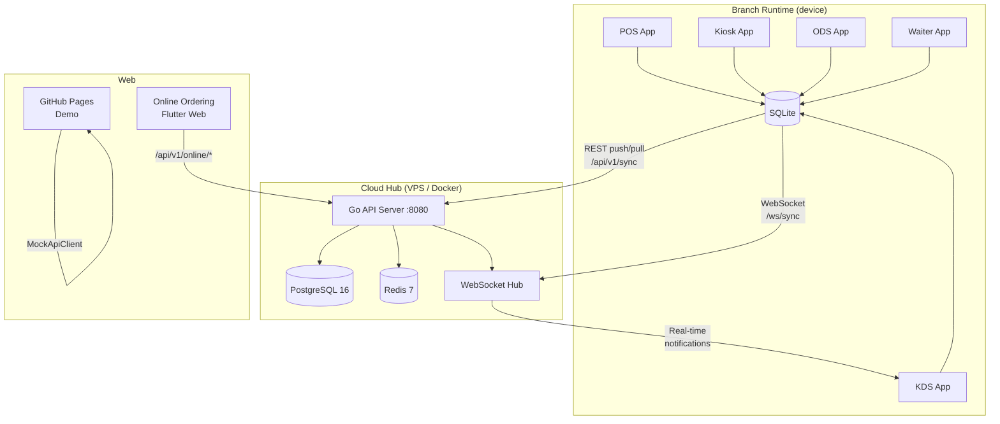

# GastroCore

**Restaurant POS platform for the Swiss market** — offline-first, multi-device, Swiss VAT compliant.

GastroCore is a production-grade restaurant management system built with Flutter (Android + Web) and Go. It runs entirely offline on device and syncs to a cloud hub when connectivity is available. The same codebase ships five distinct apps from a single repository.

---

## Table of Contents

- [Overview](#overview)
- [Architecture](#architecture)
- [Prerequisites](#prerequisites)
- [Quick Start](#quick-start)
- [Build Commands](#build-commands)
- [Flavors](#flavors)
- [Deployment](#deployment)
- [API Summary](#api-summary)
- [Documentation](#documentation)

---

## Overview

| Capability | Detail |
|---|---|
| **Languages** | DE / FR / IT / EN / TR (Swiss quadrilingual + Turkish staff UI) |
| **Currency** | CHF (5-Rappen rounding) |
| **Tax** | Swiss MWST — 8.1% dine-in, 2.6% takeaway, 3.8% accommodation |
| **Database** | SQLite (device) ↔ PostgreSQL 16 (cloud) via Drift ORM |
| **State** | Riverpod 2 + offline-first outbox sync |
| **Backend** | Go 1.22, stdlib `net/http`, gorilla/websocket |
| **Deployment** | Docker Compose / VPS / GitHub Pages (web) |
| **Self-update** | Manifest-based APK update checker (SHA-256 pinned) |
| **A11y** | Semantics labels on till surfaces, locked by regression test |

---

## Architecture



### Data Flow

```
Device action
  → Local SQLite write
  → SyncQueue outbox entry (pending)
  → Background sync timer / connectivity event
  → POST /api/v1/sync/push (batch upload)
  → Server applies + fan-out via WebSocket
  → GET /api/v1/sync/pull (pull changes from other devices)
  → Local SQLite merge (last-write-wins on updated_at)
```

---

## Prerequisites

| Tool | Version | Notes |
|---|---|---|
| Flutter | 3.35.0 | `flutter doctor` must pass |
| Dart SDK | ^3.9.2 | bundled with Flutter |
| Java | 17 (Temurin) | for Android builds |
| Go | 1.22+ | backend only |
| Docker | 24+ | local dev stack |
| Docker Compose | v2 | included with Docker Desktop |
| PostgreSQL | 16 | via Docker or managed service |

---

## Quick Start

### Local development stack

```bash
# Clone
git clone https://github.com/gastrocore/restaurant.git
cd restaurant

# Start Postgres + Redis + Go server
docker-compose up -d

# Server is now at http://localhost:8080
# API health: http://localhost:8080/health
```

### Flutter POS (hot-reload)

```bash
cd apps/pos
flutter pub get
flutter run                           # POS on connected device/emulator
```

### Flutter Web (online ordering)

```bash
cd apps/online
flutter pub get
flutter run -d chrome
```

---

## Build Commands

### Flutter POS — all flavors

```bash
cd apps/pos

# --- POS (default) ---
flutter run                                            # debug on device
flutter build apk --release                           # Android release APK
flutter build appbundle --release                     # Android App Bundle (Play Store)
flutter build web --release                           # Web (optional)

# --- Kiosk ---
flutter run -t lib/main_kiosk.dart
flutter build apk --release -t lib/main_kiosk.dart --flavor kiosk

# --- Kitchen Display Screen (KDS) ---
flutter run -t lib/main_kds.dart
flutter build apk --release -t lib/main_kds.dart --flavor kds

# --- Order Display Screen (ODS) ---
flutter run -t lib/main_ods.dart
flutter build apk --release -t lib/main_ods.dart --flavor ods

# --- Waiter handheld ---
flutter run -t lib/main_waiter.dart
flutter build apk --release -t lib/main_waiter.dart --flavor waiter
```

### Flutter Online Ordering (Web)

```bash
cd apps/online
flutter build web --release --base-href /demo/
```

### Go backend

```bash
cd server

# Run locally (requires DATABASE_URL env var)
go run ./cmd/server

# Build binary
go build -o gastrocore-server ./cmd/server

# Run database migrations
go run ./cmd/migrate

# Seed demo data
go run ./cmd/seed

# Run tests
go test ./...
```

### Docker production build

```bash
# Build server image
docker build -t gastrocore-server:latest ./server

# Full stack
docker-compose -f docker-compose.yml -f docker-compose.prod.yml up -d
```

---

## Flavors

| Flavor | Entry point | Target user | Screen |
|---|---|---|---|
| **pos** | `lib/main.dart` | Cashier / manager | Tablet / desktop |
| **kiosk** | `lib/main_kiosk.dart` | Customer self-service | Large tablet, landscape |
| **kds** | `lib/main_kds.dart` | Kitchen staff | Wall-mounted display |
| **ods** | `lib/main_ods.dart` | Customer order status | Lobby display |
| **waiter** | `lib/main_waiter.dart` | Floor staff | Handheld phone |

**Kiosk specifics:**
- Forced landscape orientation
- Immersive full-screen (no system bars)
- Device ID prefixed `K-` for server-side identification
- 60-second inactivity auto-reset to welcome screen
- No authentication — customer-facing

---

## Deployment

See [docs/DEPLOYMENT.md](docs/DEPLOYMENT.md) for full step-by-step instructions.

**TL;DR — VPS with Docker:**

```bash
# On VPS
git clone https://github.com/gastrocore/restaurant.git
cd restaurant

export JWT_SECRET=<random-64-chars>
export LICENSE_SIGNING_KEY=<ed25519-public-key>

docker-compose up -d

# Nginx reverse proxy to :8080
# SSL via Let's Encrypt / Certbot
```

**GitHub Pages (online ordering demo):**

Triggered automatically on push to `main` via `.github/workflows/deploy-online.yml`.
Demo URL: `https://<org>.github.io/restaurant/demo/`

---

## API Summary

Base URL: `https://your-server.com/api/v1`

All endpoints (except `/health`, `/api/v1/online/menu`, `/api/v1/online/demo`) require:
```
Authorization: Bearer <jwt>
```

| Method | Path | Description |
|---|---|---|
| `POST` | `/auth/login` | PIN login → JWT |
| `POST` | `/auth/refresh` | Refresh token |
| `POST` | `/devices/register` | Register device |
| `POST` | `/sync/push` | Upload change batch |
| `GET` | `/sync/pull` | Download changes |
| `GET` | `/sync/status` | Sync status |
| `GET` | `/ws/sync` | WebSocket real-time sync |
| `GET` | `/menu/categories` | List categories |
| `GET` | `/menu/products` | List products |
| `POST` | `/orders/tickets` | Create ticket |
| `PATCH` | `/orders/tickets/:id` | Update ticket |
| `POST` | `/orders/payments` | Record payment |
| `GET` | `/reports/sales` | Sales by date |
| `GET` | `/reports/products` | Product performance |
| `GET` | `/reports/shifts` | Shift summaries |
| `GET` | `/online/menu` | Public menu (no auth) |
| `POST` | `/online/orders` | Submit online order |
| `GET` | `/health` | Health check |
| `GET` | `/docs` | OpenAPI UI |

Full API reference: [docs/API.md](docs/API.md)

---

## Documentation

| Document | Contents |
|---|---|
| [docs/ARCHITECTURE.md](docs/ARCHITECTURE.md) | System architecture, sync protocol, module map |
| [docs/API.md](docs/API.md) | Full REST API reference with examples |
| [docs/DEPLOYMENT.md](docs/DEPLOYMENT.md) | VPS, Docker, nginx, GitHub Pages deployment |
| [docs/DEVELOPMENT.md](docs/DEVELOPMENT.md) | Dev setup, conventions, PR process |
| [docs/DATABASE.md](docs/DATABASE.md) | Schema reference, migration guide |
| [docs/TESTING.md](docs/TESTING.md) | Running tests, writing tests, coverage |
| [CHANGELOG.md](CHANGELOG.md) | Release history |

Architecture decision records and deep-dive design docs are in [`docs/adr/`](docs/adr/) and `docs/00`–`docs/33`.

---

## License

Proprietary — © 2026 GastroCore / 2TechHub. All rights reserved.
