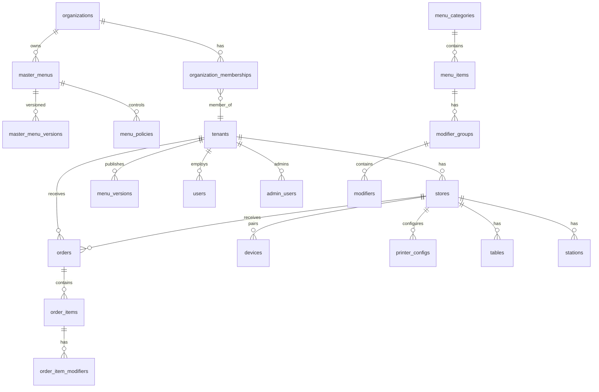
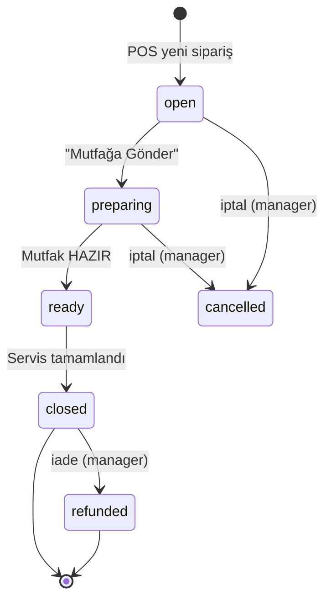
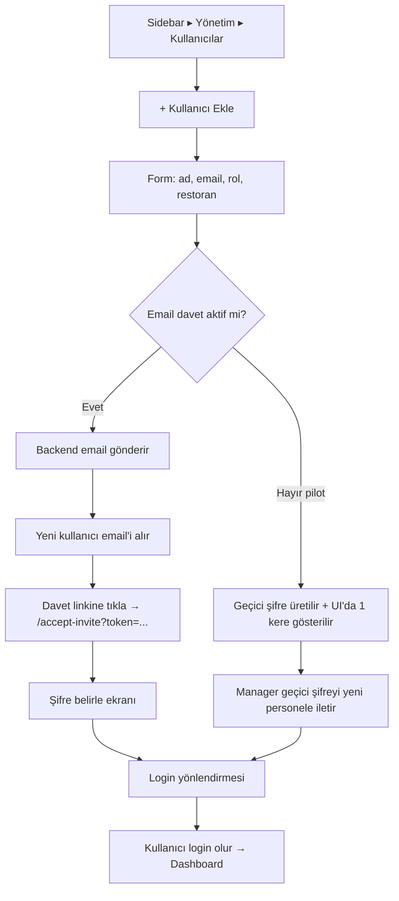
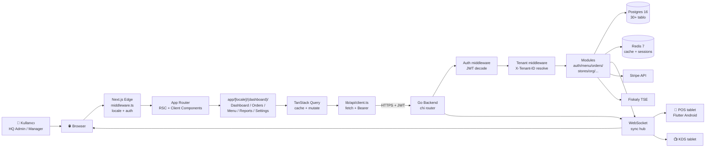
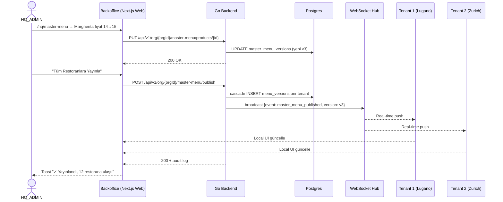

# GastroCore Backoffice — Tasarım Brief'i

> **Hedef kitle:** UI/UX tasarımcı ekibi (Figma + design system)
> **Yazan:** Claude (kod tabanı + ürün stack spec'i ile üretildi)
> **Tarih:** 2026-04-29
> **Sürüm:** v1.1 (Next.js stack refactor — eski Flutter dashboard arşive)
> **Dil:** Türkçe (tasarımcı Türkçe biliyor varsayımıyla)
> **Hedef stack:** Next.js 15 (App Router, RSC) · TypeScript strict · Tailwind 3 · shadcn/ui · TanStack Query/Table · React Hook Form + Zod · Recharts · next-intl · lucide-react · next-themes · Vitest + RTL

---

## 0. Bu doküman ne, ne değil?

Bu doküman, **GastroCore Backoffice** (kod adıyla `apps/backoffice/`, üretimde `https://backoffice.gastrocore.ch`, kullanıcı tarafında "Backoffice", "Yönetici Paneli" veya "Admin Panel" olarak anılan web uygulaması) için bir **tasarım brief**'idir. Tasarımcının Figma dosyasını sıfırdan kurarken ihtiyacı olan tüm bağlamı tek dosyada toplar:

- Ürün özeti, kullanıcı persona'ları, cihaz dağılımı, dil desteği
- Bilgi mimarisi (sidebar ağacı, role-based görünürlük matrisi)
- Ekran-ekran feature haritası (~35 ekran, URL pattern, veri kaynağı, state'ler)
- Veri modeli özeti (Postgres tabloları, multi-tenant + HQ chain modeli)
- 10 kritik kullanıcı akışı (ASCII flowchart + nesir anlatım)
- Tasarım sistemi (mevcut renk/tipo/spacing token'ları, component primitive'leri)
- Mobile-first layout kuralları (kullanıcının %60'ı telefon)
- Branding & tenant başına customization
- Açık tasarım soruları (5 dilde uzun string, 50 restoran tenant switcher, vb.)
- Inspirasyon referansları (Toast, Square, Lightspeed, Otter, Deliverect)
- Phased rollout planı (v0.1 pilot → v1.0)
- Designer'ın deliverable beklentileri (Figma file scope'u)

> **Bu doküman ne DEĞİL?**
> - POS tablet uygulamasının tasarım brief'i değildir — o `design/UI_UX_DESIGN_BRIEF.md` altındadır (S01-S23 ekranları, dark theme tablet POS).
> - Mühendislik mimarisi dokümanı değildir — kod referansları ekran-veri eşleşmesini netleştirmek için verilmiştir, implementation kılavuzu olarak kullanılamaz.
> - Backoffice POS'un üzerine geçmez; **iki ayrı uygulamadır**: POS (Flutter Android tablet, dark, offline-first) ve Backoffice (Next.js Web, responsive, online-first, server-side rendered).

> **Önemli kod tabanı notu:**
> Backoffice'in fiili dizin yolu `apps/backoffice/`'tır (Next.js 15, App Router). Eski `apps/dashboard/` Flutter Web prototipi **deprecated**'dir — pilot kararı sonrası Next.js'e geçildi (TypeScript strict, RSC, daha hızlı bundle, daha geniş ekosistem). Eski Flutter dashboard kodu repoda referans amaçlı bırakılmıştır ve **arşive alınacaktır**; tasarımcı oradaki widget'ları implementasyon kılavuzu olarak kullanmamalı. Üretimde canlı: `https://backoffice.gastrocore.ch`. Detay: §13 "Mevcut Pilot Stack".

---

## 1. Ürün Özeti

### 1.1 GastroCore nedir?

GastroCore, küçük-orta ölçekli restoranlar ve **çok şubeli (chain) restoran zincirleri** için tasarlanmış bütünleşik bir restoran işletim platformudur. Üç ana uygulamadan oluşur:

| Uygulama | Hedef cihaz | Kullanıcı | Tema | Mevcut durum |
|---------|-------------|-----------|------|--------------|
| **POS** | 10" Android tablet (yatay) | Garson, kasiyer, mutfak | Dark, offline-first | Pilot 2026-05 |
| **Backoffice** (bu brief) | Web (laptop %40, telefon %60) | Restoran sahibi, müdür, HQ admin | Light + Dark | **Production · canlı** (Next.js 15) |
| **Boss** (gelecek) | iOS/Android telefon | Restoran sahibi (sahada/yolda) | Mobile native | Phase 5 — başlatılmadı |

### 1.2 Backoffice'in işi

POS sahada satışları kayıt eder, **Backoffice ise stratejik kararları yönetir**:

- **Menü hayatı:** kategori/ürün/modifier CRUD, fiyatlama, stok bayrakları, "POS'a Yayınla" diff & apply
- **Sipariş gözetimi:** geçmiş siparişler, status filtreleri, iade işleme, CSV export
- **Operasyonel raporlar:** günlük ciro, top sellers, saatlik dağılım, aylık MWST/KDV ihracı
- **Personel yönetimi:** garson/kasiyer/müdür hesapları, PIN reset, rol atama, audit log
- **Çoklu lokasyon yönetimi:** zincir-merkez (HQ) tek panelden tüm restoranların menüsünü ve raporunu yönetir
- **Cihaz yönetimi:** POS tabletleri eşle, KDS pair, yazıcı yapılandır
- **Vergi & faturalama:** MWST profilleri, fiş şablonları, ödeme yöntemleri, QR-Bill, fiscal (Fiskaly TSE) bağlantısı

### 1.3 Pilot vakası: İsviçre fine-dining restoranı

İlk müşteri İsviçre'de tek lokasyonlu fine-dining restoranıdır (target launch: **2026-05-01**). Bu restoran:

- Backoffice'i günlük ~1 saat kullanacak (sahip + müdür ortak hesap)
- En kritik sayfalar: **Dashboard, Menu Editor, Orders list, Daily Report, MWST export**
- HQ chain feature'ları henüz **test/canlı kullanım dışında** (master menu, multi-store) — kod var ama pilot bunu kullanmayacak
- 5 dilden Almanca + İngilizce zorunlu, diğerleri (TR/FR/IT) takip eder

### 1.4 Cihaz dağılımı (gerçek beklenti)

| Cihaz | Kullanım payı | Kullanım senaryosu |
|-------|---------------|---------------------|
| **Telefon (mobile)** | **%60** | Sahip restoran dışında, hızlı kontrol: bugünkü ciro, sipariş anomalisi, son menü değişikliğini onayla |
| **Laptop (desktop ≥ 1280px)** | %40 | Müdür, ofiste haftalık menü güncelleme, rapor çıkarma, kullanıcı yönetimi, restoran ekleme |
| **Tablet (orta yelpaze)** | < %5 | Yedek kullanım — design hedefi değil ama kırılmamalı |

**Tasarım sonucu: mobile-first.** Tüm flow'lar önce 360-414px (iPhone/Android dikey) için tasarlanır, sonra laptop'a genişletilir. Tablet otomatik olarak ikisinin arasında düşer.

### 1.5 Diller (i18n)

`apps/backoffice/messages/` altında **5 dil** dosyası vardır:

| Kod | Dil | Durum (kod) | Pilot önceliği |
|-----|-----|-------------|----------------|
| `de` | Deutsch | ✅ Tam | **P0 — varsayılan** |
| `en` | English | ✅ Tam | **P0** |
| `tr` | Türkçe | ✅ Tam (`messages/tr.json` ~157 anahtar — nested) | P1 |
| `fr` | Français | ✅ Tam | P1 |
| `it` | Italiano | ✅ Tam | P2 |

**Sağdan-sola (RTL) desteği yok.** Tüm diller LTR.

> Tasarımcı uyarısı: Almanca string'ler genellikle Türkçe/İngilizce karşılığından **%30-40 daha uzun** (örn. "Einstellungen" vs "Settings"). Layout testleri Almanca uzunlukta yapılmalı.

### 1.6 Kullanıcı persona'ları (5 tane)

Backend JWT claim olarak `org_role` enum'unda tutulur (`server/migrations/014_hq_chain.up.sql`). Frontend bu enum'a göre sidebar item'ları gösterir/gizler.

---

#### 👑 Persona 1: HQ_ADMIN — "Zincir Sahibi"

**Profil:** 3+ restoranı olan zincir sahibi veya zincir genel müdürü. Restoranların hepsinde tüm yetkili.

**Yaş aralığı:** 35-55. **Cihaz:** Laptop (ofiste) %50, telefon (yolda) %50. **Teknik seviye:** Orta — Excel'i iyi kullanır, dashboard'ları okur.

**Günlük ritüel:**
1. Sabah kahve eşliğinde telefondan tüm lokasyonların dünkü cirosunu kontrol et
2. Anomali varsa (bir lokasyon %30 düşmüş) içeri gir, detaya bak
3. Haftada bir laptop'tan **HQ Master Menu**'ye yeni mevsim ürünü ekle, tüm lokasyonlara yayınla
4. Aylık MWST raporunu muhasebeciye gönder

**Erişim:** Her şey. Tüm sayfalar, tüm tenant'lar, master menü düzenleme, kullanıcı CRUD, organizasyon ayarları.

**Tasarım önceliği:**
- Çoklu-tenant **hızlı geçiş** (50 restoranda bile akıcı switcher)
- Mobile dashboard'da en kritik 4 KPI ilk ekranda görünmeli
- "POS'a Yayınla" mobil olarak da güvenli (yanlışlıkla tetiklenmesin)

---

#### 👔 Persona 2: HQ_MANAGER — "Zincir Operasyon Müdürü"

**Profil:** Zincir merkezi operasyon yöneticisi. Sahip değil, çalışan. Read-mostly + kısıtlı yazma yetkisi.

**Yaş aralığı:** 28-45. **Cihaz:** Laptop %70, telefon %30. **Teknik seviye:** İyi — verileri kıyaslayıp aksiyon önerisi üretir.

**Günlük ritüel:**
1. Sabah HQ Toplu Raporları aç, tüm lokasyonların dünkü performansını yan yana gör
2. En zayıf lokasyonun müdürüne mesaj at (Backoffice dışı kanal)
3. Haftalık menü öneri taslağı hazırla, HQ_ADMIN'in onayına sun
4. Yeni restoran ekleme önerisi yap (ama gerçek ekleme HQ_ADMIN'in)

**Erişim:** **Read** her yere; **write** sınırlı: master menü taslak, raporlar, kendi profili. Master menü "Publish" butonu bu kişide **disabled** görünür (tooltip: "Sadece HQ Admin yayınlayabilir").

**Tasarım önceliği:**
- Karşılaştırmalı tablolar (lokasyon × KPI matris)
- Yazma yetkisi yokken read-only state'ler net belirsin (gri buton + tooltip)

---

#### 🍽️ Persona 3: RESTAURANT_MANAGER — "Restoran Müdürü"

**Profil:** Tek restoranın günlük operasyon müdürü. Restoran kapsamında tüm yetkili, zincir bilgilerine erişemez.

**Yaş aralığı:** 25-50. **Cihaz:** Laptop %30, telefon %70 (çoğu zaman sahada — telefonda). **Teknik seviye:** Orta — POS kullanıyor, raporları okuyor, ama API/IT detayına girmek istemez.

**Günlük ritüel:**
1. Sabah açılışta telefondan dün gece kapanışını kontrol et (Z-report eşleşiyor mu?)
2. Stok azalmış ürünü "tükendi" işaretle (Menu sayfası → product → toggle)
3. Haftalık personel maaş hazırlığı için Personel Performans raporunu çıkar
4. Yeni garson eklendiğinde kullanıcı oluştur, PIN ata, POS'ta paired et

**Erişim:** Kendi tenant'ı (restoranı). Master menü göremez. HQ Master Menu sayfası sidebar'da **gözükmez** (gizli). Kullanıcılar: sadece kendi restoranındakileri görür.

**Tasarım önceliği:**
- Mobile-first kritik (telefonda yapacağı 5 iş 3 tıkta bitsin)
- Tükendi/mevcut toggle çok büyük dokunma alanı, swipe-friendly
- Master menü locked ürünlerin fiyatını değiştirme denerse — açık feedback

---

#### 🧑‍🍳 Persona 4: RESTAURANT_STAFF — "Personel (Sınırlı Yetkili)"

**Profil:** Restoran müdürünün yardımcısı / shift supervisor. Müdür yokken günlük tek tük admin işi yapar.

**Yaş aralığı:** 20-40. **Cihaz:** Telefon %90, laptop %10. **Teknik seviye:** Düşük-Orta — POS'u rahat kullanıyor ama Backoffice'i 2-3 sayfa için açıyor.

**Günlük ritüel:**
1. Garson izinli olunca onun yerine yeni ürün dene, "indirimli" işaretle
2. Akşam günlük rapor PDF'ini sahibe yolla
3. Yanlış basılan fişi iade et (manager onay PIN'i ile)

**Erişim:** Restoran kapsamında sadece görüntüleme + sınırlı düzenleme. Kullanıcı yönetimi YOK. Restoran ayarları YOK. Audit log YOK. Master menu görünmez.

**Tasarım önceliği:**
- Sidebar bu rolde **çok kısa** olmalı: Dashboard, Orders, Menu (read), Reports → 4 madde
- "Yapabileceğim/yapamayacağım" çok net görünmeli (boş state'ler "Bu sayfaya erişim yok" yerine sayfayı gizle)

---

#### 🖥️ Persona 5: POS_OPERATOR — "POS Cihaz Hesabı"

**Profil:** İnsan değil — bir tabletin servis hesabı. Backoffice'e nadiren login olur. Sadece `device pairing` flow'unda kısa süre.

**Erişim:** Sadece `auth/login` + `devices/pair` endpoint'i. Backoffice UI'da **görünmez** (login olsa bile redirect → "Bu hesap web panele uygun değil. Lütfen POS uygulamasını açın.").

**Tasarım önceliği:** Bu persona için ayrı UI tasarlanmaz; **çıkış mesajı** tasarımı yeterli (error illustration + 1 cümle).

---

### 1.7 Persona × cihaz × günlük süre matrisi

| Persona | Telefon | Laptop | Günlük süre | Aylık unique ekran |
|---------|---------|--------|-------------|---------------------|
| HQ_ADMIN | %50 | %50 | 30-60 dk | ~25 ekran |
| HQ_MANAGER | %30 | %70 | 1-2 saat | ~20 ekran |
| RESTAURANT_MANAGER | %70 | %30 | 30-90 dk | ~15 ekran |
| RESTAURANT_STAFF | %90 | %10 | 5-15 dk | ~6 ekran |
| POS_OPERATOR | — | — | <1 dk | 1 ekran (login) |

**Sonuç:** Mobile-first değil sadece — **persona-aware mobile-first**. RESTAURANT_STAFF telefondan 5 dakika geçirir, dashboard'unun 3-4 widget'ı var. HQ_ADMIN aynı dashboard'a girince 12-15 widget görür.

---

## 2. Bilgi Mimarisi

### 2.1 Sidebar ağacı (Next.js implementasyonu — nav-config-driven)

> 🧭 **Mimari:** Sidebar **veri-güdümlü**'dür: `apps/backoffice/lib/nav-config.ts` içinde TypeScript tip-güvenli bir konfigürasyon dizisi (NavGroup[] + NavItem[]) tanımlıdır. `apps/backoffice/components/shell/sidebar.tsx` bu config'i okur ve render eder. Yeni bir madde eklemek için config'e bir item eklemek yeterlidir; sidebar bileşeni dokunulmaz. Her grup **collapsible** (açılır/kapanır) ve son durumu **localStorage**'da persist eder (`gastrocore.sidebar.collapsed = ["promotions","hq"]`).
>
> Toplamda **14 grup × ortalama 4 sub-item = ~56 nav item**. Aşağıda v1.0 hedef ağacı — pilot v0.1 bunun bir alt kümesini gösterir (bkz. **§11 Phased rollout**). Role-based filter `nav-config.ts`'de her item'ın `roles: OrgRole[]` alanı ile yapılır; runtime'da `useSession().org_role`'a göre item array filtrelenir, böylece **kullanıcının yetkisi olmayan item hiç render olmaz**.

```
┌─ Sidebar Header ─────────────────────────────┐
│  [GC logo]  GastroCore                       │
│  ────────────────────                        │
│  [Tenant switcher: "Lugano Bistro ▼"]       │  ← Tek-restoran modunda gizli; HQ modunda görünür
└──────────────────────────────────────────────┘

──────── ÖZET (Overview) ────────
📊 Dashboard                                      → /
🧾 Siparişler (canlı + geçmiş)                    ▼
   ├─ Tüm Siparişler                             → /orders
   ├─ Canlı Akış                                 → /orders/live
   ├─ İade & Düzeltme                            → /orders/refunds
   └─ Online Siparişler                          → /orders/online

──────── İŞLETME (Operations) ────────
🍽️ Salon & Masalar                                ▼
   ├─ Floor Plan                                 → /tables/floor
   ├─ Masalar                                    → /tables
   ├─ Bölgeler (Zone)                            → /tables/zones
   └─ Rezervasyonlar                             → /reservations

📖 Menü                                           ▼
   ├─ Kategoriler                                → /menu/categories
   ├─ Ürünler                                    → /menu/products
   ├─ Modifier'lar                               → /menu/modifiers
   ├─ Combo / Set Menü                           → /menu/combos
   └─ Yayın Geçmişi                              → /menu/versions

🎯 Promosyonlar                                   ▼
   ├─ Happy Hour                                 → /promotions/happy-hour
   ├─ İndirimler                                 → /promotions/discounts
   ├─ Kampanyalar                                → /promotions/campaigns
   └─ Sadakat (Loyalty)                          → /promotions/loyalty

──────── DATA ────────
📈 Raporlar                                       ▼
   ├─ Ciro                                       → /reports/sales
   ├─ Top Sellers                                → /reports/top-sellers
   ├─ Saatlik Heatmap                            → /reports/hourly
   ├─ Personel Performansı                       → /reports/staff
   ├─ Vardiya Raporu                             → /reports/shifts
   └─ Toplu Export                               → /reports/export

🧮 Vergi & Muhasebe                               ▼
   ├─ MWST / KDV                                 → /tax/mwst
   ├─ DSFinV-K (Almanya)                         → /tax/dsfinvk
   ├─ Vergi Profilleri                           → /tax/profiles
   └─ Muhasebe Export                            → /tax/accounting

👥 Müşteriler [SOON]                              ▼
   ├─ Müşteri Listesi                            → /customers
   ├─ Sadakat İşlemleri                          → /customers/loyalty
   └─ GDPR / KVKK                                → /customers/privacy

📦 Stok [SOON]                                    ▼
   ├─ Stok Listesi                               → /inventory
   ├─ Hareketler                                 → /inventory/movements
   └─ Düşük Stok Uyarıları                       → /inventory/alerts

──────── YÖNETİM ────────
🧑‍🍳 Personel                                      ▼
   ├─ Kullanıcılar                               → /users
   ├─ Vardiya Çizelgesi                          → /staff/schedule
   ├─ PIN Yönetimi                               → /staff/pins
   └─ Erişim Kayıtları                           → /staff/access

🏪 Restoranlar                                    ▼
   ├─ Restoran Listesi                           → /restaurants
   ├─ Yeni Restoran                              → /restaurants/new
   ├─ Açılış Saatleri (toplu)                    → /restaurants/hours
   └─ Online Sipariş Ayarları                    → /restaurants/online-config

📡 Cihazlar & Donanım                             ▼
   ├─ POS Cihazları                              → /devices/pos
   ├─ KDS Cihazları                              → /devices/kds
   ├─ Yazıcılar                                  → /devices/printers
   └─ Pairing & Eşleme                           → /devices/pairing

📜 Audit Log                                      → /audit

──────── HQ (yalnız HQ_ADMIN/HQ_MANAGER) ────────
🏢 HQ                                             ▼
   ├─ Master Menü                                → /hq/master-menu
   ├─ Menü Kilitleri (Policy)                    → /hq/policies
   ├─ Toplu Raporlar                             → /hq/reports
   ├─ Organizasyon                               → /hq/org
   └─ Faturalama & Plan                          → /hq/billing

──────── AYARLAR ────────
⚙️ Hesabım                                        ▼
   ├─ Profil                                     → /settings/profile
   ├─ Şifre & 2FA                                → /settings/security
   └─ Bildirimler                                → /settings/notifications

🔌 Entegrasyonlar                                 ▼
   ├─ API Anahtarları                            → /settings/api-keys
   ├─ Stripe                                     → /integrations/stripe
   ├─ ERPNext                                    → /integrations/erpnext
   ├─ Fiskaly TSE                                → /integrations/fiskaly
   └─ QR-Bill / Webhook                          → /integrations/webhooks

🛠️ Geliştirici (yalnız HQ_ADMIN)                  ▼
   ├─ API Docs (Swagger)                         → /dev/api-docs
   ├─ Webhook Logs                               → /dev/webhooks
   ├─ Sync Cursor                                → /dev/sync
   └─ Feature Flags                              → /dev/flags

──────── footer ────────────────────────────
🌓 Tema toggle (next-themes — light / dark / system)
🌍 Dil 5 bayrak: 🇩🇪 🇬🇧 🇹🇷 🇫🇷 🇮🇹  (next-intl)
[Avatar]  Müdür Yiğit
          RESTAURANT_MANAGER
          [↪ Çıkış]
```

**Sayım:**
- **14 collapsible grup** (Dashboard ve Audit Log standalone item'lar grup olarak sayılmaz, ama nav-config'de `type: "item"` olarak tek başına render edilirler).
- **~56 sub-item** (her grup ortalama 3-5 madde).
- **Role-bazlı filter:** ör. RESTAURANT_STAFF için sadece 4 grup (~9 item) render olur; HQ_ADMIN için 14 grup (~56 item) tam render olur.
- **localStorage anahtarı:** `gastrocore.sidebar.collapsed` (string array — kapalı grup id'leri).
- **localStorage anahtarı 2:** `gastrocore.sidebar.pinned` (favori item'lar — gelecek feature).

**TypeScript spec (nav-config.ts şeması):**
```ts
type OrgRole = "HQ_ADMIN" | "HQ_MANAGER" | "RESTAURANT_MANAGER" | "RESTAURANT_STAFF";

type NavItem = {
  id: string;                  // "menu.products" — i18n key + storage key
  href: string;                // "/menu/products"
  icon: LucideIcon;            // import from lucide-react
  badge?: () => Promise<string>; // dinamik (ör. "8 yeni sipariş")
  roles: OrgRole[];            // hangi roller görür
  flag?: "SOON" | "BETA";      // opsiyonel rozet
};

type NavGroup = {
  id: string;                  // "operations" — collapsible state key
  label: string;               // i18n key
  icon?: LucideIcon;
  defaultOpen?: boolean;       // ilk render açık mı
  items: NavItem[];
  roles: OrgRole[];             // grup başlığı görünürlüğü
};

type NavSection = {
  label?: string;              // "Özet", "İşletme", vb. — başlık
  groups: (NavGroup | NavItem)[];  // groups + standalone items karışık
};

export const navConfig: NavSection[] = [/* ... */];
```

### 2.2 Sidebar item detay tablosu

| Grup / Item | Açıklama | Asıl persona | Sayfa türü |
|-------------|----------|--------------|------------|
| **Dashboard** | Ana panel, KPI + chart + top sellers | Hepsi | dashboard |
| **Siparişler** | Tüm siparişler, filtre + detay dialog | RM, RS, HQA, HQM | liste |
| **Menü ▸ Kategoriler** | Kategori CRUD, sıralama, renk/ikon | RM, HQA | liste + form |
| **Menü ▸ Ürünler** | Ürün CRUD, fiyat, stok, modifier ekle | RM, HQA | liste + form |
| **Menü ▸ Modifier'lar** | Modifier grup ve seçenekleri yönet | RM, HQA | liste + form |
| **Menü ▸ Yayın Geçmişi** | Geçmişteki menü yayınları, diff, rollback | RM (read), HQA | liste |
| **Promosyonlar ▸ Happy Hour** | Saat aralıklı indirim kuralları | RM, HQA | liste + form |
| **Promosyonlar ▸ İndirimler** | Tek seferlik / kategori bazlı indirimler | RM, HQA | liste + form |
| **Promosyonlar ▸ Kampanyalar** | Kombo ürün, hediye, BOGO | RM, HQA | liste + form |
| **Raporlar ▸ Ciro** | Günlük/haftalık/aylık ciro, chart | Hepsi | dashboard |
| **Raporlar ▸ Top Sellers** | En çok satan ürünler tablosu | Hepsi | tablo |
| **Raporlar ▸ Saatlik** | Saat bazlı satış histogramı | RM, HQA, HQM | dashboard |
| **Raporlar ▸ Personel** | Vardiyaya göre satış | RM, HQA, HQM | tablo |
| **Raporlar ▸ MWST** | KDV/MWST raporu, ay seçimi, CSV | RM, HQA | tablo + export |
| **Raporlar ▸ Export** | Toplu CSV/PDF export merkezi | RM, HQA, HQM | form |
| **Müşteriler** | CRM (placeholder, "yakında") | RM, HQA | placeholder |
| **Stok** | Inventory (placeholder, "yakında") | RM, HQA | placeholder |
| **Yönetim ▸ Kullanıcılar** | Admin user CRUD, PIN reset | RM (kendi rest.), HQA | liste + form |
| **Yönetim ▸ Restoranlar** | Restoran listesi, detay 7-tab | HQA, HQM (read), RM (kendi) | liste + detay |
| **Yönetim ▸ Cihazlar** | POS/KDS pair, yazıcı yapılandır | RM, HQA | liste + form |
| **Yönetim ▸ Audit Log** | Tüm değişiklik kayıtları, filtre | HQA, HQM | tablo |
| **HQ ▸ Master Menü** | Zincir master menüsü düzenle | HQA (write), HQM (read) | liste + form |
| **HQ ▸ Menü Kilitleri** | FLEXIBLE / PRICE_LOCKED / FULLY_LOCKED policy | HQA | tablo + form |
| **HQ ▸ Toplu Raporlar** | Tüm restoranlar yan yana | HQA, HQM | dashboard + tablo |
| **HQ ▸ Organizasyon** | Org genel bilgi, plan, faturalama | HQA | form (3-tab) |
| **Ayarlar ▸ Profil** | İsim, email, avatar | Hepsi | form |
| **Ayarlar ▸ Şifre & 2FA** | Şifre değişikliği, 2FA toggle | Hepsi | form |
| **Ayarlar ▸ Bildirimler** | Email/push tercihleri | Hepsi | form |
| **Ayarlar ▸ API Anahtarları** | Üçüncü-taraf entegrasyon key'leri | HQA, RM | liste + form |
| **Ayarlar ▸ Entegrasyonlar** | Stripe, ERPNext, Fiskaly bağlantıları | HQA | liste + form |

### 2.3 Role-based görünürlük matrisi

✅ = görünür ve yazılabilir, 👁️ = görünür ama read-only, ⛔ = gizli (sidebar'da gözükmez), 🔒 = görünür ama disabled (tooltip ile)

| Sidebar item | HQ_ADMIN | HQ_MANAGER | RESTAURANT_MANAGER | RESTAURANT_STAFF | POS_OPERATOR |
|--------------|:--------:|:----------:|:------------------:|:----------------:|:------------:|
| Dashboard | ✅ (org-wide) | 👁️ (org-wide) | ✅ (kendi rest.) | 👁️ (kendi rest.) | ⛔ |
| Siparişler | ✅ | 👁️ | ✅ | 👁️ | ⛔ |
| Menü ▸ Kategoriler | ✅ | 👁️ | ✅ (locked olmayan) | ⛔ | ⛔ |
| Menü ▸ Ürünler | ✅ | 👁️ | ✅ (locked olmayan) | ⛔ | ⛔ |
| Menü ▸ Modifier'lar | ✅ | 👁️ | ✅ | ⛔ | ⛔ |
| Menü ▸ Yayın Geçmişi | ✅ | 👁️ | 👁️ | ⛔ | ⛔ |
| Promosyonlar ▸ * | ✅ | 👁️ | ✅ | ⛔ | ⛔ |
| Raporlar ▸ Ciro/Top/Saatlik | ✅ | ✅ | ✅ | 👁️ | ⛔ |
| Raporlar ▸ Personel | ✅ | ✅ | ✅ | ⛔ | ⛔ |
| Raporlar ▸ MWST | ✅ | ✅ | ✅ | ⛔ | ⛔ |
| Müşteriler [SOON] | ✅ | 👁️ | ✅ | ⛔ | ⛔ |
| Stok [SOON] | ✅ | 👁️ | ✅ | ⛔ | ⛔ |
| Yönetim ▸ Kullanıcılar | ✅ (tüm org) | 👁️ | ✅ (kendi rest.) | ⛔ | ⛔ |
| Yönetim ▸ Restoranlar | ✅ | 👁️ | 👁️ (kendi rest. detay) | ⛔ | ⛔ |
| Yönetim ▸ Cihazlar | ✅ | 👁️ | ✅ | ⛔ | ⛔ |
| Yönetim ▸ Audit Log | ✅ | ✅ | 👁️ (kendi rest.) | ⛔ | ⛔ |
| HQ ▸ Master Menü | ✅ | 👁️ | ⛔ | ⛔ | ⛔ |
| HQ ▸ Menü Kilitleri | ✅ | ⛔ | ⛔ | ⛔ | ⛔ |
| HQ ▸ Toplu Raporlar | ✅ | ✅ | ⛔ | ⛔ | ⛔ |
| HQ ▸ Organizasyon | ✅ | 👁️ | ⛔ | ⛔ | ⛔ |
| Ayarlar ▸ Profil/Şifre/Bildirim | ✅ (kendisi) | ✅ | ✅ | ✅ | ⛔ |
| Ayarlar ▸ API Anahtarları | ✅ | ⛔ | ✅ (kendi rest.) | ⛔ | ⛔ |
| Ayarlar ▸ Entegrasyonlar | ✅ | 👁️ | ⛔ | ⛔ | ⛔ |

> Tasarım kuralı: **gizli (⛔) madde sidebar'da hiç çizilmez.** Boş gri "Erişim yok" görmek istemiyoruz — sidebar her persona için sadece kullanabileceği item'ları gösterir, böylece her rol kendi panelini "tamamlanmış" hisseder.

> Tasarım kuralı 2: **disabled (🔒) madde tıklanır ama disabled state'te. Hover'da tooltip:** "Bu işlem için HQ Admin yetkisi gerekli." Yazma butonları (Submit, Save, Publish) bu prensipte disabled olur, sayfa içeriği görüntülenir.

### 2.4 Header & global navigation

Tüm sayfalarda sabit üst bar (mobile'da farklı, bkz. §7):

```
┌─────────────────────────────────────────────────────────────────────────┐
│  [☰]  Sayfa Başlığı / Breadcrumb              [🔔3] [🌍▼] [Avatar▼]    │
└─────────────────────────────────────────────────────────────────────────┘
```

- `[☰]` — sadece mobile/tablet'te görünür (sidebar drawer toggle); desktop'ta sidebar zaten açık olduğu için yoktur
- **Breadcrumb:** `Menü ▸ Ürünler ▸ Margherita Pizza` (mobile'da sadece son seviye)
- **Bildirimler `[🔔3]`:** badge sayısı; popover ile son 5 bildirim
- **Dil bayrağı:** dropdown ile 5 dil; seçim sonrası sayfa yeniden render
- **Avatar dropdown:** Profil / Şifre / Tema / Çıkış

### 2.5 Tenant switcher (HQ modunda)

HQ_ADMIN/HQ_MANAGER login olduğunda sidebar header'ında bir restoran seçici görür:

```
┌─────────────────────────────┐
│ 🏢 Restoran                 │
│ ┌─────────────────────────┐ │
│ │ Lugano Bistro      ▼   │ │   ← Açılır: arama + favori + tüm liste
│ └─────────────────────────┘ │
│ ⚡ Tüm Restoranlar          │   ← "Aggregate" mod (HQ raporları için)
└─────────────────────────────┘
```

Açıldığında:

```
┌──────────────────────────────────┐
│  🔍 Restoran ara...              │
├──────────────────────────────────┤
│  ⭐ Favoriler                     │
│  ▸ Lugano Bistro                 │
│  ▸ Zürich Center                 │
├──────────────────────────────────┤
│  📍 Tümü (12)                    │
│  ▸ Basel Hauptbahnhof            │
│  ▸ Bern Marktgasse               │
│  ▸ Geneva Cornavin               │
│  ...                              │
├──────────────────────────────────┤
│  ⚡ Tüm Restoranlar (Aggregate)  │
└──────────────────────────────────┘
```

> Tasarım sorunu: 50+ restoran olunca düz dropdown çirkin. Çözüm: arama + favori + sticky "Tümü Aggregate" butonu (bkz. §9 açık sorular).

---

## 3. Ekran-Ekran Feature Haritası

> Toplam **~37 ekran**. Her ekran için: amaç, URL pattern, kullanıcı eylemleri, veri kaynağı (Go endpoint), state'ler, sonraki adımlar, açık sorular.
>
> Endpoint kaynağı: `server/internal/*/module.go` — gerçek backend route'ları kod tabanından çıkarıldı.

### 3.1 Auth & Onboarding

---

#### **EKRAN 01 — Login**

- **URL:** `/login`
- **Amaç:** Email + şifre ile Backoffice'e giriş
- **Persona:** Hepsi
- **Eylemler:**
  - Email + şifre + "Beni hatırla" + "Giriş Yap" butonu
  - "Şifremi unuttum" link (henüz implement edilmedi — placeholder olur)
  - Dil seçici (5 bayrak — login öncesi de görünür)
  - Karanlık/açık tema toggle (login öncesi)
- **Veri kaynağı:** `POST /api/v1/auth/admin/login` — body `{ email, password }` → response `{ token, user: { id, name, email, role, organization_id, tenant_id } }`
- **State'ler:**
  - `idle` — form boş
  - `validating` — input level Zod hata (ör. invalid email format)
  - `submitting` — buton spinner, form disabled
  - `error` — alert üstte ("Geçersiz e-posta veya şifre" — `messages/tr.json` `auth.loginError`)
  - `success` — kısa toast → `/` dashboard redirect
- **Sonraki adım:** Dashboard
- **Açık sorular:**
  - Şifremi unuttum akışı tasarlanmadı — backend'de endpoint de yok henüz
  - 2FA destek planı var ama henüz yok — login'de TOTP step gerekecek mi?
- **Tasarım önceliği:** Logo brand'ı, dil bayrağı yerleşimi, "Beni hatırla" toggle'ın checkbox vs switch tartışması (mobile'da switch tercih)

**ASCII wireframe (mobile, 414px):**
```
┌──────────────────────────┐
│  🇩🇪 🇬🇧 🇹🇷 🇫🇷 🇮🇹  🌓  │   ← üst bar (dil + tema)
│                          │
│      ┌────────────┐      │
│      │ [GC logo]  │      │
│      │ GastroCore │      │
│      └────────────┘      │
│                          │
│  Restoran müdürleri      │
│  için erişim             │
│                          │
│  E-posta adresi          │
│  ┌────────────────────┐  │
│  │                    │  │
│  └────────────────────┘  │
│                          │
│  Şifre              👁  │
│  ┌────────────────────┐  │
│  │                    │  │
│  └────────────────────┘  │
│                          │
│  [✓] Oturumu açık tut    │
│                          │
│  ┌────────────────────┐  │
│  │      Giriş Yap     │  │   ← primary, full-width
│  └────────────────────┘  │
│                          │
│  Şifremi unuttum         │
└──────────────────────────┘
```

---

#### **EKRAN 02 — Demo / Yakında Login Variant**

- **URL:** `/login?demo=1` (mock mode — `apps/backoffice/lib/api/client.ts` `NEXT_PUBLIC_DEMO_MODE` env flag fallback)
- **Amaç:** Demo kullanıcılar için hazır kimlik (email pre-filled, password "demo")
- **Persona:** Demo izleyici (satış)
- **State özelliği:** Banner üstte "🧪 Bu demo'dur. Veriler statik." (warning yellow)
- **Sonraki adım:** Mock dashboard

---

### 3.2 Dashboard

---

#### **EKRAN 03 — Dashboard (Ana Panel)**

- **URL:** `/`
- **Amaç:** Restoranın/zincirin günlük performans özeti, hızlı bakış
- **Persona:** Hepsi (rol'e göre içerik değişir)
- **Eylemler:**
  - Date range picker (Son 7 gün / 30 / 90 / Özel)
  - Tenant switcher (HQ rolleri için)
  - "Yenile" butonu
  - KPI card tıklandığında ilgili rapora git
  - Top items satırı tıklandığında ürün detayı
- **Veri kaynağı:**
  - `GET /api/v1/dashboard/stats?range=7d` → `{ totalRevenue, orderCount, avgTicket, activeOrders, tablesOccupied, staffOnShift }`
  - `GET /api/v1/dashboard/revenue?range=7d` → `[{ date, amount }]` (chart için 7-90 nokta)
  - `GET /api/v1/menu/products?sort=salesDesc&limit=5` (top sellers için — adapt edilecek)

**KPI grid'i (4-6 kart):**

| KPI | Metrik | Sub-text | Trend okuk |
|-----|--------|----------|------------|
| Günlük Ciro | CHF 2.847,50 | +12% dünden | ↗ yeşil |
| Sipariş Sayısı | 87 | +5 dünden | ↗ yeşil |
| Ortalama Fiş | CHF 32,73 | +%4 | ↗ yeşil |
| Aktif Sipariş | 12 | 4 mutfakta, 8 servis | nötr |
| Dolu Masalar | 8/24 | %33 | nötr |
| Vardiyadaki Personel | 5 | 2 garson, 1 kasiyer, 2 mutfak | nötr |

**Chart:** `revenueChart` — son 7 gün line chart, bugün vurgulanmış nokta. Hover → CHF + tarih popover. Mobile'da chart genişliği viewport'a sığsın.

**Top sellers liste (5 satır):**
```
1. Margherita Pizza        47 adet   CHF 658
2. Tagliatelle Bolognese   31 adet   CHF 542
3. Tiramisu                28 adet   CHF 224
4. Caprese Salata          25 adet   CHF 312
5. Espresso                22 adet   CHF 88
```

- **State'ler:**
  - `loading` — skeleton kartlar (4-6 KPI placeholder, chart placeholder)
  - `empty` — yeni restoran, hiç sipariş yok: "Henüz veri yok. POS'tan ilk siparişi alın." + illustration
  - `populated` — normal hâl
  - `error` — banner üstte "Veri yüklenemedi" + retry buton
  - `partial` — bazı endpoint'ler döndü, bazısı failed (chart yok ama KPI var) → chart yerine error mini-card
- **Sonraki adımlar:** Herhangi bir KPI/metric → ilgili rapor sayfası
- **Açık sorular:**
  - Mobile'da KPI kartları 2x3 grid mi, 1xN dikey mi?
  - "Bugün" KPI'sı ile "Son 7 gün" karıştırılabilir — date range her zaman üstte sticky olmalı mı?

**ASCII wireframe (desktop, 1280px):**
```
┌────────────────────────────────────────────────────────────────────────┐
│ Sidebar    │  Dashboard                          [Son 7 gün ▼] [Yenile]│
│            │                                                           │
│ 📊 Dash..  │  ┌───────────┬───────────┬───────────┬───────────┐        │
│ 🧾 Sip..   │  │ Ciro      │ Sipariş   │ Ort. fiş  │ Aktif     │        │
│ 📖 Menü    │  │ CHF 2.847 │ 87        │ CHF 32.73 │ 12        │        │
│ 🎯 Promo   │  │ ↗ +12%    │ ↗ +5      │ ↗ +4%     │  ●        │        │
│ 📈 Rapor   │  └───────────┴───────────┴───────────┴───────────┘        │
│ ⚙️ Yönet   │                                                           │
│ 🏢 HQ      │  ┌───────────┬───────────┐  ┌──────────────────────────┐  │
│            │  │ Dolu mas. │ Personel  │  │ Ciro grafiği (7 gün)     │  │
│            │  │ 8/24 %33  │ 5         │  │  ╱╲                       │  │
│            │  └───────────┴───────────┘  │ ╱  ╲╱╲    ╱╲              │  │
│            │                              │       ╲  ╱  ╲              │  │
│            │  Günün En Çok Satanları      │        ╲╱    ╲╱           │  │
│            │  ┌──────────────────────┐    │ Pa Sa Ça Pe Cu Ct Pz       │  │
│            │  │ 1. Margherita … 47  │    └──────────────────────────┘  │
│            │  │ 2. Tagliatelle  31  │                                   │
│            │  │ 3. Tiramisu     28  │                                   │
│            │  │ 4. Caprese      25  │                                   │
│            │  │ 5. Espresso     22  │                                   │
│            │  └──────────────────────┘                                  │
└────────────────────────────────────────────────────────────────────────┘
```

---

### 3.3 Siparişler

---

#### **EKRAN 04 — Siparişler Listesi**

- **URL:** `/orders`
- **Amaç:** Tüm siparişlerin geçmişi, durum filtreleri, detaya inme, CSV export
- **Persona:** Hepsi
- **Eylemler:**
  - Date range picker (Bugün / Dün / Bu hafta / Bu ay / Özel)
  - Status filter chip'leri (`paid`, `open`, `preparing`, `closed`, `cancelled`)
  - Order type filter (`dine_in`, `takeaway`)
  - Search input (sipariş # veya masa)
  - "CSV dışa aktar" butonu (right-aligned, secondary)
  - Tablo: tıklanabilir satırlar → detay dialog
  - Bulk select → bulk export (gelecek)
- **Veri kaynağı:** `GET /api/v1/orders?from=...&to=...&status=...` → array
- **Sütunlar:** Sipariş #, Tarih, Masa, Garson, Toplam (CHF), Status, Eylem
- **State'ler:**
  - `loading` — table skeleton (10 satır)
  - `empty (filter sonrası)` — "Bu filtre için sipariş yok" + filtreleri sıfırla CTA
  - `empty (yeni restoran)` — "Henüz sipariş alınmadı" illustration
  - `populated` — paginated table
  - `error` — banner + retry
- **Sonraki adımlar:** Sipariş satırı → Sipariş Detay dialog (Ekran 05)
- **Açık sorular:**
  - Mobile'da tablo → kart layoutuna dönüşüm pattern'i (her sipariş bir kart)
  - "İade et" eylemi listede mi yoksa sadece detayda mı?

**ASCII wireframe (desktop):**
```
┌──────────────────────────────────────────────────────────────────────────┐
│ Siparişler                                                               │
│                                                                          │
│ [Bugün ▼] [Tümü] [Ödendi] [Açık] [Hazırlanıyor] ... [🔍 ara]   [⤓ CSV]  │
│                                                                          │
│ ┌────────┬─────────────┬────────┬─────────┬─────────┬──────────┬────────┐│
│ │ Sip #  │ Tarih        │ Masa  │ Garson  │ Toplam  │ Status   │   ⋮    ││
│ ├────────┼─────────────┼────────┼─────────┼─────────┼──────────┼────────┤│
│ │ #4729  │ 14:32        │ M07   │ Yiğit   │ 87.50   │ ●Ödendi  │ [...] ││
│ │ #4728  │ 14:18        │ M03   │ Aysel   │ 142.00  │ ●Açık    │ [...] ││
│ │ #4727  │ 13:55        │ Paket │ —       │ 24.50   │ ●Hazır.  │ [...] ││
│ │ ...    │              │       │         │         │          │       ││
│ └────────┴─────────────┴────────┴─────────┴─────────┴──────────┴────────┘│
│                                                                          │
│ Sayfa 1 / 14   [< 1 2 3 ... 14 >]                                       │
└──────────────────────────────────────────────────────────────────────────┘
```

---

#### **EKRAN 05 — Sipariş Detay Dialog**

- **URL:** modal (overlay) — `/orders?id=4729` derin link
- **Amaç:** Tek siparişin tüm bilgilerini göster + iade et
- **Persona:** Hepsi
- **Eylemler:**
  - Item list (qty, name, modifiers, price)
  - Toplam, KDV, indirim, ödeme yöntemi
  - "İade Et" buton (manager PIN gerekli — overlay)
  - "Yazdır (kopyası)" buton
  - "E-posta gönder" buton
  - Audit timeline (sipariş yaratıldı, ödendi, iade edildi)
- **Veri kaynağı:** `GET /api/v1/orders/{id}`
- **State'ler:** loading skeleton, populated, error
- **Açık sorular:** Dialog mı yoksa full page mi (mobile'da full page tercih)?

**ASCII wireframe (modal):**
```
┌─────────────────────────────────────────┐
│  Sipariş #4729              [✕]         │
│  ──────────────────────────             │
│  📍 Masa 07  ·  👤 Yiğit  ·  14:32      │
│                                         │
│  Ürünler                                │
│  ─────                                  │
│  2x  Margherita Pizza      CHF 28.00    │
│      + Ekstra mozarella    CHF 4.00    │
│  1x  Tiramisu              CHF 8.00    │
│  3x  Espresso              CHF 10.50   │
│                                         │
│  Ara toplam              CHF 50.50      │
│  KDV (%7.7)              CHF 3.89       │
│  ──────────                             │
│  Toplam                   CHF 54.39     │
│                                         │
│  💳 Kredi Kartı                         │
│  Ödendi: 14:42                          │
│                                         │
│  [↩ İade Et]  [🖨 Yazdır]  [✉ E-posta] │
└─────────────────────────────────────────┘
```

---

### 3.4 Menü

---

#### **EKRAN 06 — Menü ▸ Kategoriler**

- **URL:** `/menu/categories`
- **Amaç:** Menü kategorilerini yönetme
- **Persona:** RM, HQA
- **Eylemler:**
  - Kategori ekle (modal form: ad, ikon, renk, sıra, vergi grubu)
  - Düzenle (inline veya modal)
  - Sil (confirm dialog)
  - Sürükle-bırak ile sırala
  - Aktif/pasif toggle
- **Veri kaynağı:**
  - `GET /api/v1/menu/categories`
  - `POST /api/v1/menu/categories`
  - `PUT /api/v1/menu/categories/{id}`
  - `DELETE /api/v1/menu/categories/{id}`
- **State'ler:** loading, empty (yeni restoran), populated, error, optimistic update (drag sonrası anında UI'da hareket)
- **Açık sorular:**
  - Renk seçimi: 12 önceden seçilmiş palette mi, hex picker mı? (POS'ta kategori arka plan rengi olarak kullanılıyor → kontrast önemli)
  - Mobile'da drag-drop UX zor — alternatif "yukarı/aşağı" buton

---

#### **EKRAN 07 — Menü ▸ Ürünler (Liste)**

- **URL:** `/menu/products`
- **Amaç:** Tüm ürünlerin grid/liste görünümü, hızlı filtre + arama
- **Persona:** RM, HQA, RS (read)
- **Eylemler:**
  - Kategori filtresi (chip)
  - Search input
  - Mevcut/Tükendi toggle (her satırda)
  - Tıklayınca düzenle (modal veya `/menu/products/{id}`)
  - Sağ üst: "+ Ürün Ekle" primary
  - Bulk select → bulk update (ör. "tümünü %10 zamla")
  - "POS'a Yayınla" CTA → diff preview (Ekran 09)
- **Veri kaynağı:** `GET /api/v1/menu/products?category_id=...`
- **Liste sütunları:** Ürün adı + kategori, fiyat, stok durumu, mevcut toggle, eylem
- **HQ kilitli ürünler:** Locked icon (🔒) + tooltip "Bu ürün HQ master menüsünden geliyor. Fiyat değişmez."
- **State'ler:** loading, empty, populated (paginated), partial (bazı ürünler locked)
- **Sonraki adımlar:** Ürün detay/edit modal

**ASCII wireframe (mobile):**
```
┌──────────────────────────┐
│  Ürünler          [+]    │
│                          │
│  [🔍 ara]                │
│                          │
│  ┌──────────────────┐    │
│  │ Tümü│Pizza│Salata│    │   ← scrollable chip
│  └──────────────────┘    │
│                          │
│  ┌────────────────────┐  │
│  │ 🍕 Margherita      │  │
│  │ Pizza · CHF 14.00  │  │
│  │ ✅ Mevcut    [⋮]   │  │
│  └────────────────────┘  │
│                          │
│  ┌────────────────────┐  │
│  │ 🍕 Diavola      🔒 │  │   ← HQ locked
│  │ Pizza · CHF 16.00  │  │
│  │ ✅ Mevcut    [⋮]   │  │
│  └────────────────────┘  │
│                          │
│  ┌────────────────────┐  │
│  │ 🥗 Caprese          │  │
│  │ Salata · CHF 12.50 │  │
│  │ ❌ Tükendi   [⋮]   │  │
│  └────────────────────┘  │
│                          │
│  [📤 POS'a Yayınla]      │   ← sticky bottom
└──────────────────────────┘
```

---

#### **EKRAN 08 — Ürün Düzenle (Form)**

- **URL:** `/menu/products/{id}` veya modal
- **Amaç:** Tek ürünün tüm alanlarını düzenle
- **Persona:** RM, HQA
- **Form alanları:**
  - Ad (zorunlu, multi-language input — 5 dil tab)
  - Açıklama (uzun text)
  - Kategori (select)
  - Fiyat (number, currency: CHF)
  - Vergi profili (select)
  - Modifier grupları (multi-select chip)
  - Hazırlık süresi (dakika)
  - Görsel upload (1 fotoğraf — gelecek)
  - Mevcut/Tükendi toggle
  - Stok adedi (opsiyonel, eğer inventory aktifse)
  - Allergen tag'leri (gluten, lactose, nut, vegan, vegetarian, halal — multi-select)
  - Sıralama numarası
  - Görünür/gizli toggle (POS'ta)
- **Veri kaynağı:** `PUT /api/v1/menu/products/{id}` — gövde tüm alanlar
- **Eylemler:** Kaydet (top-right primary), İptal, Sil (alt bant tehlikeli)
- **State'ler:** clean, dirty (değiştirildi → sticky save bar), saving, saved (toast), error (inline)
- **Açık sorular:**
  - Multi-language input UX'i nasıl: tab mı (DE/EN/TR/FR/IT), accordion mu, tek field + dil switcher mı?
  - Görsel upload boyut sınırı, kropla araç gerekir mi?
  - Allergen tag'leri vs gluten-free badge — POS'ta nasıl göründüğüne göre tasarla

---

#### **EKRAN 09 — POS'a Yayınla (Diff Preview & Apply)**

- **URL:** `/menu/publish` (modal/wizard)
- **Amaç:** Backoffice'te yapılan menü değişikliklerini POS'a publish et + diff göster + onaylat
- **Persona:** RM, HQA
- **Wizard adımları:**
  1. **Diff özeti:** "5 ürün değişti, 2 eklendi, 1 silindi"
  2. **Detay diff:**
     ```
     + Yeni: Tartufo Pizza (Pizza, CHF 22)
     ~ Değişti: Margherita Pizza (CHF 14 → 15)
     ~ Değişti: Caprese (mevcut → tükendi)
     − Silindi: Spaghetti Aglio
     ```
  3. **Onay:** "Bu değişiklikleri POS cihazlarına gönderiyorum. Devam?"
  4. **Sonuç:** Progress (hangi cihaz aldı, hangisi senkronize), tamamlanınca toast + audit log link
- **Veri kaynağı:**
  - `GET /api/v1/menu/publish/diff` (yeni endpoint, henüz yok)
  - `POST /api/v1/menu/publish/apply`
- **State'ler:**
  - `idle` — açılış, diff yükleniyor
  - `diff_loaded` — değişiklik listesi gösterilir
  - `confirming` — uyarı modal'ı
  - `publishing` — progress bar, sayaç (3/5 cihaz aldı)
  - `published` — başarı toast + redirect /menu/versions
  - `partial_failure` — bazı cihazlar offline, ileride yeniden dene CTA
  - `error` — tam fail
- **Açık sorular:**
  - "Sadece fiyat" / "Sadece stok" gibi kısmi publish mümkün olmalı mı?
  - POS cihazı offline'sa: kuyruğa al + sonraki online olduğunda gönder işareti
  - Geri al (rollback) butonu yayın sonrası kaç dakika boyunca aktif?

---

#### **EKRAN 10 — Menü ▸ Modifier'lar**

- **URL:** `/menu/modifiers`
- **Amaç:** Modifier grup ve seçeneklerini yönet
- **Persona:** RM, HQA
- **Liste:** Grup adı, seçenek sayısı, zorunlu/opsiyonel, multi/single, kullanılan ürün sayısı
- **Eylemler:** Yeni grup, düzenle (modal), sil (uyarı: "Bu modifier 12 üründe kullanılıyor")
- **Modifier grup formu:**
  - Grup adı (multi-language)
  - Min seçim (0 = opsiyonel, 1 = zorunlu)
  - Max seçim (1 = single, n = multi)
  - Seçenekler listesi (her biri ad + fiyat delta)
- **Veri kaynağı:** `GET /api/v1/menu/modifiers`
- **Açık sorular:** Modifier grup template'leri (gang_templates) ayrı sayfa mı yoksa burada mı?

---

#### **EKRAN 11 — Menü ▸ Yayın Geçmişi**

- **URL:** `/menu/versions`
- **Amaç:** Geçmiş publish'lerin listesi, diff bakma, gerekirse rollback
- **Persona:** RM (read), HQA
- **Liste sütunları:** Versiyon #, Yayın zamanı, Yayınlayan kişi, Değişiklik özeti (5 yeni, 2 silinmiş), [Diff] [Geri Al]
- **Veri kaynağı:** `menu_versions` tablosu (migration 013)
- **State'ler:** loading, populated, empty (yeni restoran)
- **Açık sorular:**
  - Rollback policy: 7 gün sonrası kilitli mi, sınırsız mı?
  - Versiyon detay sayfası ayrı mı yoksa modal mı?

---

### 3.5 Promosyonlar

---

#### **EKRAN 12 — Promosyonlar ▸ Happy Hour**

- **URL:** `/promotions/happy-hour`
- **Amaç:** Saat aralıklı kategori-bazlı indirim kuralları
- **Persona:** RM, HQA
- **Liste:** Kural adı, kategoriler, saat aralığı, indirim oranı, aktif/pasif
- **Form alanları:**
  - Ad (multi-language)
  - Kategoriler (multi-select)
  - Hafta günleri (Mon-Sun checkbox grid)
  - Başlangıç/bitiş saati
  - İndirim tipi: yüzde / sabit tutar / fiyat = X
  - İndirim değeri
  - Aktif/pasif toggle
- **Veri kaynağı:** Henüz endpoint yok — yeni modül planlanıyor
- **State'ler:** standart CRUD
- **Açık sorular:**
  - Çakışan iki kural varsa hangisi uygulanır?
  - POS uygularken kullanıcıya "Happy Hour aktif" işaret görünmeli mi?

---

#### **EKRAN 13 — Promosyonlar ▸ İndirimler**

- **URL:** `/promotions/discounts`
- **Amaç:** Anlık indirim kodları (bir defalık, kategori bazlı, müşteri bazlı)
- **Liste sütunları:** Kod, açıklama, tipi, kalan kullanım, son tarih, aktif/pasif
- **Form alanları:** Kod (auto-generate butonu), kullanım limiti, son tarih, kategori/ürün filtresi
- **Açık sorular:**
  - Müşteriye özel kod (tek müşteri kullanır) feature'ı v1.0'da mı, sonra mı?

---

#### **EKRAN 14 — Promosyonlar ▸ Kampanyalar**

- **URL:** `/promotions/campaigns`
- **Amaç:** Kombo, BOGO (Buy-One-Get-One), hediye eklenecek
- **Form:** Tip seç (combo / BOGO / gift), kural belirle
- **Açık sorular:** Her kampanya tipi için ayrı form pattern'i mi (wizard) yoksa tek esnek form mu?

---

### 3.6 Raporlar

---

#### **EKRAN 15 — Raporlar ▸ Ciro**

- **URL:** `/reports/sales`
- **Amaç:** Satış raporu, tarih aralıklı chart + tablo + export
- **Persona:** Hepsi
- **Eylemler:**
  - Date range picker (preset + custom)
  - Granularity toggle (saatlik / günlük / haftalık / aylık)
  - Chart tipi toggle (line / bar)
  - "PDF/CSV indir" butonu
- **Veri kaynağı:**
  - `GET /api/v1/reports/daily?from=...&to=...`
  - `GET /api/v1/reports/weekly`
  - `GET /api/v1/reports/monthly`
- **Görsel öğeler:**
  - Üst bar: tarih aralığı + filtreler
  - Chart (büyük, 2/3 viewport)
  - Tablo (alt: tarih, sipariş, ciro, ort. fiş, KDV)
  - KPI özeti üstte (toplam ciro, ortalama, max gün)
- **State'ler:** loading skeleton, populated, empty (filter sonucu boş), error

---

#### **EKRAN 16 — Raporlar ▸ Top Sellers**

- **URL:** `/reports/top-sellers`
- **Amaç:** En çok satan ürünler
- **Görsel:** Üstte bar chart (top 10), altta full tablo (sortable: adet, ciro, % toplam)
- **Veri kaynağı:** `GET /api/v1/reports/products?from=...&to=...`
- **Filtreler:** Kategori, tarih aralığı

---

#### **EKRAN 17 — Raporlar ▸ Saatlik Dağılım**

- **URL:** `/reports/hourly`
- **Amaç:** Hangi saatte ne kadar satıldığı (mutfak yoğunluk planı için)
- **Görsel:** 24 saatlik bar chart, hover'da o saat detay
- **Filtreler:** Hafta günü filter (sadece Cumartesileri vb.)

---

#### **EKRAN 18 — Raporlar ▸ Personel Performansı**

- **URL:** `/reports/staff`
- **Amaç:** Garson/kasiyer bazlı satış
- **Sütunlar:** Personel, vardiya sayısı, sipariş sayısı, ortalama fiş, toplam ciro, bahşiş
- **Veri kaynağı:** `GET /api/v1/reports/staff`
- **Açık sorular:** Bahşiş raporu pilot'ta var mı yok mu?

---

#### **EKRAN 19 — Raporlar ▸ MWST/KDV**

- **URL:** `/reports/mwst`
- **Amaç:** Aylık vergi raporu (İsviçre MWST, Almanya MwSt, Türkiye KDV)
- **Tablo sütunları:** Vergi grubu (%2.5 / %7.7 / %0), brüt ciro, vergi tutarı, net
- **Eylemler:** Ay seçici, "CSV indir" (muhasebe formatı)
- **Veri kaynağı:** Reports modülünde MWST endpoint
- **Açık sorular:**
  - PDF formatı standart mı (devlet onaylı template) yoksa esnek mi?
  - Almanya için DSFinV-K export ayrıca gerekiyor (bkz. fiscal modülü)

---

#### **EKRAN 20 — Raporlar ▸ Toplu Export**

- **URL:** `/reports/export`
- **Amaç:** Birden çok raporu tek seferde indir
- **Form:**
  - Tarih aralığı
  - Rapor seç (checkbox: Ciro, Top Sellers, Personel, MWST, Sipariş listesi)
  - Format (CSV / PDF / Excel)
  - "İndirme bağlantısı oluştur" → email'e link gelir (büyük raporlar için async)
- **Açık sorular:** Async export job tracking UI'sı (My Exports listesi) gerekecek mi?

---

### 3.7 Müşteriler & Stok (Placeholder'lar)

---

#### **EKRAN 21 — Müşteriler [SOON]**

- **URL:** `/customers`
- **Durum:** v0.1'de placeholder, v0.3'te dolu
- **Placeholder içerik:**
  - Hero illustration (insanlar/CRM)
  - Başlık: "Müşteri yönetimi yakında"
  - Açıklama: "Sadakat puanları, müşteri profilleri ve doğum günü kampanyaları için hazırlık yapıyoruz."
  - "Bilgilendir" CTA (email subscribe)
- **Backend hazır:** `crm` modülü API'leri var (GET/POST `/api/v1/crm/customers`, loyalty)

---

#### **EKRAN 22 — Stok [SOON]**

- **URL:** `/inventory`
- **Durum:** v0.1'de placeholder, v0.3'te dolu
- **Placeholder içerik:** Müşteriler ile aynı pattern
- **Backend hazır:** `inventory` modülü API'leri var

---

### 3.8 Yönetim

---

#### **EKRAN 23 — Kullanıcılar Listesi**

- **URL:** `/users`
- **Amaç:** Admin user CRUD
- **Persona:** RM (kendi rest.), HQA (tüm org)
- **Tablo sütunları:** Avatar+isim, email, rol, son login, durum (aktif/pasif), eylem
- **Eylemler:**
  - "+ Kullanıcı Ekle" (top right)
  - Satır click → detay/düzenle
  - Bulk action: pasifleştir / etkinleştir
- **Veri kaynağı:**
  - `GET /api/v1/admin/users`
  - `POST /api/v1/admin/users` (HQA only)
- **State'ler:** loading, empty, populated, error
- **Açık sorular:**
  - Davet email akışı v0.1'de var mı? (Backend'de henüz yok — şu an admin doğrudan şifre ile yaratıyor.)

---

#### **EKRAN 24 — Kullanıcı Form (Yeni / Düzenle)**

- **URL:** `/users/new` veya `/users/{id}`
- **Amaç:** Tek kullanıcı oluşturma/düzenleme
- **Form alanları:**
  - Ad soyad
  - Email (unique kontrol)
  - Rol (select: HQ_ADMIN, HQ_MANAGER, RESTAURANT_MANAGER, RESTAURANT_STAFF)
  - Restoran ataması (rol RESTAURANT_* ise — multi-select)
  - Geçici şifre (auto-generate butonu)
  - "Email ile davet gönder" (planlanan)
  - Aktif/pasif toggle
  - Varsayılan dil (5 seçenek)
- **Eylemler:** Kaydet, İptal, Şifre Sıfırla (mevcut user için), Sil (HQA only)
- **Veri kaynağı:**
  - `POST/PUT /api/v1/admin/users`
  - `PUT /api/v1/admin/users/{id}/reset-password`
  - `DELETE /api/v1/admin/users/{id}`
- **Açık sorular:**
  - Şifre sıfırlama: yeni şifre direkt gösteril yoksa email'e link gönderim?
  - Multi-restaurant kullanıcılar (bir kullanıcı 3 restoranda RESTAURANT_MANAGER) — UI nasıl gösterir?

---

#### **EKRAN 25 — Restoranlar Listesi**

- **URL:** `/restaurants`
- **Amaç:** Tenant'ları (restoranları) listele, hızlı stat
- **Persona:** HQA, HQM (read), RM (sadece kendisini görür)
- **Liste sütunları:** Restoran adı + adres, durum (online/offline POS), bugünkü ciro, sipariş sayısı, son sync zamanı, eylem
- **Eylemler:**
  - "+ Restoran Ekle" (HQA only)
  - Satır click → restoran detay (Ekran 26)
- **Veri kaynağı:** `GET /api/v1/admin/stores`

---

#### **EKRAN 26 — Restoran Detay (7-tab)**

- **URL:** `/restaurants/{id}`
- **Amaç:** Tek restoranın tüm yapılandırması
- **Persona:** HQA, RM (kendi rest.)
- **Tab'lar:**
  1. **Genel** — ad, adres, telefon, ana iletişim, logo, kapak görseli
  2. **Açılış Saatleri** — haftalık çizelge (gün × açılış-kapanış), tatil günleri
  3. **Vergi Profilleri** — KDV/MWST oranları (varsayılan, kategori override)
  4. **Fiş Şablonu** — header text, footer text, logo, dil, ek metin (Almanya: TSE info)
  5. **Ödeme Yöntemleri** — aktif yöntemler (cash, card, qr-bill, online), öncelik sırası
  6. **POS Cihazları** — eşli cihazlar listesi, son heartbeat, eşle/sökme
  7. **Ayarlar** — para birimi, dil varsayılanı, masa limiti, online sipariş on/off
- **Veri kaynağı:**
  - Genel: `GET/PUT /api/v1/stores/{id}`
  - Settings (3-7): `GET/PUT /api/v1/stores/{id}/settings`
  - Cihazlar: `GET /api/v1/devices`
  - Yazıcılar: `GET /api/v1/stores/{id}/printers`
- **State'ler:** her tab kendi loading/error state'i; sticky save bar tab değişince uyarsın "Değişiklikleri kaydetmedin"

**Tab içerikleri detay (örnek: Açılış Saatleri tab):**
```
┌──────────────────────────────────────────────┐
│ Açılış Saatleri                              │
│                                              │
│ Pazartesi    [✓] 10:00  →  22:00  [+ kapat]  │
│ Salı         [✓] 10:00  →  22:00            │
│ Çarşamba     [✓] 10:00  →  22:00            │
│ Perşembe     [✓] 10:00  →  23:00            │
│ Cuma         [✓] 10:00  →  00:00            │
│ Cumartesi    [✓] 11:00  →  00:00            │
│ Pazar        [✗] kapalı                      │
│                                              │
│ Tatil günleri                                │
│ + Yeni tatil ekle                            │
│ • 25 Aralık 2026 (Noel) — Kapalı             │
│ • 1 Ocak 2027 (Yılbaşı) — Kapalı             │
│                                              │
│         [İptal]    [💾 Kaydet]                │
└──────────────────────────────────────────────┘
```

---

#### **EKRAN 27 — Cihazlar (POS / KDS / Yazıcı)**

- **URL:** `/devices`
- **Amaç:** Tüm cihazların listesi, eşleme, status
- **Persona:** RM, HQA
- **Tab'lar (alt):** POS cihazları | KDS cihazları | Yazıcılar
- **Cihaz satırı:** isim/model, son heartbeat (yeşil dot canlı, sarı 5dk+, kırmızı 1sa+), versiyon, eylem (sökme, yeniden eşle, log)
- **"+ Yeni Eşleme" butonu** → Modal: 6-haneli pairing code göster + restoran/rol seçtir → "POS'tan bu kodu girin"
- **Veri kaynağı:**
  - `GET /api/v1/devices`
  - `POST /api/v1/auth/pairing-code` → `{ code, expires_at }`
- **Açık sorular:**
  - QR code üretmeli miyiz? (POS uygulaması QR scanner ile direkt eşler)
  - Cihaz isimlendirme: "Kasa #1", "Bar Tablet", "Mutfak KDS" — kim isim verir?

---

#### **EKRAN 28 — Audit Log**

- **URL:** `/audit`
- **Amaç:** Tüm sistem değişikliklerinin kayıtları
- **Persona:** HQA, HQM (read), RM (kendi rest.)
- **Tablo sütunları:** Zaman, kullanıcı, eylem (login, menu publish, user create, vb.), entity, eski değer → yeni değer, IP
- **Filtreler:** Date range, kullanıcı, eylem tipi, entity tipi, restoran (HQ için)
- **Veri kaynağı:** `audit_log` tablosu (henüz endpoint yok — yeni gerekecek)
- **Eylemler:** "CSV indir", satır click → detay JSON dialog
- **Açık sorular:**
  - Long retention policy ne? 90 gün, 1 yıl, sınırsız?
  - GDPR uyumu için silmek nasıl olacak?

---

### 3.9 HQ (Zincir-Merkez)

---

#### **EKRAN 29 — HQ ▸ Master Menü**

- **URL:** `/hq/master-menu`
- **Amaç:** Zincir master menüsünü düzenle, tüm üye restoranlara aktarılır
- **Persona:** HQA (write), HQM (read)
- **Görsel:** Aynen `/menu/products` benzer ama header'da "Master Menü — Bu değişiklikler X restorana yayılacak" banner
- **Eylemler:**
  - Master ürün CRUD
  - "Tüm Üye Restoranlara Yayınla" (Publish) → cascade modal
- **Veri kaynağı:**
  - `GET /api/v1/org/{orgId}/master-menu`
  - `POST /api/v1/org/{orgId}/master-menu/products`
  - `PUT /api/v1/org/{orgId}/master-menu/products/{id}`
  - `DELETE /api/v1/org/{orgId}/master-menu/products/{id}`
  - `POST /api/v1/org/{orgId}/master-menu/publish` (broadcast → WebSocket)
- **Önemli detay:** Üye restoranlar "FLEXIBLE" policy'sinde fiyat değiştirebilir. "PRICE_LOCKED"da sadece stok. "FULLY_LOCKED"da hiçbir şey.

---

#### **EKRAN 30 — HQ ▸ Menü Kilitleri (Policy)**

- **URL:** `/hq/policies`
- **Amaç:** Hangi master ürünün hangi seviyede kilitleneceğini ayarla
- **Persona:** HQA only
- **Tablo sütunları:** Master ürün, mevcut policy (FLEXIBLE / PRICE_LOCKED / FULLY_LOCKED), uygulama tarihi, eylem
- **Bulk action:** "Tüm Pizza kategorisi → PRICE_LOCKED yap"
- **Veri kaynağı:**
  - `GET /api/v1/org/{orgId}/policies`
  - `POST /api/v1/org/{orgId}/policies`
  - `PUT /api/v1/org/{orgId}/policies/{policyId}`
- **Görsel sembol:**
  - 🔓 FLEXIBLE — açık kilit
  - 💰 PRICE_LOCKED — para işareti + kilit
  - 🔒 FULLY_LOCKED — kapalı kilit
- **Açık sorular:**
  - Policy değişince üye restoranlara bildirim gitsin mi?
  - "Sadece bu sezon için" geçici lock feature'ı var mı?

---

#### **EKRAN 31 — HQ ▸ Toplu Raporlar**

- **URL:** `/hq/reports`
- **Amaç:** Tüm restoranların yan yana karşılaştırması
- **Persona:** HQA, HQM
- **Görsel:**
  - Üst: aggregate KPI (tüm zincir toplam ciro, ortalama)
  - Orta: chart (her restoranın 7-gün line'ı, çoklu seri)
  - Alt: tablo (restoran × KPI matrisi)
- **Veri kaynağı:**
  - `GET /api/v1/org/{orgId}/reports/aggregate`
  - `GET /api/v1/org/{orgId}/reports/by-restaurant`
- **Filtreler:** date range, restoran multi-select (varsayılan tümü)

---

#### **EKRAN 32 — HQ ▸ Organizasyon**

- **URL:** `/hq/org`
- **Amaç:** Organizasyon-level ayarlar
- **Persona:** HQA
- **Tab'lar:**
  1. **Genel** — org adı, logo, kontak, web sitesi
  2. **Faturalama** — abonelik plan'ı, kullanım, fatura geçmişi, ödeme yöntemi
  3. **Plan & Kotalar** — restoran sayısı / limit, kullanıcı sayısı / limit, depolama, upgrade CTA
- **Veri kaynağı:**
  - `GET/PUT /api/v1/admin/organization`

---

### 3.10 Ayarlar

---

#### **EKRAN 33 — Ayarlar ▸ Profil**

- **URL:** `/settings/profile`
- **Form:** Ad, email (read-only), telefon, avatar upload, varsayılan dil, varsayılan tema
- **Veri kaynağı:** `GET /api/v1/auth/me`, `PUT /api/v1/auth/me`

---

#### **EKRAN 34 — Ayarlar ▸ Şifre & 2FA**

- **URL:** `/settings/security`
- **Form bölümleri:**
  - Şifre değiştir (mevcut + yeni + onay)
  - 2FA toggle (TOTP — gelecek)
  - Aktif oturumlar listesi (cihaz, son login zamanı, "uzaktan kapat")
- **Veri kaynağı:** `POST /api/v1/auth/me/password`

---

#### **EKRAN 35 — Ayarlar ▸ Bildirimler**

- **URL:** `/settings/notifications`
- **Tercihler:**
  - Email: günlük özet, kritik uyarılar, menü publish
  - Push (gelecek): aynı kategoriler
  - SMS (gelecek)
  - Bildirim sıklığı, sessiz saat aralığı

---

#### **EKRAN 36 — Ayarlar ▸ API Anahtarları**

- **URL:** `/settings/api-keys`
- **Persona:** HQA, RM (kendi rest.)
- **Liste:** Anahtar adı, prefix (sk_live_aBcD…), oluşturulma, son kullanım, izinler (read-only / read-write), eylem (revoke, copy)
- **"+ Yeni Anahtar"** modal'ı: ad + scope multi-select → key gösterir + "Bu key bir daha gösterilmeyecek, kopyala" uyarısı
- **Açık sorular:** Webhook URL kayıt formu burada mı yoksa Entegrasyonlar tabında mı?

---

#### **EKRAN 37 — Ayarlar ▸ Entegrasyonlar**

- **URL:** `/settings/integrations`
- **Persona:** HQA
- **Liste (kart grid):**
  - **Stripe** — online ödeme (Connect / Disconnect)
  - **ERPNext** — muhasebe köprüsü (Phase 9 stub)
  - **Fiskaly TSE** — Almanya fiscal (env var ile aktifleşir, status göster)
  - **QR-Bill** — İsviçre fatura (built-in, ayar yok)
  - **Email SMTP** — (gelecek)
- **Her kart:** logo, durum (aktif/pasif/yapılandırılmadı), "Yapılandır" CTA → tab içeriği

---

## 4. Veri Modeli Özeti

> Bu bölüm tasarımcının form alanlarını, ilişkileri ve uç-vakaları sezmesini hedefler. Tam DB şeması için `server/migrations/*.up.sql` dosyalarına bakınız.

### 4.1 Mimari resim — multi-tenant + HQ chain



### 4.2 Ana tablo özeti

| Tablo | Amaç | Tasarım için kritik alanlar |
|-------|------|------------------------------|
| `organizations` | Zincir/kurum (HQ entity) | `id`, `name`, `logo_url`, `plan`, `country`, `default_currency` |
| `tenants` | Restoran tenant (çoğu route bu ID ile scope eder) | `id`, `name`, `organization_id`, `country` |
| `organization_memberships` | Org ↔ tenant bağlantısı | `is_master` (true ise master menü düzenleme yetkisi) |
| `stores` | Tenant'ın fiziksel lokasyonu (genelde 1:1) | `name`, `address`, `phone`, `settings` (JSON: opening_hours, payment_methods, currency, language) |
| `users` (`app_users`) | POS/KDS giriş yapan personel | `email`, `pin_hash`, `role` (waiter/cashier/manager), `default_language` |
| `admin_users` | Backoffice'e giren kullanıcılar | `email`, `password_hash`, `org_role` (HQ_ADMIN/HQ_MANAGER/RESTAURANT_MANAGER/RESTAURANT_STAFF), `organization_id`, `tenant_id` (NULL ise org-wide) |
| `menu_categories` | Menü kategorisi (Pizza, Salata) | `name` (multi-language JSON), `display_order`, `color`, `icon`, `tax_profile_id` |
| `menu_items` (`products`) | Menüdeki ürün | `name` (multi-lang JSON), `description`, `price`, `category_id`, `is_available`, `master_product_id` (HQ master kaynağı, NULL ise local) |
| `modifier_groups` | Modifier grubu (Boyut, Pişirme) | `name`, `min_select`, `max_select` |
| `modifiers` | Modifier seçeneği | `name`, `price_delta` |
| `gang_templates` | Modifier grup template'i (default modifier setleri) | — |
| `orders` | POS siparişi | `tenant_id`, `store_id`, `table_id`, `waiter_id`, `total`, `tax`, `status` (open/preparing/paid/closed/cancelled), `created_at` |
| `order_items` | Sipariş satır kalemi | `product_id`, `quantity`, `unit_price`, `notes` |
| `master_menus` | HQ master menü kökü (organizasyon başına 1) | — |
| `master_menu_versions` | HQ master menü versiyonu | `version_number`, `published_at`, `published_by`, `change_summary` |
| `menu_versions` | Tenant lokal menü versiyonu | `tenant_id`, `version_number`, `source` (local/master), `published_at` |
| `menu_policies` | Master ürün başına policy (FLEXIBLE/PRICE_LOCKED/FULLY_LOCKED) | `master_product_id`, `tenant_id`, `policy_type` |
| `tax_profiles` | Vergi profili (CH-MWST 7.7%, DE-MwSt 19%, vs.) | `country`, `name`, `rate` |
| `opening_hours` | Restoran açılış saatleri | `tenant_id`, `weekday`, `open_time`, `close_time` |
| `receipt_templates` | Fiş şablonu | `tenant_id`, `header_text`, `footer_text`, `language` |
| `payment_methods` | Aktif ödeme yöntemleri | `tenant_id`, `method` (cash/card/qrbill/online), `enabled`, `display_order` |
| `devices` | POS/KDS cihaz registry | `name`, `type`, `last_heartbeat_at`, `version`, `paired_user_id` |
| `printer_configs` | Yazıcı yapılandırması | `tenant_id`, `name`, `interface` (esc-pos/cups), `target` (receipt/kitchen/bar) |
| `audit_log` | Tüm sistem değişiklikleri | `user_id`, `action`, `entity_type`, `entity_id`, `before`, `after`, `created_at`, `ip_address` |
| `customers` | CRM (gelecek) | `name`, `email`, `phone`, `loyalty_points` |
| `inventory_items` | Stok (gelecek) | `name`, `unit`, `current_stock`, `reorder_threshold` |

### 4.3 Multi-tenant model — kullanıcı bağlamı nasıl belirlenir?

JWT token'ında 3 kritik claim:

```json
{
  "user_id": "uuid",
  "organization_id": "uuid",   // her zaman dolu
  "tenant_id": "uuid|null",    // RESTAURANT_* roller için dolu, HQ_* roller için NULL (aggregate mod)
  "org_role": "HQ_ADMIN|HQ_MANAGER|RESTAURANT_MANAGER|RESTAURANT_STAFF|POS_OPERATOR"
}
```

**HQ rolleri:**
- `tenant_id = NULL` → tüm org genelinde sorgu (aggregate)
- `tenant_id = X` (header `X-Tenant-ID` ile override) → o restoranın bağlamında sorgu

**Tasarım sonucu:** Tenant switcher HQ kullanıcısı için bir "context selector"dur. Seçim:
- "Tüm Restoranlar" → aggregate dashboard / aggregate raporlar
- "Lugano Bistro" → o restoran için tek-tenant arayüz

UI bunu net göstermeli (sidebar header'da indicator). Yanlış restoranı düzenlemekten kaçınmak için **publish/delete gibi kritik aksiyonlarda restoran adı confirm dialog'da büyük yazılmalı**.

### 4.4 HQ master menü inheritance modeli

```
master_menus (organization_id=O)
   └─ master_menu_versions (v1, v2, v3...)
        └─ publish() → broadcast to all members
              ├─ tenants[A]: menu_versions(v15, source=master, master_version=v3)
              ├─ tenants[B]: menu_versions(v22, source=master, master_version=v3)
              └─ tenants[C]: menu_versions(v8, source=master, master_version=v3)

   menu_policies (master_product_id × tenant_id)
   └─ FLEXIBLE      = tenant fiyat + stok değiştirebilir
   └─ PRICE_LOCKED  = tenant sadece stok değiştirebilir
   └─ FULLY_LOCKED  = tenant hiçbir şey değiştiremez
```

**Tasarım sonucu — UI'da gösterimi:**
- Lokal menü (`/menu/products`) sayfasında HQ master kaynaklı ürünler 🔒/💰 ikonu ile işaretlenir
- "Düzenle" tıklandığında policy'ye göre form alanları disabled olur
- `FULLY_LOCKED` ürün için sadece "Görüntüle" buton aktif, hiçbir input değiştirilemez

### 4.5 Sipariş yaşam döngüsü (status state machine)



Liste filtreleri bu durumlara göre. Tasarımcı her durum için renk + ikon kararı vermeli (bkz. §6 design system).

### 4.6 Kritik uç-vakalar (form tasarımı için bilinmesi gerekir)

- **Email değişimi:** admin_users.email değişikliği → audit log + eski email re-use riskini engelle
- **PIN sıfırlama:** Yeni PIN otomatik üretilir + 1 kez gösterilir + email'e gönderilir (planlanan)
- **Restoran sökme (HQA):** "Bu restoran zincirin parçası olmaktan çıkar" — soft delete, sipariş geçmişi kalır
- **Zincir geçişi:** Bir restoranın bir başka org'a transferi v0.1'de yok
- **Multi-language ürün adı:** Bir dil zorunlu (`de`), diğerleri fallback `de`'ye düşer; "tanımsız" göstermek istemiyoruz
- **Para birimi:** Şu an tüm tenant CHF (İsviçre); EUR ve TRY pilot sonrası — UI multi-currency'i toleranse etmeli (sembol değişebilir)
- **Saat dilimi:** Tüm tenant şu an Europe/Zurich; user lokasyonuna göre raporlar dönüştürülür
- **Soft delete vs hard delete:** Ürün, kategori, kullanıcı silinmesi soft delete (kayıt kalır, `deleted_at` set olur). UI tasarımı "Sil" + "Geri al" 30 saniye toast pattern'i tercih eder

---

## 5. Kullanıcı Akışları (User Flows)

> 10 kritik akış. Her akış: ASCII flowchart + nesir anlatım + UI öğesi notu.

---

### Akış (a) — Yeni admin kullanıcı yaratma + email davet (planlanan) + ilk login

**Kim:** RESTAURANT_MANAGER yeni bir RESTAURANT_STAFF kullanıcısı yaratıyor.



**UI ipuçları:**
- Form modalı sticky bottom save bar
- Geçici şifre tek seferlik gösterilir → "Bu şifre bir daha gösterilmeyecek, kopyalayın" Stripe-style
- Davet email'i: org logo + ad, "Sizi GastroCore Backoffice'e davet etti" + büyük CTA buton
- İlk login'de kullanıcı zorunlu şifre değiştir (planlanan)

---

### Akış (b) — Restoran ekleme + POS cihazı pair + ilk menü yükleme (HQA)

```
HQ_ADMIN login → Sidebar ▸ Yönetim ▸ Restoranlar ▸ "+ Restoran Ekle"
   ↓
Wizard adımları:
  1. Genel bilgi (ad, adres, ülke, para birimi, dil)
  2. Vergi profilleri (varsayılan ülke profili otomatik atanır)
  3. Açılış saatleri (varsayılan 10-22 + Pazar kapalı, düzenle)
  4. Master menüden çek mi yoksa boş başla?
       a. "Master menüden başla" → tüm master ürünler kopyalanır
       b. "Boş menü ile başla" → manuel ekle
  5. POS cihazı eşle:
       - 6-haneli kod gösterilir (ya da QR)
       - Kullanıcı POS tabletinde "Cihaz Eşle" → kod gir
       - Real-time bildirim "Cihaz eşlendi ✓"
  6. Tamam → Restoran detay sayfasına git
```

**UI ipuçları:**
- Wizard step indicator üstte (1/6 → 6/6)
- Her adımda "Atla" mümkün (sonra ayarlanabilir) — kullanıcı bunaltmamak için
- 5. adımda eşleme tamamlanmazsa "Sonra eşle" → restoran yine kaydedilir, devam et

---

### Akış (c) — Menü düzenleme + "POS'a Yayınla" + diff preview + apply + audit log

```mermaid
flowchart TD
    A[/menu/products] --> B[Margherita ürününü düzenle]
    B --> C[Fiyatı 14 → 15 değiştir + Kaydet]
    C --> D[Toast: 'Değişiklik taslakta, henüz POS'ta görünmüyor']
    D --> E[Sticky uyarı: 'Yayınlanmamış 1 değişiklik var [POS'a Yayınla]']
    E --> F[Tıkla: POS'a Yayınla]
    F --> G[Diff Preview Modal]
    G --> H{Değişiklikleri onayla?}
    H -->|İptal| A
    H -->|Onayla| I[Loading: 'POS cihazlarına gönderiliyor']
    I --> J{Tüm cihazlar aldı mı?}
    J -->|Evet| K[Toast: '✓ Yayınlandı, 3/3 cihaz']
    J -->|Bazısı offline| L[Uyarı: '2/3 cihaz aldı, 1 offline. Online olunca otomatik gönderilecek']
    K --> M[Yayın geçmişine kaydedildi]
    L --> M
    M --> N[Audit log: user_id, version_id, change_summary]
```

**UI ipuçları:**
- "Taslakta" durumu çok net olmalı — POS'ta görüneceği izlenimi yaratmamalı
- Diff modal'ında değişiklik sayısı büyük + renk kodlu (yeşil yeni, mavi değişti, kırmızı silindi)
- Cihaz offline uyarısı detaylı: hangi cihaz, ne kadar süredir offline
- Geri al butonu yayın sonrası 5 dakika boyunca undo toast'unda

---

### Akış (d) — HQ master menü policy değişikliği (FULLY_LOCKED set) + cascade

```
HQ_ADMIN → /hq/policies → "Margherita Pizza" satırı
   → Mevcut: PRICE_LOCKED
   → Değiştir: FULLY_LOCKED
   → Confirm dialog: "Bu değişiklik 12 üye restoranın bu ürünü düzenleyemez hâle getirir. Devam?"
   → Onayla
   → Backend: menu_policies tablosunda update + WebSocket broadcast
   → Üye restoranlarda real-time toast: "Master menü politikası güncellendi"
   → Lokal UI'da o ürün artık 🔒 FULLY_LOCKED görünür
   → Audit log
```

**UI ipuçları:**
- Cascade etki gösterimi kritik: "12 restoranı etkileyecek" sayı, hover'da liste
- Bulk update için tablo'da multi-select + "Seçilen 8 ürün için → FULLY_LOCKED yap"
- Üye restoranlardaki kullanıcılara "ne değişti" bildirimi (bell icon → policy güncellemesi)

---

### Akış (e) — Sipariş listesi gözden geçirme + iade işleme

```
RM → /orders
   → Date filter: Bugün
   → Status filter: Ödendi
   → Search: "M07"
   → Sipariş #4729 satırına tıkla → Detay dialog açılır
   → "İade Et" butonuna bas
   → Item seçimi: hangi item iade edilecek? (checkbox)
   → İade sebebi (dropdown: müşteri memnuniyetsizliği, yanlış ürün, kalite, diğer)
   → Refund method: original (kart → kart iade), cash (nakit iade)
   → Manager PIN overlay (4-haneli)
   → Onayla → "İade işleniyor..."
   → Toast: "✓ CHF 28 iade edildi"
   → Sipariş detayında refund line görünür + audit log
```

**UI ipuçları:**
- İade tutarı detay dialog içinde anında hesaplanır + gösterilir
- Manager PIN overlay sade — büyük 4-noktalı PIN giriş
- İade sonrası original sipariş "Kısmi iade edildi" badge'iyle işaretlenir

---

### Akış (f) — Happy hour kuralı yaratma + aktivasyon + POS uygulama

```
RM → /promotions/happy-hour → "+ Yeni Kural"
   → Form:
       - Ad: "Aperitivo Saati"
       - Kategoriler: [İçecek, Salata]
       - Günler: Pa Sa Ça Pe Cu (5 gün)
       - Saat: 17:00-19:00
       - İndirim: %20
       - Aktif: ON
   → Kaydet
   → Toast: "Kural kaydedildi. Yarın 17:00'de POS otomatik uygular."
   → POS o saatte içecek/salata ürünlerine indirim badge gösterir
   → Kasa hesabında otomatik %20 düşülür
```

**UI ipuçları:**
- Saat picker görsel (slider veya time input)
- Hafta günü grid: tıklanabilir butonlar (Pa Sa Ça Pe Cu Ct Pz)
- Önizleme: "Bu kural bir Salı 18:00'de tetiklenir → Margherita CHF 14 → 11.20"

---

### Akış (g) — Aylık MWST raporu çıkarma + CSV export

```
RM → /reports/mwst
   → Ay seçici: "Mart 2026"
   → Tablo yüklenir:
       Vergi grubu        Brüt           Vergi      Net
       %2.5 (yiyecek)    CHF 24.500     CHF 597    CHF 23.903
       %7.7 (içecek)     CHF 12.300     CHF 879    CHF 11.421
       %0  (catering)    CHF   200      CHF   0    CHF    200
   → "CSV İndir" → muhasebeci formatı
   → Veya "Resmi PDF" → İsviçre devlet uyumlu format
```

**UI ipuçları:**
- Ay seçici büyük + clear (nakliye paneli kullanıcısı)
- Tablo footer'ında toplam satırı bold
- Export buton'ları yanında: "Bu raporu muhasebeciye e-posta gönder" link

---

### Akış (h) — Çoklu tenant switch + role-based view değişimi (HQA)

```
HQA login → Sidebar header tenant switcher = "Tüm Restoranlar (Aggregate)"
   → Dashboard aggregate KPI gösterir (org-wide)
   → Tenant switcher'a tıkla → arama "Lug" → "Lugano Bistro" seç
   → Sayfa yeniden render — bu sefer tek restoran KPI'sı
   → Sidebar item'ları aynı kalır ama içerik filtrelendi
   → Audit log: "user_id switched context to tenant_id=Lugano"
```

**UI ipuçları:**
- Sidebar header'da seçili tenant ismi büyük + soluk arka plan
- Aggregate modunda "🏢 Tüm Restoranlar" yazar
- Yanlış tenant'ta düzenleme riski: tehlikeli aksiyonlarda restoran ismi confirm dialog'da büyük

---

### Akış (i) — API key generate + POS pairing token reveal + revoke

```
HQA → /settings/api-keys → "+ Yeni Anahtar"
   → Form:
       - Ad: "Webshop Entegrasyonu"
       - İzinler: [orders:read, menu:read]
   → Üret
   → Modal: "sk_live_aBcD1234..."
       - Copy button (1 sn için renk değişir)
       - "Bu key bir daha gösterilmez. Şimdi kopyalayın!"
   → Kapat
   → Liste'de yeni key satırı: ad + prefix + son 4 hane

   --- Daha sonra ---
   → Liste'de revoke butonu → Confirm: "Bu API anahtarı silinince entegrasyon çalışmaz"
   → Onayla → key silindi, audit log
```

**UI ipuçları:**
- Key reveal modal Stripe / GitHub pattern'i
- Liste'de prefix'in dışı asla gösterilmez (last 4)
- Revoke confirmation iki tıklama (kazara silmeyi engelle)

---

### Akış (j) — Audit log inceleme + filtreleme + export

```
HQA → /audit
   → Filtreler:
       - Date range: Son 30 gün
       - User: [Yiğit Demir]
       - Action: [menu_publish, user_create]
   → Tablo yüklenir (sayfa 1 / 8)
   → Satır click → JSON detay dialog (before/after)
   → "CSV İndir" → tüm filtreli sonuçlar
```

**UI ipuçları:**
- Action chip'leri renkli: yeşil create, mavi update, kırmızı delete, gri login
- JSON dialog: monospace font, syntax highlighting (yumuşak renkler)
- Pagination + total count

---

## 6. Tasarım Sistemi

### 6.1 Mevcut renk paleti (designer canvas refactor sonrası — v1.2, deploy 2026-04-30)

`apps/backoffice/app/globals.css` (HSL custom properties) + `apps/backoffice/tailwind.config.ts` (Tailwind tokens):

**Designer canvas'tan cherry-pick edilen palet:**

| Token | Hex (light) | HSL | Kullanım |
|-------|-------------|-----|----------|
| `--background` | `#F7F8FA` | `240 10% 98%` | Sayfa arka planı (light) |
| `--background` (sidebar scope) | `#0B1220` | `222 47% 8%` | **Her zaman dark sidebar** (`[data-sidebar="true"]` selector) |
| `--primary` | `#4F46E5` indigo | `243 75% 59%` | Birincil aksiyon, focus ring |
| `--primary-soft` | indigo soft | `243 100% 96%` | Active sub-item bg, indigo-tinted areas |
| `--success` / `--success-soft` | yeşil 500 / 100 | `158 71% 33%` / `142 71% 92%` | StatusBadge, paid, diff-add |
| `--warning` / `--warning-soft` | amber / 100 | `32 95% 44%` / `41 96% 90%` | StatusBadge, preparing, diff-mod |
| `--error` / `--error-soft` | kırmızı / 100 | `0 70% 50%` / `0 100% 95%` | StatusBadge, cancelled, diff-del |
| `--info` / `--info-soft` | mavi / 100 | `217 91% 60%` / `213 100% 95%` | Info badge, neutral chip |
| `--diff-add` / `--diff-add-bg` | success + soft | `158 71% 33%` / `145 80% 96%` | Menu publish flow yeni satır |
| `--diff-mod` / `--diff-mod-bg` | warning + soft | `32 95% 44%` / `41 96% 95%` | Menu publish flow değişen satır |
| `--diff-del` / `--diff-del-bg` | error + soft | `0 70% 50%` / `0 100% 97%` | Menu publish flow silinen satır |

**Önemli pattern'ler:**
- **Sidebar dark scope:** `[data-sidebar="true"]` selector altında lokal `--background`, `--foreground`, `--accent`, `--muted` re-tanımlanır → sidebar wrapper light/dark page mode'undan bağımsız her zaman koyu lacivert görünümü korur.
- **Soft/solid pair:** Her status renginin solid (foreground) + soft (background) eşi var → StatusBadge ve inline alert'lerde tutarlı kontrast.
- **Diff renkleri ayrı token:** Status semantik'inden ayrılmış (publish flow'unda nüansa ihtiyaç var).

---

### 6.1 (eski v1.1 palet — referans)

| Token | Hex (light) | Hex (dark) | Kullanım |
|-------|-------------|------------|----------|
| `primary` | `#4F46E5` | `#4F46E5` | Birincil aksiyon (button, link, focus) |
| `primaryDark` | `#4338CA` | `#4338CA` | Hover/pressed primary |
| `sidebarBg` | `#1E2433` | `#111827` | Sidebar arka planı |
| `sidebarText` | `#9CA3AF` | `#9CA3AF` | Sidebar item text (inactive) |
| `sidebarActive` | `#374151` | `#374151` | Aktif sidebar item bg |
| `success` | `#10B981` | `#10B981` | Başarı, paid, online |
| `warning` | `#F59E0B` | `#F59E0B` | Uyarı, preparing, offline |
| `error` | `#EF4444` | `#EF4444` | Hata, cancelled |
| `surface` | `#FFFFFF` | `#1F2937` | Card, modal bg |
| `bgDefault` | `#F9FAFB` | `#111827` | Sayfa arka plan |
| `textPrimary` | `#111827` | `#F9FAFB` | Birincil metin |
| `textSecondary` | `#6B7280` | `#9CA3AF` | İkincil metin |
| `border` | `#E5E7EB` | `#374151` | Sınır çizgileri |

> **Tasarımcıya not:** Bu palette mevcut implementasyonu yansıtır ve **değiştirilebilir** — özellikle indigo primary'i pilot brand'ıyla uyumsuzsa farklı renge çekilebilir. Ancak mevcut tüm ekran kodları bu token isimlerini kullanır, bu yüzden token isimleri korunmalı, sadece değerler güncellenmeli.

### 6.2 Önerilen genişletilmiş paleti

| Yeni token | Light | Dark | Amaç |
|------------|-------|------|------|
| `accent` | tenant-customizable | tenant-customizable | Tenant başına marka rengi (logo + grafik vurgu) |
| `info` | `#3B82F6` | `#60A5FA` | Bilgi banner |
| `purple` | `#A855F7` | `#A855F7` | VIP, premium feature, "yeni" badge |
| `pink` | `#EC4899` | `#EC4899` | Promotion / kampanya vurgu |
| `surfaceMuted` | `#F3F4F6` | `#374151` | Tablo zebra çizgisi, alt katman bg |
| `surfaceElevated` | `#FFFFFF` | `#1F2937` shadow | Modal, popover (üst katman) |
| `success-bg` | `#D1FAE5` | `#064E3B` | Başarı banner zemini |
| `warning-bg` | `#FEF3C7` | `#78350F` | Uyarı banner zemini |
| `error-bg` | `#FEE2E2` | `#7F1D1D` | Hata banner zemini |

### 6.3 Tipografi (v1.2 designer cherry-pick)

**Font ailesi:**
- **Sans:** Inter (variable, `next/font/google` ile yüklendi → CSS variable `--font-inter`); fallback: system-ui, sans-serif
- **Mono:** **JetBrains Mono** (variable, `next/font/google` ile yüklendi → CSS variable `--font-jetbrains-mono`); fallback: ui-monospace, SFMono-Regular, Menlo, monospace
- Mono kullanım yerleri: count badge'ler, kbd chip'leri, API key, JSON, version numarası, audit log timestamps, KPI tabular numerics

**Inter stylistic alternates** (`globals.css` `body` selector):
```css
font-feature-settings: "cv11", "ss01", "ss03", "rlig" 1, "calt" 1;
letter-spacing: -0.005em;
```
- `cv11` — alt karakter seçenekleri (yumuşatılmış)
- `ss01` — açık rakam (0/6/9 daha okunabilir, veri tablo + KPI için kritik)
- `ss03` — açık 4 rakam
- `rlig` + `calt` — ligatures (varsayılan)
- letter-spacing `-0.005em` body, `h1` için `-0.012em` (display tracking tighter)

**Eski Inter-only paragrafı (referans):** Inter (Google Fonts) — fallback: -apple-system, system-ui, "Helvetica Neue", Arial, sans-serif

**Type scale:**

| Token | Boyut | Line height | Weight | Kullanım |
|-------|-------|-------------|--------|----------|
| `display` | 48px | 1.1 | 700 | Hero KPI sayıları (Dashboard) |
| `h1` | 32px | 1.2 | 700 | Sayfa başlığı (desktop) |
| `h1-mobile` | 24px | 1.25 | 700 | Sayfa başlığı (mobile) |
| `h2` | 24px | 1.3 | 600 | Bölüm başlığı |
| `h3` | 20px | 1.35 | 600 | Alt başlık |
| `h4` | 16px | 1.4 | 600 | Card başlığı |
| `body-lg` | 16px | 1.5 | 400 | Önemli paragraf |
| `body` | 14px | 1.5 | 400 | Genel metin (varsayılan) |
| `caption` | 13px | 1.4 | 500 | İkincil bilgi (tarih, meta) |
| `small` | 12px | 1.4 | 400 | Yardım metni, footer |
| `tiny` | 10px | 1.3 | 600 | Badge, label |
| `mono` | 13px | 1.5 | 400 | API key, kod, hash, JSON |

### 6.4 Spacing

**4px base scale:**

```
0    = 0px    (none)
0.5  = 2px    (hairline gap)
1    = 4px    (icon → text)
2    = 8px    (compact gap)
3    = 12px   (form input internal padding)
4    = 16px   (default section gap)
5    = 20px   (card padding)
6    = 24px   (large section gap)
8    = 32px   (page section)
10   = 40px   (large gap)
12   = 48px   (hero spacing)
16   = 64px   (page top padding)
```

### 6.5 Radius

| Token | Px | Kullanım |
|-------|-----|----------|
| `radius-sm` | 4 | Badge, chip |
| `radius-md` | 8 | Button, input, card |
| `radius-lg` | 12 | Modal, large card |
| `radius-xl` | 16 | Hero card, illustration container |
| `radius-full` | 9999 | Avatar, circle button, pill |

### 6.6 Shadow

| Token | Light | Dark |
|-------|-------|------|
| `shadow-sm` | `0 1px 2px rgba(0,0,0,0.05)` | `0 1px 2px rgba(0,0,0,0.4)` |
| `shadow-md` | `0 4px 6px rgba(0,0,0,0.07)` | `0 4px 6px rgba(0,0,0,0.5)` |
| `shadow-lg` | `0 10px 15px rgba(0,0,0,0.1)` | `0 10px 15px rgba(0,0,0,0.6)` |
| `shadow-xl` | `0 20px 25px rgba(0,0,0,0.15)` | — |

> **Dark mode kuralı:** Shadow yerine border + lighter surface kullan (Tailwind `dark:` variant + `border-border` + `bg-muted` shadcn pattern).

### 6.7 Component primitive'leri (shadcn/ui)

> **Stack:** Tüm component primitive'leri **shadcn/ui** tabanlıdır (Radix UI primitives + Tailwind CSS). Code-owned, npm dependency değil — `apps/backoffice/components/ui/` altında kaynak kodu projede yaşar; tema değişikliği için `tailwind.config.ts` + `app/globals.css` HSL custom property'lerini düzenle. Tasarımcı Figma'da shadcn'in resmi Figma kit'inden başlayabilir, sonra brand'a göre özelleştirir.
>
> **shadcn'da bulunmayan custom component'ler:** `components/shell/sidebar.tsx` (collapsible nav-config-driven), `components/tenant-switcher.tsx`, `components/menu/diff-viewer.tsx`, `components/menu/policy-badge.tsx`. Bunlar shadcn primitive'leri (Collapsible, Command, Popover, Badge) üstüne kuruludur.

#### shadcn primitive haritası

| Primitive | shadcn bileşeni | Radix base | Kullanım |
|-----------|-----------------|------------|----------|
| Button | `<Button>` | — | Tüm aksiyon butonları (variant: default/destructive/outline/secondary/ghost/link) |
| Input | `<Input>` | — | Text/email/password tek satır |
| Label | `<Label>` | `@radix-ui/react-label` | Form alan etiketi |
| Textarea | `<Textarea>` | — | Çok satırlı metin |
| Select | `<Select>` | `@radix-ui/react-select` | Dropdown seçim |
| Combobox | `<Command>` + `<Popover>` | `cmdk` | Aranabilir select (50+ option) |
| Checkbox | `<Checkbox>` | `@radix-ui/react-checkbox` | Tek/çoklu seçim |
| Radio Group | `<RadioGroup>` | `@radix-ui/react-radio-group` | Tek seçim grup |
| Switch | `<Switch>` | `@radix-ui/react-switch` | Boolean toggle |
| Slider | `<Slider>` | `@radix-ui/react-slider` | Yüzde / aralık |
| Date Picker | `<Calendar>` + `<Popover>` | `react-day-picker` | Tek tarih |
| Date Range | `<Calendar mode="range">` | aynı | Aralık (rapor filter) |
| Dialog (Modal) | `<Dialog>` | `@radix-ui/react-dialog` | Merkez modal — desktop |
| Sheet (Drawer) | `<Sheet>` | aynı (animasyon farkı) | Mobile sidebar drawer + bottom sheet |
| Popover | `<Popover>` | `@radix-ui/react-popover` | Tooltip benzeri ama tıklanabilir |
| Tooltip | `<Tooltip>` | `@radix-ui/react-tooltip` | Hover yardım metni |
| Hover Card | `<HoverCard>` | aynı | Avatar hover detay |
| Dropdown Menu | `<DropdownMenu>` | `@radix-ui/react-dropdown-menu` | Action menu (⋮) |
| Context Menu | `<ContextMenu>` | aynı | Sağ tık menü (desktop) |
| Tabs | `<Tabs>` | `@radix-ui/react-tabs` | Restoran detay 7-tab |
| Accordion | `<Accordion>` | `@radix-ui/react-accordion` | Mobile'da tab → accordion |
| Collapsible | `<Collapsible>` | `@radix-ui/react-collapsible` | Sidebar grup açılır/kapanır |
| Card | `<Card>` | — | Genel container (KPI, ayar bölüm) |
| Badge | `<Badge>` | — | Status, count, "YENİ" |
| Alert | `<Alert>` | — | Inline info/warning/error banner |
| Toast | `<Toaster>` (sonner) | `sonner` | Geçici bildirim — global |
| Skeleton | `<Skeleton>` | — | Loading placeholder |
| Avatar | `<Avatar>` | `@radix-ui/react-avatar` | Kullanıcı + restoran logo |
| Progress | `<Progress>` | `@radix-ui/react-progress` | Linear progress (publish) |
| Separator | `<Separator>` | `@radix-ui/react-separator` | Yatay/dikey çizgi |
| Scroll Area | `<ScrollArea>` | `@radix-ui/react-scroll-area` | Custom scrollbar (sidebar) |
| Resizable | `<ResizablePanelGroup>` | `react-resizable-panels` | Split layout (gelecek) |
| Form | `<Form>` (RHF + Zod) | `react-hook-form` | Tüm form'lar |
| Table | `<Table>` + TanStack Table | `@tanstack/react-table` | Tüm data table |
| Pagination | `<Pagination>` | — | Tablo footer |
| Sidebar | **custom** `components/shell/sidebar.tsx` | shadcn Collapsible + Sheet | Ana navigation |

#### Button variant'ları (shadcn)

| Variant | className | Kullanım |
|---------|-----------|----------|
| `default` | bg-primary text-primary-foreground | Birincil aksiyon (Save, Publish) |
| `destructive` | bg-destructive text-destructive-foreground | Sil, revoke |
| `outline` | border border-input bg-background | İkincil (Cancel) |
| `secondary` | bg-secondary text-secondary-foreground | Daha az vurgulu |
| `ghost` | hover:bg-accent | İcon button, link benzeri |
| `link` | text-primary underline-offset-4 hover:underline | Inline link |
| **Boyutlar:** | `default` (h-10) · `sm` (h-9) · `lg` (h-11) · `icon` (h-10 w-10) | mobile'da en az `lg` |

**Boyutlar:**
- `sm`: 32px height, padding 8x12, body-sm font
- `md`: 40px height, padding 8x16, body font (varsayılan)
- `lg`: 48px height, padding 12x20, body-lg font
- `xl`: 56px height (mobile sticky CTA)

**State'ler:** default, hover, active/pressed, focus (visible 2px ring), disabled, loading (spinner içinde).

#### Input'lar

| Tip | Notlar |
|-----|--------|
| **Text input** | label üstte, placeholder gri, error inline kırmızı |
| **Number input** | spinner ok'lar opsiyonel, currency prefix (CHF) |
| **Currency input** | Locale-aware decimal separator (`.` vs `,`) |
| **Email** | mobile keyboard email modu |
| **Password** | göz toggle ikonu (göster/gizle) |
| **Textarea** | min 80px height, auto-grow opsiyonel |
| **Search** | sol ikon (lupe), sağ clear (×) |
| **Select / Dropdown** | dropdown listede arama (50+ option olduğunda) |
| **Multi-select chip** | seçilenler chip olarak input içinde |
| **Date picker** | calendar popover; mobile native picker |
| **Date range** | iki ay yan yana picker |
| **Time picker** | input + popover (clock veya scroll) |
| **Color picker** | 12-renk palette + custom hex |
| **File upload** | drop zone + click; progress bar |
| **Toggle / Switch** | on/off — boolean ayarlar |
| **Checkbox** | tristate destekli (header için) |
| **Radio group** | dikey ya da yatay |

**State'ler:** default, focus (border primary + ring), error (border kırmızı + alt mesaj), disabled (gri), readonly.

#### Container'lar

| Tip | Açıklama |
|-----|----------|
| **Card** | radius-md, shadow-sm, padding-5 — gruplama |
| **Sheet (mobile)** | bottom sheet, drag handle üstte |
| **Modal / Dialog** | merkez, max-width 480px (sm) / 640px (md) / 960px (lg) |
| **Drawer (mobile sidebar)** | sol kenar, %80 width, swipe-to-close |
| **Popover** | trigger element'in yanında, ok ile pointer |
| **Tooltip** | hover/long-press, max 240px width |
| **Tabs** | top tab veya pill tab; underline aktif |
| **Accordion** | collapsible (settings tab'larında alternatif) |

#### Tablolar

- Sticky header (scroll'da kalır)
- Sortable column headers (▲/▼ ikonu)
- Row hover (light bg)
- Row selection (checkbox)
- Sticky first column (mobile'da)
- Pagination footer (sayfa sayısı + per-page select)
- Empty state inline
- Loading skeleton

#### Bildirimler

- **Toast** — bottom-right (desktop), top-center (mobile); 4 sn auto-dismiss; 4 variant (info, success, warning, error)
- **Banner** — page top sticky; persistent (manuel dismiss)
- **Alert** — inline; info/warn/error
- **Badge** — count veya status (Yeni, Beta, SOON)
- **Progress** — linear veya circular
- **Spinner** — loading state, 3 boyut

#### İkonografi

- **Lucide ikonları** öneriliyor (modern, geniş set, MIT) — alternatif: Material Symbols
- 1.5px stroke, 24px nominal boyut
- Bağlam: button içi 16px, sidebar 20px, hero 32-48px

### 6.8 Form pattern'i

```
┌─────────────────────────────────────┐
│  ← Geri    Ürün Ekle      [Kaydet]  │   ← Header (sticky desktop)
│ ────────────────────────────────────│
│                                     │
│  Genel Bilgi                        │   ← Section başlığı
│                                     │
│  Ad *                               │
│  ┌─────────────────────────────┐    │
│  │                              │    │
│  └─────────────────────────────┘    │
│                                     │
│  Açıklama                           │
│  ┌─────────────────────────────┐    │
│  │                              │    │
│  │                              │    │
│  └─────────────────────────────┘    │
│                                     │
│  Fiyat * (CHF)         Vergi grubu *│
│  ┌──────────┐          ┌──────────┐│
│  │          │          │ %7.7    ▼││
│  └──────────┘          └──────────┘│
│                                     │
│  Modifier'lar                       │   ← Yeni section
│                                     │
│  [+ Modifier grup ekle]             │
│                                     │
│ ────────────────────────────────────│
│ ⚠️ Tehlikeli bölge                  │   ← Footer
│                                     │
│ [🗑 Bu ürünü sil]                   │
│                                     │
└─────────────────────────────────────┘
```

**Kurallar:**
- Zorunlu alanların yanında kırmızı `*`
- Inline error: input'un altında kırmızı 12px metin
- Submit butonu **sağ üst (sticky)**; iptal **sol** veya `← Geri`
- Mobile'da submit **sticky bottom** full-width
- "Tehlikeli bölge" (Sil) en alta + kırmızı renkli + ekstra confirm
- Form değişikliği yapıldıysa header'da küçük "kaydedilmedi" indicator
- Sayfadan ayrılırken `beforeunload` uyarı

### 6.9 Tablo pattern'i

```
┌──────────────────────────────────────────────────────────┐
│ Ürünler (124)                              [+ Ürün Ekle]│
│                                                          │
│ [🔍 ara] [Kategori ▼] [Status ▼]  [⤓ Export]    Selected: 0│
│                                                          │
│ ┌──┬──────────┬──────────┬───────┬──────────┬──────────┐│
│ │☐│ Ürün ▲ ▼  │ Kategori │ Fiyat │ Stok     │   ⋮      ││
│ ├──┼──────────┼──────────┼───────┼──────────┼──────────┤│
│ │☐│ Margherita│ Pizza    │ CHF14 │ ✅ Mevcut│ [⋮]     ││
│ │☐│ Diavola 🔒│ Pizza    │ CHF16 │ ✅ Mevcut│ [⋮]     ││
│ │☐│ Caprese   │ Salata   │ CHF12 │ ❌ Tük.  │ [⋮]     ││
│ └──┴──────────┴──────────┴───────┴──────────┴──────────┘│
│                                                          │
│ 1-25 / 124    [< 1 2 3 4 5 >]    Sayfada [25 ▼]         │
└──────────────────────────────────────────────────────────┘
```

**Kurallar:**
- Header sticky scroll
- Hover: row light bg + cursor pointer
- Multi-select: checkbox column → seçilenler için bulk action bar görünür
- Sıralama: column header tıklanabilir, ▲/▼ ikon
- Action menu: row sonu `[⋮]` → popover (Düzenle, Sil, Kopyala, Geçmiş)
- Empty state: tablonun ortasında ikon + mesaj + CTA
- Loading: 5-10 placeholder satır skeleton

### 6.10 Boş durum (empty state) pattern'i

```
       ┌──────────────────────────┐
       │     [icon 64x64]          │
       │                           │
       │   Henüz sipariş yok       │
       │                           │
       │ POS'tan ilk sipariş        │
       │ alındığında burada         │
       │ görünür.                   │
       │                           │
       │ [POS'u Aç]                 │
       └──────────────────────────┘
```

**Kurallar:**
- İkon (64-96px) + başlık (h3) + 1 cümle açıklama + 1 CTA
- İkonlar empati uyandıran, yargılayan değil ("Sahip olduğun şey eksik" değil "Henüz başlamadık")
- CTA varsa sayfa içine yönlendirir veya yardım dokümanına

### 6.11 Hata durumu pattern'i

```
       ┌──────────────────────────┐
       │     [warning icon]        │
       │                           │
       │   Veri yüklenemedi        │
       │                           │
       │ İnternet bağlantısı veya  │
       │ sunucu sorunu olabilir.   │
       │                           │
       │ [🔄 Tekrar Dene]          │
       │                           │
       │ Sorun devam ediyorsa:     │
       │ destek@gastrocore.ch      │
       └──────────────────────────┘
```

### 6.12 Yükleniyor (loading) pattern'leri

- **Skeleton** — sayfa açılışında, içerik bekleniyorsa (KPI kartları, tablo satırları, chart)
- **Spinner** — buton içinde (submit), kısa async aksiyonlar
- **Progress bar** — bilinen toplamlı işler (publish 3/5 cihaz)
- **Indeterminate progress** — bilinmeyen süre (sync, export hazırlık)

### 6.13 Confirm/destructive aksiyon pattern'i

Yıkıcı işlemler (sil, revoke, publish, refund) için iki seviye:

**Seviye 1 — Düşük risk (delete tek satır):**
```
┌────────────────────────────────────┐
│  Margherita Pizza silinsin mi?     │
│                                    │
│  Bu işlem geri alınabilir          │
│  (30 saniye içinde toast'tan).     │
│                                    │
│  [İptal]    [Sil]                  │
└────────────────────────────────────┘
```

**Seviye 2 — Yüksek risk (revoke API key, publish menu, drop tenant):**
```
┌──────────────────────────────────────────┐
│  ⚠️ Tehlikeli işlem                       │
│                                          │
│  Bu API anahtarı silinince entegrasyon   │
│  artık çalışmaz. Bu işlem geri ALINAMAZ. │
│                                          │
│  Devam etmek için anahtarın adını        │
│  yazın: "Webshop Entegrasyonu"           │
│                                          │
│  ┌──────────────────────────────────┐    │
│  │                                  │    │
│  └──────────────────────────────────┘    │
│                                          │
│  [İptal]    [Anladım, Sil]               │
│              ↑ disabled until exact match│
└──────────────────────────────────────────┘
```

### 6.14 Microcopy & ses tonu

- **Profesyonel ama insan** — "Sayın kullanıcı" değil, "Merhaba Yiğit"
- **Aksiyon-odaklı** — pasif değil aktif
- **Açık** — "İşlem başarısız" yerine "Sipariş kaydedilemedi: bağlantı koptu"
- **Multi-language** — tüm metin l10n key'lerinden gelir; Almanca uzunluğu test edilir
- **Sayılar** — Locale-aware (CHF 2.847,50 [DE/CH] vs CHF 2,847.50 [EN])
- **Tarihler** — locale + zaman dilimi (Europe/Zurich varsayılan)
- **Para** — 2 ondalık (CHF) veya 0 (TRY/JPY); intl format

---

## 7. Mobile-First Layout Kuralları

> **Hedef cihaz:** %60 telefon (iPhone 13/14, Pixel 6, Galaxy S22). Viewport 360-414px. Touch tabanlı.
> **Tasarım kuralı:** Telefonda kullanılabilir olmazsa pilot başarısız sayılır.

### 7.1 Breakpoint sistemi

| Breakpoint | Min width | Hedef cihaz | Layout |
|------------|-----------|-------------|--------|
| `mobile` | 0 | Telefon dikey | Tek sütun, drawer sidebar, sticky CTA |
| `mobile-landscape` | 568 | Telefon yatay (nadir) | Yine tek sütun, daha geniş |
| `tablet` | 768 | Tablet | Drawer sidebar veya kalıcı küçük; 1-2 sütun |
| `desktop` | 1024 | Laptop | Kalıcı sidebar (240px) + içerik |
| `desktop-lg` | 1280 | Büyük laptop | Aynı + daha geniş içerik (max-width 1440) |
| `desktop-xl` | 1536 | Geniş ekran | Yine 1440 max — daha geniş empty space |

### 7.2 Sidebar davranışı

**Desktop (≥1024px):** Kalıcı sidebar, 240px sabit width, sayfa içeriği `calc(100vw - 240px)`.

**Tablet/Mobile (<1024px):** Drawer pattern.
- Header'da `[☰]` hamburger butonu
- Tıklayınca drawer sol kenardan slide in (300ms ease)
- Arka planda overlay (rgba(0,0,0,0.4))
- Overlay tıklayınca veya swipe right → drawer kapanır
- Drawer içinde nav item tıklanınca **otomatik kapanır** (UX tercih)

```
Mobile drawer açık:
┌────────────────────────────────┐
│ [✕] GastroCore                 │
│ ┌────────────────────────────┐ │
│ │ 📊 Dashboard               │ │
│ │ 🧾 Siparişler              │ │
│ │ 📖 Menü                ▶  │ │
│ │ 🎯 Promosyonlar         ▶ │ │
│ │ 📈 Raporlar             ▶ │ │
│ │ ⚙️ Yönetim              ▶ │ │
│ │ 🏢 HQ                   ▶ │ │   ← collapsible group
│ │ ⚙️ Ayarlar              ▶ │ │
│ └────────────────────────────┘ │
│                                │
│ 🌓 Tema  🌍 TR ▼              │
│ [Avatar] Yiğit Demir           │
│         RESTAURANT_MANAGER     │
│         [↪ Çıkış]              │
└────────────────────────────────┘
              ↓
       (overlay arkada)
```

### 7.3 Bottom tab bar alternatifi (öneri)

Kullanıcının %90'ı 4-5 sayfayı kullandığı için **mobile'da bottom tab bar** denenebilir:

```
┌────────────────────────────────┐
│  Sayfa içeriği                 │
│                                │
│                                │
│                                │
│                                │
│ ┌────┬─────┬─────┬─────┬─────┐│
│ │📊 │ 🧾  │ 📖  │ 📈  │ ⋯  ││
│ │Das │ Sip │ Men │ Rap │ Daha││   ← 5. tab "Daha" → drawer
│ └────┴─────┴─────┴─────┴─────┘│
└────────────────────────────────┘
```

**Karar gereken:**
- Bottom tab bar mı, drawer hamburger mu, ikisi birden mi?
- 5. tab "Daha"ya sığmayan tüm item'lar (Yönetim, Ayarlar, HQ) drawer'da
- iOS pattern (tab bar) vs Android pattern (drawer) — biz cross-platform web olduğumuz için tek pattern seçmek lazım

> Önerim: Pilot v0.1'de hamburger drawer (basit), v0.2'de A/B test ile bottom tab bar dene.

### 7.4 Form layout (mobile)

- **Tek sütun** her zaman
- Input'lar full width
- Label üstte, input altında (yan yana değil)
- Submit butonu **sticky bottom**, full width, en az 48px height
- "İptal" ya sticky bottom secondary ya da header `[← Geri]`
- Section başlıkları büyük + padding-y büyük (vertical breathing)

```
┌──────────────────────────┐
│ ← Ürün Ekle              │   ← header + back
│ ────────────────────────│
│                          │
│  Ad *                    │
│  ┌────────────────────┐  │
│  │                    │  │
│  └────────────────────┘  │
│                          │
│  Açıklama                │
│  ┌────────────────────┐  │
│  │                    │  │
│  │                    │  │
│  └────────────────────┘  │
│                          │
│  Fiyat (CHF) *           │
│  ┌────────────────────┐  │
│  │                    │  │
│  └────────────────────┘  │
│                          │
│  Vergi grubu *           │
│  ┌────────────────────┐  │
│  │ Seçiniz         ▼  │  │
│  └────────────────────┘  │
│                          │
│ ────────────────────────│
│  ┌────────────────────┐  │   ← sticky bottom
│  │     Kaydet         │  │
│  └────────────────────┘  │
└──────────────────────────┘
```

### 7.5 Tablo → kart dönüşümü

Mobile'da tablo'yu tablo olarak göstermek imkansız (yatay scroll kötü UX). Her satırı **karta dönüştür**:

```
Desktop satırı:
[☐] Margherita | Pizza | CHF 14 | ✅ Mevcut | [⋮]

Mobile karta dönüşür:
┌──────────────────────────┐
│ Margherita Pizza         │
│ Pizza · CHF 14           │
│                          │
│ ✅ Mevcut         [⋮]   │
└──────────────────────────┘
```

**Pattern:**
- Birincil bilgi büyük + bold (ürün adı)
- İkincil bilgiler küçük gri (kategori, fiyat) — bullet veya separator ile
- Action ikonu sağ üst veya alt sağ
- Tap kart → detay sayfası

### 7.6 Touch target boyutları

- **Minimum:** 44x44px (Apple HIG)
- **Önerilen:** 48x48px
- Liste satır height ≥ 56px (kolay tap)
- İkon button 40-48px kare
- Form input min 44px height
- Buton min 40px height (sm), 48px height (md, varsayılan)

### 7.7 Swipe gesture'lar

| Gesture | Eylem |
|---------|-------|
| Sipariş kartında **swipe left** | "İade Et" reveal (kırmızı arka plan, ikon) |
| Sipariş kartında **swipe right** | "Yazdır" reveal (mavi arka plan, ikon) |
| Sidebar'da **swipe right** (kapalıyken) | Drawer aç |
| Drawer'da **swipe left** | Drawer kapat |
| Tablo'da kategori chip'leri **horizontal scroll** | (drag/swipe) |

**Karar:** swipe-to-delete (yıkıcı) vs swipe-to-action (lulu). Bizim önerimiz yıkıcı işlemler için **2 adım** (swipe → confirm modal), tek-swipe-tek-delete riskli.

### 7.8 Modal vs full page (mobile)

- Modal genelde mobile'da **kötü UX** (kapanma alanı yok, klavyeyle çakışma)
- Mobile'da modal yerine **bottom sheet** (drag handle + dismiss-on-swipe-down) veya **full page route** (URL'i değişir, geri tuşu çalışır)
- Tasarım kuralı: **Form modalları mobile'da full page olur** (`/menu/products/new` gibi route ile)
- Confirm dialog'lar bottom sheet olabilir (kısa)

### 7.9 Klavye davranışı

- Input focus alındığında klavye açılınca **viewport kaymalı** ve input görünür kalmalı (CSS `scroll-padding`, `viewport-fit=cover`)
- Sticky bottom CTA klavye yukarı geldiğinde **klavyenin üstüne çıksın**
- Number input için `inputmode="decimal"` mobile keyboard
- Email için `inputmode="email"`
- Search için `inputmode="search"` + enter "Ara"

### 7.10 Sayfa başlığı + breadcrumb (mobile)

Desktop'ta:
```
Menü ▸ Ürünler ▸ Margherita Pizza
```

Mobile'da yer yok — sadece son seviye + back button:
```
[← Ürünler]  Margherita Pizza
```

### 7.11 Performans bütçesi

- LCP (Largest Contentful Paint): < 2.5sn (3G connection)
- Bundle: Next.js initial JS bundle < 200 KB gzip (App Router RSC ile çoğu Server Component, client bundle minimal); route-level dynamic imports + next/dynamic ile per-page chunking
- Image: lazy load + WebP/AVIF
- Skeleton 100ms içinde görünmeli (perceived performance)

---

## 8. Branding & Tenant Customization

### 8.1 GastroCore Brand

**Logo:**
- Wordmark: "GastroCore" — `Gastro` beyaz/koyu, `Core` indigo accent
- İkon: yuvarlak köşeli dikdörtgen + 🍴 / restaurant ikonu (mevcut: `Icons.restaurant`)
- Boyutlar: 32 (sidebar header), 24 (mobile), 16 (favicon)

**Brand sesi:**
- Profesyonel, güvenilir, modern
- "Swiss precision meets Turkish hospitality" (mevcut tagline)
- Oyuncu/cute değil — bu bir iş aracı
- Türkçe ses tonu: net, kibar, samimi (resmi değil)

**Brand renk:**
- Primary: indigo `#4F46E5`
- Tenant accent override edilebilir (aşağı bkz)

### 8.2 Tenant başına customization (v0.2+)

**Hedef:** Her restoran kendi brand kimliğini Backoffice ve POS'ta yansıtabilsin.

| Alan | UI nerede | Yansıdığı yer |
|------|-----------|---------------|
| Logo | Restoran detay ▸ Genel tab | Sidebar header (zincir-merkez modunda), fiş başlığı, online sipariş web sayfası |
| Accent renk | Restoran detay ▸ Genel tab → renk picker | Buton, link, focus ring, kategori varsayılan renk |
| Kapak görseli | Restoran detay ▸ Genel tab | Online sipariş web hero |
| Slogan / kısa açıklama | Restoran detay ▸ Genel tab | Online sipariş web |

> **Tasarım kararı:** Tenant accent rengi sadece "vurgu" için. Sistem renkleri (success/warning/error) **değişmez** çünkü tutarlılık + erişilebilirlik kritik.

### 8.3 Çoklu marka durumu (HQ)

Bir organizasyon birden çok markaya sahip olabilir (`brands` tablosu):
- Org: "Demir F&B Group"
- Brand 1: "Lugano Bistro" (3 lokasyon)
- Brand 2: "Roma Pizzeria" (2 lokasyon)

**Tasarım sonucu:**
- Tenant switcher'da brand grouping olmalı (akardiyon: marka → restoranlar)
- Aggregate raporlar marka bazlı filtre destekler
- Org-wide sayfalar (HQ ▸ Organizasyon) tüm markaları yönetir

### 8.4 Erişilebilirlik (a11y)

- WCAG AA seviyesi minimum
- Renk kontrast: metin vs arka plan ≥ 4.5:1
- Sadece renkle ifade etme (örn. status kırmızı + ikon + label)
- Klavye navigation: tüm aksiyonlar Tab/Enter ile erişilebilir
- Focus ring her interaktif elementte
- Form label `<label for>` ile bağlı
- Live region: toast'lar `aria-live=polite`
- Screen reader test: NVDA + Almanca, VoiceOver + Türkçe

---

## 9. Açık Sorular & Tasarım Mücadeleleri

> Bu bölüm karar verilmesi gereken noktaları topluyor. Tasarımcının ürün ekibiyle (Yiğit, sahip) çözmesi gereken sorular.

### 9.1 Çoklu dilde uzun string sorunu

Almanca string'ler genellikle %30-40 daha uzun:
- TR: "Ayarlar" (7 karakter)
- DE: "Einstellungen" (13 karakter)
- TR: "Kullanıcı Yönetimi" (18)
- DE: "Benutzerverwaltung" (18)
- DE: "Restaurantverwaltung" (20)

**Karar gereken:**
- Sidebar genişliği: 240px Almanca için yeterli mi yoksa 280 olmalı mı?
- Buton'larda truncation pattern: 3 nokta (`Ein…`) yoksa 2 satır wrap mu?
- Tab başlıkları: yatay scroll mu, accordion mu, başka pattern mı?
- Form label uzunsa: üstte mi altta mı, yan yana mı?

**Test prosedürü:**
- Tasarımcı her ekran için 5 dilin **en uzun** stringini örnekleyerek render etmeli
- Almanca varsayılan test dili (en uzun)

### 9.2 HQ vs single-tenant view ayrımı

HQ kullanıcısı (HQ_ADMIN) hem tek restoran hem aggregate modda çalışır. **Hangisinde olduğunu** sürekli net görmesi lazım.

**Karar gereken:**
- Sidebar header'da indicator (restoran adı vs "Tüm Restoranlar")?
- Sayfa başlığında badge ("Lugano Bistro" → büyük chip)?
- Aggregate modda KPI cardlar farklı renkte mi?
- Yanlış tenant'ta kritik aksiyon (delete, publish) → uyarı modal'ında restoran adı büyük mü?

**Önerim:** Üçü birden — header indicator + sayfa başlığı badge + critical action restoran ismi confirm.

### 9.3 Tenant switcher: 50 restoran sorunu

Mevcut dropdown 5 restoran için OK ama 50 restoranda berbat olur.

**Karar gereken:**
- Arama her zaman görünür mü?
- Favori sistemi gerekli mi (sahip 3 favori restoran ata, üstte gözüksün)?
- Sticky "Tüm Restoranlar (Aggregate)" item üstte mi?
- Recent restorans (son ziyaret edilen 3) gösterilsin mi?
- Marka grouping (akardiyon) zorunlu mu yoksa flat liste yeterli mi?

**Önerim:** Arama (sticky) + son ziyaret edilen 3 + favoriler + tüm liste (alfabetik) + en altta aggregate.

### 9.4 Empty restaurant: hiç sipariş yokken dashboard?

Yeni restoran açıldı, henüz hiç sipariş yok. Dashboard ne göstermeli?

**Karar gereken:**
- Tüm KPI'lar 0 mu yoksa skeleton mu kalır?
- Hero illustration + "Henüz sipariş yok, POS'tan başla" mi yoksa boş chart mı?
- Onboarding checklist (5 adım: menü ekle, masa ekle, vergi profili, ödeme yöntemi, POS pair) gösterilsin mi?

**Önerim:** İlk 7 gün için onboarding checklist + boş KPI'lar 0 (-- değil, sıfır + "Henüz veri yok"). Hero çok büyük yer kaplamasın.

### 9.5 Critical aksiyonlarda confirm pattern

"Sil", "Yayınla", "Revoke", "Devre Dışı Bırak" — hepsi farklı seviyelerde tehlikeli. Tek pattern mi, çoklu pattern mi?

**Karar gereken:**
- Tek satır sil (geri alınabilir): basit confirm + undo toast
- Bulk sil (10 ürün): konfirm + sayı doğrulama
- Yayınla (POS'a etki): diff preview + confirm
- Revoke API key (geri alınamaz): isim yaz onayla
- Restoran sökme: organizasyondan çıkar — ekstra uyarı + audit log

**Önerim:** §6.13'teki 2 seviye (low risk vs high risk) + her tehlikeli aksiyon için **toast undo** (60sn revoke window).

### 9.6 Bulk action UX

50 ürünü seç, "tümünü %10 zamla" ya da "tümünü yayından kaldır". UX nasıl?

**Karar gereken:**
- Multi-select: tablo'da checkbox column
- Seçim sonrası: top sticky bulk action bar (Selected: 12 [Bulk update ▼])
- Bulk edit modalı: "12 ürün için fiyatı %10 artır" form
- Onay: "Bu 12 ürünün fiyatı değişecek" preview ile

**Mobile'da:** Long-press to multi-select pattern (uzun bas → seçim modu) — Gmail benzeri.

### 9.7 "POS'a Yayınla" kullanıcı bilinci

Kullanıcılar değişiklikleri yaparken **POS'ta otomatik görüneceğini** sanıyor. Aslında "Yayınla" gerekiyor.

**Karar gereken:**
- Her değişiklikten sonra "Bu değişiklik henüz POS'ta görünmüyor" hatırlatması toast olsun mu?
- Sticky banner üstte "X yayınlanmamış değişiklik var [Yayınla]"?
- Otomatik publish opsiyonu var mı (kullanıcı eski sistem yapsın isterse)?

**Önerim:** Sticky banner + dirty state göstergesi sayfa başlığında. Otomatik publish v0.2'de A/B test.

### 9.8 Search global mu, sayfa içi mi?

**Karar gereken:**
- Üst bar'da global search (komut paleti — Cmd+K) gerekli mi?
- Veya her sayfa kendi search input'una mı sahip?

**Önerim:** Pilot v0.1'de sayfa içi search yeterli. v0.2'de global Cmd+K (Linear/Stripe pattern).

### 9.9 Real-time vs polling

Backend `sync_events` ve WebSocket var (`/ws/sync`). Backoffice real-time bilgi alabilir (yeni sipariş geldiğinde dashboard otomatik güncellensin).

**Karar gereken:**
- Real-time toast "Yeni sipariş #4729 geldi"?
- Dashboard otomatik 30 sn'de yenilensin mi?
- Sipariş listesi sayfasında live update mi?

**Önerim:** Pilot v0.1'de manuel "Yenile" butonu (basit). v0.2'de WebSocket ile sipariş listesi auto-refresh.

### 9.10 Multi-language form input

Ürün adı 5 dilde girilebilir. Form UX?

**Seçenekler:**
- (a) Tab'lı: [DE] [EN] [TR] [FR] [IT] — her tab ayrı input
- (b) Accordion: aktif dil açık, diğerleri kapalı, her zaman görünür
- (c) Tek input + dil seçici dropdown (sadece bir dil aktif)
- (d) Tüm dilleri yan yana 5 satır input

**Önerim:** (b) Accordion — varsayılan dil açık, diğer diller kapalı + alanı boşsa "Çevirilmedi" rozet. Kullanıcı isterse açıp doldurur.

### 9.11 Sidebar item gizleme vs disabled

Role-based sidebar: HQ_MANAGER kullanıcı `Menü Kilitleri`'ni göremez. Sidebar'da gizli mi yoksa disabled mı görünmeli?

**Önerim:** Tamamen gizli (⛔). Disabled item'lar (🔒) bilgi sahibi yapar — kullanıcının "yapamadığı" bir özellik göstermek demoralizan. Yapamadığı şeyi göstermeyeceksin.

İstisna: Yazma butonları (Save, Publish) yetki yokken disabled + tooltip görünür çünkü kullanıcı sayfayı görür ama düzenleyemez.

### 9.12 Mobile'da "POS'a Yayınla" güvenliği

Mobile'da sahip restoranın menüsünü editliyor. Yanlışlıkla "Yayınla" basabilir. Risk yüksek.

**Karar gereken:**
- Yayınla butonu mobile'da sticky bottom — uzun-bas mı, çift-tıkla mı, normal tıkla + confirm mi?
- "Yayınla"dan önce mutlaka diff preview gösterilsin mi (mobile'da bile)?
- Saat 10:00'dan önce yayın yasak mı (POS aktif değilken)?

**Önerim:** Normal tıkla → diff modal full page → "Yayınla" ikinci tıkla. Saat sınırı YOK (kullanıcı kararı).

### 9.13 Audit log retention

Audit log GDPR + KVKK uyumu açısından hassas. Ne kadar saklayalım?

**Karar gereken:**
- 90 gün, 1 yıl, sınırsız?
- "Beni unut" talebi gelince user_id sahası anonim hâle gelsin mi?
- Export sonrası saklama bitiyor mu?

**Önerim:** 1 yıl + GDPR talep üzerine anonim hâle getir + export her zaman mümkün.

### 9.14 Pilot vs production fark

Pilot tek restoran, production zincir. Tasarımı pilot'a göre yapıp sonra zincir feature'ları **ekleyebilir miyiz** yoksa **baştan ikisini birden** mi düşünmeli?

**Önerim:** Baştan ikisini birden tasarla (sidebar HQ grup'u görünmez ama hazır). Tek restoran modda HQ grup gizlenir, sonradan açılır. Yeniden tasarım maliyeti olmaz.

---

## 10. İlham / Referans

Tasarımcının inceleyip notu çıkarması gereken benzer ürünler. Birebir kopya değil — paritye eşitlemek için referans.

### 10.1 Toast POS Dashboard

- **Güçlü yanlar:** Kategori-ürün hiyerarşisi, modifier yönetimi, multi-location switcher
- **Bizim için:** Tenant switcher pattern; bulk menu update flow
- **Web:** https://www.toasttab.com/

### 10.2 Square Dashboard

- **Güçlü yanlar:** Mobile-first, dashboard KPI yerleşimi, raporlama
- **Bizim için:** Mobile dashboard layout; KPI card hiyerarşi
- **Web:** https://squareup.com/dashboard

### 10.3 Lightspeed Restaurant

- **Güçlü yanlar:** Floor plan editor (POS tarafında), reservation entegrasyonu
- **Bizim için:** Restoran detay sayfası tab yapısı
- **Web:** https://www.lightspeedhq.com/pos/restaurant/

### 10.4 Otter (Restaurant Manager)

- **Güçlü yanlar:** Online order aggregator, multi-platform menu sync
- **Bizim için:** Online sipariş yönetimi; üçüncü-taraf entegrasyon UI
- **Web:** https://tryotter.com/

### 10.5 Deliverect

- **Güçlü yanlar:** Menu publish flow + diff preview, multi-channel
- **Bizim için:** "POS'a Yayınla" pattern'i en yakın referans
- **Web:** https://www.deliverect.com/

### 10.6 Stripe Dashboard

- **Güçlü yanlar:** Tablo + filter + export; minimal aesthetic; mobile responsive
- **Bizim için:** Genel tablo pattern, API key reveal modal, command palette
- **Web:** https://dashboard.stripe.com/

### 10.7 Linear

- **Güçlü yanlar:** Cmd+K command palette, hızlı klavye navigasyonu, tenant switcher
- **Bizim için:** v0.2 Cmd+K; tenant search pattern
- **Web:** https://linear.app/

### 10.8 Vercel Dashboard

- **Güçlü yanlar:** Multi-team/org switcher, audit log UI, settings tab
- **Bizim için:** Settings sayfası tab yapısı; team switcher
- **Web:** https://vercel.com/

### 10.9 Resim referansları (kullanıcının paylaştığı)

> Tasarımcıya: Kullanıcının daha önce paylaştığı "sidebar referansı" (Resim 2 ve 3) Linear/Notion-vari **collapsible group + sub-items** pattern'iydi. Bu brief'in §2.1 sidebar ağacı bu pattern'e uygun şekilde tasarlandı.

### 10.10 İlham seti

Tasarımcı moodboard hazırlarken:
- **Light mode:** Linear, Notion, Stripe — clean, az gölge, çok beyaz alan
- **Dark mode:** Vercel, Linear, GitHub dark — sıcak gri (saf siyah değil), yumuşak border
- **Mobile:** Apple Notes, Things 3, Cron — mobile native feel
- **Data dense:** Stripe, Plaid Dashboard — tablo + filter + export tek ekranda

---

## 11. Phased Rollout Planı

### 11.1 v0.1 — Pilot (2026-05-01)

**Hedef:** İsviçre fine-dining restoranı tek tenant, 1-2 kullanıcı.

**Dahil ekranlar:**
- Login (E01)
- Dashboard (E03) — basit KPI + chart
- Sipariş listesi (E04) + detay (E05)
- Menü ▸ Kategoriler (E06), Ürünler (E07), Edit (E08)
- POS'a Yayınla basit versiyon (E09)
- Raporlar ▸ Ciro (E15), Top Sellers (E16), MWST (E19)
- Kullanıcılar liste (E23) + form (E24) — basit
- Restoran detay (E26) — sadece Genel + Açılış + Vergi tab
- Cihazlar (E27)
- Ayarlar ▸ Profil (E33), Şifre (E34)

**Atlanan:**
- HQ feature'ları (E29-E32)
- Promosyonlar (E12-E14)
- Müşteriler / Stok placeholder
- API anahtarları, Entegrasyonlar (sadece SOON görünür)
- Audit log (sadece backend, UI yok)
- Bildirimler ayarları

### 11.2 v0.2 — Pilot sonrası (2026-07)

**Hedef:** Pilot feedback + 2-3 erken müşteri (zincir başlangıcı).

**Eklenen:**
- HQ Master Menü (E29) + Policy (E30)
- HQ Toplu Raporlar (E31)
- HQ Organizasyon (E32)
- Promosyonlar 3 alt sayfa (E12-E14)
- Audit log UI (E28)
- API anahtarları (E36)
- Bildirimler ayarları (E35)
- Multi-language form (5 dil)
- Tenant switcher gelişmiş

### 11.3 v0.3 — Genişleme (2026-Q4)

**Hedef:** 10+ müşteri, CRM ve stok ihtiyacı doğdu.

**Eklenen:**
- Müşteriler (CRM) tam (E21)
- Stok (Inventory) tam (E22)
- Reservasyon entegrasyonu
- Email davet flow
- Real-time dashboard (WebSocket)
- Cmd+K global search

### 11.4 v1.0 — Stable (2027-Q1)

- Boss app (mobile native iOS/Android) ile cross-link
- Tenant white-label / custom domain
- Tam i18n (RTL desteği eklenebilir — Arapça pazarı?)
- Public API (üçüncü-taraf entegrasyonlar)
- App marketplace (gelecek vizyon)

---

## 12. Designer'ın Deliverable Beklentileri

### 12.1 Figma dosya yapısı

```
[GastroCore Backoffice — Design]
├── 0. Cover & Brief Link
├── 1. Foundations
│   ├── 1.1 Colors (light + dark, all tokens)
│   ├── 1.2 Typography (Inter, type scale)
│   ├── 1.3 Spacing & radius
│   ├── 1.4 Iconography (Lucide set, custom additions)
│   ├── 1.5 Illustration set (empty states)
│   └── 1.6 Brand assets (logo variants)
├── 2. Components
│   ├── 2.1 Buttons (5 variants × 4 sizes × 5 states)
│   ├── 2.2 Inputs (15+ variants)
│   ├── 2.3 Cards & containers
│   ├── 2.4 Tables
│   ├── 2.5 Modals & sheets
│   ├── 2.6 Toasts & banners
│   ├── 2.7 Navigation (sidebar, drawer, breadcrumb, tabs)
│   ├── 2.8 Charts (line, bar, pie)
│   └── 2.9 Empty states
├── 3. Patterns
│   ├── 3.1 Form pattern
│   ├── 3.2 Table pattern
│   ├── 3.3 Confirm dialog pattern
│   ├── 3.4 Wizard pattern
│   └── 3.5 Tenant switcher
├── 4. Screens — Mobile (414px)
│   ├── Auth (E01-E02)
│   ├── Dashboard (E03)
│   ├── Orders (E04-E05)
│   ├── Menu (E06-E11)
│   └── ...
├── 5. Screens — Desktop (1280px)
│   └── (aynı liste, desktop layout)
├── 6. User flows (clickable prototypes)
│   ├── Flow A: Yeni admin user yarat + login
│   ├── Flow C: Menü düzenle + yayınla
│   ├── Flow D: HQ master menü policy değişimi
│   ├── Flow E: Sipariş iade
│   └── Flow I: API key generate + revoke
└── 7. Onboarding flow (yeni restoran wizard)
```

### 12.2 Teslim kapsamı (v0.1 pilot için)

**Mutlaka:**
- 5 dilde 10 kritik ekran (mobile + desktop = 100 frame):
  1. Login (E01)
  2. Dashboard populated (E03)
  3. Sipariş listesi (E04)
  4. Sipariş detay (E05)
  5. Menü ▸ Ürünler liste (E07)
  6. Ürün edit (E08)
  7. POS'a Yayınla diff (E09)
  8. Rapor ▸ MWST (E19)
  9. Kullanıcı listesi (E23)
  10. Restoran detay (E26)
- Tasarım sistemi tokens (Figma variables)
- Component library — 30+ component variants
- 5 empty state illustration (Müşteriler, Stok, Sipariş yok, Menü yok, Hata)
- 1 onboarding wizard (yeni restoran ekleme — flow B)

**İdeal:**
- Tüm 37 ekran v0.1 + v0.2 scope'u
- 10 user flow için clickable prototype
- Brand guidelines doc (1 sayfa PDF)
- Logo variants (yatay, dikey, sadece ikon, monogram, light/dark)
- Marketing site landing page (gelecek için)

### 12.3 Format & teslim

- **Figma file** (paylaşılan link, edit erişimi en az 2 kişi: tasarımcı + product owner)
- **Tasarım tokens export:** JSON formatında (`design-tokens.json`) — Style Dictionary uyumlu
- **İkonlar:** SVG export (paketleme için)
- **İllustrasyonlar:** SVG (vector) + PNG@2x fallback
- **Logo:** SVG + PNG@1x/@2x/@3x

### 12.4 Tasarım kararı dokümantasyonu

Her büyük karar (sidebar pattern, multi-language form, tenant switcher) için:
- 2-3 alternatif gösterilecek
- Seçilen alternatifin gerekçesi
- Trade-off'lar (avantaj / dezavantaj)
- A/B test planı (varsa)

### 12.5 Handoff için

- Figma Dev Mode aktif
- Component spec'i Tailwind utility class değerleriyle (shadcn/ui pattern'ine uyumlu); `tailwind.config.ts` token-export edilebilir JSON
- Animation spec'leri Lottie ya da Figma motion presets
- Erişilebilirlik notları her component'te (focus order, ARIA labels)

### 12.6 Test ve validasyon

Pilot öncesi tasarımcı ile ürün ekibi:
- 5 kullanıcı user testing (sahip + müdür + 3 müşteri-temsili) — usability
- Almanca uzun string testleri (5 ekran zorla DE)
- Mobile cihaz testi (iPhone 13 Mini, Pixel 6, Galaxy S22)
- Dark mode kontrast (WCAG AA tarayıcı eklentisi ile)

### 12.7 Tasarımcı erişimi

- GitHub repo: read-only (`apps/backoffice/` mevcut Next.js implementasyon — referans için; `apps/dashboard/` Flutter prototipine **bakmasın** — deprecated)
- Backend API docs: `https://api.gastrocore.ch/docs` (Swagger UI)
- Slack/Discord: `#design` kanalı
- Haftalık 1 saat sync (her Salı 10:00 CET)

---

## 12.A Designer Canvas Cherry-Pick (2026-04-30 deploy)

> **Bağlam:** Pilot tasarımcısı 2026-04-29'da 13 ekranlık enterprise mockup paketi (`tokens.jsx`, `layout.jsx`, `screen-*.jsx`) gönderdi. Production Next.js backoffice'e **sadece pattern + token uyarlandı**, mockup'lar 1:1 port edilmedi.

| Pattern | Cherry-pick edilen | Atlanan |
|---------|---------------------|---------|
| **Color tokens** | indigo `#4F46E5` primary, soft variant'ler (success/warning/error/info), diff colors (`--diff-add/mod/del` + `-bg`) | Designer'ın özel "noir" + "champagne" tone'ları (henüz brand kararı yok) |
| **Sidebar dark scope** | `[data-sidebar="true"]` lokal CSS scope — sidebar her zaman dark, sayfa light mode'da bile | Sidebar'ın tam canvas görünümü (collapsible + nav-config-driven yapı zaten vardı) |
| **Sidebar density** | 232px width (`w-58` custom), 26px row (`h-6.5` custom), 13px label, 10px mono kbd chip, 10px section header tracking-wide | Drag-and-drop sidebar yeniden sıralama (scope dışı) |
| **NavGroup count badge** | Mono, mute, sağda mini sayı (örn "Siparişler 87") — `nav-config.ts` `count?: number` alanı | Real-time WebSocket rolling count (v0.3'e ertelendi) |
| **NavSubItem indicator dot** | 6×6 dot, success/warning/error/info renk; `indicator?` alanı | "trend mini-sparkline" (over-engineered) |
| **Kbd shortcut chip** | "G D", "G O", "G M" mnemonic'leri (`kbd?: string` nav-config alanı) | Tüm kbd'leri global hotkey'e bağlama — sadece görsel chip; ⌘K paletten arama yeterli |
| **Tenant switcher** | 26×26 gradient avatar (restaurant indigo, HQ amber), 2-line trigger (12px name + 10px mono sub-info "Tek Restoran · {short_id}") | CHE-XXX fiscal ID gerçek implementasyonu (backend'de henüz `Tenant.uid` yok — placeholder kısa UUID) |
| **⌘K Command Palette** | Tüm sidebar route'lar + "Yeni Sipariş / Menü Yayınla / Vergi Raporu Çıkar" hızlı eylemler + tenant switch — `cmdk` kuruldu, shadcn Command primitive eklendi | Algolia tarzı recent items / fuzzy ranking (cmdk default fuzzy yeterli) |
| **StatusBadge** | 8 variant (success/warning/error/info/neutral/diff-add/diff-mod/diff-del); 20px height pill, 11px font, soft bg + solid fg | "Animated badge" (pulse on update); v0.3'te framer-motion ile |
| **Typography** | JetBrains Mono variable font (`next/font/google`); Inter ss01/ss03/cv11 feature settings; `letter-spacing: -0.005em` body + `-0.012em` h1 | Custom Display font (designer "Söhne" önerdi — lisans yok, atlandı) |
| **Topbar search trigger** | ⌘K kbd badge + "Sayfa, eylem ara…" placeholder; tıklayınca palette açar; Ctrl/⌘ platform aware | Search results dropdown (palette zaten o işi yapıyor) |

### 12.A.1 Yeni / değişen dosyalar

| Dosya | Durum |
|-------|-------|
| `app/globals.css` | rewritten — token paleti tam + sidebar scope |
| `tailwind.config.ts` | rewritten — fontFamily, status/diff colors, custom width/height |
| `app/[locale]/layout.tsx` | edit — Inter + JetBrains Mono `next/font/google` |
| `lib/nav-config.ts` | edit — `count`, `badge`, `indicator`, `kbd`, `action` alanları |
| `components/shell/sidebar.tsx` | rewritten — `data-sidebar="true"`, 232px, 26px row, IndicatorDot/CountBadge/Kbd helper'ları |
| `components/shell/tenant-switcher.tsx` | rewritten — gradient avatar + 2-line layout |
| `components/shell/topbar.tsx` | rewritten — search trigger + ⌘K kbd + Mac/Ctrl detection |
| `components/shell/command-palette.tsx` | **YENİ** — global ⌘K provider |
| `components/ui/command.tsx` | **YENİ** — shadcn Command primitive (cmdk wrapper) |
| `components/ui/status-badge.tsx` | **YENİ** — 8 variant pill |
| `app/[locale]/(dashboard)/layout.tsx` | edit — `<CommandPaletteProvider>` mount |
| `package.json` | `+cmdk` (`--legacy-peer-deps` React RC için) |

**Atlananlar (mockup'tan production'a girmeyenler):**
- Tüm `screen-*.jsx` 1:1 port (vision mockup, sadece token + pattern alındı)
- Inline CSS — Tailwind utility class'a kalındı
- Designer'ın inline SVG icon set'i — `lucide-react` korundu
- DesignCanvas wrapper component'leri (designer aracı, production'a girmez)

**Build sonucu:** Tüm sayfalar 5 dilde prerender oldu, shared bundle 100 KB, hata yok.

---

## 13. Mevcut Pilot Stack (Production State)

> **Snapshot:** Bu bölüm pilot için son 24 saatte canlıya çıkan altyapıyı belgeler. Tasarımcı bu detayları **mockup'larda yansıtması gerekmez** — fakat erişim, demo seed veri, dil paylaşımı, real-time davranış gibi kararları bu gerçeğe göre vermesi gerekir.

### 13.1 URL'ler ve domain'ler

| Servis | Public URL | Iç port | Reverse proxy |
|--------|-----------|---------|---------------|
| **Backoffice (Next.js)** | `https://backoffice.gastrocore.ch` | `127.0.0.1:3001` | Caddy (HTTP/2 + auto-SSL) |
| **API (Go backend)** | `https://api.gastrocore.ch/api/v1` | `127.0.0.1:8090` | Caddy |
| **WebSocket** | `wss://ws.gastrocore.ch` | `127.0.0.1:8091` | Caddy (Upgrade header korunur) |
| **Demo / Online sipariş** | `https://demo.gastrocore.ch` | `127.0.0.1:8090/demo` | Caddy |
| **Swagger / OpenAPI** | `https://api.gastrocore.ch/docs` | aynı API | aynı |

### 13.2 Sunucu altyapısı

| Katman | Detay |
|--------|-------|
| **Cloud sağlayıcı** | Hetzner Cloud — CPX22 (3 vCPU AMD · 4 GB RAM · 80 GB NVMe SSD · 20 TB transfer) |
| **OS** | Ubuntu 24.04 LTS (kernel 6.8) |
| **Reverse proxy** | Caddy v2 — `/etc/caddy/Caddyfile`, auto-SSL (Let's Encrypt) tüm subdomain'ler için |
| **Container runtime** | Docker 27 + docker compose v2; servisler `docker-compose.yml` |
| **Postgres** | 16-alpine, 127.0.0.1:5432 only (public yok), volume `pg_data`, daily pg_dump → /backup |
| **Redis** | 7-alpine, 127.0.0.1:6379 only, persistence: AOF every 1s |
| **Process manager** | systemd unit per Docker service (auto-restart, log to journald) |
| **Backup** | Hetzner Storage Box, rsync gece 03:00 (PG dump + uploads) |
| **Monitoring** | Caddy access log + Prometheus node_exporter (port 9100, internal); henüz UI yok |
| **CI/CD** | GitHub Actions — `deploy-backoffice.yml`, `deploy-server.yml`, `pr-check.yml` |

### 13.3 Demo seed verisi

Pilot sırasında demo'lar için canlı veri yerine **3 kurgu tenant** seed edilir (`server/cmd/seed/main.go`):

| Tenant | Tip | Lokasyon | Menü | Sipariş geçmişi |
|--------|-----|----------|------|------------------|
| **Pizzeria Da Mario** | Casual dining | Lugano · CH | ~25 ürün (Pizza, Pasta, Salata, Tatlı, İçecek) | Son 7 gün, ~250 sipariş |
| **Sushi Zen** | Asian fusion | Zürich · CH | ~30 ürün (Maki, Nigiri, Sashimi, Tempura, İçecek) | Son 7 gün, ~180 sipariş |
| **Burger House** | Fast casual | Bern · CH | ~20 ürün (Burger, Side, Milkshake, İçecek) | Son 7 gün, ~320 sipariş |

**Toplam:** ~75 ürün · ~750 sipariş · 7 günlük trend chart için yeterli granülarite.

### 13.4 Demo / pilot kullanıcı hesapları

| Email | Rol | Tenant | Şifre policy |
|-------|-----|--------|--------------|
| `admin@gastrocore.ch` | **HQ_ADMIN** | tüm 3 tenant (org-wide) | env var (rotate edilebilir) |
| `manager@damario.ch` | RESTAURANT_MANAGER | Pizzeria Da Mario | demo123 (dev) / strong (prod) |
| `manager@sushizen.ch` | RESTAURANT_MANAGER | Sushi Zen | aynı |
| `manager@burgerhouse.ch` | RESTAURANT_MANAGER | Burger House | aynı |
| `staff@damario.ch` | RESTAURANT_STAFF | Pizzeria Da Mario | aynı |

> Demo modunda `https://backoffice.gastrocore.ch/login?demo=1` URL'i email/password input'u **otomatik doldurur** (`admin@gastrocore.ch` / read-only şifre); bu read-only mod'dur — yazma istekleri 403 döner ve UI banner uyarısı gösterilir.

### 13.5 Tasarım için bu pilot bilgisinin getirdikleri

| Karar / kısıtlama | Etki |
|--------------------|------|
| **3 tenant aktif** | Tenant switcher en başından stress-test edilebilir; "Tüm Restoranlar (Aggregate)" mode tasarımı kullanışlı olmalı |
| **HQ_ADMIN tek kişi (admin@gastrocore.ch)** | İlk dönemde audit log "single user" görünür — boş olmaz |
| **Caddy public** | CORS kuralları sıkı: sadece `backoffice.gastrocore.ch` origin → `api.gastrocore.ch`. Tasarımcı widget embed senaryosu düşünmesin (CSP frame-ancestors none) |
| **WebSocket ayrı subdomain** | Real-time toast'lar (yeni sipariş geldi) için gerekli ama opsiyonel; v0.2'de açılır |
| **Backup günlük** | Yanlışlıkla sil sonrası geri al window'u 24 saat — UI "Geri Al" toast 60sn için, sonrası DB restore (manual) |
| **Demo seed her sabah reset** | Demo modunda yapılan değişiklikler 24 saat sonra geri alınır → kullanıcıya banner ile bilgi verilmeli |

### 13.6 Production'a sevk akışı (designer için arka plan)

```
Tasarımcı Figma → Frontend dev (Next.js component'leri) → PR
   → GitHub Actions: pr-check.yml (typecheck + lint + Vitest)
   → Review + merge to main
   → deploy-backoffice.yml (Docker build + push to GHCR + ssh deploy)
   → Caddy reload (zero-downtime)
   → Production canlı: https://backoffice.gastrocore.ch
```

Toplam dev → prod süresi: **~8 dakika** (build + deploy). Bu sayede tasarım iterasyonları hızlı denenebilir.

---

## Ek A — Mevcut Kod Tabanı Hızlı Referans

### A.1 Backoffice (Next.js 15 — App Router)

> **Stack:** Next.js 15 + App Router + RSC · TypeScript strict · Tailwind 3 · shadcn/ui · TanStack Query/Table · React Hook Form + Zod · Recharts · next-intl · lucide-react · next-themes · Vitest + RTL
>
> **Eski Flutter prototipi (`apps/dashboard/`) DEPRECATED'tır** — bu Next.js implementasyonuna geçilmiştir; tasarımcı `apps/dashboard/lib/` altına bakmamalı.

| Konu | Dosya | Not |
|------|-------|-----|
| Root layout (auth required) | `apps/backoffice/app/[locale]/(dashboard)/layout.tsx` | Sidebar + topbar + main; `<SidebarProvider>` ile collapse state |
| Public layout | `apps/backoffice/app/[locale]/(auth)/layout.tsx` | Login için minimal layout (sidebar yok) |
| Locale routing | `apps/backoffice/middleware.ts` | next-intl middleware + auth check; `/de`, `/en`, `/tr`, `/fr`, `/it` prefix; default redirect |
| Sidebar | `apps/backoffice/components/shell/sidebar.tsx` | Collapsible, role-aware, nav-config-driven, localStorage persist |
| Nav config | `apps/backoffice/lib/nav-config.ts` | NavSection[] — 14 grup × ~56 item; tek kaynak |
| Topbar | `apps/backoffice/components/shell/topbar.tsx` | Hamburger (mobile), breadcrumb, dil + tema + avatar |
| Theme | `apps/backoffice/app/globals.css` (HSL custom properties) + `apps/backoffice/tailwind.config.ts` | next-themes (`<ThemeProvider>` in `app/layout.tsx`); class-based dark mode |
| API client | `apps/backoffice/lib/api/client.ts` | TanStack Query + fetch wrapper; Bearer token from `cookies()` (RSC) veya `useSession()` (client) |
| Auth | `apps/backoffice/lib/auth/session.ts` | Server-side session helper (`getSession()` for RSC); `apps/backoffice/lib/auth/use-session.ts` client hook |
| Tipler | `apps/backoffice/lib/types/*.ts` | OpenAPI'den üretilen Go backend tip kontratları (zod schemas + TS types) |
| L10n | `apps/backoffice/messages/{tr,de,en,fr,it}.json` | next-intl, nested key (auth.loginError, menu.products.title, …) |
| L10n provider | `apps/backoffice/app/[locale]/layout.tsx` | `NextIntlClientProvider` + RSC `getMessages()` |
| Form'lar | RHF + Zod schema | Schema'lar `lib/schemas/*.ts` altında (üretim için backend'den de zod export edilebilir) |
| Tablolar | TanStack Table v8 | Server-side pagination + sorting + filtering; URL state ile `nuqs` opsiyonel |
| Chart'lar | Recharts | LineChart (revenue), BarChart (top sellers), Heatmap (custom — fl-grid) |
| Toast | `sonner` | `<Toaster />` in root layout; `toast.success(...)` / `toast.error(...)` |
| Test | Vitest + React Testing Library | `apps/backoffice/__tests__/`; component + hook + integration |
| Build | Next.js standalone output | Docker'a paketlenir; node:20-alpine + 3001 port |
| Deploy | Caddy reverse proxy | `https://backoffice.gastrocore.ch` → `127.0.0.1:3001`; auto-SSL Let's Encrypt |

### A.2 Backend endpoint özeti (kullanılan)

- **Login:** `POST /api/v1/auth/admin/login`
- **Dashboard:** `GET /api/v1/dashboard/stats`, `GET /api/v1/dashboard/revenue`
- **Orders:** `GET /api/v1/orders`, `GET /api/v1/orders/{id}`
- **Menu:** `GET/POST/PUT/DELETE /api/v1/menu/categories`, `/menu/products`, `/menu/modifiers`
- **Reports:** `GET /api/v1/reports/{daily|weekly|monthly|products|staff|shifts}`
- **MWST:** `GET /api/v1/reports/mwst`
- **Users (admin):** `GET/POST/PUT/DELETE /api/v1/admin/users`
- **Stores:** `GET/POST/PUT/DELETE /api/v1/admin/stores`
- **Devices:** `GET/POST /api/v1/devices`
- **Audit log:** (henüz endpoint yok — yeni gerekecek)
- **HQ master menu:** `GET/POST /api/v1/org/{orgId}/master-menu/*`
- **HQ policies:** `GET/POST /api/v1/org/{orgId}/policies`
- **HQ aggregate:** `GET /api/v1/org/{orgId}/reports/aggregate`

### A.3 Veritabanı tablo özeti

Backend `server/migrations/` altında 14 migration var. Ana tablolar:
- `organizations`, `tenants`, `organization_memberships`, `stores`
- `admin_users`, `app_users`, `users`
- `menu_categories`, `menu_items` (`products`), `modifier_groups`, `modifiers`, `gang_templates`
- `master_menus`, `master_menu_versions`, `menu_versions`, `menu_policies`
- `orders`, `order_items`, `order_item_modifiers`
- `tax_profiles`, `opening_hours`, `receipt_templates`, `payment_methods`
- `restaurant_tables`, `stations`, `printer_configs`
- `customers`, `loyalty_transactions`
- `inventory_items`, `stock_movements`
- `devices`, `device_pairings`
- `fiscal_signatures`, `fiscal_tse_config`, `license_tokens`
- `audit_log`, `dashboard_cache`

---

## Ek B — Renk Token JSON (design-tokens.json önerisi)

```json
{
  "color": {
    "primary": {
      "default": { "value": "#4F46E5" },
      "hover":   { "value": "#4338CA" },
      "active":  { "value": "#3730A3" },
      "disabled":{ "value": "#A5B4FC" }
    },
    "neutral": {
      "0":   { "value": "#FFFFFF" },
      "50":  { "value": "#F9FAFB" },
      "100": { "value": "#F3F4F6" },
      "200": { "value": "#E5E7EB" },
      "300": { "value": "#D1D5DB" },
      "400": { "value": "#9CA3AF" },
      "500": { "value": "#6B7280" },
      "600": { "value": "#4B5563" },
      "700": { "value": "#374151" },
      "800": { "value": "#1F2937" },
      "900": { "value": "#111827" },
      "950": { "value": "#030712" }
    },
    "semantic": {
      "success": { "value": "#10B981" },
      "warning": { "value": "#F59E0B" },
      "error":   { "value": "#EF4444" },
      "info":    { "value": "#3B82F6" }
    },
    "sidebar": {
      "bg-light":  { "value": "#1E2433" },
      "bg-dark":   { "value": "#111827" },
      "text":      { "value": "#9CA3AF" },
      "active-bg": { "value": "#374151" }
    }
  },
  "spacing": {
    "0": { "value": "0px" },
    "1": { "value": "4px" },
    "2": { "value": "8px" },
    "3": { "value": "12px" },
    "4": { "value": "16px" },
    "5": { "value": "20px" },
    "6": { "value": "24px" },
    "8": { "value": "32px" },
    "10": { "value": "40px" },
    "12": { "value": "48px" },
    "16": { "value": "64px" }
  },
  "radius": {
    "sm":   { "value": "4px" },
    "md":   { "value": "8px" },
    "lg":   { "value": "12px" },
    "xl":   { "value": "16px" },
    "full": { "value": "9999px" }
  },
  "typography": {
    "fontFamily": { "value": "Inter, system-ui, sans-serif" },
    "size": {
      "tiny":    { "value": "10px" },
      "small":   { "value": "12px" },
      "caption": { "value": "13px" },
      "body":    { "value": "14px" },
      "body-lg": { "value": "16px" },
      "h4":      { "value": "16px" },
      "h3":      { "value": "20px" },
      "h2":      { "value": "24px" },
      "h1":      { "value": "32px" },
      "display": { "value": "48px" }
    },
    "weight": {
      "regular":  { "value": 400 },
      "medium":   { "value": 500 },
      "semibold": { "value": 600 },
      "bold":     { "value": 700 }
    }
  }
}
```

---

## Ek C — Mimari Diyagram (Mermaid)

### C.1 Backoffice → Backend → Veri akışı



### C.2 HQ master menu publish akışı (Mermaid sequence)



---

## Ek D — Hazır String Listesi (Türkçe)

> Tasarımcının placeholder olarak kullanabileceği hazır metinler. Tümü `messages/tr.json`'da mevcut veya yeni eklenmesi planlanıyor (next-intl nested key formatı: `auth.login`, `dashboard.totalRevenue`, `menu.products.publish`, vb.).

### Genel
- "Giriş Yap"
- "Çıkış"
- "Kaydet" / "İptal" / "Sil" / "Düzenle" / "Ekle"
- "Geri" / "İleri" / "Tamam"
- "Yükleniyor…" / "Veri yok" / "Hata oluştu" / "Tekrar Dene"
- "Kopyalandı"
- "Değişiklikler kaydedildi"

### Auth
- "E-posta adresi"
- "Şifre"
- "Oturumu açık tut"
- "Şifremi unuttum"
- "Geçersiz e-posta veya şifre"
- "Restoran müdürleri için erişim"

### Dashboard
- "Gösterge Paneli"
- "Günlük ciro"
- "Sipariş sayısı"
- "Ortalama fiş"
- "Aktif siparişler"
- "Dolu masalar"
- "Vardiyadaki personel"
- "Günün en çok satanları"
- "Ciro grafiği"
- "Son 7 gün" / "Son 30 gün" / "Son 90 gün"

### Siparişler
- "Tüm siparişler"
- "Tarihe göre filtrele"
- "Duruma göre filtrele"
- "CSV dışa aktar"
- "Sipariş #{number}"
- "Ödendi" / "Açık" / "Hazırlanıyor" / "Kapandı" / "İptal edildi"
- "Masada" / "Paket"
- "İade Et"

### Menü
- "Kategoriler" / "Ürünler" / "Modifier'lar" / "Yayın Geçmişi"
- "Kategori ekle" / "Ürün ekle"
- "Ürünü düzenle"
- "Mevcut" / "Tükendi"
- "Fiyat"
- "Vergi grubu"
- "POS'a Yayınla"
- "Yayınlanmamış değişiklik var"
- "Diff Önizle"

### Raporlar
- "Günlük" / "Haftalık" / "Aylık"
- "Kategoriye göre satış"
- "Ödeme yöntemleri"
- "Personel performansı"
- "KDV raporu"
- "PDF indir" / "CSV indir"

### Yönetim
- "Kullanıcılar" / "Restoranlar" / "Cihazlar" / "Audit Log"
- "Kullanıcı ekle"
- "Şifre sıfırla"
- "Kullanıcı pasifleştir" / "Etkinleştir"
- "Restoran ekle"
- "Cihaz eşle"

### HQ
- "Master Menü"
- "Menü Kilitleri"
- "Toplu Raporlar"
- "Organizasyon"
- "Tüm Restoranlara Yayınla"

### Ayarlar
- "Profil" / "Şifre & 2FA" / "Bildirimler" / "API Anahtarları" / "Entegrasyonlar"
- "Şifreyi değiştir"
- "Yeni anahtar oluştur"
- "Bu anahtar bir daha gösterilmez. Şimdi kopyalayın!"

### Boş durumlar
- "Henüz sipariş yok"
- "POS'tan ilk sipariş alındığında burada görünür"
- "Henüz veri yok"
- "Bu filtre için sonuç yok"

### Onaylar
- "Bu işlem geri alınabilir mi?"
- "Bu işlem geri ALINAMAZ"
- "Devam etmek için adı yazın"
- "Anladım, Sil"

---

## Ek D2 — i18n yapısı (next-intl JSON)

`apps/backoffice/messages/{tr,de,en,fr,it}.json` — her dosya **nested object** yapısında. next-intl bu nested key'leri `t("auth.loginError")` gibi çağırır.

**Örnek `messages/tr.json` (kısaltılmış):**

```json
{
  "common": {
    "save": "Kaydet",
    "cancel": "İptal",
    "delete": "Sil",
    "edit": "Düzenle",
    "back": "Geri",
    "loading": "Yükleniyor…",
    "error": "Hata oluştu",
    "retry": "Tekrar Dene",
    "noData": "Veri yok",
    "copiedToClipboard": "Panoya kopyalandı"
  },
  "auth": {
    "login": "Giriş Yap",
    "logout": "Çıkış",
    "email": "E-posta adresi",
    "password": "Şifre",
    "rememberMe": "Oturumu açık tut",
    "loginSubtitle": "Restoran müdürleri için erişim",
    "loginError": "Geçersiz e-posta veya şifre",
    "forgotPassword": "Şifremi unuttum"
  },
  "nav": {
    "dashboard": "Gösterge Paneli",
    "orders": {
      "_title": "Siparişler",
      "all": "Tüm Siparişler",
      "live": "Canlı Akış",
      "refunds": "İade & Düzeltme",
      "online": "Online Siparişler"
    },
    "tables": {
      "_title": "Salon & Masalar",
      "floor": "Floor Plan",
      "list": "Masalar",
      "zones": "Bölgeler",
      "reservations": "Rezervasyonlar"
    },
    "menu": {
      "_title": "Menü",
      "categories": "Kategoriler",
      "products": "Ürünler",
      "modifiers": "Modifier'lar",
      "combos": "Combo / Set Menü",
      "versions": "Yayın Geçmişi"
    },
    "hq": {
      "_title": "HQ",
      "masterMenu": "Master Menü",
      "policies": "Menü Kilitleri",
      "reports": "Toplu Raporlar",
      "org": "Organizasyon",
      "billing": "Faturalama & Plan"
    }
  },
  "dashboard": {
    "title": "Dashboard",
    "totalRevenue": "Günlük ciro",
    "orderCount": "Sipariş sayısı",
    "avgTicket": "Ort. fiş",
    "activeOrders": "Aktif siparişler",
    "tablesOccupied": "Dolu masalar",
    "staffOnShift": "Vardiyadaki personel",
    "topItems": "Günün en çok satanları",
    "revenueChart": "Ciro grafiği",
    "ranges": {
      "last7Days": "Son 7 gün",
      "last30Days": "Son 30 gün",
      "last90Days": "Son 90 gün"
    }
  },
  "orders": {
    "title": "Siparişler",
    "filterByDate": "Tarihe göre filtrele",
    "filterByStatus": "Duruma göre filtrele",
    "exportCsv": "CSV dışa aktar",
    "orderNumber": "Sipariş #{number}",
    "status": {
      "paid": "Ödendi",
      "open": "Açık",
      "preparing": "Hazırlanıyor",
      "closed": "Kapandı",
      "cancelled": "İptal edildi"
    },
    "type": {
      "dineIn": "Masada",
      "takeaway": "Paket"
    }
  },
  "menu": {
    "products": {
      "title": "Ürünler",
      "addProduct": "Ürün ekle",
      "available": "Mevcut",
      "outOfStock": "Tükendi",
      "draftBanner": "{count, plural, one {1 yayınlanmamış değişiklik} other {# yayınlanmamış değişiklik}} var — POS'ta henüz görünmüyor",
      "publish": "POS'a Yayınla"
    },
    "policy": {
      "flexible": "FLEXIBLE",
      "priceLocked": "PRICE_LOCKED",
      "fullyLocked": "FULLY_LOCKED"
    }
  }
}
```

**Önemli notlar:**

- **ICU MessageFormat:** `{count, plural, one {...} other {...}}` desteklenir (next-intl ICU compliant). Türkçe ve diğer dillerde plural rule'ları otomatik.
- **Interpolation:** `{number}`, `{name}` gibi placeholder'lar runtime'da injekt edilir.
- **Nested key formatı:** `t("nav.menu.products")` — derinlik sınırı yok ama 3 seviyeden derin olmamalı.
- **`_title`** convention: bir grup hem başlık hem alt-item'a sahipse, başlık `_title` key'inde tutulur (TS tip gereği).
- **Almanca uzunluk testi:** Her key için DE en uzun versiyon olabilir; tasarımcı kontrol için DE seçili durumda mockup hazırlamalı.
- **Çeviri eksikse:** `messages.json`'da key yoksa next-intl key path'i string olarak gösterir (geliştirme uyarısı). Production'da fallback varsayılan dile (`de`) düşmesi tercih edilir.
- **Type-safe i18n:** `next-intl/types` ile `messages/tr.json` schema'sı TypeScript'e import edilir → IDE autocomplete + key not-found compile error.

**5 dil dosyası özeti:**

| Dosya | Anahtar sayısı | Tamamlanmış % | Pilot durumu |
|-------|----------------|----------------|---------------|
| `messages/de.json` | ~157 | 100% | **P0 — varsayılan + en uzun string testleri** |
| `messages/en.json` | ~157 | 100% | **P0** |
| `messages/tr.json` | ~157 | 100% | P1 — Türk tasarımcı için referans dil |
| `messages/fr.json` | ~157 | 100% | P1 |
| `messages/it.json` | ~157 | 100% | P2 |

---

## Ek E — Sözlük

| Terim | Anlamı |
|-------|--------|
| **Backoffice / Dashboard** | Bu uygulama (`apps/backoffice/`, Next.js 15) — restoran web yönetim paneli. Eski `apps/dashboard/` Flutter prototipi deprecated. |
| **POS** | Point of Sale (`apps/pos/`) — Android tablet satış uygulaması |
| **Boss** | Gelecekteki sahip mobile app (`apps/boss/`) — Phase 5 |
| **Tenant** | Bir restoran (DB: `tenants` tablosu) |
| **Organization (Org)** | Bir zincir / kurum (DB: `organizations`) — birden çok tenant içerir |
| **HQ** | Headquarters / Zincir-merkez — org-level yönetim |
| **Master menu** | Org-level menü, üye restoranlara cascade edilir |
| **Policy (FLEXIBLE/PRICE_LOCKED/FULLY_LOCKED)** | Master ürün için kilitleme seviyesi |
| **MWST** | Almanca: Mehrwertsteuer (KDV); İsviçre: Mehrwertsteuer; Almanya: Mehrwertsteuer |
| **TSE** | Almanya fiscal cihaz: Technische Sicherheitseinrichtung (Fiskaly entegrasyonu) |
| **DSFinV-K** | Almanya digital fiscal export formatı |
| **QR-Bill** | İsviçre faturalama standardı (QR-kod ile ödeme) |
| **Pairing** | POS/KDS cihazını backend'e bağlama (6-haneli kod ile) |
| **Audit log** | Tüm sistem değişikliklerinin kayıtları (kim, ne zaman, ne yaptı) |
| **Sidebar drawer** | Mobile'da ekran kenarından gelen sidebar |
| **Sticky CTA** | Sayfa scroll'unda yapışık kalan ana eylem butonu |
| **Skeleton** | İçerik yüklenirken yer tutucu animasyonlu placeholder |
| **Toast** | Kısa, otomatik kaybolan bildirim |
| **Diff** | İki versiyon arasındaki fark (publish öncesi gösterim) |

---

## Ek F — Wireframe Klasörü

`apps/backoffice/design/wireframes/` altında **8 statik HTML dosya** mevcuttur. Tasarımcı bunları tarayıcıda açıp boyut ve düzen referansı olarak kullanabilir:

1. `01-login.html` — Login ekranı (mobile + desktop)
2. `02-dashboard.html` — Dashboard ana panel
3. `03-orders-list.html` — Sipariş listesi tablo
4. `04-order-detail.html` — Sipariş detay modal
5. `05-menu-products.html` — Menü ürünler liste
6. `06-product-edit.html` — Ürün düzenleme formu
7. `07-publish-diff.html` — POS'a Yayınla diff modal
8. `08-restaurant-detail.html` — Restoran detay 7-tab

Bu wireframe'ler **etkileşimli değildir** — sadece kutu yerleşimi gösterir. Tasarımcı Figma'da aynı layout'u yeniden çizer ve gerçek görsellik ekler.

---

## Ek G — Versiyon ve Değişiklik Geçmişi

| Sürüm | Tarih | Yazan | Değişiklik |
|-------|-------|-------|-----------|
| v1.0 | 2026-04-29 | Claude (kod tabanından üretildi) | İlk sürüm — pilot v0.1 öncesi tasarım dalışı için |

---

**Bu doküman bittiğinde:** Tasarımcı Figma file'ını kurmaya başlayabilir. Sorular için ürün ekibi (#design Slack kanalı) veya bu repo'da issue açın.

🍴 **GastroCore — Swiss precision meets Turkish hospitality.**

