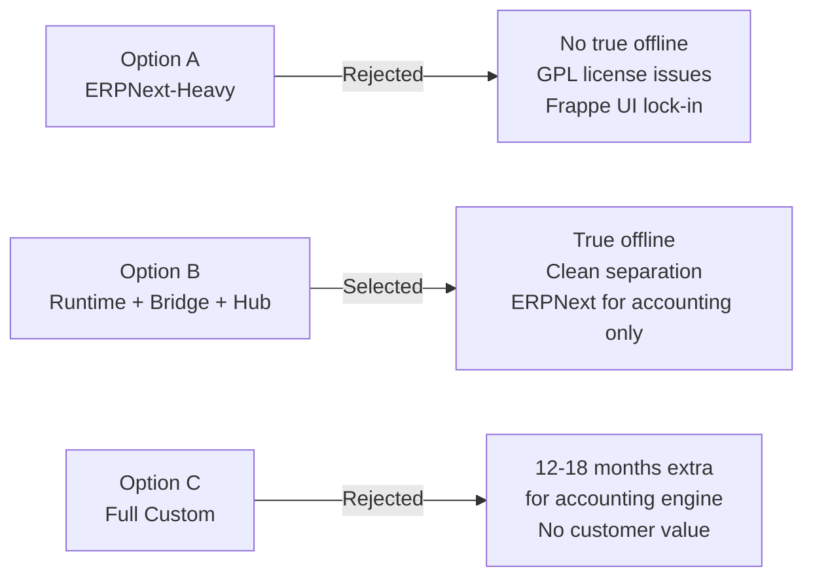
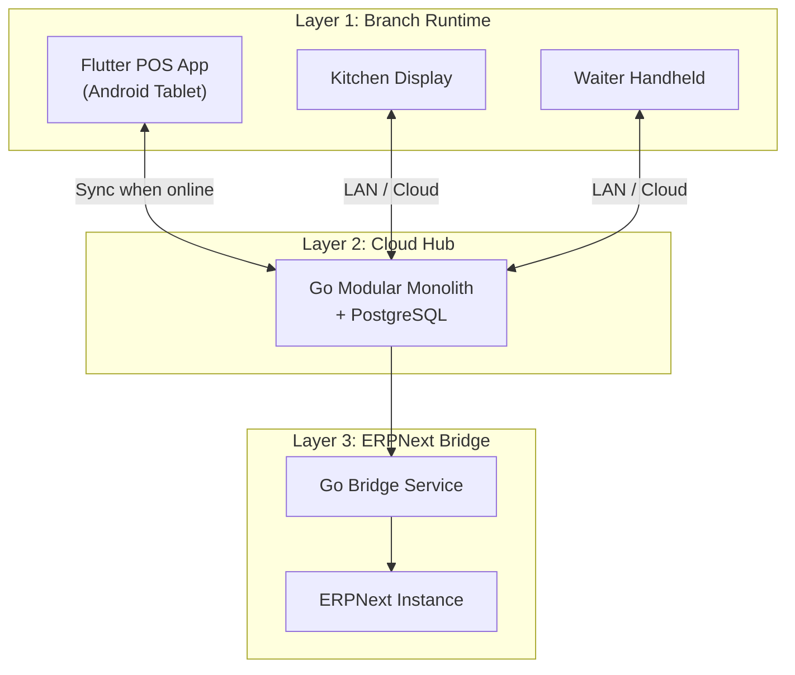
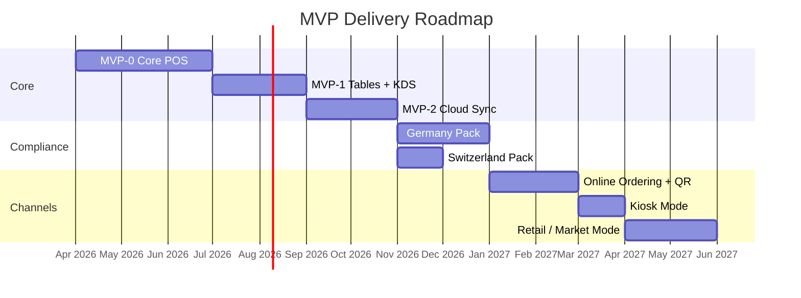
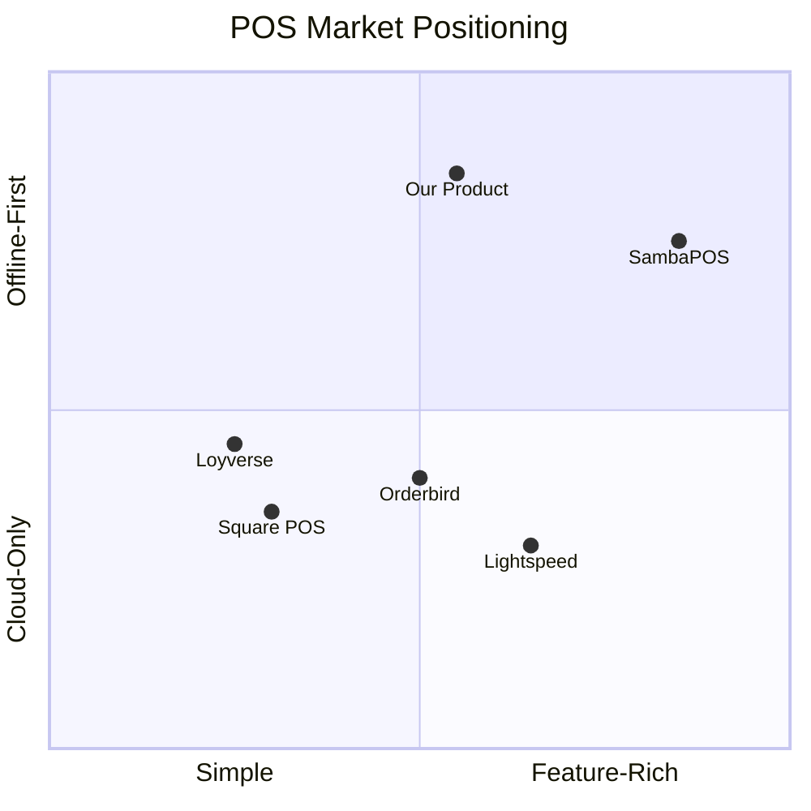

# Executive Summary

> **Document Status:** Living document | **Last Updated:** 2026-03-20 | **Owner:** Architecture Team

---

## 1. Product Vision

We are building a **restaurant POS platform** that delivers the operational depth of SambaPOS, the simplicity of Loyverse, the open-source backbone of ERPNext, and the omnichannel reach of OrderPin -- all in a single product purpose-built for the European restaurant market.

**One-liner:** A modular, offline-first POS platform for restaurants in Switzerland and Germany that works without internet, syncs when connected, and scales from a single food truck to a multi-branch chain.

### What We Believe

1. **Offline is not optional.** A restaurant that cannot take orders because of an internet outage is losing money every minute. The POS must operate fully without connectivity.
2. **Accounting belongs in accounting software.** Restaurant staff should never see a chart of accounts. ERPNext handles back-office complexity; the POS handles speed.
3. **Channels converge, not multiply.** Dine-in, takeaway, QR-order, kiosk, and web ordering all feed the same order engine. One menu, one kitchen, one reconciliation.
4. **Compliance is a plugin, not a rewrite.** German fiscal law (KassenSichV/TSE) and Swiss VAT/QR-bill are country packs that bolt on cleanly without touching the core.

### Target Customer Profile

| Segment | Examples | Key Need |
|---------|----------|----------|
| **Single-location restaurant** | Pizzeria, sushi bar, bistro | Fast POS, simple setup, offline reliability |
| **Small chain (2-10 branches)** | Regional burger chain, bakery group | Central menu, multi-branch reports, consistency |
| **Fast-casual / QSR** | Bowl bar, poke chain | Speed, KDS, online ordering, kiosk |
| **Food truck / market stall** | Weekend market vendor, festival stand | Portable, offline-only, fast checkout |
| **Hotel F&B** | Hotel restaurant, rooftop bar | Multi-outlet, room charge integration (future) |

**Primary beachhead:** Single-location restaurants in German-speaking Switzerland (DACH region), expanding to Germany in Year 1.

---

## 2. Why This Architecture

We evaluated three architecture options in depth (see [02-architecture-alternatives.md](./02-architecture-alternatives.md)):

### Selected: Option B -- Local Runtime + ERPNext Bridge + Cloud Hub

**Why this wins:**

| Criterion | Option A (ERPNext) | Option B (Selected) | Option C (Full Custom) |
|-----------|-------------------|---------------------|----------------------|
| Offline capability | Poor | Excellent | Excellent |
| Time to MVP | 3 months | 5 months | 14+ months |
| UX control | Constrained | Full | Full |
| Accounting effort | Built-in | Bridge only | 12-18 months |
| License risk | GPL copyleft | Clean | Clean |
| Long-term velocity | Decreasing | Stable | Stable |

---

## 3. MVP Sequence

Each MVP is a shippable product increment. We do not proceed to the next until the current one is stable and generating revenue or validated feedback.

### MVP-0: Core POS (Month 1-3)
**Goal:** A single Android tablet can take orders, accept payments, print receipts, and manage shifts -- completely offline.

| Deliverable | Details |
|------------|---------|
| Order entry | Item selection, modifiers, notes, quantity |
| Payment | Cash, card terminal (SumUp/similar), split bill |
| Receipt printing | Bluetooth thermal printer (ESC/POS) |
| Shift management | Open/close shift, cash count, X/Z reports |
| Basic reporting | Shift summary, daily sales on device |
| Data model | SQLite, UUID v7, money as cents, event log |

**Exit criteria:** A real restaurant can run a full day using only MVP-0.

### MVP-1: Tables + KDS + Multi-Device (Month 4-5)
**Goal:** Full table-service workflow with kitchen display and waiter handhelds.

| Deliverable | Details |
|------------|---------|
| Table management | Floor plan, table status, merge/split, transfer |
| Kitchen Display System | Order queue, item timing, bump screen |
| Multi-device sync | LAN-based sync between devices on same network |
| Course management | Fire courses, hold/rush items |
| Bluetooth printing | Kitchen printer routing by category |

### MVP-2: Cloud Sync + Dashboard (Month 6-7)
**Goal:** Restaurant data syncs to the cloud; owner sees reports on web dashboard.

| Deliverable | Details |
|------------|---------|
| Cloud sync engine | Offline-first sync with conflict resolution |
| Web dashboard | Sales reports, product mix, staff performance |
| Menu management | Central menu editor, push to devices |
| Multi-branch foundation | Tenant/branch/device hierarchy in cloud |
| ERPNext Bridge v1 | Sales journal, stock movements to ERPNext |

### Germany Pack (Month 8-9)
Fiskaly TSE integration, DSFinV-K export, GoBD-compliant receipt formatting.

### Switzerland Pack (Month 8)
Swiss VAT rate handling (8.1%, 2.6%, 3.8%), QR-bill generation, Swiss receipt format.

### Online Ordering + QR (Month 10-11)
Customer-facing web ordering, QR code table ordering, order injection into same engine.

### Kiosk Mode (Month 12)
Self-service ordering on dedicated tablet, payment terminal integration, simplified UI.

---

## 4. Key Risks and Mitigations

| # | Risk | Impact | Probability | Mitigation |
|---|------|--------|-------------|------------|
| 1 | **Germany fiscal complexity** (Fiskaly/TSE/DSFinV-K) | High | High | Hire/contract Fiskaly-experienced developer; start integration research in MVP-1; budget 2 months |
| 2 | **Sync engine reliability** | Critical | Medium | Event sourcing lite with idempotent operations; extensive offline/online transition testing; conflict resolution via last-writer-wins on master data, append-only on transactions |
| 3 | **Hardware diversity** (printers, tablets, cash drawers) | Medium | High | Abstract hardware behind interface layer; start with 2-3 certified device combos; community-driven driver packs later |
| 4 | **Scope creep** (channels too early) | High | High | Strict MVP gating; no channel work before MVP-2 is stable; feature flags enforce tier boundaries |
| 5 | **ERPNext version compatibility** | Medium | Medium | Bridge service isolates ERPNext API; pin to LTS versions; integration tests on ERPNext upgrades |
| 6 | **Team capacity** (1-5 developers) | High | Medium | Modular monolith reduces ops burden; prioritize ruthlessly; defer retail mode |
| 7 | **Payment terminal fragmentation** | Medium | Medium | Start with SumUp (simple API); abstract terminal interface; add terminals per market demand |

---

## 5. Business Model

### Pricing Tiers

| Tier | Monthly | Annual | Devices | Key Features |
|------|---------|--------|---------|-------------|
| **Starter** | CHF 49 | CHF 490 | 1 | Core POS, offline, receipts, shifts |
| **Professional** | CHF 79 | CHF 790 | Up to 5 | Tables, KDS, cloud sync, reports, country packs |
| **Enterprise** | CHF 149 | CHF 1,490 | Unlimited | Multi-branch, online ordering, kiosk, API access |

### Revenue Streams

1. **SaaS subscriptions** (primary) -- Monthly or annual recurring
2. **Annual offline license** -- For restaurants that want offline-only without cloud; validated quarterly with 90-day grace period
3. **Hardware bundles** (future) -- Pre-configured tablet + printer + cash drawer kits
4. **Marketplace** (future) -- Third-party integrations, themes, add-ons

### Unit Economics Target (Year 1)

| Metric | Target |
|--------|--------|
| Average Revenue Per Account (ARPA) | CHF 75/month |
| Customer Acquisition Cost (CAC) | < CHF 500 |
| Lifetime Value (LTV) | > CHF 2,700 (36 months) |
| LTV:CAC ratio | > 5:1 |
| Gross margin | > 80% |

---

## 6. Competitive Positioning

### Differentiation Matrix

| Capability | Us | Loyverse | SambaPOS | Orderbird | Lightspeed |
|------------|-----|----------|----------|-----------|------------|
| True offline-first | Yes | Partial | Yes (Windows) | No | No |
| Android native | Yes | Yes | No (Windows) | Yes | No (iPad) |
| Multi-channel (QR, kiosk, web) | Yes | No | Limited | Limited | Yes |
| Open accounting bridge | Yes (ERPNext) | No | No | No | No |
| Germany fiscal (TSE) | Planned | No | No | Yes | Yes |
| Switzerland compliance | Planned | No | No | No | Partial |
| Self-hosted option | Yes | No | Yes | No | No |
| API for custom integrations | Yes | Limited | Yes | Limited | Yes |

**Our wedge:** We are the only platform that combines true offline-first Android operation with multi-channel ordering and open-source accounting integration, purpose-built for DACH-region compliance.

---

## 7. Success Metrics -- Year 1

### Product Metrics

| Metric | Q1 | Q2 | Q3 | Q4 |
|--------|-----|-----|-----|-----|
| Paying customers | 5 | 20 | 50 | 100 |
| Monthly Recurring Revenue (MRR) | CHF 375 | CHF 1,500 | CHF 3,750 | CHF 7,500 |
| Devices active | 8 | 40 | 120 | 250 |
| Daily orders processed | 500 | 3,000 | 10,000 | 25,000 |
| Uptime (cloud services) | 99.5% | 99.9% | 99.9% | 99.9% |

### Quality Metrics

| Metric | Target |
|--------|--------|
| Offline reliability | 99.99% (POS must never crash offline) |
| Order-to-kitchen latency | < 2 seconds (LAN) |
| Sync conflict rate | < 0.1% of transactions |
| Receipt print time | < 3 seconds from payment |
| App cold start | < 4 seconds |
| Customer churn (monthly) | < 3% |
| NPS | > 40 |

### Technical Milestones

| Milestone | Target Date |
|-----------|------------|
| MVP-0 in production (first paying customer) | End of Q2 2026 |
| MVP-1 stable (tables + KDS) | End of Q3 2026 |
| Cloud sync live | End of Q3 2026 |
| Germany fiscal certification | End of Q4 2026 |
| Switzerland pack released | End of Q4 2026 |
| 100 paying customers | End of Q1 2027 |

---

## 8. Team and Roles

For a team of 1-5 developers, we define roles, not people. One person may hold multiple roles.

| Role | Responsibility | Needed From |
|------|---------------|-------------|
| **Flutter Lead** | POS app, KDS, waiter app, offline engine | MVP-0 |
| **Go Backend Lead** | Cloud hub, sync engine, API, ERPNext bridge | MVP-2 |
| **Product / UX** | User research, UI design, restaurant workflow expertise | MVP-0 |
| **DevOps** | CI/CD, cloud infra, monitoring | MVP-2 |
| **Fiscal Specialist** (contract) | Fiskaly integration, DSFinV-K, certification | Germany Pack |

**Phase 1 (MVP-0 to MVP-1):** 1-2 developers, Flutter focus
**Phase 2 (MVP-2 onward):** 3-4 developers, add Go backend + DevOps
**Phase 3 (Scale):** 5 developers + fiscal contractor

---

## Document Map

| Document | Purpose |
|----------|---------|
| [00-executive-summary.md](./00-executive-summary.md) | This document -- high-level overview |
| [01-product-principles.md](./01-product-principles.md) | UX principles, design rules, accessibility |
| [02-architecture-alternatives.md](./02-architecture-alternatives.md) | Detailed comparison of 3 architecture options |
| [03-target-architecture.md](./03-target-architecture.md) | Complete target architecture with diagrams |
| [adr/](./adr/) | Architecture Decision Records |
