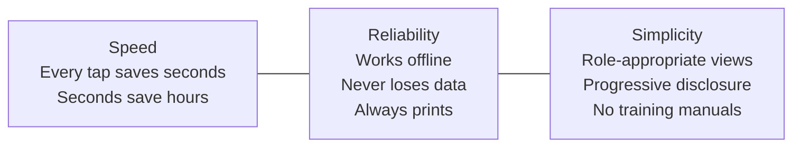
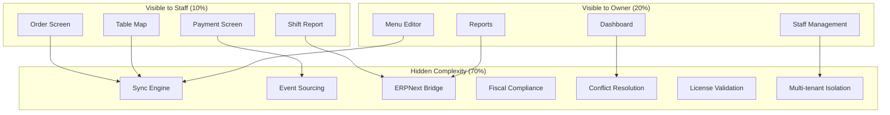
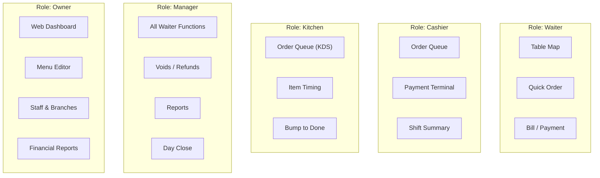
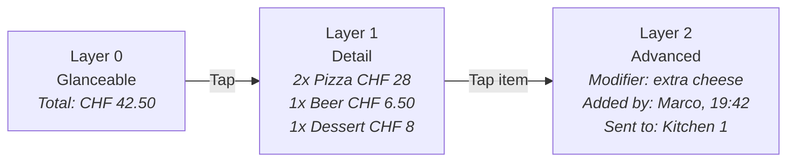
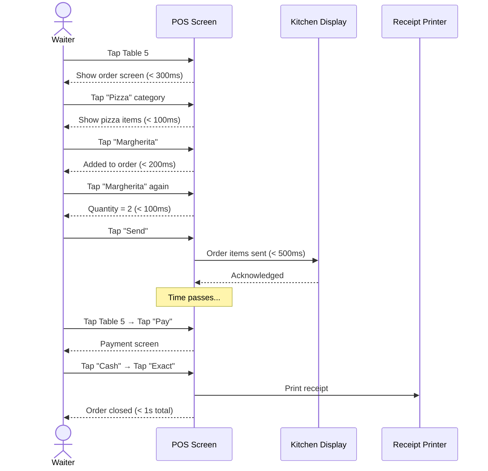
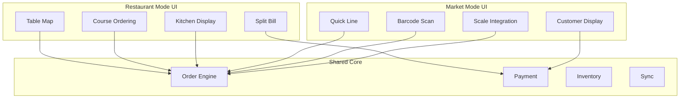
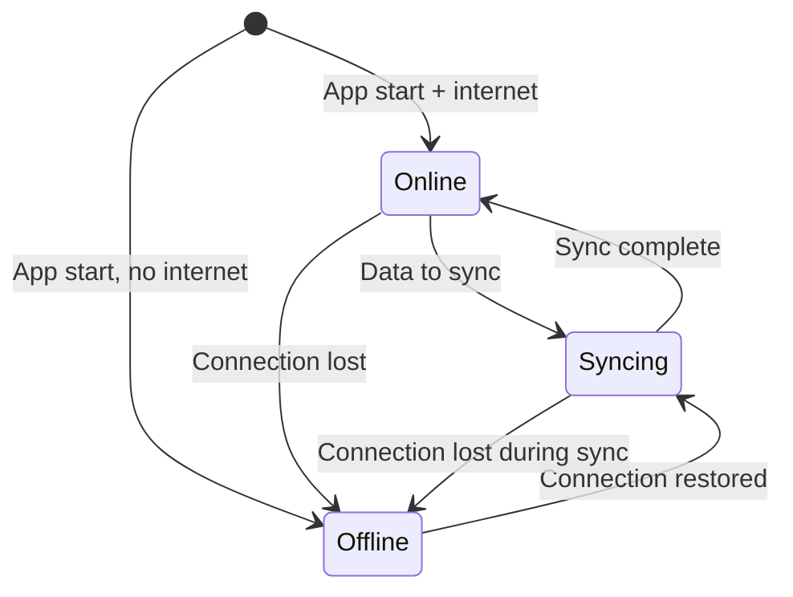
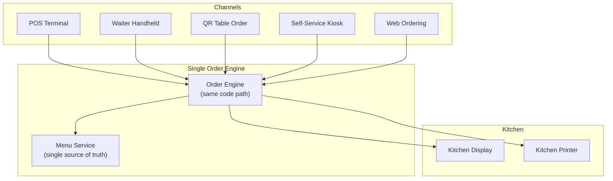

# Product Principles

> **Document Status:** Living document | **Last Updated:** 2026-03-20 | **Owner:** Product Team

---

## 1. Core Philosophy

**The POS should be invisible.** The best POS is one the staff forgets is there. It should feel like an extension of their hands -- fast, predictable, and never in the way. Every feature, every screen, every interaction is evaluated against this standard.

### Three Pillars



---

## 2. Simplicity Principles

### What the Customer Sees vs. What They Do Not See

The product has two faces: a **front-of-house face** (staff and customers) and a **back-office face** (owners and accountants). These must never bleed into each other.

| Principle | Front-of-House | Back-Office |
|-----------|---------------|-------------|
| **Vocabulary** | "Table 5", "2x Margherita", "Split bill" | "Sales journal entry", "GL posting", "Tax reconciliation" |
| **Complexity** | Zero accounting concepts visible | Full accounting depth via ERPNext |
| **Configuration** | Minimal (table layout, printer) | Complete (tax rules, chart of accounts, integrations) |
| **Error messages** | "Could not print. Check printer." | Stack traces in logs, error codes in API responses |
| **Data** | Today's orders, shift totals | Historical reports, audit trails, fiscal exports |

### The Iceberg Model



### Five Simplicity Rules

1. **No jargon.** The POS uses restaurant language, not software or accounting language. "Void" not "Credit memo". "Daily report" not "Z-report" (though fiscal export uses proper terminology internally).
2. **No modal dialogs for happy path.** The most common flow (take order, send to kitchen, collect payment) must never show a modal confirmation. Modals are reserved for destructive actions (void, refund, delete).
3. **No settings on the POS.** Configuration happens in the back-office (web dashboard or settings screen). The POS screen has zero settings cogwheels.
4. **No required fields beyond the essential.** Taking an order requires: items. That is it. Table number, customer name, notes -- all optional.
5. **No training manual needed.** A new waiter should be productive within 15 minutes of first use. If they need a manual, the UI has failed.

---

## 3. UX Decision Rules

### The 3-Tap Rule

Every primary action must be achievable in 3 taps or fewer from the order screen.

| Action | Tap 1 | Tap 2 | Tap 3 |
|--------|-------|-------|-------|
| Add item to order | Tap category | Tap item | (Done) |
| Add item with modifier | Tap item | Tap modifier | Confirm |
| Send to kitchen | Tap "Send" | (Done) | -- |
| Take payment (cash, exact) | Tap "Pay" | Tap "Cash" | Tap "Exact" |
| Split bill equally | Tap "Pay" | Tap "Split" | Tap count |
| Open table | Tap table on map | (Auto-opens order) | -- |
| Void last item | Tap item | Tap "Void" | Confirm (required) |

### Role-Specific Views

Different staff roles see different interfaces. This is not about permissions hiding buttons -- it is about entirely different screens optimized for each role.



| Role | Device | Primary Screen | Actions Available |
|------|--------|---------------|-------------------|
| **Waiter** | Handheld (phone/small tablet) | Table map | View tables, take orders, request bill |
| **Cashier** | POS tablet (10") | Order entry + payment | Full order lifecycle, payments, receipts |
| **Kitchen** | KDS display (10-15") | Order queue | View orders, mark items ready, bump |
| **Manager** | POS tablet | Cashier view + extras | Everything cashier can do + voids, refunds, reports, shift close |
| **Owner** | Web browser | Dashboard | Reports, menu, staff, branches, configuration |

### Progressive Disclosure

Information is revealed in layers. The default view is minimal. Detail is one tap away. Advanced options are two taps away.

**Layer 0 -- Glanceable:** Order total, table status, items in queue
**Layer 1 -- Tap to expand:** Order detail, item modifiers, payment breakdown
**Layer 2 -- Long-press or menu:** Order history, audit log, advanced modifiers



---

## 4. Fast Path Design

The "fast path" is the sequence of actions for the most common operation. For a restaurant POS, this is: **open order -> add items -> send to kitchen -> collect payment -> print receipt.**

### Optimizing the Fast Path

Every millisecond and every tap on the fast path is scrutinized. Non-fast-path features must never slow down or clutter the fast path.

| Design Decision | Rationale |
|----------------|-----------|
| Category grid on left, items on right (landscape) | One-handed category navigation, dominant hand picks items |
| Most-sold items first in each category | Reduce scrolling; use sales data to auto-sort |
| Quantity buttons (+/-) on order line | No separate quantity dialog |
| Single-tap "Send" button always visible | Never buried in a menu |
| Payment screen pre-selects most common method | If 80% pay cash, "Cash" is pre-selected |
| "Exact amount" button for cash | One tap for exact change (no calculator) |
| Auto-print receipt on payment completion | Zero additional taps for receipt |
| Order auto-closes on full payment | No "close order" button needed |

### Interaction Timing Targets

| Interaction | Target | Measurement |
|-------------|--------|-------------|
| Tap to visual response | < 100ms | Frame render after touch |
| Add item to order | < 200ms | Item appears in order list |
| Send to kitchen | < 500ms | Confirmation shown + print/KDS triggered |
| Payment processing (cash) | < 1s | Receipt printing starts |
| Payment processing (card) | < 5s | Depends on terminal; show progress |
| Receipt print | < 3s | Paper fully ejected |
| Switch between tables | < 300ms | New table order displayed |

### Fast Path Flow



---

## 5. Restaurant Mode vs. Market Mode

The platform supports two fundamentally different workflows. These are not just different themes -- they are different interaction models.

### Mode Comparison

| Aspect | Restaurant Mode | Market Mode |
|--------|----------------|-------------|
| **Primary entity** | Table (spatial) | Transaction (sequential) |
| **Order lifecycle** | Open -> items added over time -> close | Single burst of items -> immediate payment |
| **Typical duration** | 30-90 minutes | 30-90 seconds |
| **Payment timing** | End of meal | Immediate |
| **Kitchen integration** | Essential (courses, fire times) | Rarely needed |
| **Tabs / running orders** | Common | Never |
| **Table map** | Central navigation | Not shown |
| **Receipt** | After payment | With payment (simultaneous) |
| **Item lookup** | Category grid (known menu) | Search + barcode scan |
| **Split bill** | Frequent | Rare |
| **Customer display** | Not typical | Essential (price check) |

### Separation Principles

1. **Mode is set at branch level**, not per device. A branch is either a restaurant or a market. (Hybrid like a bakery-cafe may switch modes per shift -- future consideration.)
2. **Shared core.** Both modes use the same order engine, payment processing, inventory, and sync. The difference is purely in the UI layer and default workflow.
3. **Restaurant mode is the MVP.** Market mode is deferred to MVP-8. The order engine is designed to support both, but UI investment starts with restaurant.
4. **No blended UI.** We will not try to make one screen that works for both. Each mode has its own navigation structure and fast path.



---

## 6. Offline-First UX Principles

### The Core Promise

**The POS works identically whether online or offline.** Staff should not know (or care) about connectivity status. The only visible difference is a subtle status indicator.

### Connectivity States



### UX Rules for Offline

| Rule | Implementation |
|------|---------------|
| **Status indicator is passive, not intrusive** | Small colored dot in status bar: green = online, amber = syncing, gray = offline. No pop-ups, no alerts. |
| **All POS operations work offline** | Orders, payments, receipts, voids, shift close -- everything works. No "offline mode" concept. |
| **Data created offline is never lost** | Event log persists in SQLite. Sync happens when connectivity returns. |
| **No "please connect to internet" dialogs** | If a feature genuinely requires internet (e.g., online ordering status), it shows "unavailable offline" inline, not as a blocking dialog. |
| **Sync is background and invisible** | Staff never manually trigger sync. It happens automatically. |
| **Conflicts are resolved silently** | Last-writer-wins for master data. Append-only for transactions (no conflicts possible). Only if manual resolution is needed does the manager see it. |
| **Offline duration is unlimited** | The POS must work for days, weeks, or permanently offline (annual license tier). |

### What Works Offline vs. Online-Only

| Feature | Offline | Online Only | Rationale |
|---------|---------|-------------|-----------|
| Order entry | Yes | -- | Core function |
| Payment processing (cash) | Yes | -- | Core function |
| Payment processing (card) | Yes (terminal handles offline) | -- | Terminal has own offline capability |
| Receipt printing | Yes | -- | Core function |
| Shift open/close | Yes | -- | Core function |
| Table management | Yes | -- | Core function |
| Kitchen display (LAN) | Yes | -- | LAN does not require internet |
| Reporting (current shift) | Yes | -- | Local data |
| Reporting (historical, multi-branch) | -- | Yes | Requires cloud data |
| Menu updates from cloud | -- | Yes | Sync needed |
| Online ordering | -- | Yes | By definition |
| License validation | Quarterly check | -- | 90-day grace period |

### Offline Data Budget

| Data Type | Stored Locally | Retention |
|-----------|---------------|-----------|
| Active orders | Full detail | Until synced + 30 days |
| Closed orders | Full detail | Until synced + 90 days |
| Menu items | Full catalog | Permanent (until replaced by sync) |
| Staff records | PIN + permissions | Permanent |
| Event log | All events | Until synced + 7 days |
| Shift records | Full detail | Until synced + 90 days |
| Customer data | Minimal (name, visits) | Until synced |

---

## 7. Multi-Channel Consistency Principles

### One Engine, Many Faces

All ordering channels feed the same order engine. This is not just a principle -- it is an architectural constraint.



### Channel Consistency Rules

| Rule | Description |
|------|-------------|
| **Single menu** | All channels show the same menu (with channel-specific availability flags). |
| **Single pricing** | No channel-specific pricing unless explicitly configured (e.g., delivery surcharge). |
| **Single order queue** | Kitchen sees one queue regardless of order source. Source is tagged but does not create separate queues. |
| **Unified reporting** | Revenue reports combine all channels with channel-as-dimension for filtering. |
| **Order source is metadata** | Channel is a tag on the order, not a different order type. |
| **Availability is real-time** | If an item is 86'd (out of stock), it disappears from all channels simultaneously. |

### Channel-Specific Adaptations

While the engine is shared, each channel adapts its UI to its context:

| Aspect | POS | Waiter | QR Order | Kiosk | Web |
|--------|-----|--------|----------|-------|-----|
| **Navigation** | Category grid | Compact list | Scrolling menu | Category tiles | Full web menu |
| **Payment** | All methods | Request bill only | Online payment | Terminal + cash | Online payment |
| **Modifiers** | Full | Full | Simplified | Simplified | Full |
| **Language** | Staff language | Staff language | Customer language | Customer language(s) | Customer language(s) |
| **Item images** | Optional | No (space) | Yes (essential) | Yes (essential) | Yes (essential) |
| **Allergens** | On request | On request | Always visible | Always visible | Always visible |

---

## 8. Accessibility and Language

### Language Strategy

| Context | Languages | Priority |
|---------|-----------|----------|
| **Staff interface** | German, English, French, Italian | German first (DACH market) |
| **Customer-facing (QR, kiosk, web)** | German, English, French, Italian, + configurable | Multi-language from MVP-6 |
| **Menu items** | Configurable per restaurant | Owner enters in their languages |
| **Receipts** | Local language + legal requirements | Country-pack driven |
| **Back-office / Dashboard** | English, German | English first (developer efficiency) |

### Internationalization Principles

1. **All user-facing strings are externalized.** No hardcoded text in UI code.
2. **Right-to-left (RTL) is deferred** but layout must not assume LTR.
3. **Number and currency formatting** follows locale: CHF 1'234.50 (Switzerland), 1.234,50 EUR (Germany).
4. **Date formatting** follows locale: 20.03.2026 (DACH), 2026-03-20 (ISO in APIs).
5. **Menu items are user-entered** and may contain any UTF-8 characters.

### Accessibility in Restaurant Context

Restaurant environments present unique accessibility challenges: bright or dim lighting, greasy fingers, noise, rush periods.

| Consideration | Design Decision |
|---------------|----------------|
| **Touch target size** | Minimum 48x48dp (Android guideline), prefer 56x56dp for primary actions |
| **Touch target spacing** | Minimum 8dp between targets to prevent mis-taps |
| **Contrast ratio** | Minimum 4.5:1 for text, 3:1 for large text (WCAG AA) |
| **Font size** | Minimum 16sp for body text, 20sp for order totals, 24sp+ for KDS items |
| **Color independence** | Never use color alone to convey information (always pair with icon or text) |
| **Sound** | Optional audio cues for new kitchen orders (configurable volume) |
| **Screen brightness** | Auto-brightness with manual override; high-contrast mode for outdoor use |
| **Glove mode** | Increased touch sensitivity option for kitchen staff wearing gloves |

### Staff with Disabilities

| Scenario | Accommodation |
|----------|--------------|
| Low vision | Scalable UI (system font size respected), high-contrast mode |
| Color blindness | Status uses shape + text, not just color (green dot + "Online" text) |
| Motor impairment | Large touch targets, no drag-and-drop required for essential tasks |
| Hearing impairment | Visual alerts for all audio cues (screen flash for new orders) |

---

## 9. Design System Principles

### Color Palette Philosophy

Colors serve function, not decoration. The POS UI is intentionally muted so that **food photography and order status stand out**.

| Color Role | Usage | Notes |
|------------|-------|-------|
| **Primary** | Action buttons, active states | Brand color (one color only) |
| **Success / Green** | Payment complete, order sent | Immediate positive feedback |
| **Warning / Amber** | Syncing, waiting, held items | Attention without alarm |
| **Danger / Red** | Void, refund, errors | Destructive actions only |
| **Neutral / Gray** | Backgrounds, borders, disabled | The majority of the UI |
| **White** | Cards, input fields | Content containers |
| **Dark** | Text, icons | High contrast on light backgrounds |

### Typography

| Context | Size | Weight | Font |
|---------|------|--------|------|
| Order total | 32sp | Bold | System sans-serif |
| Item name | 18sp | Medium | System sans-serif |
| Item detail (modifier, note) | 14sp | Regular | System sans-serif |
| Category label | 16sp | SemiBold | System sans-serif |
| Button text | 16sp | SemiBold | System sans-serif |
| Status bar | 12sp | Regular | System sans-serif |
| KDS order item | 24sp | Bold | System sans-serif |
| Receipt text | Printer-defined | -- | Monospace (ESC/POS) |

**Why system fonts:** Reduces app size, renders fastest, respects user accessibility settings.

### Touch Targets for Restaurant Environment

```
+--------------------------------------------------+
|  Standard button: 56dp height, full-width         |
|  +----------------------------------------------+ |
|  |                                              | |
|  |     PAY  CHF 42.50                           | |
|  |                                              | |
|  +----------------------------------------------+ |
|                                                    |
|  Category grid: 80x80dp cells                     |
|  +--------+ +--------+ +--------+ +--------+     |
|  | Pizza  | | Pasta  | | Drinks | | Dessert|     |
|  +--------+ +--------+ +--------+ +--------+     |
|                                                    |
|  Item grid: 120x56dp cells                        |
|  +--------------------+ +--------------------+    |
|  | Margherita  CHF 18 | | Diavola   CHF 21  |    |
|  +--------------------+ +--------------------+    |
|                                                    |
|  Quantity stepper: 48dp circular buttons          |
|  (-) [  2  ] (+)                                  |
+--------------------------------------------------+
```

### Layout Principles

| Principle | Rule |
|-----------|------|
| **Landscape is primary** | POS tablets are used in landscape. Portrait is for waiter handhelds only. |
| **Left panel is navigation** | Categories, tables, or order list -- always on left (40% width). |
| **Right panel is content** | Item grid, order detail, or payment -- always on right (60% width). |
| **Bottom bar for primary actions** | "Send", "Pay", "Print" -- always visible at bottom right. |
| **No hamburger menus** | All navigation is visible. Hidden navigation causes errors under pressure. |
| **No infinite scroll** | Paginate or use fixed grids. Scroll position must be predictable. |
| **Animations are functional** | Item flies to order list (confirms addition). No decorative animations. |
| **Dark mode is optional** | Some restaurants prefer dark (bar, evening), others prefer light (cafe, lunch). User choice. |

### Visual Hierarchy Example (Order Screen)

```
+------------------+-----------------------------------+
|                  |                                   |
|  CATEGORIES      |  ITEMS                            |
|  [Pizza]  *      |  [Margherita  CHF 18]             |
|  [Pasta]         |  [Diavola     CHF 21]             |
|  [Drinks]        |  [Quattro F.  CHF 23]             |
|  [Desserts]      |  [Calzone     CHF 20]             |
|  [Specials]      |  [Tonno       CHF 22]             |
|                  |                                   |
+------------------+-------+---------------------------+
|  ORDER #42 - Table 5     |                           |
|                           |                           |
|  2x Margherita    CHF 36 |                           |
|    + extra cheese         |                           |
|  1x Cola          CHF 5  |                           |
|  1x Tiramisu      CHF 9  |                           |
|                           |                           |
|  TOTAL           CHF 50  |  [ SEND ]  [ PAY CHF 50] |
+---------------------------+---------------------------+
```

---

## 10. Decision Checklist

When evaluating any new feature or design decision, apply this checklist:

| # | Question | Required Answer |
|---|----------|-----------------|
| 1 | Does it work offline? | Yes, or explicitly online-only with justification |
| 2 | Can it be done in 3 taps? | Yes for primary actions |
| 3 | Does it slow down the fast path? | No |
| 4 | Does it add a concept the waiter needs to understand? | No, or essential and explainable in one sentence |
| 5 | Does it work across all channels? | Yes, or channel-specific with justification |
| 6 | Is it role-appropriate? | Yes (not shown to roles that do not need it) |
| 7 | Does it respect the design system? | Yes (touch targets, colors, typography) |
| 8 | Does it work on a 10" tablet in landscape? | Yes |
| 9 | Is the text externalized for translation? | Yes |
| 10 | Does it need a country pack? | If yes, is it cleanly separated? |
