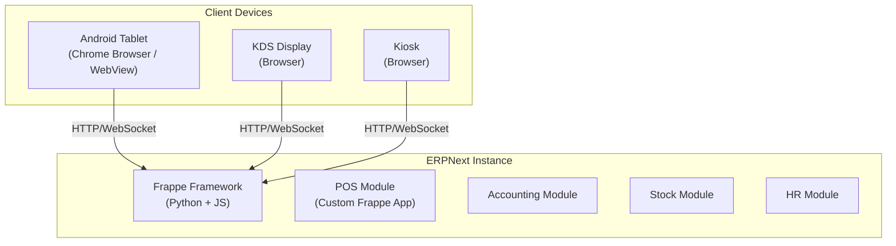
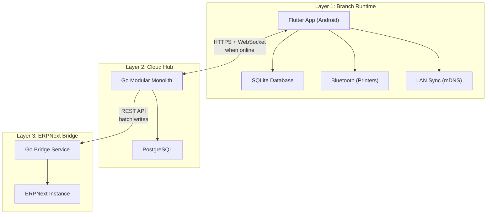
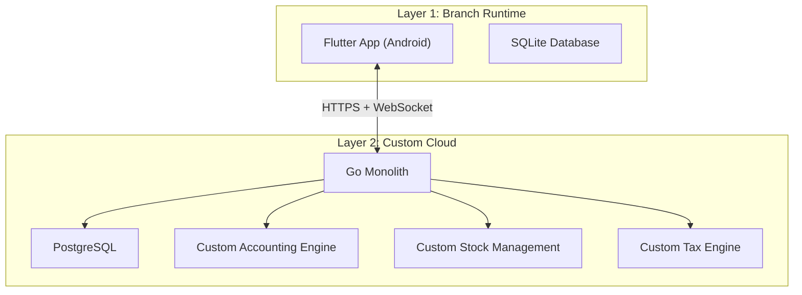
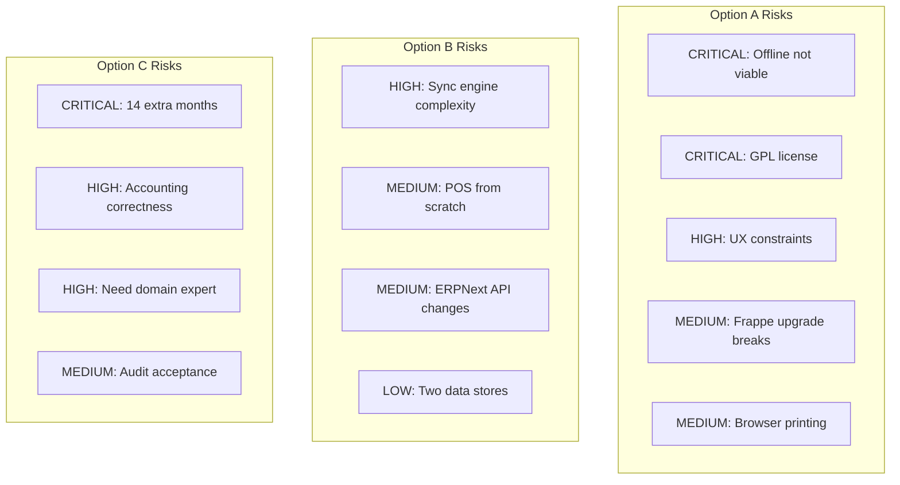
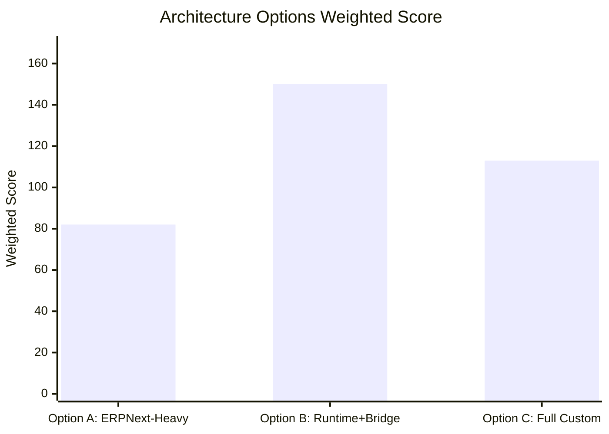
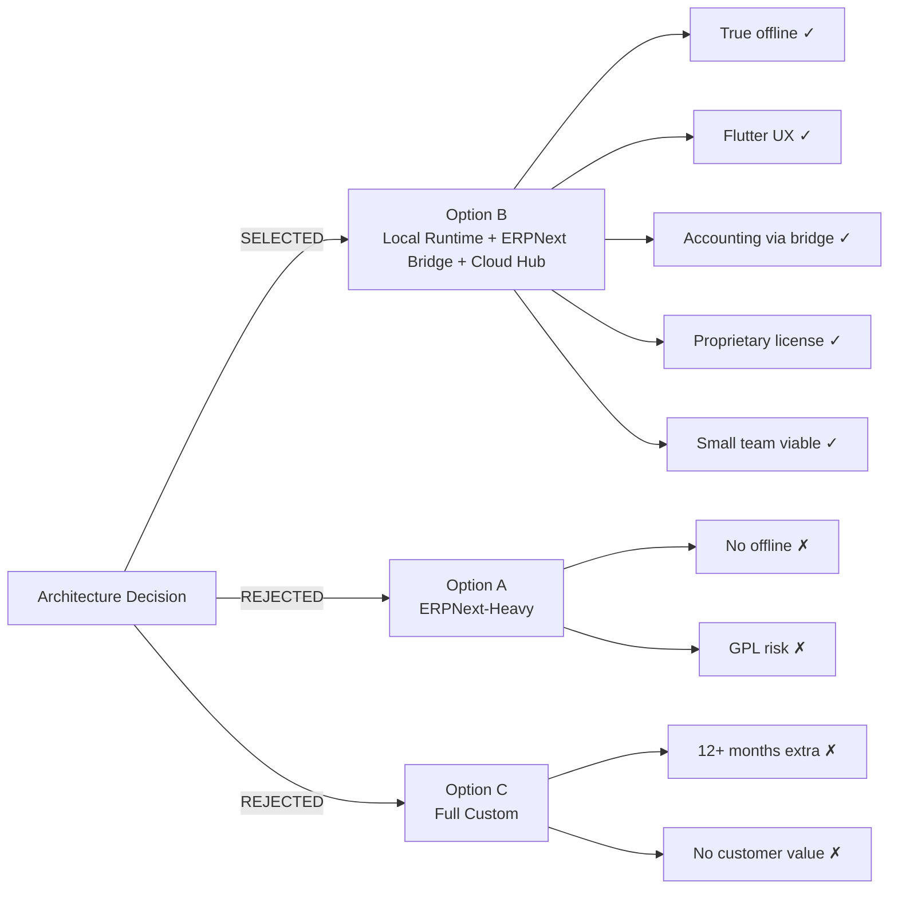

# Architecture Alternatives Analysis

> **Document Status:** Finalized | **Last Updated:** 2026-03-20 | **Decision:** Option B selected | **Owner:** Architecture Team

---

## 1. Context

We need to choose the foundational architecture for a restaurant POS platform targeting Switzerland and Germany, with these non-negotiable requirements:

1. **True offline-first** -- The POS must operate fully without internet connectivity, indefinitely
2. **Android-native** -- Primary deployment is Android tablets (10") and handhelds
3. **Multi-channel** -- POS, waiter handheld, KDS, QR ordering, kiosk, web ordering
4. **European compliance** -- German fiscal law (KassenSichV/TSE via Fiskaly), Swiss VAT, QR-bill
5. **Accounting integration** -- Not building accounting from scratch; needs a bridge to proper accounting software
6. **Small team** -- 1-5 developers must be able to build, deploy, and maintain the system
7. **Commercial product** -- SaaS pricing model; license must allow proprietary distribution

Three architecture options were evaluated in depth.

---

## 2. Option A: ERPNext-Heavy

### Description

Use ERPNext as the core platform. Build the POS as an ERPNext module (Frappe app). All data lives in ERPNext. The POS UI is a Frappe web view or a customized version of ERPNext POS / POS Awesome.

### Detailed Pros

| Pro | Detail |
|-----|--------|
| **Built-in accounting** | Chart of accounts, general ledger, tax engine, multi-currency -- all ready |
| **Built-in stock management** | Warehouse, stock entry, stock reconciliation, batch tracking |
| **Built-in HR** | Employee records, attendance, payroll (basic) |
| **Large community** | Active forums, hundreds of contributors, extensive documentation |
| **Proven in production** | Thousands of companies use ERPNext globally |
| **Rapid prototyping** | Frappe's DocType system creates CRUD interfaces quickly |
| **REST API** | Every DocType is automatically API-accessible |
| **Reporting** | Built-in report builder with query reports and script reports |
| **Multi-tenant** | Frappe supports multi-tenant deployments |
| **Country packs exist** | Germany and Switzerland packs available (but not POS-specific) |

### Detailed Cons

| Con | Detail | Severity |
|-----|--------|----------|
| **No true offline** | POS Awesome has "temporary offline" using localStorage, but it is not true offline-first. Any complex operation fails offline. | **Critical** |
| **Browser-based POS** | Running in Chrome/WebView on Android. No native hardware access (Bluetooth printers, NFC, cash drawer GPIO). | **Critical** |
| **GPL license** | ERPNext is GPL v3. Any derivative work must also be GPL. This makes a proprietary SaaS product legally problematic. | **Critical** |
| **Frappe framework lock-in** | All code must follow Frappe patterns (DocTypes, hooks, whitelisted methods). Cannot use standard Python/JS patterns. | **High** |
| **POS UI constrained** | The UI is bound to Frappe's rendering. Custom Flutter-quality UX is not achievable. | **High** |
| **Performance** | Frappe is a full web framework. Page loads, API calls, and UI rendering are slower than native. | **High** |
| **Python in critical path** | Python + MariaDB handles every transaction. Under load (rush hour, 100+ orders/hour), this is a bottleneck. | **Medium** |
| **Upgrade risk** | ERPNext major upgrades (v14 -> v15 -> v16) frequently break custom apps. Migration is labor-intensive. | **Medium** |
| **Printing** | Browser-based printing is limited. ESC/POS Bluetooth printing from a WebView is fragile. | **High** |
| **Mobile UX** | Frappe's responsive design is desktop-first. Tablet/phone UX requires extensive CSS overrides. | **Medium** |

### Offline Reality Check

ERPNext's POS module and POS Awesome addon provide a "temporary offline" mode:

| Capability | Online | Offline (POS Awesome) |
|------------|--------|----------------------|
| Take orders | Yes | Yes (cached items) |
| Payment | Yes | Cash only (no card terminal) |
| Print receipt | Yes | Limited (browser print dialog) |
| Void order | Yes | No |
| Modify order | Yes | Limited |
| View reports | Yes | No |
| Shift management | Yes | No |
| Stock update | Yes | No (queued) |
| Duration limit | Unlimited | Hours (localStorage limit) |
| Data safety | Full | Risk of data loss on browser crash |

**Verdict:** This is not acceptable for a restaurant that may operate offline for hours or days.

### Development Cost Estimate

| Phase | Person-Months | Notes |
|-------|---------------|-------|
| Initial setup + customization | 2 | Install ERPNext, create POS Frappe app |
| POS UI (basic) | 3 | Using POS Awesome as starting point |
| Offline improvement | 4 | Building a better offline layer (Service Worker + IndexedDB) |
| Printing (ESC/POS from browser) | 2 | Workarounds for Bluetooth/USB from WebView |
| KDS module | 2 | Browser-based kitchen display |
| Germany fiscal integration | 3 | Fiskaly from browser/server hybrid |
| Cloud sync (multi-branch) | 2 | ERPNext multi-company setup |
| **Total MVP through Germany pack** | **18** | |
| Annual maintenance (framework fights) | 4-6/year | ERPNext upgrades, Frappe breaking changes |

---

## 3. Option B: Local Runtime + ERPNext Bridge + Cloud Hub (SELECTED)

### Description

Three distinct layers with clear responsibilities. The Flutter app on Android is the POS runtime (offline-first, SQLite). A Go cloud hub handles multi-tenant management, online ordering, and reporting. A Go bridge service translates POS data into ERPNext doctypes for accounting and stock.

### Detailed Pros

| Pro | Detail |
|-----|--------|
| **True offline-first** | SQLite on device. Full POS operation without any network. Indefinite offline duration. |
| **Native performance** | Flutter renders at 60fps. No browser overhead. Direct hardware access. |
| **Full UX control** | Custom UI for every role (waiter, cashier, kitchen). No framework constraints. |
| **Hardware access** | Bluetooth printers (ESC/POS), NFC, cash drawer GPIO, barcode scanner -- all via native plugins. |
| **Clean separation** | POS runtime has zero accounting concepts. ERPNext is an integration, not a dependency. |
| **ERPNext does accounting** | No need to build chart of accounts, GL engine, tax calculation, stock valuation. Bridge translates. |
| **ERPNext is replaceable** | If ERPNext becomes problematic, the bridge can be redirected to any accounting system. |
| **Go cloud is fast** | Single Go binary serves API, sync, webhooks. Low memory, high concurrency. |
| **Proprietary license** | Flutter app and Go services are our code. ERPNext is accessed via API (not linked). |
| **Modular monolith** | One deployable unit in cloud. No Kubernetes/microservice complexity for a small team. |
| **Event sourcing lite** | Append-only event log enables reliable sync, audit trail, and offline conflict resolution. |

### Detailed Cons

| Con | Detail | Severity |
|-----|--------|----------|
| **POS built from scratch** | Order engine, table management, payment flow, receipt generation -- all custom. | **High** (mitigated by focused scope) |
| **Sync engine complexity** | Must build reliable offline-to-cloud sync with conflict resolution. | **High** |
| **Two data stores** | SQLite locally, PostgreSQL in cloud. Schema must stay in sync. | **Medium** |
| **ERPNext bridge maintenance** | Must track ERPNext API changes across versions. | **Medium** |
| **Flutter Android only** | iOS is not a priority but Flutter can target it later if needed. | **Low** |
| **More initial work** | Longer time to first working prototype compared to Option A. | **Medium** |

### Offline Reality Check

| Capability | Online | Offline |
|------------|--------|---------|
| Take orders | Yes | Yes (identical) |
| Payment (cash) | Yes | Yes (identical) |
| Payment (card) | Yes | Yes (terminal has own offline) |
| Print receipt | Yes | Yes (Bluetooth, identical) |
| Void order | Yes | Yes (identical) |
| Modify order | Yes | Yes (identical) |
| View reports (shift) | Yes | Yes (local data) |
| View reports (historical) | Yes | No (cloud data) |
| Shift management | Yes | Yes (identical) |
| Stock update | Yes (real-time) | Yes (local, syncs later) |
| Duration limit | Unlimited | Unlimited |
| Data safety | Full | Full (SQLite ACID) |

### Development Cost Estimate

| Phase | Person-Months | Notes |
|-------|---------------|-------|
| Flutter POS core (order, pay, receipt) | 4 | MVP-0 |
| SQLite data model + event sourcing | 2 | Part of MVP-0 |
| Bluetooth printing | 1 | Part of MVP-0 |
| Table management + KDS | 3 | MVP-1 |
| LAN multi-device sync | 2 | MVP-1 |
| Go cloud hub (API, tenant mgmt) | 3 | MVP-2 |
| Sync engine (offline-to-cloud) | 3 | MVP-2 |
| Web dashboard | 2 | MVP-2 |
| ERPNext bridge | 2 | MVP-2 |
| Germany fiscal (Fiskaly) | 2 | Germany pack |
| Switzerland (VAT, QR-bill) | 1 | Switzerland pack |
| **Total MVP through country packs** | **25** | |
| Annual maintenance | 2-3/year | Clean architecture, minimal framework fights |

---

## 4. Option C: Full Custom Backend (No ERPNext)

### Description

Same Flutter runtime as Option B, same Go cloud hub, but instead of bridging to ERPNext, build all accounting, stock management, and compliance from scratch.

### Detailed Pros

| Pro | Detail |
|-----|--------|
| **Maximum control** | Every component is ours. No external API dependencies. |
| **No ERPNext dependency** | No bridge maintenance, no version tracking, no API quirks. |
| **Cleanest architecture** | Uniform Go codebase, uniform data model, no translation layer. |
| **No license concerns** | Zero GPL, zero copyleft, fully proprietary stack. |
| **Optimized for POS** | Accounting model can be simplified for restaurant use case (no full double-entry needed initially). |

### Detailed Cons

| Con | Detail | Severity |
|-----|--------|----------|
| **Build accounting from scratch** | Chart of accounts, general ledger, journal entries, trial balance, P&L, balance sheet. Even simplified, this is months of work. | **Critical** |
| **Build stock management** | Stock entries, valuation (FIFO/weighted average), stock reconciliation, purchase orders, receiving. | **High** |
| **Build tax engine** | VAT calculation, reverse charge, tax reporting, country-specific rules, periodic returns. | **High** |
| **Build reporting** | Financial statements, tax reports, fiscal exports -- all custom. | **High** |
| **Compliance expertise needed** | Need accounting domain expert on team. Restaurant POS devs rarely have this. | **High** |
| **No community leverage** | ERPNext community provides bugfixes, country packs, tax updates for free. We lose this. | **Medium** |
| **Audit risk** | Custom accounting must pass auditor review. ERPNext is already accepted by accountants. | **Medium** |

### Development Cost Estimate

| Phase | Person-Months | Notes |
|-------|---------------|-------|
| Flutter POS core (same as B) | 4 | MVP-0 |
| SQLite + event sourcing (same as B) | 2 | MVP-0 |
| Printing (same as B) | 1 | MVP-0 |
| Table management + KDS (same as B) | 3 | MVP-1 |
| LAN sync (same as B) | 2 | MVP-1 |
| Go cloud hub (same as B) | 3 | MVP-2 |
| Sync engine (same as B) | 3 | MVP-2 |
| Web dashboard (same as B) | 2 | MVP-2 |
| **Accounting engine** | **6** | Chart of accounts, GL, journal entries, P&L |
| **Stock management** | **4** | Stock model, valuation, purchase flow |
| **Tax engine** | **3** | VAT, reporting, country rules |
| **Financial reporting** | **3** | Statements, exports, dashboards |
| Germany fiscal (Fiskaly) | 2 | Germany pack |
| Switzerland (VAT, QR-bill) | 1 | Switzerland pack |
| **Total MVP through country packs** | **39** | |
| Annual maintenance | 4-5/year | Accounting/tax updates, compliance changes |

---

## 5. Comprehensive Comparison

### Comparison Table

| Criterion | Option A (ERPNext-Heavy) | Option B (Runtime + Bridge) | Option C (Full Custom) |
|-----------|--------------------------|---------------------------|----------------------|
| **Offline capability** | Poor (browser-based, temp cache) | Excellent (SQLite, native) | Excellent (SQLite, native) |
| **Time to MVP-0** | ~3 months | ~5 months | ~5 months |
| **Time to full product** | ~18 person-months | ~25 person-months | ~39 person-months |
| **UX quality** | Constrained by Frappe | Full control (Flutter) | Full control (Flutter) |
| **Native hardware access** | Limited (WebView bridges) | Full (Flutter plugins) | Full (Flutter plugins) |
| **Accounting** | Built-in (full) | Bridge to ERPNext (sufficient) | Must build (12+ months) |
| **Stock management** | Built-in (full) | Bridge to ERPNext (sufficient) | Must build (4+ months) |
| **Annual maintenance** | 4-6 person-months | 2-3 person-months | 4-5 person-months |
| **License** | GPL v3 (copyleft) | Proprietary (clean) | Proprietary (clean) |
| **Vendor lock-in** | High (Frappe framework) | Low (ERPNext replaceable) | None |
| **Team skill required** | Python, JS, Frappe DSL | Flutter (Dart), Go | Flutter (Dart), Go, Accounting |
| **Printing (ESC/POS)** | Difficult (browser) | Native (Bluetooth) | Native (Bluetooth) |
| **Performance under load** | Medium (Python + MariaDB) | High (Flutter + Go) | High (Flutter + Go) |
| **Scalability** | ERPNext limits | Cloud-native Go | Cloud-native Go |
| **Community leverage** | High (ERPNext ecosystem) | Medium (ERPNext for accounting) | None |
| **Risk profile** | High (offline, license, UX) | Medium (sync engine, bridge) | High (scope, timeline) |
| **Germany fiscal** | Separate work regardless | Separate work regardless | Separate work regardless |
| **Switzerland compliance** | Country pack exists (partial) | Plugin approach | Must build |

### Risk Comparison

### Cost Comparison Over 3 Years

| Cost Category | Option A | Option B | Option C |
|---------------|----------|----------|----------|
| Year 1 development | 18 PM | 25 PM | 39 PM |
| Year 2 development (features) | 12 PM | 12 PM | 12 PM |
| Year 3 development (features) | 12 PM | 12 PM | 12 PM |
| Year 1 maintenance | 5 PM | 3 PM | 5 PM |
| Year 2 maintenance | 6 PM | 3 PM | 5 PM |
| Year 3 maintenance | 6 PM | 3 PM | 5 PM |
| **Total over 3 years** | **59 PM** | **58 PM** | **78 PM** |
| ERPNext hosting/license | ~CHF 3,600/yr | ~CHF 1,800/yr | CHF 0 |
| Cloud infrastructure | ~CHF 2,400/yr | ~CHF 3,600/yr | ~CHF 3,600/yr |
| **Total 3-year infrastructure** | ~CHF 18,000 | ~CHF 16,200 | ~CHF 10,800 |

**Note:** Person-month (PM) costs dominate. Infrastructure costs are negligible in comparison.

### Scoring Matrix (1-5, higher is better)

| Criterion | Weight | Option A | Option B | Option C |
|-----------|--------|----------|----------|----------|
| Offline capability | 5 | 1 | 5 | 5 |
| Time to market | 4 | 4 | 3 | 1 |
| UX quality | 4 | 2 | 5 | 5 |
| Long-term maintenance | 4 | 2 | 5 | 3 |
| License freedom | 3 | 1 | 5 | 5 |
| Accounting completeness | 3 | 5 | 4 | 2 |
| Team feasibility (1-5 devs) | 4 | 3 | 4 | 2 |
| Hardware integration | 3 | 2 | 5 | 5 |
| Vendor independence | 2 | 1 | 4 | 5 |
| Community ecosystem | 2 | 5 | 3 | 1 |
| **Weighted Total** | | **82** | **150** | **113** |

---

## 6. Decision: Option B Selected

### Why Option B Wins

**Option B delivers the best balance of development speed, product quality, and long-term maintainability for a small team building a commercial POS product.**

The reasoning, ranked by importance:

1. **Offline-first is non-negotiable, and Option A cannot deliver it.** A restaurant POS that fails without internet is not viable in the European market. Option A's "temporary offline" is a workaround, not a solution. This alone eliminates Option A.

2. **Building accounting from scratch delays revenue by 12+ months with zero customer value.** Customers do not buy a POS for its chart of accounts. They buy it for speed, reliability, and ease of use. Option C spends 14 extra person-months on something customers never see. ERPNext handles accounting well enough as a bridge.

3. **Flutter gives us UX quality that Frappe cannot match.** The POS screen is the product's face. It must be fast, smooth, and purpose-built for each role. Frappe's web UI cannot compete with a native Flutter experience on Android tablets.

4. **Go modular monolith is the right complexity for a small team.** One deployable, one language, one binary. No Kubernetes, no service mesh, no distributed transactions. When we need to scale, the monolith's internal module boundaries make extraction straightforward.

5. **ERPNext as a bridge gives us accounting without lock-in.** We use ERPNext for what it does best (accounting, stock, compliance) and ignore what it does poorly (POS, offline, mobile). If ERPNext becomes a problem, the bridge can be redirected.

6. **GPL license risk is eliminated.** Our Flutter app and Go services are proprietary. ERPNext is accessed via REST API, not linked or derived. Clean legal separation.

### Why Option A Was Rejected

| Rejection Reason | Detail |
|------------------|--------|
| **Offline** | Cannot deliver true offline-first. POS Awesome's temporary cache is insufficient for production use. |
| **License** | GPL v3 requires derivative works to be GPL. Building a POS as a Frappe app makes it a derivative work. |
| **UX** | Frappe's web rendering cannot match native Flutter performance and design flexibility on tablets. |
| **Printing** | Bluetooth ESC/POS printing from a WebView is unreliable. Restaurants depend on receipt printing. |
| **Long-term cost** | Framework fights (Frappe upgrades, workarounds) consume 4-6 person-months per year. |

### Why Option C Was Rejected

| Rejection Reason | Detail |
|------------------|--------|
| **Time to market** | 14 additional person-months for accounting and stock before we can launch. |
| **No customer value** | Accounting engine adds no value that the customer sees or pays for. |
| **Domain expertise** | Need an accounting domain expert. This is hard to hire and expensive. |
| **Audit risk** | Custom accounting must pass auditor review. ERPNext is already accepted. |
| **Community** | Lose ERPNext community contributions on tax updates, compliance, and country packs. |

### Trade-offs Accepted with Option B

We accept these trade-offs knowingly:

| Trade-off | Mitigation |
|-----------|------------|
| More initial development than Option A | Focused MVP scope; Flutter accelerates UI development |
| Must build sync engine | Event sourcing lite simplifies conflict resolution; invest testing early |
| ERPNext API dependency | Bridge service isolates; pin to LTS versions; integration tests |
| Two data stores (SQLite + PostgreSQL) | Shared schema definition; migration tooling; sync verification |
| ERPNext hosting cost | Small (~CHF 150/month); easily covered by first few customers |

---

## 7. Migration Path (If Option B Proves Wrong)

### Escape from ERPNext

If ERPNext becomes unviable (license change, abandonment, API instability):

1. The Bridge service is the only integration point
2. Replace bridge target with any accounting system (Odoo, custom, Xero API, DATEV export)
3. POS runtime and Cloud Hub are unaffected
4. Estimated effort: 2-3 person-months to build a new bridge target

### Upgrade to Microservices (If Monolith Outgrown)

1. Go monolith has internal module boundaries (sync, tenant, menu, reporting, ordering)
2. Extract hot modules as separate services when profiling shows need
3. Estimated effort: 1-2 person-months per extracted service
4. Not expected before 500+ tenants

### Move to iOS

1. Flutter supports iOS compilation
2. POS app core is platform-agnostic
3. Platform-specific: printing, NFC, payment terminal plugins
4. Estimated effort: 2-3 person-months for iOS adaptation

---

## 8. Final Recommendation

**Proceed with Option B.** Begin Flutter POS development immediately (MVP-0). Defer cloud hub and ERPNext bridge to MVP-2 when offline-first core is proven.
