# Target Architecture

> **Document Status:** Living document | **Last Updated:** 2026-03-20 | **Owner:** Architecture Team

---

## 1. System Overview

The platform consists of three architectural layers with clear ownership boundaries and well-defined communication patterns.

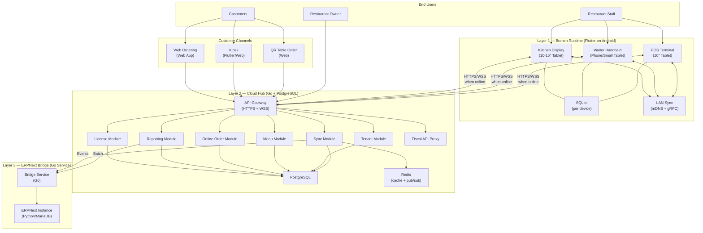

### Layer Responsibilities Summary

| Layer | Runs On | Primary Role | Offline Capable | Data Store |
|-------|---------|-------------|----------------|------------|
| **Branch Runtime** | Android devices in restaurant | POS operations, table/order/payment management | Yes (fully) | SQLite (per device) |
| **Cloud Hub** | Cloud VM / managed service | Multi-tenant management, sync, online channels, reporting, licensing | N/A (always online) | PostgreSQL + Redis |
| **ERPNext Bridge** | Cloud (co-located or separate) | Translate POS events into accounting doctypes | N/A (batch processing) | ERPNext (MariaDB) |

---

## 2. Branch Runtime Architecture (Flutter App)

### Internal Architecture

The Flutter application follows a layered architecture with clear dependency rules: outer layers depend on inner layers, never the reverse.

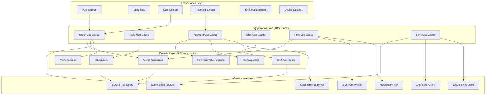

### Flutter Module Structure

```
lib/
├── main.dart
├── app/
│   ├── app.dart                    # MaterialApp, routing, DI setup
│   ├── router.dart                 # GoRouter configuration
│   └── di.dart                     # Dependency injection (get_it/riverpod)
│
├── core/
│   ├── constants/                  # App-wide constants
│   ├── errors/                     # Error types, failure classes
│   ├── extensions/                 # Dart extension methods
│   ├── money/                      # Money type (integer cents), formatting
│   ├── uuid/                       # UUID v7 generation
│   └── config/                     # Feature flags, environment config
│
├── domain/
│   ├── order/
│   │   ├── order.dart              # Order aggregate root
│   │   ├── order_line.dart         # Order line item
│   │   ├── order_status.dart       # Status enum
│   │   ├── modifier.dart           # Item modifier
│   │   └── order_repository.dart   # Repository interface
│   ├── table/
│   │   ├── table.dart              # Table entity
│   │   ├── floor_plan.dart         # Floor plan layout
│   │   └── table_repository.dart
│   ├── menu/
│   │   ├── menu_item.dart          # Menu item entity
│   │   ├── category.dart           # Menu category
│   │   ├── modifier_group.dart     # Modifier group definition
│   │   └── menu_repository.dart
│   ├── payment/
│   │   ├── payment.dart            # Payment value object
│   │   ├── payment_method.dart     # Cash, Card, etc.
│   │   ├── split.dart              # Bill splitting logic
│   │   └── tax_calculator.dart     # VAT calculation
│   ├── shift/
│   │   ├── shift.dart              # Shift aggregate
│   │   ├── cash_movement.dart      # Cash in/out
│   │   └── shift_repository.dart
│   └── sync/
│       ├── sync_event.dart         # Event sourcing event types
│       └── sync_state.dart         # Sync status tracking
│
├── application/
│   ├── order/
│   │   ├── create_order.dart       # Use case
│   │   ├── add_item.dart
│   │   ├── remove_item.dart
│   │   ├── send_to_kitchen.dart
│   │   ├── void_order.dart
│   │   └── close_order.dart
│   ├── table/
│   │   ├── open_table.dart
│   │   ├── transfer_table.dart
│   │   └── merge_tables.dart
│   ├── payment/
│   │   ├── process_payment.dart
│   │   ├── split_bill.dart
│   │   └── issue_refund.dart
│   ├── shift/
│   │   ├── open_shift.dart
│   │   ├── close_shift.dart
│   │   └── cash_in_out.dart
│   ├── print/
│   │   ├── print_receipt.dart
│   │   ├── print_kitchen_order.dart
│   │   └── print_shift_report.dart
│   └── sync/
│       ├── sync_to_cloud.dart
│       ├── sync_from_cloud.dart
│       └── sync_lan.dart
│
├── infrastructure/
│   ├── database/
│   │   ├── sqlite_database.dart    # Database initialization, migrations
│   │   ├── tables/                 # SQLite table definitions (drift)
│   │   └── daos/                   # Data access objects
│   ├── printer/
│   │   ├── printer_interface.dart  # Abstract printer
│   │   ├── bluetooth_printer.dart  # ESC/POS over Bluetooth
│   │   ├── network_printer.dart    # ESC/POS over TCP
│   │   └── receipt_formatter.dart  # Receipt layout engine
│   ├── payment_terminal/
│   │   ├── terminal_interface.dart
│   │   ├── sumup_terminal.dart     # SumUp SDK integration
│   │   └── mock_terminal.dart      # For testing
│   ├── sync/
│   │   ├── event_store.dart        # SQLite-backed event log
│   │   ├── lan_sync_service.dart   # mDNS discovery + gRPC
│   │   ├── cloud_sync_service.dart # HTTPS to Cloud Hub
│   │   └── conflict_resolver.dart  # Conflict resolution strategies
│   ├── fiscal/
│   │   ├── fiscal_interface.dart   # Country-agnostic fiscal interface
│   │   ├── germany_fiscal.dart     # Fiskaly TSE integration
│   │   └── switzerland_fiscal.dart # Swiss receipt/QR-bill
│   └── network/
│       ├── api_client.dart         # HTTP client to Cloud Hub
│       └── websocket_client.dart   # WebSocket for real-time sync
│
└── presentation/
    ├── pos/                        # POS order screen
    ├── tables/                     # Table map and management
    ├── kds/                        # Kitchen display
    ├── payment/                    # Payment flow screens
    ├── shift/                      # Shift management
    ├── settings/                   # Device settings
    ├── widgets/                    # Shared widget library
    └── theme/                      # Theme data, colors, typography
```

### Local Data Model (SQLite)

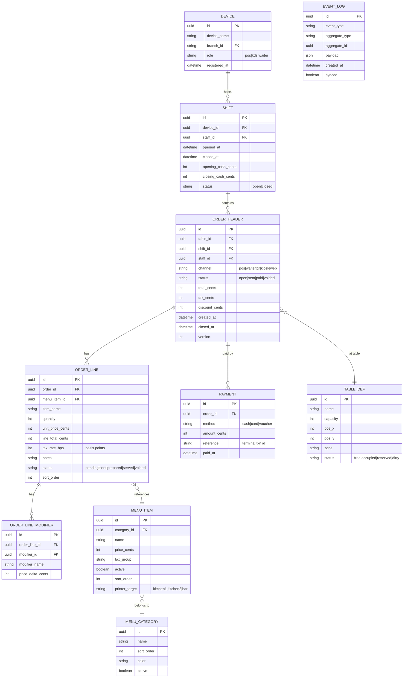

### Key Domain Rules (Enforced in Flutter)

| Rule | Implementation |
|------|---------------|
| **Money is integers** | All monetary values stored as cents/Rappen (int). CHF 42.50 = 4250. No floating point ever. |
| **UUID v7 everywhere** | All entity IDs are UUID v7 (time-sorted, offline-safe). Generated on device. |
| **Immutable transactions** | Once an order is paid/closed, it is never modified. Voids create new compensating events. |
| **Mutable master data** | Menu items, tables, staff records can be updated. Last-writer-wins on sync. |
| **Event log is append-only** | Every state change creates an event. Events are never deleted, only marked as synced. |
| **Tax rate in basis points** | 8.1% VAT = 810 bps. Avoids floating point in tax calculation. |

---

## 3. Cloud Hub Architecture (Go Modular Monolith)

### Internal Module Structure

The Cloud Hub is a single Go binary organized as a modular monolith. Modules communicate through well-defined internal interfaces (Go interfaces), not HTTP calls.

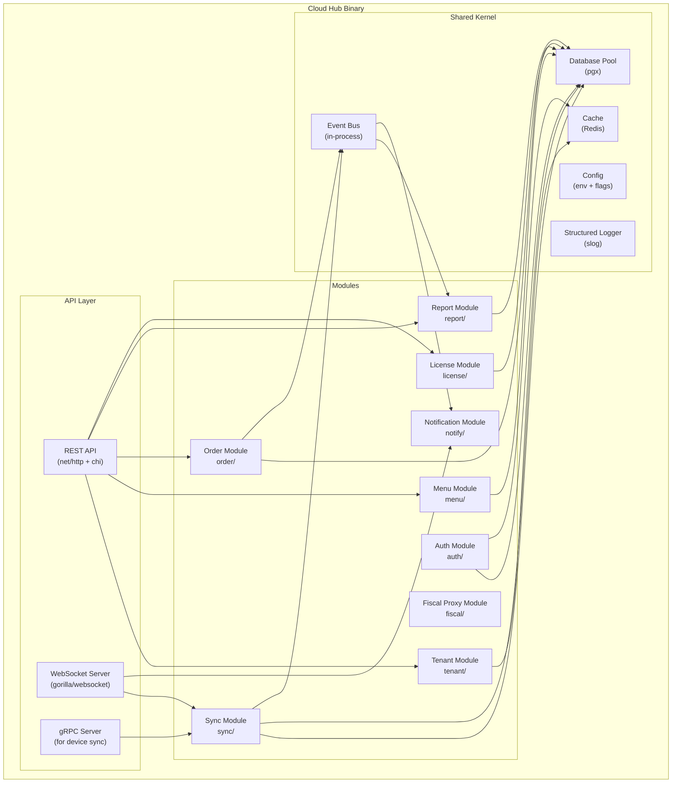

### Go Project Layout

```
cmd/
├── cloudhub/
│   └── main.go                     # Entry point, wires all modules
└── bridge/
    └── main.go                     # ERPNext bridge entry point

internal/
├── tenant/
│   ├── module.go                   # Module init, route registration
│   ├── handler.go                  # HTTP handlers
│   ├── service.go                  # Business logic
│   ├── repository.go              # DB queries (interface)
│   ├── postgres_repository.go     # PostgreSQL implementation
│   ├── model.go                    # Tenant, Branch, Device structs
│   └── tenant_test.go
│
├── auth/
│   ├── module.go
│   ├── handler.go                  # Login, token refresh, API key
│   ├── middleware.go               # JWT validation, tenant context
│   ├── service.go
│   ├── model.go                    # User, Role, Permission
│   └── jwt.go                      # Token generation/validation
│
├── sync/
│   ├── module.go
│   ├── handler.go                  # WebSocket + gRPC handlers
│   ├── service.go                  # Sync orchestration
│   ├── event_processor.go         # Process incoming device events
│   ├── conflict_resolver.go       # Conflict resolution strategies
│   ├── repository.go
│   └── model.go                    # SyncCheckpoint, SyncBatch
│
├── menu/
│   ├── module.go
│   ├── handler.go
│   ├── service.go
│   ├── repository.go
│   └── model.go                    # MenuItem, Category, ModifierGroup
│
├── order/
│   ├── module.go
│   ├── handler.go                  # Online order endpoints
│   ├── service.go                  # Order engine (shared with QR/kiosk/web)
│   ├── channel_adapter.go         # Channel-specific validation
│   ├── repository.go
│   └── model.go                    # Order, OrderLine, Payment
│
├── report/
│   ├── module.go
│   ├── handler.go
│   ├── service.go
│   ├── aggregator.go              # Sales aggregation, rollups
│   ├── repository.go
│   └── model.go                    # ReportDefinition, ReportResult
│
├── license/
│   ├── module.go
│   ├── handler.go                  # License check, activation
│   ├── service.go                  # Tier validation, feature flags
│   ├── repository.go
│   └── model.go                    # License, Tier, FeatureSet
│
├── fiscal/
│   ├── module.go
│   ├── handler.go                  # Proxy for Fiskaly, Swiss APIs
│   ├── service.go
│   ├── fiskaly_client.go          # Fiskaly TSE API client
│   ├── swiss_client.go            # Swiss fiscal API client
│   └── model.go                    # FiscalTransaction, TSEResponse
│
├── notify/
│   ├── module.go
│   ├── service.go                  # Push notifications, WebSocket broadcast
│   └── model.go
│
└── shared/
    ├── database/
    │   ├── pool.go                 # pgx connection pool
    │   ├── migrate.go              # golang-migrate integration
    │   └── tx.go                   # Transaction helper
    ├── cache/
    │   └── redis.go                # Redis client wrapper
    ├── event/
    │   └── bus.go                  # In-process event bus (channels)
    ├── config/
    │   └── config.go               # Environment + feature flags
    ├── middleware/
    │   ├── logging.go
    │   ├── recovery.go
    │   ├── cors.go
    │   └── ratelimit.go
    ├── money/
    │   └── money.go                # Money type (int64 cents)
    ├── id/
    │   └── uuid.go                 # UUID v7 generation
    └── log/
        └── logger.go               # slog structured logging
```

### Module Boundaries and Dependencies

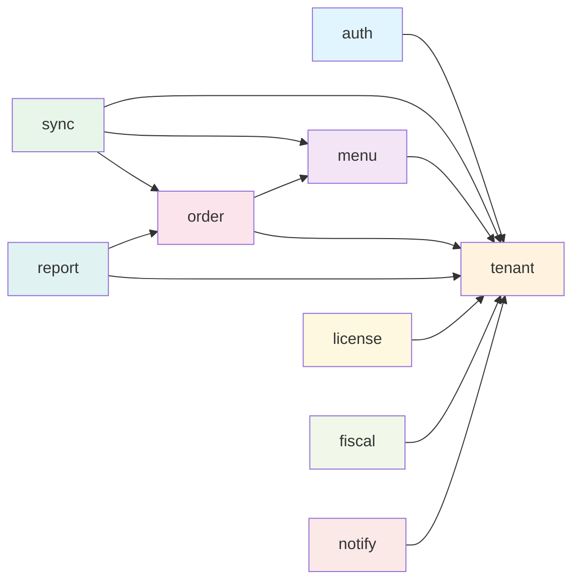

**Dependency rules:**
- All modules may depend on `tenant` (multi-tenancy is cross-cutting)
- `order` depends on `menu` (orders reference menu items)
- `report` depends on `order` (reports aggregate order data)
- `sync` depends on `menu` and `order` (syncs both)
- No circular dependencies allowed
- Modules communicate through Go interfaces, not direct struct access
- The shared kernel (database, cache, event bus) is accessible to all modules

---

## 4. ERPNext Bridge Architecture

### Bridge Design

The bridge is a standalone Go service that reads events from the Cloud Hub and translates them into ERPNext API calls. It is intentionally simple and stateless.

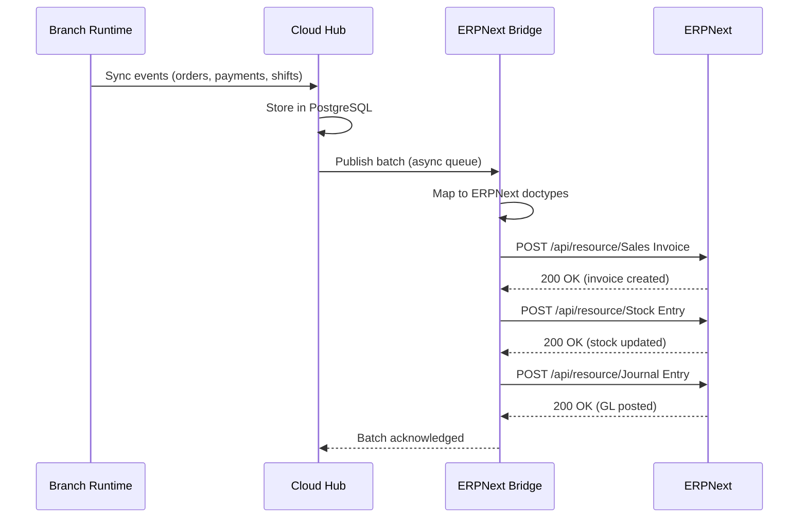

### Mapping: POS Concepts to ERPNext Doctypes

| POS Concept | ERPNext Doctype | Mapping Notes |
|-------------|----------------|---------------|
| Paid order | Sales Invoice | One invoice per paid order; items mapped to ERPNext items |
| Order line item | Sales Invoice Item | Quantity, rate, tax template |
| Cash payment | Payment Entry (Cash) | Linked to Sales Invoice |
| Card payment | Payment Entry (Bank) | Linked to Sales Invoice; terminal reference in remarks |
| Item sold | Stock Ledger Entry | Via Sales Invoice (auto-created) |
| Shift close | Journal Entry | Cash count reconciliation |
| Void/refund | Credit Note | Return Sales Invoice linked to original |
| Menu item | Item | Synced as ERPNext Item with item group |
| Menu category | Item Group | Mapped to ERPNext item groups |
| Tax rate | Tax Template | Country-pack defined templates |
| Restaurant branch | Cost Center | One cost center per branch |
| Tenant (company) | Company | Top-level ERPNext entity |

### Bridge Rules

1. **ERPNext is never in the critical path.** If the bridge is down, POS continues operating. Events queue in the Cloud Hub.
2. **Batch processing.** Events are batched (e.g., every 5 minutes or every 100 events) to minimize ERPNext API load.
3. **Idempotent writes.** Every bridge write includes a unique external reference (UUID). Duplicate calls are safely ignored by ERPNext.
4. **Error isolation.** A failed ERPNext write retries with exponential backoff. After max retries, the event is moved to a dead-letter queue for manual review. POS operation is unaffected.
5. **Version pinning.** The bridge targets a specific ERPNext API version. A compatibility test suite runs on every ERPNext upgrade.

---

## 5. Tenant, Branch, and Device Hierarchy

### Hierarchy Model

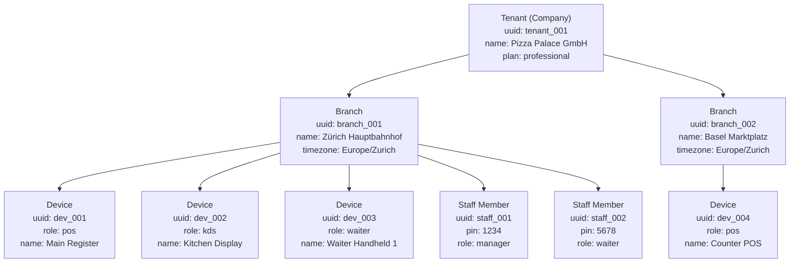

### Hierarchy Rules

| Level | Created By | Contains | Cloud Identifier |
|-------|-----------|----------|------------------|
| **Tenant** | System admin (onboarding) | Branches, billing, global settings | `tenant_id` |
| **Branch** | Tenant admin | Devices, staff, floor plans, local menu overrides | `branch_id` |
| **Device** | Branch admin (device registration) | Shifts, local orders | `device_id` |
| **Staff** | Branch admin | Shifts (as operator), orders (as creator) | `staff_id` |

### Data Scoping

Every query in the Cloud Hub is scoped by tenant. Every device-level query is further scoped by branch.

```
Tenant (Pizza Palace GmbH)
  └── Branch (Zürich)
        ├── Device (Main Register)
        │     └── Shift (2026-03-20, Marco)
        │           ├── Order #001 → Table 5
        │           ├── Order #002 → Takeaway
        │           └── Order #003 → Table 2
        ├── Device (Kitchen Display)
        │     └── (receives orders, no shifts)
        └── Staff
              ├── Marco (manager, PIN 1234)
              └── Luca (waiter, PIN 5678)
```

---

## 6. Data Ownership

### Which Layer Owns Which Data

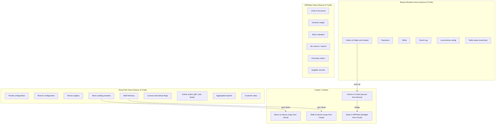

### Conflict Resolution Strategy

| Data Type | Conflict Strategy | Rationale |
|-----------|------------------|-----------|
| **Orders (transactions)** | No conflict possible | Append-only, created on one device, UUID v7 guarantees uniqueness |
| **Payments** | No conflict possible | Append-only, linked to one order, one device |
| **Menu items** | Last-writer-wins (cloud timestamp) | Menu is master-data, edited in cloud dashboard, pushed to devices |
| **Table status** | Last-writer-wins (device timestamp) | Real-time state; stale data resolves on next update |
| **Staff records** | Last-writer-wins (cloud timestamp) | Edited in cloud, pushed to devices |
| **Device config** | Device-local, no sync | Each device manages its own config |
| **Floor plan** | Last-writer-wins (cloud timestamp) | Edited in cloud dashboard |

---

## 7. Deployment Topology

### Single Restaurant (Starter Tier)

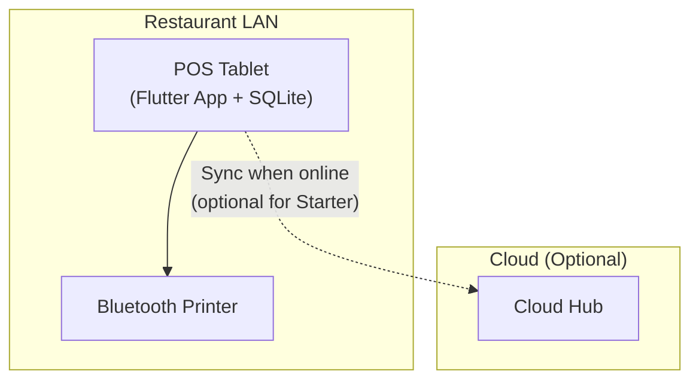

- One device, fully offline
- Cloud sync is optional (only for backup and license validation)
- No LAN sync needed (single device)

### Multi-Device Restaurant (Professional Tier)

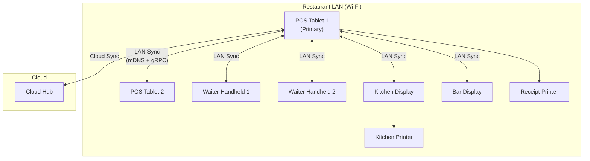

- Primary device elected (usually first POS)
- LAN sync over Wi-Fi for real-time multi-device coordination
- Cloud sync via primary device (other devices sync to primary over LAN)
- Kitchen/bar displays are read-only order receivers

### Multi-Branch Chain (Enterprise Tier)

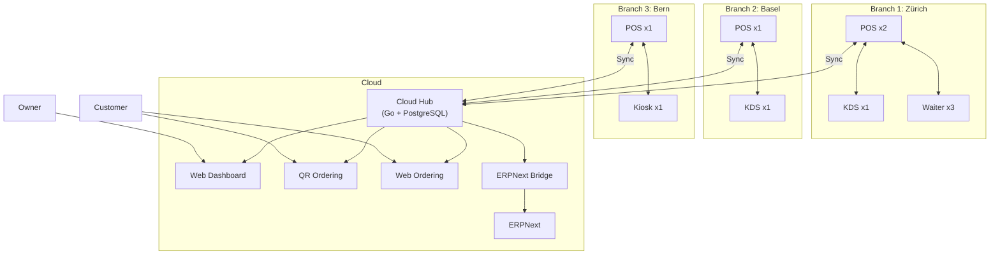

- Each branch operates independently (offline-capable)
- Cloud Hub aggregates data from all branches
- Owner sees consolidated reports in web dashboard
- Menu managed centrally, pushed to all branches
- ERPNext bridge processes all branches' data

---

## 8. Network Topology

### LAN Sync Protocol

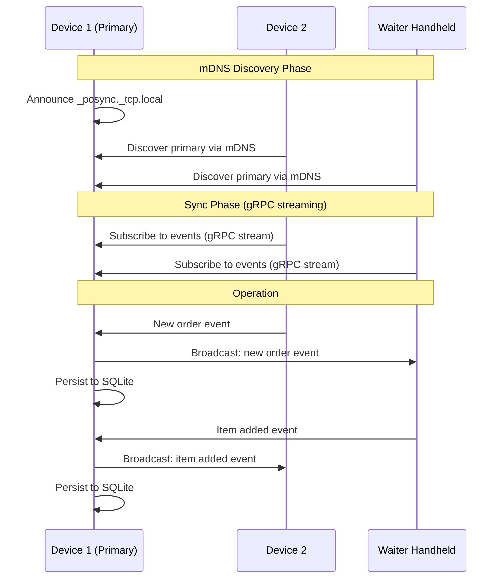

**LAN sync characteristics:**
- Primary device elected by earliest registration timestamp
- If primary goes offline, next device auto-promotes (deterministic election)
- gRPC bidirectional streaming for sub-100ms event propagation
- mDNS for zero-configuration device discovery on same Wi-Fi network
- No internet required for LAN sync

### Cloud Sync Protocol

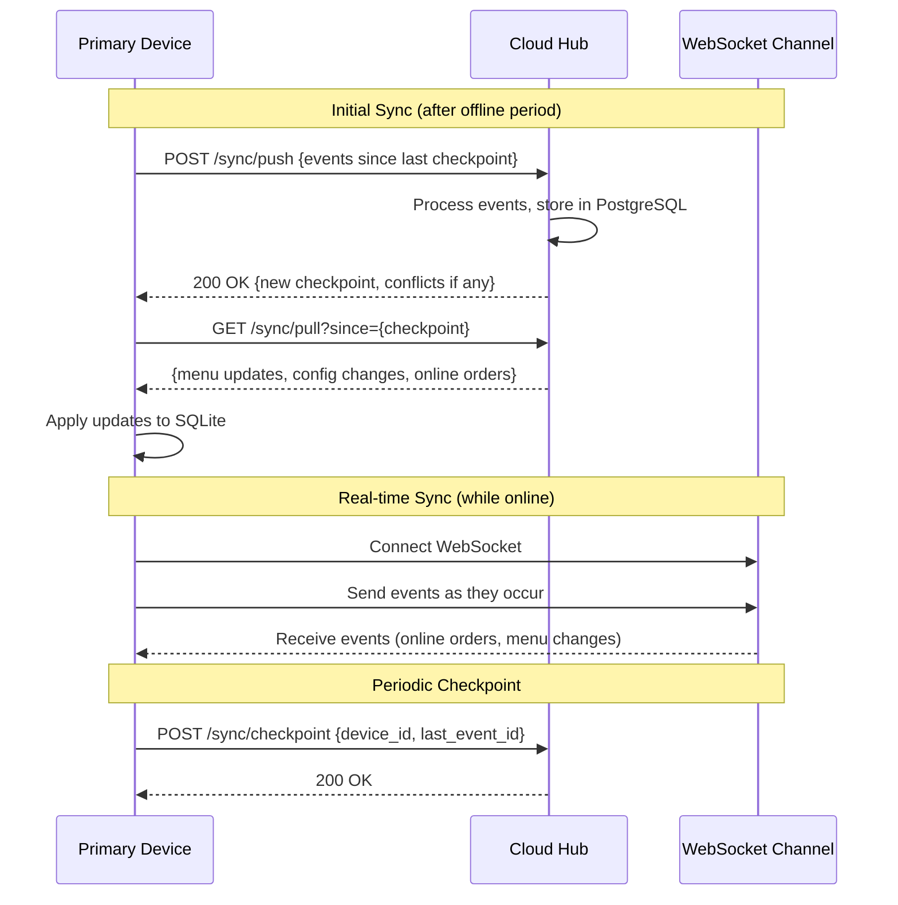

**Cloud sync characteristics:**
- Push-pull model: device pushes events, pulls updates
- Checkpoint-based: each device tracks its last synced position
- WebSocket for real-time when online; HTTP batch for catch-up after offline
- Idempotent: replaying events is safe (UUID v7 deduplication)
- Compressed: events are gzipped in transit

---

## 9. Technology Stack

### Complete Stack with Justifications

| Layer | Technology | Version | Justification |
|-------|-----------|---------|---------------|
| **Mobile runtime** | Flutter | 3.x (stable) | Cross-platform (Android primary, iOS future); Dart is productive; rich widget library; native performance via Skia/Impeller |
| **Mobile language** | Dart | 3.x | Type-safe, null-safe, async/await, compiles to native ARM |
| **Local database** | SQLite (via drift) | drift 2.x | Zero-config embedded DB; ACID compliant; proven at billions of deployments; drift provides type-safe Dart queries |
| **Local event store** | SQLite table | -- | Same SQLite instance; append-only table; no additional dependency |
| **LAN discovery** | mDNS | -- | Zero-configuration service discovery on local network; works without internet; Android native support |
| **LAN sync protocol** | gRPC | -- | Bidirectional streaming; efficient binary protocol (protobuf); code generation for Dart and Go |
| **Bluetooth printing** | ESC/POS over Bluetooth SPP | -- | Industry standard for thermal receipt printers; esc_pos_bluetooth Flutter package |
| **Network printing** | ESC/POS over TCP | -- | Kitchen printers on LAN; raw TCP socket to port 9100 |
| **Cloud backend** | Go | 1.22+ | Compiled single binary; low memory; high concurrency (goroutines); excellent stdlib (net/http); fast builds |
| **HTTP router** | chi | 5.x | Lightweight, composable middleware, standard net/http compatible |
| **Cloud database** | PostgreSQL | 16+ | ACID, JSONB for flexible schemas, excellent full-text search, mature replication; industry standard |
| **Database driver** | pgx | 5.x | Pure Go PostgreSQL driver; highest performance; connection pooling; type-safe |
| **Database migrations** | golang-migrate | 4.x | SQL-based migrations; CLI + library; reversible |
| **Cache / pub-sub** | Redis | 7.x | Session cache, rate limiting, pub/sub for real-time notifications; Redis Stack for search if needed |
| **WebSocket** | gorilla/websocket | 1.x | Mature Go WebSocket library; widely used; simple API |
| **Authentication** | JWT (RS256) | -- | Stateless auth for API; RS256 for key rotation; short-lived access + long-lived refresh tokens |
| **API documentation** | OpenAPI 3.1 | -- | Industry standard; code-gen for clients; Swagger UI for dev portal |
| **ERPNext integration** | ERPNext REST API | v15 LTS | Standard HTTP/JSON; no Frappe dependency in our code; pin to LTS |
| **Germany fiscal** | Fiskaly Cloud TSE | v2 | Certified TSE provider; REST API; handles KassenSichV compliance |
| **Monitoring** | Prometheus + Grafana | -- | De facto standard for Go services; rich ecosystem; self-hosted or cloud |
| **Logging** | Go slog (structured) | stdlib | Built into Go 1.21+; JSON output; zero dependency |
| **CI/CD** | GitHub Actions | -- | Generous free tier; good Go/Flutter support; artifact management |
| **Cloud hosting** | Hetzner Cloud (initial) | -- | European data center (GDPR); excellent price/performance; Zurich and Nuremberg locations |
| **Container** | Docker | -- | Single Dockerfile per service; docker-compose for dev; straightforward deployment |
| **IaC** | Terraform (future) | -- | When multi-region; for now, simple Docker Compose on single VM |

### Why NOT These Alternatives

| Rejected Technology | Reason |
|--------------------|--------|
| **React Native** | Worse offline/database story; Expo limitations; Flutter's rendering engine is more consistent |
| **Kotlin Multiplatform** | Less mature for UI; smaller ecosystem for POS-specific libraries |
| **Node.js (backend)** | Single-threaded; less performant than Go for concurrent sync workloads; larger memory footprint |
| **Rust (backend)** | Higher learning curve; slower development velocity; Go is fast enough for our scale |
| **MongoDB** | No ACID transactions (historically); PostgreSQL JSONB covers flexible schema needs |
| **MySQL/MariaDB** | PostgreSQL has better JSONB, full-text search, and extension ecosystem |
| **Firebase** | Vendor lock-in; poor offline conflict resolution for complex data; pricing unpredictable at scale |
| **Supabase** | Good but adds dependency; we want full control of sync engine |
| **AWS/GCP/Azure** | Overkill and expensive for initial launch; Hetzner is 3-5x cheaper for comparable European VMs |
| **Kubernetes** | Massive complexity for a small team; single-VM Docker Compose is sufficient until 100+ tenants |

---

## 10. Cross-Cutting Concerns

### Logging

| Layer | Technology | Format | Destination |
|-------|-----------|--------|-------------|
| Flutter app | dart `logging` package | JSON (in release) | Local file (rotated, max 10MB) + cloud upload when syncing |
| Go cloud hub | `slog` (stdlib) | JSON | stdout (captured by Docker) -> Loki/file |
| ERPNext bridge | `slog` (stdlib) | JSON | stdout -> Loki/file |

**Log levels:** DEBUG (dev only), INFO (operations), WARN (degraded), ERROR (failure requiring attention).

**Structured fields (always present):** `tenant_id`, `branch_id`, `device_id`, `request_id`, `timestamp`.

### Monitoring

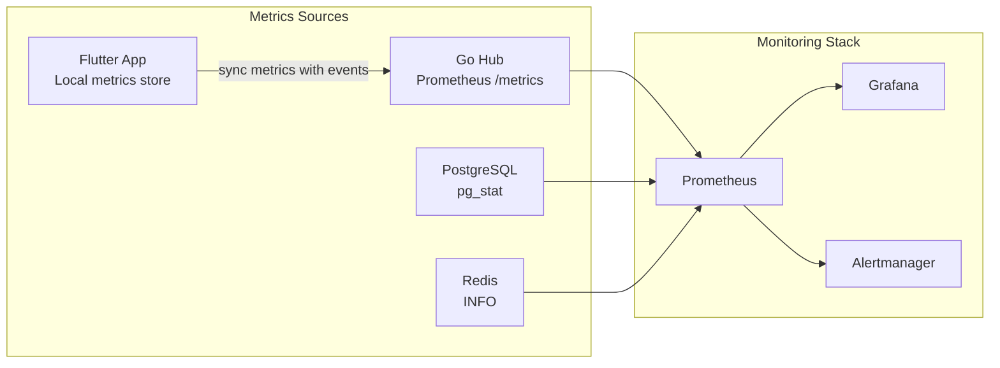

**Key metrics:**

| Metric | Source | Alert Threshold |
|--------|--------|----------------|
| API response time (p99) | Go hub | > 500ms |
| Sync lag (max time since last sync) | Go hub | > 1 hour |
| Error rate (5xx) | Go hub | > 1% |
| PostgreSQL connection pool usage | pgx | > 80% |
| Disk usage | VM | > 85% |
| Event queue depth (bridge) | Bridge | > 10,000 events |
| Device offline duration | Cloud hub | > 24 hours (notify owner) |
| License expiry approaching | License module | 30 days before expiry |

### Configuration

| Configuration Type | Storage | Changed By | Example |
|-------------------|---------|-----------|---------|
| **Environment config** | Environment variables | DevOps | `DATABASE_URL`, `REDIS_URL`, `PORT` |
| **Feature flags** | PostgreSQL (license module) | System (based on tier) | `feature.kds.enabled`, `feature.online_ordering.enabled` |
| **Tenant config** | PostgreSQL (tenant module) | Tenant admin | Company name, logo, currency, timezone |
| **Branch config** | PostgreSQL (tenant module) | Branch admin | Address, printer settings, floor plan |
| **Device config** | SQLite (local) | Device setup wizard | Device name, role, paired printers |
| **Menu config** | PostgreSQL (menu module) | Menu editor | Items, categories, prices, modifiers |

### Feature Flags for License Tiers

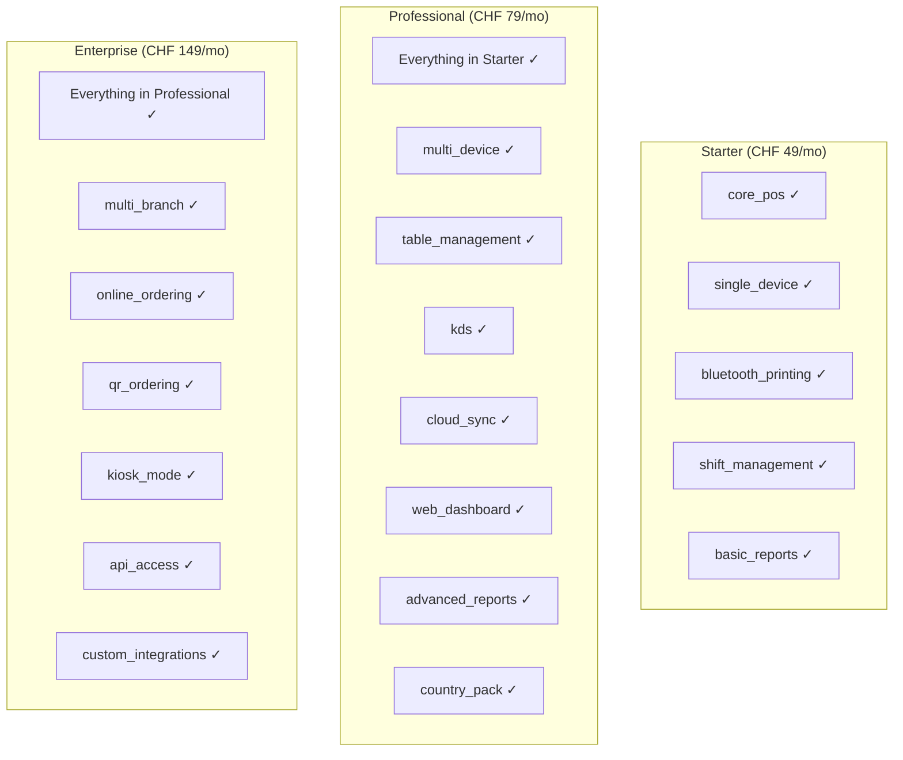

Feature flags are enforced at two levels:
1. **Cloud Hub:** API endpoints check tier before returning data or accepting requests
2. **Flutter App:** UI modules are conditionally loaded based on license tier (checked at startup and on sync)

### Security

| Concern | Implementation |
|---------|---------------|
| **Authentication (API)** | JWT with RS256; access token (15 min) + refresh token (30 days) |
| **Authentication (POS)** | Staff PIN (4-6 digits) for device access; device is pre-authenticated with API key |
| **Authorization** | Role-based (waiter, cashier, manager, admin); permissions checked at use-case layer |
| **Data in transit** | TLS 1.3 for all cloud communication; LAN sync uses TLS with self-signed certs (pinned) |
| **Data at rest** | SQLite database encrypted with SQLCipher (AES-256); PostgreSQL with disk encryption |
| **API keys** | Per-device API key generated on registration; revocable; rotatable |
| **Tenant isolation** | Row-level security in PostgreSQL; every query includes `WHERE tenant_id = $1` |
| **PII handling** | Customer data minimal; GDPR compliance; data deletion on request |
| **Fiscal integrity** | Event log is append-only and tamper-evident (hash chain); Fiskaly TSE for Germany |

---

## 11. Sync Flow (Detailed)

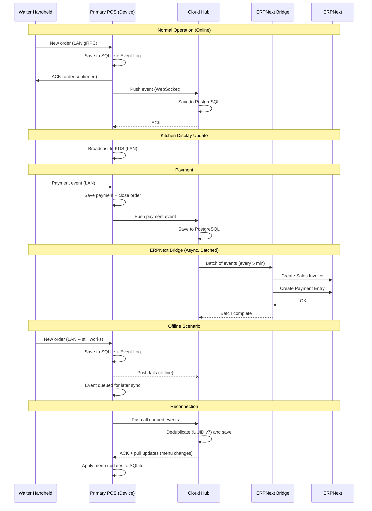

---

## 12. Data Flow Overview

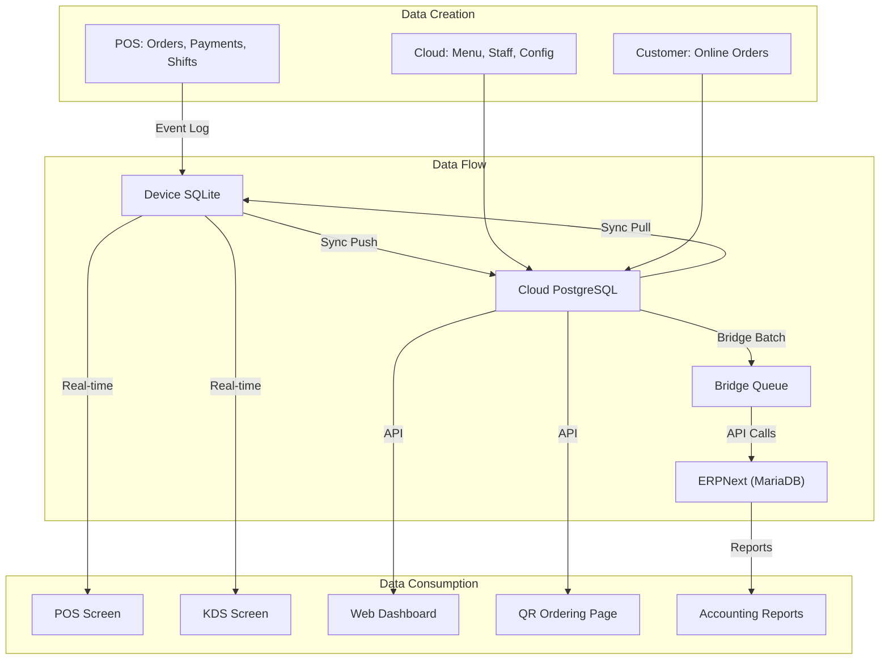

---

## 13. Appendix: Key Design Decisions Summary

| Decision | Choice | Alternative Considered | Rationale |
|----------|--------|----------------------|-----------|
| ID generation | UUID v7 | Auto-increment, ULID, CUID | Time-sorted, offline-safe, 128-bit, RFC 9562 standard |
| Money representation | Integer (cents) | Decimal, float | No floating-point errors; exact arithmetic; industry standard for financial systems |
| Local database | SQLite (drift) | Hive, ObjectBox, Isar | ACID, SQL, proven, drift gives type-safe Dart layer, works with 1M+ rows |
| Cloud database | PostgreSQL | MySQL, CockroachDB | JSONB, row-level security, excellent Go driver (pgx), extensions ecosystem |
| Backend language | Go | Rust, Node.js, Java | Single binary, goroutines, fast compilation, small team can maintain |
| Frontend framework | Flutter | React Native, Kotlin MP | Best offline story, Skia rendering, single codebase, Material Design 3 |
| Sync strategy | Event sourcing lite | CRDT, full event sourcing | CRDTs are complex; full ES needs projection rebuild; lite gives audit + sync without overhead |
| Conflict resolution | LWW (master data), append-only (transactions) | OT, CRDT | Transactions never conflict (unique UUIDs); master data edits are rare and cloud-authoritative |
| Monolith vs. microservices | Modular monolith | Microservices | Team of 1-5; no Kubernetes overhead; module boundaries allow future extraction |
| Printing | ESC/POS direct | PDF generation | ESC/POS is universal for thermal printers; fast; no rendering overhead |
| Authentication | JWT + device API key | Session cookies, OAuth | Stateless API; device keys for M2M; JWT for user sessions |
| Hosting | Hetzner Cloud | AWS, GCP, Azure | European data centers; 3-5x cheaper; sufficient for scale; GDPR compliance by location |
