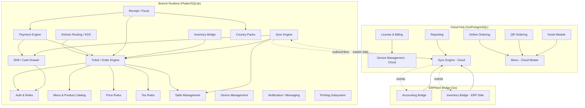
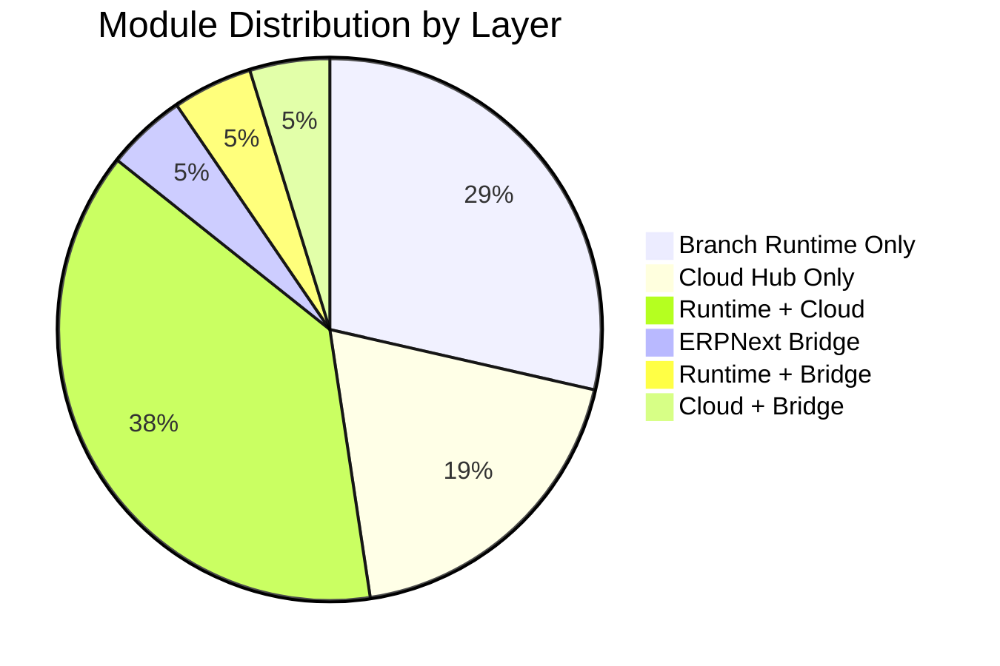
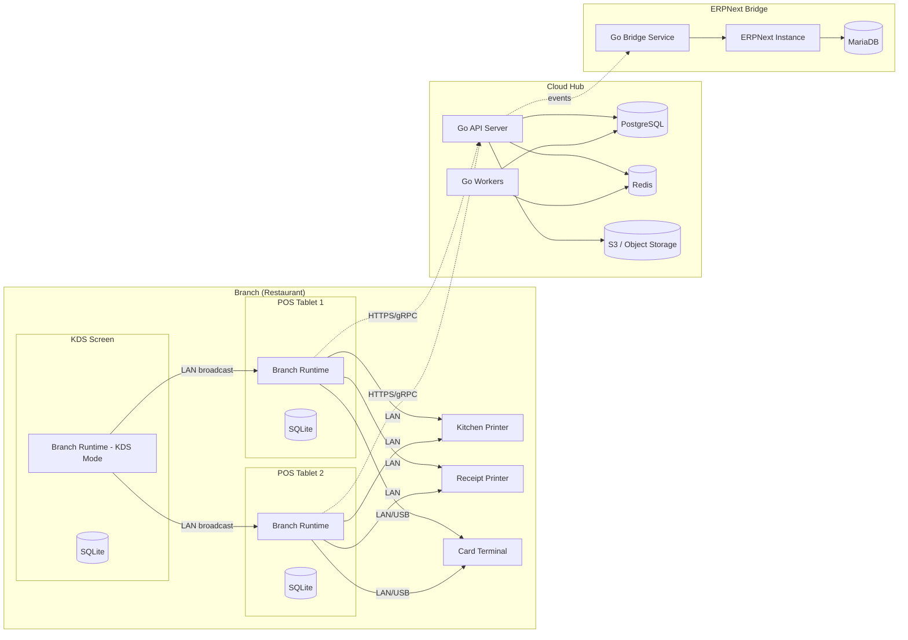

# 04 - Module Map & Bounded Contexts

> Restaurant POS Platform -- Modular Monolith Architecture
> Last updated: 2026-03-20

---

## 1. Architecture Overview

The platform is decomposed into **21 bounded contexts** (modules) distributed across three deployment layers:

| Layer | Runtime | Language | Storage | Network |
|-------|---------|----------|---------|---------|
| **Branch Runtime** | Flutter Android tablet/phone | Dart + native plugins | SQLite (per-device) | LAN (printers, KDS), internet optional |
| **ERPNext Bridge** | Sidecar / cloud service | Go | ERPNext API (MariaDB behind) | REST/gRPC to cloud, REST to ERPNext |
| **Cloud Hub** | Central API + workers | Go | PostgreSQL, Redis, S3 | HTTPS, WebSocket, gRPC |

Modules communicate within a layer via **in-process function calls** and across layers via **sync events** (offline-safe outbox pattern). There are no synchronous cross-layer calls required for core POS operations.

---

## 2. Module Dependency Graph



---

## 3. Module Detail Sheets

---

### 3.1 Auth & Roles

| Property | Value |
|----------|-------|
| **Owner Context** | Branch Runtime |
| **Layer** | Runtime (primary), Cloud (user provisioning) |
| **Aggregate Roots** | `User`, `Role` |

**Core Responsibilities:**

- PIN-based fast login for POS terminals (4-6 digit numeric PIN)
- Role-Based Access Control (RBAC) with predefined + custom roles
- Manager override flow (supervisor enters PIN to authorize restricted actions)
- Device authentication via pairing token (device ↔ branch binding)
- Session management with auto-lock after configurable idle timeout
- Permission evaluation at UI and domain command level
- Audit trail of all authentication events (login, logout, override, failed attempts)
- Clock-in/clock-out integration with shift module
- Multi-device concurrent session support (same user, different devices)
- Cloud-synced user directory with offline capability

**External Dependencies:**

| Dependency | Type | Required |
|------------|------|----------|
| Cloud Hub (user provisioning) | Sync | For initial setup, then offline-capable |
| Shift module | In-process | Clock-in triggers shift association |
| Country Packs | Plugin | Locale-specific PIN rules |

**Events Published:**

| Event | Payload | Description |
|-------|---------|-------------|
| `UserLoggedIn` | user_id, device_id, timestamp, method | PIN or device auth succeeded |
| `UserLoggedOut` | user_id, device_id, reason | Manual or auto-lock |
| `ManagerOverrideGranted` | manager_id, requester_id, action, ticket_id | Override approved |
| `ManagerOverrideDenied` | manager_id, requester_id, action, reason | Override rejected |
| `LoginFailed` | device_id, attempted_pin_hash, attempt_count | Security event |
| `UserRoleChanged` | user_id, old_role, new_role, changed_by | Role assignment changed |
| `DevicePaired` | device_id, branch_id, paired_by | New device paired |
| `DeviceUnpaired` | device_id, branch_id, reason | Device removed |

**Events Consumed:**

| Event | Source | Action |
|-------|--------|--------|
| `ShiftOpened` | Shift module | Associate user with active shift |
| `UserUpdatedFromCloud` | Sync Engine | Update local user record |
| `LicenseChanged` | License module | May restrict user count |

**API Surface:**

```
Runtime (in-process):
  authenticateByPin(pin: string, device_id: UUID) → AuthResult
  authenticateDevice(token: string) → DeviceAuthResult
  authorizeAction(user_id: UUID, permission: string) → bool
  requestManagerOverride(action: string, context: map) → OverrideResult
  getCurrentUser() → User
  listPermissions(role_id: UUID) → Permission[]

Cloud (REST):
  POST   /api/v1/tenants/{id}/users
  PUT    /api/v1/tenants/{id}/users/{id}
  GET    /api/v1/tenants/{id}/users
  POST   /api/v1/tenants/{id}/roles
  POST   /api/v1/branches/{id}/devices/pair
```

**Data Owned:**

| Entity | Storage | Sync Direction |
|--------|---------|----------------|
| User | Runtime SQLite + Cloud PG | Cloud → Runtime (master) |
| Role | Runtime SQLite + Cloud PG | Cloud → Runtime (master) |
| Permission | Runtime SQLite + Cloud PG | Cloud → Runtime (master) |
| AuthEvent (log) | Runtime SQLite | Runtime → Cloud (append-only) |
| DeviceAuth | Runtime SQLite | Cloud → Runtime |

---

### 3.2 Menu & Product Catalog

| Property | Value |
|----------|-------|
| **Owner Context** | Cloud Hub (master), Branch Runtime (local copy) |
| **Layer** | Cloud (authoring), Runtime (serving) |
| **Aggregate Roots** | `Menu` |

**Core Responsibilities:**

- Hierarchical category management (up to 3 levels: group → category → subcategory)
- Product definition with multilingual name/description (DE, FR, IT, EN)
- Modifier groups with min/max selection rules and nested modifiers
- Product variants (size, preparation style) as modifier groups
- Image management with cloud storage and local caching
- Product search by name, barcode, PLU number, and tags
- Menu scheduling (breakfast menu, lunch menu, dinner menu by time window)
- Channel-specific menu visibility (POS shows all; kiosk may hide some)
- Allergen and nutritional information per product
- Menu versioning with publish/draft workflow

**External Dependencies:**

| Dependency | Type | Required |
|------------|------|----------|
| Price Rules | In-process | Price lookup for display |
| Tax Rules | In-process | Tax display on menus |
| Sync Engine | In-process | Menu distribution to branches |
| License | In-process | Product count limits |
| S3/object storage | Cloud | Image hosting |

**Events Published:**

| Event | Payload | Description |
|-------|---------|-------------|
| `MenuPublished` | menu_id, version, branch_ids | New menu version activated |
| `ProductCreated` | product_id, category_id, details | New product added |
| `ProductUpdated` | product_id, changed_fields, version | Product modified |
| `ProductDisabled` | product_id, reason | Product taken off menu |
| `CategoryReordered` | category_id, new_sort_order | Display order changed |
| `ModifierGroupUpdated` | modifier_group_id, changes | Modifier rules changed |
| `MenuScheduleChanged` | menu_id, schedule | Time windows updated |

**Events Consumed:**

| Event | Source | Action |
|-------|--------|--------|
| `InventoryLow` | Inventory Bridge | Mark product as "86'd" (out of stock) |
| `SyncCompleted` | Sync Engine | Confirm menu version active at branch |
| `LicenseChanged` | License | Enforce product count limits |

**API Surface:**

```
Runtime (in-process):
  getActiveMenu(branch_id: UUID, channel: Channel, time: DateTime) → Menu
  searchProducts(query: string, filters: ProductFilter) → Product[]
  getProduct(product_id: UUID) → Product with modifiers
  getModifierGroups(product_id: UUID) → ModifierGroup[]

Cloud (REST):
  GET    /api/v1/tenants/{id}/menus
  POST   /api/v1/tenants/{id}/menus
  PUT    /api/v1/tenants/{id}/menus/{id}
  POST   /api/v1/tenants/{id}/menus/{id}/publish
  CRUD   /api/v1/tenants/{id}/products
  CRUD   /api/v1/tenants/{id}/categories
  CRUD   /api/v1/tenants/{id}/modifier-groups
  GET    /api/v1/public/menus/{slug}  (online ordering)
```

**Data Owned:**

| Entity | Storage | Sync Direction |
|--------|---------|----------------|
| Menu | Cloud PG (master) + Runtime SQLite | Cloud → Runtime |
| Category | Cloud PG + Runtime SQLite | Cloud → Runtime |
| Product | Cloud PG + Runtime SQLite | Cloud → Runtime |
| ModifierGroup | Cloud PG + Runtime SQLite | Cloud → Runtime |
| Modifier | Cloud PG + Runtime SQLite | Cloud → Runtime |
| ProductImage | S3 + local cache | Cloud → Runtime |

---

### 3.3 Price Rules

| Property | Value |
|----------|-------|
| **Owner Context** | Cloud Hub (configuration), Branch Runtime (evaluation) |
| **Layer** | Cloud (config), Runtime (engine) |
| **Aggregate Roots** | Part of `Menu` aggregate |

**Core Responsibilities:**

- Price list management (default, happy hour, employee, VIP, takeaway)
- Time-based automatic price activation (happy hour 16:00-18:00)
- Day-of-week pricing (weekend surcharge, Monday special)
- Combo/deal pricing (burger + drink + fries = fixed price)
- Quantity-based discounts (buy 3 get 1 free, 10% off 6+ bottles)
- Manual discount application with permission levels
- Price override with manager approval and audit trail
- Channel-specific pricing (kiosk vs POS vs online)
- Price snapshot capture at order time (immutable on ticket)
- Rounding rules per country (CHF rounds to 0.05)

**External Dependencies:**

| Dependency | Type | Required |
|------------|------|----------|
| Menu module | In-process | Product base prices |
| Auth module | In-process | Permission check for discounts |
| Tax Rules | In-process | Tax-inclusive/exclusive calculation |
| Country Packs | Plugin | Rounding rules |

**Events Published:**

| Event | Payload | Description |
|-------|---------|-------------|
| `PriceListActivated` | price_list_id, branch_id, time_window | New price list in effect |
| `PriceListDeactivated` | price_list_id, reason | Price list expired or disabled |
| `DiscountApplied` | ticket_id, discount_type, amount, authorized_by | Discount on ticket |
| `PriceOverridden` | item_id, original, override, manager_id | Manager price override |
| `ComboApplied` | ticket_id, combo_id, items, savings | Combo deal detected |

**Events Consumed:**

| Event | Source | Action |
|-------|--------|--------|
| `TicketItemAdded` | Ticket Engine | Evaluate combo eligibility |
| `MenuPublished` | Menu module | Revalidate price rules against menu |
| `SyncCompleted` | Sync Engine | Activate new price lists |

**API Surface:**

```
Runtime (in-process):
  resolvePrice(product_id: UUID, context: PriceContext) → ResolvedPrice
  evaluateDiscounts(ticket: Ticket) → DiscountSuggestion[]
  applyDiscount(ticket_id: UUID, discount: Discount, auth: AuthContext) → Result
  getActivePriceLists(branch_id: UUID, time: DateTime) → PriceList[]

Cloud (REST):
  CRUD   /api/v1/tenants/{id}/price-lists
  CRUD   /api/v1/tenants/{id}/price-rules
  CRUD   /api/v1/tenants/{id}/combos
```

**Data Owned:**

| Entity | Storage | Sync Direction |
|--------|---------|----------------|
| PriceList | Cloud PG + Runtime SQLite | Cloud → Runtime |
| PriceRule | Cloud PG + Runtime SQLite | Cloud → Runtime |
| Discount (applied) | Runtime SQLite | Runtime → Cloud (via ticket) |

---

### 3.4 Tax Rules

| Property | Value |
|----------|-------|
| **Owner Context** | Cloud Hub (configuration), Branch Runtime (calculation) |
| **Layer** | Cloud (config), Runtime (engine) |
| **Aggregate Roots** | Part of `Menu` aggregate (config), captured on `Ticket` |

**Core Responsibilities:**

- Tax category management (standard, reduced, zero-rated, exempt)
- Tax rate configuration per country with effective dates
- Dine-in vs. takeaway tax differentiation (critical for DE/CH)
- Tax-inclusive pricing display (Europe standard) with net extraction
- Tax calculation per line item with proper rounding
- Tax summary per receipt (grouped by rate)
- Tax rate change handling (scheduled rate changes)
- VAT registration number validation
- Reverse charge support for B2B (future)
- Country pack integration for jurisdiction-specific logic

**External Dependencies:**

| Dependency | Type | Required |
|------------|------|----------|
| Country Packs | Plugin | Tax logic per jurisdiction |
| Menu module | In-process | Product tax category assignment |
| Receipt module | In-process | Tax summary for receipts |

**Events Published:**

| Event | Payload | Description |
|-------|---------|-------------|
| `TaxRateChanged` | tax_category_id, old_rate, new_rate, effective_date | Rate updated |
| `TaxCalculated` | ticket_id, tax_breakdown | Tax computed for ticket |

**Events Consumed:**

| Event | Source | Action |
|-------|--------|--------|
| `TicketItemAdded` | Ticket Engine | Calculate tax for item |
| `TicketServiceTypeChanged` | Ticket Engine | Recalculate (dine-in ↔ takeaway) |
| `CountryPackUpdated` | Country Packs | Reload tax rules |

**API Surface:**

```
Runtime (in-process):
  calculateTax(item: OrderItem, service_type: ServiceType, country: Country) → TaxResult
  getTaxSummary(ticket: Ticket) → TaxSummary[]
  getTaxCategories(country: Country) → TaxCategory[]

Cloud (REST):
  CRUD   /api/v1/tenants/{id}/tax-categories
  CRUD   /api/v1/tenants/{id}/tax-rates
```

**Data Owned:**

| Entity | Storage | Sync Direction |
|--------|---------|----------------|
| TaxCategory | Cloud PG + Runtime SQLite | Cloud → Runtime |
| TaxRate | Cloud PG + Runtime SQLite | Cloud → Runtime |
| TaxLineItem (calculated) | Runtime SQLite | Runtime → Cloud (via ticket) |

---

### 3.5 Table Management

| Property | Value |
|----------|-------|
| **Owner Context** | Branch Runtime |
| **Layer** | Runtime (primary), Cloud (floor plan config) |
| **Aggregate Roots** | `Table` |

**Core Responsibilities:**

- Floor plan definition with visual table layout (drag-and-drop in cloud admin)
- Table state tracking with real-time status (Available, Occupied, etc.)
- Table session management (open, close, transfer between waiters)
- Table merge (combine two physical tables, link their tickets)
- Table split (separate a merged table back)
- Move ticket to a different table
- Table capacity and guest count tracking
- Section/area assignment for waiter station management
- Table reservation placeholder (basic, no full reservation system)
- Table turn time tracking for operational metrics

**External Dependencies:**

| Dependency | Type | Required |
|------------|------|----------|
| Ticket Engine | In-process | Ticket ↔ table session binding |
| Auth module | In-process | Waiter assignment permissions |
| Notification | In-process | Table status change alerts |

**Events Published:**

| Event | Payload | Description |
|-------|---------|-------------|
| `TableOpened` | table_id, session_id, waiter_id, guest_count | New table session started |
| `TableClosed` | table_id, session_id, duration | Table session ended |
| `TableMerged` | source_table_ids, target_table_id | Tables combined |
| `TableSplit` | source_table_id, new_table_ids | Merged table separated |
| `TableMoved` | ticket_id, from_table_id, to_table_id | Ticket transferred |
| `TableStatusChanged` | table_id, old_status, new_status | State machine transition |
| `WaiterAssigned` | table_id, waiter_id | Waiter takes table |
| `GuestCountUpdated` | table_id, session_id, count | Covers changed |

**Events Consumed:**

| Event | Source | Action |
|-------|--------|--------|
| `TicketCreated` | Ticket Engine | Transition table to Occupied |
| `TicketFullyPaid` | Payment Engine | Transition table to Cleaning |
| `TicketVoided` | Ticket Engine | Transition table to Available |
| `ShiftClosed` | Shift module | Force-close orphan sessions |

**API Surface:**

```
Runtime (in-process):
  getFloorPlan(branch_id: UUID) → Floor[]
  getTableStatus(table_id: UUID) → TableState
  openTable(table_id: UUID, waiter_id: UUID, guests: int) → TableSession
  closeTable(table_id: UUID) → Result
  mergeTables(table_ids: UUID[]) → MergeResult
  splitTable(table_id: UUID) → SplitResult
  moveTicket(ticket_id: UUID, to_table_id: UUID) → Result
  getAllTableStatuses(floor_id: UUID) → TableStatusMap

Cloud (REST):
  CRUD   /api/v1/branches/{id}/floors
  CRUD   /api/v1/branches/{id}/tables
```

**Data Owned:**

| Entity | Storage | Sync Direction |
|--------|---------|----------------|
| Floor (TableArea) | Cloud PG + Runtime SQLite | Cloud → Runtime (layout) |
| Table | Cloud PG + Runtime SQLite | Bidirectional |
| TableSession | Runtime SQLite | Runtime → Cloud |

---

### 3.6 Ticket / Order Engine

| Property | Value |
|----------|-------|
| **Owner Context** | Branch Runtime |
| **Layer** | Runtime (primary, authoritative) |
| **Aggregate Roots** | `Ticket` |

> **This is the central module.** All ordering channels (POS, waiter, QR, kiosk, online) produce Tickets through channel adapters. The Ticket aggregate is the richest domain object in the system.

**Core Responsibilities:**

- Ticket creation from any channel via channel adapter pattern
- Order item management (add, remove, modify quantity, void)
- Modifier application with validation against modifier group rules
- Course assignment and fire control (hold, fire, rush)
- Price snapshot capture at item-add time (immutable once added)
- Tax calculation trigger per item and per ticket
- Ticket-level and item-level discount/surcharge application
- Ticket splitting (one ticket to multiple for split bills)
- Ticket merging (combine tickets from merged tables)
- Ticket transfer (move to different table/waiter)
- Service type management (dine-in, takeaway, delivery)
- Notes and special instructions (ticket-level and item-level)
- Void workflow with reason codes and manager authorization
- Channel-specific metadata (online order ref, kiosk terminal, QR table)
- Ticket lifecycle state machine enforcement
- Event sourcing: all mutations append to ticket event log

**External Dependencies:**

| Dependency | Type | Required |
|------------|------|----------|
| Menu module | In-process | Product/modifier lookup |
| Price Rules | In-process | Price resolution |
| Tax Rules | In-process | Tax calculation |
| Table Management | In-process | Table session binding |
| Auth module | In-process | Permission checks, waiter assignment |
| Kitchen Routing | In-process | Kitchen ticket generation on send |
| Payment Engine | In-process | Bill/payment lifecycle |
| Sync Engine | In-process | Offline event outbox |

**Events Published:**

| Event | Payload | Description |
|-------|---------|-------------|
| `TicketCreated` | ticket_id, channel, table_id, waiter_id | New order started |
| `TicketItemAdded` | ticket_id, item_id, product_id, qty, price_snapshot | Item added |
| `TicketItemRemoved` | ticket_id, item_id, reason | Item removed (before kitchen) |
| `TicketItemVoided` | ticket_id, item_id, reason, voided_by, manager_id | Item voided (after kitchen) |
| `TicketItemModified` | ticket_id, item_id, changes | Quantity or modifier changed |
| `TicketSentToKitchen` | ticket_id, kitchen_ticket_ids, items | Fire command |
| `TicketCourseFired` | ticket_id, course_number, items | Specific course fired |
| `TicketCourseHeld` | ticket_id, course_number | Course held back |
| `TicketDiscountApplied` | ticket_id, discount | Discount added |
| `TicketServiceTypeChanged` | ticket_id, old_type, new_type | Dine-in ↔ takeaway |
| `TicketMoved` | ticket_id, from_table, to_table | Table transfer |
| `TicketMerged` | source_ticket_ids, target_ticket_id | Tickets combined |
| `TicketSplit` | source_ticket_id, new_ticket_ids, item_allocation | Ticket divided |
| `TicketBillRequested` | ticket_id, bill_ids | Bill(s) generated |
| `TicketFullyPaid` | ticket_id, total, payments | All bills settled |
| `TicketClosed` | ticket_id, closed_at, duration, total | Terminal state |
| `TicketVoided` | ticket_id, reason, voided_by | Entire ticket voided |
| `TicketNoteAdded` | ticket_id, item_id (nullable), note | Note/instruction |

**Events Consumed:**

| Event | Source | Action |
|-------|--------|--------|
| `PaymentCompleted` | Payment Engine | Update ticket payment state |
| `KitchenItemReady` | Kitchen module | Update item serve status |
| `KitchenItemServed` | Kitchen module | Mark item as served |
| `TableOpened` | Table Management | Link ticket to session |
| `TableMerged` | Table Management | Trigger ticket merge |
| `RefundCompleted` | Payment Engine | Record refund on ticket |

**API Surface:**

```
Runtime (in-process, primary interface):
  createTicket(channel: Channel, table_id?: UUID, waiter_id?: UUID) → Ticket
  addItem(ticket_id: UUID, product_id: UUID, qty: int, modifiers: Modifier[]) → OrderItem
  removeItem(ticket_id: UUID, item_id: UUID) → Result
  voidItem(ticket_id: UUID, item_id: UUID, reason: string, auth: AuthContext) → Result
  updateItemQuantity(ticket_id: UUID, item_id: UUID, new_qty: int) → Result
  setCourse(ticket_id: UUID, item_id: UUID, course: int) → Result
  fireCourse(ticket_id: UUID, course: int) → KitchenTicket[]
  holdCourse(ticket_id: UUID, course: int) → Result
  sendToKitchen(ticket_id: UUID) → KitchenTicket[]
  applyDiscount(ticket_id: UUID, discount: Discount, auth: AuthContext) → Result
  setServiceType(ticket_id: UUID, type: ServiceType) → Result
  requestBill(ticket_id: UUID, split?: SplitConfig) → Bill[]
  splitTicket(ticket_id: UUID, allocation: SplitAllocation) → Ticket[]
  mergeTickets(ticket_ids: UUID[]) → Ticket
  moveToTable(ticket_id: UUID, table_id: UUID) → Result
  voidTicket(ticket_id: UUID, reason: string, auth: AuthContext) → Result
  closeTicket(ticket_id: UUID) → Result
  getTicket(ticket_id: UUID) → Ticket (full aggregate)
  getOpenTickets(branch_id: UUID) → TicketSummary[]
  getTicketEventLog(ticket_id: UUID) → TicketEvent[]

Cloud (REST, for reporting/history):
  GET    /api/v1/branches/{id}/tickets?status=&date=&waiter=
  GET    /api/v1/branches/{id}/tickets/{id}
  GET    /api/v1/branches/{id}/tickets/{id}/events
```

**Data Owned:**

| Entity | Storage | Sync Direction |
|--------|---------|----------------|
| Ticket | Runtime SQLite (authoritative) | Runtime → Cloud |
| OrderItem | Runtime SQLite | Runtime → Cloud (nested in ticket) |
| OrderItemModifier | Runtime SQLite | Runtime → Cloud (nested) |
| TicketEvent (log) | Runtime SQLite (append-only) | Runtime → Cloud |
| Course | Runtime SQLite | Runtime → Cloud |

---

### 3.7 Kitchen Routing / KDS

| Property | Value |
|----------|-------|
| **Owner Context** | Branch Runtime |
| **Layer** | Runtime |
| **Aggregate Roots** | Part of `Ticket` aggregate (kitchen tickets are value objects / child entities) |

**Core Responsibilities:**

- Kitchen ticket generation from order items based on routing rules
- Routing rules: product category → kitchen station (grill, bar, cold, dessert)
- Kitchen Display System (KDS) feed for each station
- Item state tracking per kitchen station (Queued → Preparing → Ready → Served)
- Course-based fire control (hold course 2 until course 1 is served)
- Rush/priority flagging for specific items or tickets
- Bump screen interaction (mark items as started, ready, served)
- Estimated prep time tracking and alerts for overdue items
- Consolidation of identical items across tickets for batch prep display
- Recall/reprint of kitchen tickets
- Void propagation from ticket to kitchen display

**External Dependencies:**

| Dependency | Type | Required |
|------------|------|----------|
| Ticket Engine | In-process | Source of kitchen tickets |
| Printer subsystem | In-process | Kitchen printer output |
| Notification | In-process | Overdue alerts, ready alerts |
| Auth module | In-process | Kitchen staff identity |

**Events Published:**

| Event | Payload | Description |
|-------|---------|-------------|
| `KitchenTicketCreated` | kt_id, ticket_id, station, items | New KT sent to station |
| `KitchenItemAcknowledged` | kt_id, item_id, station | Kitchen saw the item |
| `KitchenItemPreparing` | kt_id, item_id, started_by | Cooking started |
| `KitchenItemReady` | kt_id, item_id, prep_time_seconds | Ready to serve |
| `KitchenItemServed` | kt_id, item_id, served_by | Picked up by waiter |
| `KitchenItemVoided` | kt_id, item_id, reason | Void propagated |
| `KitchenItemOverdue` | kt_id, item_id, overdue_seconds | SLA breach |
| `KitchenItemRushed` | kt_id, item_id, rushed_by | Priority escalated |
| `CourseFireRequested` | ticket_id, course_number | Fire next course |

**Events Consumed:**

| Event | Source | Action |
|-------|--------|--------|
| `TicketSentToKitchen` | Ticket Engine | Generate kitchen tickets |
| `TicketCourseFired` | Ticket Engine | Release held course items |
| `TicketItemVoided` | Ticket Engine | Mark KT item as voided |
| `TicketMerged` | Ticket Engine | Reassign KT to merged ticket |

**API Surface:**

```
Runtime (in-process):
  getKitchenQueue(station: string) → KitchenTicketItem[]
  acknowledgeItem(kt_item_id: UUID) → Result
  startPreparingItem(kt_item_id: UUID) → Result
  markItemReady(kt_item_id: UUID) → Result
  markItemServed(kt_item_id: UUID) → Result
  rushItem(kt_item_id: UUID, auth: AuthContext) → Result
  recallKitchenTicket(kt_id: UUID) → Result
  getStationMetrics(station: string) → StationMetrics
```

**Data Owned:**

| Entity | Storage | Sync Direction |
|--------|---------|----------------|
| KitchenTicket | Runtime SQLite | Runtime → Cloud (for reporting) |
| KitchenTicketItem | Runtime SQLite | Runtime → Cloud |
| RoutingRule | Runtime SQLite (config) | Cloud → Runtime |
| StationConfig | Runtime SQLite | Cloud → Runtime |

---

### 3.8 Payment Engine

| Property | Value |
|----------|-------|
| **Owner Context** | Branch Runtime |
| **Layer** | Runtime |
| **Aggregate Roots** | `Bill` |

**Core Responsibilities:**

- Bill generation from ticket (full bill or split bills)
- Multi-tender payment processing (cash + card on same bill)
- Cash payment with change calculation
- Card payment integration via payment terminal SDK
- Tip handling (flat amount or percentage, pre-tax or post-tax)
- Split bill strategies: equal split, by item, by amount, by seat/course
- Payment rounding per country rules (CHF 0.05 rounding)
- Partial payment support (pay now, settle later)
- Refund initiation with manager approval workflow
- Receipt trigger on payment completion
- Shift cash drawer integration (cash in/out tracking)
- Gratuity pooling information capture
- Payment reconciliation at shift close
- Foreign currency acceptance (future-ready)
- Void payment before settlement

**External Dependencies:**

| Dependency | Type | Required |
|------------|------|----------|
| Ticket Engine | In-process | Ticket total, items for split |
| Shift module | In-process | Cash drawer tracking |
| Receipt module | In-process | Receipt generation trigger |
| Auth module | In-process | Refund authorization |
| Country Packs | Plugin | Rounding, tipping rules |
| Card terminal SDK | Native plugin | Card payments |

**Events Published:**

| Event | Payload | Description |
|-------|---------|-------------|
| `BillCreated` | bill_id, ticket_id, amount, items | Bill generated |
| `PaymentInitiated` | payment_id, bill_id, method, amount | Payment started |
| `PaymentCompleted` | payment_id, bill_id, method, amount, reference | Payment succeeded |
| `PaymentFailed` | payment_id, bill_id, reason | Payment declined/error |
| `PaymentVoided` | payment_id, reason, voided_by | Payment reversed |
| `TipAdded` | tip_id, payment_id, amount, staff_id | Tip recorded |
| `RefundRequested` | refund_id, payment_id, amount, reason | Refund initiated |
| `RefundApproved` | refund_id, approved_by | Manager approved |
| `RefundCompleted` | refund_id, method, amount | Refund processed |
| `RefundRejected` | refund_id, reason, rejected_by | Refund denied |
| `BillSplit` | original_bill_id, new_bill_ids, strategy | Bill divided |
| `ChangeGiven` | payment_id, tendered, change_amount | Cash change |

**Events Consumed:**

| Event | Source | Action |
|-------|--------|--------|
| `TicketBillRequested` | Ticket Engine | Generate bill(s) |
| `TicketItemVoided` | Ticket Engine | Recalculate bill if affected |
| `ShiftClosed` | Shift module | Finalize payments for shift |
| `FiscalSigned` | Receipt/Fiscal | Attach fiscal reference |

**API Surface:**

```
Runtime (in-process):
  createBill(ticket_id: UUID, config?: SplitConfig) → Bill
  splitBill(bill_id: UUID, strategy: SplitStrategy) → Bill[]
  initiatePayment(bill_id: UUID, method: PaymentMethod, amount: int) → Payment
  completePayment(payment_id: UUID, reference?: string) → Result
  failPayment(payment_id: UUID, reason: string) → Result
  voidPayment(payment_id: UUID, auth: AuthContext) → Result
  addTip(payment_id: UUID, amount: int) → Tip
  requestRefund(payment_id: UUID, amount: int, reason: string) → Refund
  approveRefund(refund_id: UUID, auth: AuthContext) → Result
  processRefund(refund_id: UUID) → Result
  getBill(bill_id: UUID) → Bill with payments
  getPaymentMethods() → PaymentMethod[]
```

**Data Owned:**

| Entity | Storage | Sync Direction |
|--------|---------|----------------|
| Bill | Runtime SQLite | Runtime → Cloud |
| Payment | Runtime SQLite | Runtime → Cloud |
| Refund | Runtime SQLite | Runtime → Cloud |
| Tip | Runtime SQLite | Runtime → Cloud |

---

### 3.9 Receipt / Fiscal

| Property | Value |
|----------|-------|
| **Owner Context** | Branch Runtime (receipt), Cloud Hub (fiscal proxy) |
| **Layer** | Runtime + Cloud |
| **Aggregate Roots** | Part of `Bill` aggregate |

**Core Responsibilities:**

- Receipt data assembly from bill + ticket + tax summary
- ESC/POS command generation for thermal printers
- Receipt template management (header, footer, logo, legal text)
- Fiscal compliance per country via country pack plugins
- Germany TSE (Technical Security Equipment) integration for fiscal signing
- Switzerland: VAT-compliant receipt format with required fields
- Fiscal transaction logging (append-only, immutable)
- Receipt reprint capability
- Digital receipt generation (PDF, email-ready)
- QR code on receipt (for digital receipt link, fiscal verification)
- Receipt numbering (sequential per device per shift)
- Fiscal export for auditor access

**External Dependencies:**

| Dependency | Type | Required |
|------------|------|----------|
| Payment Engine | In-process | Bill/payment data |
| Ticket Engine | In-process | Order details |
| Tax Rules | In-process | Tax summary |
| Country Packs | Plugin | Fiscal format/signing |
| Printer subsystem | In-process | ESC/POS output |
| Device Management | In-process | Printer config |

**Events Published:**

| Event | Payload | Description |
|-------|---------|-------------|
| `ReceiptGenerated` | receipt_id, bill_id, format | Receipt created |
| `ReceiptPrinted` | receipt_id, printer_id | Print job completed |
| `FiscalTransactionCreated` | fiscal_tx_id, receipt_id | Fiscal record started |
| `FiscalTransactionSigned` | fiscal_tx_id, signature, tse_serial | TSE signed |
| `FiscalTransactionFailed` | fiscal_tx_id, error | Fiscal signing failed |
| `ReceiptReprinted` | receipt_id, reprinted_by | Reprint event |

**Events Consumed:**

| Event | Source | Action |
|-------|--------|--------|
| `PaymentCompleted` | Payment Engine | Generate receipt |
| `RefundCompleted` | Payment Engine | Generate refund receipt |
| `ShiftClosed` | Shift module | Generate Z-report |

**API Surface:**

```
Runtime (in-process):
  generateReceipt(bill_id: UUID) → Receipt
  printReceipt(receipt_id: UUID, printer_id: UUID) → PrintJob
  reprintReceipt(receipt_id: UUID, auth: AuthContext) → PrintJob
  getReceipt(receipt_id: UUID) → Receipt
  generateFiscalTransaction(receipt_id: UUID) → FiscalTransaction
  getFiscalExport(branch_id: UUID, date_range: DateRange) → FiscalExport

Cloud (REST):
  GET    /api/v1/branches/{id}/fiscal-transactions
  GET    /api/v1/branches/{id}/fiscal-export?from=&to=
  POST   /api/v1/fiscal/sign  (fiscal proxy for cloud-based TSE)
```

**Data Owned:**

| Entity | Storage | Sync Direction |
|--------|---------|----------------|
| Receipt | Runtime SQLite | Runtime → Cloud |
| FiscalTransaction | Runtime SQLite (immutable) | Runtime → Cloud |
| ReceiptTemplate | Cloud PG + Runtime SQLite | Cloud → Runtime |
| PrintJob | Runtime SQLite | Local only (ephemeral) |

---

### 3.10 Shift / Cash Drawer

| Property | Value |
|----------|-------|
| **Owner Context** | Branch Runtime |
| **Layer** | Runtime |
| **Aggregate Roots** | `Shift` |

**Core Responsibilities:**

- Shift open with starting cash count (counted by cashier)
- Shift close with ending cash count and reconciliation
- Cash movement tracking (pay-in, pay-out, safe drop, petty cash)
- Cash drawer integration (open command via printer or USB)
- Expected vs. actual cash reconciliation with discrepancy tracking
- Shift report generation (X-report mid-shift, Z-report end-of-shift)
- Multi-cashier shift support (personal drawers or shared)
- Blind close option (count first, then reveal expected)
- Denomination breakdown for cash counting
- Shift assignment to device and user
- Shift archival after reconciliation

**External Dependencies:**

| Dependency | Type | Required |
|------------|------|----------|
| Auth module | In-process | User/shift binding |
| Payment Engine | In-process | Cash payments feed |
| Receipt module | In-process | Z-report printing |
| Device Management | In-process | Cash drawer hardware |

**Events Published:**

| Event | Payload | Description |
|-------|---------|-------------|
| `ShiftOpened` | shift_id, user_id, device_id, opening_amount | Shift started |
| `ShiftCloseRequested` | shift_id, requested_by | Close initiated |
| `ShiftCounted` | shift_id, counted_amounts | Cash count entered |
| `ShiftReconciled` | shift_id, expected, actual, discrepancy | Reconciliation done |
| `ShiftClosed` | shift_id, summary | Shift finalized |
| `ShiftArchived` | shift_id | Shift moved to archive |
| `CashMovement` | movement_id, shift_id, type, amount, reason | Cash in/out |
| `CashDrawerOpened` | device_id, reason, user_id | Drawer physically opened |

**Events Consumed:**

| Event | Source | Action |
|-------|--------|--------|
| `PaymentCompleted` | Payment Engine | Track cash payment |
| `ChangeGiven` | Payment Engine | Track cash out (change) |
| `RefundCompleted` | Payment Engine | Track cash refund |
| `UserLoggedIn` | Auth module | Associate with shift |

**API Surface:**

```
Runtime (in-process):
  openShift(user_id: UUID, device_id: UUID, opening_amount: int) → Shift
  requestCloseShift(shift_id: UUID) → Result
  submitCashCount(shift_id: UUID, counts: DenominationCount) → Result
  reconcileShift(shift_id: UUID) → ReconciliationResult
  closeShift(shift_id: UUID) → ShiftReport
  recordCashMovement(shift_id: UUID, type: MovementType, amount: int, reason: string) → CashMovement
  openCashDrawer(device_id: UUID, reason: string) → Result
  getShiftReport(shift_id: UUID, type: ReportType) → Report
  getCurrentShift(device_id: UUID) → Shift?
```

**Data Owned:**

| Entity | Storage | Sync Direction |
|--------|---------|----------------|
| Shift | Runtime SQLite | Runtime → Cloud |
| CashMovement | Runtime SQLite | Runtime → Cloud |
| ShiftReport | Runtime SQLite | Runtime → Cloud |

---

### 3.11 Inventory Bridge

| Property | Value |
|----------|-------|
| **Owner Context** | Branch Runtime (delta capture), ERPNext Bridge (stock ledger) |
| **Layer** | Runtime (capture) + Bridge (posting) |
| **Aggregate Roots** | None (event-driven, no owned aggregate) |

**Core Responsibilities:**

- Capture stock deltas from sales (items sold → negative delta)
- Capture stock deltas from receiving (delivery → positive delta)
- Capture waste events (breakage, spoilage → negative delta)
- Capture transfer events (between branches → signed delta)
- Batch delta aggregation before sync (reduce sync volume)
- Translate deltas to ERPNext Stock Entry / Stock Reconciliation
- Low-stock threshold monitoring and 86'd (out of stock) flagging
- Recipe-based stock consumption (1 pizza = flour + cheese + sauce)
- Stock count support (periodic physical inventory)
- No real-time stock ledger on branch; ERPNext is source of truth for stock levels

**External Dependencies:**

| Dependency | Type | Required |
|------------|------|----------|
| Ticket Engine | In-process | Sales data for delta |
| Menu module | In-process | Recipe/BOM lookup |
| Sync Engine | In-process | Delta upload |
| ERPNext Bridge | Cross-layer | Stock posting |

**Events Published:**

| Event | Payload | Description |
|-------|---------|-------------|
| `InventoryDeltaRecorded` | delta_id, product_id, qty, type, reason | Stock movement captured |
| `ProductOutOfStock` | product_id, branch_id | 86'd flag raised |
| `ProductBackInStock` | product_id, branch_id | 86'd flag cleared |
| `StockCountSubmitted` | branch_id, count_id, items | Physical count done |

**Events Consumed:**

| Event | Source | Action |
|-------|--------|--------|
| `TicketClosed` | Ticket Engine | Generate sales deltas |
| `TicketItemVoided` | Ticket Engine | Reverse delta |
| `RefundCompleted` | Payment Engine | Reverse delta |
| `SyncCompleted` | Sync Engine | Confirm deltas posted |

**API Surface:**

```
Runtime (in-process):
  recordWaste(product_id: UUID, qty: int, reason: string) → InventoryDelta
  recordReceiving(product_id: UUID, qty: int, supplier_ref: string) → InventoryDelta
  recordTransfer(product_id: UUID, qty: int, to_branch_id: UUID) → InventoryDelta
  submitStockCount(items: StockCountItem[]) → StockCount
  getProductStockStatus(product_id: UUID) → StockStatus
  getPendingDeltas() → InventoryDelta[]

Bridge (internal):
  POST   /bridge/v1/stock-entries    (bulk delta posting)
  POST   /bridge/v1/stock-reconciliation
```

**Data Owned:**

| Entity | Storage | Sync Direction |
|--------|---------|----------------|
| InventoryDelta | Runtime SQLite (append-only) | Runtime → Cloud → ERPNext |

---

### 3.12 Accounting Bridge

| Property | Value |
|----------|-------|
| **Owner Context** | ERPNext Bridge |
| **Layer** | Bridge |
| **Aggregate Roots** | None (translation layer) |

**Core Responsibilities:**

- Translate POS sales data into ERPNext Sales Invoice / Journal Entry
- Map POS payment methods to ERPNext accounts
- Map POS tax categories to ERPNext tax templates
- Daily sales summary posting (batch, not real-time)
- Shift reconciliation posting (cash, card, discounts, tips)
- Cost of Goods Sold calculation coordination with inventory
- Multi-currency support preparation (CHF, EUR)
- Chart of Accounts mapping configuration
- Idempotent posting (safe to retry without double-posting)
- Posting failure queue with alerting

**External Dependencies:**

| Dependency | Type | Required |
|------------|------|----------|
| Sync Engine (Cloud) | Cross-layer | Receives sales data |
| ERPNext API | External | Posts accounting entries |
| Country Packs | Plugin | Account mapping rules |

**Events Published:**

| Event | Payload | Description |
|-------|---------|-------------|
| `SalesPosted` | posting_id, branch_id, date, total | Sales posted to ERP |
| `PostingFailed` | posting_id, error, retry_count | ERP posting failed |
| `JournalEntryCreated` | entry_id, erp_reference | Journal entry in ERP |

**Events Consumed:**

| Event | Source | Action |
|-------|--------|--------|
| `ShiftClosed` | Sync Engine (from Runtime) | Trigger shift posting |
| `TicketClosed` | Sync Engine (from Runtime) | Queue for daily batch |
| `RefundCompleted` | Sync Engine (from Runtime) | Post credit note |

**API Surface:**

```
Bridge (internal):
  POST   /bridge/v1/post-sales-summary
  POST   /bridge/v1/post-shift-reconciliation
  GET    /bridge/v1/posting-status/{id}
  GET    /bridge/v1/account-mappings
  PUT    /bridge/v1/account-mappings

Cloud (REST, admin):
  GET    /api/v1/tenants/{id}/accounting/postings
  POST   /api/v1/tenants/{id}/accounting/retry/{posting_id}
  GET    /api/v1/tenants/{id}/accounting/mappings
```

**Data Owned:**

| Entity | Storage | Sync Direction |
|--------|---------|----------------|
| PostingLog | Cloud PG | Cloud only |
| AccountMapping | Cloud PG | Cloud → Bridge |

---

### 3.13 Online Ordering

| Property | Value |
|----------|-------|
| **Owner Context** | Cloud Hub |
| **Layer** | Cloud |
| **Aggregate Roots** | `ChannelOrder` (until accepted, then becomes `Ticket`) |

**Core Responsibilities:**

- Public web menu rendering from published menu data
- Product availability checking against branch stock/86'd status
- Cart management with modifier validation
- Online payment integration (Stripe, TWINT for CH)
- Order placement with customer notification
- Order acceptance/rejection by branch
- Order routing to branch as ChannelOrder → Ticket conversion
- Estimated preparation time communication
- Order status tracking for customer (real-time via WebSocket)
- Pickup/delivery mode selection
- Branch operating hours enforcement
- Rate limiting and fraud prevention

**External Dependencies:**

| Dependency | Type | Required |
|------------|------|----------|
| Menu module (Cloud) | In-process | Published menu |
| Sync Engine (Cloud) | In-process | Route order to branch |
| Payment gateway | External | Stripe, TWINT |
| Notification | In-process | Customer notifications |

**Events Published:**

| Event | Payload | Description |
|-------|---------|-------------|
| `OnlineOrderReceived` | order_id, branch_id, items, customer | New online order |
| `OnlineOrderConfirmed` | order_id, estimated_time | Branch accepted |
| `OnlineOrderRejected` | order_id, reason | Branch rejected |
| `OnlineOrderReady` | order_id | Ready for pickup/delivery |
| `OnlineOrderCompleted` | order_id | Picked up or delivered |
| `OnlineOrderCancelled` | order_id, reason, refund_amount | Cancelled |
| `OnlinePaymentReceived` | order_id, payment_ref, amount | Payment captured |

**Events Consumed:**

| Event | Source | Action |
|-------|--------|--------|
| `MenuPublished` | Menu module | Update public menu |
| `ProductOutOfStock` | Inventory (via sync) | Mark item unavailable |
| `KitchenItemReady` | Sync from Runtime | Update order status |
| `TicketClosed` | Sync from Runtime | Complete online order |

**API Surface:**

```
Cloud (REST, public):
  GET    /api/v1/public/branches/{slug}/menu
  POST   /api/v1/public/orders
  GET    /api/v1/public/orders/{id}/status
  POST   /api/v1/public/orders/{id}/cancel

Cloud (REST, branch):
  GET    /api/v1/branches/{id}/online-orders
  POST   /api/v1/branches/{id}/online-orders/{id}/accept
  POST   /api/v1/branches/{id}/online-orders/{id}/reject
  POST   /api/v1/branches/{id}/online-orders/{id}/ready

Cloud (WebSocket):
  WS     /ws/orders/{id}/status
```

**Data Owned:**

| Entity | Storage | Sync Direction |
|--------|---------|----------------|
| ChannelOrder | Cloud PG | Cloud → Runtime (as ticket) |
| OnlinePayment | Cloud PG | Cloud only |
| CustomerSession | Cloud PG (ephemeral) | Cloud only |

---

### 3.14 QR Ordering

| Property | Value |
|----------|-------|
| **Owner Context** | Cloud Hub (menu serving), Branch Runtime (order ingestion) |
| **Layer** | Cloud + Runtime |
| **Aggregate Roots** | Produces `Ticket` via channel adapter |

**Core Responsibilities:**

- QR code generation per table (encodes branch + table ID + optional session token)
- Mobile-friendly web menu served from cloud
- Table-linked ordering (QR scan → identifies table → links to existing session)
- Guest cart management (no login required)
- Order submission to branch via cloud relay or direct LAN (future)
- Multi-guest ordering on same table (concurrent carts, merged into ticket)
- Item customization with modifier groups
- Order status visibility for guest (track from phone)
- Optional payment from phone (future)
- Call waiter button
- Language selection (DE, FR, IT, EN)

**External Dependencies:**

| Dependency | Type | Required |
|------------|------|----------|
| Menu module (Cloud) | In-process | Published menu |
| Table Management | Cross-layer | Table ↔ QR binding |
| Ticket Engine | Cross-layer | Order creation |
| Sync Engine | Cross-layer | Order routing |

**Events Published:**

| Event | Payload | Description |
|-------|---------|-------------|
| `QROrderPlaced` | order_id, table_id, items | Guest placed QR order |
| `QRSessionStarted` | session_id, table_id | Guest scanned QR |
| `WaiterCallRequested` | table_id, message | Guest requesting attention |

**Events Consumed:**

| Event | Source | Action |
|-------|--------|--------|
| `MenuPublished` | Menu module | Update QR menu |
| `TableClosed` | Table Management | Invalidate QR session |
| `KitchenItemReady` | Sync from Runtime | Show status to guest |

**API Surface:**

```
Cloud (REST, public):
  GET    /api/v1/qr/{code}/menu
  POST   /api/v1/qr/{code}/order
  GET    /api/v1/qr/{code}/order/{id}/status
  POST   /api/v1/qr/{code}/call-waiter

Cloud (REST, admin):
  POST   /api/v1/branches/{id}/tables/{id}/generate-qr
  GET    /api/v1/branches/{id}/qr-codes
```

**Data Owned:**

| Entity | Storage | Sync Direction |
|--------|---------|----------------|
| QRCode | Cloud PG | Cloud → Runtime (table binding) |
| QRSession | Cloud PG (ephemeral) | Cloud only |

---

### 3.15 Kiosk Module

| Property | Value |
|----------|-------|
| **Owner Context** | Branch Runtime (kiosk app variant) |
| **Layer** | Runtime |
| **Aggregate Roots** | Produces `Ticket` via channel adapter |

**Core Responsibilities:**

- Self-service browsing UI with large images and categories
- Product selection with modifier customization
- Cart building with running total display
- Self-checkout payment integration (card terminal at kiosk)
- Order number generation for pickup display
- Kitchen ticket creation on payment completion
- Idle timeout with cart abandonment handling
- Accessibility features (font size, contrast, screen reader)
- Upsell/cross-sell suggestions
- No cash handling (card-only for kiosk channel)
- Language selection on start screen

**External Dependencies:**

| Dependency | Type | Required |
|------------|------|----------|
| Menu module | In-process | Product catalog |
| Price Rules | In-process | Kiosk pricing |
| Tax Rules | In-process | Tax calculation |
| Ticket Engine | In-process | Order creation |
| Payment Engine | In-process | Card payment |
| Kitchen Routing | In-process | Send to kitchen |
| Device Management | In-process | Kiosk terminal config |

**Events Published:**

| Event | Payload | Description |
|-------|---------|-------------|
| `KioskSessionStarted` | device_id, session_id | Customer started browsing |
| `KioskCartBuilt` | session_id, items, total | Cart ready for payment |
| `KioskCartAbandoned` | session_id, items, reason | Timeout or cancel |
| `KioskOrderCompleted` | session_id, ticket_id, order_number | Payment done, sent to kitchen |
| `KioskPaymentFailed` | session_id, reason | Card declined |

**Events Consumed:**

| Event | Source | Action |
|-------|--------|--------|
| `MenuPublished` | Menu module | Refresh kiosk menu |
| `ProductOutOfStock` | Inventory Bridge | Hide product |
| `KitchenItemReady` | Kitchen module | Update pickup display |

**API Surface:**

```
Runtime (in-process, kiosk UI):
  startKioskSession(device_id: UUID) → KioskSession
  addToCart(session_id: UUID, product_id: UUID, qty: int, modifiers: Modifier[]) → Cart
  removeFromCart(session_id: UUID, item_index: int) → Cart
  checkout(session_id: UUID) → PaymentRequest
  cancelSession(session_id: UUID) → Result
  getPickupStatus(order_number: string) → PickupStatus
```

**Data Owned:**

| Entity | Storage | Sync Direction |
|--------|---------|----------------|
| KioskSession | Runtime SQLite (ephemeral) | Local only |

---

### 3.16 License & Billing

| Property | Value |
|----------|-------|
| **Owner Context** | Cloud Hub |
| **Layer** | Cloud (primary), Runtime (license cache) |
| **Aggregate Roots** | `License` |

**Core Responsibilities:**

- Subscription management (plans, tiers, billing cycles)
- Feature flag evaluation based on subscription tier
- Device count enforcement per subscription
- Product count limits per tier
- Offline license token generation (JWT with expiry, signed by cloud)
- Grace period management (license expired but still functional for N days)
- License renewal and upgrade flows
- Usage metering (order count, device count for billing)
- Stripe/payment integration for subscription billing
- Trial period management

**External Dependencies:**

| Dependency | Type | Required |
|------------|------|----------|
| Device Management | In-process | Device count |
| Stripe | External | Subscription billing |
| Sync Engine | Cross-layer | License distribution |

**Events Published:**

| Event | Payload | Description |
|-------|---------|-------------|
| `LicenseActivated` | license_id, tenant_id, plan, features | New license active |
| `LicenseRenewed` | license_id, new_expiry | Renewal processed |
| `LicenseExpired` | license_id, grace_until | License expired |
| `LicenseGraceEnded` | license_id | Grace period ended |
| `LicenseChanged` | license_id, old_plan, new_plan, feature_diff | Plan changed |
| `FeatureFlagChanged` | tenant_id, flag, old_value, new_value | Feature toggled |
| `SubscriptionPaymentFailed` | tenant_id, reason | Payment issue |

**Events Consumed:**

| Event | Source | Action |
|-------|--------|--------|
| `DevicePaired` | Device Management | Update device count |
| `DeviceUnpaired` | Device Management | Update device count |
| `TicketClosed` | Sync Engine | Usage metering |

**API Surface:**

```
Cloud (REST):
  GET    /api/v1/tenants/{id}/license
  POST   /api/v1/tenants/{id}/license/activate
  POST   /api/v1/tenants/{id}/license/renew
  GET    /api/v1/tenants/{id}/features
  GET    /api/v1/tenants/{id}/subscription
  POST   /api/v1/tenants/{id}/subscription/change-plan

Runtime (in-process):
  getLicenseToken() → LicenseToken (cached JWT)
  isFeatureEnabled(flag: string) → bool
  getRemainingGraceDays() → int?
```

**Data Owned:**

| Entity | Storage | Sync Direction |
|--------|---------|----------------|
| Subscription | Cloud PG | Cloud only |
| License | Cloud PG + Runtime SQLite (JWT cache) | Cloud → Runtime |

---

### 3.17 Device Management

| Property | Value |
|----------|-------|
| **Owner Context** | Cloud Hub (registry), Branch Runtime (local state) |
| **Layer** | Cloud + Runtime |
| **Aggregate Roots** | Part of `Branch` aggregate |

**Core Responsibilities:**

- Device registration and pairing workflow (device displays code, admin confirms)
- Device capability declaration (has printer, has cash drawer, has card terminal)
- Printer configuration (IP, type, paper width, assigned stations)
- Card terminal configuration (IP, protocol, terminal ID)
- Device health monitoring (last seen, battery, storage)
- Device-to-branch binding (one device belongs to one branch)
- Device naming and identification for staff
- Remote device configuration push
- Device decommissioning and data wipe trigger
- Print job routing based on device/printer topology

**External Dependencies:**

| Dependency | Type | Required |
|------------|------|----------|
| License module | In-process | Device count limits |
| Auth module | In-process | Device authentication |
| Sync Engine | Cross-layer | Config distribution |

**Events Published:**

| Event | Payload | Description |
|-------|---------|-------------|
| `DeviceRegistered` | device_id, model, os_version | New device seen |
| `DevicePaired` | device_id, branch_id, paired_by | Device activated |
| `DeviceUnpaired` | device_id, reason | Device removed |
| `DeviceConfigUpdated` | device_id, changes | Config pushed |
| `DeviceHealthReport` | device_id, metrics | Periodic health |
| `PrinterConfigured` | printer_id, device_id, type, ip | Printer set up |
| `DeviceCapabilityChanged` | device_id, capabilities | Hardware changed |

**Events Consumed:**

| Event | Source | Action |
|-------|--------|--------|
| `LicenseChanged` | License module | Enforce device limits |
| `SyncCompleted` | Sync Engine | Confirm config received |

**API Surface:**

```
Cloud (REST):
  POST   /api/v1/devices/register
  POST   /api/v1/branches/{id}/devices/pair
  DELETE /api/v1/branches/{id}/devices/{id}
  GET    /api/v1/branches/{id}/devices
  PUT    /api/v1/devices/{id}/config
  GET    /api/v1/devices/{id}/health

Runtime (in-process):
  getDeviceConfig() → DeviceConfig
  getPrinterConfigs() → PrinterConfig[]
  getCardTerminalConfig() → TerminalConfig?
  reportHealth() → void
```

**Data Owned:**

| Entity | Storage | Sync Direction |
|--------|---------|----------------|
| Device | Cloud PG + Runtime SQLite | Bidirectional |
| PrinterConfig | Cloud PG + Runtime SQLite | Cloud → Runtime |
| DeviceCapability | Cloud PG + Runtime SQLite | Runtime → Cloud |

---

### 3.18 Sync Engine

| Property | Value |
|----------|-------|
| **Owner Context** | Branch Runtime (outbox/inbox), Cloud Hub (hub) |
| **Layer** | Runtime + Cloud |
| **Aggregate Roots** | `SyncJob` (operational, not domain) |

**Core Responsibilities:**

- Outbox pattern: domain events written to local outbox table transactionally
- Inbox pattern: cloud events written to local inbox table, processed idempotently
- Master data versioning with vector clocks per entity type
- Conflict resolution: last-writer-wins for master data, append-only for transactions
- Batch upload with compression and delta encoding
- Retry with exponential backoff on network failure
- Sync priority: fiscal transactions > payments > tickets > master data
- Bandwidth-aware sync (Wi-Fi vs. mobile data)
- Full resync capability for new/wiped devices
- Sync progress tracking and status reporting
- Idempotency keys on all sync operations

**External Dependencies:**

| Dependency | Type | Required |
|------------|------|----------|
| All Runtime modules | In-process | Event sources |
| Cloud Hub API | Network | Upload/download |
| Accounting Bridge | Cross-layer | Feeds synced data |
| Inventory Bridge | Cross-layer | Feeds synced data |

**Events Published:**

| Event | Payload | Description |
|-------|---------|-------------|
| `SyncJobCreated` | job_id, type, entity_count | New sync batch |
| `SyncJobQueued` | job_id | Queued for upload |
| `SyncJobUploading` | job_id, progress | Upload in progress |
| `SyncJobCompleted` | job_id, uploaded, confirmed | Sync succeeded |
| `SyncJobFailed` | job_id, error, retry_at | Sync failed |
| `MasterDataUpdated` | entity_type, version, count | New master data received |
| `ConflictDetected` | entity_type, entity_id, resolution | Conflict resolved |
| `FullResyncStarted` | device_id | Complete resync initiated |

**Events Consumed:**

| Event | Source | Action |
|-------|--------|--------|
| `TicketClosed` | Ticket Engine | Queue ticket for sync |
| `ShiftClosed` | Shift module | Queue shift for sync |
| `PaymentCompleted` | Payment Engine | Queue payment for sync |
| `FiscalTransactionSigned` | Receipt/Fiscal | Priority sync fiscal |
| `MenuPublished` | Menu (Cloud) | Download to runtime |
| `LicenseChanged` | License (Cloud) | Download license token |

**API Surface:**

```
Runtime (in-process):
  triggerSync() → SyncJob
  getSyncStatus() → SyncStatus
  getLastSyncTime() → DateTime?
  getPendingEventCount() → int
  requestFullResync() → SyncJob

Cloud (REST/gRPC):
  POST   /api/v1/sync/upload     (batch event upload)
  GET    /api/v1/sync/download   (master data + inbox events)
  POST   /api/v1/sync/ack        (confirm receipt)
  GET    /api/v1/sync/status/{device_id}
```

**Data Owned:**

| Entity | Storage | Sync Direction |
|--------|---------|----------------|
| SyncJob | Runtime SQLite + Cloud PG | Bidirectional |
| OutboxEvent | Runtime SQLite | Runtime → Cloud (then deleted) |
| InboxEvent | Runtime SQLite | Cloud → Runtime (then deleted) |
| SyncCursor | Runtime SQLite | Local only |

---

### 3.19 Reporting

| Property | Value |
|----------|-------|
| **Owner Context** | Cloud Hub |
| **Layer** | Cloud |
| **Aggregate Roots** | None (read model) |

**Core Responsibilities:**

- Operational reports: sales by hour, by product, by category, by waiter
- Financial reports: daily sales summary, tax summary, payment method breakdown
- Kitchen performance: average prep time by item, by station, by hour
- Table performance: turn time, covers per table, revenue per seat
- Staff performance: sales per waiter, average ticket size, speed
- Inventory reports: top sellers, slow movers, waste tracking
- Comparative reports: day-over-day, week-over-week, branch comparison
- Real-time dashboard: live sales, open tickets, kitchen queue
- Scheduled report generation (daily summary email)
- Report export (PDF, CSV, Excel)
- Data aggregation from synced branch data

**External Dependencies:**

| Dependency | Type | Required |
|------------|------|----------|
| Sync Engine (Cloud) | In-process | All synced operational data |
| All domain data (Cloud PG) | Database | Read access |

**Events Published:**

| Event | Payload | Description |
|-------|---------|-------------|
| `ReportGenerated` | report_id, type, branch_id, period | Report ready |
| `DailySummarySent` | tenant_id, date, recipients | Email sent |
| `AlertTriggered` | alert_type, branch_id, details | Threshold breach |

**Events Consumed:**

| Event | Source | Action |
|-------|--------|--------|
| `SyncJobCompleted` | Sync Engine | Refresh materialized views |
| `ShiftClosed` | Sync Engine | Trigger shift report |
| `TicketClosed` | Sync Engine | Update real-time dashboard |

**API Surface:**

```
Cloud (REST):
  GET    /api/v1/tenants/{id}/reports/sales?period=&branch=
  GET    /api/v1/tenants/{id}/reports/products?period=&branch=
  GET    /api/v1/tenants/{id}/reports/staff?period=&branch=
  GET    /api/v1/tenants/{id}/reports/kitchen?period=&branch=
  GET    /api/v1/tenants/{id}/reports/tables?period=&branch=
  GET    /api/v1/tenants/{id}/reports/financial?period=&branch=
  GET    /api/v1/tenants/{id}/dashboard/live
  POST   /api/v1/tenants/{id}/reports/export
  WS     /ws/tenants/{id}/dashboard
```

**Data Owned:**

| Entity | Storage | Sync Direction |
|--------|---------|----------------|
| MaterializedReport | Cloud PG | Cloud only |
| ReportSchedule | Cloud PG | Cloud only |
| DashboardCache | Redis | Cloud only |

---

### 3.20 Notification / Messaging

| Property | Value |
|----------|-------|
| **Owner Context** | Branch Runtime (local alerts), Cloud Hub (push/email) |
| **Layer** | Runtime + Cloud |
| **Aggregate Roots** | None (infrastructure service) |

**Core Responsibilities:**

- In-app notifications on POS devices (new order, kitchen ready, etc.)
- Audio alerts for kitchen and POS (configurable sounds)
- Push notifications for staff mobile app (future)
- Email notifications for managers (daily summary, alerts)
- Real-time order status notifications for online/QR customers
- Configurable notification preferences per user/role
- Alert escalation (item overdue → alert waiter → alert manager)
- Notification history and read status
- LAN broadcast for multi-device notifications within branch
- Throttling to prevent alert fatigue

**External Dependencies:**

| Dependency | Type | Required |
|------------|------|----------|
| All Runtime modules | In-process | Event sources |
| Email service | External | SendGrid/SES |
| Push service | External | FCM (future) |

**Events Published:**

| Event | Payload | Description |
|-------|---------|-------------|
| `NotificationSent` | notification_id, type, recipients | Notification dispatched |
| `NotificationRead` | notification_id, user_id | User acknowledged |
| `AlertEscalated` | alert_id, level, reason | Escalation triggered |

**Events Consumed:**

| Event | Source | Action |
|-------|--------|--------|
| `KitchenItemReady` | Kitchen module | Notify waiter |
| `KitchenItemOverdue` | Kitchen module | Alert escalation |
| `OnlineOrderReceived` | Online Ordering | Alert branch staff |
| `QROrderPlaced` | QR Ordering | Alert waiter |
| `WaiterCallRequested` | QR Ordering | Alert waiter |
| `PaymentFailed` | Payment Engine | Alert cashier |
| `SyncJobFailed` | Sync Engine | Alert manager |
| `LicenseExpired` | License module | Alert owner |

**API Surface:**

```
Runtime (in-process):
  sendLocalNotification(type: NotificationType, payload: map) → void
  getUnreadNotifications(user_id: UUID) → Notification[]
  markRead(notification_id: UUID) → void

Cloud (REST):
  GET    /api/v1/users/{id}/notifications
  PUT    /api/v1/users/{id}/notification-preferences
  POST   /api/v1/notifications/send  (admin broadcast)
```

**Data Owned:**

| Entity | Storage | Sync Direction |
|--------|---------|----------------|
| Notification | Runtime SQLite (local) + Cloud PG | Depends on type |
| NotificationPreference | Cloud PG | Cloud → Runtime |

---

### 3.21 Country Packs

| Property | Value |
|----------|-------|
| **Owner Context** | Cloud Hub (distribution), Branch Runtime (execution) |
| **Layer** | Runtime (plugin) + Cloud (config) |
| **Aggregate Roots** | Part of `Tenant` configuration |

**Core Responsibilities:**

- Plugin architecture for country-specific compliance logic
- Germany: TSE integration (Swissbit, fiskaly cloud TSE), DSFinV-K export, KassenSichV compliance
- Switzerland: VAT rates (8.1% standard, 2.6% reduced, 3.8% accommodation), MWST-compliant receipts
- Austria (future): RKSV, signature creation device
- Receipt format customization per country (required fields, legal text)
- Tax calculation rules per jurisdiction (inclusive/exclusive, rounding)
- Fiscal export format generation per country
- Currency-specific rounding rules (CHF 5 Rappen rounding)
- Date/time format and timezone handling
- Number format (decimal separator, thousands)
- Tipping culture rules (Germany: tip on net; Switzerland: service included)

**External Dependencies:**

| Dependency | Type | Required |
|------------|------|----------|
| Tax Rules | In-process | Tax calculation delegation |
| Receipt module | In-process | Receipt formatting |
| Fiscal module | In-process | Fiscal signing |
| TSE hardware/API | External | Germany fiscal device |

**Events Published:**

| Event | Payload | Description |
|-------|---------|-------------|
| `CountryPackActivated` | country, version, tenant_id | Pack enabled |
| `CountryPackUpdated` | country, old_version, new_version | Pack updated |
| `FiscalRequirementChanged` | country, requirement, details | Regulation update |

**Events Consumed:**

| Event | Source | Action |
|-------|--------|--------|
| `TenantCreated` | Cloud Hub | Activate default country pack |
| `SyncCompleted` | Sync Engine | Update pack version |

**API Surface:**

```
Runtime (plugin interface):
  interface CountryPack {
    calculateTax(item, serviceType) → TaxResult
    formatReceipt(receipt) → FormattedReceipt
    roundAmount(amount, currency) → int
    signFiscalTransaction(tx) → FiscalSignature?
    exportFiscalData(range) → FiscalExport
    getRequiredReceiptFields() → Field[]
    getTipRules() → TipRules
  }

Cloud (REST):
  GET    /api/v1/country-packs
  GET    /api/v1/country-packs/{country}/version
  GET    /api/v1/tenants/{id}/country-pack
```

**Data Owned:**

| Entity | Storage | Sync Direction |
|--------|---------|----------------|
| CountryPack | Cloud PG + Runtime SQLite | Cloud → Runtime |
| CountryConfig | Cloud PG + Runtime SQLite | Cloud → Runtime |

---

## 4. Module Communication Matrix

The following table shows how modules communicate. **D** = direct in-process call, **E** = domain event, **S** = sync (cross-layer), **--** = no communication.

| From \ To | AUTH | MENU | PRICE | TAX | TABLE | TICKET | KITCHEN | PAY | RECEIPT | SHIFT | INV | ACCT | ONLINE | QR | KIOSK | LICENSE | DEVICE | SYNC | REPORT | NOTIFY | COUNTRY |
|-----------|------|------|-------|-----|-------|--------|---------|-----|---------|-------|-----|------|--------|----|-------|---------|--------|------|--------|--------|---------|
| **TICKET** | D | D | D | D | D | -- | E | E | -- | -- | E | -- | -- | -- | -- | -- | -- | E | -- | E | -- |
| **PAY** | D | -- | -- | -- | -- | D | -- | -- | E | D | -- | -- | -- | -- | -- | -- | -- | E | -- | E | D |
| **KITCHEN** | -- | -- | -- | -- | -- | E | -- | -- | -- | -- | -- | -- | -- | -- | -- | -- | -- | E | -- | E | -- |
| **TABLE** | D | -- | -- | -- | -- | E | -- | -- | -- | -- | -- | -- | -- | -- | -- | -- | -- | E | -- | E | -- |
| **SHIFT** | D | -- | -- | -- | -- | -- | -- | E | E | -- | -- | -- | -- | -- | -- | -- | D | E | -- | -- | -- |
| **SYNC** | -- | S | -- | -- | -- | S | -- | S | S | S | S | S | S | -- | -- | S | S | -- | S | -- | -- |
| **ONLINE** | -- | D | -- | -- | -- | S | -- | -- | -- | -- | -- | -- | -- | -- | -- | -- | -- | S | -- | E | -- |

---

## 5. Layer Ownership Summary



| Layer | Modules |
|-------|---------|
| **Runtime Only** | Ticket Engine, Kitchen/KDS, Table Management, Shift/Cash Drawer, Kiosk, Printing |
| **Cloud Only** | Reporting, License & Billing, Online Ordering (public API), Subscription |
| **Runtime + Cloud** | Auth, Menu, Price Rules, Tax Rules, Device Management, Sync Engine, Notification, Country Packs, QR Ordering, Receipt/Fiscal |
| **Bridge** | Accounting Bridge, Inventory Bridge (ERP side) |

---

## 6. Deployment Topology



---

## 7. Design Decision Log

| Decision | Choice | Rationale |
|----------|--------|-----------|
| Module communication | In-process calls + domain events | Small team, monolith first; events enable future extraction |
| Ticket as runtime authority | Branch Runtime owns ticket lifecycle | Offline-first; cloud is read replica for reporting |
| Menu master in cloud | Cloud Hub is menu authority | Central management for multi-branch; synced to runtime |
| No shared database | Each device has own SQLite | True offline capability; sync reconciles |
| Country packs as plugins | Interface-based plugin pattern | Isolate compliance complexity; ship packs independently |
| Channel adapter pattern | All channels produce tickets uniformly | One order engine, many entry points; simplifies testing |
| Event sourcing lite on tickets | Append-only event log per ticket | Audit trail, undo capability, sync-friendly |
