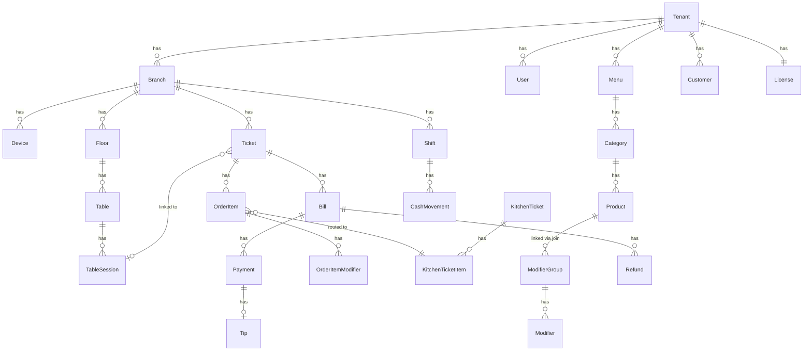
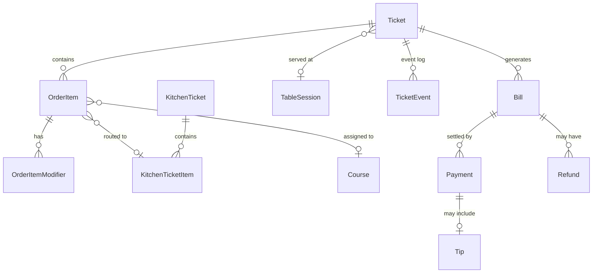
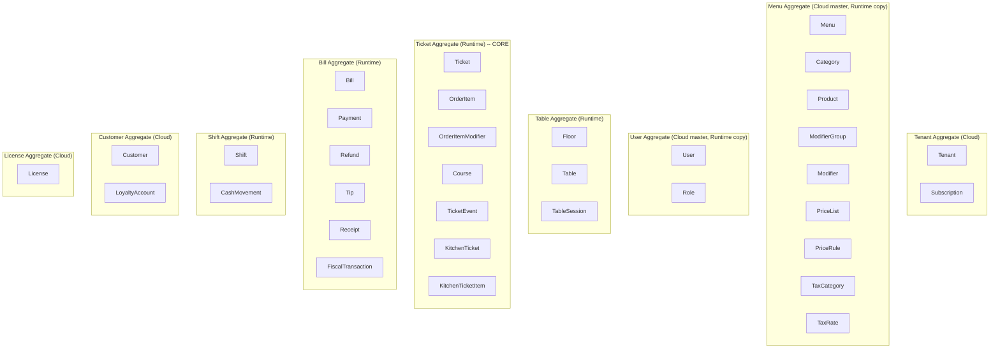

# 05 - Domain Model

> Restaurant POS Platform -- Complete Entity Reference
> Last updated: 2026-03-20

---

## 1. Conventions

| Convention | Rule |
|------------|------|
| **IDs** | UUID v7 everywhere (time-sortable, offline-safe). Generated on the creating device. |
| **Money** | Stored as `int64` in **cents** (or smallest currency unit). Display layer converts. `amount_cents` suffix. |
| **Timestamps** | `int64` Unix milliseconds UTC. Column suffix `_at`. |
| **Soft Delete** | `deleted_at` timestamp (null = active). Soft-deleted records excluded by default. |
| **Tombstones** | Sync layer uses tombstone records for propagating deletes across devices. |
| **Immutable** | Transaction records (tickets, payments, fiscal) are never updated. Corrections create new records. |
| **Audit** | `created_at`, `updated_at`, `created_by`, `updated_by` on all mutable entities. |
| **Versioning** | `version: int` for optimistic concurrency on mutable entities. Incremented on every update. |
| **Enums** | Stored as `TEXT` in SQLite, `VARCHAR` in PostgreSQL. Application-level validation. |

---

## 2. High-Level ER Overview



---

## 3. Entity Definitions by Aggregate Root

---

### 3.1 Tenant Aggregate

#### Tenant

The top-level organizational entity. One restaurant company = one tenant.

| Field | Type | Required | Description |
|-------|------|----------|-------------|
| `id` | `UUID v7` | Yes | Primary key |
| `name` | `TEXT` | Yes | Company/restaurant name |
| `slug` | `TEXT` | Yes | URL-safe identifier (unique) |
| `country` | `TEXT` | Yes | Primary country code (ISO 3166-1 alpha-2, e.g., "DE", "CH") |
| `default_currency` | `TEXT` | Yes | ISO 4217 currency code ("CHF", "EUR") |
| `default_locale` | `TEXT` | Yes | BCP 47 locale ("de-CH", "de-DE") |
| `timezone` | `TEXT` | Yes | IANA timezone ("Europe/Zurich") |
| `tax_id` | `TEXT` | No | VAT/tax registration number |
| `address_line1` | `TEXT` | No | Company address |
| `address_line2` | `TEXT` | No | |
| `city` | `TEXT` | No | |
| `postal_code` | `TEXT` | No | |
| `phone` | `TEXT` | No | |
| `email` | `TEXT` | No | |
| `logo_url` | `TEXT` | No | Logo image URL |
| `status` | `TEXT` | Yes | `active`, `suspended`, `trial`, `cancelled` |
| `country_pack_id` | `UUID` | Yes | Active country pack |
| `settings` | `JSON` | No | Tenant-wide settings blob |
| `created_at` | `INT64` | Yes | |
| `updated_at` | `INT64` | Yes | |
| `version` | `INT` | Yes | Optimistic concurrency |

**Relationships:** Has many Branch, User, Menu, Customer, Subscription. Has one License.

**Invariants:**
- `slug` must be globally unique
- `country` must match an available CountryPack
- `default_currency` must match the country pack's supported currencies
- At least one Branch required for operations
- Status transitions: `trial` -> `active` -> `suspended` -> `cancelled`; `trial` -> `cancelled`

**Audit:** Full audit trail. All changes logged.
**Offline ID:** Generated in cloud on tenant creation.
**Deletion:** Never deleted. Set to `cancelled` status. Data retained per legal requirements.
**Storage:** Cloud PostgreSQL only.

**Example:**
```json
{
  "id": "019526a0-1234-7000-8000-000000000001",
  "name": "Bergrestaurant Sonnalp",
  "slug": "bergrestaurant-sonnalp",
  "country": "CH",
  "default_currency": "CHF",
  "default_locale": "de-CH",
  "timezone": "Europe/Zurich",
  "tax_id": "CHE-123.456.789 MWST",
  "status": "active"
}
```

#### Subscription

| Field | Type | Required | Description |
|-------|------|----------|-------------|
| `id` | `UUID v7` | Yes | Primary key |
| `tenant_id` | `UUID` | Yes | FK to Tenant |
| `plan` | `TEXT` | Yes | `starter`, `professional`, `enterprise` |
| `billing_cycle` | `TEXT` | Yes | `monthly`, `yearly` |
| `price_cents` | `INT64` | Yes | Subscription price |
| `currency` | `TEXT` | Yes | Billing currency |
| `stripe_subscription_id` | `TEXT` | No | External billing reference |
| `current_period_start` | `INT64` | Yes | |
| `current_period_end` | `INT64` | Yes | |
| `trial_ends_at` | `INT64` | No | Trial expiry |
| `cancelled_at` | `INT64` | No | When cancelled |
| `status` | `TEXT` | Yes | `trialing`, `active`, `past_due`, `cancelled` |
| `created_at` | `INT64` | Yes | |
| `updated_at` | `INT64` | Yes | |

**Belongs to:** Tenant
**Deletion:** Immutable log. Cancellation creates new record.
**Storage:** Cloud PostgreSQL only.

---

### 3.2 Branch (part of Tenant aggregate, but operationally independent)

#### Branch

A physical restaurant location.

| Field | Type | Required | Description |
|-------|------|----------|-------------|
| `id` | `UUID v7` | Yes | Primary key |
| `tenant_id` | `UUID` | Yes | FK to Tenant |
| `name` | `TEXT` | Yes | Branch display name |
| `code` | `TEXT` | Yes | Short code ("ZH-01") |
| `country` | `TEXT` | Yes | May differ from tenant (e.g., CH tenant, DE branch) |
| `currency` | `TEXT` | Yes | Operating currency |
| `timezone` | `TEXT` | Yes | Branch timezone |
| `address_line1` | `TEXT` | Yes | |
| `address_line2` | `TEXT` | No | |
| `city` | `TEXT` | Yes | |
| `postal_code` | `TEXT` | Yes | |
| `phone` | `TEXT` | No | |
| `email` | `TEXT` | No | |
| `is_active` | `BOOL` | Yes | Operational status |
| `online_ordering_enabled` | `BOOL` | Yes | Accept online orders |
| `opening_hours` | `JSON` | No | Weekly schedule |
| `country_pack_id` | `UUID` | Yes | May differ from tenant |
| `settings` | `JSON` | No | Branch-specific settings |
| `created_at` | `INT64` | Yes | |
| `updated_at` | `INT64` | Yes | |
| `created_by` | `UUID` | No | |
| `updated_by` | `UUID` | No | |
| `version` | `INT` | Yes | |

**Relationships:** Belongs to Tenant. Has many Device, Floor, Shift, Ticket.

**Invariants:**
- `code` unique within tenant
- `country` must have a matching CountryPack
- Cannot deactivate branch with open shifts or unpaid tickets

**Audit:** Full audit.
**Offline ID:** Generated in cloud.
**Deletion:** Soft delete. Branch set `is_active = false`. Historical data retained.
**Storage:** Cloud PG (master) + Runtime SQLite (cache).

**Example:**
```json
{
  "id": "019526a0-2345-7000-8000-000000000002",
  "tenant_id": "019526a0-1234-7000-8000-000000000001",
  "name": "Filiale Bahnhofstrasse",
  "code": "ZH-01",
  "country": "CH",
  "currency": "CHF",
  "timezone": "Europe/Zurich",
  "city": "Zurich",
  "is_active": true
}
```

#### Device

| Field | Type | Required | Description |
|-------|------|----------|-------------|
| `id` | `UUID v7` | Yes | Primary key |
| `branch_id` | `UUID` | Yes | FK to Branch |
| `name` | `TEXT` | Yes | Human-readable name ("POS Kasse 1") |
| `device_type` | `TEXT` | Yes | `pos`, `kds`, `kiosk`, `waiter_handheld` |
| `model` | `TEXT` | No | Hardware model string |
| `os_version` | `TEXT` | No | Android version |
| `app_version` | `TEXT` | No | POS app version |
| `pairing_code` | `TEXT` | No | One-time pairing code (cleared after use) |
| `paired_at` | `INT64` | No | When paired |
| `last_seen_at` | `INT64` | No | Last heartbeat |
| `is_active` | `BOOL` | Yes | |
| `settings` | `JSON` | No | Device-specific settings |
| `created_at` | `INT64` | Yes | |
| `updated_at` | `INT64` | Yes | |
| `version` | `INT` | Yes | |

**Belongs to:** Branch
**Has many:** PrinterConfig, DeviceCapability

**Invariants:**
- Device count must not exceed license limit
- One device can only be paired to one branch at a time
- `pairing_code` expires after 15 minutes

**Deletion:** Soft delete (`is_active = false`). Unpair clears branch binding.
**Storage:** Cloud PG + Runtime SQLite.

#### DeviceCapability

| Field | Type | Required | Description |
|-------|------|----------|-------------|
| `id` | `UUID v7` | Yes | Primary key |
| `device_id` | `UUID` | Yes | FK to Device |
| `capability` | `TEXT` | Yes | `receipt_printer`, `cash_drawer`, `card_terminal`, `kitchen_printer`, `customer_display`, `barcode_scanner` |
| `config` | `JSON` | Yes | Capability-specific config (IP, port, protocol) |
| `is_enabled` | `BOOL` | Yes | |
| `created_at` | `INT64` | Yes | |
| `updated_at` | `INT64` | Yes | |

**Belongs to:** Device
**Deletion:** Hard delete on device unpair.
**Storage:** Cloud PG + Runtime SQLite.

#### PrinterConfig

| Field | Type | Required | Description |
|-------|------|----------|-------------|
| `id` | `UUID v7` | Yes | Primary key |
| `branch_id` | `UUID` | Yes | FK to Branch |
| `device_id` | `UUID` | No | FK to Device (null = network printer) |
| `name` | `TEXT` | Yes | Display name ("Kitchen Grill Printer") |
| `printer_type` | `TEXT` | Yes | `thermal_receipt`, `thermal_kitchen`, `label` |
| `connection_type` | `TEXT` | Yes | `network_ip`, `usb`, `bluetooth` |
| `address` | `TEXT` | Yes | IP:port, USB path, or BT address |
| `paper_width_mm` | `INT` | Yes | 58 or 80 |
| `encoding` | `TEXT` | Yes | `cp437`, `cp858`, `utf8` |
| `station` | `TEXT` | No | Kitchen station this printer serves |
| `is_default_receipt` | `BOOL` | Yes | Default for receipt printing |
| `is_active` | `BOOL` | Yes | |
| `created_at` | `INT64` | Yes | |
| `updated_at` | `INT64` | Yes | |
| `version` | `INT` | Yes | |

**Belongs to:** Branch (optionally Device)
**Deletion:** Soft delete.
**Storage:** Cloud PG + Runtime SQLite.

---

### 3.3 User Aggregate

#### User

| Field | Type | Required | Description |
|-------|------|----------|-------------|
| `id` | `UUID v7` | Yes | Primary key |
| `tenant_id` | `UUID` | Yes | FK to Tenant |
| `first_name` | `TEXT` | Yes | |
| `last_name` | `TEXT` | Yes | |
| `display_name` | `TEXT` | Yes | Shown on POS ("Marco W.") |
| `email` | `TEXT` | No | For cloud login |
| `phone` | `TEXT` | No | |
| `pin_hash` | `TEXT` | Yes | Bcrypt hash of 4-6 digit PIN |
| `role_id` | `UUID` | Yes | FK to Role |
| `language` | `TEXT` | Yes | Preferred UI language |
| `is_active` | `BOOL` | Yes | |
| `can_access_cloud` | `BOOL` | Yes | Can log into web dashboard |
| `hourly_rate_cents` | `INT64` | No | For labor cost reporting |
| `color` | `TEXT` | No | Avatar color on POS |
| `created_at` | `INT64` | Yes | |
| `updated_at` | `INT64` | Yes | |
| `created_by` | `UUID` | No | |
| `updated_by` | `UUID` | No | |
| `version` | `INT` | Yes | |
| `deleted_at` | `INT64` | No | Soft delete |

**Relationships:** Belongs to Tenant. Has one Role. Has many Ticket (as waiter), Shift.

**Invariants:**
- `pin_hash` must be unique within tenant (no two users share a PIN)
- `email` must be unique globally if set (for cloud login)
- User count must not exceed license limit
- Cannot delete user with open shift

**Audit:** Full audit. PIN changes logged (without hash).
**Offline ID:** Generated in cloud; synced to runtime.
**Deletion:** Soft delete. Historical references (waiter on ticket) preserved.
**Storage:** Cloud PG (master) + Runtime SQLite.

**Example:**
```json
{
  "id": "019526a0-3456-7000-8000-000000000003",
  "tenant_id": "019526a0-1234-7000-8000-000000000001",
  "first_name": "Marco",
  "last_name": "Weber",
  "display_name": "Marco W.",
  "pin_hash": "$2b$12$...",
  "role_id": "019526a0-4567-7000-8000-000000000004",
  "language": "de",
  "is_active": true,
  "can_access_cloud": false
}
```

#### Role

| Field | Type | Required | Description |
|-------|------|----------|-------------|
| `id` | `UUID v7` | Yes | Primary key |
| `tenant_id` | `UUID` | Yes | FK to Tenant |
| `name` | `TEXT` | Yes | "Cashier", "Waiter", "Manager", "Owner" |
| `is_system` | `BOOL` | Yes | System-defined role (cannot be deleted) |
| `permissions` | `JSON` | Yes | Array of permission strings |
| `max_discount_percent` | `INT` | No | Max discount this role can apply |
| `max_void_amount_cents` | `INT64` | No | Max void amount without manager |
| `can_override` | `BOOL` | Yes | Can act as manager for overrides |
| `created_at` | `INT64` | Yes | |
| `updated_at` | `INT64` | Yes | |
| `version` | `INT` | Yes | |

**Belongs to:** Tenant. Has many User.

**Invariants:**
- System roles ("owner", "manager", "cashier", "waiter", "kitchen") cannot be deleted
- At least one user must have the "owner" role per tenant
- Permission strings validated against known permission set

**Deletion:** Soft delete for custom roles. System roles immutable.
**Storage:** Cloud PG + Runtime SQLite.

**Permission strings (examples):**
```
ticket.create, ticket.void, ticket.discount, ticket.merge, ticket.split,
payment.refund, payment.void,
shift.open, shift.close, shift.cash_movement,
menu.edit, menu.publish,
report.view, report.export,
user.manage, device.manage,
override.grant
```

---

### 3.4 Menu Aggregate

#### Menu

| Field | Type | Required | Description |
|-------|------|----------|-------------|
| `id` | `UUID v7` | Yes | Primary key |
| `tenant_id` | `UUID` | Yes | FK to Tenant |
| `name` | `TEXT` | Yes | "Main Menu", "Lunch Menu", "Bar Menu" |
| `is_default` | `BOOL` | Yes | Default menu for branch |
| `status` | `TEXT` | Yes | `draft`, `published`, `archived` |
| `published_version` | `INT` | No | Current published version number |
| `schedule` | `JSON` | No | Time-based activation schedule |
| `channel_visibility` | `JSON` | Yes | Which channels see this menu |
| `branch_ids` | `JSON` | Yes | Which branches use this menu |
| `created_at` | `INT64` | Yes | |
| `updated_at` | `INT64` | Yes | |
| `created_by` | `UUID` | No | |
| `updated_by` | `UUID` | No | |
| `version` | `INT` | Yes | |

**Relationships:** Belongs to Tenant. Has many Category.

**Invariants:**
- Exactly one default menu per branch
- Published menu is immutable; changes create a new draft version
- `channel_visibility` must be valid channel enum values

**Deletion:** Archive (set status to `archived`). Never hard delete.
**Storage:** Cloud PG (master) + Runtime SQLite.

**Example `channel_visibility`:**
```json
{"pos": true, "waiter": true, "qr": true, "kiosk": true, "online": false}
```

#### Category

| Field | Type | Required | Description |
|-------|------|----------|-------------|
| `id` | `UUID v7` | Yes | Primary key |
| `menu_id` | `UUID` | Yes | FK to Menu |
| `parent_id` | `UUID` | No | FK to Category (self-referential for nesting) |
| `name` | `JSON` | Yes | Multilingual: `{"de": "Vorspeisen", "en": "Starters"}` |
| `description` | `JSON` | No | Multilingual description |
| `image_url` | `TEXT` | No | Category image |
| `color` | `TEXT` | No | Display color on POS grid |
| `sort_order` | `INT` | Yes | Display position |
| `is_active` | `BOOL` | Yes | |
| `channel_visibility` | `JSON` | No | Override menu-level visibility |
| `created_at` | `INT64` | Yes | |
| `updated_at` | `INT64` | Yes | |
| `version` | `INT` | Yes | |
| `deleted_at` | `INT64` | No | Soft delete |

**Belongs to:** Menu. Has many Product. Optionally has parent Category.

**Invariants:**
- Max 3 nesting levels (group → category → subcategory)
- `sort_order` unique within parent scope
- At least one product to be visible

**Deletion:** Soft delete. Products reassigned or also soft-deleted.
**Storage:** Cloud PG + Runtime SQLite.

#### Product

| Field | Type | Required | Description |
|-------|------|----------|-------------|
| `id` | `UUID v7` | Yes | Primary key |
| `tenant_id` | `UUID` | Yes | FK to Tenant |
| `category_id` | `UUID` | Yes | FK to Category |
| `name` | `JSON` | Yes | Multilingual: `{"de": "Wiener Schnitzel", "en": "Wiener Schnitzel"}` |
| `description` | `JSON` | No | Multilingual |
| `sku` | `TEXT` | No | Internal SKU |
| `barcode` | `TEXT` | No | EAN/UPC barcode |
| `plu` | `TEXT` | No | Price Look-Up number for POS quick key |
| `image_url` | `TEXT` | No | Product image |
| `base_price_cents` | `INT64` | Yes | Default price (before price rules) |
| `cost_price_cents` | `INT64` | No | Cost for margin calculation |
| `tax_category_id` | `UUID` | Yes | FK to TaxCategory |
| `unit` | `TEXT` | Yes | `piece`, `kg`, `liter`, `portion` |
| `is_weighable` | `BOOL` | Yes | Requires weight input at POS |
| `is_active` | `BOOL` | Yes | |
| `is_available` | `BOOL` | Yes | 86'd flag (out of stock) |
| `color` | `TEXT` | No | POS button color |
| `sort_order` | `INT` | Yes | Display position in category |
| `tags` | `JSON` | No | Searchable tags |
| `allergens` | `JSON` | No | Allergen codes (EU 14 allergens) |
| `nutritional_info` | `JSON` | No | Calories, macros |
| `prep_time_minutes` | `INT` | No | Expected prep time |
| `channel_visibility` | `JSON` | No | Override category/menu visibility |
| `modifier_group_ids` | `JSON` | Yes | Ordered list of linked ModifierGroup IDs |
| `created_at` | `INT64` | Yes | |
| `updated_at` | `INT64` | Yes | |
| `created_by` | `UUID` | No | |
| `updated_by` | `UUID` | No | |
| `version` | `INT` | Yes | |
| `deleted_at` | `INT64` | No | |

**Belongs to:** Category (and transitively to Menu, Tenant). Linked to many ModifierGroup.

**Invariants:**
- `base_price_cents >= 0`
- `tax_category_id` must reference a valid TaxCategory for the branch's country
- If `is_weighable`, unit must be `kg` or `liter`
- `barcode` unique within tenant if set
- `plu` unique within tenant if set

**Deletion:** Soft delete. Cannot delete if referenced by open tickets.
**Storage:** Cloud PG + Runtime SQLite.

**Example:**
```json
{
  "id": "019526a0-5678-7000-8000-000000000005",
  "name": {"de": "Wiener Schnitzel", "en": "Wiener Schnitzel", "fr": "Escalope viennoise"},
  "base_price_cents": 2850,
  "tax_category_id": "...",
  "unit": "piece",
  "allergens": ["gluten", "eggs"],
  "modifier_group_ids": ["mg-side-dish", "mg-sauce", "mg-cooking"]
}
```

#### ModifierGroup

| Field | Type | Required | Description |
|-------|------|----------|-------------|
| `id` | `UUID v7` | Yes | Primary key |
| `tenant_id` | `UUID` | Yes | FK to Tenant |
| `name` | `JSON` | Yes | Multilingual: `{"de": "Beilage wählen", "en": "Choose side"}` |
| `selection_type` | `TEXT` | Yes | `single` (radio), `multi` (checkbox) |
| `min_selections` | `INT` | Yes | Minimum required (0 = optional) |
| `max_selections` | `INT` | Yes | Maximum allowed (0 = unlimited) |
| `is_required` | `BOOL` | Yes | Must select before adding to order |
| `sort_order` | `INT` | Yes | Display order on product detail |
| `created_at` | `INT64` | Yes | |
| `updated_at` | `INT64` | Yes | |
| `version` | `INT` | Yes | |
| `deleted_at` | `INT64` | No | |

**Belongs to:** Tenant (shared across products). Has many Modifier.

**Invariants:**
- `min_selections <= max_selections` (when max > 0)
- If `is_required`, then `min_selections >= 1`
- If `selection_type == "single"`, then `max_selections == 1`

**Deletion:** Soft delete. Unlinks from products.
**Storage:** Cloud PG + Runtime SQLite.

#### Modifier

| Field | Type | Required | Description |
|-------|------|----------|-------------|
| `id` | `UUID v7` | Yes | Primary key |
| `modifier_group_id` | `UUID` | Yes | FK to ModifierGroup |
| `name` | `JSON` | Yes | Multilingual: `{"de": "Pommes Frites", "en": "French Fries"}` |
| `price_adjustment_cents` | `INT64` | Yes | Price delta (can be 0, positive, or negative) |
| `is_default` | `BOOL` | Yes | Pre-selected in UI |
| `is_active` | `BOOL` | Yes | |
| `sort_order` | `INT` | Yes | Display position |
| `sku` | `TEXT` | No | For inventory tracking |
| `created_at` | `INT64` | Yes | |
| `updated_at` | `INT64` | Yes | |
| `version` | `INT` | Yes | |
| `deleted_at` | `INT64` | No | |

**Belongs to:** ModifierGroup.

**Invariants:**
- Cannot have more `is_default = true` modifiers than `max_selections` in parent group
- `price_adjustment_cents` can be negative (e.g., "no cheese" = -50 cents)

**Deletion:** Soft delete.
**Storage:** Cloud PG + Runtime SQLite.

#### PriceList

| Field | Type | Required | Description |
|-------|------|----------|-------------|
| `id` | `UUID v7` | Yes | Primary key |
| `tenant_id` | `UUID` | Yes | FK to Tenant |
| `name` | `TEXT` | Yes | "Happy Hour", "Employee", "Takeaway" |
| `type` | `TEXT` | Yes | `override`, `discount_percent`, `discount_fixed` |
| `priority` | `INT` | Yes | Higher priority wins on conflict |
| `is_active` | `BOOL` | Yes | |
| `schedule` | `JSON` | No | Time-based activation |
| `channel` | `TEXT` | No | Restrict to specific channel |
| `branch_ids` | `JSON` | No | Restrict to specific branches |
| `created_at` | `INT64` | Yes | |
| `updated_at` | `INT64` | Yes | |
| `version` | `INT` | Yes | |

**Belongs to:** Tenant (part of Menu aggregate conceptually). Has many PriceRule.
**Storage:** Cloud PG + Runtime SQLite.

**Example schedule:**
```json
{
  "days": ["monday", "tuesday", "wednesday", "thursday", "friday"],
  "start_time": "16:00",
  "end_time": "18:00"
}
```

#### PriceRule

| Field | Type | Required | Description |
|-------|------|----------|-------------|
| `id` | `UUID v7` | Yes | Primary key |
| `price_list_id` | `UUID` | Yes | FK to PriceList |
| `product_id` | `UUID` | No | Specific product (null = category-wide) |
| `category_id` | `UUID` | No | Specific category |
| `override_price_cents` | `INT64` | No | Fixed price override |
| `discount_percent` | `INT` | No | Percentage off (stored as basis points: 1000 = 10.00%) |
| `discount_fixed_cents` | `INT64` | No | Fixed amount off |
| `min_quantity` | `INT` | No | Min qty for rule to apply |
| `created_at` | `INT64` | Yes | |
| `updated_at` | `INT64` | Yes | |

**Belongs to:** PriceList.
**Invariants:** Exactly one of `override_price_cents`, `discount_percent`, `discount_fixed_cents` must be set.
**Storage:** Cloud PG + Runtime SQLite.

#### TaxCategory

| Field | Type | Required | Description |
|-------|------|----------|-------------|
| `id` | `UUID v7` | Yes | Primary key |
| `country` | `TEXT` | Yes | ISO country code |
| `name` | `TEXT` | Yes | "Standard", "Reduced", "Zero", "Exempt" |
| `code` | `TEXT` | Yes | Internal code ("DE_STANDARD", "CH_REDUCED") |
| `created_at` | `INT64` | Yes | |
| `updated_at` | `INT64` | Yes | |

**Has many:** TaxRate.
**Invariants:** `code` unique per country.
**Storage:** Cloud PG + Runtime SQLite.

#### TaxRate

| Field | Type | Required | Description |
|-------|------|----------|-------------|
| `id` | `UUID v7` | Yes | Primary key |
| `tax_category_id` | `UUID` | Yes | FK to TaxCategory |
| `rate_bps` | `INT` | Yes | Tax rate in basis points (1900 = 19.00%) |
| `service_type` | `TEXT` | Yes | `dine_in`, `takeaway`, `all` |
| `effective_from` | `INT64` | Yes | When this rate becomes active |
| `effective_until` | `INT64` | No | When this rate expires (null = current) |
| `created_at` | `INT64` | Yes | |

**Belongs to:** TaxCategory.

**Invariants:**
- No overlapping date ranges for same tax_category + service_type
- `rate_bps >= 0` and `rate_bps <= 10000` (0% to 100%)

**Deletion:** Immutable. New rate supersedes old with `effective_from`.
**Storage:** Cloud PG + Runtime SQLite.

**Example (Germany):**
```json
[
  {"tax_category": "DE_STANDARD", "rate_bps": 1900, "service_type": "dine_in"},
  {"tax_category": "DE_STANDARD", "rate_bps": 700, "service_type": "takeaway"},
  {"tax_category": "DE_REDUCED", "rate_bps": 700, "service_type": "all"}
]
```

**Example (Switzerland):**
```json
[
  {"tax_category": "CH_STANDARD", "rate_bps": 810, "service_type": "all"},
  {"tax_category": "CH_REDUCED", "rate_bps": 260, "service_type": "all"},
  {"tax_category": "CH_ACCOMMODATION", "rate_bps": 380, "service_type": "all"}
]
```

---

### 3.5 Table Aggregate

#### Floor (TableArea)

| Field | Type | Required | Description |
|-------|------|----------|-------------|
| `id` | `UUID v7` | Yes | Primary key |
| `branch_id` | `UUID` | Yes | FK to Branch |
| `name` | `TEXT` | Yes | "Main Floor", "Terrace", "Bar Area" |
| `sort_order` | `INT` | Yes | Display order |
| `layout` | `JSON` | No | Visual layout metadata (positions, background) |
| `is_active` | `BOOL` | Yes | |
| `created_at` | `INT64` | Yes | |
| `updated_at` | `INT64` | Yes | |
| `version` | `INT` | Yes | |

**Belongs to:** Branch. Has many Table.
**Deletion:** Soft delete (`is_active = false`).
**Storage:** Cloud PG (master) + Runtime SQLite.

#### Table

| Field | Type | Required | Description |
|-------|------|----------|-------------|
| `id` | `UUID v7` | Yes | Primary key |
| `floor_id` | `UUID` | Yes | FK to Floor |
| `branch_id` | `UUID` | Yes | FK to Branch (denormalized for queries) |
| `name` | `TEXT` | Yes | Display name ("T1", "Bar 3", "Terrace 7") |
| `capacity` | `INT` | Yes | Max seats |
| `shape` | `TEXT` | Yes | `round`, `square`, `rectangle` |
| `position_x` | `INT` | No | X coordinate on floor layout |
| `position_y` | `INT` | No | Y coordinate on floor layout |
| `width` | `INT` | No | Visual width |
| `height` | `INT` | No | Visual height |
| `status` | `TEXT` | Yes | Current state (see Table state machine) |
| `current_session_id` | `UUID` | No | FK to active TableSession |
| `merged_into_table_id` | `UUID` | No | FK to Table (if merged) |
| `is_active` | `BOOL` | Yes | |
| `section` | `TEXT` | No | Waiter section assignment |
| `sort_order` | `INT` | Yes | |
| `created_at` | `INT64` | Yes | |
| `updated_at` | `INT64` | Yes | |
| `version` | `INT` | Yes | |

**Belongs to:** Floor (and Branch). Has many TableSession.

**Invariants:**
- `status` must follow valid state machine transitions
- `current_session_id` must be null when status is `available`
- `merged_into_table_id` only set when this table is part of a merge
- `name` unique within branch

**Deletion:** Soft delete. Cannot delete table with active session.
**Storage:** Cloud PG (layout master) + Runtime SQLite (status is runtime-authoritative).

#### TableSession

| Field | Type | Required | Description |
|-------|------|----------|-------------|
| `id` | `UUID v7` | Yes | Primary key |
| `table_id` | `UUID` | Yes | FK to Table |
| `branch_id` | `UUID` | Yes | FK to Branch |
| `waiter_id` | `UUID` | Yes | FK to User who opened the table |
| `guest_count` | `INT` | Yes | Number of guests |
| `status` | `TEXT` | Yes | `active`, `bill_requested`, `payment_in_progress`, `closed` |
| `opened_at` | `INT64` | Yes | When session started |
| `closed_at` | `INT64` | No | When session ended |
| `duration_seconds` | `INT` | No | Calculated on close |
| `notes` | `TEXT` | No | Session notes ("birthday party", "VIP") |
| `created_at` | `INT64` | Yes | |
| `updated_at` | `INT64` | Yes | |

**Belongs to:** Table. Has many Ticket (typically one, but can have multiple for split scenarios).

**Invariants:**
- Only one `active` session per table at a time
- `guest_count >= 1`
- Cannot close session while tickets have unpaid bills
- `closed_at` must be after `opened_at`

**Deletion:** Immutable once closed. Archive after retention period.
**Storage:** Runtime SQLite (authoritative) synced to Cloud PG.

---

### 3.6 Ticket (Order) Aggregate -- THE HEART OF THE SYSTEM



#### Ticket (Order)

The central transactional entity. Every sale, regardless of channel, creates a Ticket.

| Field | Type | Required | Description |
|-------|------|----------|-------------|
| `id` | `UUID v7` | Yes | Primary key (generated on device, offline-safe) |
| `branch_id` | `UUID` | Yes | FK to Branch |
| `tenant_id` | `UUID` | Yes | FK to Tenant (denormalized) |
| `ticket_number` | `TEXT` | Yes | Human-readable sequential number ("T-00142") |
| `channel` | `TEXT` | Yes | `pos`, `waiter`, `qr`, `kiosk`, `online`, `phone` |
| `status` | `TEXT` | Yes | See Ticket state machine |
| `service_type` | `TEXT` | Yes | `dine_in`, `takeaway`, `delivery` |
| `table_session_id` | `UUID` | No | FK to TableSession (null for takeaway/delivery) |
| `table_id` | `UUID` | No | FK to Table (denormalized, null for non-dine-in) |
| `waiter_id` | `UUID` | No | FK to User (waiter/cashier who owns the ticket) |
| `customer_id` | `UUID` | No | FK to Customer (optional) |
| `shift_id` | `UUID` | Yes | FK to Shift (ticket belongs to a shift) |
| `device_id` | `UUID` | Yes | FK to Device that created the ticket |
| `guest_count` | `INT` | No | Number of guests (from table session or manual) |
| `subtotal_cents` | `INT64` | Yes | Sum of all item totals before tax/discount |
| `discount_total_cents` | `INT64` | Yes | Total discounts applied |
| `tax_total_cents` | `INT64` | Yes | Total tax |
| `total_cents` | `INT64` | Yes | Final total (subtotal - discount + tax, or gross if inclusive) |
| `paid_cents` | `INT64` | Yes | Amount paid so far |
| `balance_cents` | `INT64` | Yes | Remaining balance (total - paid) |
| `item_count` | `INT` | Yes | Number of items (denormalized) |
| `ticket_discount_type` | `TEXT` | No | `percent`, `fixed`, `none` |
| `ticket_discount_value` | `INT64` | No | Discount value (percent in bps, or cents) |
| `ticket_discount_reason` | `TEXT` | No | Reason for discount |
| `ticket_discount_authorized_by` | `UUID` | No | Manager who authorized |
| `notes` | `TEXT` | No | Ticket-level notes |
| `external_reference` | `TEXT` | No | External order ID (online, phone) |
| `source_ticket_id` | `UUID` | No | FK to Ticket (for splits -- original ticket) |
| `merged_into_ticket_id` | `UUID` | No | FK to Ticket (if merged into another) |
| `voided_at` | `INT64` | No | When voided |
| `voided_by` | `UUID` | No | Who voided |
| `void_reason` | `TEXT` | No | Why voided |
| `opened_at` | `INT64` | Yes | When ticket was created |
| `closed_at` | `INT64` | No | When ticket reached terminal state |
| `created_at` | `INT64` | Yes | |
| `updated_at` | `INT64` | Yes | |
| `created_by` | `UUID` | Yes | |
| `updated_by` | `UUID` | Yes | |
| `version` | `INT` | Yes | Optimistic concurrency |

**Relationships:**
- Belongs to Branch, Shift, Device
- Optionally belongs to TableSession, Customer
- Has many OrderItem, Bill, TicketEvent
- May reference source_ticket_id (split source) or merged_into_ticket_id

**How Ticket connects to TableSession:**
- Dine-in tickets always have a `table_session_id`. The table session is opened first (or reused if table is already open), then the ticket is created and linked.
- When a ticket moves tables (`MoveTable`), the `table_session_id` and `table_id` are updated. The old table session is closed if no other tickets reference it.
- Takeaway/delivery/kiosk tickets have `table_session_id = null`.
- Multiple tickets can share a table session (e.g., separate tabs at the same table).

**Key Invariants:**
- `total_cents = subtotal_cents - discount_total_cents + tax_total_cents` (for tax-exclusive) or `total_cents = subtotal_cents - discount_total_cents` (for tax-inclusive where tax is embedded)
- `balance_cents = total_cents - paid_cents`
- `balance_cents >= 0` (cannot overpay)
- `status` must follow valid state machine transitions
- Cannot add items after `BillRequested` status
- Cannot void a `FullyPaid` or `Closed` ticket
- `shift_id` is set at creation and never changes
- `ticket_number` is sequential within branch per day, formatted as `{prefix}-{seq}`
- Once an item is sent to kitchen, it can only be removed via void (not simple remove)

**Audit:** Full event sourcing. Every mutation is an immutable event.
**Offline ID:** UUID v7 generated on the creating device.
**Deletion:** NEVER deleted. Voids create void records. Closed tickets are immutable.
**Storage:** Runtime SQLite (authoritative) synced to Cloud PG.

**Example:**
```json
{
  "id": "019526a0-6789-7000-8000-000000000006",
  "branch_id": "019526a0-2345-7000-8000-000000000002",
  "ticket_number": "T-00142",
  "channel": "pos",
  "status": "items_added",
  "service_type": "dine_in",
  "table_session_id": "019526a0-7890-7000-8000-000000000007",
  "table_id": "...",
  "waiter_id": "019526a0-3456-7000-8000-000000000003",
  "shift_id": "...",
  "subtotal_cents": 5700,
  "discount_total_cents": 0,
  "tax_total_cents": 0,
  "total_cents": 5700,
  "paid_cents": 0,
  "balance_cents": 5700,
  "item_count": 3,
  "opened_at": 1711000000000
}
```

#### OrderItem

Each line item on a ticket. Captures a price snapshot at the time of addition.

| Field | Type | Required | Description |
|-------|------|----------|-------------|
| `id` | `UUID v7` | Yes | Primary key |
| `ticket_id` | `UUID` | Yes | FK to Ticket |
| `product_id` | `UUID` | Yes | FK to Product (reference, not ownership) |
| `product_name` | `TEXT` | Yes | **Snapshot** of product name at order time |
| `product_sku` | `TEXT` | No | Snapshot of SKU |
| `quantity` | `INT` | Yes | Quantity ordered (in base units) |
| `unit_price_cents` | `INT64` | Yes | **Snapshot** of unit price at order time |
| `modifier_total_cents` | `INT64` | Yes | Sum of all modifier price adjustments |
| `line_total_cents` | `INT64` | Yes | `(unit_price_cents + modifier_total_cents) * quantity` |
| `discount_type` | `TEXT` | No | `percent`, `fixed`, `none` |
| `discount_value` | `INT64` | No | Discount on this item |
| `discount_cents` | `INT64` | Yes | Calculated discount amount |
| `net_total_cents` | `INT64` | Yes | `line_total_cents - discount_cents` |
| `tax_category_id` | `UUID` | Yes | FK to TaxCategory (snapshot) |
| `tax_rate_bps` | `INT` | Yes | **Snapshot** of tax rate at order time |
| `tax_amount_cents` | `INT64` | Yes | Calculated tax for this item |
| `course` | `INT` | No | Course number (1, 2, 3...; null = default course) |
| `seat` | `INT` | No | Seat number (for split by seat) |
| `status` | `TEXT` | Yes | `active`, `sent_to_kitchen`, `voided` |
| `is_sent_to_kitchen` | `BOOL` | Yes | Whether sent to kitchen |
| `kitchen_ticket_item_id` | `UUID` | No | FK to KitchenTicketItem |
| `notes` | `TEXT` | No | Item-specific notes ("no onions", "well done") |
| `voided_at` | `INT64` | No | When voided |
| `voided_by` | `UUID` | No | Who voided |
| `void_reason` | `TEXT` | No | Why voided |
| `price_list_id` | `UUID` | No | Which price list was used |
| `sort_order` | `INT` | Yes | Display order on ticket |
| `created_at` | `INT64` | Yes | |
| `updated_at` | `INT64` | Yes | |

**Belongs to:** Ticket. Has many OrderItemModifier.

**How price snapshot works:**
- When an item is added to a ticket, the current price is resolved from Menu + Price Rules
- `unit_price_cents` is locked at this moment and never changes even if the menu price changes later
- The `product_name` is also snapshot to ensure the receipt is accurate even if the product is renamed
- `tax_rate_bps` is snapshot from the active TaxRate for the product's TaxCategory and the ticket's service_type

**How modifiers work:**
- Each OrderItem has zero or more OrderItemModifiers
- Modifiers are validated against the product's linked ModifierGroups (min/max selections)
- Each modifier's price adjustment is snapshot at add time
- `modifier_total_cents` = sum of all OrderItemModifier.price_adjustment_cents
- Modifiers affect the line total: `(base_price + modifier_total) * quantity`

**How courses work:**
- `course` field is an integer (1 = first course, 2 = second, etc.)
- Items without a course are in the default/implicit course (fired immediately)
- Kitchen tickets are generated per course when `fireCourse()` is called
- Courses can be held (not fired until explicitly released)
- A rush command fires a held course immediately

**Invariants:**
- `quantity >= 1`
- `line_total_cents = (unit_price_cents + modifier_total_cents) * quantity`
- `net_total_cents = line_total_cents - discount_cents`
- Cannot change `unit_price_cents` after creation (snapshot is immutable)
- Cannot void an already-voided item
- Items with `is_sent_to_kitchen = true` can only be voided, not removed

**Deletion:** NEVER deleted. Set `status = voided` with reason.
**Storage:** Runtime SQLite (nested in Ticket aggregate).

**Example:**
```json
{
  "id": "019526a0-8901-7000-8000-000000000008",
  "ticket_id": "019526a0-6789-7000-8000-000000000006",
  "product_id": "019526a0-5678-7000-8000-000000000005",
  "product_name": "Wiener Schnitzel",
  "quantity": 1,
  "unit_price_cents": 2850,
  "modifier_total_cents": 0,
  "line_total_cents": 2850,
  "discount_cents": 0,
  "net_total_cents": 2850,
  "tax_rate_bps": 810,
  "tax_amount_cents": 214,
  "course": 2,
  "status": "active",
  "is_sent_to_kitchen": false
}
```

#### OrderItemModifier

| Field | Type | Required | Description |
|-------|------|----------|-------------|
| `id` | `UUID v7` | Yes | Primary key |
| `order_item_id` | `UUID` | Yes | FK to OrderItem |
| `modifier_id` | `UUID` | Yes | FK to Modifier (reference) |
| `modifier_group_id` | `UUID` | Yes | FK to ModifierGroup (reference) |
| `modifier_name` | `TEXT` | Yes | **Snapshot** of modifier name |
| `price_adjustment_cents` | `INT64` | Yes | **Snapshot** of price adjustment |
| `sort_order` | `INT` | Yes | Display order |
| `created_at` | `INT64` | Yes | |

**Belongs to:** OrderItem.

**Invariants:**
- Must comply with parent ModifierGroup's min/max selection rules
- `price_adjustment_cents` is immutable after creation
- All modifiers for an OrderItem must come from the product's linked modifier groups

**Deletion:** Immutable. If order item is voided, modifiers stay for audit trail.
**Storage:** Runtime SQLite (nested).

#### Course

Explicit course tracking for multi-course dining.

| Field | Type | Required | Description |
|-------|------|----------|-------------|
| `id` | `UUID v7` | Yes | Primary key |
| `ticket_id` | `UUID` | Yes | FK to Ticket |
| `course_number` | `INT` | Yes | Sequential (1, 2, 3...) |
| `name` | `TEXT` | No | Optional name ("Antipasti", "Hauptgang", "Dessert") |
| `status` | `TEXT` | Yes | `pending`, `held`, `fired`, `ready`, `served` |
| `fired_at` | `INT64` | No | When fire command was sent |
| `ready_at` | `INT64` | No | When all items in course are ready |
| `served_at` | `INT64` | No | When served to table |
| `created_at` | `INT64` | Yes | |
| `updated_at` | `INT64` | Yes | |

**Belongs to:** Ticket.

**Invariants:**
- `course_number` unique within ticket
- Cannot fire course if previous course is not at least `ready`
- Course status follows: `pending` -> `held` -> `fired` -> `ready` -> `served`

**Storage:** Runtime SQLite.

#### TicketEvent (Event Sourcing)

Append-only event log for complete ticket audit trail.

| Field | Type | Required | Description |
|-------|------|----------|-------------|
| `id` | `UUID v7` | Yes | Primary key |
| `ticket_id` | `UUID` | Yes | FK to Ticket |
| `sequence` | `INT` | Yes | Monotonic sequence within ticket |
| `event_type` | `TEXT` | Yes | Event name (e.g., `item_added`, `payment_completed`) |
| `payload` | `JSON` | Yes | Full event data |
| `user_id` | `UUID` | No | Who caused this event |
| `device_id` | `UUID` | Yes | Which device |
| `timestamp` | `INT64` | Yes | When it happened |

**Belongs to:** Ticket.

**Invariants:**
- `sequence` is strictly monotonic per ticket
- Events are NEVER modified or deleted
- Event log is the source of truth; materialized Ticket state can be rebuilt from events

**Storage:** Runtime SQLite (append-only) synced to Cloud PG.

---

### 3.7 Bill Aggregate

#### Bill

A bill is a request for payment. One Ticket can have multiple Bills (split bill).

| Field | Type | Required | Description |
|-------|------|----------|-------------|
| `id` | `UUID v7` | Yes | Primary key |
| `ticket_id` | `UUID` | Yes | FK to Ticket |
| `branch_id` | `UUID` | Yes | FK to Branch (denormalized) |
| `bill_number` | `TEXT` | Yes | Sequential bill number within branch |
| `status` | `TEXT` | Yes | `open`, `partially_paid`, `fully_paid`, `voided` |
| `subtotal_cents` | `INT64` | Yes | Sum of assigned items |
| `discount_cents` | `INT64` | Yes | Bill-level discount |
| `tax_total_cents` | `INT64` | Yes | Tax on this bill's items |
| `total_cents` | `INT64` | Yes | Final bill amount |
| `paid_cents` | `INT64` | Yes | Amount paid |
| `balance_cents` | `INT64` | Yes | Remaining |
| `rounding_cents` | `INT64` | Yes | Country-specific rounding adjustment |
| `split_type` | `TEXT` | No | `full`, `equal`, `by_item`, `by_amount`, `by_seat`, `by_course` |
| `item_ids` | `JSON` | No | OrderItem IDs assigned to this bill (for item-based splits) |
| `created_at` | `INT64` | Yes | |
| `updated_at` | `INT64` | Yes | |
| `version` | `INT` | Yes | |

**Belongs to:** Ticket. Has many Payment, Refund.

**How Bill is separate from Ticket:**
- A Ticket represents what was ordered. A Bill represents what is being paid.
- For a simple transaction: 1 Ticket -> 1 Bill -> 1 Payment.
- For split bill: 1 Ticket -> N Bills. Each Bill contains a subset of items or an equal share of the total.
- Split strategies:
  - `by_item`: Specific OrderItems assigned to each Bill via `item_ids`
  - `equal`: Total divided by number of Bills, rounding applied to last bill
  - `by_amount`: Each Bill has a manually specified `total_cents`
  - `by_seat`: Items grouped by `seat` field on OrderItem
  - `by_course`: Items grouped by `course` field on OrderItem
- Each Bill is independently payable with any payment method(s).

**Invariants:**
- Sum of all Bills' `total_cents` for a Ticket must equal Ticket's `total_cents`
- `balance_cents = total_cents - paid_cents`
- `balance_cents >= 0`
- Cannot void a fully paid bill (use Refund instead)

**Deletion:** NEVER deleted. Voided bills remain with `status = voided`.
**Storage:** Runtime SQLite synced to Cloud PG.

#### Payment

| Field | Type | Required | Description |
|-------|------|----------|-------------|
| `id` | `UUID v7` | Yes | Primary key |
| `bill_id` | `UUID` | Yes | FK to Bill |
| `ticket_id` | `UUID` | Yes | FK to Ticket (denormalized) |
| `shift_id` | `UUID` | Yes | FK to Shift |
| `method` | `TEXT` | Yes | `cash`, `card_visa`, `card_mastercard`, `card_amex`, `card_other`, `twint`, `voucher`, `on_account` |
| `status` | `TEXT` | Yes | `initiated`, `processing`, `completed`, `failed`, `voided`, `refunded`, `partially_refunded` |
| `amount_cents` | `INT64` | Yes | Payment amount |
| `tendered_cents` | `INT64` | No | Amount tendered (cash; null for card) |
| `change_cents` | `INT64` | No | Change given (cash; null for card) |
| `reference` | `TEXT` | No | Card terminal reference, TWINT ref, etc. |
| `card_last_four` | `TEXT` | No | Last 4 digits if card |
| `card_brand` | `TEXT` | No | Visa, Mastercard, etc. |
| `terminal_id` | `TEXT` | No | Card terminal identifier |
| `processed_by` | `UUID` | Yes | FK to User (cashier) |
| `processed_at` | `INT64` | No | When payment completed |
| `voided_at` | `INT64` | No | |
| `voided_by` | `UUID` | No | |
| `void_reason` | `TEXT` | No | |
| `created_at` | `INT64` | Yes | |
| `updated_at` | `INT64` | Yes | |

**Belongs to:** Bill. Has zero or one Tip.

**How Payments connect to Bills:**
- A Bill can have multiple Payments (multi-tender: pay part cash, part card).
- Each Payment is for a specific amount against one Bill.
- Sum of completed Payment amounts must equal or exceed the Bill total.
- If sum exceeds (cash overpayment), difference is recorded as `change_cents`.

**Invariants:**
- `amount_cents > 0`
- For cash: `tendered_cents >= amount_cents`; `change_cents = tendered_cents - amount_cents`
- Status must follow Payment state machine
- Cannot void a payment that has been refunded
- `processed_at` set only when `status = completed`

**Deletion:** NEVER deleted. Immutable after completion.
**Storage:** Runtime SQLite synced to Cloud PG.

#### Refund

| Field | Type | Required | Description |
|-------|------|----------|-------------|
| `id` | `UUID v7` | Yes | Primary key |
| `bill_id` | `UUID` | Yes | FK to Bill |
| `payment_id` | `UUID` | Yes | FK to original Payment |
| `ticket_id` | `UUID` | Yes | FK to Ticket (denormalized) |
| `status` | `TEXT` | Yes | `requested`, `manager_approved`, `processing`, `completed`, `rejected` |
| `amount_cents` | `INT64` | Yes | Refund amount |
| `reason` | `TEXT` | Yes | Refund reason |
| `method` | `TEXT` | Yes | Refund method (typically same as original payment) |
| `reference` | `TEXT` | No | Refund transaction reference |
| `requested_by` | `UUID` | Yes | FK to User |
| `approved_by` | `UUID` | No | FK to User (manager) |
| `processed_by` | `UUID` | No | FK to User |
| `requested_at` | `INT64` | Yes | |
| `approved_at` | `INT64` | No | |
| `processed_at` | `INT64` | No | |
| `rejected_at` | `INT64` | No | |
| `rejection_reason` | `TEXT` | No | |
| `created_at` | `INT64` | Yes | |
| `updated_at` | `INT64` | Yes | |

**Belongs to:** Bill (and Payment).

**How void/refund works:**
- **Void** (before close of business): Payment can be voided same-day before shift close. This reverses the payment entirely. The Bill reverts to unpaid.
- **Refund** (after settlement): A separate Refund record is created referencing the original Payment. Refunds always require manager approval. Partial refunds are supported (refund part of the payment amount).
- Items are never deleted. A voided item stays on the ticket with `status = voided`, void reason, and audit trail.
- A voided ticket stays with `status = voided` and all amounts preserved for reporting.

**Invariants:**
- `amount_cents <= original payment amount_cents`
- `amount_cents > 0`
- Total refunds for a payment cannot exceed original payment amount
- Must be approved by user with `payment.refund` permission
- Status must follow Refund state machine

**Deletion:** NEVER deleted. Immutable.
**Storage:** Runtime SQLite synced to Cloud PG.

#### Tip

| Field | Type | Required | Description |
|-------|------|----------|-------------|
| `id` | `UUID v7` | Yes | Primary key |
| `payment_id` | `UUID` | Yes | FK to Payment |
| `staff_id` | `UUID` | Yes | FK to User (who receives the tip) |
| `amount_cents` | `INT64` | Yes | Tip amount |
| `method` | `TEXT` | Yes | `cash`, `card` (how tip was given) |
| `is_included_in_payment` | `BOOL` | Yes | Whether tip is part of payment amount |
| `created_at` | `INT64` | Yes | |

**Belongs to:** Payment.

**How tips work:**
- For card tips: `is_included_in_payment = true`. The payment `amount_cents` includes the tip. The tip is extracted from the payment total.
- For cash tips: `is_included_in_payment = false`. The tip is recorded separately (not part of any bill amount). Cash tip is a separate physical transaction.
- In Switzerland: service is typically included; tip is discretionary extra.
- In Germany: tip is usually given separately in cash.
- Tips are tracked per staff member for reporting and potential pooling.

**Invariants:**
- `amount_cents > 0`
- If `is_included_in_payment`, then payment amount must cover bill total + tip
- `staff_id` must be a valid active user

**Deletion:** Immutable once created.
**Storage:** Runtime SQLite synced to Cloud PG.

---

### 3.8 Shift Aggregate

#### Shift

| Field | Type | Required | Description |
|-------|------|----------|-------------|
| `id` | `UUID v7` | Yes | Primary key |
| `branch_id` | `UUID` | Yes | FK to Branch |
| `device_id` | `UUID` | Yes | FK to Device |
| `user_id` | `UUID` | Yes | FK to User (cashier) |
| `shift_number` | `TEXT` | Yes | Sequential within branch |
| `status` | `TEXT` | Yes | See Shift state machine |
| `opening_amount_cents` | `INT64` | Yes | Cash in drawer at start |
| `expected_cash_cents` | `INT64` | No | Calculated expected cash at close |
| `actual_cash_cents` | `INT64` | No | Counted cash at close |
| `discrepancy_cents` | `INT64` | No | `actual - expected` |
| `total_sales_cents` | `INT64` | No | Total sales during shift |
| `total_cash_cents` | `INT64` | No | Total cash payments |
| `total_card_cents` | `INT64` | No | Total card payments |
| `total_other_cents` | `INT64` | No | Total other payment methods |
| `total_refunds_cents` | `INT64` | No | Total refunds |
| `total_discounts_cents` | `INT64` | No | Total discounts given |
| `total_tips_cents` | `INT64` | No | Total tips (card) |
| `ticket_count` | `INT` | No | Number of tickets in shift |
| `void_count` | `INT` | No | Number of voids |
| `opened_at` | `INT64` | Yes | |
| `closed_at` | `INT64` | No | |
| `notes` | `TEXT` | No | Shift notes |
| `created_at` | `INT64` | Yes | |
| `updated_at` | `INT64` | Yes | |
| `version` | `INT` | Yes | |

**Belongs to:** Branch, Device, User. Has many CashMovement, Ticket.

**Invariants:**
- Only one open shift per device at a time
- `opening_amount_cents >= 0`
- Cannot close shift with open (unpaid) tickets unless manager override
- `expected_cash_cents = opening_amount_cents + cash_payments - cash_refunds - cash_change + pay_ins - pay_outs`
- `discrepancy_cents = actual_cash_cents - expected_cash_cents`

**Deletion:** NEVER deleted. Archived after retention period.
**Storage:** Runtime SQLite (authoritative) synced to Cloud PG.

#### CashMovement

| Field | Type | Required | Description |
|-------|------|----------|-------------|
| `id` | `UUID v7` | Yes | Primary key |
| `shift_id` | `UUID` | Yes | FK to Shift |
| `type` | `TEXT` | Yes | `pay_in`, `pay_out`, `safe_drop`, `petty_cash`, `starting_cash`, `ending_cash` |
| `amount_cents` | `INT64` | Yes | Amount (always positive; sign determined by type) |
| `reason` | `TEXT` | Yes | Reason/description |
| `authorized_by` | `UUID` | No | Manager authorization if required |
| `performed_by` | `UUID` | Yes | FK to User |
| `performed_at` | `INT64` | Yes | |
| `created_at` | `INT64` | Yes | |

**Belongs to:** Shift.

**Invariants:**
- `amount_cents > 0`
- `pay_out` and `safe_drop` require manager authorization if amount exceeds threshold
- `starting_cash` movement is created automatically when shift opens
- `ending_cash` movement is created when count is submitted

**Deletion:** Immutable.
**Storage:** Runtime SQLite synced to Cloud PG.

---

### 3.9 Kitchen Entities (part of Ticket aggregate lifecycle)

#### KitchenTicket

A group of items sent to a specific kitchen station.

| Field | Type | Required | Description |
|-------|------|----------|-------------|
| `id` | `UUID v7` | Yes | Primary key |
| `ticket_id` | `UUID` | Yes | FK to Ticket |
| `branch_id` | `UUID` | Yes | FK to Branch (denormalized) |
| `station` | `TEXT` | Yes | Kitchen station ("grill", "cold", "bar", "dessert") |
| `status` | `TEXT` | Yes | `pending`, `in_progress`, `completed` |
| `course` | `INT` | No | Course number if course-based firing |
| `priority` | `TEXT` | Yes | `normal`, `rush` |
| `table_name` | `TEXT` | No | Denormalized for kitchen display |
| `waiter_name` | `TEXT` | No | Denormalized for kitchen display |
| `ticket_number` | `TEXT` | Yes | Denormalized |
| `created_at` | `INT64` | Yes | |
| `completed_at` | `INT64` | No | |
| `printed_at` | `INT64` | No | When kitchen ticket was printed |

**Belongs to:** Ticket. Has many KitchenTicketItem.

**How kitchen tickets are generated:**
1. Waiter sends order to kitchen (`sendToKitchen()` or `fireCourse(n)`)
2. System looks at each OrderItem's product category routing rules
3. Items are grouped by destination station
4. One KitchenTicket is created per station per fire event
5. If courses are used, only items in the fired course generate KitchenTickets
6. Each OrderItem is linked to its KitchenTicketItem via `kitchen_ticket_item_id`

**Storage:** Runtime SQLite.

#### KitchenTicketItem

| Field | Type | Required | Description |
|-------|------|----------|-------------|
| `id` | `UUID v7` | Yes | Primary key |
| `kitchen_ticket_id` | `UUID` | Yes | FK to KitchenTicket |
| `order_item_id` | `UUID` | Yes | FK to OrderItem |
| `product_name` | `TEXT` | Yes | Denormalized |
| `quantity` | `INT` | Yes | |
| `modifiers_text` | `TEXT` | No | Formatted modifier string for display |
| `notes` | `TEXT` | No | Item notes |
| `status` | `TEXT` | Yes | `queued`, `acknowledged`, `preparing`, `ready`, `served`, `voided` |
| `started_at` | `INT64` | No | When prep started |
| `ready_at` | `INT64` | No | When marked ready |
| `served_at` | `INT64` | No | When served/bumped |
| `prep_time_seconds` | `INT` | No | Actual prep time (ready_at - started_at) |
| `created_at` | `INT64` | Yes | |
| `updated_at` | `INT64` | Yes | |

**Belongs to:** KitchenTicket and OrderItem.

**Invariants:**
- Status must follow Kitchen Item state machine
- If parent OrderItem is voided, this item transitions to `voided`
- `prep_time_seconds` calculated only after `ready`

**Storage:** Runtime SQLite.

---

### 3.10 Receipt / Fiscal Entities

#### Receipt

| Field | Type | Required | Description |
|-------|------|----------|-------------|
| `id` | `UUID v7` | Yes | Primary key |
| `bill_id` | `UUID` | Yes | FK to Bill |
| `ticket_id` | `UUID` | Yes | FK to Ticket (denormalized) |
| `branch_id` | `UUID` | Yes | FK to Branch |
| `shift_id` | `UUID` | Yes | FK to Shift |
| `receipt_number` | `TEXT` | Yes | Sequential per device per shift |
| `type` | `TEXT` | Yes | `sale`, `refund`, `void`, `x_report`, `z_report` |
| `content` | `JSON` | Yes | Structured receipt data |
| `fiscal_transaction_id` | `UUID` | No | FK to FiscalTransaction |
| `printed_at` | `INT64` | No | |
| `emailed_at` | `INT64` | No | |
| `created_at` | `INT64` | Yes | |

**Belongs to:** Bill. Optionally has one FiscalTransaction.
**Deletion:** Immutable.
**Storage:** Runtime SQLite synced to Cloud PG.

#### FiscalTransaction

| Field | Type | Required | Description |
|-------|------|----------|-------------|
| `id` | `UUID v7` | Yes | Primary key |
| `receipt_id` | `UUID` | Yes | FK to Receipt |
| `branch_id` | `UUID` | Yes | FK to Branch |
| `country` | `TEXT` | Yes | Country code |
| `status` | `TEXT` | Yes | See Germany Fiscal state machine |
| `transaction_type` | `TEXT` | Yes | `sale`, `refund`, `void`, `training` |
| `tse_serial` | `TEXT` | No | TSE device serial (Germany) |
| `signature` | `TEXT` | No | Fiscal signature |
| `signature_counter` | `INT64` | No | TSE signature counter |
| `transaction_number` | `TEXT` | No | TSE transaction number |
| `start_time` | `INT64` | No | TSE transaction start |
| `end_time` | `INT64` | No | TSE transaction end |
| `process_data` | `TEXT` | No | Encoded process data (DSFinV-K) |
| `process_type` | `TEXT` | No | "Kassenbeleg-V1" |
| `qr_code_data` | `TEXT` | No | Data for receipt QR code |
| `error_message` | `TEXT` | No | Error details if failed |
| `retry_count` | `INT` | Yes | Number of retry attempts |
| `created_at` | `INT64` | Yes | |
| `updated_at` | `INT64` | Yes | |

**Belongs to:** Receipt.

**Invariants:**
- In Germany: every Receipt MUST have a FiscalTransaction (KassenSichV)
- `signature` is immutable once set
- Failed fiscal transactions trigger retry with alerting
- Fiscal records must be retained for 10 years (Germany)

**Deletion:** NEVER deleted. Immutable. Legal retention requirements.
**Storage:** Runtime SQLite (append-only) synced to Cloud PG.

#### PrintJob

| Field | Type | Required | Description |
|-------|------|----------|-------------|
| `id` | `UUID v7` | Yes | Primary key |
| `printer_config_id` | `UUID` | Yes | FK to PrinterConfig |
| `type` | `TEXT` | Yes | `receipt`, `kitchen_ticket`, `report`, `label` |
| `payload` | `BLOB` | Yes | ESC/POS command bytes |
| `status` | `TEXT` | Yes | `queued`, `printing`, `completed`, `failed` |
| `reference_id` | `UUID` | No | FK to Receipt or KitchenTicket |
| `retry_count` | `INT` | Yes | |
| `error_message` | `TEXT` | No | |
| `created_at` | `INT64` | Yes | |
| `completed_at` | `INT64` | No | |

**Deletion:** Hard delete after 24 hours. Ephemeral.
**Storage:** Runtime SQLite only. Not synced.

---

### 3.11 Customer Aggregate

#### Customer

| Field | Type | Required | Description |
|-------|------|----------|-------------|
| `id` | `UUID v7` | Yes | Primary key |
| `tenant_id` | `UUID` | Yes | FK to Tenant |
| `first_name` | `TEXT` | No | |
| `last_name` | `TEXT` | No | |
| `email` | `TEXT` | No | |
| `phone` | `TEXT` | No | Primary identifier for lookup |
| `company` | `TEXT` | No | For B2B / corporate accounts |
| `tax_id` | `TEXT` | No | VAT number for B2B receipts |
| `address` | `JSON` | No | Delivery address |
| `notes` | `TEXT` | No | |
| `total_visits` | `INT` | Yes | Denormalized visit count |
| `total_spent_cents` | `INT64` | Yes | Denormalized lifetime spend |
| `last_visit_at` | `INT64` | No | |
| `tags` | `JSON` | No | Custom tags ("vip", "staff_family") |
| `created_at` | `INT64` | Yes | |
| `updated_at` | `INT64` | Yes | |
| `version` | `INT` | Yes | |
| `deleted_at` | `INT64` | No | |

**Belongs to:** Tenant. Has many Ticket, optionally has one LoyaltyAccount.

**Invariants:**
- At least one of `phone`, `email`, `first_name + last_name` must be set
- `phone` unique within tenant if set
- `email` unique within tenant if set

**Deletion:** Soft delete (GDPR: must support hard delete on request after data export).
**Storage:** Cloud PG (master) + Runtime SQLite.

#### LoyaltyAccount (Optional / Future)

| Field | Type | Required | Description |
|-------|------|----------|-------------|
| `id` | `UUID v7` | Yes | Primary key |
| `customer_id` | `UUID` | Yes | FK to Customer |
| `points_balance` | `INT` | Yes | Current points |
| `tier` | `TEXT` | Yes | `bronze`, `silver`, `gold` |
| `enrolled_at` | `INT64` | Yes | |
| `last_activity_at` | `INT64` | No | |
| `created_at` | `INT64` | Yes | |
| `updated_at` | `INT64` | Yes | |

**Belongs to:** Customer.
**Storage:** Cloud PG only. Not on runtime (requires connectivity).

---

### 3.12 License Aggregate

#### License

| Field | Type | Required | Description |
|-------|------|----------|-------------|
| `id` | `UUID v7` | Yes | Primary key |
| `tenant_id` | `UUID` | Yes | FK to Tenant |
| `subscription_id` | `UUID` | Yes | FK to Subscription |
| `plan` | `TEXT` | Yes | Current plan |
| `features` | `JSON` | Yes | Feature flag map |
| `max_branches` | `INT` | Yes | Max branches allowed |
| `max_devices_per_branch` | `INT` | Yes | Max devices per branch |
| `max_products` | `INT` | Yes | Max products |
| `max_users` | `INT` | Yes | Max users |
| `valid_from` | `INT64` | Yes | License validity start |
| `valid_until` | `INT64` | Yes | License validity end |
| `grace_period_days` | `INT` | Yes | Days after expiry POS still works |
| `offline_token` | `TEXT` | No | JWT for offline validation |
| `offline_token_expires` | `INT64` | No | When offline token expires |
| `status` | `TEXT` | Yes | `active`, `expired`, `grace`, `suspended` |
| `created_at` | `INT64` | Yes | |
| `updated_at` | `INT64` | Yes | |
| `version` | `INT` | Yes | |

**Belongs to:** Tenant.

**Example features map:**
```json
{
  "online_ordering": true,
  "qr_ordering": true,
  "kiosk": false,
  "multi_branch": true,
  "advanced_reporting": true,
  "api_access": false,
  "customer_loyalty": false,
  "inventory_management": true,
  "kitchen_display": true,
  "table_management": true
}
```

**Invariants:**
- `valid_until > valid_from`
- `offline_token` refreshed on each sync
- Feature flags evaluated locally using cached token (offline-capable)
- Grace period: POS functions normally but shows warning banner

**Deletion:** Immutable log. New license replaces old.
**Storage:** Cloud PG (master) + Runtime SQLite (JWT token cache).

---

### 3.13 Sync & Infrastructure Entities

#### SyncJob

| Field | Type | Required | Description |
|-------|------|----------|-------------|
| `id` | `UUID v7` | Yes | Primary key |
| `device_id` | `UUID` | Yes | FK to Device |
| `branch_id` | `UUID` | Yes | FK to Branch |
| `direction` | `TEXT` | Yes | `upload`, `download`, `full_resync` |
| `status` | `TEXT` | Yes | See Sync state machine |
| `entity_types` | `JSON` | Yes | Which entity types included |
| `event_count` | `INT` | Yes | Number of events in batch |
| `byte_size` | `INT` | No | Payload size |
| `started_at` | `INT64` | No | |
| `completed_at` | `INT64` | No | |
| `error_message` | `TEXT` | No | |
| `retry_count` | `INT` | Yes | |
| `next_retry_at` | `INT64` | No | |
| `created_at` | `INT64` | Yes | |
| `updated_at` | `INT64` | Yes | |

**Belongs to:** Device, Branch.

**Invariants:**
- Only one active upload SyncJob per device at a time
- Downloads can be concurrent
- `retry_count` max 10 before manual intervention

**Deletion:** Hard delete after 30 days.
**Storage:** Runtime SQLite + Cloud PG.

#### ChannelOrder

Bridge entity for orders from external channels before they become Tickets.

| Field | Type | Required | Description |
|-------|------|----------|-------------|
| `id` | `UUID v7` | Yes | Primary key |
| `branch_id` | `UUID` | Yes | FK to Branch |
| `channel` | `TEXT` | Yes | `online`, `qr`, `phone`, `third_party` |
| `status` | `TEXT` | Yes | `received`, `confirmed`, `rejected`, `converted` |
| `external_id` | `TEXT` | No | External platform order ID |
| `customer_name` | `TEXT` | No | |
| `customer_phone` | `TEXT` | No | |
| `customer_email` | `TEXT` | No | |
| `items` | `JSON` | Yes | Order items (not yet OrderItem entities) |
| `total_cents` | `INT64` | Yes | Order total |
| `payment_status` | `TEXT` | Yes | `pending`, `paid`, `refunded` |
| `payment_reference` | `TEXT` | No | External payment ref |
| `service_type` | `TEXT` | Yes | `pickup`, `delivery` |
| `estimated_ready_at` | `INT64` | No | |
| `notes` | `TEXT` | No | |
| `ticket_id` | `UUID` | No | FK to Ticket (set when converted) |
| `created_at` | `INT64` | Yes | |
| `updated_at` | `INT64` | Yes | |

**Storage:** Cloud PG. Converted to Ticket on branch runtime via sync.

#### InventoryDelta

| Field | Type | Required | Description |
|-------|------|----------|-------------|
| `id` | `UUID v7` | Yes | Primary key |
| `branch_id` | `UUID` | Yes | FK to Branch |
| `product_id` | `UUID` | Yes | FK to Product |
| `type` | `TEXT` | Yes | `sale`, `void_reversal`, `waste`, `receiving`, `transfer_in`, `transfer_out`, `adjustment` |
| `quantity` | `INT` | Yes | Signed quantity (negative for consumption) |
| `unit` | `TEXT` | Yes | Unit of measure |
| `reference_id` | `UUID` | No | FK to source (Ticket, etc.) |
| `reference_type` | `TEXT` | No | Source entity type |
| `reason` | `TEXT` | No | |
| `recorded_by` | `UUID` | No | FK to User |
| `synced` | `BOOL` | Yes | Whether uploaded to cloud |
| `created_at` | `INT64` | Yes | |

**Invariants:**
- `quantity` is signed: negative for outflow, positive for inflow
- Immutable once created

**Deletion:** Immutable. Append-only.
**Storage:** Runtime SQLite synced to Cloud PG then to ERPNext.

#### CountryPack

| Field | Type | Required | Description |
|-------|------|----------|-------------|
| `id` | `UUID v7` | Yes | Primary key |
| `country` | `TEXT` | Yes | ISO country code |
| `name` | `TEXT` | Yes | "Germany Fiscal Pack", "Switzerland VAT Pack" |
| `version` | `TEXT` | Yes | Semantic version |
| `config` | `JSON` | Yes | Country-specific configuration |
| `is_active` | `BOOL` | Yes | |
| `created_at` | `INT64` | Yes | |
| `updated_at` | `INT64` | Yes | |

**Config example (Germany):**
```json
{
  "fiscal_required": true,
  "tse_provider": "fiskaly",
  "currency": "EUR",
  "rounding": "standard",
  "receipt_required_fields": ["tse_signature", "tse_serial", "transaction_number", "start_time", "end_time"],
  "tax_rates": {
    "standard_dine_in": 1900,
    "standard_takeaway": 700,
    "reduced": 700
  },
  "dsfin_vk_export": true
}
```

**Storage:** Cloud PG + Runtime SQLite.

---

## 4. Aggregate Root Boundary Summary



---

## 5. Cross-Aggregate Reference Rules

| Rule | Description |
|------|-------------|
| **Reference by ID only** | Aggregates reference each other by UUID, never by embedded object |
| **Eventual consistency** | Cross-aggregate data is eventually consistent via events |
| **Snapshot on capture** | When Ticket captures a product, it snapshots name, price, tax rate. Future changes do not affect existing tickets. |
| **No cascading deletes** | Soft-deleting a product does not affect existing order items |
| **Denormalization allowed** | Performance-critical reads may denormalize (e.g., table_name on KitchenTicket) |
| **Aggregate boundary = transaction boundary** | All changes within an aggregate are atomic. Cross-aggregate changes are eventual. |

---

## 6. Data Lifecycle Summary

| Entity | Mutability | Retention | Deletion Policy |
|--------|-----------|-----------|-----------------|
| Ticket | Immutable (after close) | 10 years (fiscal) | Never deleted |
| OrderItem | Immutable (after creation) | With ticket | Never deleted (void = status change) |
| Payment | Immutable (after completion) | 10 years | Never deleted |
| FiscalTransaction | Always immutable | 10 years (legal) | Never deleted |
| Receipt | Always immutable | 10 years | Never deleted |
| Shift | Immutable (after close) | 7 years | Archived |
| CashMovement | Always immutable | With shift | Never deleted |
| TicketEvent | Always immutable | With ticket | Never deleted |
| Product | Mutable (master data) | Active until disabled | Soft delete |
| User | Mutable (master data) | Active until disabled | Soft delete |
| Table | Mutable (status) | Active until disabled | Soft delete |
| TableSession | Immutable (after close) | 1 year | Archived |
| Customer | Mutable | Until GDPR deletion | Soft delete (hard on request) |
| SyncJob | Mutable (status) | 30 days | Hard delete |
| PrintJob | Mutable (status) | 24 hours | Hard delete |
| KitchenTicket | Immutable (after complete) | 90 days | Hard delete (archived) |
