# 06 - State Machines

> Restaurant POS Platform -- Complete State Machine Reference
> Last updated: 2026-03-20

---

## 1. Ticket / Order Lifecycle

The most complex state machine in the system. The Ticket represents an order from creation to closure, regardless of channel.

### 1.1 State Diagram

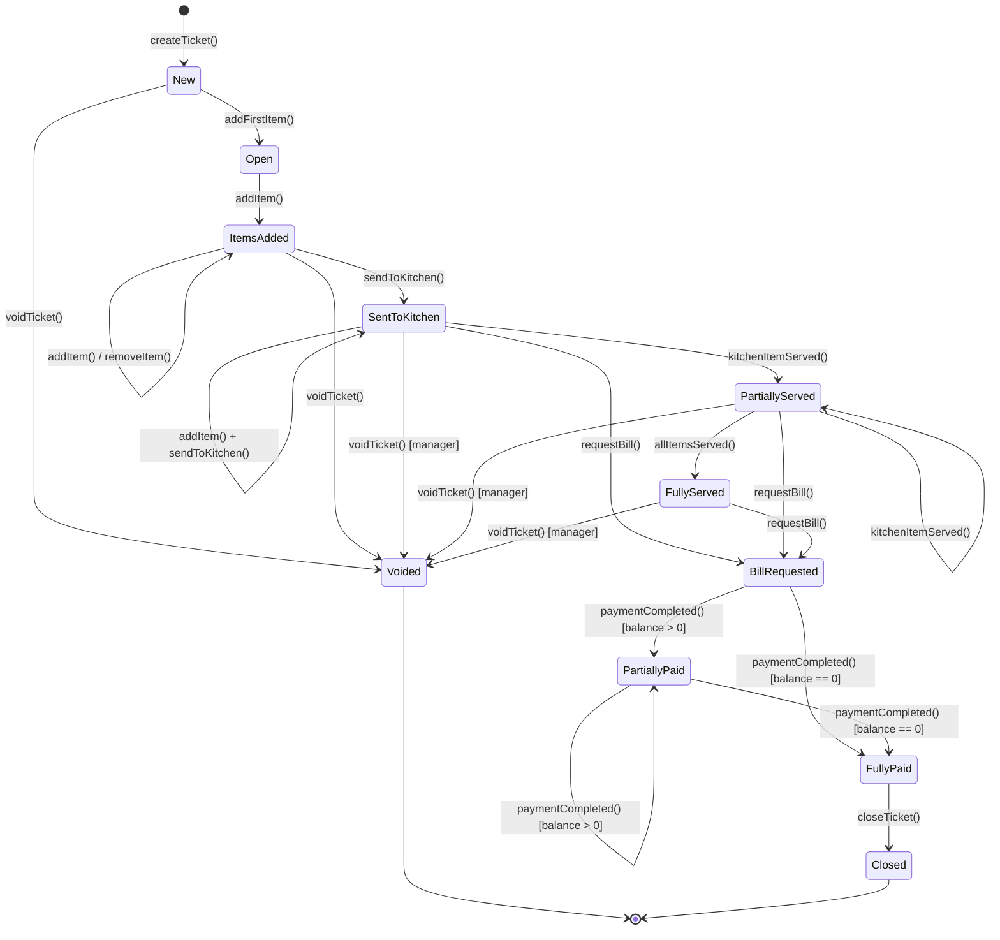

### 1.2 States

| State | Description | Allowed Operations |
|-------|-------------|-------------------|
| `new` | Ticket created but no items added yet. Exists for channel orders where the ticket shell is created first. | Add item, void, set service type, assign table, assign waiter |
| `open` | At least one item exists. Synonym for `items_added` in simple flow. Internal transitional state. | Add/remove items, modify quantity, set modifiers |
| `items_added` | Items exist on the ticket. Not yet sent to kitchen. | Add/remove items, send to kitchen, apply discount, void, change service type, move table |
| `sent_to_kitchen` | At least some items have been sent to kitchen. More items can still be added. | Add more items (creates new KT), void item (with manager), request bill, move table |
| `partially_served` | Some kitchen items marked as served but not all. | Void item (with manager), request bill, fire next course |
| `fully_served` | All items served to the guest. | Request bill, apply discount |
| `bill_requested` | Bill has been generated. No more items can be added. | Process payment, split bill, apply discount (with manager) |
| `partially_paid` | Some payment received but balance remains. | Process another payment, void a payment |
| `fully_paid` | All bills paid in full. Balance = 0. | Close ticket, add tip (post-payment) |
| `closed` | Terminal state. Ticket is immutable. | Refund only (creates separate Refund entity) |
| `voided` | Terminal state. Entire ticket cancelled. | None. Immutable. |

### 1.3 Transition Table

| # | From | To | Trigger | Guard | Side Effects | Event Emitted |
|---|------|----|---------|-------|-------------|---------------|
| 1 | -- | `new` | `createTicket(channel, table?, waiter?)` | Shift must be open; user has `ticket.create` permission | Link to shift, link to table session if dine-in, generate ticket number | `TicketCreated` |
| 2 | `new` | `items_added` | `addItem(product, qty, modifiers)` | Product is active and available; modifiers valid | Snapshot price, calculate tax, update totals | `TicketItemAdded` |
| 3 | `items_added` | `items_added` | `addItem()` | Same as #2 | Same as #2 | `TicketItemAdded` |
| 4 | `items_added` | `items_added` | `removeItem(item_id)` | Item not yet sent to kitchen | Recalculate totals | `TicketItemRemoved` |
| 5 | `items_added` | `sent_to_kitchen` | `sendToKitchen()` | At least one unsent item | Generate KitchenTickets, mark items as sent, print kitchen tickets | `TicketSentToKitchen`, `KitchenTicketCreated` |
| 6 | `sent_to_kitchen` | `sent_to_kitchen` | `addItem()` + `sendToKitchen()` | Same as #2 | New items added and new KTs created | `TicketItemAdded`, `TicketSentToKitchen` |
| 7 | `sent_to_kitchen` | `partially_served` | `kitchenItemServed(kt_item_id)` | KT item is in `ready` state | Update item serve status | `KitchenItemServed` |
| 8 | `partially_served` | `partially_served` | `kitchenItemServed()` | Not all items served yet | Update item serve status | `KitchenItemServed` |
| 9 | `partially_served` | `fully_served` | `kitchenItemServed()` [last item] | All items now served | -- | `KitchenItemServed`, `TicketFullyServed` |
| 10 | `sent_to_kitchen` / `partially_served` / `fully_served` | `bill_requested` | `requestBill(split_config?)` | At least one active (non-voided) item | Generate Bill(s) based on split config, calculate totals with rounding | `TicketBillRequested`, `BillCreated` |
| 11 | `bill_requested` | `partially_paid` | `paymentCompleted()` | Bill has balance > 0 after this payment | Update paid_cents, reduce balance | `PaymentCompleted` |
| 12 | `bill_requested` | `fully_paid` | `paymentCompleted()` | All bills balance = 0 | Update paid_cents, balance = 0 | `PaymentCompleted`, `TicketFullyPaid` |
| 13 | `partially_paid` | `partially_paid` | `paymentCompleted()` | Still balance remaining | Update paid_cents | `PaymentCompleted` |
| 14 | `partially_paid` | `fully_paid` | `paymentCompleted()` | All bills balance = 0 | Balance = 0 | `PaymentCompleted`, `TicketFullyPaid` |
| 15 | `fully_paid` | `closed` | `closeTicket()` | All bills fully paid | Generate receipt(s), trigger fiscal signing, update table status, record inventory deltas | `TicketClosed`, `ReceiptGenerated`, `FiscalTransactionCreated` |
| 16 | `new` / `items_added` | `voided` | `voidTicket(reason)` | User has `ticket.void` permission (or manager override for items_added) | Void all items, void all kitchen tickets, release table | `TicketVoided` |
| 17 | `sent_to_kitchen`+ | `voided` | `voidTicket(reason)` | Manager override REQUIRED | Void all items, cancel kitchen tickets, release table, record waste | `TicketVoided`, `KitchenItemVoided` |

### 1.4 Blocked Transitions

| Attempted | From | Reason |
|-----------|------|--------|
| `addItem()` | `bill_requested`, `partially_paid`, `fully_paid`, `closed`, `voided` | Cannot add items after bill is requested |
| `removeItem()` | Any state where `item.is_sent_to_kitchen = true` | Must use void, not remove, once kitchen has the item |
| `voidTicket()` | `fully_paid`, `closed` | Cannot void a paid ticket; use refund |
| `voidTicket()` | `voided` | Already voided |
| `requestBill()` | `new`, `items_added` (no kitchen send), `closed`, `voided` | No bill without kitchen send (configurable: quick-sale mode skips kitchen) |
| `closeTicket()` | Any state except `fully_paid` | Must be fully paid before close |
| `sendToKitchen()` | `bill_requested`, `partially_paid`, `fully_paid`, `closed`, `voided` | No kitchen operations after bill |

### 1.5 Restaurant Scenario Walkthroughs

#### Scenario A: Standard Dine-In Flow

```
1. Waiter opens table T5 (guest_count=4)     → TableSession created, Table → Occupied
2. createTicket(channel=pos, table=T5)         → Ticket: new
3. addItem(Schnitzel, qty=2)                   → Ticket: items_added
4. addItem(Salat, qty=1)                       → Ticket: items_added
5. addItem(Bier, qty=4)                        → Ticket: items_added
6. sendToKitchen()                             → Ticket: sent_to_kitchen
   → KT-1 to "grill" station (Schnitzel x2)
   → KT-2 to "cold" station (Salat x1)
   → KT-3 to "bar" station (Bier x4)
7. Kitchen bumps Bier ready                    → KitchenItem: ready
8. Waiter marks Bier served                    → Ticket: partially_served
9. Kitchen bumps Schnitzel + Salat ready       → KitchenItems: ready
10. Waiter marks all served                    → Ticket: fully_served
11. Guest asks for bill → requestBill()        → Ticket: bill_requested, Bill created
12. Guest pays by card → paymentCompleted()    → Ticket: fully_paid
13. closeTicket()                              → Ticket: closed, Receipt printed
14. Table → Cleaning → Available
```

#### Scenario B: Split Bill (one ticket to multiple bills)

```
1-6. Same as Scenario A
7-10. All items served                         → Ticket: fully_served
11. Guests want to split → requestBill(split_type=by_item)
    → Bill-1: Schnitzel x1 + Bier x2 = CHF 39.00
    → Bill-2: Schnitzel x1 + Salat x1 + Bier x2 = CHF 47.00
    → Ticket: bill_requested
12. Guest 1 pays Bill-1 by card                → Ticket: partially_paid
13. Guest 2 pays Bill-2 by cash                → Ticket: fully_paid
14. closeTicket()                              → Ticket: closed, 2 Receipts printed
```

#### Scenario C: Merge Tables

```
1. Table T3 has Ticket-A (2 guests, pizza + wine)
2. Table T4 has Ticket-B (2 guests, pasta + beer)
3. Host decides to merge tables → mergeTables(T3, T4)
   → Table T4.merged_into_table_id = T3
   → mergeTickets(Ticket-A, Ticket-B) → combined Ticket-A
   → Ticket-B.status = voided, Ticket-B.merged_into_ticket_id = Ticket-A
   → All items from Ticket-B moved to Ticket-A
   → Kitchen tickets re-associated with Ticket-A
4. Continue normal flow with merged Ticket-A on Table T3
```

#### Scenario D: Move Table

```
1. Table T7 has active Ticket with items
2. Manager wants guests at T12 instead → moveToTable(ticket, T12)
   → Old TableSession on T7 closed
   → New TableSession on T12 created (or linked to existing)
   → Ticket.table_session_id updated
   → Ticket.table_id updated
   → Table T7 → Cleaning → Available
   → Table T12 → Occupied
   → Kitchen tickets updated with new table name
```

#### Scenario E: Void Item (before and after kitchen send)

```
Before kitchen send:
1. Item "Salad" on ticket (not yet sent)
2. removeItem(salad_item_id)                   → Item simply removed, totals recalculated
   → TicketItemRemoved event

After kitchen send:
1. Item "Steak" sent to kitchen, cooking started
2. Guest changes mind → voidItem(steak_item_id, reason="guest_changed_mind")
   → Requires manager override (manager enters PIN)
   → OrderItem.status = voided
   → KitchenTicketItem.status = voided (void notification to kitchen display)
   → Ticket totals recalculated (voided item excluded)
   → InventoryDelta recorded (waste)
   → TicketItemVoided event
```

#### Scenario F: Course Management

```
1. createTicket() → Ticket: new
2. addItem(Bruschetta, course=1)
3. addItem(Soup, course=1)
4. addItem(Steak, course=2)
5. addItem(Tiramisu, course=3)
6. fireCourse(1)                               → KT sent for Bruschetta + Soup only
   → Ticket: sent_to_kitchen
   → Course 1: fired
   → Course 2: held
   → Course 3: held
7. Kitchen completes Course 1, waiter serves
8. fireCourse(2)                               → KT sent for Steak
   → Course 2: fired
9. Kitchen completes Course 2, waiter serves
10. fireCourse(3)                              → KT sent for Tiramisu
    → Course 3: fired
11. All courses served → Ticket: fully_served
12. requestBill() → normal payment flow
```

#### Scenario G: Partial Payment

```
1. Ticket total = CHF 120.00
2. requestBill() → single Bill for CHF 120.00
3. Guest pays CHF 50.00 cash → paymentCompleted(50.00)
   → Bill: partially_paid, balance = CHF 70.00
   → Ticket: partially_paid
4. Guest pays remaining CHF 70.00 by card → paymentCompleted(70.00)
   → Bill: fully_paid
   → Ticket: fully_paid
5. closeTicket() → Ticket: closed
```

#### Scenario H: Manager Override for Discount

```
1. Ticket with items totaling CHF 85.00
2. Waiter applies 10% discount → applyDiscount(percent=10)
   → Waiter role allows max 5% discount
   → System requests manager override
3. Manager enters PIN → ManagerOverrideGranted
4. Discount applied: CHF 85.00 - CHF 8.50 = CHF 76.50
   → ticket_discount_authorized_by = manager_id
   → DiscountApplied event
```

### 1.6 Reconciliation Rules

| Inconsistency | Detection | Recovery |
|---------------|-----------|----------|
| Ticket stuck in `sent_to_kitchen` for >4 hours | Background job check | Alert manager; offer force-close with reason |
| Ticket `fully_paid` but not `closed` | Shift close check | Auto-close if all bills paid and receipts generated |
| Bill total does not match ticket total | On bill creation | Recalculate from order items; log discrepancy |
| Payment sum exceeds bill total | On payment completion | Block payment; recalculate |
| Orphan ticket (no shift) | Sync reconciliation | Assign to nearest open shift or create recovery shift |

---

## 2. Table Lifecycle

### 2.1 State Diagram

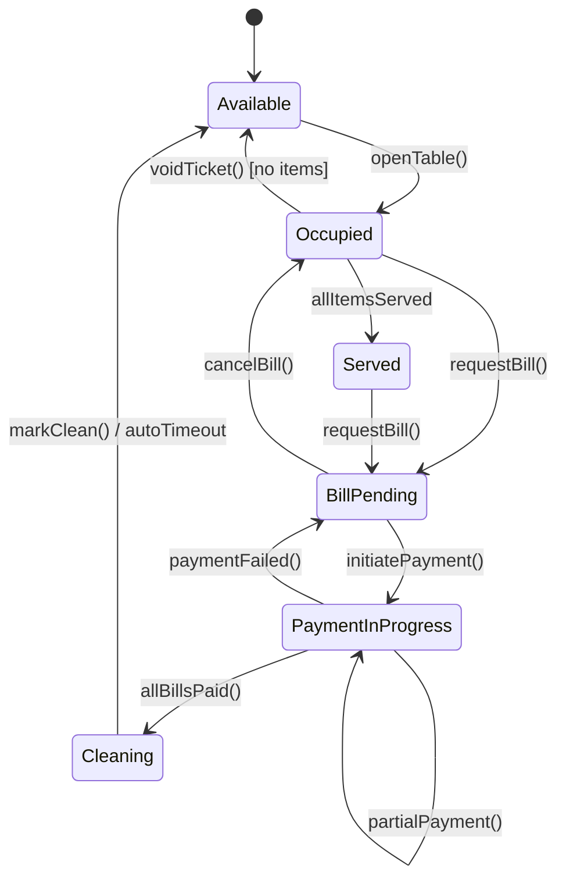

### 2.2 States

| State | Description |
|-------|-------------|
| `available` | Table is free and can be opened for new guests. |
| `occupied` | Guests are seated, active ticket exists. Orders being taken or in kitchen. |
| `served` | All food/drinks have been served. Guests are dining/drinking. |
| `bill_pending` | Bill has been requested. Waiting for payment. |
| `payment_in_progress` | Payment is actively being processed (card terminal transaction). |
| `cleaning` | Guests have left, table needs to be cleared and cleaned. |

### 2.3 Transition Table

| # | From | To | Trigger | Side Effects | Event |
|---|------|----|---------|-------------|-------|
| 1 | `available` | `occupied` | `openTable(waiter, guests)` | Create TableSession, update `current_session_id` | `TableOpened` |
| 2 | `occupied` | `served` | All kitchen items for this table's ticket(s) marked served | -- | `TableStatusChanged` |
| 3 | `occupied` | `bill_pending` | `requestBill()` on associated ticket | Bill generated | `TableStatusChanged` |
| 4 | `served` | `bill_pending` | `requestBill()` | Bill generated | `TableStatusChanged` |
| 5 | `bill_pending` | `payment_in_progress` | `initiatePayment()` | Payment terminal activated | `TableStatusChanged` |
| 6 | `payment_in_progress` | `bill_pending` | Payment failed or cancelled | Payment reversed | `TableStatusChanged` |
| 7 | `payment_in_progress` | `payment_in_progress` | Partial payment completed | Balance reduced | -- |
| 8 | `payment_in_progress` | `cleaning` | All bills fully paid | Close table session, ticket → `fully_paid` | `TableStatusChanged` |
| 9 | `cleaning` | `available` | `markClean()` or auto-timeout (5 min) | Clear `current_session_id` | `TableClosed` |
| 10 | `occupied` | `available` | Ticket voided with no remaining items | Close table session | `TableClosed` |
| 11 | `bill_pending` | `occupied` | Bill cancelled (rare; manager override) | Bill voided | `TableStatusChanged` |

### 2.4 Blocked Transitions

| Attempted | From | Reason |
|-----------|------|--------|
| `openTable()` | Any except `available` | Table already in use |
| `markClean()` | Any except `cleaning` | Not in cleaning state |
| `requestBill()` | `available`, `cleaning` | No active ticket |

### 2.5 Reconciliation

| Inconsistency | Recovery |
|---------------|----------|
| Table stuck in `occupied` > 8 hours | Alert manager; offer force-close |
| Table stuck in `cleaning` > 30 minutes | Auto-transition to `available` |
| Table `available` but has `current_session_id` | Clear session reference |
| Table `occupied` but session is closed | Reopen session or set to available |

---

## 3. Kitchen Item Lifecycle

### 3.1 State Diagram

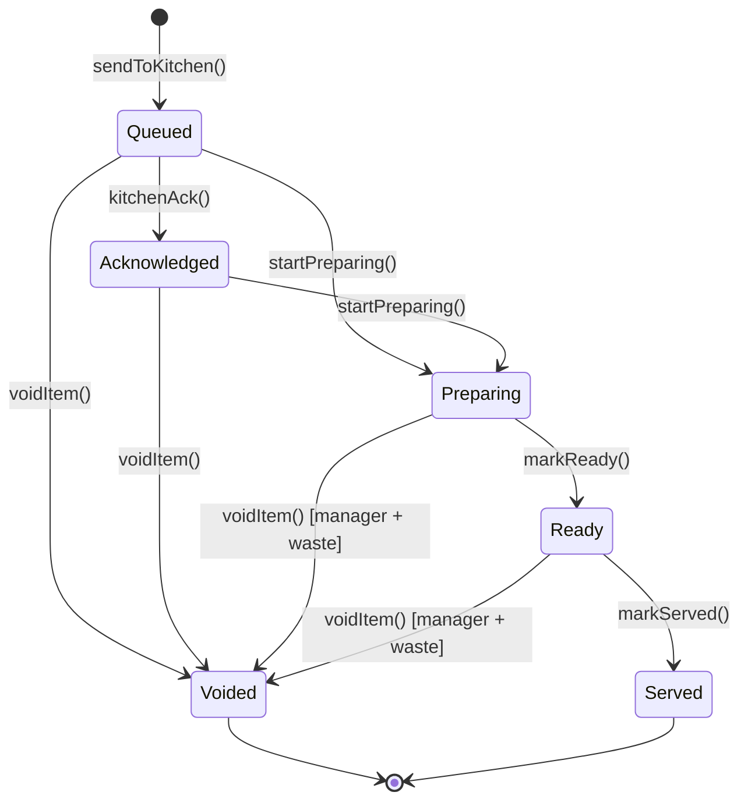

### 3.2 States

| State | Description |
|-------|-------------|
| `queued` | Item sent to kitchen station, awaiting acknowledgment on KDS. |
| `acknowledged` | Kitchen staff has seen the item on KDS (tap to acknowledge). |
| `preparing` | Actively being prepared/cooked. Timer starts. |
| `ready` | Food/drink is ready for pickup by waiter. Alert triggered. |
| `served` | Waiter has picked up and delivered to guest. Bump from KDS. |
| `voided` | Item cancelled. If prep started, waste is recorded. |

### 3.3 Transition Table

| # | From | To | Trigger | Side Effects | Event |
|---|------|----|---------|-------------|-------|
| 1 | -- | `queued` | Kitchen ticket created from order fire | Print kitchen ticket, display on KDS, start SLA timer | `KitchenTicketCreated` |
| 2 | `queued` | `acknowledged` | Kitchen staff taps item on KDS | Stop "new item" alert | `KitchenItemAcknowledged` |
| 3 | `queued` / `acknowledged` | `preparing` | Kitchen staff starts item | Record `started_at`, start prep timer | `KitchenItemPreparing` |
| 4 | `preparing` | `ready` | Kitchen staff marks complete | Record `ready_at`, calculate `prep_time_seconds`, alert waiter | `KitchenItemReady` |
| 5 | `ready` | `served` | Waiter bumps from expo/KDS | Record `served_at`, update ticket serve status | `KitchenItemServed` |
| 6 | `queued` / `acknowledged` | `voided` | Order item voided | Remove from KDS display | `KitchenItemVoided` |
| 7 | `preparing` / `ready` | `voided` | Order item voided (manager required) | Remove from KDS, record waste/InventoryDelta | `KitchenItemVoided` |

### 3.4 Blocked Transitions

| Attempted | From | Reason |
|-----------|------|--------|
| `startPreparing()` | `ready`, `served`, `voided` | Already past preparation |
| `markReady()` | `queued`, `acknowledged`, `served`, `voided` | Must be in preparing |
| `markServed()` | Anything except `ready` | Must be ready before served |

### 3.5 SLA / Alerts

| Condition | Threshold | Action |
|-----------|-----------|--------|
| Item in `queued` too long | > 2 minutes | Alert kitchen (flash on KDS) |
| Item in `preparing` too long | > product.prep_time_minutes * 1.5 | Alert kitchen manager |
| Item in `ready` too long | > 3 minutes | Alert waiter and manager |

### 3.6 Reconciliation

| Inconsistency | Recovery |
|---------------|----------|
| KT item `queued` but parent OrderItem voided | Transition to `voided` |
| KT item `ready` for > 30 min | Alert manager; may auto-void with waste |
| KT item `preparing` but kitchen closed | Alert; hold until next shift |

---

## 4. Payment Lifecycle

### 4.1 State Diagram

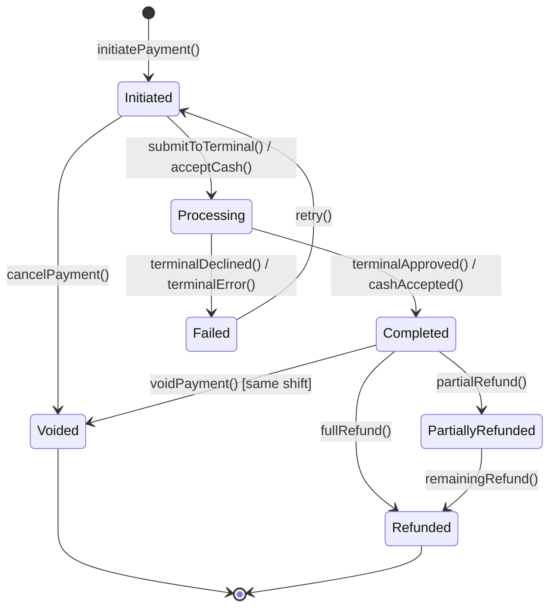

### 4.2 States

| State | Description |
|-------|-------------|
| `initiated` | Payment record created, amount determined, method selected. |
| `processing` | Actively processing (card terminal communicating, or cash being counted). |
| `completed` | Payment successfully processed. Money received. |
| `failed` | Payment attempt failed (card declined, terminal error). |
| `voided` | Payment reversed before settlement (same business day). |
| `refunded` | Full amount refunded after settlement. |
| `partially_refunded` | Part of the amount refunded. |

### 4.3 Transition Table

| # | From | To | Trigger | Guard | Side Effects | Event |
|---|------|----|---------|-------|-------------|-------|
| 1 | -- | `initiated` | `initiatePayment(bill, method, amount)` | Bill has balance; amount <= balance | Create Payment record | `PaymentInitiated` |
| 2 | `initiated` | `processing` | `submitToTerminal()` (card) or `acceptCash()` (cash) | Terminal available (card); cash tendered >= amount | Send to card terminal; or validate cash amount | -- |
| 3 | `processing` | `completed` | Terminal approval / cash validated | Reference received (card) | Update Bill.paid_cents, update Ticket.paid_cents, record in Shift, open cash drawer (cash), trigger receipt | `PaymentCompleted` |
| 4 | `processing` | `failed` | Terminal decline / timeout / error | -- | Log error, no financial impact | `PaymentFailed` |
| 5 | `failed` | `initiated` | `retry()` | Retry count < max (3) | Increment retry counter | -- |
| 6 | `initiated` | `voided` | `cancelPayment()` | Payment not yet completed | Remove from bill | `PaymentVoided` |
| 7 | `completed` | `voided` | `voidPayment(reason, auth)` | Same shift, manager auth | Reverse Bill.paid_cents, reverse Shift cash tracking, void in terminal (card) | `PaymentVoided` |
| 8 | `completed` | `refunded` | `fullRefund(reason)` | Manager approved, after settlement | Create Refund record, process via original method | `RefundCompleted` |
| 9 | `completed` | `partially_refunded` | `partialRefund(amount, reason)` | Manager approved, amount < original | Create partial Refund record | `RefundCompleted` |
| 10 | `partially_refunded` | `refunded` | `remainingRefund()` | Total refunds = original amount | Create final Refund record | `RefundCompleted` |

### 4.4 Blocked Transitions

| Attempted | From | Reason |
|-----------|------|--------|
| `voidPayment()` | `voided`, `refunded` | Already reversed |
| `voidPayment()` | `completed` (different shift) | Must use refund after shift close |
| `refund()` | `voided` | Already voided |
| `retry()` | `completed` | Already succeeded |
| `initiatePayment()` | Bill with balance = 0 | Nothing to pay |

### 4.5 Reconciliation

| Inconsistency | Recovery |
|---------------|----------|
| Payment `processing` > 2 minutes (card) | Timeout; query terminal status; may set to `failed` |
| Payment `completed` but Bill.paid_cents not updated | Recalculate Bill from its Payments |
| Payment `completed` but terminal reversed (chargeback) | Create adjustment record; alert manager |
| Shift close with `initiated`/`processing` payments | Force-fail or force-void with manager |

---

## 5. Sync Job Lifecycle

### 5.1 State Diagram

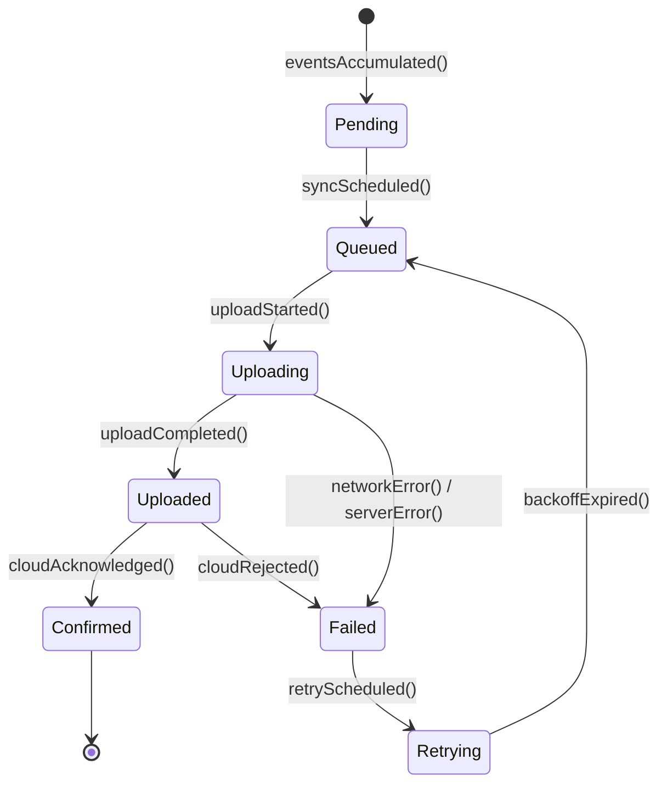

### 5.2 States

| State | Description |
|-------|-------------|
| `pending` | Events are accumulating in the outbox. Sync not yet triggered. |
| `queued` | Sync job created and waiting for network slot. |
| `uploading` | Actively transmitting data to cloud. |
| `uploaded` | Cloud received the data, processing. |
| `confirmed` | Cloud confirmed successful processing. Events can be purged from outbox. |
| `failed` | Sync attempt failed. Will retry. |
| `retrying` | Waiting for exponential backoff timer before next attempt. |

### 5.3 Transition Table

| # | From | To | Trigger | Side Effects | Event |
|---|------|----|---------|-------------|-------|
| 1 | -- | `pending` | Domain events written to outbox | Increment pending count | -- |
| 2 | `pending` | `queued` | Sync timer fires or manual trigger | Create SyncJob with event batch | `SyncJobCreated` |
| 3 | `queued` | `uploading` | Network available, slot open | Start HTTPS/gRPC upload, compress payload | `SyncJobUploading` |
| 4 | `uploading` | `uploaded` | Server returns 202 Accepted | Record server-side job ID | -- |
| 5 | `uploaded` | `confirmed` | Server sends confirmation (poll or push) | Purge confirmed events from outbox, update sync cursor | `SyncJobCompleted` |
| 6 | `uploading` | `failed` | Network timeout, 5xx error | Log error, increment retry_count | `SyncJobFailed` |
| 7 | `uploaded` | `failed` | Server returns 4xx (validation error) | Log error details, may require manual fix | `SyncJobFailed` |
| 8 | `failed` | `retrying` | Auto-retry policy triggered | Calculate next retry time (exponential backoff) | -- |
| 9 | `retrying` | `queued` | Backoff timer expires | Re-queue the job | -- |

### 5.4 Retry Policy

| Attempt | Backoff Delay |
|---------|--------------|
| 1 | 5 seconds |
| 2 | 15 seconds |
| 3 | 45 seconds |
| 4 | 2 minutes |
| 5 | 5 minutes |
| 6 | 15 minutes |
| 7 | 30 minutes |
| 8 | 1 hour |
| 9 | 2 hours |
| 10 | 4 hours (max; alert manager) |

### 5.5 Priority Queue

| Priority | Entity Types | Behavior |
|----------|-------------|----------|
| 1 (highest) | FiscalTransaction | Sync immediately, retry aggressively |
| 2 | Payment, Refund | Sync within 1 minute |
| 3 | Ticket, Bill | Sync within 5 minutes |
| 4 | Shift, CashMovement | Sync within 15 minutes |
| 5 (lowest) | InventoryDelta, TableSession | Batch sync every 30 minutes |

### 5.6 Blocked Transitions

| Attempted | From | Reason |
|-----------|------|--------|
| `upload` | `confirmed` | Already confirmed |
| `retry` | `confirmed` | Already confirmed |
| `queue` | `uploading` | Already in progress |

### 5.7 Reconciliation

| Inconsistency | Recovery |
|---------------|----------|
| Events in outbox for > 24 hours | Alert manager; check connectivity |
| SyncJob stuck in `uploading` > 5 minutes | Timeout; transition to `failed` |
| Cloud has newer data than runtime for same entity | Last-writer-wins for master data; server version wins |
| Duplicate events received by cloud | Idempotency key check; deduplicate |

---

## 6. Germany Fiscal Transaction Lifecycle

### 6.1 State Diagram

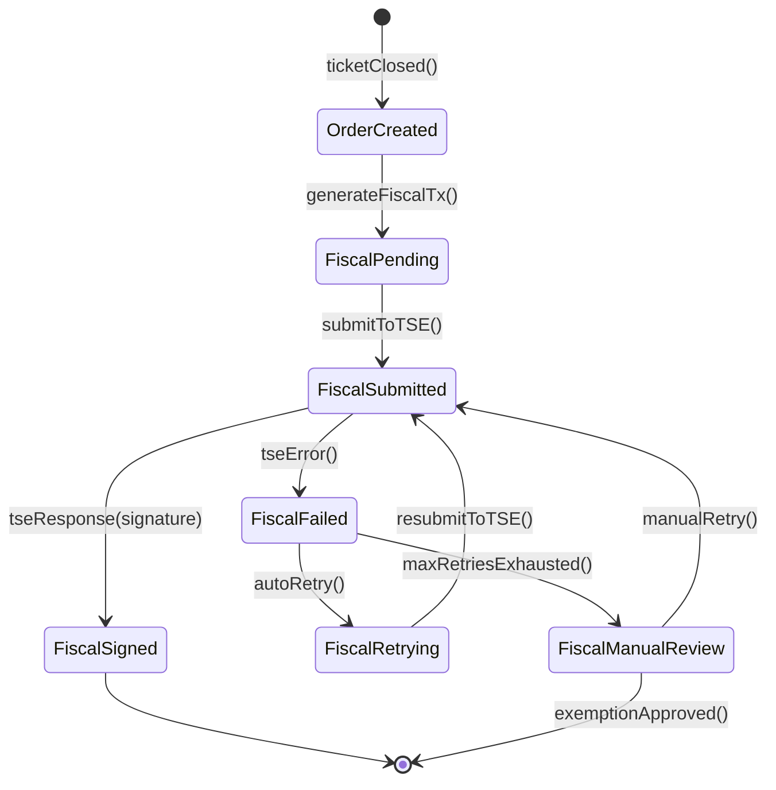

### 6.2 States

| State | Description |
|-------|-------------|
| `order_created` | Ticket has been closed and receipt data is assembled. Fiscal signing not yet started. |
| `fiscal_pending` | Fiscal transaction record created, queued for TSE submission. |
| `fiscal_submitted` | Request sent to TSE device or fiskaly cloud API. Awaiting response. |
| `fiscal_signed` | TSE returned a valid signature. Transaction is legally compliant. Terminal state. |
| `fiscal_failed` | TSE returned an error (device offline, cert expired, etc.). |
| `fiscal_retrying` | Automatic retry in progress with backoff. |
| `fiscal_manual_review` | All automatic retries exhausted. Requires human intervention. |

### 6.3 Transition Table

| # | From | To | Trigger | Side Effects | Event |
|---|------|----|---------|-------------|-------|
| 1 | -- | `order_created` | `ticketClosed()` | Receipt assembled with DSFinV-K process data | -- |
| 2 | `order_created` | `fiscal_pending` | `generateFiscalTx()` | Create FiscalTransaction record with process_data | `FiscalTransactionCreated` |
| 3 | `fiscal_pending` | `fiscal_submitted` | `submitToTSE()` | Send startTransaction + finishTransaction to TSE | -- |
| 4 | `fiscal_submitted` | `fiscal_signed` | TSE returns signature | Store signature, signature_counter, transaction_number, encode QR data | `FiscalTransactionSigned` |
| 5 | `fiscal_submitted` | `fiscal_failed` | TSE error/timeout | Log error, increment retry_count | `FiscalTransactionFailed` |
| 6 | `fiscal_failed` | `fiscal_retrying` | retry_count < 5 | Schedule retry with backoff | -- |
| 7 | `fiscal_retrying` | `fiscal_submitted` | Retry timer fires | Re-send to TSE | -- |
| 8 | `fiscal_failed` | `fiscal_manual_review` | retry_count >= 5 | Alert manager via notification, flag in dashboard | `FiscalTransactionFailed` |
| 9 | `fiscal_manual_review` | `fiscal_submitted` | Manager clicks "retry" in admin | Reset retry counter, resubmit | -- |
| 10 | `fiscal_manual_review` | terminal | Regulatory exemption documented | Record exemption reason (TSE device replacement in progress) | -- |

### 6.4 Legal Requirements (KassenSichV)

| Requirement | Implementation |
|-------------|---------------|
| Every receipt must be signed by TSE | Enforced by state machine; cannot print receipt without fiscal_signed or documented exemption |
| Signature must include timestamp, transaction number, signature counter | Stored in FiscalTransaction fields |
| Receipt must show TSE serial number and signature | Injected into receipt template by Country Pack |
| DSFinV-K export must be available for auditors | Fiscal export endpoint generates from FiscalTransaction records |
| TSE failures must be documented | FiscalTransaction records all attempts and errors |

### 6.5 Reconciliation

| Inconsistency | Recovery |
|---------------|----------|
| Receipt printed but no FiscalTransaction | Critical alert; create retroactive fiscal record; document gap |
| FiscalTransaction `fiscal_pending` > 30 seconds | Trigger immediate submission |
| TSE device offline for > 30 minutes | Alert owner; POS continues with documented failures |
| Signature counter gap detected | Audit flag; investigate missing transactions |

---

## 7. Online Order Lifecycle

### 7.1 State Diagram

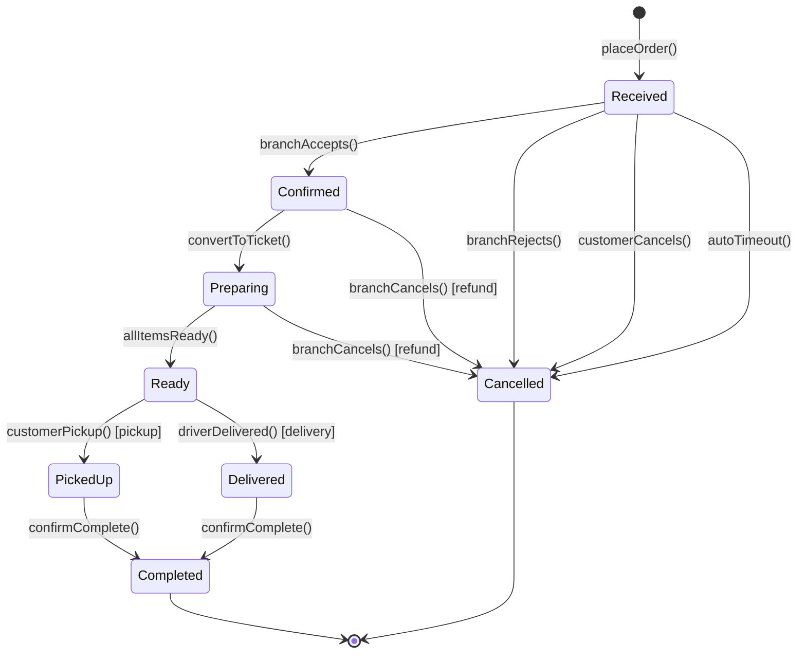

### 7.2 States

| State | Description |
|-------|-------------|
| `received` | Order placed by customer online. Payment captured. Awaiting branch confirmation. |
| `confirmed` | Branch accepted the order. Estimated time communicated to customer. |
| `preparing` | Order converted to Ticket, sent to kitchen. Actively being prepared. |
| `ready` | Kitchen completed all items. Waiting for pickup or driver. |
| `picked_up` | Customer picked up the order (pickup mode). |
| `delivered` | Driver delivered the order (delivery mode). |
| `completed` | Terminal state. Order fulfilled. |
| `cancelled` | Terminal state. Order cancelled. Refund processed if payment was captured. |

### 7.3 Transition Table

| # | From | To | Trigger | Side Effects | Event |
|---|------|----|---------|-------------|-------|
| 1 | -- | `received` | Customer submits order online | Capture payment, notify branch, start 5-min acceptance timer | `OnlineOrderReceived` |
| 2 | `received` | `confirmed` | Branch staff accepts | Set estimated_ready_at, notify customer | `OnlineOrderConfirmed` |
| 3 | `received` | `cancelled` | Branch rejects or 5-min timeout | Refund payment, notify customer with reason | `OnlineOrderCancelled` |
| 4 | `received` | `cancelled` | Customer cancels | Refund payment | `OnlineOrderCancelled` |
| 5 | `confirmed` | `preparing` | ChannelOrder → Ticket conversion at branch | Create Ticket with channel=online, send to kitchen | `TicketCreated` |
| 6 | `preparing` | `ready` | All kitchen items ready | Notify customer ("Your order is ready") | `OnlineOrderReady` |
| 7 | `ready` | `picked_up` | Staff marks as picked up | Record pickup time | `OnlineOrderPickedUp` |
| 8 | `ready` | `delivered` | Driver marks as delivered | Record delivery time | `OnlineOrderDelivered` |
| 9 | `picked_up` / `delivered` | `completed` | Auto-complete after 15 min or manual | Close Ticket, finalize | `OnlineOrderCompleted` |
| 10 | `confirmed` / `preparing` | `cancelled` | Branch cancels (out of stock, emergency) | Refund payment, void ticket, notify customer | `OnlineOrderCancelled` |

### 7.4 Blocked Transitions

| Attempted | From | Reason |
|-----------|------|--------|
| `branchAccepts()` | Any except `received` | Can only accept a new order |
| `customerCancels()` | `preparing`, `ready`, `picked_up`, `delivered`, `completed` | Cannot cancel once preparation started (branch must cancel) |
| `markReady()` | `received`, `cancelled`, `completed` | Invalid state for ready |

### 7.5 Reconciliation

| Inconsistency | Recovery |
|---------------|----------|
| Order `received` for > 10 minutes | Auto-reject with refund; notify customer |
| Order `preparing` for > estimated time * 2 | Alert branch manager |
| Order `ready` for > 60 minutes (pickup) | Alert branch; attempt customer contact |
| Payment captured but order `cancelled` | Verify refund processed; if not, trigger refund |

---

## 8. Kiosk Order Lifecycle

### 8.1 State Diagram

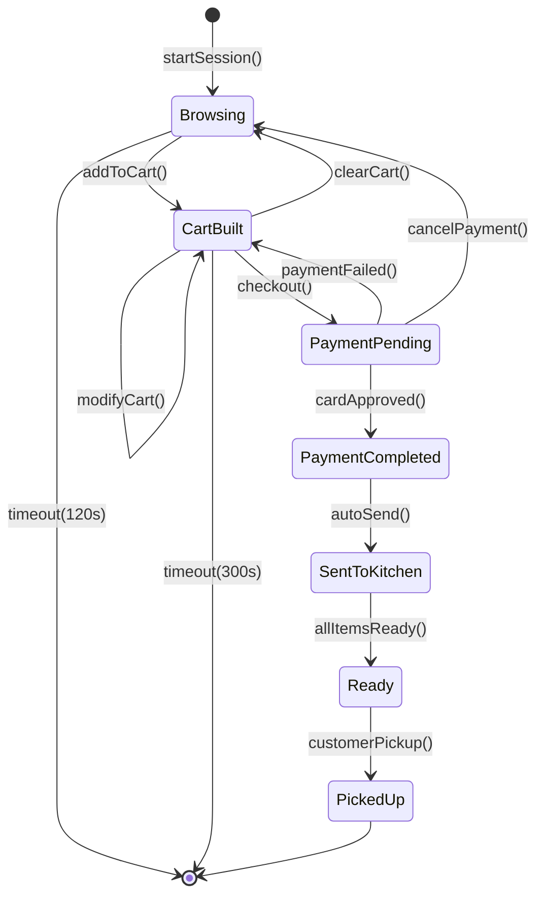

### 8.2 States

| State | Description |
|-------|-------------|
| `browsing` | Customer is viewing the menu on kiosk. No items in cart. |
| `cart_built` | Customer has items in their cart. Reviewing before checkout. |
| `payment_pending` | Customer has pressed checkout. Card terminal waiting for tap/insert. |
| `payment_completed` | Card payment approved. Order confirmed. |
| `sent_to_kitchen` | Order sent to kitchen as Ticket. Kitchen tickets generated. |
| `ready` | Kitchen has completed all items. Order number displayed on pickup screen. |
| `picked_up` | Customer collected their order. Terminal state. |

### 8.3 Transition Table

| # | From | To | Trigger | Side Effects | Event |
|---|------|----|---------|-------------|-------|
| 1 | -- | `browsing` | Screen touch or new session | Start idle timer (120s), show welcome screen | `KioskSessionStarted` |
| 2 | `browsing` | `cart_built` | `addToCart(product, qty, modifiers)` | Calculate running total, display cart summary | -- |
| 3 | `cart_built` | `cart_built` | `modifyCart()` / `addToCart()` | Recalculate total | -- |
| 4 | `cart_built` | `browsing` | `clearCart()` | Reset cart, restart idle timer | `KioskCartAbandoned` |
| 5 | `cart_built` | `payment_pending` | `checkout()` | Show total, activate card terminal | -- |
| 6 | `payment_pending` | `payment_completed` | Card terminal returns approval | Create Ticket (channel=kiosk), process Payment, assign order number | `KioskOrderCompleted` |
| 7 | `payment_pending` | `cart_built` | Card declined/error | Show error, return to cart | `KioskPaymentFailed` |
| 8 | `payment_pending` | `browsing` | Customer presses cancel | Reset card terminal, clear cart | `KioskCartAbandoned` |
| 9 | `payment_completed` | `sent_to_kitchen` | Automatic (immediate) | Generate KitchenTickets, display order number and "Thank you" | `TicketSentToKitchen` |
| 10 | `sent_to_kitchen` | `ready` | All kitchen items ready | Display order number on pickup screen | `KitchenItemReady` |
| 11 | `ready` | `picked_up` | Staff marks as collected | Close ticket | `TicketClosed` |
| 12 | `browsing` | (end) | Idle timeout 120s | Reset to attract screen | `KioskSessionTimeout` |
| 13 | `cart_built` | (end) | Idle timeout 300s | Log abandoned cart, reset | `KioskCartAbandoned` |

### 8.4 Blocked Transitions

| Attempted | From | Reason |
|-----------|------|--------|
| `checkout()` | `browsing` (empty cart) | Nothing to pay |
| `addToCart()` | `payment_pending`, `payment_completed` | Cannot modify after checkout |
| Cash payment | Any | Kiosk is card-only |

### 8.5 Reconciliation

| Inconsistency | Recovery |
|---------------|----------|
| Payment approved but ticket not created | Card terminal log + create ticket retroactively |
| Kiosk stuck in `payment_pending` > 2 min | Timeout; cancel payment attempt; return to cart |
| Order `ready` for > 30 min uncollected | Alert staff; may need to remake or discard |

---

## 9. Shift Lifecycle

### 9.1 State Diagram

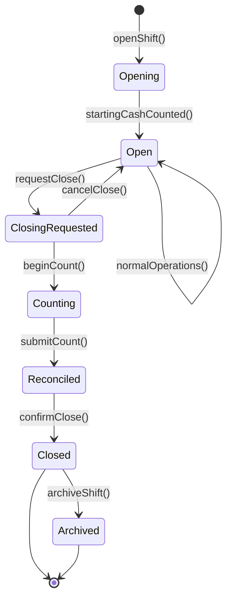

### 9.2 States

| State | Description |
|-------|-------------|
| `opening` | Shift initiated, cashier counting opening cash. |
| `open` | Shift is active. Tickets, payments, cash movements flowing. |
| `closing_requested` | Close requested but not yet started. May be cancelled. |
| `counting` | Cashier is performing end-of-shift cash count. New tickets blocked. |
| `reconciled` | Cash count submitted, discrepancy calculated. Awaiting final confirmation. |
| `closed` | Shift finalized. Z-report generated. No more operations. |
| `archived` | Shift data archived for long-term storage. |

### 9.3 Transition Table

| # | From | To | Trigger | Guard | Side Effects | Event |
|---|------|----|---------|-------|-------------|-------|
| 1 | -- | `opening` | `openShift(user, device)` | No open shift on this device; user has `shift.open` permission | Create Shift record | -- |
| 2 | `opening` | `open` | `submitOpeningCount(amount)` | Amount >= 0 | Record CashMovement (starting_cash), set opening_amount | `ShiftOpened` |
| 3 | `open` | `open` | Normal operations | -- | Payments and cash movements accumulate | -- |
| 4 | `open` | `closing_requested` | `requestClose()` | User has `shift.close` permission | Warn if open tickets exist | `ShiftCloseRequested` |
| 5 | `closing_requested` | `open` | `cancelClose()` | -- | Resume operations | -- |
| 6 | `closing_requested` | `counting` | `beginCount()` | All tickets paid or manager override for open tickets | Block new ticket creation on this device | -- |
| 7 | `counting` | `reconciled` | `submitCount(denominations)` | Count submitted | Calculate expected_cash, discrepancy; optionally blind-count reveal | `ShiftCounted` |
| 8 | `reconciled` | `closed` | `confirmClose()` | Manager approval if discrepancy > threshold | Generate Z-report, print if configured, queue for sync | `ShiftClosed` |
| 9 | `closed` | `archived` | Background job (after 90 days) | -- | Move to archive storage | `ShiftArchived` |

### 9.4 Blocked Transitions

| Attempted | From | Reason |
|-----------|------|--------|
| `openShift()` | When device already has open shift | One open shift per device |
| `beginCount()` | `open` (without requestClose) | Must request close first |
| `createTicket()` | Device with shift in `counting`, `reconciled`, `closed` | Shift not accepting new tickets |
| `confirmClose()` | Large discrepancy without manager | Requires manager review |

### 9.5 Reconciliation

| Inconsistency | Recovery |
|---------------|----------|
| Shift `open` for > 16 hours | Alert manager; force close option |
| Shift `counting` for > 1 hour | Alert manager; may restart count |
| Tickets assigned to closed shift | Reassign to current open shift |
| Cash discrepancy > 5% | Require manager note and approval |
| Device rebooted during open shift | Recover shift state from SQLite on startup |

---

## 10. Refund Lifecycle

### 10.1 State Diagram

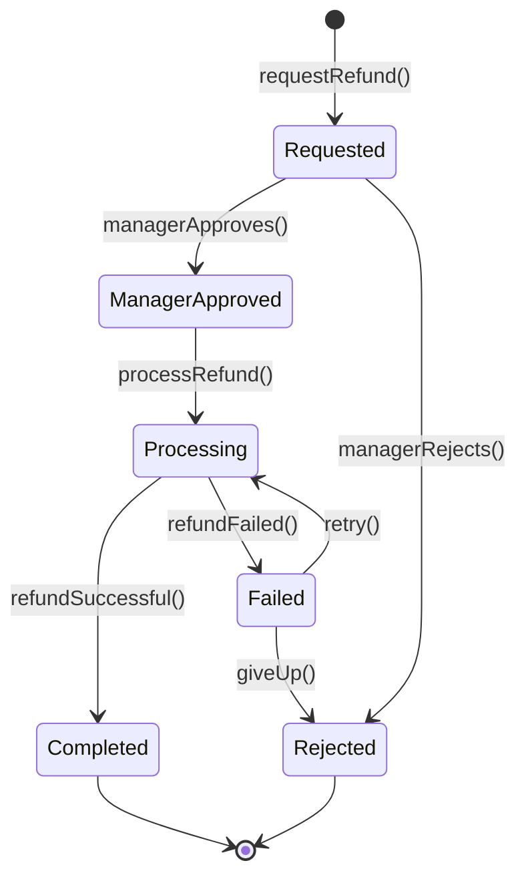

### 10.2 States

| State | Description |
|-------|-------------|
| `requested` | Staff initiated a refund request. Awaiting manager approval. |
| `manager_approved` | Manager reviewed and approved the refund. Ready to process. |
| `processing` | Refund is being processed (card reversal, cash return). |
| `completed` | Refund successfully processed. Money returned to customer. |
| `failed` | Refund processing failed (card processor error). Can retry. |
| `rejected` | Manager rejected the refund request. No money returned. |

### 10.3 Transition Table

| # | From | To | Trigger | Guard | Side Effects | Event |
|---|------|----|---------|-------|-------------|-------|
| 1 | -- | `requested` | `requestRefund(payment, amount, reason)` | Original Payment is `completed`; amount <= payment amount - already refunded; shift is open | Create Refund record, notify manager | `RefundRequested` |
| 2 | `requested` | `manager_approved` | Manager enters PIN | Manager has `payment.refund` permission | Record approved_by, approved_at | `RefundApproved` |
| 3 | `requested` | `rejected` | Manager rejects | -- | Record rejected_by, rejection_reason | `RefundRejected` |
| 4 | `manager_approved` | `processing` | `processRefund()` | -- | For card: initiate reversal via terminal/gateway. For cash: instruct cashier to return cash | -- |
| 5 | `processing` | `completed` | Refund processor confirms | -- | Update Payment status, update Bill.paid_cents, create fiscal refund receipt (if DE), record CashMovement (if cash), record InventoryDelta | `RefundCompleted` |
| 6 | `processing` | `failed` | Processor error | -- | Log error | `RefundFailed` |
| 7 | `failed` | `processing` | Retry | retry_count < 3 | Resubmit to processor | -- |
| 8 | `failed` | `rejected` | Max retries exhausted or manual abort | -- | Alert manager; document failure | `RefundRejected` |

### 10.4 Blocked Transitions

| Attempted | From | Reason |
|-----------|------|--------|
| `requestRefund()` | Payment is `voided` | Already reversed via void |
| `requestRefund()` | Amount > remaining refundable | Over-refund not allowed |
| `approve()` | User without `payment.refund` permission | Insufficient permission |
| `processRefund()` | `requested` (without approval) | Must have manager approval |

### 10.5 Reconciliation

| Inconsistency | Recovery |
|---------------|----------|
| Refund `processing` > 5 minutes (card) | Timeout; query processor status |
| Refund `completed` but Bill not updated | Recalculate Bill from Payments and Refunds |
| Cash refund `completed` but no CashMovement | Create retroactive CashMovement |
| Refund `manager_approved` for > 1 hour | Alert; may auto-expire |

---

## 11. Table Session Lifecycle

### 11.1 State Diagram

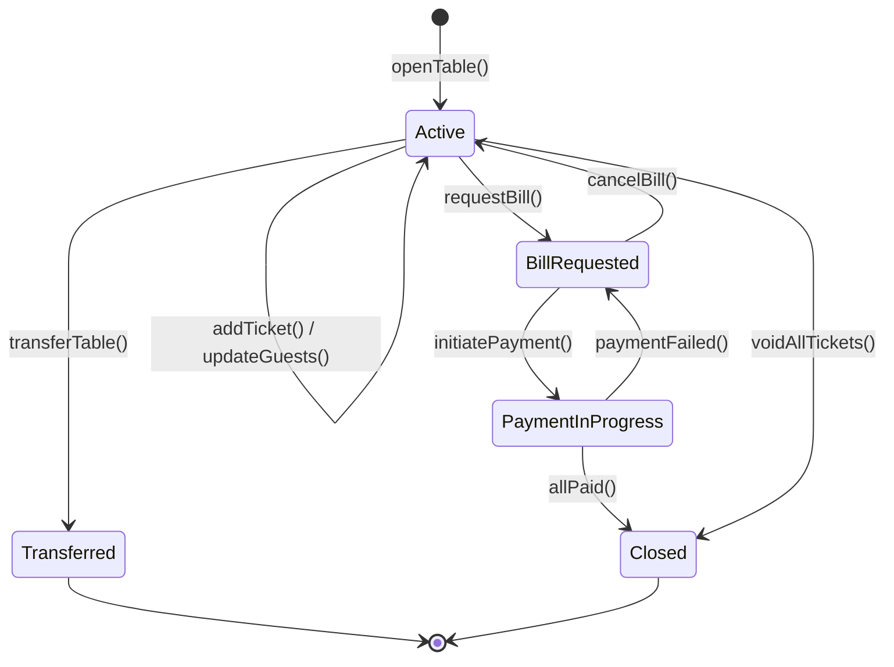

### 11.2 States

| State | Description |
|-------|-------------|
| `active` | Session is in progress. Guests are seated, orders are being taken/served. |
| `bill_requested` | At least one ticket has requested a bill. |
| `payment_in_progress` | Payment is actively being processed for this session's bills. |
| `closed` | All tickets paid and session ended. Terminal state. |
| `transferred` | Session was transferred to a different table. Old session is closed. |

### 11.3 Transition Table

| # | From | To | Trigger | Side Effects | Event |
|---|------|----|---------|-------------|-------|
| 1 | -- | `active` | `openTable(table, waiter, guests)` | Create session, set Table.current_session_id, Table → Occupied | `TableOpened` |
| 2 | `active` | `active` | `addTicket()` / `updateGuestCount()` | Update guest count, link ticket | -- |
| 3 | `active` | `bill_requested` | Any ticket requests bill | -- | -- |
| 4 | `bill_requested` | `payment_in_progress` | Payment initiated on any bill | -- | -- |
| 5 | `payment_in_progress` | `bill_requested` | Payment failed | -- | -- |
| 6 | `payment_in_progress` | `closed` | All tickets fully paid | Calculate duration, set closed_at, Table → Cleaning | `TableClosed` |
| 7 | `bill_requested` | `active` | All bills cancelled | Tickets back to active | -- |
| 8 | `active` | `closed` | All tickets voided | Close immediately, Table → Available | `TableClosed` |
| 9 | `active` | `transferred` | `moveTable()` | Close this session, open new session on target table | `TableMoved` |

### 11.4 Blocked Transitions

| Attempted | From | Reason |
|-----------|------|--------|
| `openTable()` | Table already has active session | Must close existing session first |
| `close()` | Active tickets with balance > 0 | Must pay or void first |
| `transferTo()` | `closed`, `transferred` | Already terminal |
| `addTicket()` | `closed`, `transferred` | Session ended |

### 11.5 Reconciliation

| Inconsistency | Recovery |
|---------------|----------|
| Session `active` for > 8 hours | Alert manager; check if guests still present |
| Session `active` but table shows `available` | Relink table to session, set table to Occupied |
| Session `closed` but table shows `occupied` | Set table to Cleaning/Available |
| Multiple active sessions for same table | Close older session, keep newest |
| Session `transferred` but target table has no session | Create session on target table |

---

## 12. Cross-Machine Interaction Patterns

### 12.1 Table Open to Close (Full Flow)

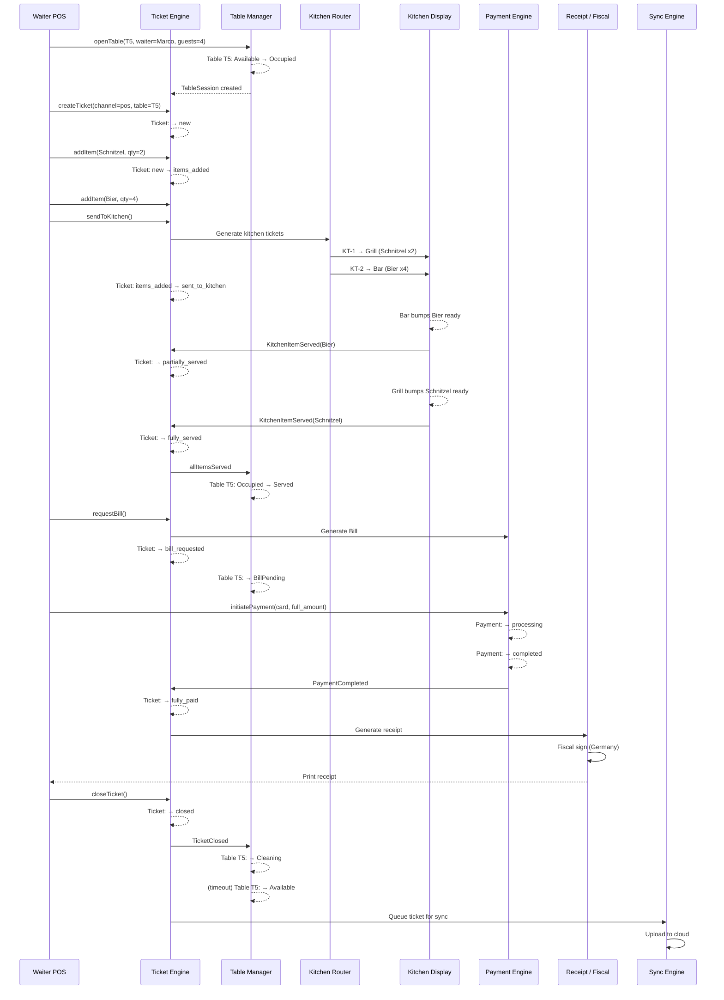

### 12.2 Split Bill Flow

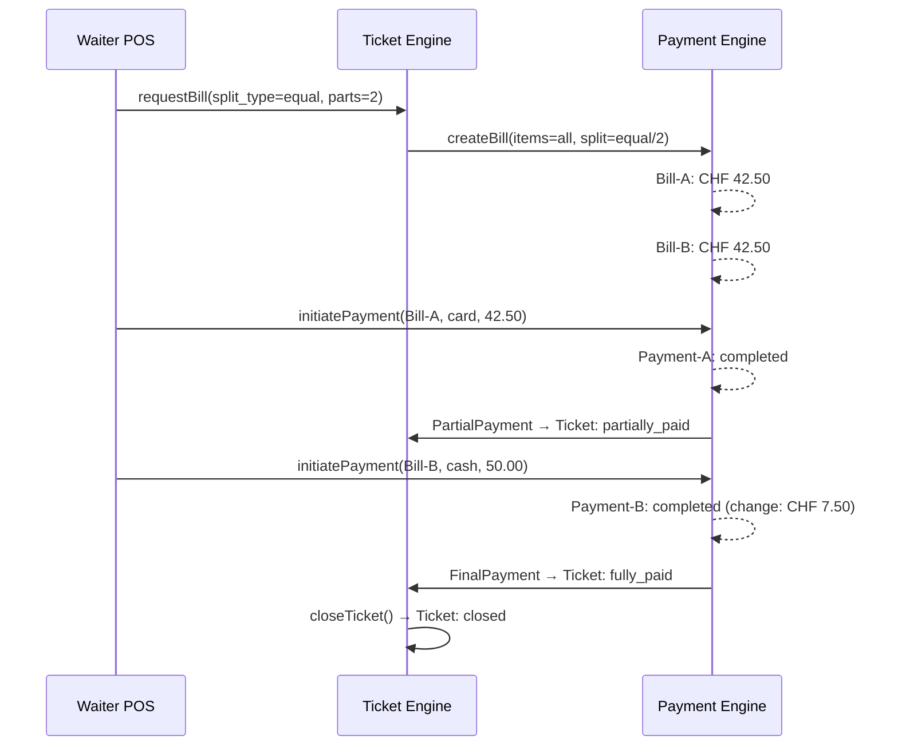

---

## 13. State Machine Implementation Guidelines

### 13.1 Code Pattern

All state machines should follow this pattern:

1. **State is stored as a TEXT enum field** on the entity
2. **Transition validation** happens in the domain layer (not the database)
3. **Every transition emits a domain event** that is appended to the event log
4. **Side effects** are triggered by event handlers, not inline in the transition
5. **Guards** are pure functions that evaluate preconditions
6. **Invalid transitions throw a domain error** with the current state and attempted transition

### 13.2 Concurrency Control

| Pattern | Usage |
|---------|-------|
| Optimistic locking (`version` field) | All mutable entities (Ticket, Table, Shift) |
| Compare-and-swap on status | State transitions check current status before applying |
| Event sequence numbers | Ticket events have monotonic sequence; reject out-of-order |
| Single-writer per aggregate | Only the owning device modifies a Ticket; others must request via message |

### 13.3 Error Recovery Principles

| Principle | Description |
|-----------|-------------|
| **Never lose data** | Failed transitions leave the entity in its previous state. Events for failed transitions are not written. |
| **Idempotent transitions** | Applying the same transition twice to the same state produces the same result (for sync replay). |
| **Compensating actions** | For cross-aggregate failures, use compensating events (e.g., if receipt generation fails after payment, the payment is still valid; receipt can be retried). |
| **Manual override** | Every "stuck" state has a manager override path to force-transition with a documented reason. |
| **Reconciliation jobs** | Background jobs periodically check for entities in inconsistent states and attempt automatic recovery or alert. |
