# Germany Fiscal Pack

> **Document Status:** Living document | **Last Updated:** 2026-03-20 | **Owner:** Architecture Team

---

## Table of Contents

1. [Regulatory Overview](#1-regulatory-overview)
2. [Fiskaly SIGN DE v2 Integration](#2-fiskaly-sign-de-v2-integration)
3. [Offline Order + Online Fiscal Finalization](#3-offline-order--online-fiscal-finalization)
4. [Table-Based Restaurant Specifics](#4-table-based-restaurant-specifics)
5. [Receipt Requirements](#5-receipt-requirements)
6. [DSFinV-K Export](#6-dsfinv-k-export)
7. [Hardware TSE Fallback (Future)](#7-hardware-tse-fallback-future)
8. [Error Handling](#8-error-handling)

---

## 1. Regulatory Overview

### 1.1 KassenSichV (Kassensicherungsverordnung)

The KassenSichV is the German Cash Register Security Ordinance, effective since January 1, 2020. It mandates that every electronic cash register system (Kassensystem) in Germany must:

- Record each transaction in an unalterable, tamper-proof manner.
- Use a certified Technical Security System (TSE) to cryptographically sign each transaction.
- Store all transaction data in a standardized digital format (DSFinV-K) for tax audit purposes.
- Issue a receipt for every transaction (Belegausgabepflicht).

**Scope:** Applies to all electronic recording systems used to record business transactions. This includes POS systems, self-service kiosks, and any software-based cash register.

**Penalties:** Failure to comply can result in fines of up to EUR 25,000 per violation. During a tax audit (Kassennachschau), auditors can appear unannounced and request immediate access to transaction data and TSE logs.

### 1.2 TSE (Technische Sicherheitseinrichtung)

The TSE is a certified security module that provides three core functions:

| Function | Purpose |
|----------|---------|
| **Security Module** | Generates cryptographic signatures for each transaction |
| **Storage Medium** | Retains a tamper-proof log of all signed transactions |
| **Unified Digital Interface** | Provides a standardized API for interacting with the TSE |

Every transaction must be signed by the TSE, which produces:

- A transaction number (monotonically increasing)
- A signature counter (monotonically increasing)
- Start and finish timestamps
- A cryptographic signature
- The serial number of the TSE certificate

### 1.3 Cloud TSE vs Hardware TSE

| Aspect | Cloud TSE | Hardware TSE |
|--------|-----------|--------------|
| **Form factor** | API service (SaaS) | USB stick, SD card, microSD |
| **Connectivity** | Requires internet to sign | Works fully offline |
| **Latency** | Network-dependent (~100-300ms) | Local (~5-20ms) |
| **Certification** | BSI-certified (e.g., Fiskaly, Deutsche Fiskal) | BSI-certified (e.g., Swissbit, Epson) |
| **Cost model** | Per-transaction or monthly subscription | One-time hardware purchase |
| **Scalability** | Easy (no hardware per terminal) | One TSE per terminal (or shared via network) |
| **Failure mode** | API outage = cannot sign | Hardware failure = cannot sign |
| **Our primary choice** | **Yes (Fiskaly SIGN DE v2)** | Future fallback (see Section 7) |

**Design decision:** We use Fiskaly Cloud TSE as the primary TSE because:
1. No hardware logistics per restaurant.
2. Simpler provisioning (API keys vs physical installation).
3. Fiskaly handles TSE certificate lifecycle management.
4. Our architecture already requires cloud connectivity for sync -- the fiscal signing piggybacks on the same connection.
5. The offline-first pattern (Section 3) mitigates the cloud dependency.

### 1.4 DSFinV-K (Digitale Schnittstelle der Finanzverwaltung fur Kassensysteme)

DSFinV-K is the standardized digital interface format that tax auditors use to examine POS transaction data. It defines:

- A CSV-based export format with a fixed schema.
- Mandatory fields and relationships between files.
- How individual transactions, payment methods, tax rates, and receipt data must be represented.
- The export must be producible on demand during a tax audit (Kassennachschau).

The export is generated per **Kassenabschluss** (cash register closing / Z-report), typically once per day or per shift.

See Section 6 for detailed export format specification.

### 1.5 Belegausgabepflicht (Receipt Obligation)

Since January 1, 2020, a receipt must be issued for every transaction. Key rules:

- Receipt can be paper or electronic (email, app display).
- Customer does not have to accept it, but it must be offered/created.
- Receipt must contain all TSE-related data (see Section 5).
- Exemption is possible via application to the Finanzamt, but is rarely granted for restaurants.

---

## 2. Fiskaly SIGN DE v2 Integration

### 2.1 Architecture Overview

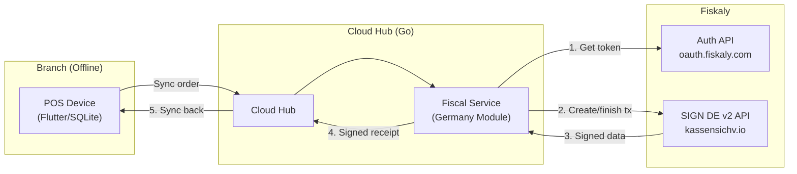

**Key principle:** The POS device never communicates directly with Fiskaly. All fiscal operations go through the Cloud Hub. This:

- Centralizes API credentials management.
- Allows the device to work offline and defer signing.
- Simplifies certificate and TSS lifecycle management.
- Enables audit logging at the cloud level.

### 2.2 Fiskaly Key Concepts

| Concept | Description | Our Mapping |
|---------|-------------|-------------|
| **Organization** | Top-level Fiskaly account | One per tenant (restaurant company) |
| **TSS** (Technical Security System) | Virtual TSE instance | One per branch/location |
| **Client** | A registered POS client within a TSS | One per POS device |
| **Transaction** | A signed fiscal transaction | One per payment event (ticket finalization) |
| **Allocation Group** | Logical grouping for transactions | One per restaurant table |

### 2.3 Provisioning Flow

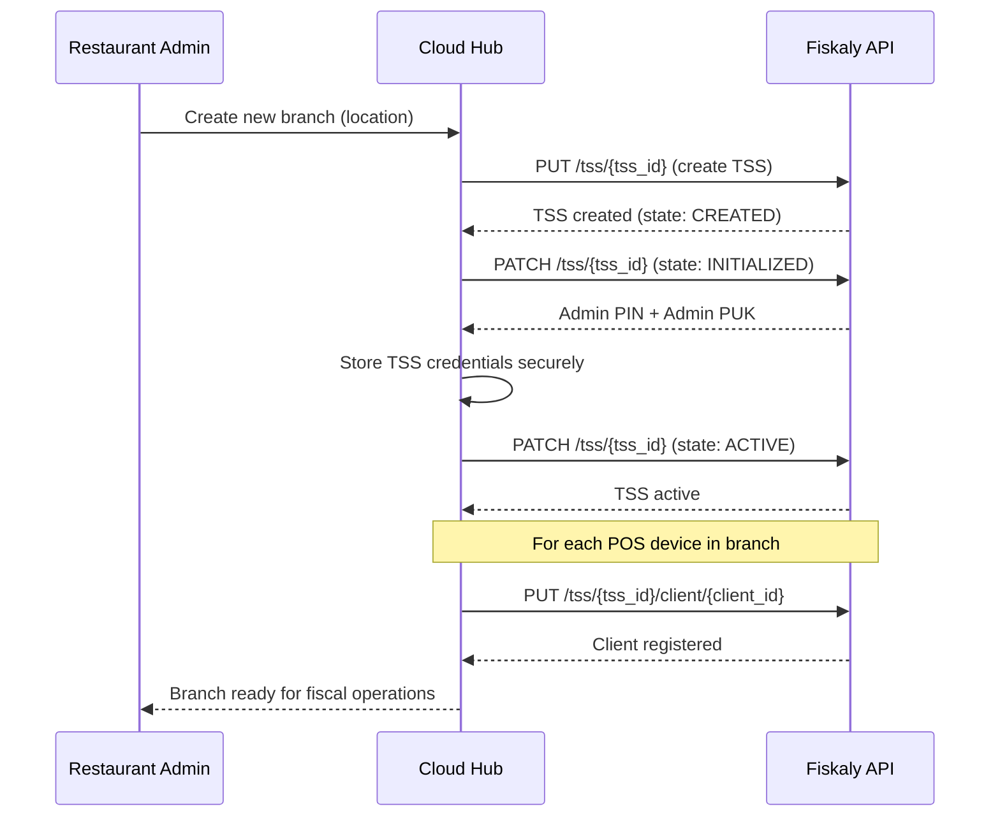

### 2.4 Authentication

Fiskaly uses OAuth2 client credentials flow:

| Parameter | Description |
|-----------|-------------|
| **API Key** | Identifies the Fiskaly account (per organization) |
| **API Secret** | Secret for token generation |
| **Token endpoint** | `POST https://oauth.fiskaly.com/token` |
| **Token lifetime** | Short-lived (~15 minutes) |
| **Token caching** | Cloud Hub caches token and refreshes before expiry |

The Cloud Hub maintains a token cache per organization. All requests to Fiskaly include the Bearer token in the Authorization header.

### 2.5 Transaction Lifecycle

Every fiscal transaction follows a strict three-step lifecycle:

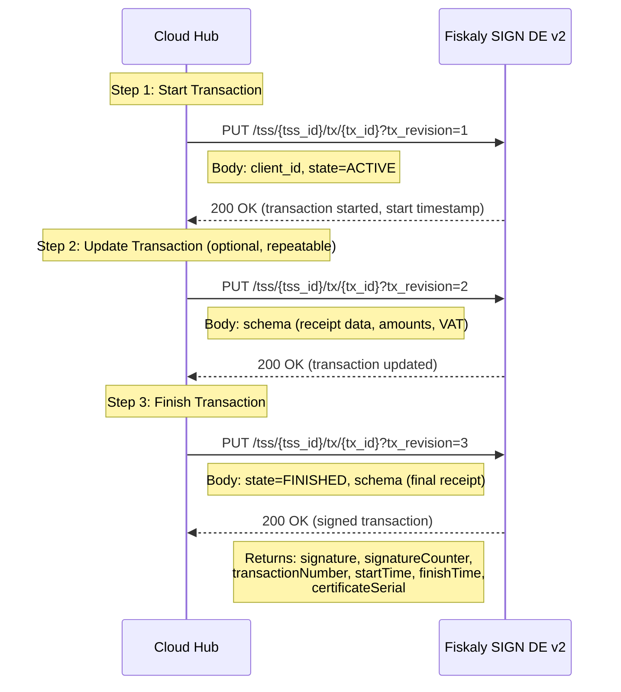

**Critical rules:**
- `tx_id` is generated by our system (UUID v4) for idempotency.
- `tx_revision` increments with each request for the same transaction.
- A transaction that is started MUST be finished (even if voided).
- The final `FINISHED` state triggers the cryptographic signature.

### 2.6 Transaction Schema (Receipt Data)

The Fiskaly transaction schema follows the DSFinV-K format. The key fields sent in the `schema` object:

```
schema:
  standard_v1:
    receipt:
      receipt_type: RECEIPT | TRAINING | CANCELLED
      amounts_per_vat_rate:
        - vat_rate: NORMAL (19%)    # or REDUCED (7%), SPECIAL_1, etc.
          amount: "12.50"           # gross amount as string
      amounts_per_payment_type:
        - payment_type: CASH | NON_CASH
          amount: "12.50"
          currency_code: "EUR"
```

**VAT rate mapping (Germany):**

| Fiskaly VAT Rate | Rate | Applies To |
|-----------------|------|------------|
| `NORMAL` | 19% | Most goods and services, alcoholic beverages |
| `REDUCED` | 7% | Food (dine-in and takeaway), non-alcoholic beverages, books |
| `SPECIAL_RATE_1` | 10.7% | Agriculture (rarely used in POS) |
| `SPECIAL_RATE_2` | 5.5% | Agriculture (rarely used in POS) |
| `NULL` | 0% | Tax-exempt |

**Note on German restaurant VAT:** Unlike Switzerland, Germany applies the reduced rate (7%) to food regardless of dine-in or takeaway. The standard rate (19%) applies to beverages (both alcoholic and non-alcoholic when served in a restaurant context). This was made permanent after the COVID-era temporary reduction.

### 2.7 Allocation Groups

Allocation groups in Fiskaly map to restaurant tables. They provide:

- Logical grouping of transactions by physical location.
- Auditability: the tax office can trace which table generated which transactions.
- No fiscal impact -- purely informational for auditors.

**Mapping:**

| POS Concept | Fiskaly Allocation Group |
|-------------|------------------------|
| Table 1 | `table_1` |
| Table 2 | `table_2` |
| Takeaway orders | `takeaway` |
| Bar orders | `bar` |
| Delivery orders | `delivery_{platform}` |

---

## 3. Offline Order + Online Fiscal Finalization

This is the core pattern that reconciles offline-first operations with mandatory cloud TSE signing.

### 3.1 Principle

> **Orders are created and served offline. Fiscal signing happens online, asynchronously. The receipt is completed when signing finishes.**

This means:
- The restaurant never stops operating due to fiscal signing issues.
- Fiscal compliance is achieved through eventual consistency, not synchronous blocking.
- A grace period is tolerated -- the transaction must be signed, but a delay of minutes to hours is acceptable under German law as long as the intent to sign is documented.

### 3.2 Main Flow

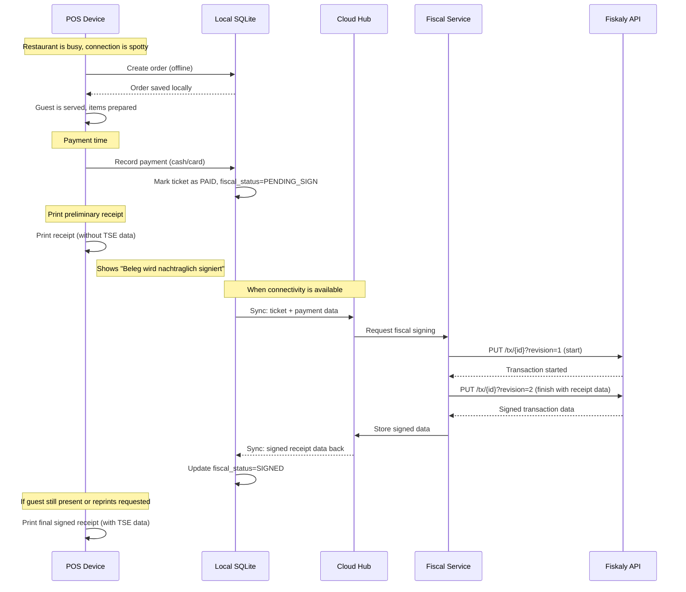

### 3.3 Fiscal Status State Machine

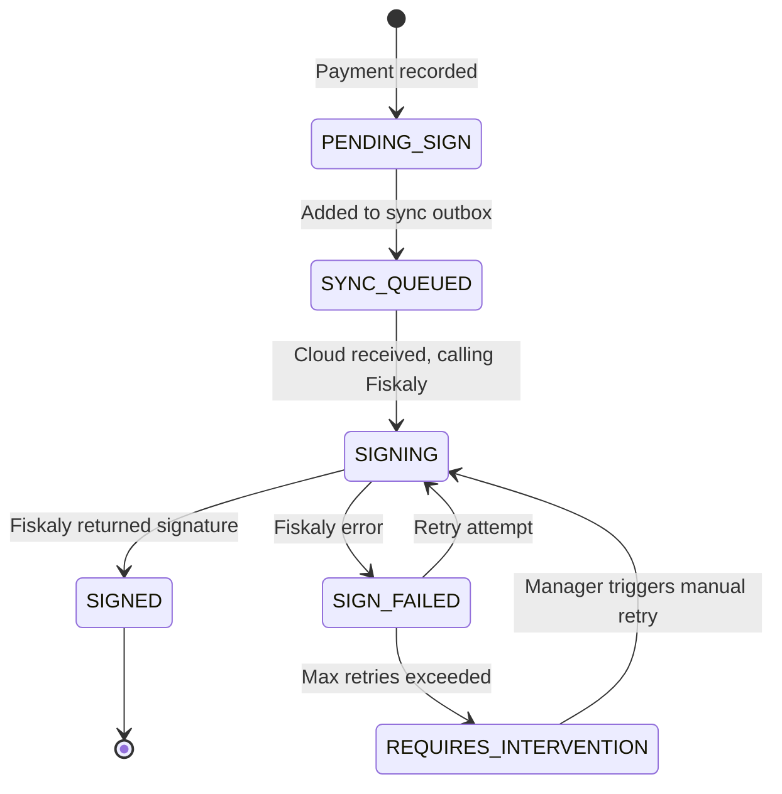

### 3.4 Failure Scenarios and Recovery

| Failure | Detection | Recovery | Max Duration |
|---------|-----------|----------|-------------|
| Device has no connectivity | Sync outbox grows | Automatic retry when online | Until device reconnects |
| Cloud Hub receives order but Fiskaly is down | HTTP 5xx from Fiskaly | Exponential backoff retry (1s, 2s, 4s, 8s... max 5min) | 24 hours |
| Transaction start succeeds but finish fails | Partial transaction state | Retry finish with same tx_id and next revision | 24 hours |
| Fiskaly returns 4xx (bad request) | Client error | Log error, alert admin, do not retry automatically | Requires fix + manual retry |
| TSS is disabled/expired | Fiskaly 403 | Alert admin, queue all transactions, provision new TSS | Requires admin action |
| Network timeout (no response) | Timeout exceeded | Check transaction status via GET before retrying | Per retry policy |

### 3.5 Retry Strategy

```
Retry policy:
  initial_delay:    1 second
  multiplier:       2
  max_delay:        5 minutes
  max_retries:      50 (covers ~24 hours of retries)
  jitter:           +/- 20% random
  idempotency:      same tx_id, incremented tx_revision

Before each retry:
  1. GET /tss/{tss_id}/tx/{tx_id} to check current state
  2. If already FINISHED -> mark as SIGNED, stop retrying
  3. If ACTIVE -> send finish request
  4. If not found -> start from beginning
```

### 3.6 Manager Intervention Flow

When automatic retries are exhausted (REQUIRES_INTERVENTION state):

1. Admin dashboard shows alert: "N transactions pending fiscal signing."
2. Manager can:
   - **Retry** -- triggers immediate signing attempt.
   - **Inspect** -- view the transaction details and error history.
   - **Escalate** -- contact support (provides error codes and transaction IDs).
3. All intervention actions are audit-logged with manager identity and timestamp.

### 3.7 Grace Period and Audit Trail

German law does not specify an exact maximum delay for TSE signing, but the intent is for signing to happen at the time of the transaction. Our approach:

| Time Since Payment | Status | Action |
|-------------------|--------|--------|
| 0 - 5 minutes | Normal | Automatic retry in progress |
| 5 - 60 minutes | Warning | Dashboard amber alert |
| 1 - 24 hours | Critical | Dashboard red alert, email notification to admin |
| > 24 hours | Overdue | Daily email escalation, transaction flagged in audit log |

**Audit trail for every pending transaction:**

| Field | Description |
|-------|-------------|
| `ticket_id` | Original POS ticket identifier |
| `fiscal_status` | Current state (PENDING_SIGN, SIGNING, etc.) |
| `created_at` | When the payment was recorded (device local time) |
| `first_sync_at` | When the order first reached the cloud |
| `last_attempt_at` | Last signing attempt timestamp |
| `attempt_count` | Number of signing attempts |
| `last_error` | Most recent error message/code |
| `signed_at` | When signing succeeded (null if pending) |
| `delay_reason` | Categorized reason (OFFLINE, API_ERROR, TSS_ISSUE) |

---

## 4. Table-Based Restaurant Specifics

### 4.1 Order (Ticket) to Transaction Mapping

The fundamental mapping rule:

> **One payment event = one Fiskaly transaction.**

This is not the same as "one order = one transaction." In a restaurant context:

| Scenario | Orders | Payments | Fiskaly Transactions |
|----------|--------|----------|---------------------|
| Simple table (1 bill) | 1 | 1 | 1 |
| Split bill (3 ways) | 1 | 3 | 3 |
| Merged tables (2 orders, 1 bill) | 2 | 1 | 1 |
| Partial payment (pay some items now) | 1 | 2+ | 2+ |

### 4.2 Split Bill

When a table splits the bill, each split produces a separate Fiskaly transaction:

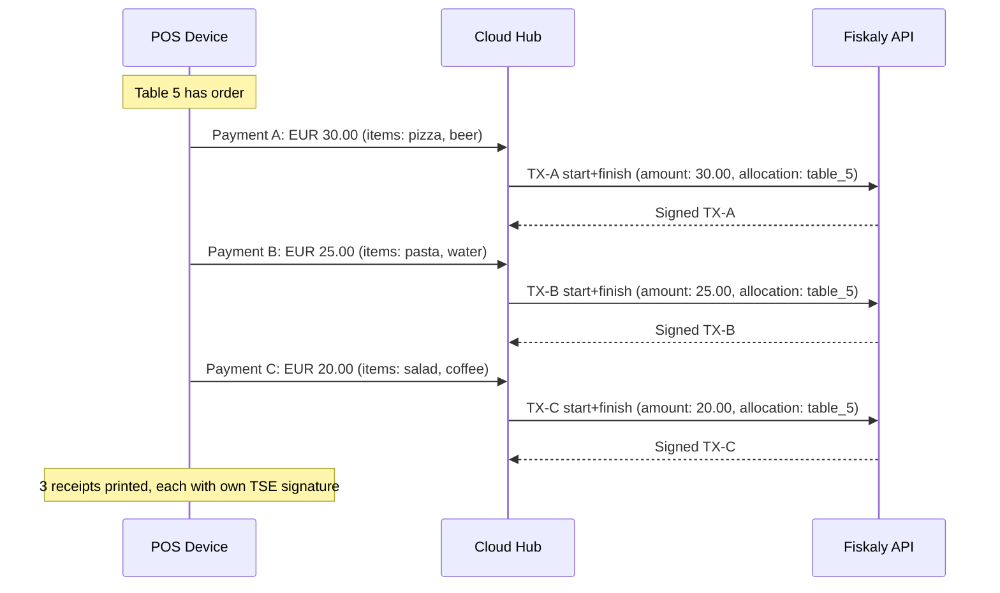

**Key rule:** Each split bill receipt is a self-contained fiscal transaction with its own items, amounts, and TSE signature.

### 4.3 Merge Tables

When two tables are merged into one for payment:

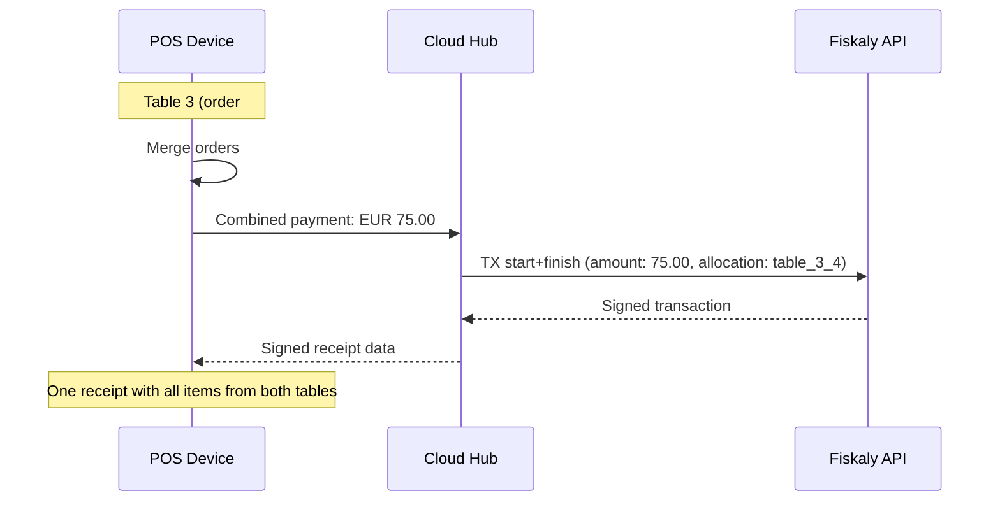

**Allocation group for merged tables:** Concatenate table identifiers (e.g., `table_3_4`). This preserves auditability -- the auditor can see which tables were involved.

### 4.4 Table Transfer

When an order moves from one table to another:

- The Fiskaly transaction has not been started yet (it starts at payment time in our model).
- The POS simply updates the ticket's table assignment.
- When payment occurs, the allocation group reflects the final table.
- No fiscal action is needed at transfer time.

### 4.5 Void Items

Voiding items before payment:

- Items are removed from the ticket.
- No fiscal impact -- the transaction has not been started.
- Void is logged in the POS audit trail.

Voiding after payment (refund):

- A new Fiskaly transaction is created with `receipt_type: CANCELLED`.
- The cancellation transaction references the original transaction.
- Negative amounts in the receipt schema.
- A cancellation receipt is printed with its own TSE signature.

### 4.6 Discounts

Discounts are represented in the fiscal transaction as reduced item prices or separate line items:

| Discount Type | Fiscal Treatment |
|--------------|-----------------|
| Percentage discount on item | Reduce item gross amount, VAT calculated on discounted amount |
| Fixed amount discount on item | Reduce item gross amount, VAT calculated on discounted amount |
| Percentage discount on total | Distribute proportionally across VAT rate groups |
| Happy hour pricing | Item priced at reduced price -- no separate discount line |
| Complimentary item | Item at EUR 0.00, still listed on receipt |
| Staff meal | Item at EUR 0.00, marked as staff meal in POS (for DSFinV-K) |

**Important:** The total `amounts_per_vat_rate` in the Fiskaly transaction schema must reflect the actual amounts collected, after all discounts.

---

## 5. Receipt Requirements

### 5.1 Mandatory Fields (KassenSichV)

Every receipt must contain:

| # | Field | Source | Example |
|---|-------|--------|---------|
| 1 | **Company name** | Tenant config | Pizzeria Bella Vista |
| 2 | **Company address** | Tenant config | Hauptstr. 12, 10115 Berlin |
| 3 | **Tax ID** (Steuernummer or USt-IdNr) | Tenant config | DE123456789 |
| 4 | **Receipt date and time** | Transaction finish time | 2026-03-20 19:45:23 |
| 5 | **Item list** (description, qty, price) | Ticket data | 1x Margherita EUR 12.50 |
| 6 | **Total amount** | Calculated | EUR 45.80 |
| 7 | **Payment method** | Payment record | Bar (Cash) / EC-Karte (Card) |
| 8 | **Tax breakdown** (net, tax, gross per rate) | Calculated | 19%: net 38.49, tax 7.31 |
| 9 | **TSE serial number** | Fiskaly response | abc123def456... |
| 10 | **Transaction number** | Fiskaly response | 42 |
| 11 | **Signature counter** | Fiskaly response | 1337 |
| 12 | **Start timestamp** | Fiskaly response | 2026-03-20T19:45:20Z |
| 13 | **Finish timestamp** | Fiskaly response | 2026-03-20T19:45:23Z |
| 14 | **Signature value** | Fiskaly response (base64) | a1b2c3d4e5f6... |
| 15 | **Certificate serial number** | Fiskaly TSS config | 0x1234ABCD... |

### 5.2 Receipt Layout

```
======================================
       PIZZERIA BELLA VISTA
       Hauptstr. 12
       10115 Berlin
       USt-IdNr: DE123456789
======================================
Datum: 20.03.2026  19:45
Tisch: 5            Bedienung: Max M.
--------------------------------------
 1x Margherita             EUR  12,50
 1x Pasta Carbonara        EUR  14,80
 2x Bier 0,5l              EUR  11,00
 1x Tiramisu                EUR   7,50
--------------------------------------
Zwischensumme              EUR  45,80
  davon MwSt 19%:  EUR 7,31
  davon MwSt 7%:   EUR 2,29
--------------------------------------
GESAMT                     EUR  45,80
Bezahlt: Bar               EUR  50,00
Ruckgeld                   EUR   4,20
======================================
TSE-Seriennr: abc123def456...
TSE-Transaktionsnr: 42
TSE-Signaturzahler: 1337
TSE-Start: 2026-03-20T19:45:20
TSE-Ende:  2026-03-20T19:45:23
TSE-Signatur:
a1b2c3d4e5f6g7h8i9j0...
Zertifikat-Serial: 0x1234ABCD

[QR CODE - optional]
======================================
     Vielen Dank fur Ihren Besuch!
======================================
```

### 5.3 Pending Fiscal Receipt

When the transaction has not yet been signed (device is offline or signing is delayed):

```
======================================
       PIZZERIA BELLA VISTA
       [... normal header and items ...]
======================================
GESAMT                     EUR  45,80
Bezahlt: Bar               EUR  50,00
Ruckgeld                   EUR   4,20
======================================
*** TSE-SIGNATUR AUSSTEHEND ***
Beleg wird nachtraglich signiert.
Beleg-ID: TKT-2026-0320-001234
Erstellzeit: 2026-03-20T19:45:23
======================================
     Vielen Dank fur Ihren Besuch!
======================================
```

**The pending receipt includes:**
- A clear notice: "TSE-SIGNATUR AUSSTEHEND" (TSE signature pending).
- The explanation: "Beleg wird nachtraglich signiert" (receipt will be signed subsequently).
- A unique ticket ID for traceability.
- The device-local creation timestamp.

**The customer can request a signed copy later.** The POS stores the mapping between ticket ID and eventual Fiskaly transaction, enabling reprints once signing completes.

### 5.4 QR Code on Receipt

A QR code on the receipt is optional but recommended for future-proofing. The QR code encodes:

| Field | Content |
|-------|---------|
| Version | `V0` |
| Cash register type | `Kasse` |
| Cash register serial | Device UUID |
| Transaction number | Fiskaly transaction number |
| Signature counter | Fiskaly signature counter |
| Start timestamp | ISO 8601 |
| Finish timestamp | ISO 8601 |
| Signature | Base64-encoded |
| Public key | From TSS certificate |

Format: Fields separated by semicolons, encoded as a QR code (error correction level M).

---

## 6. DSFinV-K Export

### 6.1 Overview

DSFinV-K (Digitale Schnittstelle der Finanzverwaltung fur Kassensysteme) is the standardized export format that must be produced on demand for tax auditors. It represents a complete, auditable record of all cash register transactions.

### 6.2 Export Trigger

The export is generated per **Kassenabschluss** (cash register closing), which in our system corresponds to a shift close or Z-report. The export can also be generated on demand for a date range during a tax audit.

### 6.3 File Structure

A DSFinV-K export is a directory containing the following files:

| File | Description | Content |
|------|-------------|---------|
| `index.xml` | Master index file | Metadata, date range, POS identification |
| `cashpointclosing.csv` | Cash register closings | Z-report summaries per shift |
| `transactions.csv` | Individual transactions | One row per fiscal transaction |
| `transactions_tse.csv` | TSE data per transaction | Signature, counter, timestamps |
| `transactions_vat.csv` | VAT breakdown per transaction | Amount per VAT rate per transaction |
| `lines.csv` | Line items | Individual items sold per transaction |
| `lines_vat.csv` | VAT per line item | Tax details per item line |
| `payment.csv` | Payment methods | Payment type and amount per transaction |
| `allocation_groups.csv` | Allocation groups | Table/location assignments |
| `datapayment.csv` | Payment type master data | Definition of payment types used |
| `vat.csv` | VAT master data | VAT rates and accounts |
| `location.csv` | Location data | Branch address and identification |
| `cashregister.csv` | Cash register master data | Device identification |
| `slaves.csv` | Slave registers | Sub-devices (if applicable) |

### 6.4 Data Mapping

| DSFinV-K Field | POS Source |
|----------------|-----------|
| `Z_KASSE_ID` | Device UUID |
| `Z_ERSTELLUNG` | Shift close timestamp |
| `Z_NR` | Shift number (sequential per device) |
| `BON_ID` | Ticket UUID |
| `BON_NR` | Ticket number (sequential) |
| `BON_TYP` | `Beleg` (standard), `Storno` (void), `Training` |
| `BON_NAME` | Receipt description |
| `TERMINAL_ID` | Device UUID |
| `BON_STORNO` | `0` (normal) or `1` (cancelled) |
| `UST_SCHLUESSEL` | `1` (19%), `2` (7%), `3` (10.7%), `4` (5.5%), `5` (0%) |
| `BON_BRUTTO` | Gross total amount |
| `BON_NETTO` | Net total amount |
| `BON_UST` | Tax amount |
| `ZAHLART_TYP` | `Bar` (cash), `Unbar` (non-cash) |
| `ZAHLART_BETRAG` | Payment amount |
| `TSE_SERIAL` | TSE serial number from Fiskaly |
| `TSE_SIGNATUR` | Transaction signature |
| `TSE_SIG_ZAEHLER` | Signature counter |
| `TSE_TANR` | Transaction number |
| `TSE_TA_START` | Transaction start timestamp |
| `TSE_TA_ENDE` | Transaction end timestamp |

### 6.5 Export Generation Process

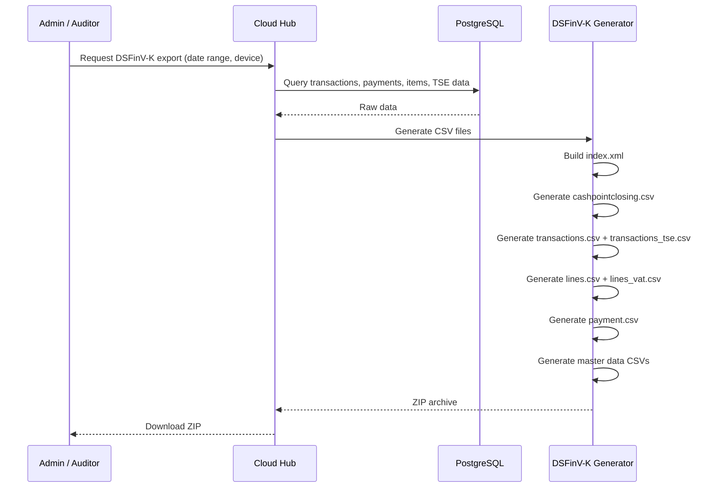

### 6.6 Archive Requirements

- **Retention period:** 10 years from end of calendar year.
- **Format:** The export files must be reproducible from stored data at any time during the retention period.
- **Storage:** Cloud Hub stores all raw transaction data and TSE responses permanently (soft-delete only).
- **Immutability:** Once a transaction is signed and the shift is closed, the underlying data must not be modified. Corrections are made via new cancellation/correction transactions.

---

## 7. Hardware TSE Fallback (Future)

### 7.1 When Cloud TSE Is Insufficient

Hardware TSE becomes necessary when:

- **Regulatory change:** If Germany mandates hardware TSE or restricts cloud TSE certification.
- **Persistent offline operation:** A location with no internet connectivity at all (e.g., festival stand in a field).
- **Customer preference:** Some restaurant owners prefer on-premise security devices.
- **Cloud TSE provider failure:** Extended outage of Fiskaly or change in service terms.

### 7.2 Hardware TSE Options

| Vendor | Form Factor | Interface | Notes |
|--------|------------|-----------|-------|
| **Swissbit** | microSD, USB | Serial/USB | Most common in German market |
| **Epson** | Built into printer | USB (printer) | TSE integrated in receipt printer |
| **Diebold Nixdorf** | USB dongle | USB | Enterprise-focused |

### 7.3 Integration Architecture

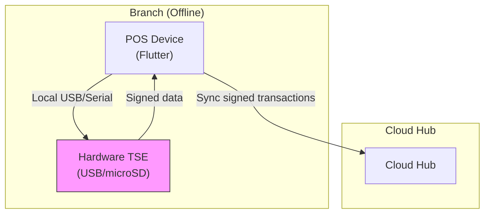

**Key differences from cloud TSE:**

| Aspect | Cloud TSE (Fiskaly) | Hardware TSE |
|--------|-------------------|--------------|
| Signing location | Cloud Hub | POS Device (local) |
| Signing timing | After sync | At payment time (immediate) |
| Receipt at payment | Pending until signed | Immediately signed |
| Device requirement | None | USB OTG support on tablet |
| Driver | None (REST API) | Vendor SDK / serial protocol |

### 7.4 Priority and Fallback Logic

```
Fiscal signing priority:
  1. Cloud TSE (Fiskaly) -- default
  2. Hardware TSE (local) -- fallback
  3. Pending queue (neither available) -- last resort

Decision logic at payment time:
  IF hardware_tse.is_connected AND hardware_tse.is_healthy:
    sign_locally(transaction)
  ELSE:
    queue_for_cloud_signing(transaction)
```

### 7.5 Implementation Timeline

Hardware TSE is **not in scope for MVP**. It is planned for a future release when:
- At least 10 German customers are active.
- Market feedback confirms demand.
- Fiskaly dependency needs mitigation.

---

## 8. Error Handling

### 8.1 Error Classification

| Error Category | HTTP Code | Retryable | Action |
|---------------|-----------|-----------|--------|
| **Network timeout** | N/A | Yes | Check tx status, then retry |
| **Fiskaly 5xx** (server error) | 500-599 | Yes | Exponential backoff retry |
| **Fiskaly 429** (rate limited) | 429 | Yes | Respect Retry-After header |
| **Fiskaly 401** (unauthorized) | 401 | Yes (after re-auth) | Refresh bearer token, retry |
| **Fiskaly 400** (bad request) | 400 | No | Log, alert admin, fix data |
| **Fiskaly 404** (not found) | 404 | Depends | TSS/client not found: re-provision |
| **Fiskaly 409** (conflict) | 409 | Yes (with correction) | Wrong tx_revision: fetch current state |
| **TSS disabled** | 403 | No | Alert admin, queue transactions |
| **Certificate expired** | 403 | No | Alert admin, renew TSS |

### 8.2 Error Handling Flows

**Fiskaly API Down (5xx errors):**

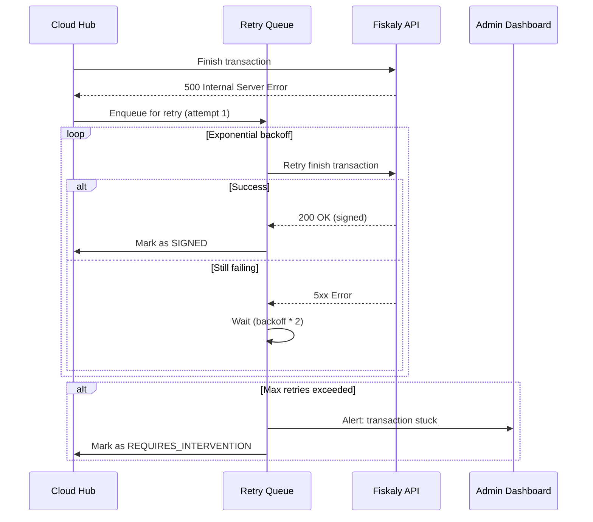

**Transaction Start Fails:**

1. Create a pending record in the database with `fiscal_status = SIGN_FAILED`.
2. Store the complete ticket data needed for signing.
3. Enqueue for retry.
4. The pending record ensures no transaction is lost even if the service crashes.

**Transaction Finish Fails (Start Succeeded):**

1. The transaction exists in Fiskaly in ACTIVE state.
2. Retry the finish request with the **same `tx_id`** and the **next `tx_revision`**.
3. Fiskaly guarantees idempotent finish if the same data is sent.
4. If unsure of current state, GET the transaction first to determine the correct revision.

**Network Timeout (Unknown State):**

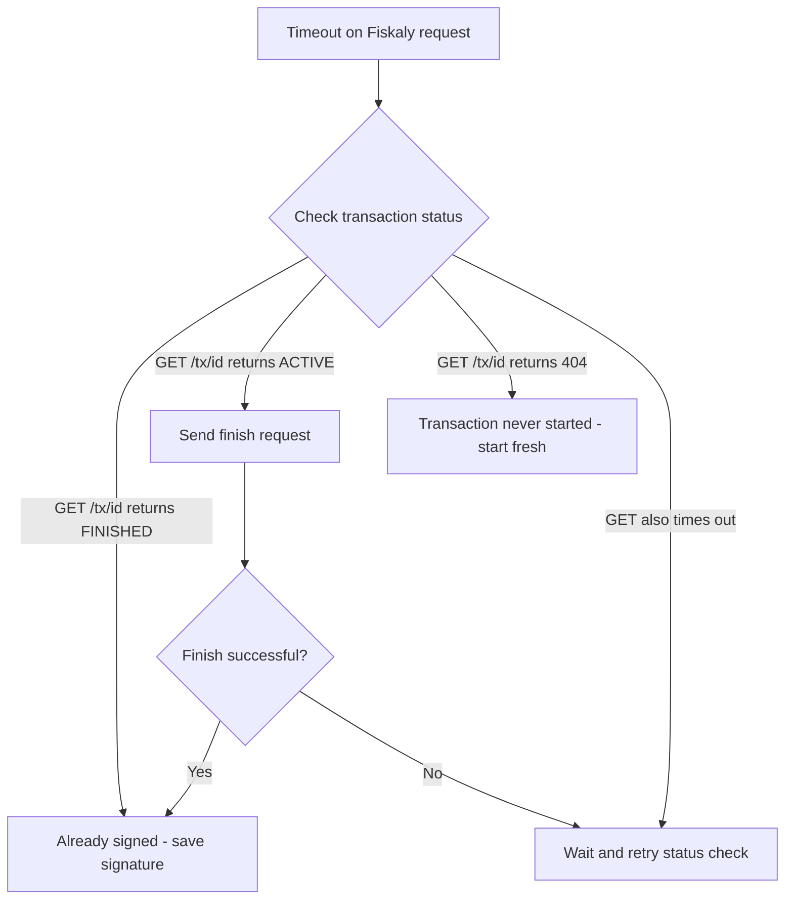

**Certificate Expired:**

- Fiskaly TSS certificates have a limited validity period.
- The Cloud Hub monitors certificate expiry dates (stored from TSS metadata).
- Alert is sent to admin 30 days before expiry.
- Admin must initiate TSS renewal via the admin dashboard.
- During renewal, transactions are queued.
- After renewal, queued transactions are processed with the new TSS.

**TSS Disabled (Emergency):**

If a TSS is disabled (by admin error, Fiskaly policy, or regulatory action):

1. All new transactions are queued with status `PENDING_SIGN`.
2. Admin dashboard shows emergency alert.
3. Options:
   - Re-enable the existing TSS (if possible).
   - Provision a new TSS and re-register all clients.
   - Switch to hardware TSE fallback (if available).
4. Once a TSS is available, process the backlog in FIFO order.
5. All queued transactions retain their original timestamps for auditability.

### 8.3 Monitoring and Alerting

| Metric | Warning Threshold | Critical Threshold |
|--------|------------------|--------------------|
| Pending fiscal transactions | > 10 | > 50 |
| Oldest unsigned transaction age | > 15 minutes | > 1 hour |
| Fiskaly API error rate | > 5% of requests | > 20% of requests |
| Fiskaly API latency (p95) | > 500ms | > 2000ms |
| TSS certificate days to expiry | < 30 days | < 7 days |
| Failed signing attempts (last hour) | > 5 | > 20 |

---

## Appendix A: Fiskaly API Endpoints Reference

| Operation | Method | Endpoint |
|-----------|--------|----------|
| Authenticate | POST | `https://oauth.fiskaly.com/token` |
| Create TSS | PUT | `/tss/{tss_id}` |
| Update TSS state | PATCH | `/tss/{tss_id}` |
| Get TSS | GET | `/tss/{tss_id}` |
| Create Client | PUT | `/tss/{tss_id}/client/{client_id}` |
| Get Client | GET | `/tss/{tss_id}/client/{client_id}` |
| Upsert Transaction | PUT | `/tss/{tss_id}/tx/{tx_id}?tx_revision={n}` |
| Get Transaction | GET | `/tss/{tss_id}/tx/{tx_id}` |
| List Transactions | GET | `/tss/{tss_id}/tx` |
| Export | GET | `/tss/{tss_id}/export` |

Base URL: `https://kassensichv-middleware.fiskaly.com/api/v2`

## Appendix B: Glossary

| Term | German | Description |
|------|--------|-------------|
| TSE | Technische Sicherheitseinrichtung | Technical Security Equipment |
| KassenSichV | Kassensicherungsverordnung | Cash Register Security Ordinance |
| DSFinV-K | Digitale Schnittstelle der Finanzverwaltung fur Kassensysteme | Digital Interface of Financial Administration for Cash Register Systems |
| Kassennachschau | Kassennachschau | Unannounced cash register audit |
| Kassenabschluss | Kassenabschluss | Cash register closing (Z-report) |
| Belegausgabepflicht | Belegausgabepflicht | Receipt issuance obligation |
| Steuernummer | Steuernummer | Tax number |
| USt-IdNr | Umsatzsteuer-Identifikationsnummer | VAT identification number |
| MwSt | Mehrwertsteuer | Value Added Tax (VAT) |
| Bar | Bar | Cash |
| Unbar | Unbar | Non-cash |
