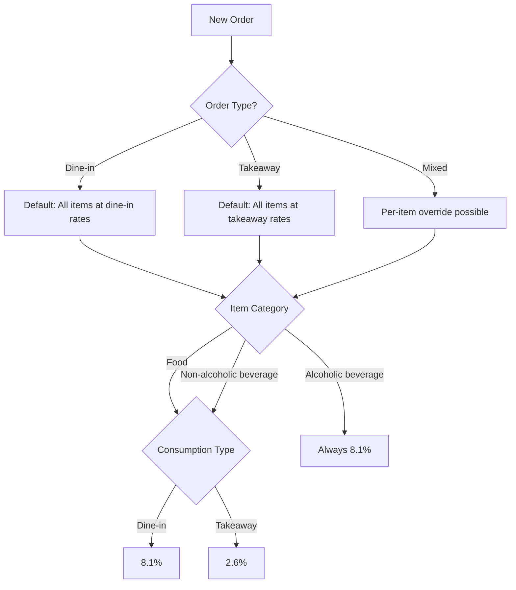
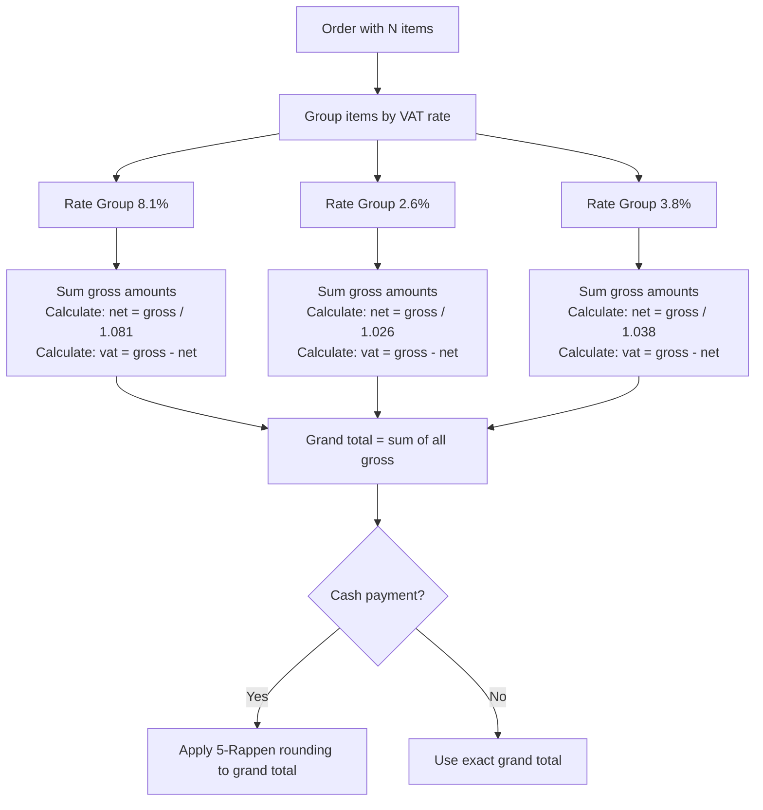
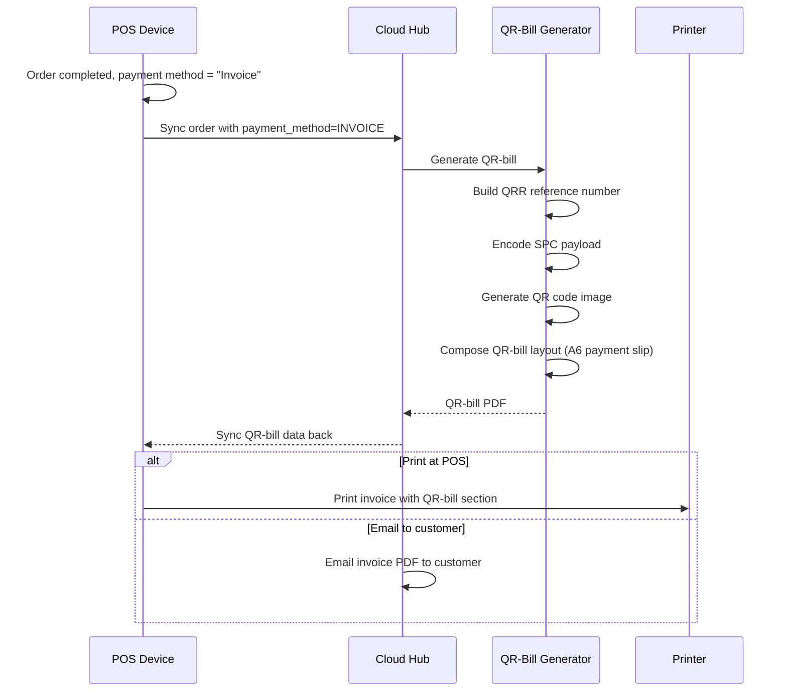
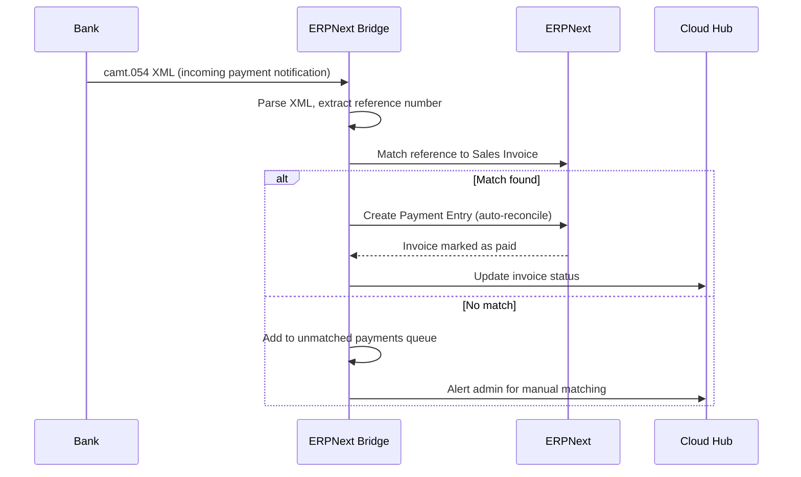
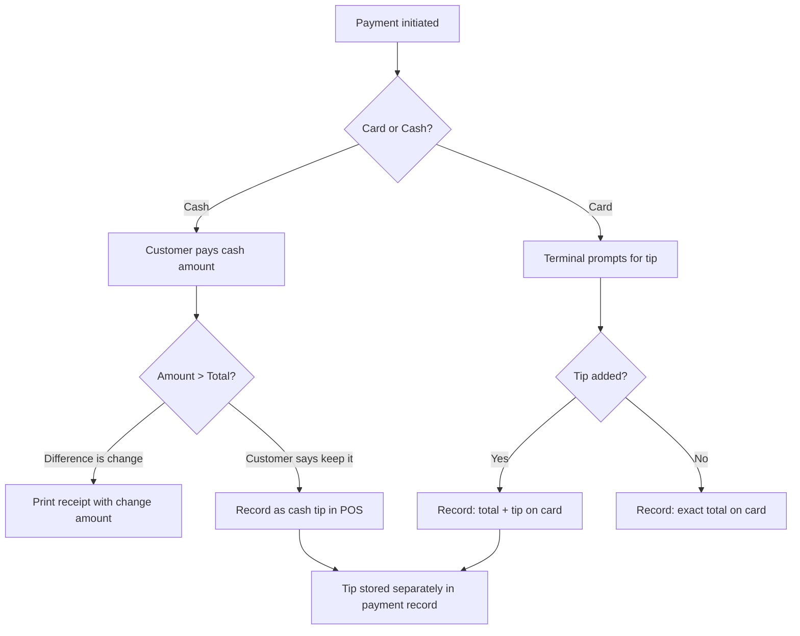

# Switzerland Pack

> **Document Status:** Living document | **Last Updated:** 2026-03-20 | **Owner:** Architecture Team

---

## Table of Contents

1. [VAT System](#1-vat-system)
2. [Tax Calculation Model](#2-tax-calculation-model)
3. [QR-Bill (QR-Rechnung)](#3-qr-bill-qr-rechnung)
4. [Banking Integration](#4-banking-integration)
5. [Invoice Requirements](#5-invoice-requirements)
6. [Retail / Market Mode Extension](#6-retail--market-mode-extension)
7. [Cash Handling](#7-cash-handling)

---

## 1. VAT System

### 1.1 Swiss VAT Rates (2024+)

Switzerland applies three VAT rates plus exemptions:

| Rate | Percentage | Applies To |
|------|-----------|------------|
| **Standard rate** | 8.1% | Most goods and services, alcoholic beverages, dine-in restaurant services |
| **Reduced rate** | 2.6% | Food products, non-alcoholic beverages (as goods), newspapers, medicines, books |
| **Special rate** | 3.8% | Accommodation / lodging services |
| **Exempt** | 0% | Healthcare, education, financial services, insurance, cultural events (limited) |

### 1.2 Dine-in vs Takeaway -- The Critical Distinction

This is the most important VAT rule for restaurant POS systems in Switzerland. The same product can be taxed at different rates depending on how it is consumed:

| Product | Dine-in | Takeaway |
|---------|---------|----------|
| Food (burger, pizza, sandwich) | **8.1%** (restaurant service) | **2.6%** (food supply) |
| Non-alcoholic beverages (water, juice, coffee) | **8.1%** (restaurant service) | **2.6%** (beverage supply) |
| Alcoholic beverages (beer, wine, spirits) | **8.1%** (always) | **8.1%** (always) |
| Tobacco products | **8.1%** | **8.1%** |

**Why this matters:** A coffee served in the restaurant is taxed at 8.1%, but the same coffee sold to-go is taxed at 2.6%. The POS must handle this distinction per item, per order.

### 1.3 POS Implementation Rules



**Data model approach:**

Each product in the system has:

| Field | Description | Example |
|-------|-------------|---------|
| `tax_category` | Base tax classification | `FOOD`, `NON_ALCO_BEV`, `ALCO_BEV`, `ACCOMMODATION` |
| `dine_in_vat_rate` | Rate applied when consumed on-premise | 8.1% |
| `takeaway_vat_rate` | Rate applied when taken away | 2.6% |
| `is_rate_fixed` | If true, same rate regardless of consumption type | true for alcohol |

**Order-level logic:**

1. Order has a default `consumption_type` (DINE_IN or TAKEAWAY).
2. Each line item inherits the order's consumption type by default.
3. Staff can override consumption type per individual item (mixed order scenario).
4. The applied VAT rate is resolved at the line-item level:

```
resolved_rate(item, consumption_type):
  IF item.is_rate_fixed:
    RETURN item.dine_in_vat_rate  // same for both
  ELSE IF consumption_type == DINE_IN:
    RETURN item.dine_in_vat_rate
  ELSE:
    RETURN item.takeaway_vat_rate
```

### 1.4 VAT Rate Configuration

The VAT rates are configured at the tenant level (per country) and can be updated when rates change:

| Config Key | Value | Description |
|-----------|-------|-------------|
| `ch.vat.standard` | 8.1 | Standard rate |
| `ch.vat.reduced` | 2.6 | Reduced rate |
| `ch.vat.special` | 3.8 | Accommodation rate |
| `ch.vat.exempt` | 0.0 | Exempt supplies |
| `ch.vat.effective_from` | 2024-01-01 | Date these rates became effective |

**Rate change handling:** When VAT rates change (as they did on 2024-01-01), the system stores the effective date. Historical transactions always use the rate that was active at the time of the transaction.

### 1.5 Mixed Orders Example

A family orders at a restaurant. Some items are for dine-in, one item is takeaway:

| Item | Qty | Unit Price | Consumption | VAT Rate | VAT Amount |
|------|-----|-----------|-------------|----------|------------|
| Margherita pizza | 1 | CHF 22.00 | Dine-in | 8.1% | CHF 1.65 |
| Pasta Carbonara | 1 | CHF 19.50 | Dine-in | 8.1% | CHF 1.46 |
| Cola 0.33l | 2 | CHF 4.50 | Dine-in | 8.1% | CHF 0.67 |
| Sandwich (to go) | 1 | CHF 12.00 | Takeaway | 2.6% | CHF 0.30 |
| Coffee (to go) | 1 | CHF 5.00 | Takeaway | 2.6% | CHF 0.13 |
| Beer 0.5l | 1 | CHF 7.00 | Dine-in | 8.1% | CHF 0.52 |

**Tax summary on receipt:**
- 8.1% items: Gross CHF 57.50, Net CHF 53.19, VAT CHF 4.31
- 2.6% items: Gross CHF 17.00, Net CHF 16.57, VAT CHF 0.43

---

## 2. Tax Calculation Model

### 2.1 Tax-Inclusive Pricing

Switzerland uses **tax-inclusive pricing** (Bruttopreise) as standard practice in retail and restaurants. The price displayed to the customer includes VAT.

**Extracting tax from gross price:**

```
net_amount = gross_amount / (1 + vat_rate)
vat_amount = gross_amount - net_amount
```

Example: Pizza at CHF 22.00 (dine-in, 8.1%):
```
net_amount = 22.00 / 1.081 = 20.3515...
vat_amount = 22.00 - 20.35 = 1.65
```

### 2.2 Rounding Rules

Swiss currency uses the Rappen (1/100 of a franc). However, the smallest coin in circulation is 5 Rappen (CHF 0.05). This creates specific rounding requirements:

| Payment Method | Rounding | Example |
|---------------|----------|---------|
| **Cash** | Round to nearest CHF 0.05 | CHF 45.82 becomes CHF 45.80 |
| **Card** | Exact amount (no rounding) | CHF 45.82 stays CHF 45.82 |
| **Invoice** | Exact amount (no rounding) | CHF 45.82 stays CHF 45.82 |
| **Mobile pay** (TWINT) | Exact amount (no rounding) | CHF 45.82 stays CHF 45.82 |

**5-Rappen rounding logic:**

```
rounded = ROUND(amount / 0.05) * 0.05

Examples:
  CHF 45.82 -> CHF 45.80
  CHF 45.83 -> CHF 45.85
  CHF 45.80 -> CHF 45.80
  CHF 45.87 -> CHF 45.85
  CHF 45.88 -> CHF 45.90
```

**Where rounding is applied:**
- Rounding applies only to the **final total** paid in cash.
- Individual line items are NOT rounded.
- VAT amounts per rate group are NOT rounded to 5 Rappen (they use standard 2-decimal rounding).
- The rounding difference is a separate line on the receipt (Rundungsdifferenz).

### 2.3 Multi-Rate Calculation in a Single Order

When an order contains items at multiple VAT rates:



**Important calculation order:**
1. Calculate each line item's price (already tax-inclusive).
2. Group by VAT rate and sum gross amounts per group.
3. Calculate net and VAT per group.
4. Round VAT amounts to 2 decimal places (standard rounding).
5. Sum all groups for grand total.
6. Apply 5-Rappen rounding only if cash payment.

### 2.4 Tax Summary on Receipt

The receipt must show a breakdown per VAT rate:

```
--------------------------------------
MwSt-Ubersicht:
 MwSt 8.1%:   Brutto CHF  57.50
               Netto  CHF  53.19
               MwSt   CHF   4.31

 MwSt 2.6%:   Brutto CHF  17.00
               Netto  CHF  16.57
               MwSt   CHF   0.43
--------------------------------------
Total MwSt:              CHF   4.74
--------------------------------------
```

### 2.5 Discount Tax Handling

When a discount is applied, the tax must be recalculated on the discounted amount:

| Discount Scope | Tax Treatment |
|---------------|---------------|
| Discount on single item | Recalculate tax on discounted item price |
| Percentage discount on total | Distribute discount proportionally across VAT rate groups |
| Fixed amount discount on total | Distribute proportionally by gross amount weight of each rate group |

**Example: 10% discount on mixed order:**

| Rate Group | Original Gross | Discount (10%) | Discounted Gross | Net | VAT |
|------------|---------------|----------------|-----------------|-----|-----|
| 8.1% | CHF 57.50 | CHF 5.75 | CHF 51.75 | CHF 47.87 | CHF 3.88 |
| 2.6% | CHF 17.00 | CHF 1.70 | CHF 15.30 | CHF 14.91 | CHF 0.39 |
| **Total** | **CHF 74.50** | **CHF 7.45** | **CHF 67.05** | **CHF 62.78** | **CHF 4.27** |

---

## 3. QR-Bill (QR-Rechnung)

### 3.1 Overview

The QR-bill (QR-Rechnung) is the Swiss standard payment slip format, replacing the old orange and red payment slips (Einzahlungsschein) since October 2022. It is used for:

- Corporate customer invoices (B2B).
- Event catering invoices.
- Any situation where "invoice" is the payment method.
- Monthly billing for corporate accounts.

**In a restaurant POS context,** QR-bills are generated for:
- Business lunch invoices.
- Corporate event billing.
- Caterer-to-client invoicing.
- Any order where payment method is "Rechnung" (invoice).

### 3.2 QR-IBAN

The QR-IBAN is a special IBAN format that identifies the account for QR-bill payments:

| Component | Description | Example |
|-----------|-------------|---------|
| Country code | CH or LI | CH |
| Check digits | 2 digits | 44 |
| QR-IID | 5-digit bank clearing number (30000-31999 range) | 30808 |
| Account number | 12 digits | 888888888 |

Full example: `CH44 3080 8888 8888 8888 8`

The QR-IBAN is provided by the restaurant's bank and configured in the tenant settings.

### 3.3 Reference Types

| Reference Type | Format | Use Case |
|---------------|--------|----------|
| **QRR** (QR Reference) | 27-digit numeric (modulo 10 recursive check) | For accounts with QR-IBAN; most common in Switzerland |
| **SCOR** (Structured Creditor Reference) | ISO 11649 format (RF + 2 check + up to 21 chars) | International usage with regular IBAN |
| **NON** (No reference) | None | Simple payments, not recommended |

**Our default:** QRR with QR-IBAN, as this is the standard for Swiss domestic payments.

**QRR structure for POS invoices:**

```
Position:  [0-6]      [7-24]          [25]     [26]
Content:   Tenant ID   Invoice number  Year     Check digit
Example:   1234567     000000012345    6        3
Full:      1234567000000012345630      + check = 12345670000000123456303
```

### 3.4 QR Code Specification

The Swiss QR Code follows the SIX Group specification:

| Field | Max Length | Description |
|-------|-----------|-------------|
| `QRType` | 6 | Always "SPC" (Swiss Payments Code) |
| `Version` | 4 | "0200" (version 2.0) |
| `Coding` | 1 | "1" (UTF-8) |
| `IBAN` | 21 | QR-IBAN of payee |
| `CdtrInf/Name` | 70 | Creditor name (restaurant name) |
| `CdtrInf/StrtNm` | 70 | Street name |
| `CdtrInf/BldgNb` | 16 | Building number |
| `CdtrInf/PstCd` | 16 | Postal code |
| `CdtrInf/TwnNm` | 35 | City |
| `CdtrInf/Ctry` | 2 | Country code (CH) |
| `CcyAmt/Amt` | 12 | Amount (e.g., "1949.75") |
| `CcyAmt/Ccy` | 3 | Currency (CHF or EUR) |
| `UltmtDbtr/*` | varied | Debtor info (customer, optional) |
| `RmtInf/Tp` | 4 | Reference type: QRR, SCOR, NON |
| `RmtInf/Ref` | 27 | Reference number |
| `AddInf/Ustrd` | 140 | Unstructured message |
| `AddInf/Trailer` | 3 | "EPD" (End Payment Data) |

**QR code format:** QR Code symbol (ISO 18004), error correction level M, minimum module size 0.46mm.

### 3.5 QR-Bill Generation Flow



### 3.6 QR-Bill Payment Slip Layout

The QR-bill payment slip is a standardized A6 section (148mm x 105mm) at the bottom of the invoice, divided into:

| Section | Content |
|---------|---------|
| **Receipt (left, 62mm)** | Payee info, reference, amount, acceptance point |
| **Payment part (right, 86mm)** | QR code, payee info, additional info, amount, debtor |

The QR code is always 46mm x 46mm, positioned in the payment part.

---

## 4. Banking Integration

### 4.1 Overview

Banking integration connects the POS accounting data with the restaurant's bank for automated reconciliation. This is a Phase 2+ feature.

### 4.2 camt.054 -- Credit Notification

| Aspect | Details |
|--------|---------|
| **Standard** | ISO 20022 camt.054 |
| **Purpose** | Notification of incoming payments to the restaurant's bank account |
| **Use case** | Matching incoming payments to QR-bill invoices |
| **Trigger** | Bank sends notification when payment is received |
| **Integration** | ERPNext Bridge parses camt.054 XML and matches to open invoices |

**Processing flow:**



### 4.3 pain.001 -- Payment Initiation

| Aspect | Details |
|--------|---------|
| **Standard** | ISO 20022 pain.001 |
| **Purpose** | Initiate outgoing payments from restaurant's bank account |
| **Use case** | Pay supplier invoices, refunds to customers |
| **Trigger** | Admin approves payment batch in ERPNext |
| **Integration** | ERPNext Bridge generates pain.001 XML for bank upload |

### 4.4 Adapter Pattern

The CountryPack provides bank message adapters:

```
CountryPack (Switzerland):
  BankAdapter:
    parseCamt054(xml) -> []PaymentNotification
    generatePain001([]PaymentOrder) -> xml
    validateIBAN(iban) -> bool
    generateQRReference(invoiceId) -> string
```

This adapter pattern allows other country packs to implement their own banking standards (e.g., Germany uses the same ISO 20022 standards but with different bank-specific extensions).

---

## 5. Invoice Requirements

### 5.1 Full VAT Invoice (>= CHF 400 or B2B)

Mandatory fields on a Swiss VAT invoice:

| # | Field | Required | Example |
|---|-------|----------|---------|
| 1 | **Supplier name** | Always | Ristorante Bella Vista GmbH |
| 2 | **Supplier address** | Always | Bahnhofstrasse 42, 8001 Zurich |
| 3 | **Supplier UID** (CHE number) | Always | CHE-123.456.789 MWST |
| 4 | **Customer name** | B2B or > CHF 400 | Firma ABC AG |
| 5 | **Customer address** | B2B or > CHF 400 | Seestrasse 10, 8002 Zurich |
| 6 | **Invoice number** | Always | INV-2026-00042 |
| 7 | **Invoice date** | Always | 20.03.2026 |
| 8 | **Date of supply** | Always | 20.03.2026 |
| 9 | **Description of goods/services** | Always | Catering-Service Firmenevent |
| 10 | **Quantity and unit price** | Always | 50x Menu A a CHF 35.00 |
| 11 | **Net amount per tax rate** | Always | Netto 8.1%: CHF 1,619.79 |
| 12 | **Tax rate** | Always | 8.1% |
| 13 | **Tax amount per rate** | Always | MwSt 8.1%: CHF 131.21 |
| 14 | **Gross total** | Always | Total: CHF 1,751.00 |
| 15 | **Payment terms** | Recommended | Zahlbar innert 30 Tagen |
| 16 | **Currency** | Always | CHF |

### 5.2 Simplified Invoice (< CHF 400)

For transactions under CHF 400 (typical restaurant receipts), the requirements are reduced:

| Field | Required |
|-------|----------|
| Supplier name | Yes |
| Supplier address | Yes |
| Supplier UID | Yes |
| Date | Yes |
| Description of goods/services | Yes |
| Total amount including VAT | Yes |
| VAT rate(s) | Yes |
| Customer info | No |
| Net/gross breakdown per rate | Recommended but not mandatory |

**In practice:** Our standard restaurant receipt meets the simplified invoice requirements. The POS always prints the VAT summary regardless, as it adds transparency.

### 5.3 Invoice Layout

```
==============================================
        RISTORANTE BELLA VISTA GMBH
        Bahnhofstrasse 42
        8001 Zurich
        CHE-123.456.789 MWST
==============================================

RECHNUNG                   Nr: INV-2026-00042
Datum: 20.03.2026

Kunde:
Firma ABC AG
Seestrasse 10, 8002 Zurich
----------------------------------------------
Beschreibung              Menge   Einzelpreis
----------------------------------------------
Catering Menu A            50     CHF   35.00
Catering Menu B            30     CHF   42.00
Mineralwasser 0.5l        100     CHF    3.50
Hauswein 0.75l (rot)       20     CHF   28.00
----------------------------------------------

MwSt-Ubersicht:
  8.1%: Netto CHF 4,527.29 / MwSt CHF 366.71
  2.6%: Netto CHF   341.22 / MwSt CHF    8.78
----------------------------------------------
Total exkl. MwSt:              CHF  4,868.51
Total MwSt:                    CHF    375.49
----------------------------------------------
TOTAL inkl. MwSt:              CHF  5,244.00
==============================================

Zahlbar innert 30 Tagen.

[QR-BILL PAYMENT SLIP SECTION BELOW]
```

---

## 6. Retail / Market Mode Extension

### 6.1 Overview

The Retail/Market mode extends the POS for non-restaurant scenarios (market stalls, small shops). The Swiss VAT structure applies identically.

### 6.2 Product Categories and VAT

| Category | VAT Rate | Examples |
|----------|----------|---------|
| Food products | 2.6% | Bread, cheese, fruits, prepared meals (takeaway) |
| Non-alcoholic beverages | 2.6% | Water, juice, coffee beans |
| Alcoholic beverages | 8.1% | Beer, wine, spirits |
| Non-food goods | 8.1% | Kitchenware, clothing, accessories |
| Newspapers, magazines | 2.6% | Daily newspapers, periodicals |
| Books | 2.6% | Physical books |
| Medicines (OTC) | 2.6% | Non-prescription medicines |
| Tobacco | 8.1% | Cigarettes, cigars (plus additional tobacco tax -- future) |

### 6.3 Scale Items (Weight-Based)

For market stalls selling by weight:

| Field | Description | Example |
|-------|-------------|---------|
| `price_per_unit` | Price per kg/100g/piece | CHF 24.50/kg |
| `unit` | Measurement unit | kg, 100g, piece |
| `weight` | Actual weight (from scale or manual) | 0.350 kg |
| `line_total` | price_per_unit * weight | CHF 8.58 |
| `vat_rate` | Based on product category | 2.6% |

**Scale integration:**
- POS supports Bluetooth or USB scale connection.
- Weight is captured and stored with the line item.
- VAT calculation on the computed line total (same rules as fixed-price items).

### 6.4 Special Taxes (Future)

| Tax | Status | Description |
|-----|--------|-------------|
| Tobacco tax (Tabaksteuer) | Future | Federal excise on tobacco products |
| Beer tax (Biersteuer) | Future | Federal excise on beer production |
| Spirits tax (Spirituosensteuer) | Future | Federal excise on spirits |
| CO2 levy | Future | On fossil fuels |

These special taxes are separate from VAT and would be handled as additional tax lines in a future release.

---

## 7. Cash Handling

### 7.1 5-Rappen Rounding

Switzerland's smallest coin in circulation is CHF 0.05 (5 Rappen). The 1-Rappen and 2-Rappen coins were withdrawn from circulation.

**Rounding rules:**

| Last Digits | Rounded To | Direction |
|-------------|-----------|-----------|
| .x0 | .x0 | No change |
| .x1 | .x0 | Down |
| .x2 | .x0 | Down |
| .x3 | .x5 | Up |
| .x4 | .x5 | Up |
| .x5 | .x5 | No change |
| .x6 | .x5 | Down |
| .x7 | .x5 | Down |
| .x8 | x+1.0 | Up |
| .x9 | x+1.0 | Up |

More precisely, the rounding uses standard commercial rounding (Kaufmannische Rundung): round to the nearest 0.05, with 0.025 rounding up.

### 7.2 Rounding on Receipt

The rounding difference is shown as a separate line:

```
--------------------------------------
Zwischensumme              CHF  45.82
Rundung                    CHF  -0.02
--------------------------------------
TOTAL (bar)                CHF  45.80
--------------------------------------
```

**Accounting treatment:**
- Rounding differences are booked to a "Rundungsdifferenz" account (e.g., 6940 Rundungsdifferenzen).
- Positive rounding (customer pays more) is income.
- Negative rounding (customer pays less) is expense.
- Over a period, these should roughly net to zero.

### 7.3 Payment Method Rounding Matrix

| Payment Method | Rounding | Receipt Shows |
|---------------|----------|--------------|
| Cash (Bargeld) | 5-Rappen rounding | Rounded total + rounding line |
| Debit card (Maestro/PostFinance) | No rounding, exact amount | Exact total |
| Credit card (Visa/MC/Amex) | No rounding, exact amount | Exact total |
| TWINT (mobile) | No rounding, exact amount | Exact total |
| Invoice (Rechnung) | No rounding, exact amount | Exact total |
| Voucher / Gift card | Depends on remainder payment method | Per method of remainder |

### 7.4 Split Payment with Mixed Rounding

When a customer pays part cash and part card:

```
Example: Total CHF 45.82
  Card payment:  CHF 30.00 (exact)
  Cash payment:  CHF 15.82 -> rounded to CHF 15.80
  Rounding:      CHF -0.02

Receipt shows:
  Total:                   CHF  45.82
  Visa:                    CHF  30.00
  Bar:                     CHF  15.80
  Rundung:                 CHF  -0.02
```

**Rule:** Rounding applies only to the cash portion. The card portion is always exact.

### 7.5 Tip Handling

Tips in Switzerland:

| Aspect | Practice |
|--------|----------|
| **Cultural norm** | Tips are not mandatory (service is included in prices) |
| **Typical amount** | Rounding up to next convenient amount, or 5-10% for good service |
| **Cash tip** | Not recorded in POS (goes directly to staff) |
| **Card tip** | Can be added on terminal, recorded in POS as tip amount |
| **POS handling** | Tip amount tracked separately, not subject to VAT |
| **Accounting** | Tips are income for the employee, not for the restaurant (if passed through) |

**POS implementation:**



**Tip data model:**

| Field | Type | Description |
|-------|------|-------------|
| `payment_amount` | Money | Amount for goods/services (incl. VAT) |
| `tip_amount` | Money | Tip amount (VAT-exempt) |
| `total_charged` | Money | payment_amount + tip_amount |
| `payment_method` | Enum | CASH, CARD, TWINT, etc. |
| `tip_distribution` | Enum | INDIVIDUAL (to server), POOL (shared), HOUSE (restaurant keeps) |

---

## Appendix A: VAT Rate Decision Matrix

Quick reference for determining the correct VAT rate:

| Product Type | Dine-in | Takeaway | Always |
|-------------|---------|----------|--------|
| Food (cooked meals) | 8.1% | 2.6% | -- |
| Food (cold items, sandwiches) | 8.1% | 2.6% | -- |
| Non-alcoholic beverages | 8.1% | 2.6% | -- |
| Alcoholic beverages | -- | -- | 8.1% |
| Tobacco | -- | -- | 8.1% |
| Hotel accommodation | -- | -- | 3.8% |
| Catering service (at customer site) | -- | -- | 8.1% |
| Delivered food (delivery service) | -- | 2.6% | -- |

## Appendix B: Glossary

| Term | German/French | Description |
|------|---------------|-------------|
| MwSt / MWST | Mehrwertsteuer | Value Added Tax (VAT) |
| UID | Unternehmens-Identifikationsnummer | Company Identification Number (CHE-xxx.xxx.xxx) |
| Rappen | Rappen / Centime | 1/100 of a Swiss Franc |
| QR-Rechnung | QR-Rechnung | QR-bill payment slip |
| QR-IBAN | QR-IBAN | Special IBAN for QR-bill payments |
| Bruttopreis | Bruttopreis | Gross price (including VAT) |
| Nettopreis | Nettopreis | Net price (excluding VAT) |
| TWINT | TWINT | Swiss mobile payment system |
| Rundungsdifferenz | Rundungsdifferenz | Rounding difference |
| Rechnung | Rechnung / Facture | Invoice |
| Bargeld | Bargeld / Especes | Cash |
| Zahlbar innert | Zahlbar innert | Payable within (payment terms) |
