# Sync Engine

> **Document Status:** Living document | **Last Updated:** 2026-03-20 | **Owner:** Architecture Team

---

## Table of Contents

1. [Sync Architecture Overview](#1-sync-architecture-overview)
2. [Offline Outbox / Inbox Pattern](#2-offline-outbox--inbox-pattern)
3. [Transactional Data Sync](#3-transactional-data-sync)
4. [Master Data Sync](#4-master-data-sync)
5. [Fiscal Data Sync](#5-fiscal-data-sync)
6. [Media / Image Sync](#6-media--image-sync)
7. [Conflict Resolution Deep Dive](#7-conflict-resolution-deep-dive)
8. [Sync Protocol](#8-sync-protocol)
9. [Device Re-Seeding](#9-device-re-seeding)
10. [Specific Non-Sync Items](#10-specific-non-sync-items)
11. [Reliability Guarantees](#11-reliability-guarantees)
12. [Monitoring and Health](#12-monitoring-and-health)

---

## 1. Sync Architecture Overview

### 1.1 Design Principles

The sync engine is the nervous system of the platform. It connects offline POS devices, branch-local infrastructure, and the cloud hub into a coherent, eventually consistent system.

**Core beliefs:**

1. **Offline is the default state.** Every device must function indefinitely without any network connection.
2. **Sync is opportunistic.** When a connection is available (LAN or internet), data flows automatically.
3. **Transactions are sacred.** No order or payment is ever lost, regardless of network conditions.
4. **Master data flows from the cloud.** The cloud is the authority on menu, pricing, and configuration.
5. **Eventual consistency is acceptable.** Devices will converge to the same state, but not instantly.

### 1.2 Architecture Diagram

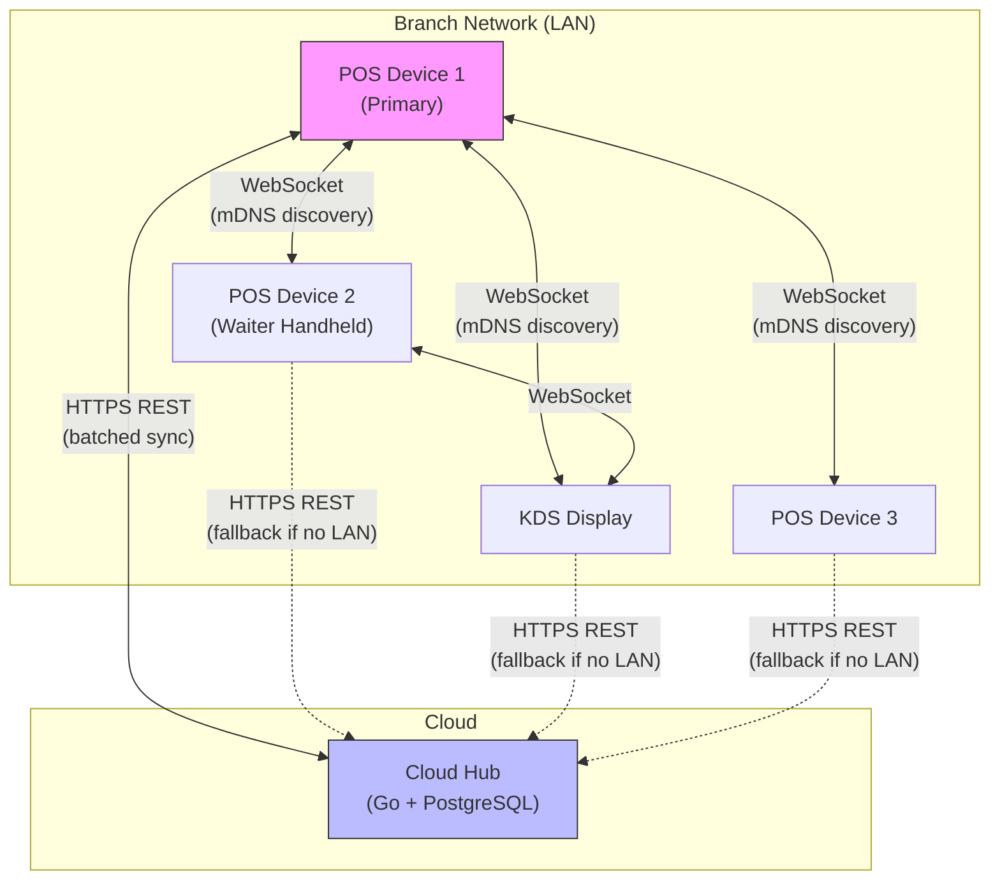

### 1.3 Two Sync Modes

| Mode | Transport | Scope | Latency | Use Case |
|------|-----------|-------|---------|----------|
| **LAN Sync** | WebSocket over local network | Device-to-device within branch | < 100ms | KDS updates, table status, real-time order flow |
| **Cloud Sync** | HTTPS REST over internet | Device/Primary-to-cloud | 1-30 seconds | Persistence, reporting, multi-branch, master data |

**Why two modes:**

- **LAN Sync** provides the real-time responsiveness needed inside a restaurant. When a waiter sends an order, the kitchen display must update within milliseconds. This cannot depend on internet.
- **Cloud Sync** provides durability, cross-branch visibility, and master data distribution. It can tolerate higher latency.
- **Fallback:** If the branch primary is unreachable (crashed, offline), individual devices can sync directly with the cloud. This is a degraded mode -- LAN-dependent features (KDS) won't work, but the device remains operational.

### 1.4 Branch Primary Role

One device in each branch is designated as the **Branch Primary**. Its responsibilities:

| Responsibility | Details |
|---------------|---------|
| **LAN hub** | Other devices sync to/through the primary via LAN |
| **Cloud relay** | Primary syncs aggregated branch data to/from cloud |
| **mDNS beacon** | Announces itself via mDNS for device discovery |
| **Conflict arbiter** | Resolves LAN-level conflicts (e.g., two devices modify same table) |
| **Offline buffer** | Accumulates changes from all devices when cloud is unreachable |

**Primary election:** The first device that starts in a branch becomes primary. If the primary goes offline, the next device to detect its absence takes over (simple leader election via mDNS announcement and timeout).

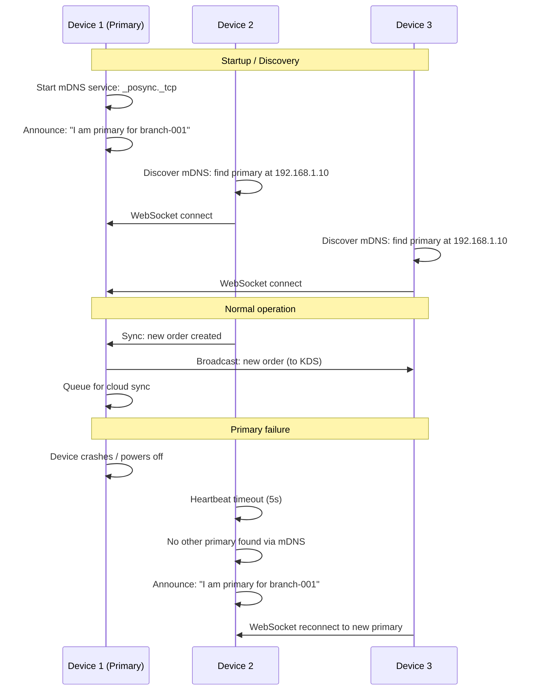

---

## 2. Offline Outbox / Inbox Pattern

### 2.1 Core Pattern

Every write operation on a device is recorded in two places:

1. **Local SQLite database** -- the actual data (order, payment, etc.).
2. **Outbox table** (`sync_queue`) -- a record that this change needs to be synced.

Incoming changes from other devices or the cloud are processed through an **inbox** that applies them to the local database.

### 2.2 Outbox Schema

```
Table: sync_queue (outbox)
--------------------------
id              UUID v7     -- unique, time-sortable
entity_type     TEXT        -- 'order', 'payment', 'product', 'table_status', etc.
entity_id       UUID        -- the ID of the changed entity
operation       TEXT        -- 'INSERT', 'UPDATE', 'DELETE'
payload         BLOB/JSON   -- serialized entity state (full snapshot)
hlc_timestamp   BIGINT      -- Hybrid Logical Clock timestamp
device_id       UUID        -- originating device
branch_id       UUID        -- branch identifier
created_at      DATETIME    -- wall clock time (for debugging)
synced_to_lan   BOOLEAN     -- has this been sent to branch primary?
synced_to_cloud BOOLEAN     -- has this been confirmed by cloud?
retry_count     INTEGER     -- number of sync attempts
last_error      TEXT        -- last sync error (if any)
```

### 2.3 Outbox Processing

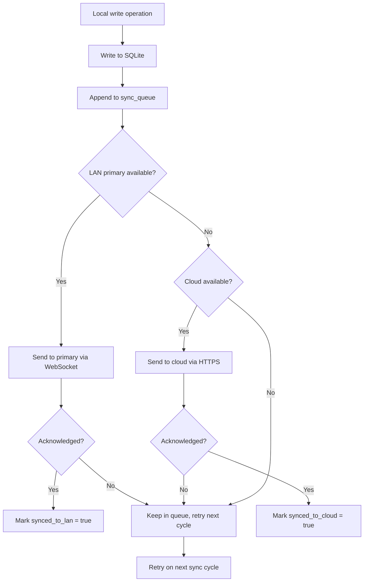

### 2.4 Inbox Processing

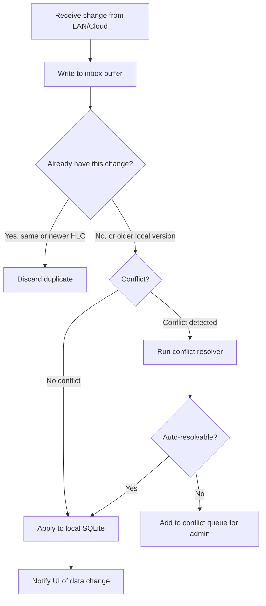

### 2.5 Processing Order

- **Per entity:** Changes to the same entity are processed in HLC order (causal ordering).
- **Across entities:** Changes to different entities can be processed in parallel (no ordering guarantee).
- **Batch boundary:** A sync batch is processed atomically -- either all changes in the batch are applied, or none are.

---

## 3. Transactional Data Sync

### 3.1 Scope

Transactional data includes: **Orders (Tickets), Order Items, Payments, Shifts, Receipts, Kitchen Tickets, Fiscal Records.**

### 3.2 Source of Truth

> **The branch is the source of truth for all transactional data.**

Transactions are created on devices, synced to the branch primary, and then to the cloud. The cloud accumulates transactions but never modifies them.

### 3.3 Sync Direction and Strategy


| Aspect | Details |
|--------|---------|
| **Direction** | Device --> Branch Primary --> Cloud |
| **Strategy** | Append-only; cloud never overwrites device data |
| **Immutability** | Once a transaction is synced and confirmed, it cannot be modified |
| **Modifications** | Changes are represented as new events (e.g., void is a new "void event," not a deletion) |
| **Ordering** | Per-ticket causal ordering (guaranteed by HLC) |

### 3.4 Order Lifecycle Through Sync

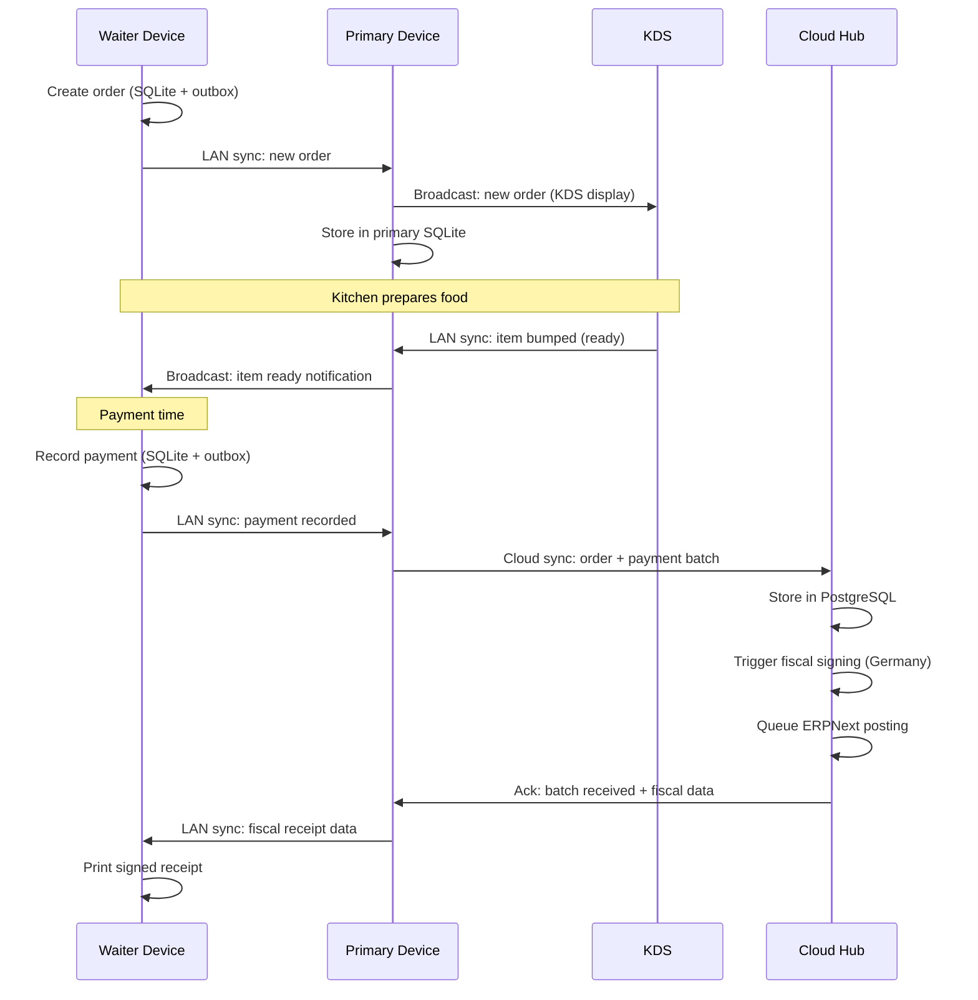

### 3.5 Conflict Handling for Transactions

Conflicts on transactional data are extremely rare because:

1. **Natural partitioning:** Each table is typically served by one waiter/device.
2. **Append-only model:** Two devices adding items to the same order is a merge, not a conflict.
3. **Payment lock:** When a payment is initiated on one device, the ticket is "locked" -- other devices see it as "being paid" and cannot modify it.

**Remaining edge case:** Two devices simultaneously modify the same order (e.g., both add items at the same instant).

**Resolution:** Both additions are accepted (union merge). The order ends up with items from both devices. This is the correct behavior -- if two waiters both added items, both items were ordered.

---

## 4. Master Data Sync

### 4.1 Scope

Master data includes: **Menu, Products, Prices, Tax Configuration, Users, Table Layout, Branch Configuration, Modifiers, Categories.**

### 4.2 Source of Truth

> **The cloud is the source of truth for all master data.**

Master data is managed in the cloud (via web dashboard or ERPNext bridge) and distributed to devices. Devices do not create or modify master data (with one exception: local display preferences, which are device-specific and not synced -- see Section 10).

### 4.3 Version-Based Sync

Each master data entity has a monotonically increasing **version number** managed by the cloud:

```
Table: products (cloud)
-----------------------
id          UUID
name        TEXT
price       INTEGER (cents)
...
version     BIGINT      -- incremented on every change
updated_at  DATETIME
```

The device tracks the highest version it has received:

```
Table: sync_cursors (device)
----------------------------
entity_type     TEXT        -- 'product', 'tax_category', etc.
last_version    BIGINT      -- highest version received
last_synced_at  DATETIME
```

### 4.4 Delta Sync Flow

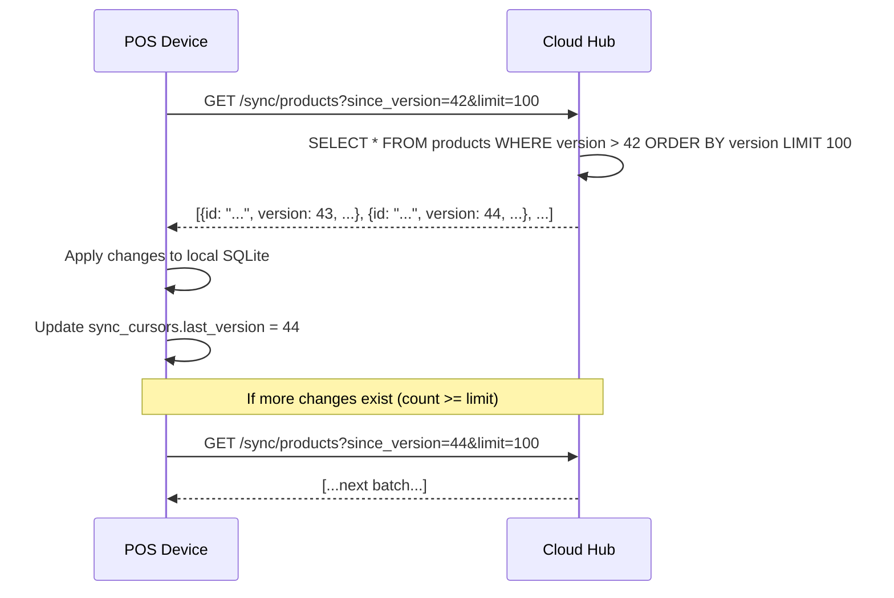

### 4.5 Full Re-Seed vs Delta

| Scenario | Strategy |
|----------|----------|
| Normal sync (online, < 1 day behind) | Delta sync (changes since last version) |
| Device was offline for > 7 days | Delta sync still works (versions are permanent) |
| New device joining branch | Full re-seed (all active records) |
| Database corruption / factory reset | Full re-seed |
| Schema migration (app update) | Full re-seed with schema transform |

### 4.6 What Happens When Cloud Is Down

1. Devices continue using the last-synced master data.
2. The sync cursor is unchanged.
3. When cloud comes back, the next delta sync catches up from the stored cursor.
4. No data is lost, no special recovery needed.

**Risk:** If a menu change was made in the cloud during the outage, devices won't see it until reconnection. This is acceptable -- menu changes are typically planned and can wait.

### 4.7 Conflict Resolution

Master data conflicts are simple: **cloud always wins.**

If a device somehow has a local modification to master data (shouldn't happen in normal operation), the cloud version overwrites it on the next sync.

---

## 5. Fiscal Data Sync

### 5.1 Special Handling

Fiscal data (TSE signatures, transaction numbers, receipt signing status) requires special treatment because:

1. **Immutability:** Fiscal records must never be deleted or modified, even if the underlying order is voided.
2. **Auditability:** Every fiscal event must have a complete audit trail.
3. **Bidirectional flow:** Transactions go branch --> cloud --> Fiskaly; signed data comes back cloud --> branch.

### 5.2 Sync Flow

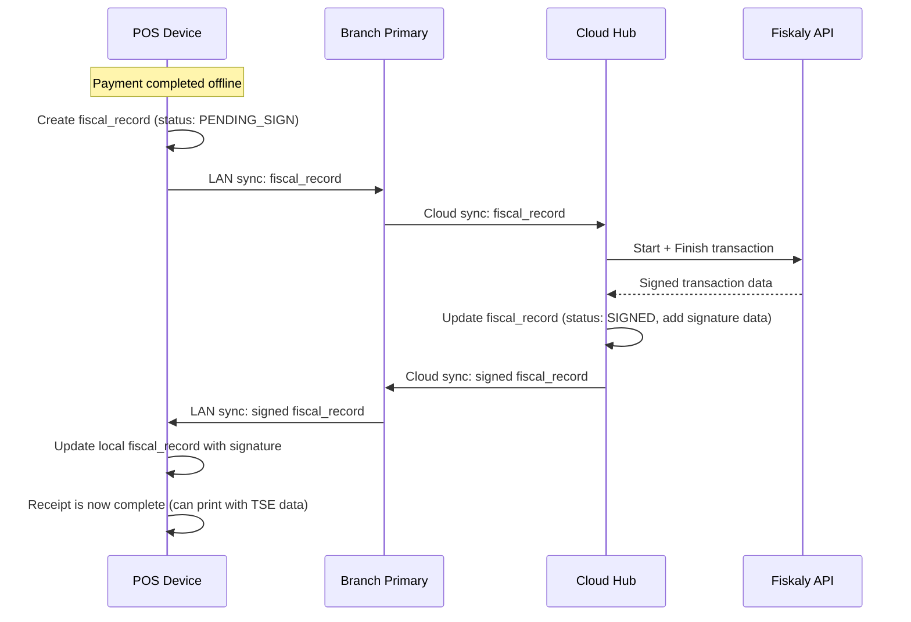

### 5.3 Retry and Failure

| Scenario | Behavior |
|----------|----------|
| Device offline (no LAN, no cloud) | Fiscal record stays in outbox; order is served normally; receipt printed without TSE data |
| LAN available but no cloud | Fiscal record reaches primary but cannot reach Fiskaly; queued on primary |
| Cloud available but Fiskaly down | Cloud queues the signing request with exponential backoff (see 07-germany-fiscal-pack.md) |
| Fiscal record signed but sync back fails | Cloud retries pushing signed data to branch; device can also poll for status |

### 5.4 Immutability Rules

- Fiscal records are **never deleted** from any database (device, primary, cloud).
- Void transactions create new fiscal records (cancellation type), they do not modify the original.
- The sync engine treats fiscal records as append-only, insert-only entities.
- A fiscal record once in SIGNED state can never transition to any other state.

---

## 6. Media / Image Sync

### 6.1 Scope

Media includes: product images, category icons, floor plan backgrounds, and restaurant logo.

### 6.2 Sync Strategy

| Aspect | Details |
|--------|---------|
| **Direction** | Cloud --> Device (one-way) |
| **Loading** | Lazy -- images are downloaded on demand, not eagerly with master data |
| **Cache** | LRU (Least Recently Used) cache on device, configurable max size (default: 200MB) |
| **Compression** | Cloud provides multiple resolutions (thumbnail 64px, medium 256px, full 1024px) |
| **Priority** | Lower than transactional and master data sync |
| **Format** | WebP preferred (smaller file size), JPEG fallback |

### 6.3 Image Sync Flow

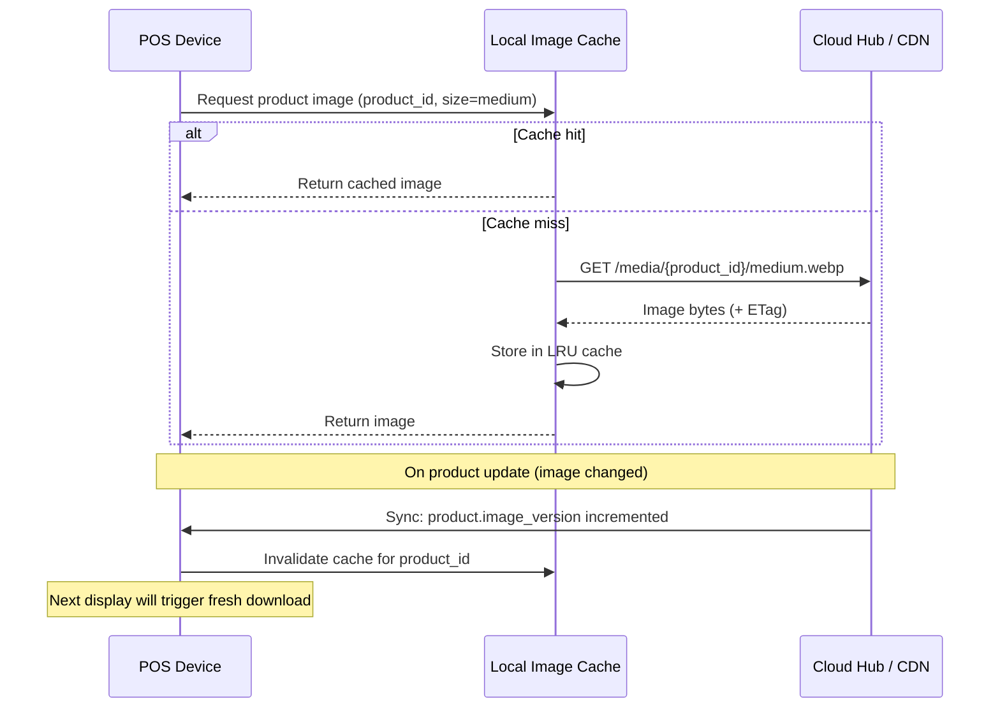

### 6.4 Bandwidth Management

- Images sync only when on WiFi (configurable; mobile data sync can be enabled).
- During peak service hours, image sync is deprioritized.
- A background task pre-fetches images for all active menu items during off-peak hours (e.g., 3 AM).

---

## 7. Conflict Resolution Deep Dive

### 7.1 Clock Strategy: Hybrid Logical Clocks (HLC)

We use **Hybrid Logical Clocks** as the timestamp mechanism for all sync operations.

**Why HLC over alternatives:**

| Clock Type | Pros | Cons | Verdict |
|-----------|------|------|---------|
| **Wall clock** | Simple, human-readable | Clock skew between devices; unreliable ordering | Rejected |
| **Lamport timestamps** | Causal ordering guaranteed | No wall-clock correlation; hard to debug | Rejected |
| **Vector clocks** | Perfect causal ordering, detect concurrent events | Size grows with number of devices; complex to merge | Rejected (complexity) |
| **Hybrid Logical Clocks** | Causal ordering + wall-clock correlation; fixed size | Slightly more complex than wall clock | **Selected** |

**HLC structure:**

```
HLC = (physical_time, logical_counter, device_id)

physical_time:  wall clock timestamp (milliseconds since epoch)
logical_counter: monotonically increasing counter (resets when physical_time advances)
device_id:      unique device identifier (for tie-breaking)
```

**HLC comparison (total order):**
```
Compare(hlc_a, hlc_b):
  1. Compare physical_time: higher wins
  2. If equal, compare logical_counter: higher wins
  3. If equal, compare device_id: lexicographic order (deterministic tie-break)
```

### 7.2 Conflict Detection

A conflict occurs when:
- Two changes to the **same entity** (same `entity_type` + `entity_id`) arrive with **concurrent** HLC timestamps (neither causally precedes the other).

In practice, this means two devices modified the same record without seeing each other's changes first.

### 7.3 Resolution Strategies by Entity Type

| Entity Type | Strategy | Rationale |
|-------------|----------|-----------|
| **Order (Ticket)** | Union merge (items) + last-writer-wins (status) | Two waiters adding items to same order: keep both. Status changes: latest wins. |
| **Order Item** | Last-writer-wins | Quantity or modifier changes: latest wins |
| **Payment** | Reject concurrent | Only one device can finalize payment (lock mechanism) |
| **Table Status** | Last-writer-wins | Most recent status is most accurate |
| **Product** | Cloud always wins | Master data from cloud |
| **Customer** | Field-level merge | Financial fields: ERPNext wins. Preference fields: latest wins |
| **Shift** | Device-specific (no conflict) | Each shift belongs to one device |
| **Fiscal Record** | Append-only (no conflict) | Immutable, no modifications |

### 7.4 Per-Field Merge vs Whole-Entity Replacement

| Approach | Used For | Description |
|----------|----------|-------------|
| **Whole-entity replacement** | Simple entities (table status, shift) | Latest version replaces entirely |
| **Per-field merge** | Complex entities (customer, product) | Each field has an owner; merge by field |
| **Union merge** | Collections (order items) | Combine both sets; deduplicate by item ID |

**Per-field merge example (Customer):**

```
Customer A (device version):
  name: "Hans Muller"           -- last modified by POS
  phone: "+41 79 123 4567"      -- last modified by POS
  credit_limit: 1000            -- last modified by ERPNext
  loyalty_points: 150           -- last modified by POS

Customer A (cloud version):
  name: "Hans Mueller"          -- last modified by ERPNext
  phone: "+41 79 123 4567"      -- same
  credit_limit: 2000            -- last modified by ERPNext (more recent)
  loyalty_points: 120           -- last modified by ERPNext (but POS is more recent)

Merged result:
  name: "Hans Mueller"          -- ERPNext wins (financial/identity field)
  phone: "+41 79 123 4567"      -- same on both
  credit_limit: 2000            -- ERPNext wins (financial field)
  loyalty_points: 150           -- POS wins (POS-owned field, more recent HLC)
```

### 7.5 Conflict Audit Log

Every conflict (whether auto-resolved or requiring manual intervention) is logged:

| Field | Description |
|-------|-------------|
| `conflict_id` | Unique identifier |
| `entity_type` | Type of entity |
| `entity_id` | Entity identifier |
| `local_version` | The local state (JSON) |
| `remote_version` | The incoming state (JSON) |
| `resolution` | AUTO_LWW, AUTO_UNION, AUTO_CLOUD_WINS, MANUAL |
| `resolved_version` | The final merged state (JSON) |
| `resolved_by` | System or admin user ID |
| `resolved_at` | Timestamp |

### 7.6 Manual Conflict Queue

For conflicts that cannot be auto-resolved (rare):

1. The conflict is added to a manual resolution queue visible in the admin dashboard.
2. Admin sees both versions side-by-side.
3. Admin selects which version to keep (or manually edits the merged result).
4. The resolved version is synced to all devices.

**Expected frequency of manual conflicts:** <0.01% of all sync operations (essentially zero in normal operation).

---

## 8. Sync Protocol

### 8.1 Transport

| Mode | Transport | Port | Security |
|------|-----------|------|----------|
| **LAN Sync** | WebSocket | Dynamic (mDNS advertised) | TLS with self-signed cert (device-generated) |
| **Cloud Sync** | HTTPS REST | 443 | TLS 1.3 with server certificate |

### 8.2 LAN Sync Protocol

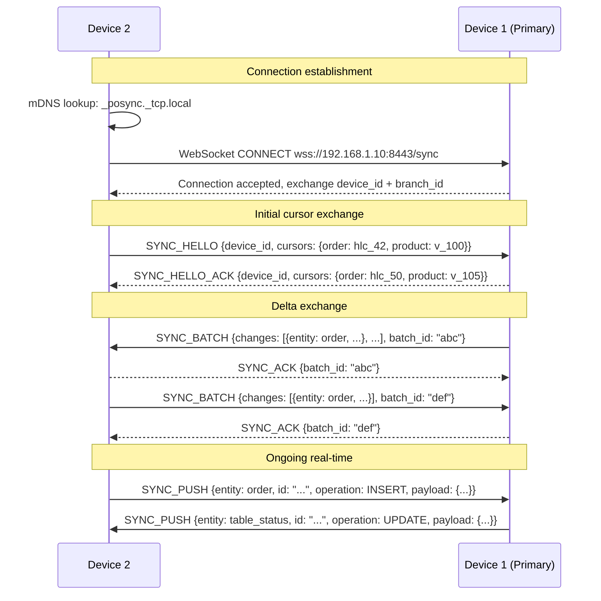

**WebSocket message types:**

| Message | Direction | Purpose |
|---------|-----------|---------|
| `SYNC_HELLO` | Bidirectional | Exchange cursors on connect |
| `SYNC_HELLO_ACK` | Response | Acknowledge hello, send own cursors |
| `SYNC_BATCH` | Bidirectional | Batch of changes (catch-up) |
| `SYNC_ACK` | Response | Acknowledge batch receipt |
| `SYNC_PUSH` | Bidirectional | Single real-time change |
| `SYNC_PUSH_ACK` | Response | Acknowledge single change |
| `HEARTBEAT` | Bidirectional | Keep-alive (every 5 seconds) |
| `SYNC_REQUEST` | Device to Primary | Request full re-seed or specific data |

### 8.3 Cloud Sync Protocol

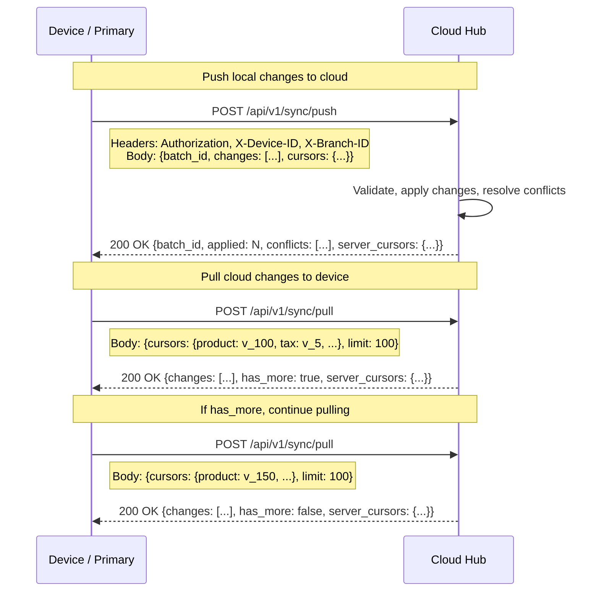

### 8.4 Payload Format

```
Sync Change Payload (JSON):
{
  "entity_type": "order",
  "entity_id": "01905a7e-3c2b-7e1f-8a3d-2b4c5d6e7f8a",
  "operation": "UPDATE",
  "hlc_timestamp": 1710936000000042001,
  "device_id": "device-001",
  "branch_id": "branch-zurich-01",
  "payload": {
    // full entity snapshot (not a diff)
    "id": "01905a7e-3c2b-7e1f-8a3d-2b4c5d6e7f8a",
    "table_id": "table-5",
    "status": "IN_PROGRESS",
    "items": [...],
    "total_gross": 4580,
    ...
  },
  "checksum": "sha256:abc123..."
}
```

### 8.5 Batching

| Parameter | Value |
|-----------|-------|
| **Max changes per batch** | 100 |
| **Max batch size** | 1 MB (compressed) |
| **Compression** | gzip (Content-Encoding: gzip) |
| **Batch ID** | UUID v4 (for idempotent retry) |

### 8.6 Idempotency

Every sync operation is idempotent:

- **Push:** The `batch_id` is used as an idempotency key. If the cloud already processed a batch, it returns success without reprocessing.
- **Per-change:** Each change has `entity_id` + `hlc_timestamp`. If the cloud already has a change with the same or newer HLC for that entity, the incoming change is safely ignored.
- **Pull:** Cursor-based pagination is inherently idempotent. Requesting the same cursor twice returns the same results.

### 8.7 Pagination

| Parameter | Description |
|-----------|-------------|
| **Cursor type** | Opaque string (encodes version + entity_type) |
| **Page size** | Configurable, default 100, max 500 |
| **Direction** | Forward only (ascending version) |
| **Stability** | Cursor remains valid indefinitely (versions are permanent) |

---

## 9. Device Re-Seeding

### 9.1 When Re-Seeding Occurs

| Trigger | Description |
|---------|-------------|
| **New device** | A new device joins a branch for the first time |
| **Factory reset** | Device was reset and local database is empty |
| **Database corruption** | SQLite corruption detected (checksum mismatch) |
| **App reinstall** | App was uninstalled and reinstalled |
| **Major schema migration** | App update requires fresh data load |

### 9.2 Re-Seeding Process

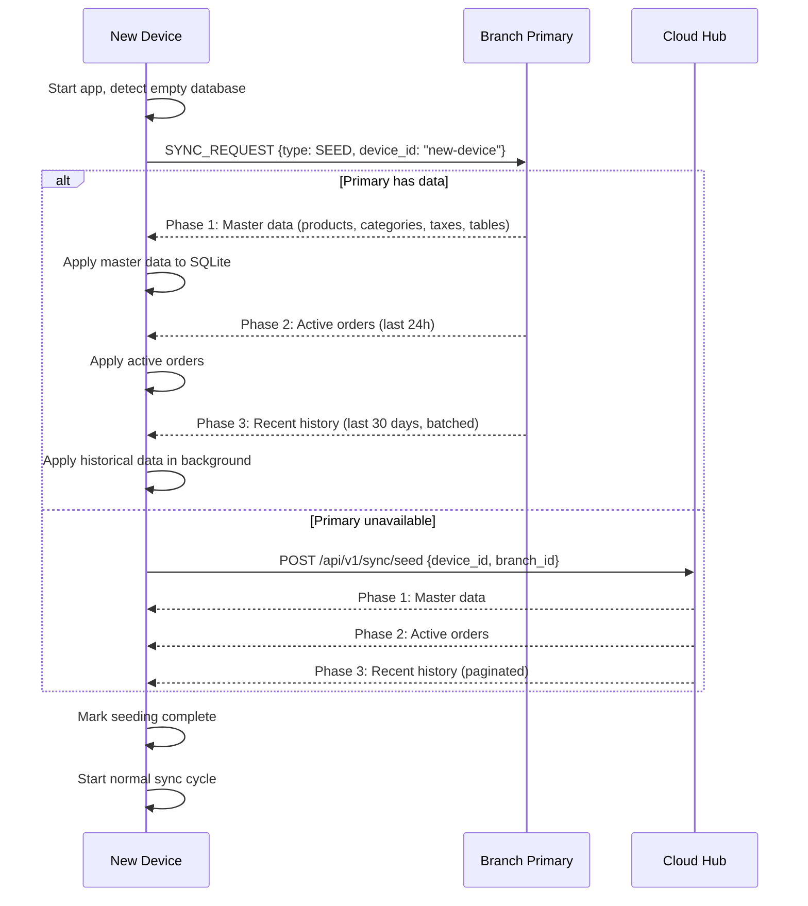

### 9.3 Progressive Seeding

Re-seeding is progressive -- the device becomes usable before all historical data is loaded:

| Phase | Data | Required for Operation | Time to Load |
|-------|------|----------------------|-------------|
| **Phase 1** | Master data (menu, prices, taxes, tables, users) | Yes | ~5-30 seconds |
| **Phase 2** | Active orders (open tables, pending payments) | Yes (for table service) | ~5-15 seconds |
| **Phase 3** | Recent transactions (last 30 days) | No (for reports only) | ~1-10 minutes (background) |

**Key behavior:** After Phase 1 completes, the device can take new orders. Phase 2 and 3 run in the background.

### 9.4 During Seeding

While seeding is in progress:

- The device can create new orders (written to local SQLite and outbox).
- New orders are synced normally (they don't wait for seeding to complete).
- The device shows a subtle indicator: "Synchronizing data... (70%)".
- Historical reports may show incomplete data until Phase 3 completes.

---

## 10. Specific Non-Sync Items

### 10.1 Print Jobs -- NEVER Synced

```
RULE: Print jobs are NEVER synced between devices.
```

**Rationale:**

- Printing is a local side-effect, not data. A print job is a command to a physically connected printer.
- If print jobs were synced, a receipt printed on Device A would also print on Device B's printer -- causing double prints.
- Each device manages its own print queue independently.
- If a device needs to "reprint" a receipt from another device's order, it generates a new print job locally from the synced order data.

**What IS synced:** The order data, payment data, and receipt template data are synced. The act of printing is local.

### 10.2 Temporary UI State -- NEVER Synced

| UI State | Why Not Synced |
|----------|---------------|
| Current table selection | Device-specific navigation state |
| Cart in progress (before order placed) | Not committed data; belongs to the waiter's device |
| Search query | Device-specific |
| Scroll position | Device-specific |
| Dialog/modal state | Device-specific |
| Keyboard state | Device-specific |

### 10.3 Device-Local Preferences -- NEVER Synced

| Preference | Why Not Synced |
|-----------|---------------|
| Screen brightness | Physical device setting |
| Sound volume | Physical device setting |
| Preferred printer | Device is physically connected to a specific printer |
| Printer paper width | Depends on connected printer model |
| Language override | User-specific per device (if different from branch default) |
| Night mode | User preference per device |

### 10.4 KDS Display State -- Partially Synced

| KDS State | Synced? | Reason |
|-----------|---------|--------|
| Order items in queue | Yes | All devices need to see open kitchen orders |
| Item "bumped" (completed) | Yes | Waiter needs to know food is ready |
| Item "started" (in preparation) | Yes | Timing information is shared |
| KDS screen layout / column arrangement | No | Physical display configuration |
| KDS alert sounds | No | Local audio setting |

---

## 11. Reliability Guarantees

### 11.1 Delivery Guarantee

> **At-least-once delivery with idempotent processing.**

Every change will be delivered to its destination at least once. The recipient handles deduplication using `entity_id` + `hlc_timestamp`.

**Why not exactly-once:** True exactly-once delivery is impossible in distributed systems (Two Generals Problem). At-least-once with idempotent processing achieves the same practical result with simpler implementation.

### 11.2 Ordering Guarantees

| Guarantee | Scope | Mechanism |
|-----------|-------|-----------|
| **Causal ordering** | Per entity | HLC timestamps ensure cause precedes effect |
| **No global ordering** | Across entities | Changes to different entities may arrive out of wall-clock order |
| **FIFO per device** | Per device's outbox | Outbox is processed in insertion order |

**Example:** Device A creates Order #1 at T1, Device B creates Order #2 at T2 (T2 > T1). The cloud might receive Order #2 before Order #1 if Device A has slower connectivity. This is acceptable because the two orders are independent entities.

### 11.3 Consistency Model

> **Eventual consistency with bounded convergence.**

All devices within a branch will converge to the same state:

| Condition | Convergence Time |
|-----------|-----------------|
| All devices on LAN | < 1 second |
| Primary online, device on LAN | < 1 second for LAN data, < 30 seconds for cloud data |
| Device syncing directly to cloud | < 30 seconds |
| Device offline | On reconnect (minutes to hours) |
| Extended cloud outage | When cloud recovers (hours to days) |

### 11.4 Data Durability

| Data Location | Durability | Risk |
|---------------|-----------|------|
| Device SQLite | Low (single device, no replication) | Device loss/failure loses unsynced data |
| Branch Primary SQLite | Medium (accumulates from all devices) | Single point of failure for branch |
| Cloud PostgreSQL | High (managed DB with backups, replication) | Cloud provider outage |

**Mitigation for device failure:**

- Devices sync to the branch primary within milliseconds (LAN).
- The primary syncs to cloud within seconds to minutes.
- Data window at risk: only changes made in the last few seconds before device failure (if LAN was active) or since last cloud sync (if offline).

### 11.5 Durability Timeline

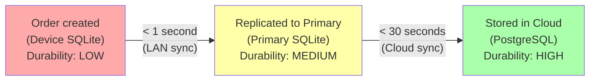

---

## 12. Monitoring and Health

### 12.1 Sync Health Metrics

| Metric | Description | Collection Point |
|--------|-------------|-----------------|
| `sync_lag_seconds` | Time since last successful sync per device | Cloud Hub |
| `outbox_pending_count` | Number of unsynced changes in device outbox | Device (reported to cloud) |
| `outbox_oldest_age_seconds` | Age of oldest unsynced change | Device (reported to cloud) |
| `inbox_processing_rate` | Changes applied per second | Device |
| `conflict_count` | Number of conflicts detected (auto + manual) | Cloud Hub |
| `sync_batch_size_avg` | Average number of changes per sync batch | Cloud Hub |
| `sync_round_trip_ms` | Latency of sync push+pull cycle | Device |
| `lan_connected_devices` | Number of devices connected via LAN | Branch Primary |
| `cloud_sync_failures` | Failed sync attempts per device | Cloud Hub |
| `reseed_in_progress` | Whether a device is currently re-seeding | Cloud Hub |

### 12.2 Alert Thresholds

| Metric | Warning | Critical | Action |
|--------|---------|----------|--------|
| `sync_lag_seconds` | > 300 (5 min) | > 3600 (1 hour) | Dashboard alert; email at critical |
| `outbox_pending_count` | > 50 | > 500 | Dashboard alert |
| `outbox_oldest_age_seconds` | > 600 (10 min) | > 7200 (2 hours) | Dashboard alert; investigate connectivity |
| `cloud_sync_failures` (consecutive) | > 5 | > 20 | Dashboard alert; check device network |
| `conflict_count` (per hour) | > 5 | > 20 | Dashboard alert; investigate cause |
| `lan_connected_devices` | < expected count | 0 (primary isolated) | Dashboard alert |

### 12.3 Health Dashboard

The admin dashboard shows sync health per branch and per device:

```
Branch: Zurich Hauptbahnhof
Status: HEALTHY
Last cloud sync: 12 seconds ago
Connected devices: 4/4

+-----------+----------+--------+----------+--------+
| Device    | Role     | LAN    | Cloud    | Outbox |
+-----------+----------+--------+----------+--------+
| POS-01    | Primary  | --     | 12s ago  | 0      |
| POS-02    | Waiter   | OK     | via LAN  | 0      |
| KDS-01    | Kitchen  | OK     | via LAN  | 0      |
| POS-03    | Bar      | OK     | via LAN  | 2      |
+-----------+----------+--------+----------+--------+
```

### 12.4 Sync Health Report

Generated daily (or on demand) for each branch:

| Metric | Today | 7-Day Avg |
|--------|-------|-----------|
| Total changes synced | 12,456 | 11,230 |
| Average sync latency | 0.8s | 1.2s |
| Max sync latency | 45s | 120s |
| Conflicts (auto-resolved) | 2 | 1.4 |
| Conflicts (manual) | 0 | 0 |
| Sync failures (retried successfully) | 8 | 5.3 |
| Sync failures (unresolved) | 0 | 0 |
| Longest offline period | 0 min | 12 min |
| Data loss events | 0 | 0 |

### 12.5 Device Connectivity Indicator

Every POS device shows a real-time connectivity indicator:

| Icon State | Meaning |
|------------|---------|
| Green (solid) | LAN connected + Cloud synced (< 30s ago) |
| Green (pulsing) | LAN connected + Cloud syncing now |
| Yellow | LAN connected + Cloud unreachable (> 5 min) |
| Orange | LAN disconnected + Cloud reachable (fallback mode) |
| Red | LAN disconnected + Cloud unreachable (fully offline) |
| Red (flashing) | Outbox > 100 items (significant backlog) |

The indicator is visible but unobtrusive -- restaurant staff should not be distracted by sync status during service. Detailed information is available by tapping the indicator.

---

## Appendix A: Sync Sequence -- Complete Order Lifecycle

This appendix shows the complete sync journey of an order from creation to fiscal completion.

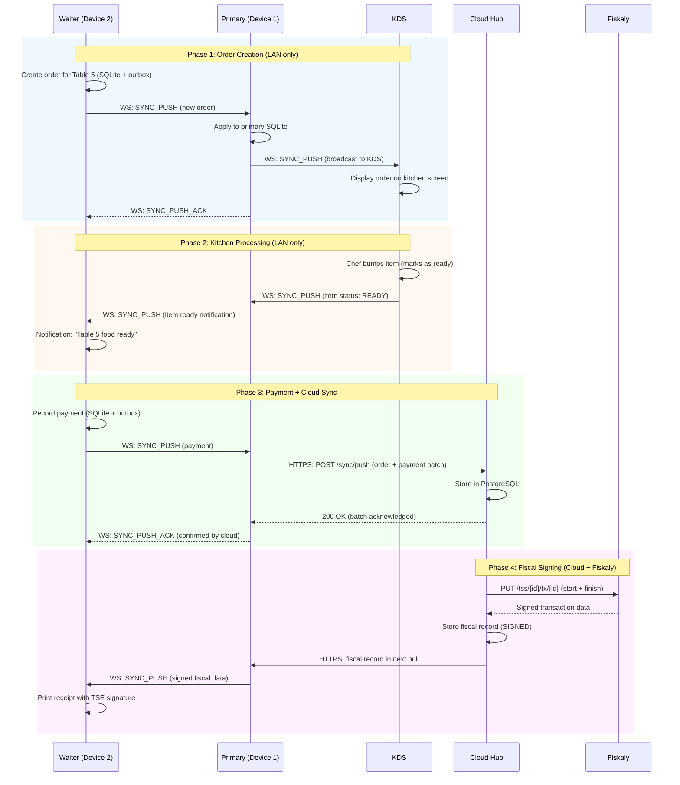

## Appendix B: Sync Protocol Message Reference

| Message Type | Direction | Payload | Notes |
|-------------|-----------|---------|-------|
| `SYNC_HELLO` | Device --> Primary | `{device_id, branch_id, cursors}` | Sent on connect |
| `SYNC_HELLO_ACK` | Primary --> Device | `{device_id, cursors}` | Response to hello |
| `SYNC_BATCH` | Bidirectional | `{batch_id, changes[], cursors}` | Catch-up batch |
| `SYNC_ACK` | Response | `{batch_id, applied, rejected[]}` | Batch acknowledgement |
| `SYNC_PUSH` | Bidirectional | `{entity_type, entity_id, operation, payload, hlc}` | Real-time single change |
| `SYNC_PUSH_ACK` | Response | `{entity_id, hlc, status}` | Single change ack |
| `SYNC_REQUEST` | Device --> Primary/Cloud | `{type: SEED/DELTA, cursors}` | Request data |
| `HEARTBEAT` | Bidirectional | `{device_id, timestamp}` | Every 5 seconds |
| `SYNC_ERROR` | Bidirectional | `{code, message, batch_id?}` | Error notification |

## Appendix C: Glossary

| Term | Description |
|------|-------------|
| **HLC** | Hybrid Logical Clock -- timestamp combining wall clock and logical counter |
| **Outbox** | Local queue of changes waiting to be synced |
| **Inbox** | Buffer of incoming changes from other devices/cloud |
| **Branch Primary** | The device acting as LAN hub and cloud relay for a branch |
| **Delta sync** | Syncing only changes since last known version |
| **Re-seed** | Complete data load for a new or corrupted device |
| **LWW** | Last Writer Wins -- conflict resolution strategy |
| **Causal ordering** | Guarantee that cause precedes effect in event ordering |
| **Eventual consistency** | All replicas converge to the same state given enough time |
| **Idempotent** | Operation that produces the same result regardless of how many times it's applied |
| **mDNS** | Multicast DNS -- zero-configuration service discovery on local network |
| **Cursor** | Opaque token representing a position in a stream of changes |
