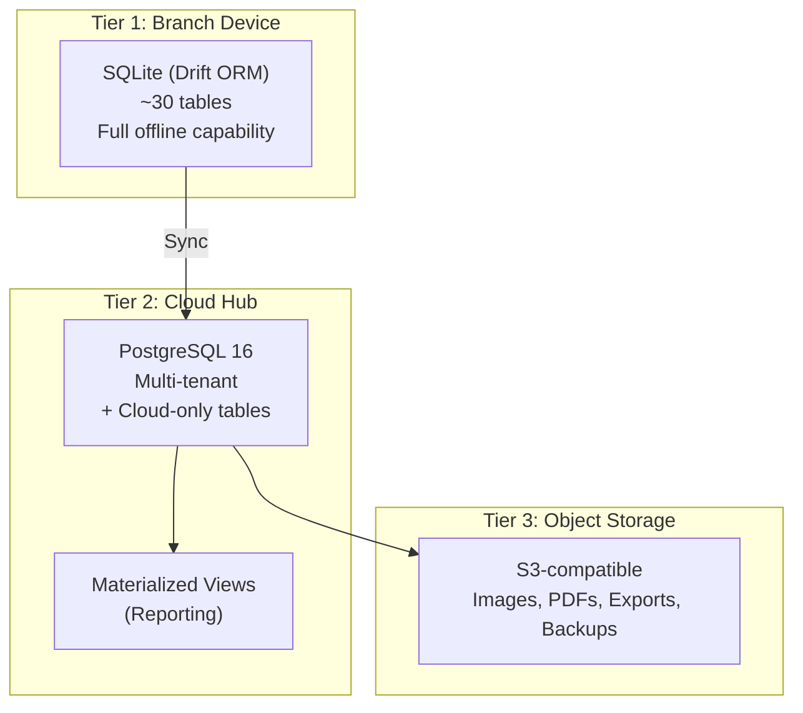
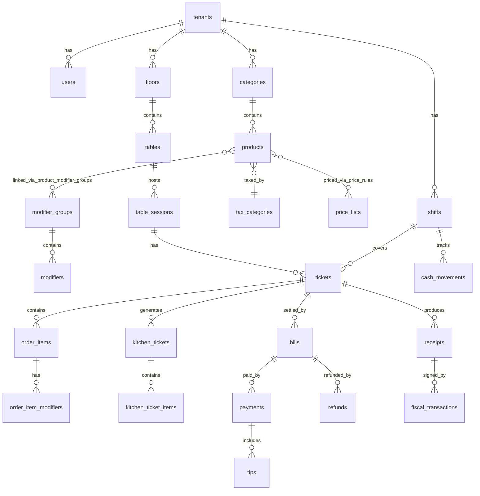
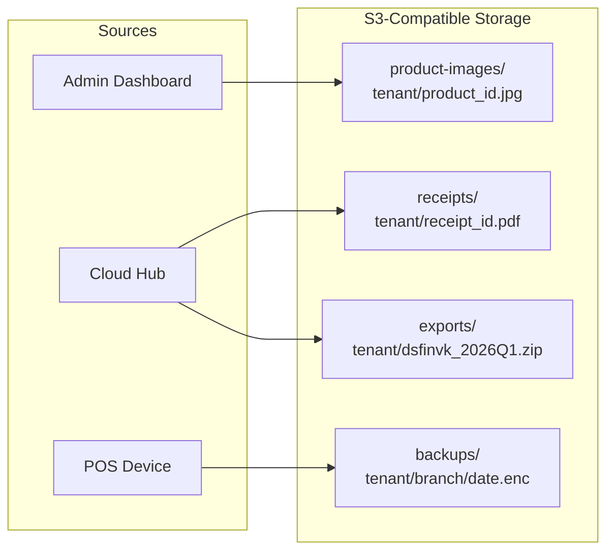
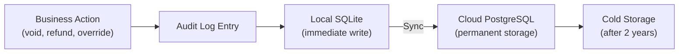

# Data Model

> **Document Status:** Living document | **Last Updated:** 2026-03-20 | **Owner:** Architecture Team

---

## Table of Contents

1. [Overview](#1-overview)
2. [Local Runtime DB (SQLite via Drift)](#2-local-runtime-db-sqlite-via-drift)
3. [Cloud DB (PostgreSQL)](#3-cloud-db-postgresql)
4. [Reporting DB](#4-reporting-db)
5. [File Storage](#5-file-storage)
6. [Audit Log](#6-audit-log)

---

## 1. Overview

The platform maintains data across three storage tiers, each optimized for its access pattern:



### Common Conventions

| Convention | Detail |
|---|---|
| **Primary keys** | TEXT, UUID v7 (time-sortable, 36 chars hyphenated) |
| **Money fields** | INTEGER, smallest currency unit (cents/Rappen). Suffix: `_cents` |
| **Timestamps** | INTEGER, Unix milliseconds (SQLite) / TIMESTAMPTZ (PostgreSQL) |
| **Soft delete** | `is_deleted INTEGER NOT NULL DEFAULT 0` (SQLite) / `BOOLEAN` (PostgreSQL) |
| **Sync tracking** | `sync_status TEXT DEFAULT 'pending'` -- values: `pending`, `synced`, `conflict` |
| **Multi-tenant** | `tenant_id TEXT NOT NULL` on every table |
| **Audit columns** | `created_at`, `updated_at` on every table |

---

## 2. Local Runtime DB (SQLite via Drift)

The local SQLite database is the **primary data store** on each device. It must support fully offline operation for all POS functions.

### 2.1 Schema Overview



### 2.2 Full SQL Schema

#### Tenant and Identity Tables

```sql
-- Tenant: the restaurant company. One per device typically.
CREATE TABLE tenants (
    id              TEXT PRIMARY KEY,
    name            TEXT NOT NULL,
    country         TEXT NOT NULL DEFAULT 'CH',       -- ISO 3166-1 alpha-2
    currency        TEXT NOT NULL DEFAULT 'CHF',      -- ISO 4217
    timezone        TEXT NOT NULL DEFAULT 'Europe/Zurich',
    created_at      INTEGER NOT NULL,                 -- Unix ms
    updated_at      INTEGER NOT NULL,
    sync_status     TEXT NOT NULL DEFAULT 'pending',
    is_deleted      INTEGER NOT NULL DEFAULT 0
);

-- Users: staff members who log in via PIN
CREATE TABLE users (
    id              TEXT PRIMARY KEY,
    tenant_id       TEXT NOT NULL REFERENCES tenants(id),
    name            TEXT NOT NULL,
    email           TEXT,
    role            TEXT NOT NULL DEFAULT 'waiter',    -- owner, admin, manager, cashier, waiter, kitchen, kiosk
    pin_hash        TEXT NOT NULL,                     -- bcrypt hash of 4-6 digit PIN
    is_active       INTEGER NOT NULL DEFAULT 1,
    avatar_url      TEXT,
    language        TEXT NOT NULL DEFAULT 'de',
    created_at      INTEGER NOT NULL,
    updated_at      INTEGER NOT NULL,
    sync_status     TEXT NOT NULL DEFAULT 'pending',
    is_deleted      INTEGER NOT NULL DEFAULT 0
);

CREATE INDEX idx_users_tenant ON users(tenant_id);
CREATE INDEX idx_users_role ON users(tenant_id, role);
CREATE INDEX idx_users_active ON users(tenant_id, is_active) WHERE is_deleted = 0;
```

#### Menu Tables

```sql
-- Categories: product groupings displayed as tabs on POS
CREATE TABLE categories (
    id              TEXT PRIMARY KEY,
    tenant_id       TEXT NOT NULL REFERENCES tenants(id),
    name            TEXT NOT NULL,
    color           TEXT,                              -- Hex color for UI
    icon            TEXT,                              -- Icon identifier
    sort_order      INTEGER NOT NULL DEFAULT 0,
    is_active       INTEGER NOT NULL DEFAULT 1,
    created_at      INTEGER NOT NULL,
    updated_at      INTEGER NOT NULL,
    sync_status     TEXT NOT NULL DEFAULT 'pending',
    is_deleted      INTEGER NOT NULL DEFAULT 0
);

CREATE INDEX idx_categories_tenant ON categories(tenant_id);
CREATE INDEX idx_categories_sort ON categories(tenant_id, sort_order) WHERE is_deleted = 0;

-- Products: individual menu items
CREATE TABLE products (
    id              TEXT PRIMARY KEY,
    tenant_id       TEXT NOT NULL REFERENCES tenants(id),
    category_id     TEXT NOT NULL REFERENCES categories(id),
    name            TEXT NOT NULL,
    sku             TEXT,                              -- Optional stock-keeping unit
    description     TEXT,
    price_cents     INTEGER NOT NULL,                  -- Default price in cents
    cost_cents      INTEGER,                           -- Cost price (manager-only visibility)
    tax_category_id TEXT REFERENCES tax_categories(id),
    barcode         TEXT,
    image_url       TEXT,
    is_active       INTEGER NOT NULL DEFAULT 1,
    is_available    INTEGER NOT NULL DEFAULT 1,        -- Temporary out-of-stock toggle
    sort_order      INTEGER NOT NULL DEFAULT 0,
    preparation_time_minutes INTEGER,                  -- Estimated prep time for KDS
    kitchen_printer TEXT,                              -- Target printer/station identifier
    tags            TEXT,                              -- JSON array: ["vegetarian", "spicy"]
    allergens       TEXT,                              -- JSON array: ["gluten", "dairy"]
    created_at      INTEGER NOT NULL,
    updated_at      INTEGER NOT NULL,
    sync_status     TEXT NOT NULL DEFAULT 'pending',
    is_deleted      INTEGER NOT NULL DEFAULT 0
);

CREATE INDEX idx_products_tenant ON products(tenant_id);
CREATE INDEX idx_products_category ON products(category_id) WHERE is_deleted = 0;
CREATE INDEX idx_products_sku ON products(tenant_id, sku) WHERE sku IS NOT NULL;
CREATE INDEX idx_products_barcode ON products(tenant_id, barcode) WHERE barcode IS NOT NULL;
CREATE INDEX idx_products_active ON products(tenant_id, is_active, is_available) WHERE is_deleted = 0;

-- Modifier Groups: groups of optional/required modifiers (e.g., "Size", "Extra Toppings")
CREATE TABLE modifier_groups (
    id              TEXT PRIMARY KEY,
    tenant_id       TEXT NOT NULL REFERENCES tenants(id),
    name            TEXT NOT NULL,
    required        INTEGER NOT NULL DEFAULT 0,        -- 1 = customer must select
    min_select      INTEGER NOT NULL DEFAULT 0,
    max_select      INTEGER NOT NULL DEFAULT 1,        -- 1 = single select, >1 = multi select
    sort_order      INTEGER NOT NULL DEFAULT 0,
    created_at      INTEGER NOT NULL,
    updated_at      INTEGER NOT NULL,
    sync_status     TEXT NOT NULL DEFAULT 'pending',
    is_deleted      INTEGER NOT NULL DEFAULT 0
);

CREATE INDEX idx_modifier_groups_tenant ON modifier_groups(tenant_id);

-- Modifiers: individual options within a modifier group
CREATE TABLE modifiers (
    id              TEXT PRIMARY KEY,
    tenant_id       TEXT NOT NULL REFERENCES tenants(id),
    modifier_group_id TEXT NOT NULL REFERENCES modifier_groups(id),
    name            TEXT NOT NULL,
    price_cents     INTEGER NOT NULL DEFAULT 0,        -- Additional cost
    is_active       INTEGER NOT NULL DEFAULT 1,
    sort_order      INTEGER NOT NULL DEFAULT 0,
    created_at      INTEGER NOT NULL,
    updated_at      INTEGER NOT NULL,
    sync_status     TEXT NOT NULL DEFAULT 'pending',
    is_deleted      INTEGER NOT NULL DEFAULT 0
);

CREATE INDEX idx_modifiers_group ON modifiers(modifier_group_id) WHERE is_deleted = 0;

-- Product-Modifier Group link table
CREATE TABLE product_modifier_groups (
    id              TEXT PRIMARY KEY,
    tenant_id       TEXT NOT NULL REFERENCES tenants(id),
    product_id      TEXT NOT NULL REFERENCES products(id),
    modifier_group_id TEXT NOT NULL REFERENCES modifier_groups(id),
    sort_order      INTEGER NOT NULL DEFAULT 0,
    created_at      INTEGER NOT NULL,
    updated_at      INTEGER NOT NULL,
    sync_status     TEXT NOT NULL DEFAULT 'pending',
    is_deleted      INTEGER NOT NULL DEFAULT 0
);

CREATE INDEX idx_pmg_product ON product_modifier_groups(product_id) WHERE is_deleted = 0;
CREATE INDEX idx_pmg_group ON product_modifier_groups(modifier_group_id) WHERE is_deleted = 0;
CREATE UNIQUE INDEX idx_pmg_unique ON product_modifier_groups(product_id, modifier_group_id) WHERE is_deleted = 0;
```

#### Pricing and Tax Tables

```sql
-- Price Lists: named price sets (e.g., "Dine-in", "Takeaway", "Happy Hour")
CREATE TABLE price_lists (
    id              TEXT PRIMARY KEY,
    tenant_id       TEXT NOT NULL REFERENCES tenants(id),
    name            TEXT NOT NULL,
    is_default      INTEGER NOT NULL DEFAULT 0,
    is_active       INTEGER NOT NULL DEFAULT 1,
    valid_from      INTEGER,                           -- Optional time-based activation
    valid_until     INTEGER,
    created_at      INTEGER NOT NULL,
    updated_at      INTEGER NOT NULL,
    sync_status     TEXT NOT NULL DEFAULT 'pending',
    is_deleted      INTEGER NOT NULL DEFAULT 0
);

CREATE INDEX idx_price_lists_tenant ON price_lists(tenant_id);

-- Price Rules: product-specific prices within a price list
CREATE TABLE price_rules (
    id              TEXT PRIMARY KEY,
    tenant_id       TEXT NOT NULL REFERENCES tenants(id),
    price_list_id   TEXT NOT NULL REFERENCES price_lists(id),
    product_id      TEXT NOT NULL REFERENCES products(id),
    price_cents     INTEGER NOT NULL,
    created_at      INTEGER NOT NULL,
    updated_at      INTEGER NOT NULL,
    sync_status     TEXT NOT NULL DEFAULT 'pending',
    is_deleted      INTEGER NOT NULL DEFAULT 0
);

CREATE INDEX idx_price_rules_list ON price_rules(price_list_id) WHERE is_deleted = 0;
CREATE UNIQUE INDEX idx_price_rules_unique ON price_rules(price_list_id, product_id) WHERE is_deleted = 0;

-- Tax Categories: named tax rate groups (e.g., "Standard 8.1%", "Reduced 2.6%")
CREATE TABLE tax_categories (
    id              TEXT PRIMARY KEY,
    tenant_id       TEXT NOT NULL REFERENCES tenants(id),
    name            TEXT NOT NULL,
    description     TEXT,
    created_at      INTEGER NOT NULL,
    updated_at      INTEGER NOT NULL,
    sync_status     TEXT NOT NULL DEFAULT 'pending',
    is_deleted      INTEGER NOT NULL DEFAULT 0
);

CREATE INDEX idx_tax_categories_tenant ON tax_categories(tenant_id);

-- Tax Rates: actual rates (support multiple rates per category for different periods)
CREATE TABLE tax_rates (
    id              TEXT PRIMARY KEY,
    tenant_id       TEXT NOT NULL REFERENCES tenants(id),
    tax_category_id TEXT NOT NULL REFERENCES tax_categories(id),
    rate            TEXT NOT NULL,                     -- Decimal as string: "7.70", "8.10"
    valid_from      INTEGER NOT NULL,                  -- When this rate takes effect
    valid_until     INTEGER,                           -- NULL = currently active
    country         TEXT NOT NULL DEFAULT 'CH',
    created_at      INTEGER NOT NULL,
    updated_at      INTEGER NOT NULL,
    sync_status     TEXT NOT NULL DEFAULT 'pending',
    is_deleted      INTEGER NOT NULL DEFAULT 0
);

CREATE INDEX idx_tax_rates_category ON tax_rates(tax_category_id);
CREATE INDEX idx_tax_rates_active ON tax_rates(tenant_id, country, valid_from);
```

#### Floor and Table Tables

```sql
-- Floors: physical areas of the restaurant
CREATE TABLE floors (
    id              TEXT PRIMARY KEY,
    tenant_id       TEXT NOT NULL REFERENCES tenants(id),
    branch_id       TEXT NOT NULL,                     -- References cloud branch
    name            TEXT NOT NULL,
    sort_order      INTEGER NOT NULL DEFAULT 0,
    created_at      INTEGER NOT NULL,
    updated_at      INTEGER NOT NULL,
    sync_status     TEXT NOT NULL DEFAULT 'pending',
    is_deleted      INTEGER NOT NULL DEFAULT 0
);

CREATE INDEX idx_floors_tenant ON floors(tenant_id);
CREATE INDEX idx_floors_branch ON floors(branch_id);

-- Tables: individual dining tables with position data for floor plan
CREATE TABLE tables (
    id              TEXT PRIMARY KEY,
    tenant_id       TEXT NOT NULL REFERENCES tenants(id),
    floor_id        TEXT NOT NULL REFERENCES floors(id),
    number          TEXT NOT NULL,                     -- Display number: "A1", "T5"
    label           TEXT,                              -- Optional friendly name
    seats           INTEGER NOT NULL DEFAULT 4,
    shape           TEXT NOT NULL DEFAULT 'square',    -- square, round, rectangle
    position_x      INTEGER NOT NULL DEFAULT 0,        -- Floor plan X coordinate
    position_y      INTEGER NOT NULL DEFAULT 0,        -- Floor plan Y coordinate
    width           INTEGER NOT NULL DEFAULT 80,
    height          INTEGER NOT NULL DEFAULT 80,
    is_active       INTEGER NOT NULL DEFAULT 1,
    created_at      INTEGER NOT NULL,
    updated_at      INTEGER NOT NULL,
    sync_status     TEXT NOT NULL DEFAULT 'pending',
    is_deleted      INTEGER NOT NULL DEFAULT 0
);

CREATE INDEX idx_tables_floor ON tables(floor_id) WHERE is_deleted = 0;
CREATE UNIQUE INDEX idx_tables_number ON tables(tenant_id, floor_id, number) WHERE is_deleted = 0;

-- Table Sessions: a "seating" at a table (open -> close lifecycle)
CREATE TABLE table_sessions (
    id              TEXT PRIMARY KEY,
    tenant_id       TEXT NOT NULL REFERENCES tenants(id),
    table_id        TEXT NOT NULL REFERENCES tables(id),
    waiter_id       TEXT REFERENCES users(id),
    guest_count     INTEGER NOT NULL DEFAULT 1,
    status          TEXT NOT NULL DEFAULT 'open',      -- open, occupied, closed
    opened_at       INTEGER NOT NULL,
    closed_at       INTEGER,
    created_at      INTEGER NOT NULL,
    updated_at      INTEGER NOT NULL,
    sync_status     TEXT NOT NULL DEFAULT 'pending',
    is_deleted      INTEGER NOT NULL DEFAULT 0
);

CREATE INDEX idx_table_sessions_table ON table_sessions(table_id);
CREATE INDEX idx_table_sessions_status ON table_sessions(tenant_id, status) WHERE status = 'open';
CREATE INDEX idx_table_sessions_waiter ON table_sessions(waiter_id);
```

#### Order Tables

```sql
-- Tickets: the primary order entity (one per table session or one per quick sale)
CREATE TABLE tickets (
    id              TEXT PRIMARY KEY,
    tenant_id       TEXT NOT NULL REFERENCES tenants(id),
    branch_id       TEXT NOT NULL,
    table_session_id TEXT REFERENCES table_sessions(id), -- NULL for takeaway/quick sale
    shift_id        TEXT REFERENCES shifts(id),
    waiter_id       TEXT REFERENCES users(id),
    order_type      TEXT NOT NULL DEFAULT 'dine_in',   -- dine_in, takeaway, delivery, online, kiosk
    order_number    TEXT,                               -- Sequential display number: "0042"
    status          TEXT NOT NULL DEFAULT 'open',       -- open, sent, partially_paid, closed, cancelled
    covers          INTEGER NOT NULL DEFAULT 1,
    subtotal_cents  INTEGER NOT NULL DEFAULT 0,
    discount_cents  INTEGER NOT NULL DEFAULT 0,
    tax_cents       INTEGER NOT NULL DEFAULT 0,
    total_cents     INTEGER NOT NULL DEFAULT 0,
    notes           TEXT,
    source          TEXT NOT NULL DEFAULT 'pos',        -- pos, online, kiosk, qr
    created_at      INTEGER NOT NULL,
    updated_at      INTEGER NOT NULL,
    closed_at       INTEGER,
    sync_status     TEXT NOT NULL DEFAULT 'pending',
    is_deleted      INTEGER NOT NULL DEFAULT 0
);

CREATE INDEX idx_tickets_tenant ON tickets(tenant_id);
CREATE INDEX idx_tickets_session ON tickets(table_session_id);
CREATE INDEX idx_tickets_shift ON tickets(shift_id);
CREATE INDEX idx_tickets_status ON tickets(tenant_id, status) WHERE status != 'closed';
CREATE INDEX idx_tickets_date ON tickets(tenant_id, created_at);
CREATE INDEX idx_tickets_waiter ON tickets(waiter_id);

-- Order Items: individual line items on a ticket
CREATE TABLE order_items (
    id              TEXT PRIMARY KEY,
    tenant_id       TEXT NOT NULL REFERENCES tenants(id),
    ticket_id       TEXT NOT NULL REFERENCES tickets(id),
    product_id      TEXT NOT NULL REFERENCES products(id),
    product_name    TEXT NOT NULL,                      -- Denormalized for historical accuracy
    quantity        INTEGER NOT NULL DEFAULT 1,
    unit_price_cents INTEGER NOT NULL,
    discount_cents  INTEGER NOT NULL DEFAULT 0,
    tax_rate        TEXT NOT NULL,                      -- Tax rate at time of order: "7.70"
    tax_cents       INTEGER NOT NULL DEFAULT 0,
    line_total_cents INTEGER NOT NULL,                  -- (quantity * unit_price) - discount
    status          TEXT NOT NULL DEFAULT 'ordered',    -- ordered, sent, preparing, ready, served, voided
    course          INTEGER NOT NULL DEFAULT 1,         -- Course number for sequenced serving
    seat_number     INTEGER,                            -- Optional seat assignment
    special_instructions TEXT,
    voided_by       TEXT REFERENCES users(id),
    void_reason     TEXT,
    voided_at       INTEGER,
    created_at      INTEGER NOT NULL,
    updated_at      INTEGER NOT NULL,
    sync_status     TEXT NOT NULL DEFAULT 'pending',
    is_deleted      INTEGER NOT NULL DEFAULT 0
);

CREATE INDEX idx_order_items_ticket ON order_items(ticket_id);
CREATE INDEX idx_order_items_product ON order_items(product_id);
CREATE INDEX idx_order_items_status ON order_items(ticket_id, status);

-- Order Item Modifiers: modifiers applied to a specific order item
CREATE TABLE order_item_modifiers (
    id              TEXT PRIMARY KEY,
    tenant_id       TEXT NOT NULL REFERENCES tenants(id),
    order_item_id   TEXT NOT NULL REFERENCES order_items(id),
    modifier_id     TEXT NOT NULL REFERENCES modifiers(id),
    modifier_name   TEXT NOT NULL,                     -- Denormalized
    price_cents     INTEGER NOT NULL DEFAULT 0,
    quantity        INTEGER NOT NULL DEFAULT 1,
    created_at      INTEGER NOT NULL,
    updated_at      INTEGER NOT NULL,
    sync_status     TEXT NOT NULL DEFAULT 'pending',
    is_deleted      INTEGER NOT NULL DEFAULT 0
);

CREATE INDEX idx_oim_order_item ON order_item_modifiers(order_item_id);
```

#### Kitchen Tables

```sql
-- Kitchen Tickets: grouped items sent to the kitchen at once
CREATE TABLE kitchen_tickets (
    id              TEXT PRIMARY KEY,
    tenant_id       TEXT NOT NULL REFERENCES tenants(id),
    ticket_id       TEXT NOT NULL REFERENCES tickets(id),
    station         TEXT,                              -- Kitchen station: "grill", "cold", "bar"
    course          INTEGER NOT NULL DEFAULT 1,
    priority        INTEGER NOT NULL DEFAULT 0,        -- 0 = normal, 1 = rush
    status          TEXT NOT NULL DEFAULT 'pending',   -- pending, preparing, ready, bumped
    sent_at         INTEGER NOT NULL,
    started_at      INTEGER,                           -- When kitchen started preparing
    ready_at        INTEGER,                           -- When kitchen marked ready
    bumped_at       INTEGER,                           -- When waiter acknowledged pickup
    created_at      INTEGER NOT NULL,
    updated_at      INTEGER NOT NULL,
    sync_status     TEXT NOT NULL DEFAULT 'pending',
    is_deleted      INTEGER NOT NULL DEFAULT 0
);

CREATE INDEX idx_kitchen_tickets_ticket ON kitchen_tickets(ticket_id);
CREATE INDEX idx_kitchen_tickets_status ON kitchen_tickets(tenant_id, status) WHERE status IN ('pending', 'preparing');
CREATE INDEX idx_kitchen_tickets_station ON kitchen_tickets(station, status);

-- Kitchen Ticket Items: individual items on a kitchen ticket
CREATE TABLE kitchen_ticket_items (
    id              TEXT PRIMARY KEY,
    tenant_id       TEXT NOT NULL REFERENCES tenants(id),
    kitchen_ticket_id TEXT NOT NULL REFERENCES kitchen_tickets(id),
    order_item_id   TEXT NOT NULL REFERENCES order_items(id),
    product_name    TEXT NOT NULL,                     -- Denormalized for display
    quantity        INTEGER NOT NULL,
    modifiers_text  TEXT,                              -- Denormalized: "Extra cheese, No onion"
    special_instructions TEXT,
    status          TEXT NOT NULL DEFAULT 'pending',   -- pending, preparing, ready
    created_at      INTEGER NOT NULL,
    updated_at      INTEGER NOT NULL,
    sync_status     TEXT NOT NULL DEFAULT 'pending',
    is_deleted      INTEGER NOT NULL DEFAULT 0
);

CREATE INDEX idx_kti_kitchen_ticket ON kitchen_ticket_items(kitchen_ticket_id);
CREATE INDEX idx_kti_order_item ON kitchen_ticket_items(order_item_id);
```

#### Billing and Payment Tables

```sql
-- Bills: a bill is one payment unit (a ticket can be split into multiple bills)
CREATE TABLE bills (
    id              TEXT PRIMARY KEY,
    tenant_id       TEXT NOT NULL REFERENCES tenants(id),
    ticket_id       TEXT NOT NULL REFERENCES tickets(id),
    bill_number     TEXT,                              -- Sequential within the shift
    subtotal_cents  INTEGER NOT NULL,
    discount_cents  INTEGER NOT NULL DEFAULT 0,
    tax_cents       INTEGER NOT NULL,
    total_cents     INTEGER NOT NULL,
    rounding_cents  INTEGER NOT NULL DEFAULT 0,        -- 5-Rappen rounding for CH
    status          TEXT NOT NULL DEFAULT 'open',       -- open, paid, partially_paid, voided
    split_type      TEXT,                              -- NULL, 'by_item', 'equal', 'custom'
    created_at      INTEGER NOT NULL,
    updated_at      INTEGER NOT NULL,
    sync_status     TEXT NOT NULL DEFAULT 'pending',
    is_deleted      INTEGER NOT NULL DEFAULT 0
);

CREATE INDEX idx_bills_ticket ON bills(ticket_id);
CREATE INDEX idx_bills_status ON bills(tenant_id, status);

-- Payments: individual payment transactions against a bill
CREATE TABLE payments (
    id              TEXT PRIMARY KEY,
    tenant_id       TEXT NOT NULL REFERENCES tenants(id),
    bill_id         TEXT NOT NULL REFERENCES bills(id),
    shift_id        TEXT REFERENCES shifts(id),
    method          TEXT NOT NULL,                      -- cash, card, mobile_pay, voucher, room_charge
    amount_cents    INTEGER NOT NULL,
    tendered_cents  INTEGER,                           -- For cash: amount given by customer
    change_cents    INTEGER,                           -- For cash: change returned
    currency        TEXT NOT NULL DEFAULT 'CHF',
    reference       TEXT,                              -- Card transaction reference
    status          TEXT NOT NULL DEFAULT 'completed',  -- completed, voided, refunded
    voided_by       TEXT REFERENCES users(id),
    voided_at       INTEGER,
    created_at      INTEGER NOT NULL,
    updated_at      INTEGER NOT NULL,
    sync_status     TEXT NOT NULL DEFAULT 'pending',
    is_deleted      INTEGER NOT NULL DEFAULT 0
);

CREATE INDEX idx_payments_bill ON payments(bill_id);
CREATE INDEX idx_payments_shift ON payments(shift_id);
CREATE INDEX idx_payments_method ON payments(tenant_id, method, created_at);

-- Refunds: refund transactions linked to a payment
CREATE TABLE refunds (
    id              TEXT PRIMARY KEY,
    tenant_id       TEXT NOT NULL REFERENCES tenants(id),
    bill_id         TEXT NOT NULL REFERENCES bills(id),
    payment_id      TEXT REFERENCES payments(id),      -- Original payment being refunded
    amount_cents    INTEGER NOT NULL,
    reason          TEXT NOT NULL,
    approved_by     TEXT NOT NULL REFERENCES users(id), -- Manager who approved
    refunded_by     TEXT NOT NULL REFERENCES users(id), -- Cashier who processed
    method          TEXT NOT NULL,                      -- cash, card_reversal, voucher
    reference       TEXT,
    created_at      INTEGER NOT NULL,
    updated_at      INTEGER NOT NULL,
    sync_status     TEXT NOT NULL DEFAULT 'pending',
    is_deleted      INTEGER NOT NULL DEFAULT 0
);

CREATE INDEX idx_refunds_bill ON refunds(bill_id);
CREATE INDEX idx_refunds_payment ON refunds(payment_id);

-- Tips: tip records associated with payments
CREATE TABLE tips (
    id              TEXT PRIMARY KEY,
    tenant_id       TEXT NOT NULL REFERENCES tenants(id),
    payment_id      TEXT NOT NULL REFERENCES payments(id),
    waiter_id       TEXT REFERENCES users(id),
    amount_cents    INTEGER NOT NULL,
    created_at      INTEGER NOT NULL,
    updated_at      INTEGER NOT NULL,
    sync_status     TEXT NOT NULL DEFAULT 'pending',
    is_deleted      INTEGER NOT NULL DEFAULT 0
);

CREATE INDEX idx_tips_payment ON tips(payment_id);
CREATE INDEX idx_tips_waiter ON tips(waiter_id, created_at);
```

#### Shift Tables

```sql
-- Shifts: cashier work sessions (open -> close with Z-report)
CREATE TABLE shifts (
    id              TEXT PRIMARY KEY,
    tenant_id       TEXT NOT NULL REFERENCES tenants(id),
    branch_id       TEXT NOT NULL,
    device_id       TEXT NOT NULL,
    user_id         TEXT NOT NULL REFERENCES users(id),
    status          TEXT NOT NULL DEFAULT 'open',       -- open, closed
    opening_cash_cents INTEGER NOT NULL,
    closing_cash_cents INTEGER,
    expected_cash_cents INTEGER,                        -- Calculated at close
    cash_variance_cents INTEGER,                        -- closing - expected
    total_sales_cents INTEGER,
    order_count     INTEGER,
    void_count      INTEGER,
    void_amount_cents INTEGER,
    refund_count    INTEGER,
    refund_amount_cents INTEGER,
    opened_at       INTEGER NOT NULL,
    closed_at       INTEGER,
    notes           TEXT,
    created_at      INTEGER NOT NULL,
    updated_at      INTEGER NOT NULL,
    sync_status     TEXT NOT NULL DEFAULT 'pending',
    is_deleted      INTEGER NOT NULL DEFAULT 0
);

CREATE INDEX idx_shifts_tenant ON shifts(tenant_id);
CREATE INDEX idx_shifts_user ON shifts(user_id);
CREATE INDEX idx_shifts_status ON shifts(tenant_id, status) WHERE status = 'open';
CREATE INDEX idx_shifts_date ON shifts(tenant_id, opened_at);

-- Cash Movements: non-sale cash in/out during a shift
CREATE TABLE cash_movements (
    id              TEXT PRIMARY KEY,
    tenant_id       TEXT NOT NULL REFERENCES tenants(id),
    shift_id        TEXT NOT NULL REFERENCES shifts(id),
    type            TEXT NOT NULL,                      -- cash_in, cash_out
    amount_cents    INTEGER NOT NULL,
    reason          TEXT NOT NULL,
    user_id         TEXT NOT NULL REFERENCES users(id),
    created_at      INTEGER NOT NULL,
    updated_at      INTEGER NOT NULL,
    sync_status     TEXT NOT NULL DEFAULT 'pending',
    is_deleted      INTEGER NOT NULL DEFAULT 0
);

CREATE INDEX idx_cash_movements_shift ON cash_movements(shift_id);
```

#### Receipt and Fiscal Tables

```sql
-- Receipts: printed/digital receipt records
CREATE TABLE receipts (
    id              TEXT PRIMARY KEY,
    tenant_id       TEXT NOT NULL REFERENCES tenants(id),
    bill_id         TEXT NOT NULL REFERENCES bills(id),
    receipt_number  TEXT NOT NULL,                      -- Sequential: "2026-0320-0042"
    type            TEXT NOT NULL DEFAULT 'sale',       -- sale, refund, void, duplicate
    content_json    TEXT,                               -- Structured receipt data for reprinting
    printed_at      INTEGER,
    created_at      INTEGER NOT NULL,
    updated_at      INTEGER NOT NULL,
    sync_status     TEXT NOT NULL DEFAULT 'pending',
    is_deleted      INTEGER NOT NULL DEFAULT 0
);

CREATE INDEX idx_receipts_bill ON receipts(bill_id);
CREATE INDEX idx_receipts_number ON receipts(tenant_id, receipt_number);

-- Fiscal Transactions: TSE signatures and fiscal compliance data
CREATE TABLE fiscal_transactions (
    id              TEXT PRIMARY KEY,
    tenant_id       TEXT NOT NULL REFERENCES tenants(id),
    receipt_id      TEXT NOT NULL REFERENCES receipts(id),
    provider        TEXT NOT NULL DEFAULT 'fiskaly',    -- fiskaly, swissbit, etc.
    tse_serial      TEXT,
    transaction_number INTEGER,
    signature_counter INTEGER,
    signature       TEXT NOT NULL,                      -- Base64 encoded digital signature
    qr_code_data    TEXT,                              -- QR code content for receipt printing
    start_time      INTEGER NOT NULL,
    end_time        INTEGER NOT NULL,
    raw_response    TEXT,                               -- Full provider response JSON
    created_at      INTEGER NOT NULL,
    updated_at      INTEGER NOT NULL,
    sync_status     TEXT NOT NULL DEFAULT 'pending',
    is_deleted      INTEGER NOT NULL DEFAULT 0
);

CREATE INDEX idx_fiscal_receipt ON fiscal_transactions(receipt_id);
CREATE INDEX idx_fiscal_tse ON fiscal_transactions(tse_serial, transaction_number);
```

#### Sync Tables

```sql
-- Sync Queue: outbound changes waiting to be uploaded to cloud
CREATE TABLE sync_queue (
    id              TEXT PRIMARY KEY,
    tenant_id       TEXT NOT NULL,
    entity_type     TEXT NOT NULL,                     -- e.g., "ticket", "order_item", "payment"
    entity_id       TEXT NOT NULL,
    action          TEXT NOT NULL,                     -- create, update, delete
    payload_json    TEXT NOT NULL,                     -- Serialized entity data
    priority        INTEGER NOT NULL DEFAULT 5,        -- 1 = highest, 10 = lowest
    status          TEXT NOT NULL DEFAULT 'pending',   -- pending, uploading, synced, failed
    retry_count     INTEGER NOT NULL DEFAULT 0,
    max_retries     INTEGER NOT NULL DEFAULT 5,
    error_message   TEXT,
    created_at      INTEGER NOT NULL,
    updated_at      INTEGER NOT NULL
);

CREATE INDEX idx_sync_queue_status ON sync_queue(status, priority, created_at);
CREATE INDEX idx_sync_queue_entity ON sync_queue(entity_type, entity_id);

-- Sync Metadata: tracks last sync position per entity type
CREATE TABLE sync_metadata (
    id              TEXT PRIMARY KEY,
    tenant_id       TEXT NOT NULL,
    entity_type     TEXT NOT NULL,
    last_sync_at    INTEGER NOT NULL,
    server_cursor   TEXT,                              -- Cursor for next download
    record_count    INTEGER NOT NULL DEFAULT 0,
    created_at      INTEGER NOT NULL,
    updated_at      INTEGER NOT NULL
);

CREATE UNIQUE INDEX idx_sync_metadata_entity ON sync_metadata(tenant_id, entity_type);
```

#### Device and Settings Tables

```sql
-- Devices: registered devices for this branch
CREATE TABLE devices (
    id              TEXT PRIMARY KEY,
    tenant_id       TEXT NOT NULL REFERENCES tenants(id),
    branch_id       TEXT NOT NULL,
    device_name     TEXT NOT NULL,
    device_type     TEXT NOT NULL,                     -- pos_terminal, kds, waiter_handheld, kiosk
    device_secret_hash TEXT,                           -- For local verification
    os              TEXT,
    os_version      TEXT,
    app_version     TEXT,
    last_seen_at    INTEGER,
    is_active       INTEGER NOT NULL DEFAULT 1,
    created_at      INTEGER NOT NULL,
    updated_at      INTEGER NOT NULL,
    sync_status     TEXT NOT NULL DEFAULT 'pending',
    is_deleted      INTEGER NOT NULL DEFAULT 0
);

CREATE INDEX idx_devices_tenant ON devices(tenant_id);
CREATE INDEX idx_devices_branch ON devices(branch_id);

-- Licenses: license token storage for offline validation
CREATE TABLE licenses (
    id              TEXT PRIMARY KEY,
    tenant_id       TEXT NOT NULL REFERENCES tenants(id),
    license_token   TEXT NOT NULL,                     -- Signed JWT-like token
    tier            TEXT NOT NULL,                     -- starter, professional, enterprise
    features_json   TEXT NOT NULL,                     -- JSON array of enabled feature flags
    device_limit    INTEGER NOT NULL,
    valid_from      INTEGER NOT NULL,
    valid_until     INTEGER NOT NULL,
    last_validated_at INTEGER,                         -- Last successful phone-home
    created_at      INTEGER NOT NULL,
    updated_at      INTEGER NOT NULL
);

CREATE INDEX idx_licenses_tenant ON licenses(tenant_id);

-- Settings: key-value configuration store
CREATE TABLE settings (
    id              TEXT PRIMARY KEY,
    tenant_id       TEXT NOT NULL REFERENCES tenants(id),
    key             TEXT NOT NULL,
    value_json      TEXT NOT NULL,                     -- JSON-encoded value
    category        TEXT NOT NULL DEFAULT 'general',   -- general, receipt, kitchen, fiscal, printing
    created_at      INTEGER NOT NULL,
    updated_at      INTEGER NOT NULL,
    sync_status     TEXT NOT NULL DEFAULT 'pending',
    is_deleted      INTEGER NOT NULL DEFAULT 0
);

CREATE UNIQUE INDEX idx_settings_key ON settings(tenant_id, key);
CREATE INDEX idx_settings_category ON settings(tenant_id, category);
```

#### Audit Log Table

```sql
-- Audit Log: immutable record of all significant actions
CREATE TABLE audit_log (
    id              TEXT PRIMARY KEY,
    tenant_id       TEXT NOT NULL,
    branch_id       TEXT,
    device_id       TEXT,
    user_id         TEXT,
    entity_type     TEXT NOT NULL,                     -- e.g., "order_item", "payment", "user"
    entity_id       TEXT NOT NULL,
    action          TEXT NOT NULL,                     -- create, update, delete, void, refund, login, override
    old_value_json  TEXT,                              -- Previous state (NULL for create)
    new_value_json  TEXT,                              -- New state (NULL for delete)
    metadata_json   TEXT,                              -- Additional context (e.g., void reason)
    timestamp       INTEGER NOT NULL,                  -- Unix ms
    created_at      INTEGER NOT NULL
);

-- No update/delete indexes: this table is append-only
CREATE INDEX idx_audit_tenant ON audit_log(tenant_id, timestamp);
CREATE INDEX idx_audit_entity ON audit_log(entity_type, entity_id);
CREATE INDEX idx_audit_user ON audit_log(user_id, timestamp);
CREATE INDEX idx_audit_action ON audit_log(tenant_id, action, timestamp);
```

### 2.3 Index Strategy Summary

| Category | Index Purpose | Tables |
|---|---|---|
| **Tenant isolation** | Every query filters by tenant_id first | All tables |
| **Status filters** | Open tickets, pending kitchen items, active shifts | tickets, kitchen_tickets, shifts, table_sessions |
| **Foreign key lookups** | Navigate relationships efficiently | order_items->ticket, payments->bill, etc. |
| **Date range queries** | Reporting, shift history, order history | tickets, shifts, payments |
| **Uniqueness** | Prevent duplicate business keys | settings(key), tables(number), price_rules(list+product) |
| **Partial indexes** | Only index non-deleted, active records | WHERE is_deleted = 0, WHERE status = 'open' |

### 2.4 SQLite-Specific Considerations

| Concern | Approach |
|---|---|
| **Foreign keys** | `PRAGMA foreign_keys = ON;` enforced at connection open |
| **WAL mode** | `PRAGMA journal_mode = WAL;` for concurrent reads during writes |
| **Busy timeout** | `PRAGMA busy_timeout = 5000;` to handle lock contention |
| **Encryption** | SQLCipher integration with device-derived key |
| **Migrations** | Drift schema versioning with step-by-step migration functions |
| **Max DB size** | Estimated ~50-100 MB for a busy single-branch restaurant (1 year of data) |

---

## 3. Cloud DB (PostgreSQL)

The cloud PostgreSQL database mirrors the local schema with additional multi-tenant infrastructure and cloud-only tables.

### 3.1 Differences from Local Schema

| Aspect | SQLite (Local) | PostgreSQL (Cloud) |
|---|---|---|
| **Primary keys** | TEXT | UUID (native type) |
| **Timestamps** | INTEGER (Unix ms) | TIMESTAMPTZ |
| **Booleans** | INTEGER (0/1) | BOOLEAN |
| **JSON fields** | TEXT (JSON string) | JSONB (indexed) |
| **Foreign keys** | Enforced via pragma | Enforced natively with ON DELETE behavior |
| **Partitioning** | None | By tenant_id (hash) for large tables |
| **Money** | INTEGER | INTEGER (same, cents) |
| **Sync columns** | Present | Replaced by `source_device_id` and `synced_at` |

### 3.2 Partitioning Strategy

Large tables are partitioned by `tenant_id` using hash partitioning to distribute data evenly:

```sql
-- Example: tickets table with hash partitioning
CREATE TABLE tickets (
    id              UUID PRIMARY KEY DEFAULT gen_random_uuid(),
    tenant_id       UUID NOT NULL REFERENCES tenants(id),
    -- ... same columns as local schema, with PostgreSQL types ...
    created_at      TIMESTAMPTZ NOT NULL DEFAULT now(),
    updated_at      TIMESTAMPTZ NOT NULL DEFAULT now()
) PARTITION BY HASH (tenant_id);

-- Create 8 partitions (scale up as needed)
CREATE TABLE tickets_p0 PARTITION OF tickets FOR VALUES WITH (MODULUS 8, REMAINDER 0);
CREATE TABLE tickets_p1 PARTITION OF tickets FOR VALUES WITH (MODULUS 8, REMAINDER 1);
CREATE TABLE tickets_p2 PARTITION OF tickets FOR VALUES WITH (MODULUS 8, REMAINDER 2);
CREATE TABLE tickets_p3 PARTITION OF tickets FOR VALUES WITH (MODULUS 8, REMAINDER 3);
CREATE TABLE tickets_p4 PARTITION OF tickets FOR VALUES WITH (MODULUS 8, REMAINDER 4);
CREATE TABLE tickets_p5 PARTITION OF tickets FOR VALUES WITH (MODULUS 8, REMAINDER 5);
CREATE TABLE tickets_p6 PARTITION OF tickets FOR VALUES WITH (MODULUS 8, REMAINDER 6);
CREATE TABLE tickets_p7 PARTITION OF tickets FOR VALUES WITH (MODULUS 8, REMAINDER 7);
```

**Tables partitioned by tenant_id hash:** `tickets`, `order_items`, `order_item_modifiers`, `payments`, `bills`, `kitchen_tickets`, `kitchen_ticket_items`, `receipts`, `fiscal_transactions`, `audit_log`.

**Tables NOT partitioned** (small per-tenant): `tenants`, `users`, `categories`, `products`, `floors`, `tables`, `shifts`, `settings`, `devices`, `licenses`.

### 3.3 Cloud-Only Tables

```sql
-- Tenant Subscriptions: billing and subscription management
CREATE TABLE tenant_subscriptions (
    id              UUID PRIMARY KEY DEFAULT gen_random_uuid(),
    tenant_id       UUID NOT NULL REFERENCES tenants(id),
    tier            TEXT NOT NULL,                     -- starter, professional, enterprise
    status          TEXT NOT NULL DEFAULT 'active',    -- active, past_due, cancelled, trialing
    stripe_customer_id TEXT,
    stripe_subscription_id TEXT,
    current_period_start TIMESTAMPTZ NOT NULL,
    current_period_end   TIMESTAMPTZ NOT NULL,
    cancel_at       TIMESTAMPTZ,
    trial_end       TIMESTAMPTZ,
    created_at      TIMESTAMPTZ NOT NULL DEFAULT now(),
    updated_at      TIMESTAMPTZ NOT NULL DEFAULT now()
);

CREATE INDEX idx_tenant_subs_tenant ON tenant_subscriptions(tenant_id);
CREATE INDEX idx_tenant_subs_status ON tenant_subscriptions(status);

-- Device Registrations: extended device info for cloud management
CREATE TABLE device_registrations (
    id              UUID PRIMARY KEY DEFAULT gen_random_uuid(),
    tenant_id       UUID NOT NULL REFERENCES tenants(id),
    branch_id       UUID NOT NULL,
    device_id       UUID NOT NULL UNIQUE,
    device_name     TEXT NOT NULL,
    device_type     TEXT NOT NULL,
    device_secret_hash TEXT NOT NULL,                  -- bcrypt hash of device secret
    pairing_code    TEXT,                              -- Temporary pairing code
    pairing_code_expires_at TIMESTAMPTZ,
    os              TEXT,
    os_version      TEXT,
    app_version     TEXT,
    last_seen_at    TIMESTAMPTZ,
    last_ip         INET,
    is_active       BOOLEAN NOT NULL DEFAULT true,
    created_at      TIMESTAMPTZ NOT NULL DEFAULT now(),
    updated_at      TIMESTAMPTZ NOT NULL DEFAULT now()
);

CREATE INDEX idx_device_reg_tenant ON device_registrations(tenant_id);
CREATE INDEX idx_device_reg_branch ON device_registrations(branch_id);
CREATE INDEX idx_device_reg_pairing ON device_registrations(pairing_code) WHERE pairing_code IS NOT NULL;

-- Sync Batches: log of all sync operations for debugging and auditing
CREATE TABLE sync_batches (
    id              UUID PRIMARY KEY DEFAULT gen_random_uuid(),
    tenant_id       UUID NOT NULL REFERENCES tenants(id),
    device_id       UUID NOT NULL,
    direction       TEXT NOT NULL,                     -- upload, download, seed
    change_count    INTEGER NOT NULL DEFAULT 0,
    accepted_count  INTEGER NOT NULL DEFAULT 0,
    rejected_count  INTEGER NOT NULL DEFAULT 0,
    conflict_count  INTEGER NOT NULL DEFAULT 0,
    processing_time_ms INTEGER,
    error_message   TEXT,
    created_at      TIMESTAMPTZ NOT NULL DEFAULT now()
);

CREATE INDEX idx_sync_batches_tenant ON sync_batches(tenant_id, created_at DESC);
CREATE INDEX idx_sync_batches_device ON sync_batches(device_id, created_at DESC);

-- API Keys: tenant API keys for external integrations (Enterprise tier)
CREATE TABLE api_keys (
    id              UUID PRIMARY KEY DEFAULT gen_random_uuid(),
    tenant_id       UUID NOT NULL REFERENCES tenants(id),
    name            TEXT NOT NULL,
    key_hash        TEXT NOT NULL,                     -- SHA-256 hash of the API key
    key_prefix      TEXT NOT NULL,                     -- First 8 chars for identification
    permissions     JSONB NOT NULL DEFAULT '[]',       -- Array of allowed scopes
    last_used_at    TIMESTAMPTZ,
    expires_at      TIMESTAMPTZ,
    is_active       BOOLEAN NOT NULL DEFAULT true,
    created_at      TIMESTAMPTZ NOT NULL DEFAULT now(),
    updated_at      TIMESTAMPTZ NOT NULL DEFAULT now()
);

CREATE INDEX idx_api_keys_tenant ON api_keys(tenant_id);
CREATE INDEX idx_api_keys_prefix ON api_keys(key_prefix);

-- Webhook Configs: tenant webhook endpoint configurations
CREATE TABLE webhook_configs (
    id              UUID PRIMARY KEY DEFAULT gen_random_uuid(),
    tenant_id       UUID NOT NULL REFERENCES tenants(id),
    url             TEXT NOT NULL,
    secret_hash     TEXT NOT NULL,
    events          JSONB NOT NULL,                    -- Array of subscribed event types
    is_active       BOOLEAN NOT NULL DEFAULT true,
    last_triggered_at TIMESTAMPTZ,
    failure_count   INTEGER NOT NULL DEFAULT 0,
    created_at      TIMESTAMPTZ NOT NULL DEFAULT now(),
    updated_at      TIMESTAMPTZ NOT NULL DEFAULT now()
);

CREATE INDEX idx_webhook_configs_tenant ON webhook_configs(tenant_id);

-- Online Orders: orders received from online/kiosk channels before POS sync
CREATE TABLE online_orders (
    id              UUID PRIMARY KEY DEFAULT gen_random_uuid(),
    tenant_id       UUID NOT NULL REFERENCES tenants(id),
    branch_id       UUID NOT NULL,
    channel         TEXT NOT NULL,                     -- web, kiosk, qr
    order_number    TEXT NOT NULL,
    status          TEXT NOT NULL DEFAULT 'pending_acceptance',
    customer_name   TEXT,
    customer_phone  TEXT,
    customer_email  TEXT,
    order_type      TEXT NOT NULL,                     -- pickup, delivery, dine_in
    items_json      JSONB NOT NULL,
    subtotal_cents  INTEGER NOT NULL,
    tax_cents       INTEGER NOT NULL,
    total_cents     INTEGER NOT NULL,
    payment_method  TEXT,
    payment_reference TEXT,
    payment_status  TEXT NOT NULL DEFAULT 'pending',
    requested_time  TIMESTAMPTZ,
    estimated_ready_at TIMESTAMPTZ,
    special_instructions TEXT,
    pos_ticket_id   UUID,                             -- Linked ticket after acceptance
    accepted_at     TIMESTAMPTZ,
    ready_at        TIMESTAMPTZ,
    completed_at    TIMESTAMPTZ,
    cancelled_at    TIMESTAMPTZ,
    cancel_reason   TEXT,
    created_at      TIMESTAMPTZ NOT NULL DEFAULT now(),
    updated_at      TIMESTAMPTZ NOT NULL DEFAULT now()
);

CREATE INDEX idx_online_orders_tenant ON online_orders(tenant_id, created_at DESC);
CREATE INDEX idx_online_orders_branch ON online_orders(branch_id, status);
CREATE INDEX idx_online_orders_status ON online_orders(status) WHERE status IN ('pending_acceptance', 'accepted', 'preparing');

-- Kiosk Sessions: track kiosk usage for analytics
CREATE TABLE kiosk_sessions (
    id              UUID PRIMARY KEY DEFAULT gen_random_uuid(),
    tenant_id       UUID NOT NULL REFERENCES tenants(id),
    branch_id       UUID NOT NULL,
    kiosk_device_id UUID NOT NULL,
    started_at      TIMESTAMPTZ NOT NULL DEFAULT now(),
    ended_at        TIMESTAMPTZ,
    order_id        UUID,                             -- NULL if abandoned
    items_browsed   INTEGER NOT NULL DEFAULT 0,
    abandoned       BOOLEAN NOT NULL DEFAULT false,
    created_at      TIMESTAMPTZ NOT NULL DEFAULT now()
);

CREATE INDEX idx_kiosk_sessions_tenant ON kiosk_sessions(tenant_id, created_at DESC);
CREATE INDEX idx_kiosk_sessions_device ON kiosk_sessions(kiosk_device_id, created_at DESC);

-- Entity Change Log: cloud-side audit of all synced changes
CREATE TABLE entity_change_log (
    id              UUID PRIMARY KEY DEFAULT gen_random_uuid(),
    tenant_id       UUID NOT NULL,
    entity_type     TEXT NOT NULL,
    entity_id       UUID NOT NULL,
    action          TEXT NOT NULL,
    source_device_id UUID,
    old_data        JSONB,
    new_data        JSONB,
    sync_batch_id   UUID REFERENCES sync_batches(id),
    created_at      TIMESTAMPTZ NOT NULL DEFAULT now()
) PARTITION BY HASH (tenant_id);

-- 8 partitions for entity_change_log
CREATE TABLE entity_change_log_p0 PARTITION OF entity_change_log FOR VALUES WITH (MODULUS 8, REMAINDER 0);
CREATE TABLE entity_change_log_p1 PARTITION OF entity_change_log FOR VALUES WITH (MODULUS 8, REMAINDER 1);
CREATE TABLE entity_change_log_p2 PARTITION OF entity_change_log FOR VALUES WITH (MODULUS 8, REMAINDER 2);
CREATE TABLE entity_change_log_p3 PARTITION OF entity_change_log FOR VALUES WITH (MODULUS 8, REMAINDER 3);
CREATE TABLE entity_change_log_p4 PARTITION OF entity_change_log FOR VALUES WITH (MODULUS 8, REMAINDER 4);
CREATE TABLE entity_change_log_p5 PARTITION OF entity_change_log FOR VALUES WITH (MODULUS 8, REMAINDER 5);
CREATE TABLE entity_change_log_p6 PARTITION OF entity_change_log FOR VALUES WITH (MODULUS 8, REMAINDER 6);
CREATE TABLE entity_change_log_p7 PARTITION OF entity_change_log FOR VALUES WITH (MODULUS 8, REMAINDER 7);

CREATE INDEX idx_ecl_entity ON entity_change_log(entity_type, entity_id);
CREATE INDEX idx_ecl_tenant_time ON entity_change_log(tenant_id, created_at DESC);
```

### 3.4 Cloud Index Strategy

| Index Category | Purpose | Example |
|---|---|---|
| **Tenant + time DESC** | Dashboard queries always scope to tenant, sort by recent | `(tenant_id, created_at DESC)` |
| **Status filtering** | Active entities for operational queries | `WHERE status IN ('pending', 'accepted')` |
| **GIN on JSONB** | Search within JSON fields (features, permissions) | `USING GIN (permissions)` |
| **Unique constraints** | Business key uniqueness across cloud | `UNIQUE (tenant_id, receipt_number)` |
| **Foreign keys** | Referential integrity (cascading updates where safe) | `ON DELETE RESTRICT` default |

### 3.5 Connection Pooling

| Setting | Value | Rationale |
|---|---|---|
| **Pool library** | pgxpool (Go) | Native Go PostgreSQL driver with connection pooling |
| **Min connections** | 5 | Baseline for low-traffic periods |
| **Max connections** | 50 | Sufficient for 1000+ concurrent devices |
| **Connection lifetime** | 30 minutes | Prevent stale connections |
| **Idle timeout** | 5 minutes | Release unused connections |
| **Health check** | 30 seconds | Detect broken connections |

---

## 4. Reporting DB

### 4.1 Current Approach: Materialized Views

For the initial release, reporting uses PostgreSQL materialized views refreshed on a schedule. This avoids the operational complexity of a separate analytical database.

```sql
-- Daily Sales Summary: refreshed every 15 minutes
CREATE MATERIALIZED VIEW mv_daily_sales_summary AS
SELECT
    t.tenant_id,
    t.branch_id,
    DATE(t.created_at) AS sale_date,
    COUNT(DISTINCT t.id) AS order_count,
    SUM(t.covers) AS total_covers,
    SUM(t.subtotal_cents) AS gross_revenue_cents,
    SUM(t.discount_cents) AS discount_cents,
    SUM(t.tax_cents) AS tax_cents,
    SUM(t.total_cents) AS net_revenue_cents,
    AVG(t.total_cents) AS avg_order_cents,
    COUNT(DISTINCT t.waiter_id) AS active_staff_count
FROM tickets t
WHERE t.status = 'closed'
  AND t.is_deleted = false
GROUP BY t.tenant_id, t.branch_id, DATE(t.created_at);

CREATE UNIQUE INDEX idx_mv_daily_sales ON mv_daily_sales_summary(tenant_id, branch_id, sale_date);

-- Product Sales Summary: refreshed every 15 minutes
CREATE MATERIALIZED VIEW mv_product_sales_summary AS
SELECT
    oi.tenant_id,
    t.branch_id,
    DATE(oi.created_at) AS sale_date,
    oi.product_id,
    oi.product_name,
    p.category_id,
    c.name AS category_name,
    SUM(oi.quantity) AS quantity_sold,
    SUM(oi.line_total_cents) AS revenue_cents,
    COUNT(DISTINCT t.id) AS order_count
FROM order_items oi
JOIN tickets t ON oi.ticket_id = t.id
JOIN products p ON oi.product_id = p.id
JOIN categories c ON p.category_id = c.id
WHERE oi.status != 'voided'
  AND t.status = 'closed'
  AND oi.is_deleted = false
GROUP BY oi.tenant_id, t.branch_id, DATE(oi.created_at), oi.product_id, oi.product_name, p.category_id, c.name;

CREATE UNIQUE INDEX idx_mv_product_sales ON mv_product_sales_summary(tenant_id, branch_id, sale_date, product_id);

-- Hourly Revenue: refreshed every 15 minutes
CREATE MATERIALIZED VIEW mv_hourly_revenue AS
SELECT
    t.tenant_id,
    t.branch_id,
    DATE(t.created_at) AS sale_date,
    EXTRACT(HOUR FROM t.created_at) AS sale_hour,
    COUNT(DISTINCT t.id) AS order_count,
    SUM(t.total_cents) AS revenue_cents,
    SUM(t.covers) AS covers
FROM tickets t
WHERE t.status = 'closed'
  AND t.is_deleted = false
GROUP BY t.tenant_id, t.branch_id, DATE(t.created_at), EXTRACT(HOUR FROM t.created_at);

CREATE UNIQUE INDEX idx_mv_hourly_revenue ON mv_hourly_revenue(tenant_id, branch_id, sale_date, sale_hour);

-- Staff Performance: refreshed every 30 minutes
CREATE MATERIALIZED VIEW mv_staff_performance AS
SELECT
    t.tenant_id,
    t.branch_id,
    DATE(t.created_at) AS sale_date,
    t.waiter_id,
    u.name AS waiter_name,
    COUNT(DISTINCT t.id) AS order_count,
    SUM(t.total_cents) AS revenue_cents,
    SUM(t.covers) AS covers_served,
    AVG(t.total_cents) AS avg_ticket_cents,
    COALESCE(SUM(tip.amount_cents), 0) AS tips_cents
FROM tickets t
JOIN users u ON t.waiter_id = u.id
LEFT JOIN bills b ON t.id = b.ticket_id
LEFT JOIN payments pay ON b.id = pay.bill_id
LEFT JOIN tips tip ON pay.id = tip.payment_id
WHERE t.status = 'closed'
  AND t.is_deleted = false
GROUP BY t.tenant_id, t.branch_id, DATE(t.created_at), t.waiter_id, u.name;

CREATE UNIQUE INDEX idx_mv_staff_perf ON mv_staff_performance(tenant_id, branch_id, sale_date, waiter_id);
```

**Refresh schedule:**

```sql
-- Cron job or pg_cron:
SELECT cron.schedule('refresh-daily-sales', '*/15 * * * *', 'REFRESH MATERIALIZED VIEW CONCURRENTLY mv_daily_sales_summary');
SELECT cron.schedule('refresh-product-sales', '*/15 * * * *', 'REFRESH MATERIALIZED VIEW CONCURRENTLY mv_product_sales_summary');
SELECT cron.schedule('refresh-hourly-revenue', '*/15 * * * *', 'REFRESH MATERIALIZED VIEW CONCURRENTLY mv_hourly_revenue');
SELECT cron.schedule('refresh-staff-perf', '*/30 * * * *', 'REFRESH MATERIALIZED VIEW CONCURRENTLY mv_staff_performance');
```

### 4.2 Future: Dedicated Analytical DB

When reporting volume demands it (estimated at 500+ branches), migrate to a dedicated analytical database:

| Option | Strengths | When to Consider |
|---|---|---|
| **TimescaleDB** | Extension of PostgreSQL, time-series optimized, familiar SQL | 500-2000 branches |
| **ClickHouse** | Columnar storage, extreme query speed, best for aggregation | 2000+ branches |

The migration path:
1. Continue using materialized views (current)
2. Add TimescaleDB hypertables alongside PostgreSQL (additive, not replacement)
3. If needed, set up ClickHouse with a CDC pipeline from PostgreSQL

---

## 5. File Storage

### 5.1 Storage Architecture



### 5.2 Bucket Structure

| Bucket / Prefix | Content | Access | Retention |
|---|---|---|---|
| `product-images/{tenant_id}/` | Product photos (JPEG, WebP) | CDN-cached, public read | Indefinite |
| `receipts/{tenant_id}/` | Generated receipt PDFs | Authenticated read | 10 years |
| `exports/{tenant_id}/` | DSFinV-K exports, CSV reports | Authenticated read | 10 years |
| `backups/{tenant_id}/{branch_id}/` | Encrypted SQLite backups | Authenticated read, write by device | 90 days rolling |

### 5.3 Image Processing

| Property | Value |
|---|---|
| **Max upload size** | 5 MB |
| **Accepted formats** | JPEG, PNG, WebP |
| **Processing** | Resize to 800x800 max, generate 200x200 thumbnail |
| **CDN** | CloudFront or Bunny CDN with 24-hour cache |
| **Naming** | `{tenant_id}/{product_id}_{size}.{format}` |

### 5.4 Backup Files

| Property | Value |
|---|---|
| **Format** | SQLite database file, AES-256-GCM encrypted |
| **Key derivation** | Device secret + tenant_id via HKDF |
| **Frequency** | Daily automatic, before shift close |
| **Size** | ~5-50 MB compressed per branch |
| **Retention** | 90 days rolling in S3, latest kept indefinitely |

### 5.5 DSFinV-K Exports

| Property | Value |
|---|---|
| **Format** | ZIP containing CSV files per DSFinV-K specification |
| **Trigger** | On demand (tax audit) or quarterly automatic |
| **Retention** | 10 years (German legal requirement: Aufbewahrungspflicht) |
| **Encryption** | AES-256 at rest in S3 |

---

## 6. Audit Log

### 6.1 Design Principles

The audit log is an **immutable, append-only** table that records every significant action in the system. It serves both operational debugging and legal compliance (German GoBD/KassenSichV, Swiss OR).



### 6.2 Schema

```sql
-- Repeated here for clarity (also defined in section 2.2)
CREATE TABLE audit_log (
    id              TEXT PRIMARY KEY,           -- UUID v7
    tenant_id       TEXT NOT NULL,
    branch_id       TEXT,
    device_id       TEXT,
    user_id         TEXT,
    entity_type     TEXT NOT NULL,              -- "order_item", "payment", "shift", "user", "settings"
    entity_id       TEXT NOT NULL,
    action          TEXT NOT NULL,              -- create, update, delete, void, refund, override, login, logout
    old_value_json  TEXT,                       -- Previous state snapshot
    new_value_json  TEXT,                       -- New state snapshot
    metadata_json   TEXT,                       -- Context: { "reason": "...", "override_user_id": "..." }
    timestamp       INTEGER NOT NULL,           -- Unix ms, when the action occurred
    created_at      INTEGER NOT NULL            -- Unix ms, when the log was written
);
```

### 6.3 Audited Actions

| Action | Entity Types | Logged Fields |
|---|---|---|
| **Order modification** | order_item | Old quantity/price, new quantity/price, who changed it |
| **Item void** | order_item | Voided item details, reason, approving manager |
| **Refund** | refund, payment | Refund amount, reason, original payment, approver |
| **Discount applied** | order_item, bill | Discount type, amount, reason, approver |
| **Manager override** | varies | Which action was overridden, manager ID, timestamp |
| **Shift open/close** | shift | Opening/closing cash amounts, variance |
| **User login/logout** | user | Device ID, login time, method |
| **Price change** | product | Old price, new price, who changed it |
| **Settings change** | settings | Old value, new value, setting key |
| **Cash movement** | cash_movement | Amount, direction, reason |
| **Table transfer** | table_session | Old table, new table |
| **Menu edit** | product, category | What changed, by whom |

### 6.4 Retention Policy

| Period | Storage Location | Access |
|---|---|---|
| 0-2 years | PostgreSQL (hot storage) | Full query capability |
| 2-10 years | S3 archive (Parquet export) | Query via Athena or download |
| 10+ years | Deleted (past legal requirement) | N/A |

### 6.5 Immutability Guarantees

- **Local:** No `UPDATE` or `DELETE` queries are ever issued against `audit_log`. The Drift DAO only exposes an `insert` method.
- **Cloud:** PostgreSQL row-level security prevents `UPDATE` and `DELETE` on the `audit_log` table even by the application database user.
- **Tamper detection:** A hash chain (each entry includes a hash of the previous entry) can be implemented for KassenSichV compliance.
