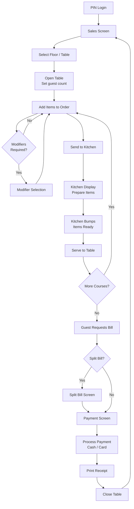
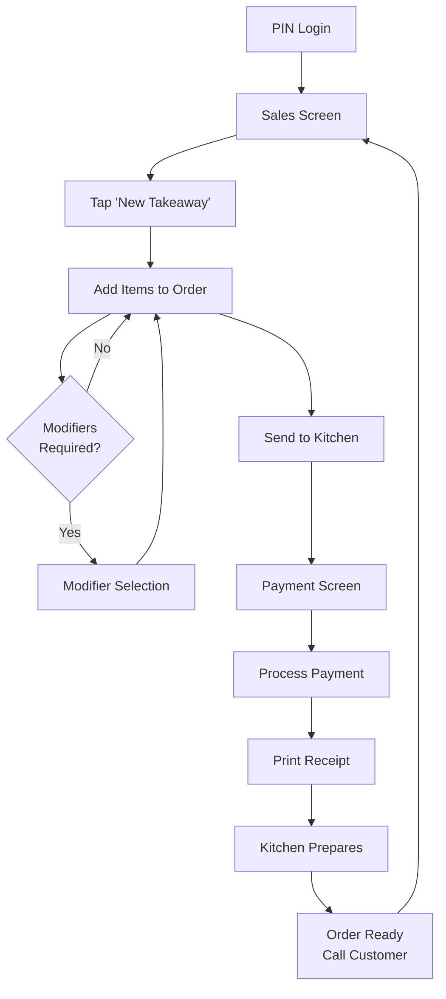
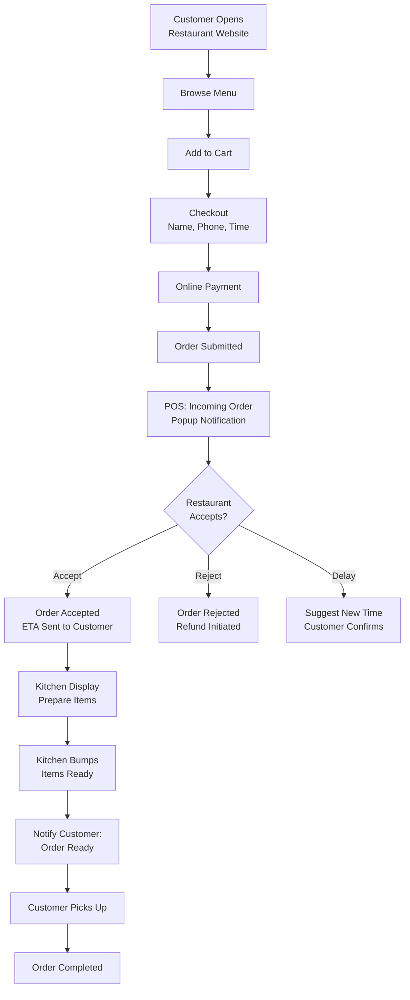
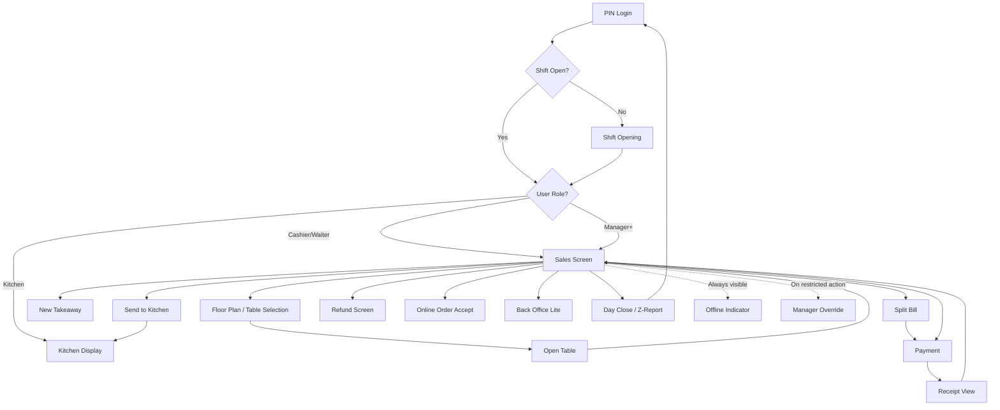

# UX Flows

> **Document Status:** Living document | **Last Updated:** 2026-03-20 | **Owner:** Architecture Team

---

## Table of Contents

1. [User Journeys (Mermaid Flowcharts)](#1-user-journeys)
2. [Screen-by-Screen Specifications](#2-screen-specifications)

---

## 1. User Journeys

### 1.1 Dine-In Order Flow

### 1.2 Takeaway / Quick Sale Flow

### 1.3 Online Order Flow

---

## 2. Screen Specifications

---

### Screen 1: PIN Login

**Purpose:** Authenticate staff members quickly using a numeric PIN, optimized for fast user switching during busy restaurant service.

**Primary Actions:**
1. Enter 4-6 digit PIN on the numeric keypad
2. Tap a user avatar for quick selection (pre-fills user, awaits PIN)
3. Submit PIN to authenticate

**Visible Fields/Elements:**
- User avatar grid (top): circular photos with first name, showing all active users for this branch
- Selected user highlight (blue border when tapped)
- Numeric keypad (center): digits 0-9, large touch targets (minimum 60x60px)
- PIN dots indicator: shows number of digits entered (masked)
- Clear button (backspace)
- Submit / Enter button
- App logo and branch name (top bar)
- Clock display (current time)

**Hidden/Secondary Actions:**
- Long-press app logo: access device settings (requires admin PIN)
- Triple-tap version number: diagnostic info panel

**Error States:**
- Invalid PIN: shake animation on PIN dots, "Invalid PIN" message, clear input after 1 second
- Account locked: after 5 failed attempts, 5-minute lockout with countdown timer
- No users configured: "No users found. Please set up staff in Back Office." with setup link

**Offline Behavior:** Fully functional. PIN hashes are stored locally. No network required.

**Role Access:** All roles see this screen. The user list shows only active users assigned to this branch.

**Sketch Description:** Full-screen layout. Top third: horizontal scrollable row of user avatars (circles with photo and name). Center: 4-6 PIN dots in a row. Bottom two-thirds: numeric keypad grid (3 columns x 4 rows: 1-9, clear-0-enter). Background: subtle branded gradient.

---

### Screen 2: Shift Opening

**Purpose:** Begin a cashier shift by recording the opening cash count, ensuring accountability for cash handling throughout the shift.

**Primary Actions:**
1. Enter opening cash amount using numeric keypad
2. Select cash drawer (if multiple configured)
3. Confirm and open shift

**Visible Fields/Elements:**
- Greeting: "Good morning, {user name}" with date and time
- Cash amount input field (large, center): formatted as currency (e.g., CHF 200.00)
- Numeric keypad with decimal point
- Quick amount buttons: CHF 100, CHF 200, CHF 300, CHF 500
- Cash drawer selector (dropdown, if multiple drawers)
- "Open Shift" confirmation button (large, green)
- Last shift summary card: previous shift closer, closing time, closing cash amount

**Hidden/Secondary Actions:**
- Tap last shift card: view detailed Z-report from previous shift
- Skip cash count: available for manager role only (records zero opening)

**Error States:**
- Shift already open: "A shift is already open on this device. Please close it first." with link to Day Close
- Negative amount: validation prevents entry
- Cash drawer busy: "Cash drawer {X} is currently used by {user}. Select another drawer."

**Offline Behavior:** Fully functional. Shift data is stored locally.

**Role Access:** cashier, manager, admin, owner. Waiter and kitchen roles skip this screen and go directly to their primary view.

**Sketch Description:** Centered card layout on branded background. Card contains greeting at top, large currency input in center with quick-amount chips below, cash drawer dropdown, and full-width green "Open Shift" button at bottom. Previous shift summary as a smaller card below.

---

### Screen 3: Sales Screen (Main POS)

**Purpose:** The primary working screen for taking orders. Displays the menu for item selection on the left and the current order on the right.

**Primary Actions:**
1. Browse categories (horizontal tabs at top of left panel)
2. Tap a product to add it to the current order
3. Adjust item quantity (+/- buttons on the order line)
4. Send selected items to kitchen
5. Navigate to payment

**Visible Fields/Elements:**
- **Left panel (60% width):**
  - Category tabs: horizontal scrollable row, color-coded, with icons
  - Product grid: 3-4 columns of product cards (name, price, optional image thumbnail)
  - Search bar (top): type to filter products by name, SKU, or barcode
  - "Out of stock" overlay on unavailable products (greyed out, striped)
- **Right panel (40% width):**
  - Table info header: table number, guest count, waiter name, session duration timer
  - Order type badge: "Dine-in", "Takeaway", "Online"
  - Order items list: product name, quantity, modifiers, line total
  - Course dividers: "Course 1", "Course 2" separators
  - Subtotal, tax, discount, total at bottom
  - Action buttons row: "Send to Kitchen", "Payment", "More..."

**Hidden/Secondary Actions:**
- Long-press product: quick info popup (description, allergens, cost price for managers)
- Long-press order item: context menu (void, move to another ticket, change course, add note)
- Swipe order item left: quick delete (unsent items only)
- "More..." button: discount, transfer table, merge tickets, print interim bill, hold ticket
- Pull down on order panel: collapse to mini-view showing only total

**Error States:**
- No shift open: redirect to Shift Opening screen with message
- Product unavailable: toast "Item is currently unavailable" if tapped
- Kitchen printer offline: warning icon next to "Send to Kitchen" button, items still sendable (will queue)

**Offline Behavior:** Fully functional. All menu data, pricing, and order creation work locally. Sync status indicator shows in the top bar.

**Role Access:** cashier, waiter, manager, admin, owner. Kitchen role does not access this screen.

**Sketch Description:** Split-panel layout. Left 60%: top row of colored category tabs, below a 3-column grid of product cards (white cards with name and price, optional small image). Right 40%: table info bar at top (dark background), scrollable order item list in center, totals and action buttons fixed at bottom. Floating "+" button at bottom-right of left panel for manual item entry.

---

### Screen 4: Table Selection / Floor Plan

**Purpose:** Visual representation of the restaurant floor showing all tables with real-time status. Allows staff to select a table to open or view.

**Primary Actions:**
1. View floor plan with table status at a glance
2. Tap an available table to open it
3. Tap an occupied table to view/continue its order
4. Switch between floors using tabs

**Visible Fields/Elements:**
- Floor tabs (top): one tab per floor (e.g., "Main Floor", "Terrace", "Bar")
- Floor plan canvas: draggable/zoomable area showing table shapes
- Table shapes: squares, circles, rectangles positioned on the canvas
- Status colors:
  - Green: available (empty)
  - Blue: occupied (has open session)
  - Orange: waiting for food (items sent to kitchen)
  - Red: needs attention (waiting for bill, long wait time)
  - Grey: inactive/reserved
- Table labels: table number, guest count, waiter initials, session duration
- Total covers count and available table count in header

**Hidden/Secondary Actions:**
- Long-press table: context menu (transfer, merge, reserve, mark inactive)
- Double-tap empty area: zoom to fit all tables
- Pinch to zoom: navigate large floor plans
- Manager: drag tables to rearrange (edit mode)

**Error States:**
- No floors configured: "No floors set up. Go to Back Office to create floor plans." with link
- Floor plan loading: skeleton shimmer while rendering

**Offline Behavior:** Fully functional. Table status syncs between devices via local network or cloud when available. In pure offline mode, only this device's table state is visible.

**Role Access:** waiter, cashier, manager, admin, owner.

**Sketch Description:** Full-screen canvas with floor tabs at the top. The canvas shows a bird's-eye view of the restaurant floor with colored table shapes (squares and circles) positioned spatially. Each table shows its number in the center and a small status indicator. Legend bar at the bottom shows color meanings. Zoom controls (+ / -) in the bottom-right corner.

---

### Screen 5: Open Table

**Purpose:** Initialize a table session by setting the guest count and optionally assigning a waiter.

**Primary Actions:**
1. Confirm the selected table (shown at top)
2. Set guest count using +/- stepper or numeric input
3. Assign waiter (defaults to logged-in user)
4. Confirm to open the table

**Visible Fields/Elements:**
- Table info card: table number, floor name, seat capacity
- Guest count stepper: large +/- buttons with current count display
- Waiter selector: dropdown or avatar row of available waiters
- "Open Table" button (large, green)
- "Cancel" button

**Hidden/Secondary Actions:**
- Tap table info: view table history (recent sessions)
- Set guest count above seat capacity: confirmation prompt ("Table A3 has 4 seats. Seat 6 guests?")

**Error States:**
- Table already occupied: "Table A3 is already open. View current order?" with redirect
- Guest count zero: validation prevents, minimum 1

**Offline Behavior:** Fully functional.

**Role Access:** waiter, cashier, manager, admin, owner.

**Sketch Description:** Modal dialog overlaying the floor plan. Compact card with table details at top, large guest count stepper in the center (big minus, number, big plus), waiter dropdown below, and "Open Table" / "Cancel" buttons at the bottom.

---

### Screen 6: Add Item

**Purpose:** Add a product to the current order. For simple products, this is a single tap on the product card. For products with modifiers, a modifier selection popup appears.

**Primary Actions:**
1. Tap product card on the Sales Screen grid
2. If no required modifiers: item added immediately with quantity 1
3. If modifiers exist: modifier selection popup opens
4. Adjust quantity if needed

**Visible Fields/Elements:**
- Product card (on sales grid): name, price, optional image, availability indicator
- On tap (no modifiers): brief animation (card pulses, item slides into order panel)
- Quantity badge: appears on repeated taps (shows "x2", "x3", etc.)

**Hidden/Secondary Actions:**
- Long-press product card: quick info (description, allergens, nutritional info, cost price for managers)
- Barcode scan: auto-adds product by barcode, triggers modifier popup if applicable
- Manual entry: "Custom Item" button for items not on the menu (manager only)

**Error States:**
- Product unavailable: greyed out card, toast on tap "Item currently unavailable"
- Price list conflict: if active price list has no price for this product, use default price with info toast

**Offline Behavior:** Fully functional.

**Role Access:** waiter, cashier, manager, admin, owner.

**Sketch Description:** Not a separate screen. The interaction happens on the Sales Screen product grid. Tapping a product either instantly adds it (with a subtle animation) or triggers the Modifier Selection modal (Screen 7).

---

### Screen 7: Modifier Selection

**Purpose:** Select required and optional modifiers for a product before adding it to the order (e.g., pizza size, extra toppings, sauce choice).

**Primary Actions:**
1. Select required modifier options (highlighted group, must complete before confirm)
2. Optionally select additional modifiers from optional groups
3. Set quantity
4. Add special instructions (text field)
5. Confirm to add item to order

**Visible Fields/Elements:**
- Product name and base price at top
- Modifier groups listed vertically, each with:
  - Group name and requirement label ("Required - Choose 1", "Optional - Choose up to 3")
  - Option chips or radio buttons (single select) / checkboxes (multi select)
  - Each option: name, price modifier ("+CHF 2.00" or "included")
- Quantity stepper: +/- with current count
- Special instructions text field (collapsible)
- Running total at bottom (base price + selected modifiers x quantity)
- "Add to Order" button (disabled until required selections are made)
- "Cancel" button

**Hidden/Secondary Actions:**
- Long-press modifier option: see description or allergen info
- Swipe down: dismiss the modal (same as cancel)

**Error States:**
- Required group not selected: group header turns red, "Add to Order" button stays disabled
- Max selections exceeded: further options become disabled with tooltip "Maximum {n} selections reached"

**Offline Behavior:** Fully functional.

**Role Access:** waiter, cashier, manager, admin, owner.

**Sketch Description:** Bottom sheet modal (slides up from bottom, covers ~70% of screen). Product name and image at top. Scrollable list of modifier groups, each with a header and option chips. Required groups have a red asterisk. Bottom bar: quantity stepper on left, running total in center, "Add to Order" button on right.

---

### Screen 8: Send to Kitchen

**Purpose:** Fire selected items or courses to the kitchen, creating kitchen tickets for preparation. Items can be sent in courses (appetizers first, mains later).

**Primary Actions:**
1. Review items ready to send (unsent items highlighted)
2. Select/deselect individual items or entire courses
3. Set priority flag for rush orders
4. Tap "Fire" to send selected items to kitchen

**Visible Fields/Elements:**
- Order items grouped by course: "Course 1 (Starters)", "Course 2 (Mains)"
- Each item: checkbox, product name, quantity, modifiers, special instructions
- All unsent items checked by default
- Priority toggle: "Rush Order" switch (sends as priority to KDS)
- "Fire Selected" button (prominent, orange)
- "Fire All" button (secondary)
- Kitchen station routing preview: icons showing which station receives which items

**Hidden/Secondary Actions:**
- Drag items between courses to reassign
- Long-press item to edit before sending (quantity, modifiers, instructions)
- "Hold Course" button: mark a course as held (send when explicitly fired later)

**Error States:**
- No items to send: "All items have already been sent" message, button disabled
- Kitchen printer offline: warning "Kitchen printer is offline. Ticket will be queued."
- All items voided: redirect back to Sales Screen

**Offline Behavior:** Fully functional. Kitchen tickets created locally. If KDS devices are on the same local network, tickets appear via LAN sync. If fully disconnected, tickets queue for when connectivity returns.

**Role Access:** waiter, cashier, manager, admin, owner.

**Sketch Description:** Modal overlay on the Sales Screen. Checklist view with course headers (collapsible). Each item row has a checkbox, product info, and station indicator icon. Bottom bar: "Rush" toggle on left, "Fire Selected" button on right. A small preview shows the number of items going to each kitchen station.

---

### Screen 9: Kitchen Display (KDS)

**Purpose:** Show incoming kitchen tickets for preparation. Cooks see what to prepare, mark items as ready, and bump completed tickets. Optimized for wall-mounted displays or kitchen tablets.

**Primary Actions:**
1. View pending kitchen tickets (auto-refreshing)
2. Tap an item to mark it as "preparing"
3. Tap "Ready" to mark an item as ready
4. Tap "Bump" to complete the entire ticket (all items served)

**Visible Fields/Elements:**
- Ticket cards in a horizontal scrollable row (or grid, 3-4 columns)
- Each ticket card:
  - Table number and order type (large, bold, top)
  - Timer: elapsed time since ticket was fired (color-coded: green <10min, yellow 10-20min, red >20min)
  - Item list: product name, quantity, modifiers, special instructions (highlighted in yellow)
  - Priority badge: "RUSH" label in red if flagged
  - Course number indicator
  - "Bump" button at bottom of card
- Station filter tabs: "All", "Grill", "Cold", "Bar" (filter by kitchen station)
- Completed tickets section (collapsed): shows recently bumped tickets for recall
- Sound notification: audible chime on new ticket arrival

**Hidden/Secondary Actions:**
- Long-press ticket: recall a bumped ticket (un-bump)
- Swipe ticket left: move to "problem" queue (missing ingredient, etc.)
- Tap timer: shows exact timestamps (sent, started, ready)
- Double-tap bump: bump and auto-print next course fire confirmation

**Error States:**
- No pending tickets: "All caught up! No pending orders." with relaxed illustration
- Connection lost to POS: "Waiting for connection..." banner at top, retrying indicator

**Offline Behavior:** Functional on local network. KDS receives tickets via LAN sync from POS devices. If fully offline from cloud, still works with local devices. If isolated from all other devices, shows a connection warning.

**Role Access:** kitchen, manager, admin, owner. This is the primary (and often only) screen kitchen staff uses.

**Sketch Description:** Full-screen dark background (easier on kitchen eyes, resists glare). Horizontal row of ticket cards, each a white card with bold table number at top, item list in the middle, timer and bump button at bottom. Station filter tabs along the top. New tickets slide in from the right. Tickets turn from white to light-yellow when old. Bumped tickets slide out to the left.

---

### Screen 10: Split Bill

**Purpose:** Divide a table's order into multiple bills for separate payment. Supports splitting by item, equal division, or custom amounts.

**Primary Actions:**
1. Choose split method: "By Item", "Equal Split", "Custom Amount"
2. For By Item: drag or tap items to assign them to Bill A, Bill B, etc.
3. For Equal Split: set number of ways to split, review amounts
4. For Custom Amount: enter specific amounts for each bill
5. Proceed to payment for each bill individually

**Visible Fields/Elements:**
- Split method selector: three tabs/buttons at top
- **By Item view:** Two (or more) columns side by side, each representing a bill. Order items are draggable between columns. Each column shows subtotal.
- **Equal Split view:** Number-of-ways stepper, preview showing amount per person, total and per-person amount prominently displayed
- **Custom Amount view:** List of bill rows with editable amount fields, remaining unassigned amount shown
- Original order total at the top for reference
- "Add Another Bill" button (for more than 2-way split)
- "Pay Bill A" button on each column

**Hidden/Secondary Actions:**
- Long-press item in "By Item" mode: split a single item across bills (e.g., share a bottle of wine)
- "Reset" button: undo all split assignments, start over
- Seat-based split: if seat numbers were assigned, auto-suggest split by seat

**Error States:**
- Amounts do not sum to total (Custom Amount): red warning, "Remaining: CHF X.XX unassigned"
- Empty bill: warning "Bill B has no items" before proceeding

**Offline Behavior:** Fully functional.

**Role Access:** waiter, cashier, manager, admin, owner.

**Sketch Description:** Split-panel layout. Top bar: three method tabs ("By Item", "Equal", "Custom"). By Item view: two side-by-side columns with drag handles on items. The left column is "Bill A" and the right is "Bill B" with a "+" button to add Bill C. Each column has its subtotal at the bottom. A "Pay" button beneath each column.

---

### Screen 11: Payment Screen

**Purpose:** Process payment for a bill. Supports cash, card, and other payment methods. Calculates change and handles tips.

**Primary Actions:**
1. Review bill total
2. Select payment method (cash, card, mobile, voucher)
3. For cash: enter tendered amount, view calculated change
4. For card: initiate terminal transaction
5. Optionally add tip
6. Confirm payment

**Visible Fields/Elements:**
- Bill summary: items count, subtotal, tax, discount, rounding, total (large, prominent)
- Payment method buttons: "Cash", "Card", "Mobile Pay", "Voucher" (large, icon + label)
- **Cash mode:**
  - "Amount Due" display (large)
  - Quick tender buttons: exact amount, round-up amounts (CHF 20, CHF 50, CHF 100)
  - Numeric keypad for custom tender amount
  - "Change Due" display (large, green, appears after amount entered)
- **Card mode:**
  - "Present card on terminal" instruction with animation
  - Terminal status: "Waiting for card...", "Processing...", "Approved"
  - Terminal reference displayed on success
- Tip section (collapsible): preset percentages (5%, 10%, 15%) or custom amount
- "Complete Payment" button
- "Back" button to return to order

**Hidden/Secondary Actions:**
- Split tender: pay partially with one method, remainder with another (e.g., CHF 20 cash + rest on card)
- Discount: apply percentage or fixed discount (manager override required for >10%)
- "Park" payment: return to order without completing (e.g., customer needs to get wallet)

**Error States:**
- Card declined: "Payment declined. Please try another card or payment method."
- Terminal not connected: "Payment terminal not available. Use cash or check terminal connection."
- Insufficient tender (cash): "Amount tendered is less than amount due" - prevents completion
- Payment terminal timeout: after 60 seconds, option to cancel or retry

**Offline Behavior:** Cash payments fully functional offline. Card payments depend on the payment terminal's own offline capability. If terminal is network-based, card payments may be unavailable offline -- cash is always available.

**Role Access:** cashier, waiter (for card-only, no cash access in some configurations), manager, admin, owner.

**Sketch Description:** Full-screen layout. Top third: bill summary card (items, taxes, total). Middle: payment method button row (4 large square buttons with icons). Bottom two-thirds: context-dependent based on selected method. For cash: quick tender row + numeric keypad + change display. For card: centered terminal instruction with animated card icon and status text.

---

### Screen 12: Refund Screen

**Purpose:** Process a refund for previously paid items. Requires manager authorization for all refunds.

**Primary Actions:**
1. Search for the original order (by receipt number, date, or table)
2. Select items to refund (or full order)
3. Enter refund reason (required)
4. Manager enters authorization PIN
5. Process refund

**Visible Fields/Elements:**
- Order search: search field (receipt number or date range selector)
- Original order details: date, table, items, payments, total
- Item selection: checkboxes next to each item, with quantity adjuster (for partial item refund)
- Refund amount calculation: auto-calculated based on selected items
- Reason field: dropdown (customer complaint, wrong item, quality issue, other) + free text
- Manager authorization section: "Manager PIN required" with PIN pad
- "Process Refund" button (red, prominent)
- Refund method: auto-selects original payment method (cash refund for cash, card reversal for card)

**Hidden/Secondary Actions:**
- Full refund shortcut: "Refund All" button (selects all items)
- View receipt: preview the original receipt
- Audit note: additional text field for internal notes (not printed on refund receipt)

**Error States:**
- Order not found: "No order found with this receipt number."
- Already refunded: "This order has already been fully refunded."
- Manager PIN invalid: "Invalid manager PIN. Authorization required."
- Refund amount exceeds original: validation prevents this
- Card reversal failed: "Card reversal failed. Process as cash refund?" (manager decides)

**Offline Behavior:** Refunds can be processed offline. The refund record is stored locally and synced to cloud when connectivity returns. Card reversals may fail offline; in that case, a cash refund with a note is recorded.

**Role Access:** manager, admin, owner initiate. Cashier can start the flow but the manager PIN step is always required.

**Sketch Description:** Two-panel layout. Left panel: order search at top, then order details with item list (checkboxes). Right panel: refund summary (selected items, refund amount), reason dropdown, free text field, manager PIN pad, and red "Process Refund" button at bottom.

---

### Screen 13: Receipt View

**Purpose:** Display an on-screen preview of the receipt before or after printing. Allows reprinting and email sending.

**Primary Actions:**
1. View receipt content on screen
2. Print receipt (physical printer)
3. Reprint receipt (duplicate copy)
4. Email receipt to customer (if email provided)

**Visible Fields/Elements:**
- Receipt preview card (styled to resemble a paper receipt):
  - Restaurant name, address, phone (header)
  - Receipt number, date, time
  - Waiter name, table number
  - Itemized list: name, quantity, unit price, line total
  - Subtotal, discount, tax breakdown, total
  - Payment method and amount
  - Tip amount (if applicable)
  - Fiscal data: TSE signature, QR code (Germany)
  - Receipt footer (customizable message)
- "Print" button (primary)
- "Reprint" button (secondary, prints with "DUPLICATE" header)
- "Email" button (opens email input or uses stored customer email)
- "Close" button

**Hidden/Secondary Actions:**
- Tap QR code: enlarge for scanning
- Long-press receipt: copy receipt text to clipboard
- "PDF" option: generate and save PDF version

**Error States:**
- Printer offline: "Printer not available. Receipt saved. You can reprint later."
- Email send failure: "Could not send email. Check internet connection."
- No fiscal signature (Germany): "Warning: Receipt not fiscally signed. Check TSE connection."

**Offline Behavior:** On-screen view always works. Printing works if printer is locally connected (Bluetooth/USB/LAN). Email sending requires internet.

**Role Access:** All POS roles (waiter, cashier, manager, admin, owner).

**Sketch Description:** Modal overlay with a centered white card resembling a thermal receipt (narrow, tall aspect ratio). Receipt content is rendered with monospace-style font. Action buttons in a row below the receipt preview: "Print", "Email", "Close". Scroll within the receipt if content is long.

---

### Screen 14: Day Close / Z-Report

**Purpose:** Close the current shift with a Z-report. Staff counts the cash drawer and the system calculates any variance between expected and actual cash.

**Primary Actions:**
1. View shift summary (auto-calculated)
2. Enter closing cash count
3. Review cash variance (expected vs. actual)
4. Add closing notes if needed
5. Confirm and close shift

**Visible Fields/Elements:**
- Shift summary card:
  - Shift duration: opened time to now
  - Total sales (gross and net)
  - Order count, void count, refund count
  - Breakdown by payment method: cash sales, card sales, other
  - Cash movements: cash in, cash out during shift
  - Expected cash in drawer (opening + cash sales + cash in - cash out - cash refunds)
- Cash count section:
  - Denomination counter (optional): fields for each bill/coin denomination
  - Total counted amount (large display)
  - Quick entry: just enter total instead of counting by denomination
- Variance display: Expected vs. Counted, with difference highlighted (green if zero, red if negative, yellow if positive)
- Notes text field
- "Close Shift" button (large, requires confirmation)

**Hidden/Secondary Actions:**
- "Print Z-Report" before closing: preview the report
- "Denomination Count" toggle: switch between quick total and detailed denomination counting
- View shift details: drill into individual transactions
- Manager override: if variance exceeds threshold (e.g., CHF 10), manager PIN required

**Error States:**
- Open tickets remaining: "You have {n} open tickets. Close or void them before ending shift."
- Large variance: "Cash variance exceeds CHF 10. Manager approval required." (PIN prompt)
- No cash entered: "Please enter the cash count to close the shift."

**Offline Behavior:** Fully functional. Z-report is generated locally and synced to cloud later.

**Role Access:** cashier (their own shift), manager, admin, owner (any shift).

**Sketch Description:** Single scrollable page. Top section: shift summary in a card with grid of key metrics (total sales, order count, payment breakdown). Middle section: cash count input area with large numeric display. Bottom section: variance display (green/red), notes field, and large "Close Shift" button. Optional expandable denomination counter section.

---

### Screen 15: Manager Override

**Purpose:** Authorize privileged actions (void, refund, discount, etc.) by entering a manager PIN. This is a modal that appears over the current screen whenever a restricted action is requested.

**Primary Actions:**
1. View the action requiring authorization (what and why)
2. Manager enters their PIN
3. System validates and authorizes (or denies) the action

**Visible Fields/Elements:**
- Action description: "Void item: 2x Margherita Pizza (CHF 29.00)" or "Apply 20% discount"
- Requested by: user name who initiated the action
- Manager PIN pad: numeric keypad with PIN dots
- "Authorize" button
- "Cancel" button

**Hidden/Secondary Actions:**
- Audit trail: the override is automatically logged with the manager's identity, the authorized action, and the timestamp
- Multiple manager PINs: any user with manager/admin/owner role can authorize

**Error States:**
- Invalid PIN: "Invalid PIN. Please try again." (3 attempts then 1-minute lockout)
- PIN belongs to non-manager: "This user does not have authorization privileges."
- Action no longer valid: "The item has already been removed." (edge case if another user modified the order)

**Offline Behavior:** Fully functional.

**Role Access:** The modal is triggered by waiter/cashier actions. Only manager, admin, owner PINs are accepted.

**Sketch Description:** Centered modal dialog over a dimmed background. Top: lock icon and action description. Middle: PIN dots and numeric keypad. Bottom: "Authorize" (green) and "Cancel" (grey) buttons. Compact design, does not cover the full screen.

---

### Screen 16: Device Pairing

**Purpose:** Register a new device with the cloud hub and associate it with a branch. Used during initial setup or when adding new terminals.

**Primary Actions:**
1. Scan QR code displayed on the admin dashboard (camera-based)
2. Or enter a 6-character pairing code manually
3. Device registers with the cloud and downloads initial data

**Visible Fields/Elements:**
- Welcome screen with product logo
- Two pairing options:
  - QR code scanner (camera viewfinder area)
  - Manual code entry: 6-character alphanumeric field with large input
- Pairing progress: step indicator (1. Connect, 2. Download Data, 3. Ready)
- Download progress bar during initial data seed
- Success confirmation with branch name and device role assignment

**Hidden/Secondary Actions:**
- "Use offline only" option: skip pairing, enter license key manually (for offline-only deployments)
- Network diagnostics: button to test connectivity to cloud endpoint

**Error States:**
- Invalid pairing code: "Pairing code not recognized. Please check the code and try again."
- Code expired: "This pairing code has expired. Generate a new one from the admin dashboard."
- Network error: "Cannot reach the server. Check your internet connection." with retry button
- Device limit reached: "Your license allows {n} devices. Please upgrade or remove a device."

**Offline Behavior:** This screen requires internet connectivity for QR/code pairing. The "offline only" option works without internet but requires a license key.

**Role Access:** admin, owner (initial setup). Not accessible after pairing without factory reset.

**Sketch Description:** Centered single-column layout. Product logo at top. Two-tab selector: "Scan QR" and "Enter Code". QR tab shows a camera viewfinder rectangle. Code tab shows 6 large input boxes (one per character). Progress steps below. Clean, minimal design focused on the setup task.

---

### Screen 17: Offline Indicator

**Purpose:** Persistent visual indicator of the device's connectivity and sync status. Always visible on every screen, providing at-a-glance awareness.

**Primary Actions:**
1. Glance at the status bar to see connectivity state
2. Tap the indicator for detailed sync information

**Visible Fields/Elements:**
- Status bar element (top-right of every screen):
  - Green dot + "Online": connected and synced
  - Yellow dot + "Syncing": connected, sync in progress
  - Orange dot + "Pending (12)": connected but items waiting to sync, with count
  - Red dot + "Offline": no connectivity
- When tapped, expanded panel shows:
  - Last successful sync timestamp
  - Pending upload count by entity type
  - Pending download indicator
  - "Sync Now" manual trigger button
  - Connection details (WiFi name, cloud endpoint status)

**Hidden/Secondary Actions:**
- Long-press: open network diagnostics
- Automatic retry: visual pulse animation during retry attempts

**Error States:**
- Extended offline (>1 hour): amber banner at top of Sales Screen: "Operating offline. Data will sync when connection is restored."
- Sync conflict detected: badge on indicator, details in expanded panel
- License validation overdue: after 60 days offline, gentle warning in expanded panel

**Offline Behavior:** This IS the offline behavior indicator. The POS continues to function normally regardless of indicator state.

**Role Access:** Visible to all roles. Detailed panel accessible to all roles.

**Sketch Description:** Not a standalone screen. A small status pill in the top-right corner of every screen. The pill shows a colored dot and short text. Tapping it slides down a panel (similar to notification shade) with detailed sync information and a "Sync Now" button.

---

### Screen 18: Online Order Acceptance

**Purpose:** Alert restaurant staff when a new online order arrives, allowing them to accept, reject, or delay the order.

**Primary Actions:**
1. View incoming order details in the popup
2. Accept the order (with estimated preparation time)
3. Reject the order (with reason)
4. Delay: suggest a different pickup/delivery time

**Visible Fields/Elements:**
- Notification popup (overlays current screen with audible alert):
  - "New Online Order" header with channel icon (web, QR, kiosk)
  - Order number and customer name
  - Order items list with quantities and modifiers
  - Requested time: "Pickup at 18:30" or "ASAP"
  - Order total
  - Payment status: "Pre-paid" or "Pay on pickup"
- Action buttons:
  - "Accept" (green): opens time picker for estimated ready time
  - "Reject" (red): opens reason selector
  - "Delay" (yellow): propose alternative time
- Auto-reject timer: if no action within 5 minutes, configurable auto-behavior

**Hidden/Secondary Actions:**
- Tap order items: see modifiers and special instructions in detail
- "View on map" for delivery orders (future feature)
- Configure auto-accept: in settings, orders can be auto-accepted during certain hours

**Error States:**
- Item unavailable: warning icon next to unavailable items, "Some items may be unavailable"
- Acceptance timeout: "Order auto-rejected due to timeout" notification
- Customer cancelled: "This order has been cancelled by the customer" (dimmed popup, dismiss only)

**Offline Behavior:** Online orders require connectivity by definition. If the device goes offline after receiving the notification, the acceptance/rejection is queued and sent when connectivity returns.

**Role Access:** cashier, manager, admin, owner. Audio notification reaches all logged-in POS devices.

**Sketch Description:** Modal popup centered on screen with a semi-transparent dark overlay. Card contains a header with order channel icon, customer details, scrollable item list, order total, and three action buttons at the bottom (Accept/Delay/Reject). A countdown timer or auto-reject indicator is shown in the top-right of the card.

---

### Screen 19: Kiosk Browse

**Purpose:** Customer-facing self-service menu browsing on a kiosk device. Full-screen, touch-optimized with large images and simple navigation.

**Primary Actions:**
1. Browse categories (large buttons or horizontal scroll)
2. Tap a product to see details and add to cart
3. View and modify cart
4. Proceed to checkout

**Visible Fields/Elements:**
- Restaurant branding: logo, name, background theme
- Language selector: flag icons (DE, FR, EN, IT)
- Category navigation: large image cards or horizontal scroll of category pills
- Product grid: 2-3 columns of large product cards with:
  - Full product image (dominant)
  - Product name (large text)
  - Price (prominent)
  - Brief description
  - Allergen icons
  - "Add" button
- Cart summary bar (bottom): item count, running total, "View Cart" button
- "Start Over" button (top corner)
- Idle screen: attract-loop with promotional images when no interaction for 2 minutes

**Hidden/Secondary Actions:**
- Tap allergen icon: full allergen information modal
- Scroll down on product detail: nutritional information
- Accessibility: high contrast mode toggle, text size adjustment

**Error States:**
- Product unavailable: greyed out with "Unavailable" overlay
- Session timeout: "Are you still there?" prompt, then reset to idle screen after 30 seconds
- Payment terminal error: "Please ask staff for assistance" with staff call button

**Offline Behavior:** Kiosk requires connectivity for order submission. Menu can be cached locally for browsing. If connectivity is lost, a "temporarily unavailable" screen is shown after the customer tries to submit an order.

**Role Access:** Customer-facing. No staff login required. Configuration is done via the kiosk device setup.

**Sketch Description:** Full-screen portrait layout optimized for a 10-15 inch touch display. Top: restaurant logo and name. Below: large category buttons in a 2-column grid or horizontal carousel. Main area: 2-column product grid with large food images. Bottom: sticky cart bar showing item count, total, and "View Cart" button. All touch targets are minimum 80x80px. Font sizes are large for readability.

---

### Screen 20: Kiosk Checkout

**Purpose:** Order summary and payment for the kiosk self-service flow. Integrates with the in-store payment terminal for card-only payments.

**Primary Actions:**
1. Review order summary
2. Choose order type (dine-in or takeaway)
3. Initiate payment on the integrated terminal
4. Receive order number confirmation

**Visible Fields/Elements:**
- Order summary: large list of items with quantities, modifiers, prices
- Edit buttons: quantity +/- and remove for each item
- Order type selector: two large buttons "Eat Here" / "Take Away" with icons
- Order total (very large, prominent)
- "Pay Now" button (large, green, full width)
- After tapping Pay:
  - Payment terminal instruction: "Please tap or insert your card" with animated card icon
  - Terminal status: "Waiting...", "Processing...", "Approved!"
- Success screen:
  - Large order number: "Your order number: K-0015"
  - "Your order is being prepared"
  - Estimated wait time
  - Receipt printing indicator
- "Cancel Order" button (secondary, small)

**Hidden/Secondary Actions:**
- Staff assistance button: discreet "Need Help?" button that alerts staff
- Receipt options: "Print Receipt" / "No Receipt" after successful payment

**Error States:**
- Payment declined: "Payment was not successful. Please try again or ask staff for help."
- Terminal timeout: "Payment timed out. Please try again." with retry button
- Terminal disconnected: "Payment terminal is not available. Please ask staff for assistance."

**Offline Behavior:** Kiosk checkout requires connectivity for order submission and payment processing. If connectivity is lost during checkout, the customer sees "We are having technical difficulties. Please order at the counter."

**Role Access:** Customer-facing.

**Sketch Description:** Full-screen portrait layout. Top half: scrollable order summary with item details and edit controls. Middle: two large order-type buttons side by side ("Eat Here" with plate icon, "Take Away" with bag icon). Bottom: large total display and full-width "Pay Now" button. After payment, transitions to a success screen with large order number centered, animated checkmark, and estimated wait time.

---

### Screen 21: QR Mobile Order

**Purpose:** Customer scans a QR code at their table to browse the menu and place an order from their own phone. Responsive web interface, not a native app.

**Primary Actions:**
1. Scan QR code (opens browser to restaurant's order page)
2. Browse menu categories and products
3. Add items to cart with modifiers
4. Submit order (linked to table)
5. Track order status

**Visible Fields/Elements:**
- Mobile-optimized responsive web page:
  - Restaurant header: name, logo, table number (auto-detected from QR)
  - Category tabs: horizontal scrollable pills
  - Product list: vertical cards with image, name, price, description
  - Product detail sheet: slides up from bottom, shows modifiers and "Add to Cart"
  - Cart icon with badge count (top-right)
  - Cart page: item list, subtotal, "Place Order" button
  - Order confirmation: order number, status tracker (ordered -> preparing -> ready)
- Language selector
- Allergen filter toggle

**Hidden/Secondary Actions:**
- "Call Waiter" button: sends notification to POS
- Reorder: quick-add previous items if returning customer
- Special instructions per item

**Error States:**
- QR code expired or invalid: "This QR code is not active. Please ask your waiter."
- Table not found: "Could not identify your table. Please scan the QR code again."
- Restaurant closed: "We are currently not accepting orders. Opening hours: ..."
- Item unavailable: "Sorry, {item} is currently not available" with remove from cart option

**Offline Behavior:** The customer needs internet to use this feature. If the restaurant's system is offline, orders queue on the cloud and push to the device when it reconnects.

**Role Access:** Customer-facing (web page). Orders appear on the POS as online orders.

**Sketch Description:** Mobile phone viewport (375px wide). Sticky header with restaurant name and table number. Horizontal category scroll below header. Vertical list of product cards (image left, details right, or stacked image on top). Bottom tab bar: "Menu", "Cart" (with count badge), "Order Status". Clean, minimal design with restaurant branding colors.

---

### Screen 22: Back Office Lite (On-Device)

**Purpose:** On-device management interface for basic configuration tasks: menu editing, table layout editing, staff management, and viewing basic reports. Avoids the need to use the cloud dashboard for common tasks.

**Primary Actions:**
1. Edit menu: add/edit/reorder categories and products
2. Edit floor plan: add/reposition/resize tables
3. Manage staff: add/edit users, set PINs, assign roles
4. View basic reports: today's sales, top products, shift history

**Visible Fields/Elements:**
- Tab navigation (left sidebar or bottom tabs):
  - "Menu" tab: category list -> product list -> product edit form
  - "Tables" tab: floor selector -> drag-and-drop table editor
  - "Staff" tab: user list -> user edit form (name, role, PIN, branches)
  - "Reports" tab: today's summary, weekly trend chart, top 10 products
- Each tab has a list view and a detail/edit form
- "Save" and "Cancel" buttons on all edit forms
- Search functionality within lists

**Hidden/Secondary Actions:**
- Bulk operations: select multiple products to change category, toggle availability
- Import: CSV import for menu items (future)
- Export: export reports as CSV
- Reorder via drag-and-drop (categories, products)

**Error States:**
- Validation errors on forms: inline field-level errors (e.g., "Product name is required")
- Duplicate SKU: "A product with SKU {X} already exists"
- Delete in use: "Cannot delete category {X} because it contains {n} products. Move or delete products first."

**Offline Behavior:** Fully functional. All changes are stored locally and synced to cloud when connected.

**Role Access:** manager, admin, owner only. Cashier and waiter cannot access Back Office.

**Sketch Description:** Left sidebar navigation with icons and labels (Menu, Tables, Staff, Reports). Main content area on the right. List views show items in a table/card format with search bar at top. Edit forms are standard form layouts with labeled fields, dropdowns, toggles, and save/cancel buttons. The floor plan editor shows a canvas with draggable table shapes and a properties panel on the right.

---

### Screen 23: Cloud Admin Dashboard

**Purpose:** Web-based dashboard for restaurant owners and managers to view multi-branch analytics, manage settings, and administer the platform. Accessed via browser, not on the POS device.

**Primary Actions:**
1. View multi-branch revenue and order metrics
2. Drill into individual branch performance
3. Manage menu centrally (push to all branches)
4. Manage users and permissions
5. View device health and sync status
6. Configure online ordering, kiosk, and webhook settings
7. Manage subscription and billing

**Visible Fields/Elements:**
- **Dashboard home:**
  - KPI cards: today's revenue, order count, average ticket, covers
  - Revenue chart: line chart by day/week/month, branch comparison
  - Top products: bar chart, sortable
  - Active devices: list with status indicators (online/offline/last seen)
- **Branch management:**
  - Branch list with key metrics per branch
  - Branch detail: floor plans, tables, devices, staff assigned
- **Menu management:**
  - Centralized menu editor (same as Back Office Lite but web-based)
  - Push menu changes to selected branches
- **Reports section:**
  - Sales reports, product reports, shift reports, staff performance
  - Date range selector, branch filter, export to CSV/PDF
- **Settings:**
  - Receipt customization (header, footer, logo)
  - Tax configuration per country
  - Online ordering settings
  - Webhook configuration
  - API key management (Enterprise tier)
- **Subscription:**
  - Current plan, usage, billing history
  - Upgrade/downgrade options

**Hidden/Secondary Actions:**
- API documentation link (Enterprise tier)
- Webhook testing: send test event
- Device remote actions: request sync, view logs
- Impersonate branch: view dashboard as a specific branch

**Error States:**
- No data: "No sales data for the selected period."
- Branch offline: "Branch {X} has not synced in {duration}. Last seen: {time}."
- Subscription expiring: banner "Your subscription expires in {n} days. Renew now."

**Offline Behavior:** The cloud dashboard requires internet. It is a web application hosted on the cloud hub.

**Role Access:** owner, admin. Manager with limited scope (their branch only).

**Sketch Description:** Standard web dashboard layout. Left sidebar navigation: Dashboard, Branches, Menu, Reports, Devices, Settings, Subscription. Main content area with responsive grid. Dashboard home shows KPI cards in a top row, charts below in a 2-column grid, and device/alert lists further down. Responsive: collapses to single column on tablet, sidebar becomes hamburger menu on mobile.

---

## Appendix: Navigation Map

