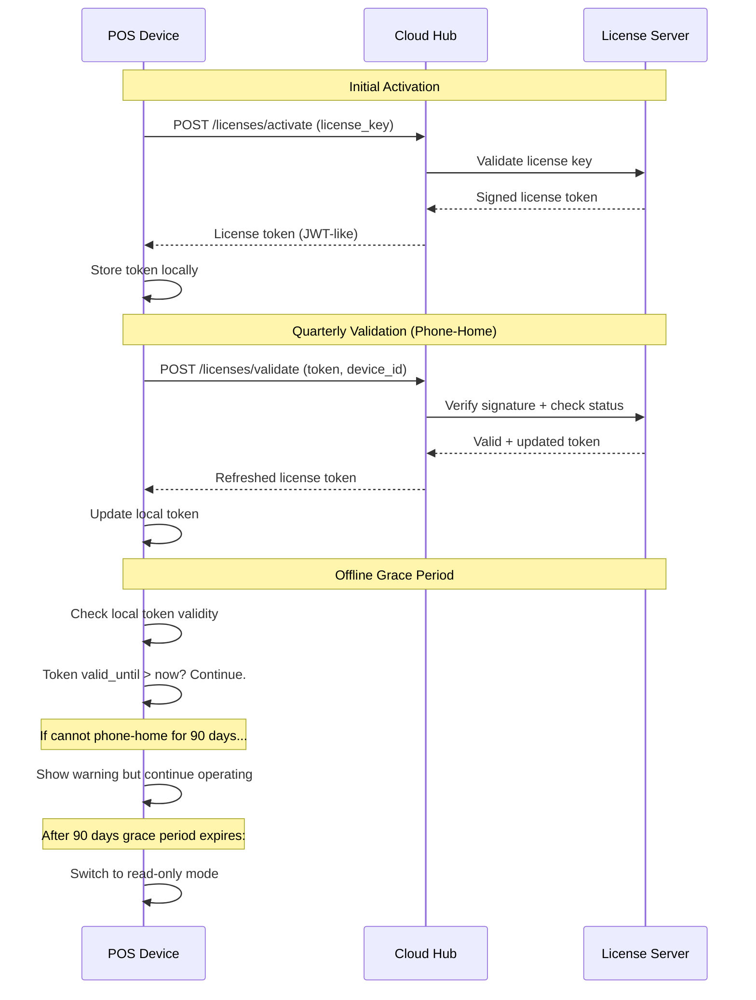
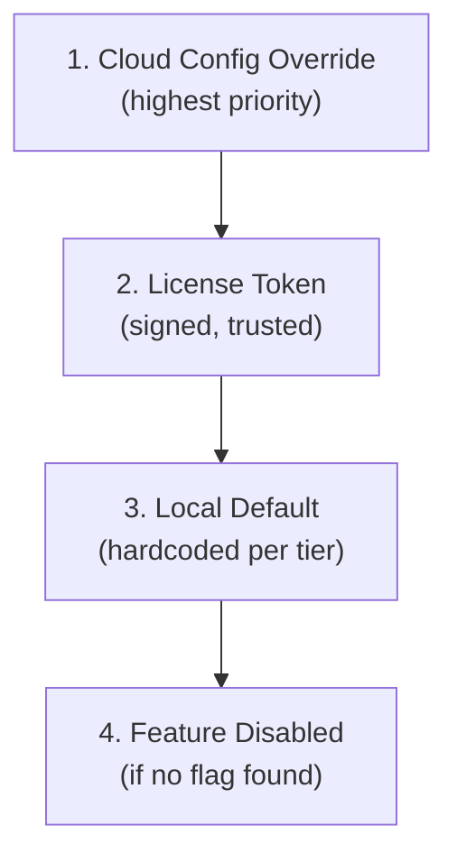
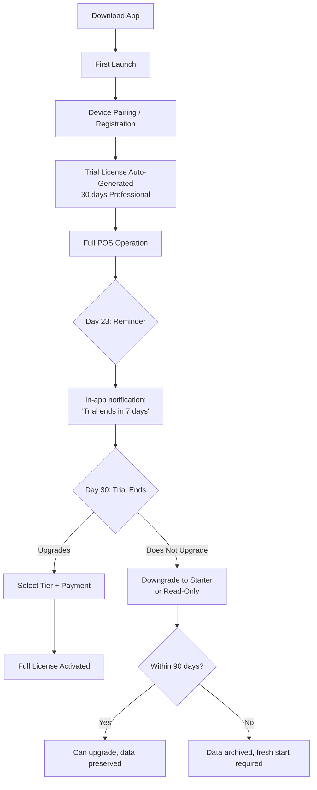

# Pricing, Licensing, and Packaging

> **Document Status:** Living document | **Last Updated:** 2026-03-20 | **Owner:** Architecture Team

---

## Table of Contents

1. [Product Tiers](#1-product-tiers)
2. [Feature Matrix](#2-feature-matrix)
3. [Country Packs](#3-country-packs)
4. [Annual Offline License](#4-annual-offline-license)
5. [Feature Flags Model](#5-feature-flags-model)
6. [Trial](#6-trial)
7. [Pricing Strategy Rationale](#7-pricing-strategy-rationale)

---

## 1. Product Tiers

The platform offers three pricing tiers designed to match the growth trajectory of a restaurant business: from a single terminal to a multi-branch operation.

| | **Starter** | **Professional** | **Enterprise** |
|---|---|---|---|
| **Monthly price** | CHF 49/mo | CHF 79/mo | CHF 149/mo |
| **Annual price** | CHF 490/yr | CHF 790/yr | CHF 1,490/yr |
| **Annual savings** | CHF 98 (2 months free) | CHF 158 (2 months free) | CHF 298 (2 months free) |
| **Target customer** | Food truck, small cafe, market stall | Single restaurant, fast-casual | Multi-branch chain, hotel F&B |
| **Devices** | 1 | Up to 5 | Unlimited |
| **Branches** | 1 | 1 | Unlimited |

### 1.1 Starter (CHF 49/mo)

The entry-level tier for businesses that need a reliable, offline-capable POS without advanced features.

**Included:**
- 1 POS device (Android tablet)
- Full offline POS operation
- 1 floor plan
- Cash payment tracking
- Basic thermal receipt printing (USB/Bluetooth)
- Shift management (open/close with Z-report)
- Basic reports (daily sales, shift reports)
- Product catalog management
- Table management (single floor)
- Takeaway order support
- Local data backup

**Not included:**
- Kitchen Display System (KDS)
- Cloud sync and remote access
- Multi-floor plans
- Card payment tracking
- Branded receipts
- Staff performance reports
- Online ordering, QR ordering, kiosk
- Multi-branch management
- API access
- Country-specific fiscal compliance packs

### 1.2 Professional (CHF 79/mo)

The standard tier for operating restaurants that need kitchen communication, cloud reporting, and fiscal compliance.

**Everything in Starter, plus:**
- Up to 5 devices (POS terminals, KDS, waiter handhelds)
- Kitchen Display System (KDS) with station routing
- Cloud sync and remote dashboard access
- Multi-floor plans (unlimited floors per branch)
- Card payment tracking (terminal integration)
- Branded receipts (custom header, footer, logo)
- Full report suite (sales, products, staff, hourly, category)
- Staff management (roles, permissions, performance tracking)
- Bluetooth and network printer support
- Country pack included (Germany or Switzerland)
- Course management and table transfer
- Manager override and audit trail
- Bill splitting (by item, equal, custom)
- Modifier groups and product variants
- Price lists (time-based, channel-based)

### 1.3 Enterprise (CHF 149/mo)

The full-featured tier for multi-branch operations with omnichannel ordering and integrations.

**Everything in Professional, plus:**
- Unlimited devices
- Unlimited branches with central management
- Online ordering website integration
- QR code table ordering
- Self-service kiosk mode
- REST API access for custom integrations
- Webhook event subscriptions
- Priority email and chat support
- Custom receipt templates (HTML-based)
- Advanced analytics (trends, forecasts, comparisons)
- ERPNext accounting bridge
- Multi-branch menu management (central push)
- Cross-branch reporting and comparisons
- Device fleet management
- Custom feature flags (on request)

---

## 2. Feature Matrix

### 2.1 Detailed Feature Comparison

| Feature Category | Feature | Starter | Professional | Enterprise |
|---|---|---|---|---|
| **Devices** | POS terminals | 1 | Up to 5 | Unlimited |
| | Kitchen Display (KDS) | -- | Yes | Yes |
| | Waiter handheld | -- | Yes | Yes |
| | Self-service kiosk | -- | -- | Yes |
| **Operations** | Dine-in orders | Yes | Yes | Yes |
| | Takeaway orders | Yes | Yes | Yes |
| | Online orders (web) | -- | -- | Yes |
| | QR table ordering | -- | -- | Yes |
| | Course management | Basic (1 course) | Full (multi-course) | Full (multi-course) |
| | Bill splitting | -- | Yes | Yes |
| | Table transfer/merge | -- | Yes | Yes |
| **Menu** | Categories and products | Yes | Yes | Yes |
| | Modifier groups | Basic (1 group) | Unlimited | Unlimited |
| | Price lists | 1 (default) | Multiple | Multiple |
| | Product images | -- | Yes | Yes |
| | Allergen/tag management | -- | Yes | Yes |
| | Central menu push | -- | -- | Yes |
| **Payments** | Cash tracking | Yes | Yes | Yes |
| | Card payment tracking | -- | Yes | Yes |
| | Mobile payments | -- | Yes | Yes |
| | Tip recording | -- | Yes | Yes |
| | Refund processing | Basic | Full | Full |
| **Printing** | USB receipt printer | Yes | Yes | Yes |
| | Bluetooth printer | -- | Yes | Yes |
| | Network printer | -- | Yes | Yes |
| | Branded receipts | -- | Yes | Yes |
| | Custom receipt templates | -- | -- | Yes |
| | Kitchen ticket printing | -- | Yes | Yes |
| **Floor & Tables** | Floor plans | 1 | Unlimited | Unlimited |
| | Table shapes and positioning | Yes | Yes | Yes |
| | Real-time table status | Yes | Yes | Yes |
| | Table reservations | -- | -- | Future |
| **Staff** | PIN login | Yes | Yes | Yes |
| | Role-based access | Basic (2 roles) | Full (7 roles) | Full (7 roles) |
| | Manager override | -- | Yes | Yes |
| | Staff performance reports | -- | Yes | Yes |
| | Shift management | Yes | Yes | Yes |
| **Reports** | Daily sales summary | Yes | Yes | Yes |
| | Shift reports (Z-report) | Yes | Yes | Yes |
| | Product sales report | -- | Yes | Yes |
| | Hourly revenue | -- | Yes | Yes |
| | Category breakdown | -- | Yes | Yes |
| | Staff performance | -- | Yes | Yes |
| | Multi-branch comparison | -- | -- | Yes |
| | Trend analysis | -- | -- | Yes |
| | CSV/PDF export | -- | Yes | Yes |
| **Cloud & Sync** | Local data backup | Yes | Yes | Yes |
| | Cloud sync | -- | Yes | Yes |
| | Remote dashboard | -- | Yes | Yes |
| | Multi-branch dashboard | -- | -- | Yes |
| **Integrations** | ERPNext bridge | -- | -- | Yes |
| | REST API | -- | -- | Yes |
| | Webhooks | -- | -- | Yes |
| **Compliance** | Basic receipt | Yes | Yes | Yes |
| | Country pack (DE/CH) | -- | Included | Included |
| | Audit trail | Basic | Full | Full |
| | DSFinV-K export (DE) | -- | Yes (with DE pack) | Yes |
| **Support** | Email support | Yes | Yes | Yes |
| | Chat support | -- | Business hours | Priority 24/7 |
| | Phone support | -- | -- | Yes |
| | Onboarding assistance | -- | -- | Dedicated |

### 2.2 Role Availability by Tier

| Role | Starter | Professional | Enterprise |
|---|---|---|---|
| Owner | Yes | Yes | Yes |
| Admin | -- | Yes | Yes |
| Manager | -- | Yes | Yes |
| Cashier | Yes | Yes | Yes |
| Waiter | -- | Yes | Yes |
| Kitchen | -- | Yes | Yes |
| Kiosk | -- | -- | Yes |

Starter tier supports only "owner" and "cashier" roles. All users in Starter have either full access or cashier-level access.

---

## 3. Country Packs

Country packs contain the fiscal compliance modules, tax configurations, and localized receipt formats required for operating legally in a specific country. They are included at no extra cost in the Professional and Enterprise tiers.

### 3.1 Germany Pack

| Component | Detail |
|---|---|
| **Fiskaly TSE integration** | Cloud-based Technical Security Equipment (Technische Sicherheitseinrichtung) for digital receipt signing per KassenSichV |
| **DSFinV-K export** | Digitale Schnittstelle der Finanzverwaltung fur Kassensysteme -- standardized data export format for tax audits |
| **Receipt format** | German-compliant receipt with TSE signature, QR code, transaction number, and all mandatory fields |
| **Tax rates** | Pre-configured German VAT rates: 19% (standard), 7% (reduced for food/beverage takeaway), with date-based validity |
| **GoBD compliance** | Immutable audit trail, no data deletion, complete transaction history per Grundsatze ordnungsmassiger Buchfuhrung |
| **Belegausgabepflicht** | Mandatory receipt issuance for every transaction |

### 3.2 Switzerland Pack

| Component | Detail |
|---|---|
| **VAT rates** | Pre-configured Swiss VAT rates: 8.1% (standard), 2.6% (reduced for food/non-alcoholic beverages), 3.8% (accommodation), with date-based validity |
| **QR-bill support** | Swiss QR-bill format for invoicing (QR code with payment reference per SIX/ISO 20022) |
| **5-Rappen rounding** | Automatic rounding to nearest CHF 0.05 for cash payments (Swiss market convention) |
| **Receipt format** | Swiss-compliant receipt with VAT identification number (UID/MWST-Nr) and proper tax line formatting |
| **OR compliance** | Basic bookkeeping compliance per Obligationenrecht Art. 957-963 |
| **Multi-language** | Receipt and UI support for DE, FR, IT, EN (Swiss national languages) |

### 3.3 Future Country Packs (Roadmap)

| Country | Key Requirements | Target Release |
|---|---|---|
| **Austria** | Registrierkassensicherheitsverordnung (RKSV), A-Trust signature, FinanzOnline reporting | Year 2 |
| **France** | NF525 certification, Loi anti-fraude TVA, certified cash register software | Year 2 |
| **Italy** | Registratore telematico, Agenzia delle Entrate XML, Lotteria degli scontrini | Year 3 |
| **Netherlands** | BTW compliance, Belastingdienst audit file (SAF-T NL) | Year 3 |

---

## 4. Annual Offline License

The licensing system is designed for offline-first operation. A restaurant must be able to run the POS for extended periods without internet connectivity while still enforcing license boundaries.

### 4.1 How It Works



### 4.2 License Token Structure

The license token is a signed payload (similar to JWT) containing all information needed for offline validation:

```json
{
  "header": {
    "alg": "ES256",
    "typ": "LICENSE"
  },
  "payload": {
    "tenant_id": "019abc12-9999-7def-8901-234567890abc",
    "tier": "professional",
    "features": [
      "multi_device", "kds", "cloud_sync", "country_ch",
      "multi_floor", "card_tracking", "branded_receipts",
      "full_reports", "staff_management", "bluetooth_printing"
    ],
    "device_limit": 5,
    "branch_limit": 1,
    "valid_from": "2026-01-01T00:00:00Z",
    "valid_until": "2026-12-31T23:59:59Z",
    "issued_at": "2026-01-01T00:00:00Z",
    "issuer": "license.example.com"
  },
  "signature": "MEUCIQD...base64-encoded-ECDSA-signature"
}
```

### 4.3 Validation Rules

| Check | Frequency | Action on Failure |
|---|---|---|
| **Token signature** | Every app launch | Refuse to start, show "Invalid license" |
| **Token expiry (valid_until)** | Every app launch | If expired: 90-day grace period starts |
| **Phone-home** | Quarterly (every 90 days) | If fails: continue operating, retry next day |
| **Device count** | On device registration | If exceeded: block new device registration |
| **Feature flags** | On feature access | If flag missing: hide/disable the feature |

### 4.4 Grace Period Behavior

| Period | Behavior |
|---|---|
| **0-30 days** past expiry or failed phone-home | Full operation. Subtle notification in settings: "License renewal recommended." |
| **31-60 days** | Full operation. Daily notification on login: "License expires in {n} days. Please renew." |
| **61-90 days** | Full operation. Persistent banner on Sales Screen: "License renewal required. Contact support." |
| **91+ days** | **Read-only mode:** Can view old data, print duplicate receipts, export reports. Cannot create new orders, open shifts, or process payments. Prominent full-screen overlay: "License expired. Please renew to continue." |

### 4.5 License Renewal

| Method | Process |
|---|---|
| **Auto-renewal (online)** | Payment method on file is charged. New license token auto-downloaded to all devices on next sync. |
| **Manual renewal (online)** | Owner logs into cloud dashboard, pays, new token distributed via sync. |
| **Manual renewal (offline)** | Owner receives license file via email, imports via USB or enters renewal code on device. |

---

## 5. Feature Flags Model

Every gated feature in the application is controlled by a feature flag. Flags are checked at runtime before enabling any module or UI element.

### 5.1 Flag Definitions

| Flag | Description | Starter | Professional | Enterprise |
|---|---|---|---|---|
| `multi_device` | Support for more than 1 device | -- | Yes | Yes |
| `kds` | Kitchen Display System | -- | Yes | Yes |
| `cloud_sync` | Cloud synchronization | -- | Yes | Yes |
| `online_ordering` | Web-based online ordering | -- | -- | Yes |
| `qr_ordering` | QR code table ordering | -- | -- | Yes |
| `kiosk` | Self-service kiosk mode | -- | -- | Yes |
| `multi_branch` | Multiple branch management | -- | -- | Yes |
| `api_access` | REST API and webhooks | -- | -- | Yes |
| `advanced_reports` | Trend analysis, forecasting, comparisons | -- | -- | Yes |
| `inventory` | ERPNext inventory bridge | -- | -- | Yes |
| `country_de` | Germany fiscal compliance pack | -- | Yes | Yes |
| `country_ch` | Switzerland compliance pack | -- | Yes | Yes |
| `custom_receipt` | Custom receipt templates | -- | -- | Yes |
| `loyalty` | Customer loyalty program (future) | -- | -- | Yes |
| `multi_floor` | Multiple floor plans | -- | Yes | Yes |
| `card_tracking` | Card payment tracking | -- | Yes | Yes |
| `branded_receipts` | Custom header/footer/logo on receipts | -- | Yes | Yes |
| `full_reports` | Complete report suite | -- | Yes | Yes |
| `staff_management` | Full role-based staff management | -- | Yes | Yes |
| `bluetooth_printing` | Bluetooth printer support | -- | Yes | Yes |
| `bill_splitting` | Split bill functionality | -- | Yes | Yes |
| `modifier_groups` | Unlimited modifier groups | -- | Yes | Yes |
| `price_lists` | Multiple price lists | -- | Yes | Yes |
| `course_management` | Multi-course meal management | -- | Yes | Yes |

### 5.2 Flag Resolution Order

Feature flags are resolved from multiple sources with the following priority:



1. **Cloud config override** (highest priority): Allows support team to enable/disable features for a specific tenant in real-time (e.g., during trial extension, troubleshooting).
2. **License token**: The signed license token contains the canonical feature list for the tier.
3. **Local default**: If offline and no license token is found, a hardcoded default set (Starter features only) is used.
4. **Feature disabled**: Any unknown or missing flag defaults to disabled.

### 5.3 Runtime Check Pattern (Dart)

```dart
// Feature check in Riverpod provider
final isKdsEnabled = ref.watch(featureFlagProvider('kds'));

// Guard in UI
if (!isKdsEnabled) {
  // Hide KDS menu item, show upgrade prompt if tapped
}

// Guard in use case
class SendToKitchenUseCase {
  Future<void> execute(SendToKitchenParams params) {
    if (!featureFlags.isEnabled('kds')) {
      throw FeatureNotAvailableException('kds', requiredTier: 'professional');
    }
    // ... proceed
  }
}
```

---

## 6. Trial

### 6.1 Trial Structure

| Property | Value |
|---|---|
| **Duration** | 30 days |
| **Tier** | Professional (full feature set minus country packs) |
| **Credit card required** | No |
| **Activation** | Automatic on first device registration |
| **Device limit during trial** | 2 devices |
| **Data retention after trial** | Data preserved for 90 days; accessible on upgrade |

### 6.2 Trial Flow



### 6.3 Trial-to-Paid Conversion Touchpoints

| Day | Touchpoint |
|---|---|
| Day 1 | Welcome message: "Your 30-day trial of Professional has started." |
| Day 7 | In-app tip: "Did you know? Set up KDS for kitchen efficiency." |
| Day 14 | Email: Mid-trial check-in, feature highlights |
| Day 23 | In-app notification: "Trial ends in 7 days. Choose your plan." |
| Day 28 | In-app banner: "2 days left. Upgrade now to keep all features." |
| Day 30 | Modal: "Trial ended. Upgrade or continue with Starter." |

---

## 7. Pricing Strategy Rationale

### 7.1 Competitive Landscape

| Competitor | Monthly Price | Positioning | Notes |
|---|---|---|---|
| **Lightspeed Restaurant** | CHF 69-299/mo | Premium, feature-rich | Higher price, strong in CH/EU |
| **SumUp POS** | EUR 0 (hardware purchase) | Low-cost, simple | Free software, revenue from payment processing |
| **orderbird** | EUR 49-149/mo | Mid-market, Germany-focused | Strong KassenSichV compliance |
| **Loyverse** | Free - EUR 50/mo | Budget, global | Free POS, paid add-ons |
| **SambaPOS** | Free (open source) | Power users, complex | Self-hosted, steep learning curve |
| **gastrofix (Lightspeed)** | EUR 69+/mo | Germany/Austria focused | Acquired by Lightspeed |
| **Our Platform** | CHF 49-149/mo | Mid-market, offline-first | Competitive pricing with offline + compliance advantage |

### 7.2 Price Point Justification

**Starter at CHF 49/mo:**
- Positioned below Lightspeed (CHF 69) and at the same level as orderbird's entry tier
- Covers a single food truck or market stall that needs reliable offline POS
- At this price, a restaurant making CHF 3,000/mo in revenue easily justifies the cost
- Lower barrier to entry compared to premium competitors

**Professional at CHF 79/mo:**
- The "sweet spot" for a single-location restaurant
- Includes KDS, cloud sync, and compliance -- features that competitors charge EUR 99-149 for
- Annual plan (CHF 790/yr) is attractive vs. monthly competitors
- Country pack inclusion (no add-on fee) differentiates from competitors who charge extra for fiscal modules

**Enterprise at CHF 149/mo:**
- Significantly below Lightspeed's multi-location pricing (CHF 299+/mo)
- Unlimited devices and branches makes it predictable for growing chains
- API access and integrations justify the premium for businesses that need custom workflows
- Online ordering included (competitors often charge separately or take commission)

### 7.3 Currency Strategy

| Market | Currency | Pricing |
|---|---|---|
| Switzerland | CHF | CHF 49 / 79 / 149 |
| Germany | EUR | EUR 45 / 72 / 135 |
| Rest of Europe (future) | EUR | EUR-based, adjusted per market |

EUR prices are set at approximate parity (slightly lower than CHF to account for exchange rate and purchasing power). Prices displayed in local currency on the website and billing.

### 7.4 Annual Discount Model

Annual plans offer approximately 2 months free (16.7% discount):

| Tier | Monthly Total (12 months) | Annual Price | Savings |
|---|---|---|---|
| Starter | CHF 588 | CHF 490 | CHF 98 (16.7%) |
| Professional | CHF 948 | CHF 790 | CHF 158 (16.7%) |
| Enterprise | CHF 1,788 | CHF 1,490 | CHF 298 (16.7%) |

Annual billing is encouraged because:
- Reduces churn (commitment reduces cancellation)
- Aligns with offline license model (annual license file is natural)
- Simplifies accounting for the restaurant (one annual expense)
- Provides predictable revenue for the business

### 7.5 Revenue Model Assumptions

| Metric | Year 1 | Year 2 | Year 3 |
|---|---|---|---|
| Target customers | 50 | 200 | 600 |
| Average tier mix | 30% Starter, 55% Pro, 15% Ent | 20% S, 55% P, 25% E | 15% S, 50% P, 35% E |
| Blended ARPU | ~CHF 77/mo | ~CHF 86/mo | ~CHF 96/mo |
| Monthly recurring revenue | CHF 3,850 | CHF 17,200 | CHF 57,600 |
| Annual recurring revenue | CHF 46,200 | CHF 206,400 | CHF 691,200 |

These projections assume Switzerland as the primary market in Year 1, Germany expansion in Year 2, and broader European market in Year 3.

---

## Appendix: Upgrade and Downgrade Paths

### Upgrade (Immediate)

- Upgrading takes effect immediately
- All new features are enabled on the next sync or app restart
- Pro-rated billing for the remaining period (monthly) or difference applied at renewal (annual)
- Data created in the lower tier is fully preserved

### Downgrade (End of Period)

- Downgrade takes effect at the end of the current billing period
- Features above the new tier become read-only (existing data viewable, no new data for those features)
- KDS devices stop receiving tickets but can still view history
- Cloud sync stops for Starter (local-only operation resumes)
- Warning: "You have {n} devices registered. Starter allows 1. Please deregister {n-1} devices before downgrade takes effect."

### Cancellation

- Data retained for 90 days after cancellation
- Device switches to read-only mode after the paid period ends
- Owner can export all data (CSV, PDF) before or during the retention period
- After 90 days, data is archived (can be restored on request for 1 year)
- After 1 year, data is permanently deleted per GDPR
