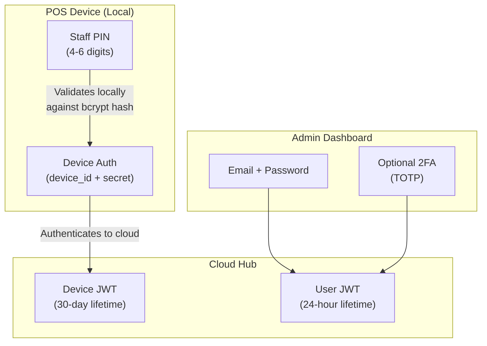
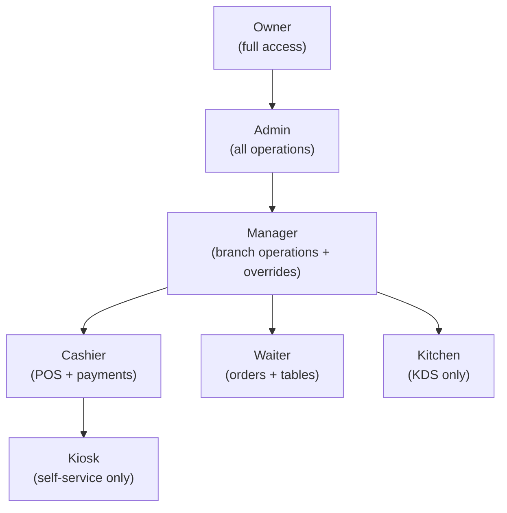
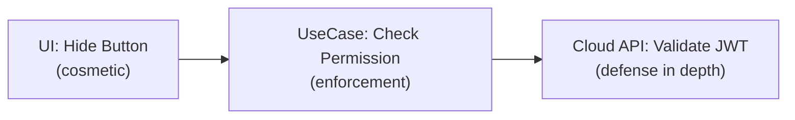
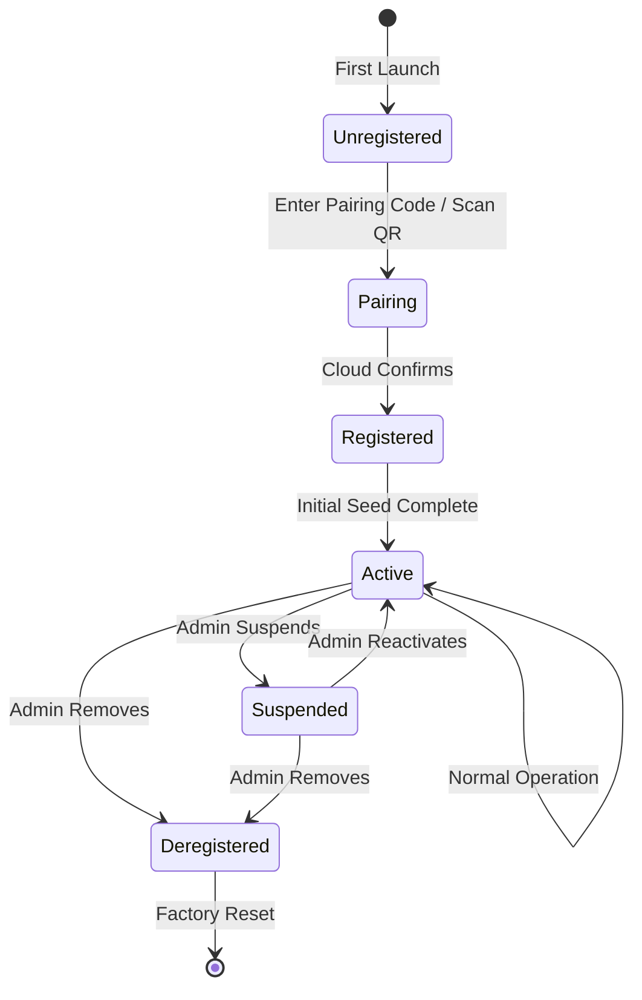
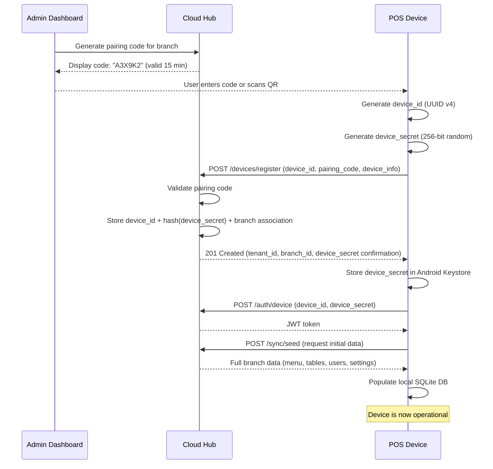
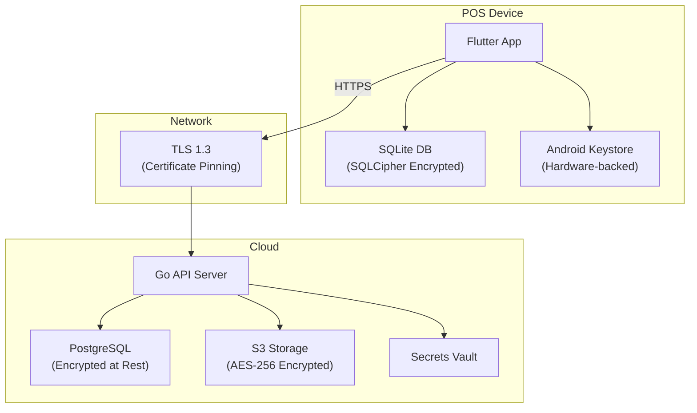
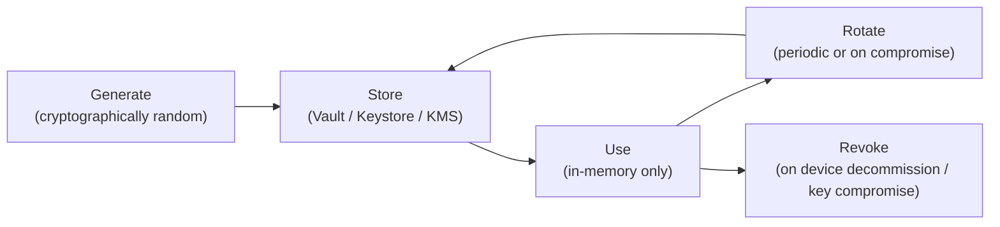
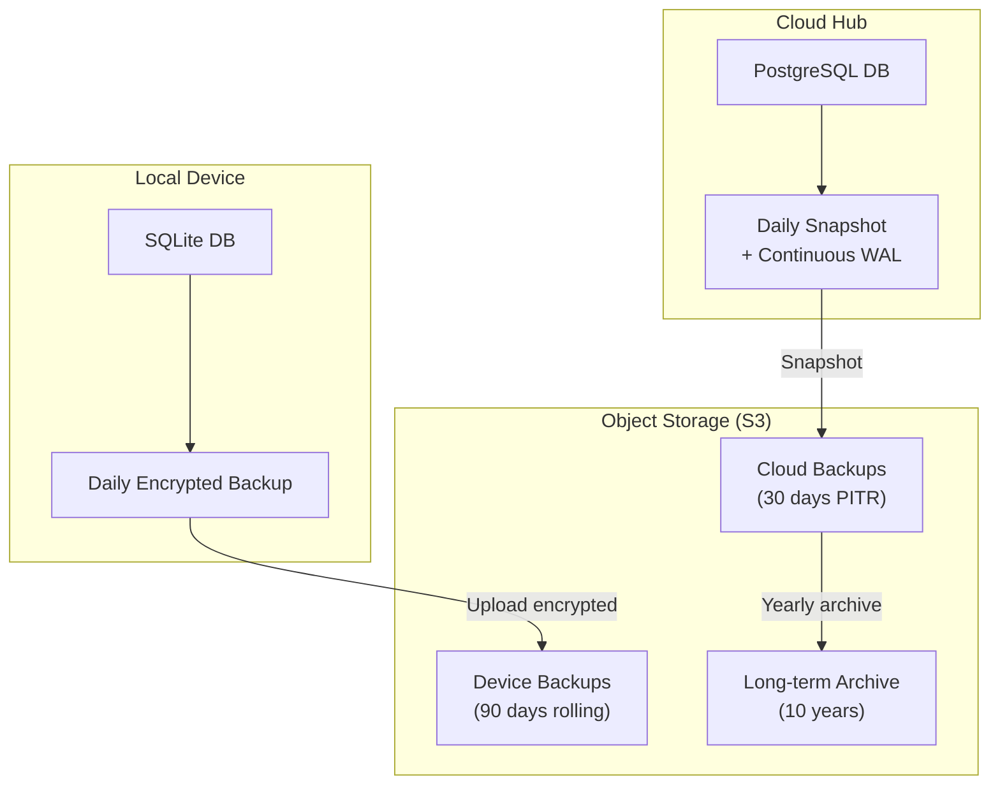

# Security and Compliance

> **Document Status:** Living document | **Last Updated:** 2026-03-20 | **Owner:** Architecture Team

---

## Table of Contents

1. [Authentication](#1-authentication)
2. [Authorization (RBAC)](#2-authorization-rbac)
3. [Device Identity](#3-device-identity)
4. [Data Security](#4-data-security)
5. [Audit Trail](#5-audit-trail)
6. [Compliance](#6-compliance)
7. [Secrets Management](#7-secrets-management)
8. [Backup and Recovery](#8-backup-and-recovery)

---

## 1. Authentication

The platform uses layered authentication optimized for the restaurant environment: fast PIN-based access for staff on the floor and stronger credentials for cloud administration.

### 1.1 Authentication Model Overview



### 1.2 Staff PIN Authentication

| Property | Detail |
|---|---|
| **Format** | 4-6 numeric digits |
| **Storage** | bcrypt hash with cost factor 10, stored in local SQLite `users.pin_hash` |
| **Transmission** | PIN is NEVER transmitted in plain text. Only the hash is compared locally. PIN is never sent to the cloud. |
| **Entry method** | On-screen numeric keypad, no physical keyboard required |
| **Session** | Local session persists until explicit logout, shift close, or idle timeout |
| **Idle timeout** | Configurable: 5, 10, 15, 30 minutes, or disabled (default: 15 minutes) |
| **Lockout** | 5 failed attempts triggers a 5-minute lockout per user |
| **Quick switch** | Tap user avatar to switch without full logout (PIN still required) |

**Why PIN and not password:** In a restaurant environment, staff need to authenticate in under 3 seconds. Hands may be wet or gloved. A 4-digit PIN on large touch targets is the industry standard for POS systems. Security is balanced by the physical access control (the device is behind the counter) and the manager override system for sensitive actions.

### 1.3 Device Authentication

| Property | Detail |
|---|---|
| **Device ID** | UUID v4 generated on first launch, stored persistently |
| **Device secret** | 256-bit random secret generated during device pairing |
| **Storage** | Android Keystore (hardware-backed, not extractable) |
| **Cloud auth** | Device presents `device_id` + `device_secret` to obtain a JWT |
| **Token lifetime** | 30 days, auto-refreshed on each sync |
| **Revocation** | Admin can revoke a device from the cloud dashboard (blocks future token refresh) |

### 1.4 Cloud Admin Authentication

| Property | Detail |
|---|---|
| **Credentials** | Email address + password |
| **Password policy** | Minimum 8 characters, at least 1 uppercase, 1 lowercase, 1 digit |
| **Password storage** | bcrypt hash with cost factor 12, stored in PostgreSQL |
| **2FA** | Optional TOTP (Time-based One-Time Password) via authenticator app |
| **Session** | JWT with 24-hour lifetime, refresh token with 30-day lifetime |
| **IP restriction** | Optional: restrict admin access to specific IP ranges (Enterprise tier) |

### 1.5 Manager Override Authentication

For privileged actions (void, refund, discount above threshold), the system presents a secondary PIN prompt. Any user with the `manager`, `admin`, or `owner` role can authorize by entering their PIN.

| Property | Detail |
|---|---|
| **Trigger** | Restricted action attempted by non-manager user |
| **Method** | Manager enters their own PIN on the override modal |
| **Validation** | PIN verified against all manager/admin/owner accounts locally |
| **Audit** | Override event logged with: action, requesting user, authorizing manager, timestamp, device |
| **Timeout** | Override is valid for the single action only -- not a session elevation |

---

## 2. Authorization (RBAC)

### 2.1 Role Hierarchy



### 2.2 Role Definitions

| Role | Scope | Primary Screen | Description |
|---|---|---|---|
| **Owner** | All branches | Cloud Dashboard + POS | Business owner, full access, subscription management |
| **Admin** | All branches | Cloud Dashboard + POS | Technical administrator, all operations except billing |
| **Manager** | Assigned branch(es) | POS + Back Office | Branch manager, can authorize overrides, view reports, manage staff |
| **Cashier** | Assigned branch | POS (Sales Screen) | Handles payments, shift management, basic order operations |
| **Waiter** | Assigned branch | POS (Sales + Floor) | Takes orders, manages tables, sends to kitchen |
| **Kitchen** | Assigned branch | KDS only | Views and manages kitchen tickets |
| **Kiosk** | Assigned branch | Kiosk screen only | System role for kiosk devices, no human login |

### 2.3 Permission Matrix

The following matrix defines which actions each role can perform. "Override" means the action requires manager PIN authorization.

| Permission | Owner | Admin | Manager | Cashier | Waiter | Kitchen | Kiosk |
|---|---|---|---|---|---|---|---|
| **Order Operations** | | | | | | | |
| Create order | Yes | Yes | Yes | Yes | Yes | -- | -- |
| Add items to order | Yes | Yes | Yes | Yes | Yes | -- | -- |
| Remove unsent items | Yes | Yes | Yes | Yes | Yes | -- | -- |
| Void sent items | Yes | Yes | Yes | Override | Override | -- | -- |
| Apply discount (<=10%) | Yes | Yes | Yes | Yes | Override | -- | -- |
| Apply discount (>10%) | Yes | Yes | Yes | Override | Override | -- | -- |
| Apply free item (100% off) | Yes | Yes | Yes | Override | Override | -- | -- |
| Change item price | Yes | Yes | Yes | Override | Override | -- | -- |
| Transfer table | Yes | Yes | Yes | Yes | Yes | -- | -- |
| Merge tables | Yes | Yes | Yes | Yes | Override | -- | -- |
| **Kitchen Operations** | | | | | | | |
| Send to kitchen | Yes | Yes | Yes | Yes | Yes | -- | -- |
| View KDS | Yes | Yes | Yes | -- | -- | Yes | -- |
| Bump kitchen ticket | Yes | Yes | Yes | -- | -- | Yes | -- |
| Recall bumped ticket | Yes | Yes | Yes | -- | -- | Yes | -- |
| Prioritize ticket | Yes | Yes | Yes | Yes | Yes | -- | -- |
| **Payment Operations** | | | | | | | |
| Process cash payment | Yes | Yes | Yes | Yes | Override | -- | -- |
| Process card payment | Yes | Yes | Yes | Yes | Yes | -- | -- |
| Split bill | Yes | Yes | Yes | Yes | Yes | -- | -- |
| Process refund | Yes | Yes | Yes | Override | Override | -- | -- |
| Void payment | Yes | Yes | Yes | Override | Override | -- | -- |
| Open cash drawer (no sale) | Yes | Yes | Yes | Override | -- | -- | -- |
| Record tip | Yes | Yes | Yes | Yes | Yes | -- | -- |
| **Shift Operations** | | | | | | | |
| Open shift | Yes | Yes | Yes | Yes | -- | -- | -- |
| Close own shift | Yes | Yes | Yes | Yes | -- | -- | -- |
| Close another user's shift | Yes | Yes | Yes | -- | -- | -- | -- |
| Record cash in/out | Yes | Yes | Yes | Yes | -- | -- | -- |
| View shift report | Yes | Yes | Yes | Own only | -- | -- | -- |
| **Reporting** | | | | | | | |
| View daily sales | Yes | Yes | Yes | -- | -- | -- | -- |
| View product reports | Yes | Yes | Yes | -- | -- | -- | -- |
| View staff performance | Yes | Yes | Yes | -- | -- | -- | -- |
| View cost prices | Yes | Yes | Yes | -- | -- | -- | -- |
| Export reports | Yes | Yes | Yes | -- | -- | -- | -- |
| Multi-branch reports | Yes | Yes | -- | -- | -- | -- | -- |
| **Menu Management** | | | | | | | |
| View menu | Yes | Yes | Yes | Yes | Yes | -- | -- |
| Edit products | Yes | Yes | Yes | -- | -- | -- | -- |
| Edit categories | Yes | Yes | Yes | -- | -- | -- | -- |
| Edit modifiers | Yes | Yes | Yes | -- | -- | -- | -- |
| Edit prices | Yes | Yes | Yes | -- | -- | -- | -- |
| Toggle item availability | Yes | Yes | Yes | Yes | -- | -- | -- |
| **Staff Management** | | | | | | | |
| View staff list | Yes | Yes | Yes | -- | -- | -- | -- |
| Create/edit staff | Yes | Yes | Yes | -- | -- | -- | -- |
| Reset staff PIN | Yes | Yes | Yes | -- | -- | -- | -- |
| Change staff role | Yes | Yes | -- | -- | -- | -- | -- |
| Deactivate staff | Yes | Yes | Yes | -- | -- | -- | -- |
| **System / Settings** | | | | | | | |
| View settings | Yes | Yes | Yes | -- | -- | -- | -- |
| Edit settings | Yes | Yes | Yes | -- | -- | -- | -- |
| Manage devices | Yes | Yes | -- | -- | -- | -- | -- |
| Edit floor plans | Yes | Yes | Yes | -- | -- | -- | -- |
| View audit log | Yes | Yes | Yes | -- | -- | -- | -- |
| Manage subscription | Yes | -- | -- | -- | -- | -- | -- |
| API key management | Yes | Yes | -- | -- | -- | -- | -- |
| Webhook configuration | Yes | Yes | -- | -- | -- | -- | -- |
| **Online Orders** | | | | | | | |
| Accept/reject online order | Yes | Yes | Yes | Yes | -- | -- | -- |
| Configure online ordering | Yes | Yes | Yes | -- | -- | -- | -- |

### 2.4 Permission Enforcement Points

Permissions are checked at three levels:

1. **UI layer (Flutter)**: Hide or disable UI elements the user cannot access. This is a convenience measure, not a security boundary.
2. **Use case layer (Dart)**: Business logic validates permissions before executing any operation. This is the primary enforcement point.
3. **API layer (Go)**: Cloud API endpoints validate device and user permissions from the JWT claims. This protects cloud resources.



---

## 3. Device Identity

### 3.1 Device Lifecycle



### 3.2 Device Identity Properties

| Property | Detail |
|---|---|
| **Device ID** | UUID v4, generated once on first app launch, never changes |
| **Device secret** | 256-bit cryptographically random value, generated during pairing |
| **Storage** | Android Keystore (hardware-backed TEE/StrongBox when available) |
| **Export** | Device secret cannot be exported or backed up -- it is bound to the physical device |
| **Rotation** | Device secret can be rotated via admin action (re-pairing required) |

### 3.3 Pairing Process



### 3.4 Device Types and Capabilities

| Device Type | Capabilities | Auth Level |
|---|---|---|
| `pos_terminal` | Full POS operations, printing, cash drawer | Device + User PIN |
| `kds` | Kitchen display, ticket bumping | Device only (no user login) |
| `waiter_handheld` | Order entry, table management | Device + User PIN |
| `kiosk` | Self-service ordering | Device only (kiosk role) |

---

## 4. Data Security

### 4.1 Security Architecture Overview



### 4.2 Data at Rest

| Location | Encryption | Key Management |
|---|---|---|
| **Local SQLite** | SQLCipher (AES-256-CBC with HMAC-SHA512) | Device-derived key via Android Keystore |
| **Cloud PostgreSQL** | Volume-level encryption (cloud provider) + column-level for sensitive fields | Cloud KMS (AWS KMS, GCP KMS, or equivalent) |
| **S3 storage** | AES-256-GCM server-side encryption | S3 bucket-level encryption with KMS-managed keys |
| **Backup files** | AES-256-GCM before upload | Key derived from device secret + tenant ID via HKDF |

### 4.3 Data in Transit

| Path | Protection | Notes |
|---|---|---|
| Device to Cloud | TLS 1.3, certificate pinning | Minimum TLS 1.2, prefer 1.3. Pin the cloud hub certificate. |
| Device to Printer (Bluetooth) | Bluetooth pairing | Bonded pairing required for Bluetooth printers |
| Device to Printer (LAN) | Plain TCP (ESC/POS protocol) | Acceptable on trusted LAN; kitchen/receipt data is not sensitive |
| Cloud to ERPNext | TLS 1.2+ (HTTPS) | Frappe API over HTTPS |
| Cloud to Fiskaly | TLS 1.3 (HTTPS) | Fiskaly enforces TLS 1.2+ |
| Admin Dashboard | TLS 1.3 (HTTPS) | Standard web HTTPS, HSTS enabled |

### 4.4 SQLCipher Configuration

```dart
// SQLCipher pragmas set on database open
PRAGMA key = '<device-derived-key>';
PRAGMA cipher_page_size = 4096;
PRAGMA kdf_iter = 256000;
PRAGMA cipher_hmac_algorithm = HMAC_SHA512;
PRAGMA cipher_kdf_algorithm = PBKDF2_HMAC_SHA512;
```

**Key derivation:** The SQLCipher key is derived from a secret stored in Android Keystore. The key never exists on disk in plain form. If the device is factory-reset, the Keystore entry is lost and the database becomes inaccessible (data is effectively deleted).

### 4.5 PCI DSS Considerations

| Aspect | Approach |
|---|---|
| **Card data** | The POS application NEVER handles raw card data (PAN, CVV, track data). All card processing is handled by the payment terminal (external device). |
| **PCI scope** | The POS is out of PCI DSS scope because it does not store, process, or transmit cardholder data. |
| **Payment terminal** | The integrated payment terminal (SumUp, Worldline, etc.) is PCI-certified independently. |
| **Receipt** | Card receipts show masked PAN only (last 4 digits), which is acceptable. |
| **Storage** | Only the payment method name ("card"), amount, and terminal reference are stored. No card numbers. |

### 4.6 Sensitive Field Handling

| Field | Sensitivity | Protection |
|---|---|---|
| `users.pin_hash` | High | bcrypt hash, never stored or transmitted in plain |
| `devices.device_secret` | Critical | Android Keystore only, never leaves device |
| `licenses.license_token` | High | Signed (not encrypted), validated by public key |
| `api_keys.key_hash` | High | SHA-256 hash in cloud DB, plain key shown once at creation |
| `webhook_configs.secret_hash` | High | bcrypt hash in cloud DB |
| Customer email/phone (online orders) | Medium | Encrypted at rest in cloud DB, purged per retention policy |

---

## 5. Audit Trail

### 5.1 Design Requirements

The audit trail meets the following requirements:

1. **Immutability:** Entries cannot be modified or deleted after creation.
2. **Completeness:** Every business-relevant action is recorded.
3. **Traceability:** Every entry links to who, what, when, and where (device).
4. **Durability:** Retained for 10 years per German Aufbewahrungspflicht (retention obligation).
5. **Tamper-evidence:** Optional hash chain for KassenSichV compliance.

### 5.2 Audited Events

| Category | Events | Example |
|---|---|---|
| **Order lifecycle** | create, update, close, cancel | "Order #0042 created for table A3" |
| **Item operations** | add, modify_quantity, void, move | "Item 'Margherita x2' voided by Cashier (Manager M. approved)" |
| **Discounts** | apply_percentage, apply_fixed, remove | "20% discount applied to Bill #001 (reason: customer complaint)" |
| **Payments** | payment_received, payment_voided, refund | "Card payment CHF 45.00 received for Bill #001" |
| **Shift operations** | shift_open, shift_close, cash_in, cash_out | "Shift opened by Anna, opening cash CHF 200.00" |
| **Manager overrides** | override_authorized, override_denied | "Manager override: void authorized by M. Mueller for void by L. Bianchi" |
| **User access** | login, logout, pin_failed, lockout | "User Anna logged in on device POS-1" |
| **Menu changes** | product_create, product_update, price_change | "Product 'Margherita' price changed from CHF 14.50 to CHF 15.00" |
| **Settings changes** | setting_update | "Setting 'receipt_footer' changed by Owner" |
| **Table operations** | table_open, table_close, table_transfer | "Table A3 transferred to A5 by Waiter Luca" |
| **Fiscal events** | tse_sign, tse_fail, dsfinvk_export | "Receipt #2026-0320-0042 signed by TSE" |
| **Device events** | device_register, device_suspend, sync_complete | "Device KDS-1 registered for branch Zurich" |

### 5.3 Audit Entry Structure

Every audit log entry contains:

| Field | Type | Description |
|---|---|---|
| `id` | UUID v7 | Unique, time-sortable identifier |
| `tenant_id` | UUID | Tenant scope |
| `branch_id` | UUID | Branch where the event occurred |
| `device_id` | UUID | Device that recorded the event |
| `user_id` | UUID | User who performed the action (null for system events) |
| `entity_type` | String | Type of entity affected (e.g., "order_item", "payment") |
| `entity_id` | UUID | ID of the affected entity |
| `action` | String | Action performed (e.g., "void", "refund", "override") |
| `old_value_json` | JSON | Previous state of the entity (null for create) |
| `new_value_json` | JSON | New state of the entity (null for delete) |
| `metadata_json` | JSON | Additional context (reason, approver, etc.) |
| `timestamp` | Integer/Timestamp | When the action occurred |

### 5.4 Immutability Enforcement

**Local (SQLite):**
- The Drift DAO for `audit_log` exposes only an `insertAuditEntry()` method.
- No `updateAuditEntry()` or `deleteAuditEntry()` methods exist.
- Database triggers (SQLite) prevent UPDATE and DELETE on the audit_log table.

**Cloud (PostgreSQL):**
```sql
-- Row-level security to prevent modification
ALTER TABLE audit_log ENABLE ROW LEVEL SECURITY;

-- Application role can only INSERT
CREATE POLICY audit_insert_only ON audit_log
    FOR INSERT
    TO app_user
    WITH CHECK (true);

-- No SELECT restriction (can read)
CREATE POLICY audit_read ON audit_log
    FOR SELECT
    TO app_user
    USING (true);

-- Explicitly deny UPDATE and DELETE
-- (No policy = denied by default with RLS enabled)

-- Additional safeguard: trigger to prevent any UPDATE/DELETE
CREATE OR REPLACE FUNCTION prevent_audit_modification()
RETURNS TRIGGER AS $$
BEGIN
    RAISE EXCEPTION 'Audit log entries cannot be modified or deleted';
END;
$$ LANGUAGE plpgsql;

CREATE TRIGGER no_audit_update
    BEFORE UPDATE OR DELETE ON audit_log
    FOR EACH ROW
    EXECUTE FUNCTION prevent_audit_modification();
```

### 5.5 Hash Chain (Optional, for KassenSichV)

For enhanced tamper-evidence, each audit entry can include a hash of the previous entry:

```
entry_hash = SHA-256(previous_entry_hash + entity_type + entity_id + action + timestamp + user_id)
```

This creates a chain where modifying any entry would break the hash chain of all subsequent entries, making tampering detectable during a tax audit.

---

## 6. Compliance

### 6.1 Germany

#### GoBD (Grundsatze ordnungsmassiger Buchfuhrung)

The GoBD defines principles for proper bookkeeping and document retention in Germany. The POS system must comply with:

| Requirement | Implementation |
|---|---|
| **Completeness** (Vollstandigkeit) | Every transaction is recorded in the audit log. No transaction can be silently deleted. |
| **Correctness** (Richtigkeit) | Calculations (tax, totals) are deterministic and reproducible. |
| **Timeliness** (Zeitgerechtheit) | Transactions are recorded at the time they occur (timestamps are set at creation). |
| **Order** (Ordnung) | Sequential receipt numbers, organized by shift and date. |
| **Immutability** (Unveranderbarkeit) | Audit log is append-only. Corrections are recorded as new entries, not modifications. |
| **Retention** (Aufbewahrung) | 10-year retention of all transaction data and audit logs. |
| **Machine readability** | DSFinV-K export format for tax authority access. |
| **Documentation** | System documentation (Verfahrensdokumentation) describing how the POS works. |

#### KassenSichV (Kassensicherungsverordnung)

| Requirement | Implementation |
|---|---|
| **TSE** (Technische Sicherheitseinrichtung) | Fiskaly cloud-based TSE for digital receipt signing. Each transaction is signed with a qualified electronic signature. |
| **Receipt obligation** (Belegausgabepflicht) | A receipt is generated for every transaction. Customer may decline the physical copy. |
| **Receipt content** | Receipt includes: full name and address, date/time, quantities and descriptions, prices, tax rates and amounts, TSE signature, TSE serial number, transaction number, start/end time. |
| **QR code** | TSE-signed QR code on receipt for verification. |
| **Registration** | TSE registered with Finanzamt (tax office). |

#### DSFinV-K (Digitale Schnittstelle der Finanzverwaltung fur Kassensysteme)

The standardized export format containing:

| File | Content |
|---|---|
| `transactions.csv` | All individual transactions |
| `lines.csv` | Line items per transaction |
| `payments.csv` | Payment records |
| `cash_point_closing.csv` | Z-report data |
| `allocation_groups.csv` | Tax rate assignments |
| `vat.csv` | VAT calculations |
| `tse_info.csv` | TSE signatures and metadata |

Exports are generated on demand or quarterly and stored in S3 with 10-year retention.

### 6.2 Switzerland

#### OR (Obligationenrecht)

| Requirement | Implementation |
|---|---|
| **Bookkeeping obligation** (Art. 957) | All revenue-generating transactions are recorded and can be exported. |
| **Retention** (Art. 958f) | Business records retained for 10 years. |
| **Audit trail** | Modifications to records are traceable. |

#### MWSTG (Mehrwertsteuergesetz)

| Requirement | Implementation |
|---|---|
| **VAT rates** | Correct application of Swiss VAT rates: 8.1% standard, 2.6% reduced, 3.8% accommodation. |
| **VAT identification** | Restaurant's UID/MWST-Nr displayed on receipts. |
| **Invoice requirements** | Receipts contain all mandatory fields: seller info, date, description, amount, VAT breakdown. |
| **5-Rappen rounding** | Cash payments rounded to nearest CHF 0.05 (Swiss convention, not a legal requirement but market expectation). |

#### QR-Bill

For invoice scenarios (e.g., business customer billing), the system supports the Swiss QR-bill format per SIX/ISO 20022 standard.

### 6.3 GDPR (General Data Protection Regulation)

| GDPR Article | Implementation |
|---|---|
| **Art. 5 - Data minimization** | Collect only data necessary for the transaction. Customer data for online orders is limited to name, phone, email. |
| **Art. 6 - Legal basis** | Contract performance (order processing), legal obligation (fiscal records), legitimate interest (analytics). |
| **Art. 12-14 - Transparency** | Privacy policy accessible in online ordering. Data processing description in terms of service. |
| **Art. 15 - Right of access** | Cloud admin can export all customer data associated with a phone number or email. |
| **Art. 17 - Right to erasure** | Customer data is soft-deleted (anonymized). Fiscal records are retained per legal obligation exception (Art. 17(3)(b)). |
| **Art. 20 - Data portability** | Customer order history exportable as JSON/CSV. |
| **Art. 25 - Privacy by design** | Minimal data collection, encryption at rest, purpose limitation. |
| **Art. 28 - Processor agreements** | Data processing agreements with cloud providers, Fiskaly, payment processors. |
| **Art. 32 - Security** | Encryption, access controls, audit logging as documented in this document. |
| **Art. 33-34 - Breach notification** | Incident response plan: notify authorities within 72 hours, notify affected individuals without undue delay. |

#### Data Anonymization for GDPR Erasure

When a customer requests erasure, the system performs:

```
customer_name  -> "ANONYMIZED"
customer_phone -> NULL
customer_email -> NULL
```

The transaction record itself is retained (legal obligation for fiscal records) but the personal data is stripped.

### 6.4 Staff Data Protection

| Data Type | Legal Basis | Retention | Access |
|---|---|---|---|
| Staff name and role | Employment contract | Duration of employment + 1 year | Manager, Admin, Owner |
| Login/logout timestamps | Legitimate interest (security) | 10 years (audit requirement) | Manager, Admin, Owner |
| Shift hours | Employment contract, labor law | Duration of employment + 5 years | Manager, Admin, Owner |
| PIN hash | Contract (system access) | Until user deactivated | System only (not readable) |
| Performance metrics | Legitimate interest (management) | 2 years rolling | Manager, Admin, Owner |

Staff are informed about data processing during onboarding. In Germany, Works Council (Betriebsrat) approval may be required for performance monitoring features.

---

## 7. Secrets Management

### 7.1 Secret Types and Storage

| Secret | Location | Storage Method | Access |
|---|---|---|---|
| **Device secret** | POS device | Android Keystore (hardware-backed) | Device app only |
| **User PIN hash** | Local SQLite + Cloud PostgreSQL | bcrypt hash | System (comparison only) |
| **Cloud DB password** | Cloud server | Environment variable or HashiCorp Vault | API server process only |
| **Fiskaly API key** | Cloud config | HashiCorp Vault or encrypted env var | ERPNext Bridge module only |
| **Fiskaly API secret** | Cloud config | HashiCorp Vault or encrypted env var | ERPNext Bridge module only |
| **ERPNext API key** | Cloud config | HashiCorp Vault or encrypted env var | ERPNext Bridge module only |
| **ERPNext API secret** | Cloud config | HashiCorp Vault or encrypted env var | ERPNext Bridge module only |
| **License signing private key** | Secure infrastructure | HSM (Hardware Security Module) or Vault transit engine | License signing service only |
| **License signing public key** | POS device + Cloud | Embedded in app binary + cloud config | Read-only, for verification |
| **Webhook secrets** | Cloud PostgreSQL | bcrypt hash per tenant | Webhook delivery service only |
| **JWT signing key** | Cloud server | Vault or env var, rotated quarterly | Auth service only |
| **S3 access key** | Cloud server | Vault or IAM role (preferred) | Backup/storage service only |
| **Stripe API key** | Cloud server | Vault or env var | Billing service only |

### 7.2 Secret Lifecycle



### 7.3 Deployment Modes

| Deployment Size | Secrets Management | Rationale |
|---|---|---|
| **Small (1-5 tenants)** | Environment variables + encrypted `.env` file | Simple, low operational overhead |
| **Medium (5-50 tenants)** | HashiCorp Vault (single instance) | Centralized, auditable, supports rotation |
| **Large (50+ tenants)** | HashiCorp Vault (HA cluster) or cloud-native KMS | High availability, HSM integration |

### 7.4 Key Rotation Schedule

| Secret | Rotation Frequency | Method |
|---|---|---|
| JWT signing key | Quarterly (90 days) | Generate new key, old key valid for 24 hours (overlap) |
| Database password | Semi-annually (180 days) | Rotate via Vault, zero-downtime (dual-password) |
| Fiskaly API credentials | Annually or on compromise | Manual rotation via Fiskaly dashboard |
| ERPNext API credentials | Annually or on compromise | Manual rotation via ERPNext admin |
| License signing key | Never (or on compromise) | HSM-protected, no routine rotation |
| Device secrets | Never (bound to device lifecycle) | New secret on re-pairing |
| Webhook secrets | On tenant request | Regenerate in admin dashboard |

---

## 8. Backup and Recovery

### 8.1 Backup Strategy Overview



### 8.2 Local Device Backup

| Property | Detail |
|---|---|
| **Frequency** | Daily (automatic, during low-activity hours) + before shift close |
| **Method** | SQLite `.backup()` API (online backup, no downtime) |
| **Encryption** | AES-256-GCM, key derived from `device_secret + tenant_id` via HKDF |
| **Size** | ~5-50 MB compressed per branch |
| **Local retention** | 7 days rolling (on device storage) |
| **Cloud upload** | Uploaded to S3 on next successful sync |
| **Cloud retention** | 90 days rolling in S3, latest backup retained indefinitely |

### 8.3 Cloud Database Backup

| Property | Detail |
|---|---|
| **Method** | PostgreSQL automated backups (managed service or pg_basebackup) |
| **Frequency** | Daily full snapshot + continuous WAL (Write-Ahead Log) archiving |
| **PITR** | Point-in-time recovery to any second within the last 30 days |
| **Snapshot retention** | 30 daily snapshots |
| **Cross-region** | Backups replicated to a secondary region (for disaster recovery) |
| **Testing** | Monthly backup restoration test to verify integrity |

### 8.4 Recovery Scenarios

#### Scenario 1: Device Loss or Failure

| Step | Action |
|---|---|
| 1 | Obtain a new Android device |
| 2 | Install the POS app |
| 3 | Pair with the branch (new pairing code from admin dashboard) |
| 4 | Cloud Hub seeds the new device with all branch data |
| 5 | Device is operational within ~5 minutes |
| **Data loss** | Zero (all data is in the cloud) |
| **Downtime** | Time to provision and pair new device (~15 minutes) |

#### Scenario 2: Device Data Corruption

| Step | Action |
|---|---|
| 1 | App detects corruption on startup (SQLite integrity check) |
| 2 | App restores from the latest local backup (7 days available) |
| 3 | If local backup is also corrupt: factory reset + cloud re-seed |
| **Data loss** | Minimal (since last successful sync; typically <1 hour of data) |
| **Downtime** | Automatic recovery: ~2 minutes. Manual re-seed: ~10 minutes |

#### Scenario 3: Cloud Database Failure

| Step | Action |
|---|---|
| 1 | Cloud monitoring detects PostgreSQL failure |
| 2 | Automatic failover to replica (if HA configured) |
| 3 | If no replica: restore from latest snapshot + WAL replay |
| 4 | Devices continue operating offline during cloud downtime |
| 5 | Devices sync accumulated changes after cloud recovery |
| **Data loss** | Zero with HA failover. Up to 1 second with WAL replay. |
| **Downtime** | HA failover: ~30 seconds. Manual restore: 15-60 minutes. |

#### Scenario 4: Full Disaster Recovery

| Step | Action |
|---|---|
| 1 | Provision new cloud infrastructure (Terraform/IaC) |
| 2 | Restore PostgreSQL from cross-region backup |
| 3 | Restore S3 data from cross-region replica |
| 4 | Update DNS to point to new infrastructure |
| 5 | Devices reconnect automatically (DNS-based endpoint discovery) |
| **Data loss** | Depends on RPO: typically <1 minute with WAL archiving |
| **Downtime** | RTO target: 4 hours |

### 8.5 Recovery Point and Time Objectives

| System | RPO (Recovery Point Objective) | RTO (Recovery Time Objective) |
|---|---|---|
| Local device | Last sync (typically <1 hour) | 15 minutes (new device + re-seed) |
| Cloud database | <1 minute (WAL archiving) | 30 seconds (HA failover) or 1 hour (manual restore) |
| Object storage (S3) | <1 hour (cross-region replication) | Near-zero (S3 is highly available) |
| Full disaster | <1 minute | 4 hours |

### 8.6 Data Export

Tenants can export all their data at any time via the cloud admin dashboard:

| Export Type | Format | Content |
|---|---|---|
| **Full data export** | JSON + CSV ZIP | All entities: orders, products, users, settings, audit log |
| **Financial export** | CSV | Transactions, payments, refunds, shift reports |
| **DSFinV-K export** | CSV (per standard) | Germany-specific fiscal export for tax authorities |
| **Audit log export** | CSV | Complete audit trail |

Exports are generated asynchronously, encrypted, and available for download for 7 days.

---

## Appendix: Security Checklist

This checklist is used during development and before each release to verify security controls are in place.

| Category | Check | Status |
|---|---|---|
| **Authentication** | PIN stored as bcrypt hash only | Required |
| | Device secret in Android Keystore | Required |
| | Cloud admin password policy enforced | Required |
| | 2FA available for cloud admin | Required |
| | Lockout after 5 failed PIN attempts | Required |
| **Authorization** | RBAC enforced at use case layer | Required |
| | Manager override logs authorized user | Required |
| | UI hides unauthorized features | Required |
| **Data protection** | SQLCipher encryption on local DB | Required |
| | TLS 1.2+ for all cloud communication | Required |
| | No raw card data stored or processed | Required |
| | Sensitive fields encrypted at rest in cloud | Required |
| | Backups encrypted before upload | Required |
| **Audit** | All business actions logged | Required |
| | Audit log is immutable (no UPDATE/DELETE) | Required |
| | 10-year retention configured | Required |
| **Compliance** | TSE integration for German operations | Required (DE) |
| | DSFinV-K export functional | Required (DE) |
| | Swiss VAT rates configured | Required (CH) |
| | GDPR data erasure procedure tested | Required |
| **Secrets** | No secrets in source code | Required |
| | No secrets in device logs | Required |
| | Secret rotation schedule documented | Required |
| **Backup** | Daily local backup verified | Required |
| | Cloud PITR tested monthly | Required |
| | Device recovery procedure documented | Required |
