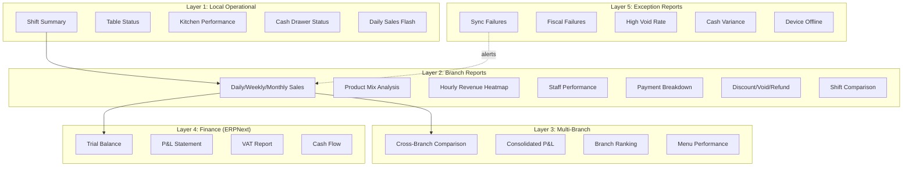
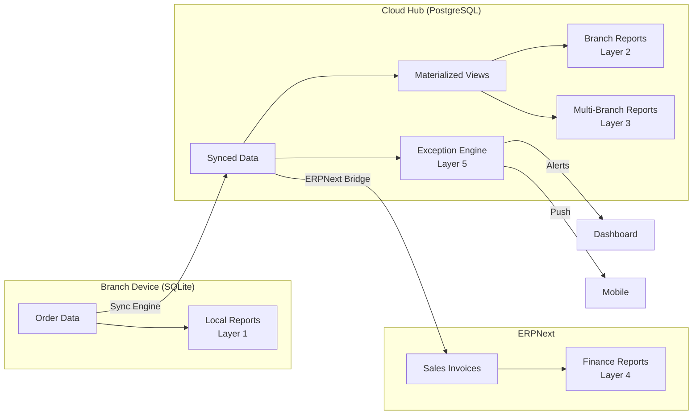

# 16 - Reporting Strategy

> How GastroCore delivers actionable insights at every level: device, branch, enterprise, and finance.

---

## 1. Report Layer Architecture

GastroCore reporting is organized into five distinct layers, each serving a different audience and operating on a different data source. This layered approach ensures that critical operational data is always available (even offline), while richer analytics are computed in the cloud.



---

## 2. Layer 1 -- Local Operational Reports (On-Device, Offline)

These reports run entirely on the device using SQL queries against the local SQLite database via Drift ORM. They are available at all times, regardless of network connectivity.

### 2.1 Current Shift Summary

| Attribute       | Detail                                                    |
|-----------------|-----------------------------------------------------------|
| **Audience**    | Waiter, shift manager                                     |
| **Data source** | Local SQLite -- `orders`, `payments`, `shifts` tables     |
| **Refresh**     | Real-time (query on demand)                               |
| **Content**     | Total sales, order count, average ticket, payments by type (cash/card), tips collected, voids/discounts in current shift |
| **Format**      | In-app screen + optional PDF/thermal print                |

**SQL approach:** Single query joining `orders` and `payments` filtered by `shift_id = current_shift`. Aggregate functions for sum, count, avg.

### 2.2 Table Status Overview

| Attribute       | Detail                                                      |
|-----------------|-------------------------------------------------------------|
| **Audience**    | Host, floor manager                                         |
| **Data source** | Local SQLite -- `tables`, `table_sessions`, `orders`        |
| **Refresh**     | Real-time (live view)                                       |
| **Content**     | Table state (free/occupied/reserved/dirty), time seated, current order total, assigned waiter |
| **Format**      | Visual floor plan with color-coded status                   |

### 2.3 Kitchen Performance

| Attribute       | Detail                                                    |
|-----------------|-----------------------------------------------------------|
| **Audience**    | Kitchen manager, shift manager                            |
| **Data source** | Local SQLite -- `kitchen_tickets`, `order_items`          |
| **Refresh**     | Real-time                                                 |
| **Content**     | Average prep time (last hour, current shift), pending items count, items by station, longest-waiting ticket |
| **Format**      | In-app KDS stats overlay                                  |

**Calculation:** `avg(completed_at - sent_at)` for completed kitchen tickets in the current shift. Pending = tickets where `status = 'sent'`.

### 2.4 Cash Drawer Status

| Attribute       | Detail                                                    |
|-----------------|-----------------------------------------------------------|
| **Audience**    | Shift manager, owner                                      |
| **Data source** | Local SQLite -- `shifts`, `payments`, `cash_movements`    |
| **Refresh**     | On demand                                                 |
| **Content**     | Opening float, cash sales total, cash-out events, expected cash in drawer, variance (if counted) |
| **Format**      | In-app screen, shift close print                          |

**Formula:**
```
expected_cash = opening_float
              + sum(cash_payments)
              - sum(cash_refunds)
              - sum(cash_outs)
              + sum(cash_ins)
variance = actual_count - expected_cash
```

### 2.5 Daily Sales Flash

| Attribute       | Detail                                                    |
|-----------------|-----------------------------------------------------------|
| **Audience**    | Owner, manager                                            |
| **Data source** | Local SQLite -- `orders`, `payments`                      |
| **Refresh**     | On demand                                                 |
| **Content**     | Today's total sales, order count, avg ticket vs. yesterday same day. Simple delta arrows (up/down) |
| **Format**      | Dashboard card on home screen                             |

---

## 3. Layer 2 -- Branch Reports (Cloud, Per-Branch)

These reports are computed in the Cloud Hub using PostgreSQL. They require synced data from devices. Available in the web dashboard and (read-only summaries) in the POS app when online.

### 3.1 Daily / Weekly / Monthly Sales

- Revenue by period with trend lines
- Breakdown by order type (dine-in, takeaway, delivery, online)
- Comparison to previous period (day-over-day, week-over-week)
- Materialized view: `mv_daily_sales` refreshed hourly

### 3.2 Product Mix Analysis

- Top 20 products by revenue and by quantity
- Category-level breakdown (food vs. drinks vs. extras)
- Margin analysis (revenue minus cost where COGS is available)
- Bottom 10 products (candidates for menu removal)
- Modifier popularity (e.g., "extra cheese" frequency)

### 3.3 Hourly Revenue Heatmap

- Revenue and order count by hour-of-day and day-of-week
- Identifies peak hours for staffing decisions
- Materialized view: `mv_hourly_revenue` refreshed daily

```
         Mon   Tue   Wed   Thu   Fri   Sat   Sun
08:00    --    --    --    --    --    ███   ███
09:00    ░░    ░░    ░░    ░░    ░░    ███   ███
10:00    ░░    ░░    ░░    ░░    ░░    ███   ███
11:00    ██    ██    ██    ██    ██    ███   ███
12:00    ███   ███   ███   ███   ███   ███   ███
13:00    ███   ███   ███   ███   ███   ██    ██
14:00    ██    ██    ██    ██    ██    ██    ██
...
```

### 3.4 Staff Performance

- Orders per waiter per shift
- Average table time (seated to paid) per waiter
- Revenue per waiter
- Void/discount rate per waiter (flag outliers)
- **Privacy note:** Staff reports visible only to owner/manager role. GDPR considerations for employee monitoring.

### 3.5 Payment Method Breakdown

- Cash vs. card vs. other by amount and count
- Trend over time (card adoption increasing?)
- Cash ratio tracking (relevant for tax compliance audits)

### 3.6 Discount / Void / Refund Analysis

- Total discounts by type (percentage, fixed, happy hour, staff meal)
- Void count and amount with reason codes
- Refund count and amount with reasons
- **Exception detection:** Flag void rates above 3% of revenue or individual staff above 5%

### 3.7 Shift Comparison

- Side-by-side shift metrics (morning vs. evening, weekday vs. weekend)
- Revenue per labor-hour (if shift hours tracked)
- Useful for scheduling optimization

---

## 4. Layer 3 -- Central Multi-Branch Reports (Cloud, Enterprise Tier)

Available only for Enterprise tier tenants with multiple branches. Aggregated from branch-level materialized views.

### 4.1 Cross-Branch Comparison

- Revenue, order count, avg ticket by branch for a given period
- Sortable, filterable table
- Sparklines for trend per branch

### 4.2 Consolidated P&L

- Sum of revenue across all branches
- Breakdown by branch
- Cost data requires ERPNext integration (Phase 9+)

### 4.3 Branch Ranking

- Rank branches by revenue, growth rate, avg ticket, staff efficiency
- Monthly ranking email to enterprise admins

### 4.4 Menu Performance Across Locations

- Same product performance in different branches
- Identify branch-specific bestsellers
- Support menu localization decisions

---

## 5. Layer 4 -- Finance Reports (ERPNext)

These reports are NOT custom-built. They are generated by ERPNext after sales data is posted via the ERPNext Bridge (Phase 9).

| Report           | ERPNext Module    | Data Flow                              |
|------------------|-------------------|----------------------------------------|
| Trial Balance    | Accounts          | Sales invoices posted daily via bridge  |
| P&L Statement    | Accounts          | Revenue + COGS from posted transactions |
| VAT Report       | Accounts          | Tax entries from sales invoices         |
| Cash Flow        | Accounts          | Payment entries from bridge             |
| Balance Sheet    | Accounts          | Full double-entry from all modules      |
| Stock Valuation  | Stock             | Stock deductions from sales             |

**Design decision:** We do NOT replicate accounting logic. ERPNext is the accounting system of record. GastroCore posts transactions; ERPNext generates financial statements.

---

## 6. Layer 5 -- Exception Reports (Automated Alerts)

Exception reports are event-driven, not scheduled. They trigger notifications via the web dashboard and (optionally) push notifications.

| Exception                  | Trigger Condition                                        | Severity | Notification Channel     |
|----------------------------|----------------------------------------------------------|----------|--------------------------|
| Sync failure               | Device has not synced in >30 minutes during business hours | Warning  | Dashboard, push          |
| Fiscal signing failure (DE)| Fiskaly transaction returns error or timeout             | Critical | Dashboard, push, SMS     |
| High void rate             | Void amount >3% of shift revenue                        | Warning  | Dashboard                |
| Cash variance              | Shift close variance >2% or >CHF 20 / EUR 20            | Warning  | Dashboard, push          |
| Device offline             | Device heartbeat missing >15 minutes                    | Info     | Dashboard                |
| DSFinV-K export failure    | Scheduled export fails validation                        | Critical | Dashboard, push          |
| License expiry approaching | License expires in <14 days                             | Info     | Dashboard, email         |
| Shift not closed           | Shift open for >16 hours                                | Warning  | Dashboard                |
| ERPNext posting backlog    | >100 unposted transactions or >24h backlog              | Warning  | Dashboard                |

---

## 7. Report Source Matrix: Local vs. Cloud vs. ERPNext

| Report                       | Source     | Available Offline | Tier         | Format           |
|------------------------------|------------|-------------------|--------------|------------------|
| Current shift summary        | SQLite     | Yes               | All          | Screen, PDF, Print |
| Table status overview        | SQLite     | Yes               | Professional+| Screen           |
| Kitchen performance          | SQLite     | Yes               | Professional+| Screen           |
| Cash drawer status           | SQLite     | Yes               | All          | Screen, Print    |
| Daily sales flash            | SQLite     | Yes               | All          | Screen           |
| Daily/weekly/monthly sales   | PostgreSQL | No                | Professional+| Dashboard, PDF, CSV |
| Product mix analysis         | PostgreSQL | No                | Professional+| Dashboard, CSV   |
| Hourly revenue heatmap       | PostgreSQL | No                | Professional+| Dashboard        |
| Staff performance            | PostgreSQL | No                | Professional+| Dashboard, CSV   |
| Payment method breakdown     | PostgreSQL | No                | Professional+| Dashboard, CSV   |
| Discount/void/refund analysis| PostgreSQL | No                | Professional+| Dashboard, CSV   |
| Shift comparison             | PostgreSQL | No                | Professional+| Dashboard        |
| Cross-branch comparison      | PostgreSQL | No                | Enterprise   | Dashboard, PDF, CSV |
| Consolidated P&L             | PostgreSQL | No                | Enterprise   | Dashboard, PDF   |
| Branch ranking               | PostgreSQL | No                | Enterprise   | Dashboard        |
| Menu perf across locations   | PostgreSQL | No                | Enterprise   | Dashboard, CSV   |
| Trial balance                | ERPNext    | No                | Enterprise   | ERPNext UI, PDF  |
| P&L statement                | ERPNext    | No                | Enterprise   | ERPNext UI, PDF  |
| VAT report                   | ERPNext    | No                | Enterprise   | ERPNext UI, PDF  |
| Cash flow                    | ERPNext    | No                | Enterprise   | ERPNext UI, PDF  |
| Sync failure alerts          | Cloud Hub  | No                | Professional+| Dashboard, Push  |
| Fiscal failure alerts        | Cloud Hub  | No                | Professional+| Dashboard, Push, SMS |
| High void rate alerts        | Cloud Hub  | No                | Professional+| Dashboard        |
| Cash variance alerts         | SQLite + Cloud | Partial      | All          | Screen, Dashboard |
| Device offline alerts        | Cloud Hub  | No                | Professional+| Dashboard        |

---

## 8. Implementation Approach

### 8.1 Phase 1: Local Operational Reports (MVP-0, MVP-1)

**Approach:** Direct SQL queries on SQLite via Drift ORM.

- No reporting library or framework needed
- Drift DAOs contain report query methods
- Results rendered in Flutter widgets (tables, simple charts)
- PDF generation via `pdf` package for shift close report
- Thermal print via ESC/POS commands for shift summary receipt

**Key queries:**

```
-- Shift summary
SELECT
  COUNT(*) as order_count,
  SUM(total_amount) as total_sales,
  AVG(total_amount) as avg_ticket,
  SUM(CASE WHEN payment_method = 'cash' THEN amount ELSE 0 END) as cash_total,
  SUM(CASE WHEN payment_method = 'card' THEN amount ELSE 0 END) as card_total
FROM orders o
JOIN payments p ON o.id = p.order_id
WHERE o.shift_id = :current_shift_id
  AND o.status = 'completed';
```

**Effort:** ~2 person-days per report. Total: ~2 weeks for all Layer 1 reports.

### 8.2 Phase 2: Cloud Reports with Materialized Views (MVP-2+)

**Approach:** PostgreSQL materialized views refreshed on schedule.

**Materialized views:**

| View Name              | Refresh Frequency | Source Tables                   |
|------------------------|-------------------|---------------------------------|
| `mv_daily_sales`       | Hourly            | orders, payments                |
| `mv_hourly_revenue`    | Daily             | orders                          |
| `mv_product_mix`       | Daily             | order_items, products           |
| `mv_staff_performance` | Daily             | orders, order_items, users      |
| `mv_payment_breakdown` | Daily             | payments                        |
| `mv_void_analysis`     | Hourly            | orders, voids                   |
| `mv_branch_summary`    | Daily             | mv_daily_sales (cross-tenant)   |

**Why materialized views (not real-time queries):**
- Report queries on large tables are expensive
- Restaurant data is append-mostly (orders don't change after completion)
- Hourly refresh is sufficient for cloud reports (not real-time dashboards)
- Materialized views can be refreshed concurrently without blocking reads

**Web dashboard:** Simple Go API endpoints returning JSON. Frontend renders charts with a lightweight charting library.

**Export:**
- PDF: Server-side generation using Go PDF library (e.g., `jung-kurt/gofpdf`)
- CSV: Streamed from Go API, generated on-the-fly from materialized views

### 8.3 Phase 3: Advanced Analytics (Future)

**Potential upgrades when scale demands:**

| Need                          | Solution                     | When                        |
|-------------------------------|------------------------------|-----------------------------|
| Sub-second queries on large datasets | TimescaleDB (time-series extension for PostgreSQL) | >50 branches |
| Complex analytical queries     | ClickHouse (columnar store)  | >100 branches               |
| Self-service BI               | Metabase or Apache Superset  | Enterprise customer demand  |
| Predictive analytics          | Python ML service            | V3.0+                       |

**Design decision:** No BI tool dependency in MVP. We control the full report stack. BI tool integration is a future add-on for enterprise customers who already use Metabase/Superset.

---

## 9. Report Data Flow



---

## 10. Design Decisions

| Decision | Rationale |
|----------|-----------|
| Local reports use raw SQL via Drift, not a reporting framework | Simplicity. Drift DAOs are sufficient for 5-10 local queries. No need for a reporting abstraction layer. |
| Cloud reports use materialized views, not real-time queries | Performance. Restaurant analytics are not real-time critical; hourly refresh is acceptable. |
| No BI tool in MVP | Dependency avoidance. A BI tool adds deployment complexity and cost. Build custom reports first, add BI later. |
| Finance reports delegated to ERPNext | Accounting is solved. ERPNext handles double-entry, VAT, and financial statements better than any custom code we would write. |
| PDF export for shift reports | Restaurant managers print or email shift summaries. PDF is universally accessible. |
| CSV export for all cloud reports | Power users (accountants, multi-branch managers) want raw data for Excel analysis. |
| Exception reports are event-driven, not scheduled | A sync failure at 12:30 PM should alert immediately, not wait for a 1:00 PM scheduled report run. |
| Staff performance reports require manager role | GDPR compliance. Employee performance data must be access-controlled. |

---

## 11. Report Delivery Channels

| Channel         | Reports Supported                  | Implementation                         |
|-----------------|------------------------------------|----------------------------------------|
| In-app screen   | All Layer 1, read-only Layer 2     | Flutter widgets                        |
| Thermal print   | Shift summary, daily flash         | ESC/POS commands                       |
| PDF download    | Shift summary, daily/weekly sales  | `pdf` package (Flutter), Go PDF (cloud)|
| CSV download    | All Layer 2 and 3 reports          | Go API streaming                       |
| Web dashboard   | All Layer 2, 3, and 5 reports      | Web app with charts                    |
| Email           | Daily summary, exception alerts    | Go email service (future)              |
| Push notification | Exception alerts                 | Firebase Cloud Messaging (future)      |
| ERPNext UI      | All Layer 4 reports                | Native ERPNext interface               |

---

## 12. Data Retention for Reporting

| Data Type            | Local (SQLite)           | Cloud (PostgreSQL)       | ERPNext               |
|----------------------|--------------------------|--------------------------|-----------------------|
| Raw order data       | Current fiscal year + 1  | 7 years (fiscal compliance) | Permanent (accounting) |
| Materialized views   | N/A                      | Rolling 2 years (re-computable) | N/A             |
| Shift reports        | 90 days                  | 7 years                  | N/A                   |
| Exception logs       | 30 days                  | 1 year                   | N/A                   |
| Aggregated summaries | N/A                      | Permanent                | N/A                   |

**Note:** German fiscal law (AO, GoBD) requires 10-year retention of transaction data. The 7-year cloud retention is a minimum; fiscal data in the immutable transaction log must be retained for 10 years.
