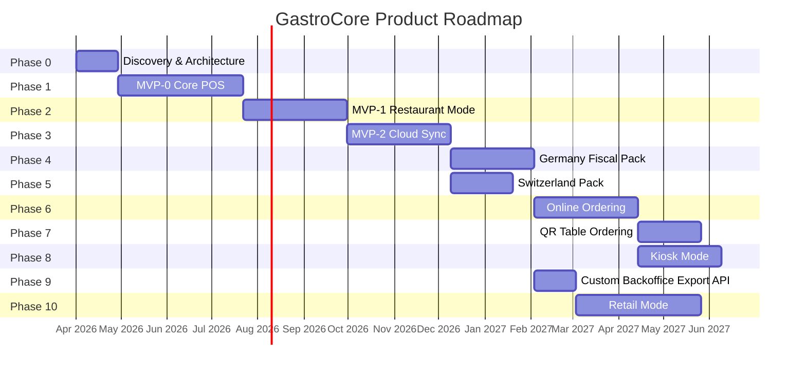
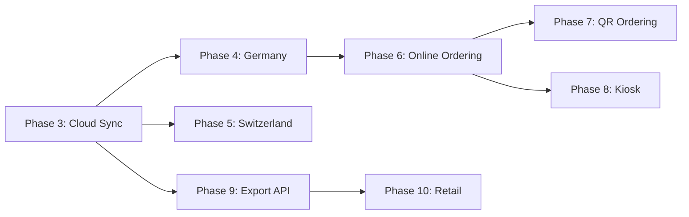

# 17 - Product Roadmap

> Phased delivery plan from first line of code to a multi-channel restaurant platform across Switzerland and Germany.

---

## 1. Visual Timeline



> **Note:** Phases 4 and 5 can run in parallel after Phase 3. Phases 7 and 8 can run in parallel after Phase 6. Phase 9 can start independently after Phase 3 completes.

---

## 2. Phase Details

---

### Phase 0: Discovery & Architecture

| Attribute           | Detail                                          |
|---------------------|-------------------------------------------------|
| **Duration**        | 4 weeks                                         |
| **Effort**          | 4 person-weeks                                  |
| **Team size**       | 1 (founder/CTO)                                 |
| **Dependencies**    | None                                            |

**Scope:**

- Finalize all architecture documentation (this document set: docs 00-20)
- Set up monorepo structure (`gastrocore/`) with Flutter app, Go server, shared docs
- Configure CI/CD pipeline (GitHub Actions: lint, test, build)
- Set up development environment (Android emulator, test tablet, local PostgreSQL)
- Technology spikes:
  - Drift ORM: schema definition, migrations, complex queries
  - Go modules: project structure, HTTP router, middleware
  - Fiskaly sandbox: API authentication, test transaction signing
  - ESC/POS printing: Bluetooth connection, receipt formatting, test with 2-3 printer models
- UX wireframes for core flows (quick sale, table order, shift open/close)
- Identify and secure first pilot customer (Swiss cafe)

**Success criteria:**

- [ ] Architecture docs complete and reviewed
- [ ] Monorepo builds on CI (Flutter + Go)
- [ ] Drift schema compiles and runs basic CRUD test
- [ ] ESC/POS spike prints a test receipt on physical printer
- [ ] Fiskaly sandbox returns a signed transaction
- [ ] Wireframes for 5 core screens approved

**Technical debt created:**

- None (this is the foundation phase)

**Risks:**

| Risk                     | Mitigation                                                |
|--------------------------|-----------------------------------------------------------|
| Over-engineering         | Time-box each spike to 2 days maximum                     |
| Analysis paralysis       | Architecture docs are living documents; ship imperfect     |
| Wrong technology choice  | Spikes validate assumptions before committing              |

---

### Phase 1: MVP-0 -- Core POS

| Attribute           | Detail                                          |
|---------------------|-------------------------------------------------|
| **Duration**        | 10-12 weeks                                     |
| **Effort**          | 12-16 person-weeks                              |
| **Team size**       | 1-2 developers                                  |
| **Dependencies**    | Phase 0 complete, Flutter + Drift setup, physical printer |

**Scope:**

- Single device, single user, offline-only operation
- PIN-based login (4-6 digit PIN, local authentication)
- Shift management: open shift (enter opening float) / close shift (cash count, summary)
- Product catalog: categories, products with prices, modifier groups and modifiers
- Quick sale flow (no tables):
  - Browse/search products
  - Add items to ticket with modifiers
  - Adjust quantity, remove items
  - Apply simple discount (percentage or fixed)
  - Calculate total (including correct tax)
  - Cash payment: enter amount tendered, calculate change
  - Print receipt via Bluetooth thermal printer
  - Mark order complete
- Receipt template: business name, items, totals, tax breakdown, date/time, receipt number
- Basic shift report: total sales, order count, cash collected, voids
- Local settings: business name, address, tax rates, currency, printer connection
- Immutable transaction log from day 1

**Success criteria:**

- [ ] Complete a sale in under 30 seconds (experienced user)
- [ ] Receipt prints correctly on target printer (Epson TM-m30 or equivalent)
- [ ] Shift report matches manual calculation
- [ ] App works fully offline (airplane mode)
- [ ] Can handle 200+ orders in a single shift without performance degradation
- [ ] Tax calculation correct for Swiss (8.1%, 2.6%) and German (19%, 7%) rates

**Technical debt created:**

- Single-user only (no role-based permissions beyond PIN)
- Cash payment only (card tracking not yet supported)
- No cloud backup (data only on device)
- No table management
- Hardcoded receipt template (no customization)

**Risks:**

| Risk                        | Mitigation                                              |
|-----------------------------|---------------------------------------------------------|
| Scope creep into tables     | Strict scope definition; table management is Phase 2    |
| Printer compatibility       | Test with 2-3 specific models; document supported list  |
| Drift ORM learning curve    | Phase 0 spike should have resolved major questions      |
| Tax calculation errors      | Unit tests for every tax scenario; use integer cents     |

---

### Phase 2: MVP-1 -- Restaurant Mode

| Attribute           | Detail                                          |
|---------------------|-------------------------------------------------|
| **Duration**        | 8-10 weeks                                      |
| **Effort**          | 12-16 person-weeks                              |
| **Team size**       | 2 developers                                    |
| **Dependencies**    | MVP-0 complete, second tablet for KDS testing   |

**Scope:**

- Table management:
  - Floor plan editor (drag-and-drop table placement)
  - Multiple floors/areas (indoor, outdoor, bar)
  - Table shapes (round, square, rectangular)
  - Table status: free, occupied, reserved, dirty
- Table-based ordering:
  - Open table session (assign table, optional guest count)
  - Add items to table's ticket
  - Send items to kitchen (kitchen ticket)
  - Fire courses (appetizer, main, dessert -- manual fire)
  - Close table: payment and receipt
- Kitchen Display Screen (KDS):
  - Separate Flutter app running on a dedicated tablet
  - Shows incoming kitchen tickets in order
  - Mark items as "preparing" / "ready"
  - Bump (complete) tickets
  - Audible alert for new tickets
  - Color coding for ticket age (green < 10 min, yellow < 20 min, red > 20 min)
- Split bill: split by item, split equally by N guests, custom split
- Merge tables: combine two table sessions into one
- Move table: transfer a session from one table to another
- Multi-device operation:
  - LAN discovery (mDNS/Bonjour)
  - One device as "primary" (owns the SQLite database)
  - Secondary devices read/write via local network API
  - Conflict resolution for concurrent edits to same table
- Waiter assignment: assign waiter to table, filter "my tables" view
- Card payment tracking: record that a payment was made by card (not processing -- just logging the method and amount)

**Success criteria:**

- [ ] Open table, order, send to kitchen, pay, close -- under 2 minutes
- [ ] KDS shows new ticket within 3 seconds of send
- [ ] Split bill calculates correctly for all split types
- [ ] Two tablets can operate on the same floor plan simultaneously
- [ ] Floor plan supports up to 50 tables without UI lag
- [ ] Course management: fire course 2 only after course 1 is bumped

**Technical debt created:**

- LAN sync is device-to-device, not cloud-based (will be replaced by cloud sync)
- No offline resilience for secondary devices (they depend on primary being reachable)
- KDS is a separate app (not yet integrated via cloud)
- Floor plan editor is basic (no custom shapes or images)

**Risks:**

| Risk                          | Mitigation                                                |
|-------------------------------|-----------------------------------------------------------|
| Multi-device sync complexity  | Start with primary/secondary model, not peer-to-peer      |
| LAN reliability               | Heartbeat mechanism; clear UI when primary unreachable     |
| KDS latency                   | Direct socket connection, not polling                      |
| UX complexity                 | User testing with real waiters after week 4                |
| Split bill edge cases         | Comprehensive unit tests for rounding (5 Rappen, cent)     |

---

### Phase 3: MVP-2 -- Cloud Sync

| Attribute           | Detail                                          |
|---------------------|-------------------------------------------------|
| **Duration**        | 8-10 weeks                                      |
| **Effort**          | 14-18 person-weeks                              |
| **Team size**       | 2 developers (1 Flutter, 1 Go)                  |
| **Dependencies**    | MVP-1 complete, cloud infrastructure provisioned |

**Scope:**

- Cloud backend (Go + PostgreSQL):
  - HTTP API (REST + optional gRPC for sync)
  - JWT authentication (device tokens, user tokens)
  - Tenant isolation (schema-per-tenant or row-level security)
  - Database migrations framework
- Device registration and authentication:
  - Register device with cloud (device ID, branch assignment)
  - Device authentication token (long-lived, refreshable)
  - Device status tracking (last seen, sync status)
- Sync engine:
  - Bi-directional sync (device to cloud, cloud to device)
  - CRDT-inspired conflict resolution for concurrent edits
  - Sync queue with retry logic
  - Delta sync (only changed records since last sync)
  - Sync status UI on device (last synced, pending items, errors)
- Web dashboard (basic):
  - Login (email + password)
  - Sales reports: daily/weekly/monthly (Layer 2 reports)
  - Device status: online/offline, last sync time
  - Basic charts (revenue trend, top products)
- Menu management from web:
  - CRUD categories, products, modifiers
  - Price management
  - Sync menu changes to devices
- User management from web:
  - Create/edit/disable staff users
  - Assign roles (admin, manager, waiter, kitchen)
  - Assign PINs
- License / subscription system:
  - Tenant registration
  - Subscription tier (Starter, Professional, Enterprise)
  - Feature flags per tier
  - License validation on device (periodic check, grace period for offline)

**Success criteria:**

- [ ] Device syncs to cloud within 60 seconds of connectivity
- [ ] Offline for 8 hours then sync completes without data loss
- [ ] Web dashboard shows sales data within 5 minutes of sync
- [ ] Menu change on web appears on device after next sync cycle
- [ ] 10 devices syncing concurrently without conflicts or data loss
- [ ] License validation works offline for 7-day grace period

**Technical debt created:**

- Web dashboard is functional but not polished (basic UI)
- Sync engine handles simple conflicts but not complex merge scenarios
- No real-time push (sync is pull-based on interval)
- License system is basic (no payment integration yet)

**Risks:**

| Risk                          | Mitigation                                                |
|-------------------------------|-----------------------------------------------------------|
| Sync bugs                     | Extensive simulation testing (multi-device, network loss)  |
| Cloud infrastructure cost     | Start with single VPS, scale later                        |
| Data loss during sync         | Immutable local log; sync is additive, never destructive   |
| Tenant isolation breach       | Row-level security in PostgreSQL; penetration testing      |
| Dashboard scope creep         | Strict MVP: 3 report pages, 2 management pages, nothing more |

---

### Phase 4: Germany Fiscal Pack

| Attribute           | Detail                                          |
|---------------------|-------------------------------------------------|
| **Duration**        | 6-8 weeks                                       |
| **Effort**          | 10-14 person-weeks                              |
| **Team size**       | 2 developers                                    |
| **Dependencies**    | MVP-2 (cloud required for Fiskaly API)          |

**Scope:**

- Fiskaly SIGN DE v2 integration:
  - TSE (Technical Security Equipment) client initialization
  - Transaction lifecycle: start → update → finish
  - TSE response parsing and storage
- Cloud TSE transaction flow:
  - Order finalized on device
  - Transaction data sent to cloud
  - Cloud calls Fiskaly API
  - Signed response stored and returned to device
  - Receipt updated with TSE data
- Receipt with TSE data:
  - QR code containing TSE signature
  - Transaction number, start/finish timestamps
  - TSE serial number, signature counter
  - Certificate serial number
- DSFinV-K export:
  - Generate DSFinV-K compliant data export
  - CSV files in prescribed format
  - Validate export against DSFinV-K schema
  - Download from web dashboard
- Offline order + online fiscal finalization:
  - Orders taken offline are queued for fiscal signing
  - When connectivity resumes, batch-sign pending transactions
  - Receipt shows "fiscal pending" then updates on sync
- Audit log compliance:
  - Immutable transaction log meets GoBD requirements
  - No deletion or modification of completed transactions
  - Sequential numbering without gaps

**Success criteria:**

- [ ] Every transaction signed by Fiskaly within 5 seconds (online)
- [ ] Offline transactions signed within 60 seconds of reconnection
- [ ] DSFinV-K export passes validation tool
- [ ] Receipt contains all legally required TSE fields
- [ ] Zero fiscal signing failures in 1000-transaction test
- [ ] Audit log passes GoBD compliance review

**Technical debt created:**

- Fiskaly is the only supported TSE provider (no alternative TSE)
- Offline fiscal queue could grow large during extended outages
- DSFinV-K export is full-export only (no incremental)

**Risks:**

| Risk                        | Mitigation                                               |
|-----------------------------|----------------------------------------------------------|
| Fiskaly API breaking changes| Pin API version, monitor changelog, maintain adapter layer|
| Fiscal edge cases           | Consult with German tax advisor; test with Fiskaly support|
| Offline queue overflow      | Cap at 500 transactions; alert owner to reconnect        |
| Certification requirements  | Engage with BSI guidelines early; document compliance     |

---

### Phase 5: Switzerland Pack

| Attribute           | Detail                                          |
|---------------------|-------------------------------------------------|
| **Duration**        | 4-6 weeks                                       |
| **Effort**          | 6-8 person-weeks                                |
| **Team size**       | 1-2 developers                                  |
| **Dependencies**    | MVP-2 (cloud for VAT configuration)             |

**Scope:**

- Swiss VAT rates configuration:
  - Standard rate: 8.1%
  - Reduced rate: 2.6% (food, non-alcoholic beverages)
  - Accommodation rate: 3.8%
  - Rate effective dates (support future rate changes)
- Dine-in vs. takeaway tax handling:
  - Same product, different VAT rate depending on consumption location
  - UI toggle: "Dine in" / "Take away" per order or per item
  - Correct tax calculation based on toggle
- 5 Rappen rounding:
  - Cash payments rounded to nearest CHF 0.05
  - Card payments NOT rounded (exact amount)
  - Rounding applied to total, not per item
  - Rounding difference tracked in accounting
- QR-bill generation for invoices:
  - Swiss QR-bill format (ISO 20022)
  - QR code with payment reference
  - For B2B invoices and corporate catering
  - Print on A4 or attached to receipt
- Swiss receipt format:
  - Business name, UID (Unternehmens-Identifikationsnummer)
  - MWST number
  - VAT breakdown by rate
  - CHF currency formatting

**Success criteria:**

- [ ] Dine-in coffee taxed at 8.1%, takeaway coffee taxed at 2.6%
- [ ] Cash total CHF 17.23 rounds to CHF 17.25; card stays CHF 17.23
- [ ] QR-bill scans correctly in Swiss banking apps
- [ ] Receipt shows correct VAT breakdown for mixed-rate orders
- [ ] Handles future VAT rate change without code deployment

**Technical debt created:**

- QR-bill only for manual/on-demand invoices (not automated)
- No integration with Swiss payment terminals (SIX)
- Rate changes require admin configuration (not auto-updated)

**Risks:**

| Risk                        | Mitigation                                               |
|-----------------------------|----------------------------------------------------------|
| VAT rate changes            | Rates stored in config with effective dates, not hardcoded|
| Rounding edge cases         | Comprehensive unit tests for rounding at boundaries       |
| QR-bill spec complexity     | Use established Swiss QR-bill library                     |

---

### Phase 6: Online Ordering

| Attribute           | Detail                                          |
|---------------------|-------------------------------------------------|
| **Duration**        | 8-10 weeks                                      |
| **Effort**          | 14-18 person-weeks                              |
| **Team size**       | 2-3 developers                                  |
| **Dependencies**    | MVP-2 (cloud backend)                           |

**Scope:**

- Public menu API:
  - Read-only API for menu, categories, prices, images
  - Availability status (out of stock, restaurant closed)
  - Restaurant info (hours, address, delivery area)
- Customer web ordering flow:
  - Mobile-responsive web app (no native app for customers)
  - Browse menu, add to cart
  - Customize items (modifiers)
  - Choose: pickup or dine-in
  - Customer details (name, phone for pickup)
  - Order summary and confirmation
- Order integration with POS:
  - Online order appears on POS device as new order
  - Audible notification for new online orders
  - Accept / reject / modify order
  - Estimated prep time sent to customer
- Status updates to customer:
  - Order received, confirmed, preparing, ready
  - Real-time status page (polling or WebSocket)
- Basic restaurant website:
  - Configurable landing page with menu, hours, location
  - "Order Online" button linking to ordering flow
  - Customizable colors and logo

**Success criteria:**

- [ ] Customer places order in under 3 minutes
- [ ] Order appears on POS within 10 seconds
- [ ] Status updates reach customer within 5 seconds
- [ ] Works on mobile Safari and Chrome (80%+ of traffic)
- [ ] Restaurant can disable online ordering with one toggle

**Technical debt created:**

- No payment processing (pay at pickup / cash on dine-in)
- No delivery management
- Basic website with limited customization
- No customer accounts (guest ordering only)

**Risks:**

| Risk                        | Mitigation                                               |
|-----------------------------|----------------------------------------------------------|
| UX complexity               | Minimal viable flow; no delivery, no payment             |
| Order spam                  | Rate limiting, phone verification for orders             |
| Payment integration         | Defer to future phase; start with pay-at-pickup          |
| Menu sync accuracy          | Real-time availability from POS; 86'd items auto-hidden  |

---

### Phase 7: QR Table Ordering

| Attribute           | Detail                                          |
|---------------------|-------------------------------------------------|
| **Duration**        | 4-6 weeks                                       |
| **Effort**          | 6-10 person-weeks                               |
| **Team size**       | 2 developers                                    |
| **Dependencies**    | Phase 6 (online ordering infrastructure)        |

**Scope:**

- QR code generation: unique QR per table, links to ordering page with table ID
- Mobile-optimized menu: reuse Phase 6 ordering UI with table context
- Table-linked ordering: orders automatically linked to physical table
- Waiter confirmation flow:
  - Customer submits order from phone
  - Order appears on waiter's tablet as pending for that table
  - Waiter confirms or modifies, then sends to kitchen
  - Optional: auto-accept mode (skip waiter confirmation)
- Multi-round ordering: customer can add more items to same table session
- Bill request: customer can request the bill from their phone

**Success criteria:**

- [ ] Scan QR, browse menu, place order in under 2 minutes
- [ ] Order correctly linked to table on POS
- [ ] Waiter confirmation adds <30 seconds to flow
- [ ] Works without app installation (pure web)
- [ ] Handles 10 concurrent table orders without degradation

**Technical debt created:**

- No payment from phone (pay at table with waiter)
- No multilingual menu (English/German only initially)
- QR codes are static (same URL per table, not session-based)

**Risks:**

| Risk                        | Mitigation                                               |
|-----------------------------|----------------------------------------------------------|
| Order spam / abuse          | Rate limit per table; waiter confirmation as gate         |
| Customer confusion          | Clear UX instructions on scan screen                      |
| QR code damage              | Durable printed QR cards; easy reprint from dashboard     |

---

### Phase 8: Kiosk Mode

| Attribute           | Detail                                          |
|---------------------|-------------------------------------------------|
| **Duration**        | 6-8 weeks                                       |
| **Effort**          | 10-14 person-weeks                              |
| **Team size**       | 2 developers                                    |
| **Dependencies**    | Phase 6 (online ordering), payment terminal      |

**Scope:**

- Full-screen kiosk UI:
  - Locked Android app (no access to system)
  - Large touch targets for self-service
  - Category-based menu navigation with product images
  - Item customization (modifiers, special requests)
  - Cart management
- Self-order flow:
  - Dine-in or takeaway selection
  - Browse menu, build order
  - Review cart
  - Pay at kiosk (payment terminal integration)
  - Receive order number
- Payment terminal integration:
  - Support 1-2 terminal models (e.g., SumUp, Worldline)
  - Card payment initiation from kiosk app
  - Payment confirmation loop
  - Receipt on terminal or printed
- Order number display:
  - Order number shown on screen after payment
  - Optional: kitchen display shows order numbers for customer pickup

**Success criteria:**

- [ ] Complete self-order flow in under 3 minutes
- [ ] Payment terminal processes successfully >99% of attempts
- [ ] Kiosk mode cannot be exited without admin PIN
- [ ] Handles 50+ orders per hour
- [ ] Accessibility: readable fonts, high contrast

**Technical debt created:**

- Limited payment terminal support (1-2 models)
- No cash acceptance at kiosk (card only)
- No multilingual kiosk UI initially

**Risks:**

| Risk                          | Mitigation                                              |
|-------------------------------|---------------------------------------------------------|
| Payment terminal diversity    | Partner with one terminal provider, certify integration  |
| Kiosk hardware variety        | Recommend specific tablet + stand + terminal bundle      |
| Vandalism / theft             | Lockdown mode, physical security recommendations         |
| Customer frustration          | "Call staff" button on every screen                      |

---

### Phase 9: Custom Backoffice Export API

> ⚠️ **ERPNext has been permanently removed.** The team builds their own accounting infrastructure.
> This phase delivers the Export API that the custom backoffice consumes.

| Attribute           | Detail                                          |
|---------------------|-------------------------------------------------|
| **Duration**        | 3-4 weeks                                       |
| **Effort**          | 4-6 person-weeks                                |
| **Team size**       | 1 Go developer                                  |
| **Dependencies**    | Cloud sync (Phase 3) stable                     |

**Scope:**

- Export API endpoints in Go Cloud Hub:
  - `GET /api/v1/export/daily-summary` — daily revenue, tax breakdown, payment methods (CSV)
  - `GET /api/v1/export/transactions` — all transactions in date range (CSV)
  - `GET /api/v1/export/shifts` — shift summaries with cash counts (CSV)
  - `GET /api/v1/export/receipts` — detailed receipt export (CSV/JSON)
- Authentication: API key per tenant
- Rate limiting: export endpoints are batch-only (not real-time)
- The custom backoffice project (separate from GastroCore) consumes these endpoints

**What is NOT in scope:**
- ERPNext integration of any kind
- Live accounting posting
- Stock management (handled by custom backoffice)
- Chart of accounts (custom backoffice concern)

**Success criteria:**

- [ ] Daily CSV export matches shift close totals exactly
- [ ] Export API callable from custom backoffice with API key
- [ ] VAT breakdown by rate in daily summary is correct
- [ ] Export available within 5 minutes of shift close sync

**Risks:**

| Risk                          | Mitigation                                              |
|-------------------------------|---------------------------------------------------------|
| Export format changes needed  | Agree on schema with custom backoffice team first        |
| Large export performance      | Paginate large exports; stream CSV response              |

---

### Phase 10: Retail Mode

| Attribute           | Detail                                          |
|---------------------|-------------------------------------------------|
| **Duration**        | 8-12 weeks                                      |
| **Effort**          | 14-20 person-weeks                              |
| **Team size**       | 2-3 developers                                  |
| **Dependencies**    | MVP-2 (core POS with cloud sync)                |

**Scope:**

- Barcode scanning:
  - Camera-based barcode scanning (EAN-13, EAN-8, UPC, Code128)
  - Optional Bluetooth barcode scanner support
  - Scan to add item to ticket
  - Unknown barcode: prompt to create product
- Quick item lookup:
  - Search by name, SKU, or barcode
  - Recent items list
  - Favorites/quick-access grid
- Weight-based items:
  - Tare weight support
  - Price per kg/100g
  - Manual weight entry or scale integration (future)
- Retail receipt format:
  - Item-by-item with barcode/SKU
  - Subtotal, tax, total
  - Store info and return policy
- Retail-specific reports:
  - Sales by category / by SKU
  - Stock movement (sold quantities)
  - End-of-day cash reconciliation
  - Top/bottom sellers

**Success criteria:**

- [ ] Scan barcode and complete sale in under 15 seconds
- [ ] Camera scan works in typical shop lighting
- [ ] Weight-based item price calculation correct to the cent
- [ ] Retail receipt format meets customer expectations
- [ ] Handles 500+ SKUs without search performance issues

**Technical debt created:**

- No inventory management (stock counts require ERPNext)
- No purchase ordering
- No supplier management
- Camera scanning only (no dedicated scanner integration)

**Risks:**

| Risk                          | Mitigation                                              |
|-------------------------------|---------------------------------------------------------|
| Different UX paradigm         | Separate retail mode with own navigation, not restaurant UI|
| Barcode scanning reliability  | Test with 10+ product barcodes; fallback to manual search |
| Scope expansion into full retail | Stay focused on small shop/bakery; not supermarket    |
| Competition with established retail POS | Position as "restaurant-first with retail add-on" |

---

## 3. Phase Summary Table

| Phase | Name                    | Duration    | Effort (pw) | Team | Cumulative Weeks |
|-------|-------------------------|-------------|-------------|------|------------------|
| 0     | Discovery & Architecture| 4 weeks     | 4           | 1    | 4                |
| 1     | MVP-0 Core POS          | 10-12 weeks | 12-16       | 1-2  | 16               |
| 2     | MVP-1 Restaurant Mode   | 8-10 weeks  | 12-16       | 2    | 26               |
| 3     | MVP-2 Cloud Sync        | 8-10 weeks  | 14-18       | 2    | 36               |
| 4     | Germany Fiscal Pack     | 6-8 weeks   | 10-14       | 2    | 44               |
| 5     | Switzerland Pack        | 4-6 weeks   | 6-8         | 1-2  | 42*              |
| 6     | Online Ordering         | 8-10 weeks  | 14-18       | 2-3  | 54               |
| 7     | QR Table Ordering       | 4-6 weeks   | 6-10        | 2    | 60               |
| 8     | Kiosk Mode              | 6-8 weeks   | 10-14       | 2    | 62               |
| 9     | Custom Backoffice Export| 3-4 weeks   | 4-6         | 1    | 42*              |
| 10    | Retail Mode             | 8-12 weeks  | 14-20       | 2-3  | 64               |

\* Phases 5 and 9 can run in parallel with Phase 4 after Phase 3.

**Total estimated effort:** 112-172 person-weeks (2.2-3.3 person-years)

---

## 4. Critical Path

The critical path through the roadmap is:

```
Phase 0 → Phase 1 → Phase 2 → Phase 3 → Phase 4 → Phase 6 → Phase 7/8
```

Phase 3 (Cloud Sync) is the key inflection point. Before it, the product is a local-only POS. After it, every subsequent feature depends on cloud infrastructure.

**Parallel tracks after Phase 3:**



---

## 5. Milestone Markers

| Milestone               | Phase | Significance                                                    |
|--------------------------|-------|-----------------------------------------------------------------|
| **First receipt printed** | 1     | Proof of concept. Real output on physical hardware.             |
| **First table served**    | 2     | Product works in a sit-down restaurant context.                 |
| **First cloud sync**      | 3     | Device is no longer an island. Owner sees data remotely.        |
| **First legal sale (DE)** | 4     | Legally compliant in Germany. Can onboard paying customers.     |
| **First legal sale (CH)** | 5     | Legally compliant in Switzerland. Home market ready.            |
| **First online order**    | 6     | Multi-channel capability. Restaurant accepts digital orders.    |
| **First self-service order** | 8  | Kiosk mode proves scalability of the ordering engine.           |
| **First backoffice export**| 9     | Financial integration. Accounting data flows to custom backoffice. |
| **100th tenant**          | --    | Scale validation. Infrastructure and support processes proven.  |

---

## 6. Go/No-Go Decision Points

After each phase, evaluate whether to proceed, iterate, or pivot:

| Decision Point        | Go Criteria                                                        | No-Go Criteria                                             |
|-----------------------|--------------------------------------------------------------------|------------------------------------------------------------|
| After Phase 0         | All spikes successful, pilot customer identified                   | Fundamental technology blocker discovered                  |
| After Phase 1         | Can sell at counter reliably, receipt prints, <5 crash bugs        | Core order flow unreliable, printer integration broken     |
| After Phase 2         | Full table service works, KDS reliable, pilot customer positive    | Multi-device sync fundamentally flawed                     |
| After Phase 3         | Sync works, dashboard shows data, no data loss in testing          | Sync causes data corruption, cloud costs prohibitive       |
| After Phase 4         | Fiskaly integration passes all tests, DSFinV-K valid               | Cannot achieve fiscal compliance                           |
| After Phase 5         | VAT + rounding correct, pilot customer positive                    | Tax calculation fundamentally incorrect                    |
