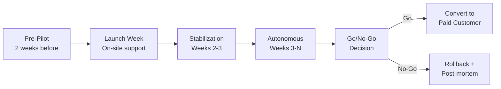

# 19 - Pilot Rollout Plan

> Detailed plans for the first two pilot deployments: a Swiss cafe and a German restaurant.

---

## 1. Pilot Strategy Overview

Pilots are not demos. They are production deployments with real customers, real money, and real pressure. The goal is to validate the product under real conditions and collect data for iteration.

**Pilot principles:**

- Old system runs in parallel -- always have a rollback option
- On-site support at launch, remote afterwards
- Daily monitoring for the first week, then weekly
- Bugs triaged within 4 hours during business hours
- Honest feedback loop: if it doesn't work, we fix or roll back
- Free pilot period to remove financial pressure from the decision

---

## 2. Scenario A: Swiss Small Cafe (First Pilot)

### 2.1 Customer Profile

| Attribute             | Detail                                               |
|-----------------------|------------------------------------------------------|
| **Type**              | Small cafe / coffee shop                             |
| **Location**          | Urban Switzerland (Zurich, Basel, or Bern area)      |
| **Tables**            | 10 (indoor + small terrace)                          |
| **Staff**             | 2 (owner + 1 employee, sometimes 1 alone)            |
| **Menu size**         | ~30 items (coffee, pastries, light lunch, drinks)    |
| **Daily orders**      | 60-100                                               |
| **Peak hours**        | 07:30-09:00 (morning coffee), 11:30-13:00 (lunch)   |
| **Current system**    | Manual / simple cash register                        |
| **Payment mix**       | ~60% cash, ~40% card (tracked, not processed)        |
| **Tech comfort**      | Basic smartphone users                               |

### 2.2 Package and Pricing

| Item                  | Detail                                               |
|-----------------------|------------------------------------------------------|
| **Subscription**      | Professional Monthly                                 |
| **Pilot cost**        | Free for 3 months (then CHF 79/month if continues)   |
| **Hardware provided** | Loaned for pilot duration, purchased if converting    |

### 2.3 Hardware Setup

| Device                    | Model (Recommended)           | Quantity | Purpose              |
|---------------------------|-------------------------------|----------|-----------------------|
| POS tablet                | Samsung Galaxy Tab A8 10.5"   | 1        | Order taking, payment |
| KDS tablet                | Lenovo Tab M10 Plus 10.3"    | 1        | Kitchen display       |
| Bluetooth thermal printer | Epson TM-m30III               | 1        | Receipt printing      |
| Cash drawer               | Standard RJ11-connected       | 1        | Cash management       |
| Tablet stand              | Adjustable counter mount      | 1        | Counter POS position  |
| Charging cables           | USB-C, extra length           | 2        | Keep devices charged  |

**Total hardware cost estimate:** CHF 800-1,200 (loaned during pilot).

### 2.4 Scope

**Included in pilot:**

- Table management (10 tables on 1 floor)
- Order taking on POS tablet
- Kitchen display on KDS tablet
- Cash payment with change calculation
- Card payment tracking (manual toggle, not terminal integration)
- Receipt printing via Bluetooth
- Shift open/close with cash count
- Shift summary report
- Daily sales flash
- Product catalog (all ~30 items pre-loaded)

**Explicitly excluded:**

- Cloud sync and web dashboard (unless MVP-2 is ready)
- Online ordering
- Payment terminal integration
- Inventory management
- Multi-device ordering (single POS tablet)

### 2.5 Week-by-Week Plan

#### Pre-Pilot: 2 Weeks Before Launch

| Day       | Activity                                                          | Owner    |
|-----------|-------------------------------------------------------------------|----------|
| Day -14   | Confirm pilot customer, sign pilot agreement                     | Founder  |
| Day -13   | Collect menu data (items, prices, categories, modifiers)         | Founder  |
| Day -12   | Photograph menu items (optional, for catalog)                     | Founder  |
| Day -10   | Enter menu data into POS app, configure tax rates (8.1%, 2.6%)  | CTO      |
| Day -9    | Configure table layout (floor plan with 10 tables)               | CTO      |
| Day -8    | Set up hardware: tablets charged, printer paired, cash drawer connected | CTO |
| Day -7    | Internal testing: run through 50 orders simulating cafe scenarios | CTO      |
| Day -5    | Fix any bugs found in internal testing                           | CTO      |
| Day -3    | Deliver hardware to cafe, physical setup                         | CTO      |
| Day -2    | Test printing on-site (receipt alignment, paper roll)            | CTO      |
| Day -1    | Final configuration review, create staff PINs                    | CTO      |

#### Week 1: Launch (On-Site Support)

| Day       | Activity                                                          | Owner    |
|-----------|-------------------------------------------------------------------|----------|
| Day 1     | **Launch day.** CTO on-site for full business day.               | CTO      |
|           | - Morning: 30-min training with owner and staff                  |          |
|           | - Shadow staff taking first 20 orders, intervene if stuck        |          |
|           | - Monitor printer reliability                                     |          |
|           | - Note every friction point, confusion, or delay                 |          |
|           | - End of day: shift close together, review summary               |          |
| Day 2     | CTO on-site for morning peak only (07:30-10:00)                  | CTO      |
|           | - Observe staff operating independently                          |          |
|           | - Fix any config issues (item prices, missing products)          |          |
| Day 3     | Remote support (WhatsApp). Staff operates independently.         | CTO      |
| Day 4     | Remote check-in call (15 min). Any issues?                       | CTO      |
| Day 5     | Remote. Review Day 1-5 data: order count, errors, void rate.    | CTO      |
| Day 6-7   | Weekend. Old system available as backup.                         | Staff    |

#### Week 2: Stabilization

| Day       | Activity                                                          | Owner    |
|-----------|-------------------------------------------------------------------|----------|
| Day 8     | Monday check-in call. Review weekend feedback.                   | CTO      |
| Day 8-12  | Bug fixes from Week 1 feedback (max 2-day turnaround)            | CTO      |
| Day 10    | Mid-week check: staff confidence assessment                      | Founder  |
| Day 12    | App update deployed with Week 1 fixes                            | CTO      |
| Day 14    | End of Week 2 review: metrics check (see 2.7)                   | CTO      |

#### Week 3: Autonomous Operation

| Day       | Activity                                                          | Owner    |
|-----------|-------------------------------------------------------------------|----------|
| Day 15-21 | Staff operates fully independently                               | Staff    |
|           | CTO monitors remotely (if cloud sync available)                   | CTO      |
|           | WhatsApp support for questions                                   | CTO      |
| Day 18    | Mid-week check-in (5 min call)                                   | CTO      |
| Day 21    | End of Week 3 review                                             | CTO      |

#### Week 4: Evaluation

| Day       | Activity                                                          | Owner    |
|-----------|-------------------------------------------------------------------|----------|
| Day 22-26 | Continue autonomous operation                                    | Staff    |
| Day 27    | Collect feedback: structured interview with owner and staff      | Founder  |
| Day 28    | **Go/No-Go meeting** (see 2.9)                                  | CTO + Founder |

### 2.6 Training Plan

| Session           | Duration  | Audience      | Content                                                |
|-------------------|-----------|---------------|--------------------------------------------------------|
| **Initial setup** | 30 min    | Owner + staff | App overview, PIN login, floor plan, taking an order, paying, printing receipt |
| **Cash handling** | 15 min    | Owner         | Shift open (float), shift close (cash count), reviewing shift report |
| **Quick reference** | --      | All staff     | Laminated 1-page cheat sheet at POS station: Order flow (5 steps), void an item, split bill |
| **Troubleshooting** | 10 min | Owner         | Printer reconnection, app restart, "what to do if..." scenarios |

**Target:** Staff completes first order unassisted within 2 minutes of training.

### 2.7 Success Metrics

| Metric                         | Target                | Measurement Method              |
|--------------------------------|-----------------------|---------------------------------|
| Critical bugs (app crash, data loss) | <5 total in 4 weeks | Bug tracker                 |
| Training time per flow         | <2 minutes            | Observed on Day 1               |
| Receipt print success rate     | >98%                  | Print queue success/failure log  |
| Staff satisfaction             | >7/10                 | Survey at end of Week 4         |
| Owner satisfaction             | >7/10                 | Interview at end of Week 4      |
| Daily order count via POS      | >80% of actual orders | Compare POS count to manual count |
| Average order completion time  | <45 seconds           | Timestamp: order created to paid |
| System uptime                  | >99% during business hours | Crash logs               |
| Void rate                      | <5% (normal for new system) | Shift reports            |

### 2.8 Monitoring Checklist

**Daily (Week 1):**

- [ ] Check for app crashes (crash log or staff report)
- [ ] Verify receipt printing worked for all orders
- [ ] Review void rate (high voids = possible UX issue)
- [ ] WhatsApp check: any unresolved questions from staff?

**Weekly (Weeks 2-4):**

- [ ] Order count trend (increasing = staff confidence growing)
- [ ] Bug count trend (decreasing = stabilizing)
- [ ] Cash variance at shift close (large variance = training issue)
- [ ] Staff feedback: top 3 frustrations
- [ ] App performance: any slowdowns reported?

### 2.9 Bug Triage Process

| Severity    | Definition                                               | Response Time  | Resolution Time |
|-------------|----------------------------------------------------------|----------------|-----------------|
| **P0**      | Cannot take orders, data loss, app crashes repeatedly    | 1 hour         | Same day        |
| **P1**      | Feature broken but workaround exists (e.g., can't split bill, but can take separate orders) | 4 hours | 2 days |
| **P2**      | Minor issue, cosmetic, or infrequent (e.g., receipt alignment off) | 24 hours | 1 week |
| **P3**      | Enhancement request, nice-to-have                        | Acknowledged   | Backlog         |

**Triage channel:** WhatsApp group (staff + CTO). Staff sends screenshot + description. CTO triages within response time.

### 2.10 Go/No-Go Criteria

**Go (convert to paying customer):**

- All success metrics met (see 2.7)
- Owner confirms they want to continue
- No unresolved P0 or P1 bugs
- Staff can operate without any support for 1 week
- Old system can be retired

**No-Go (rollback):**

- More than 5 critical bugs unresolved
- Staff satisfaction below 5/10
- Owner requests rollback
- Fundamental feature gap that cannot be fixed in 2 weeks
- Data loss incident

**Rollback procedure:**

1. Staff switches back to old system (which has been running in parallel)
2. CTO retrieves hardware
3. Post-mortem meeting within 1 week
4. Document lessons learned
5. Fix issues and find next pilot candidate

---

## 3. Scenario B: German Small Restaurant (Second Pilot)

### 3.1 Customer Profile

| Attribute             | Detail                                                  |
|-----------------------|---------------------------------------------------------|
| **Type**              | Sit-down restaurant (German / international cuisine)    |
| **Location**          | Urban Germany (Berlin, Munich, Hamburg, or Stuttgart)    |
| **Tables**            | 25 (main dining room + bar area)                        |
| **Staff**             | 5 (owner/manager + 3 waiters + 1 kitchen)               |
| **Menu size**         | ~80 items with modifiers (appetizers, mains, desserts, drinks, specials) |
| **Daily orders**      | 120-180                                                  |
| **Peak hours**        | 12:00-14:00 (lunch), 18:00-21:00 (dinner)               |
| **Current system**    | Legacy POS or orderbird                                  |
| **Payment mix**       | ~40% cash, ~60% card (EC-Karte / girocard)               |
| **Tech comfort**      | Moderate (used a POS before)                             |
| **Fiscal requirement**| KassenSichV compliant, TSE required                      |

### 3.2 Package and Pricing

| Item                  | Detail                                                  |
|-----------------------|---------------------------------------------------------|
| **Subscription**      | Professional Monthly + Germany Fiscal Pack              |
| **Pilot cost**        | Free for 6 months (then EUR 89/month + EUR 29/month Germany pack) |
| **Hardware provided** | Loaned for pilot, purchased on conversion               |

### 3.3 Hardware Setup

| Device                        | Model (Recommended)           | Qty | Purpose                  |
|-------------------------------|-------------------------------|-----|--------------------------|
| POS tablet (primary)          | Samsung Galaxy Tab A8 10.5"   | 1   | Counter/bar POS          |
| POS tablet (waiter)           | Samsung Galaxy Tab A8 10.5"   | 2   | Tableside ordering       |
| KDS tablet                    | Lenovo Tab M10 Plus 10.3"    | 1   | Kitchen display          |
| Network thermal printer (kitchen) | Epson TM-T88VII (Ethernet) | 1  | Kitchen ticket printing  |
| Network thermal printer (bar) | Epson TM-T88VII (Ethernet)    | 1   | Bar ticket printing      |
| Cash drawer                   | Standard RJ11-connected       | 1   | Cash management          |
| Tablet stands                 | Counter mount                 | 2   | Counter + bar positions  |
| Tablet cases (waiter)         | Rugged case with hand strap   | 2   | Tableside durability     |
| WiFi access point             | Ubiquiti UniFi AP             | 1   | Dedicated POS network    |
| Charging station              | Multi-device USB charger      | 1   | Overnight charging       |

**Total hardware cost estimate:** EUR 2,500-3,500 (loaned during pilot).

### 3.4 Scope

**Included in pilot:**

- Full table management (25 tables, 2 areas: dining room + bar)
- Multi-device operation (3 POS tablets + 1 KDS)
- Kitchen display with ticket management
- Course management (appetizer / main / dessert fire)
- Split bill, merge table, move table
- Cash and card payment tracking
- Fiskaly SIGN DE v2 integration (cloud TSE)
- TSE-compliant receipt printing
- DSFinV-K export capability
- Shift management with cash reconciliation
- Cloud sync and web dashboard (basic sales view)
- Staff PINs with role-based access (manager vs. waiter)

**Explicitly excluded:**

- Online ordering
- Kiosk mode
- ERPNext integration
- Payment terminal integration (card tracked manually)
- Inventory management

### 3.5 Week-by-Week Plan

#### Pre-Pilot: 3 Weeks Before Launch

| Day       | Activity                                                          | Owner    |
|-----------|-------------------------------------------------------------------|----------|
| Day -21   | Confirm pilot customer, sign pilot agreement                     | Founder  |
| Day -20   | Collect full menu data: items, categories, modifiers, prices, courses | Founder |
| Day -18   | Set up Fiskaly SIGN DE account for this restaurant (production TSE) | CTO  |
| Day -16   | Enter menu data, configure table layout (25 tables, 2 floors)   | CTO      |
| Day -15   | Configure German tax rates (19% standard, 7% reduced)           | CTO      |
| Day -14   | Configure fiscal settings: TSE ID, business info, receipt template | CTO   |
| Day -12   | Internal testing: 100 orders with Fiskaly signing                | CTO      |
| Day -10   | Validate DSFinV-K export from test data                          | CTO      |
| Day -8    | Ship hardware to restaurant                                      | CTO      |
| Day -7    | On-site hardware setup: WiFi AP, network printers, tablet configuration | CTO |
| Day -6    | Network test: all tablets can reach KDS and printers             | CTO      |
| Day -5    | End-to-end test: order on Tablet A, kitchen ticket on KDS, receipt on printer | CTO |
| Day -3    | Test Fiskaly signing from restaurant's network                   | CTO      |
| Day -2    | Create staff PINs, configure roles                               | CTO      |
| Day -1    | Final walkthrough with restaurant owner                          | CTO      |

#### Week 1: Launch (On-Site Support)

| Day       | Activity                                                          | Owner    |
|-----------|-------------------------------------------------------------------|----------|
| Day 1     | **Launch day.** CTO on-site for full business day (lunch + dinner service). | CTO |
|           | - 09:00: 1-hour training with full staff                         |          |
|           | - 11:30: Shadow lunch service (CTO assists all 3 waiters)        |          |
|           | - 14:00: Debrief lunch service, fix immediate issues             |          |
|           | - 17:30: Brief refresh before dinner service                     |          |
|           | - 18:00: Shadow dinner service                                   |          |
|           | - 21:30: Shift close together, verify Fiskaly signing log        |          |
| Day 2     | **CTO on-site full day.** Focus on multi-device and kitchen flow. | CTO     |
|           | - Monitor KDS ticket flow during peak                            |          |
|           | - Verify all 3 tablets sync correctly                            |          |
|           | - Test split bill, table merge with real scenarios               |          |
|           | - End of day: verify all transactions signed by Fiskaly          |          |
| Day 3     | Remote support. Staff operates independently.                    | CTO      |
|           | - CTO monitors Fiskaly dashboard for signing failures            |          |
| Day 4     | Phone call check-in (30 min). Review Days 1-3 issues.           | CTO      |
| Day 5     | Remote. Review full week data: sync status, fiscal log, errors.  | CTO      |
| Day 6-7   | Weekend. Higher volume. Old system on standby.                   | Staff    |

#### Week 2: Stabilization

| Day       | Activity                                                          | Owner    |
|-----------|-------------------------------------------------------------------|----------|
| Day 8     | Monday review call. Weekend feedback. Bug fix prioritization.    | CTO      |
| Day 8-12  | Bug fixes from Week 1 (max 2-day turnaround for P0/P1)          | CTO      |
| Day 10    | CTO visits for dinner service (spot check, observe staff flow)   | CTO      |
| Day 12    | App update with Week 1 fixes deployed                            | CTO      |
| Day 13    | DSFinV-K export test: generate and validate Week 1-2 data        | CTO      |
| Day 14    | End of Week 2 metrics review                                     | CTO      |

#### Week 3-4: Building Confidence

| Day       | Activity                                                          | Owner    |
|-----------|-------------------------------------------------------------------|----------|
| Day 15-28 | Staff operates autonomously                                      | Staff    |
|           | CTO monitors cloud dashboard (sync, fiscal, errors) daily       | CTO      |
|           | WhatsApp support for questions                                   | CTO      |
| Day 18    | Mid-Week 3 check-in call                                         | CTO      |
| Day 21    | DSFinV-K export: generate and validate Weeks 1-3                 | CTO      |
| Day 25    | Mid-Week 4 check-in call                                         | CTO      |
| Day 28    | End of Week 4 full metrics review                                | CTO      |

#### Week 5-6: Validation

| Day       | Activity                                                          | Owner    |
|-----------|-------------------------------------------------------------------|----------|
| Day 29-39 | Fully autonomous. CTO monitors remotely only.                   | Staff    |
| Day 35    | DSFinV-K export: full 5-week export, validate with audit tool    | CTO      |
| Day 38    | Collect feedback: structured interview with owner and each staff member | Founder |
| Day 39    | Multi-device stress test: busy Friday evening, all 3 tablets active | CTO (remote monitoring) |
| Day 42    | **Go/No-Go meeting** (see 3.9)                                  | CTO + Founder |

### 3.6 Training Plan

| Session                  | Duration  | Audience         | Content                                              |
|--------------------------|-----------|------------------|------------------------------------------------------|
| **Full staff training**  | 60 min    | All 5 staff      | App overview, PIN login, floor plan, order flow, kitchen display, payment, receipt |
| **Manager training**     | 30 min    | Owner/manager    | Shift open/close, cash count, void management, staff PINs, web dashboard basics |
| **Waiter deep-dive**     | 20 min    | 3 waiters        | Split bill, merge tables, move tables, course firing, modifiers |
| **Kitchen training**     | 15 min    | Kitchen staff    | KDS usage: view tickets, mark preparing, bump completed, course awareness |
| **Troubleshooting**      | 15 min    | Owner/manager    | Printer issues, tablet restart, "device disconnected" handling, Fiskaly error meaning |
| **Quick reference cards** | --       | All              | Laminated cards: waiter flow, kitchen flow, manager shift close, troubleshooting |

**Target:** Waiter completes table-to-receipt flow unassisted within 3 minutes of training. Kitchen staff bumps first ticket within 1 minute of training.

### 3.7 Success Metrics

| Metric                              | Target                | Measurement Method               |
|-------------------------------------|-----------------------|----------------------------------|
| Fiskaly signing success rate        | 100% (no missed transactions) | Fiskaly dashboard + local log |
| DSFinV-K export validity            | Passes validation tool | DSFinV-K validator output        |
| Multi-device sync latency           | <3 seconds            | Timestamp comparison across devices |
| Data loss incidents                 | Zero                  | Sync reconciliation report       |
| Critical bugs                       | <5 in 6 weeks         | Bug tracker                      |
| Receipt print success rate          | >98%                  | Print queue log                  |
| Staff satisfaction (avg all staff)  | >7/10                 | Survey at Week 6                 |
| Owner satisfaction                  | >8/10                 | Interview at Week 6              |
| KDS ticket display latency          | <3 seconds            | Observed during peak service     |
| Average order completion (table)    | <3 minutes            | Timestamp: table open to paid    |
| Shift cash variance                 | <EUR 10               | Shift close reports              |
| App crashes                         | <3 in 6 weeks         | Crash logs                       |
| System uptime during service        | >99.5%                | Uptime monitoring                |
| Fiscal offline queue recovery       | <5 minutes after reconnect | Fiscal queue log             |

### 3.8 Monitoring Checklist

**Daily (Weeks 1-2):**

- [ ] Fiskaly dashboard: all transactions signed? Any errors?
- [ ] Sync status: all devices synced within last hour?
- [ ] App crash log: any crashes?
- [ ] Kitchen ticket latency: any complaints about delays?
- [ ] Receipt printing: any failures?
- [ ] WhatsApp group: any unresolved issues from staff?
- [ ] Void rate: anything unusual?

**Weekly (Weeks 3-6):**

- [ ] DSFinV-K export: generate and validate
- [ ] Order count trend by day (should be stable or increasing)
- [ ] Bug count trend (should be decreasing)
- [ ] Cash variance trend (should be consistently low)
- [ ] Sync conflict count (should be zero or near-zero)
- [ ] Staff feedback: top 3 frustrations this week
- [ ] Cloud dashboard: any alerts or anomalies?
- [ ] Network stability: any WiFi dropouts reported?

**Monthly:**

- [ ] Full DSFinV-K export validation
- [ ] Revenue reconciliation: POS total vs. manual records
- [ ] Hardware health: battery life, physical condition
- [ ] Performance review: order processing speed trend

### 3.9 Bug Triage Process

| Severity    | Definition                                                          | Response Time  | Resolution Time |
|-------------|---------------------------------------------------------------------|----------------|-----------------|
| **P0**      | Fiscal signing broken, data loss, app crashes repeatedly, multi-device sync completely broken | 30 minutes | Same day (emergency deploy) |
| **P1**      | Feature broken affecting service (KDS not showing orders, print fails consistently, sync delayed >5 min) | 2 hours | 1 day |
| **P2**      | Feature broken with workaround (split bill edge case, receipt formatting) | 12 hours | 3 days |
| **P3**      | Enhancement, cosmetic, or rare edge case                            | Acknowledged   | Backlog         |

**Escalation path:**

1. Staff reports issue in WhatsApp group with screenshot
2. CTO acknowledges and triages
3. P0: CTO begins fix immediately, hotfix deploy within hours
4. P1: Fix in next daily update
5. P0 fiscal: CTO calls Fiskaly support if Fiskaly-side issue

### 3.10 Go/No-Go Criteria

**Go (convert to paying customer):**

- Fiskaly signing 100% successful (zero missed transactions)
- DSFinV-K export passes validation for full 6-week period
- All success metrics in 3.7 met
- Owner confirms commitment to continue
- No unresolved P0 or P1 bugs
- Multi-device sync proven reliable over 6 weeks
- Staff can operate one full week without any CTO assistance
- Old system can be decommissioned

**No-Go (rollback):**

- Any missed Fiskaly transaction that cannot be recovered
- DSFinV-K export fails validation and cannot be fixed
- Data loss incident
- Staff satisfaction below 5/10
- Owner requests rollback
- Sync conflicts causing order errors during service
- More than 3 P0 bugs in any single week

**Rollback procedure:**

1. Staff reverts to old POS system (running in parallel for full 4 weeks, then on standby for weeks 5-6)
2. CTO generates final DSFinV-K export for the GastroCore period
3. CTO retrieves hardware
4. Post-mortem meeting within 1 week
5. Document all lessons learned with specific action items
6. Fix issues before attempting next German pilot

---

## 4. Cross-Pilot Comparison

| Dimension                | Scenario A (Swiss Cafe) | Scenario B (German Restaurant) |
|--------------------------|-------------------------|--------------------------------|
| Complexity               | Low                     | High                           |
| Devices                  | 2                       | 5                              |
| Fiscal compliance        | None (Switzerland has no TSE) | Fiskaly TSE required       |
| Multi-device sync        | No (single POS)         | Yes (3 POS + 1 KDS)           |
| Staff to train           | 2                       | 5                              |
| Menu complexity          | Simple (30 items)       | Complex (80 items + modifiers) |
| Risk level               | Low-medium              | High                           |
| Pilot duration           | 4 weeks                 | 6 weeks                        |
| On-site support days     | 1.5 days                | 3 days                         |
| Primary validation       | Core UX and reliability | Fiscal compliance + multi-device |
| Phase required           | Phase 2 (MVP-1)         | Phase 4 (Germany Pack)         |

---

## 5. Lessons Learned Template

After each pilot, document:

| Section                        | Questions to Answer                                            |
|--------------------------------|----------------------------------------------------------------|
| **What worked well**           | Which features did staff love? What was surprisingly easy?     |
| **What was frustrating**       | Top 5 staff complaints. Top 5 owner complaints.              |
| **Bugs by category**           | How many: printing, sync, UI, fiscal, performance?            |
| **Training effectiveness**     | Did staff remember after Day 1? What needed re-training?      |
| **Hardware issues**            | Any device failures, printer problems, network issues?        |
| **Missing features**           | What did they ask for that we don't have? Priority?           |
| **Competitive comparison**     | What did their old system do better? Worse?                   |
| **Pricing feedback**           | Would they pay the listed price? What's their budget?         |
| **Referral willingness**       | Would they recommend to another restaurant? (NPS)             |
| **Architecture validation**    | Did offline-first work? Did sync work? Did fiscal work?       |

---

## 6. Post-Pilot Actions

### If Go:

1. Convert pilot to paid subscription (free period continues per agreement)
2. Customer keeps hardware (purchase or rental agreement)
3. Continue weekly monitoring for 1 additional month
4. Collect written testimonial and case study (with permission)
5. Use learnings to refine product for next customer
6. Begin prospecting for next 3-5 customers in same market

### If No-Go:

1. Execute rollback procedure
2. Conduct honest post-mortem
3. Categorize issues: fixable in 2 weeks / fixable in 1 month / fundamental
4. If fixable in 2 weeks: fix and re-attempt with same customer (if willing)
5. If fundamental: re-evaluate architecture or approach
6. Do not attempt next pilot until root causes are resolved
