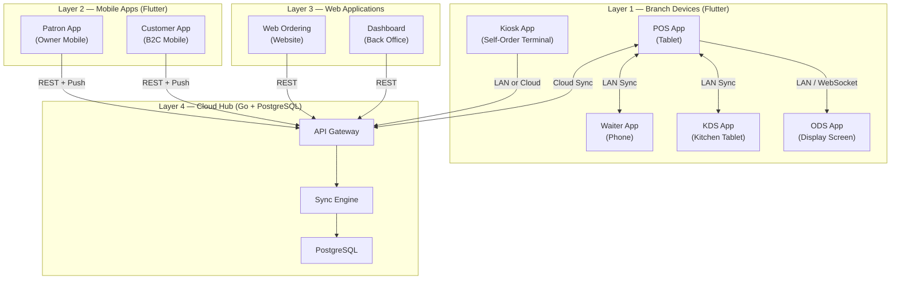
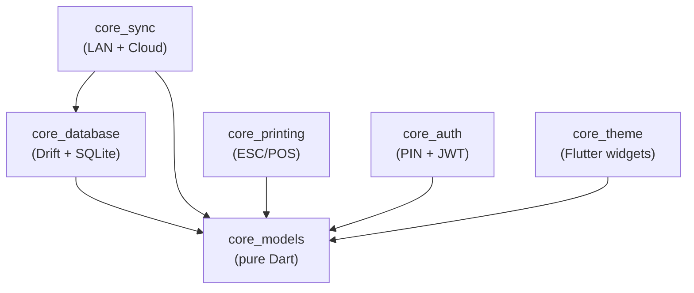
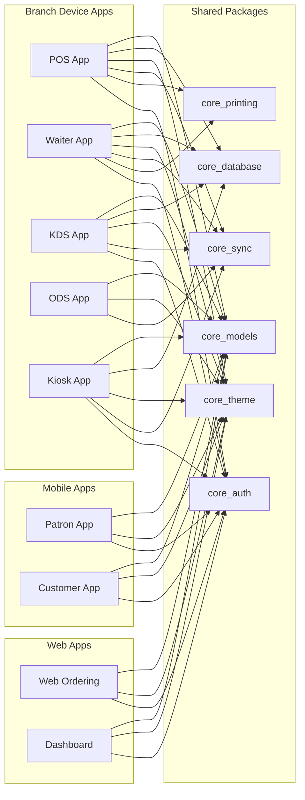
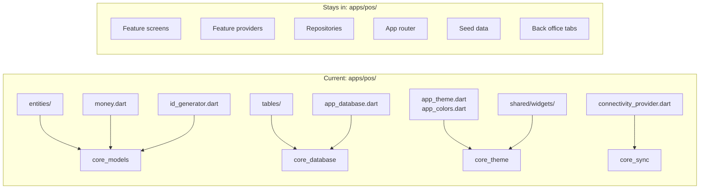
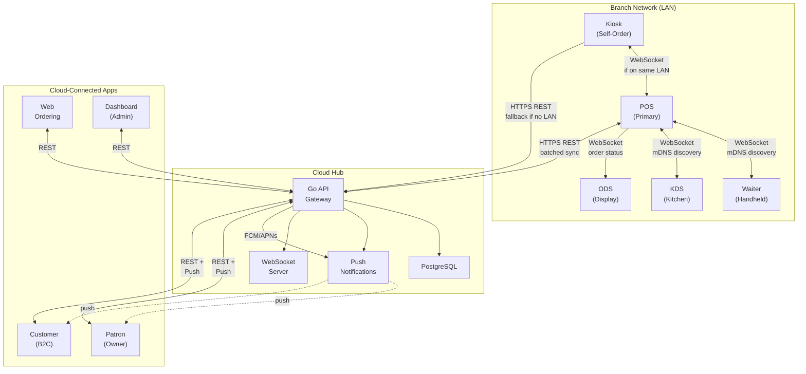
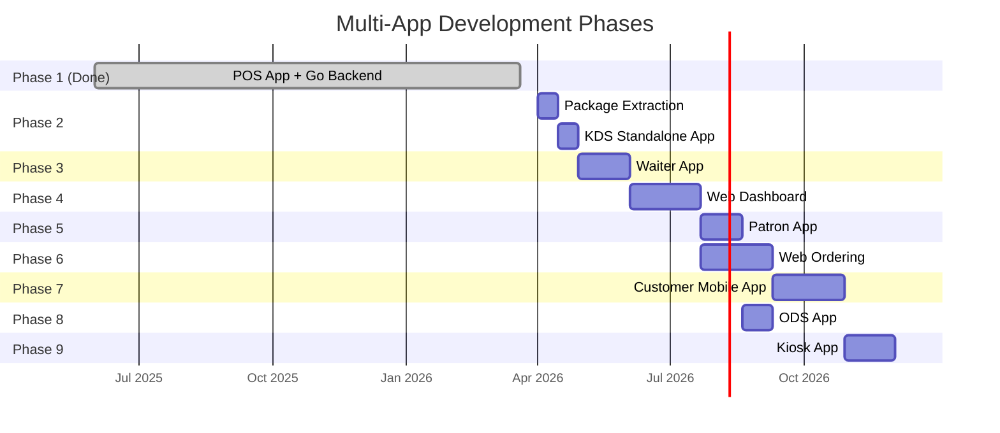
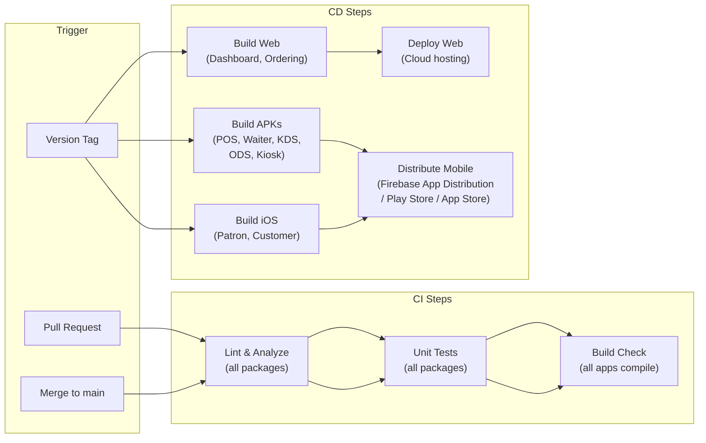

# 22 - Multi-App Architecture

> **Document Status:** Living document | **Last Updated:** 2026-03-20 | **Owner:** Architecture Team

---

## Table of Contents

1. [Overview](#1-overview)
2. [App Matrix](#2-app-matrix)
3. [Shared Code Strategy](#3-shared-code-strategy)
4. [Dependency Graph](#4-dependency-graph)
5. [App-by-App Specifications](#5-app-by-app-specifications)
6. [Shared Package Extraction Plan](#6-shared-package-extraction-plan)
7. [Communication Between Apps](#7-communication-between-apps)
8. [Phase Plan](#8-phase-plan)
9. [Build and Deployment](#9-build-and-deployment)

---

## 1. Overview

The GastroCore platform is a family of **9 applications** that share a common Dart/Flutter codebase, a unified domain model, and a single Go backend. Every application serves a distinct user role and device form factor, but all feed into the same order engine, menu catalog, and sync infrastructure.

The guiding principle is **"one menu, one kitchen, one reconciliation."** Whether a customer orders at the POS, from a kiosk, through a waiter's handheld, or via the web, the order follows the same path: it enters the order engine, routes to the correct kitchen station, and settles through the same payment and fiscal pipeline.

### Architecture Layers



---

## 2. App Matrix

| # | App | Package Path | Platform | Target Device | Primary User | Online/Offline | Priority Phase | Shared Code % |
|---|-----|-------------|----------|---------------|-------------|----------------|----------------|---------------|
| 1 | **POS** | `apps/pos/` | Android (Flutter) | 10" tablet | Cashier, Manager | Full offline | Phase 1 (done) | 60% (source of shared code) |
| 2 | **Waiter** | `apps/waiter/` | Android (Flutter) | Phone / 6" handheld | Waiter | Full offline | Phase 3 | 75% |
| 3 | **Patron** | `apps/patron/` | iOS + Android (Flutter) | Phone | Owner, Manager | Online only | Phase 5 | 40% |
| 4 | **KDS** | `apps/kds/` | Android (Flutter) | 10-15" tablet | Kitchen staff | LAN offline-safe | Phase 2 | 65% |
| 5 | **ODS** | `apps/ods/` | Android / Web (Flutter) | TV / large screen | Customers (passive) | LAN offline-safe | Phase 8 | 30% |
| 6 | **Kiosk** | `apps/kiosk/` | Android (Flutter) | 15"+ touch terminal | Customer (self-service) | Online required | Phase 9 | 55% |
| 7 | **Customer** | `apps/customer/` | iOS + Android (Flutter) | Phone | End customer | Online required | Phase 7 | 35% |
| 8 | **Web Ordering** | `web/ordering/` | Web (Flutter Web or React) | Browser (responsive) | End customer | Online required | Phase 6 | 25% |
| 9 | **Dashboard** | `web/dashboard/` | Web (Flutter Web or React) | Desktop browser | Owner, Admin | Online required | Phase 4 | 30% |

### Legend

- **Full offline**: App works indefinitely without any network connection. All transactions are stored locally and synced later.
- **LAN offline-safe**: App functions within the branch LAN. Internet is not required, but LAN connectivity to the POS primary device is expected.
- **Online required**: App requires an internet connection to function. Data comes from the cloud backend.

---

## 3. Shared Code Strategy

### 3.1 Monorepo Structure

```
gastrocore/
├── packages/                        # Shared Dart packages
│   ├── core_models/                 # Domain entities, enums, value objects
│   │   ├── lib/
│   │   │   ├── entities/            # All entity classes (shared across apps)
│   │   │   │   ├── tenant_entity.dart
│   │   │   │   ├── user_entity.dart
│   │   │   │   ├── category_entity.dart
│   │   │   │   ├── product_entity.dart
│   │   │   │   ├── modifier_entity.dart
│   │   │   │   ├── ticket_entity.dart
│   │   │   │   ├── order_item_entity.dart
│   │   │   │   ├── payment_entity.dart
│   │   │   │   ├── shift_entity.dart
│   │   │   │   ├── table_entity.dart
│   │   │   │   ├── kitchen_ticket_entity.dart
│   │   │   │   └── ...
│   │   │   ├── enums/               # All enums (ticket_status, payment_method, etc.)
│   │   │   │   ├── ticket_status.dart
│   │   │   │   ├── payment_method.dart
│   │   │   │   ├── order_type.dart
│   │   │   │   ├── kitchen_status.dart
│   │   │   │   └── ...
│   │   │   └── value_objects/       # Money, quantity, tax rate
│   │   │       ├── money.dart
│   │   │       └── ...
│   │   ├── test/
│   │   └── pubspec.yaml
│   │
│   ├── core_database/               # Drift tables, AppDatabase, DAOs
│   │   ├── lib/
│   │   │   ├── tables/              # All Drift table definitions
│   │   │   │   ├── tenants.dart
│   │   │   │   ├── users.dart
│   │   │   │   ├── categories.dart
│   │   │   │   ├── products.dart
│   │   │   │   ├── modifier_groups.dart
│   │   │   │   ├── modifiers.dart
│   │   │   │   ├── tickets.dart
│   │   │   │   ├── order_items.dart
│   │   │   │   ├── bills.dart
│   │   │   │   ├── payments.dart
│   │   │   │   ├── shifts.dart
│   │   │   │   ├── kitchen_tickets.dart
│   │   │   │   └── ...
│   │   │   ├── daos/                # Data Access Objects
│   │   │   │   ├── menu_dao.dart
│   │   │   │   ├── order_dao.dart
│   │   │   │   ├── payment_dao.dart
│   │   │   │   ├── shift_dao.dart
│   │   │   │   └── ...
│   │   │   ├── database.dart        # AppDatabase class definition
│   │   │   └── database.g.dart      # Generated code
│   │   ├── test/
│   │   └── pubspec.yaml
│   │
│   ├── core_theme/                  # Stitch design system, colors, typography
│   │   ├── lib/
│   │   │   ├── app_colors.dart      # Color palette (charcoal, teal, etc.)
│   │   │   ├── app_theme.dart       # ThemeData factory
│   │   │   ├── app_typography.dart  # Text styles
│   │   │   └── widgets/            # Shared UI components
│   │   │       ├── pos_button.dart
│   │   │       ├── pos_card.dart
│   │   │       ├── pos_badge.dart
│   │   │       ├── pos_text_field.dart
│   │   │       ├── pos_dialog.dart
│   │   │       ├── pos_numpad.dart
│   │   │       ├── pos_money_display.dart
│   │   │       ├── pos_top_bar.dart
│   │   │       ├── pos_empty_state.dart
│   │   │       ├── pos_loading.dart
│   │   │       └── pos_sync_indicator.dart
│   │   ├── test/
│   │   └── pubspec.yaml
│   │
│   ├── core_sync/                   # Sync engine, connectivity, outbox/inbox
│   │   ├── lib/
│   │   │   ├── sync_engine.dart     # Main sync orchestrator
│   │   │   ├── lan_sync.dart        # LAN discovery + WebSocket sync
│   │   │   ├── cloud_sync.dart      # HTTPS batched sync to cloud
│   │   │   ├── outbox.dart          # Outbox queue (pending changes)
│   │   │   ├── inbox.dart           # Inbox processor (incoming changes)
│   │   │   ├── conflict_resolver.dart
│   │   │   └── connectivity_monitor.dart
│   │   ├── test/
│   │   └── pubspec.yaml
│   │
│   ├── core_printing/               # ESC/POS printing abstraction
│   │   ├── lib/
│   │   │   ├── print_service.dart   # Abstraction layer
│   │   │   ├── receipt_builder.dart  # Receipt layout builder
│   │   │   ├── kitchen_ticket_builder.dart
│   │   │   ├── esc_pos_driver.dart   # ESC/POS protocol driver
│   │   │   └── printer_discovery.dart # Network printer discovery
│   │   ├── test/
│   │   └── pubspec.yaml
│   │
│   └── core_auth/                   # PIN auth, JWT, device identity
│       ├── lib/
│       │   ├── pin_auth.dart        # PIN-based staff authentication
│       │   ├── jwt_auth.dart        # JWT for cloud API calls
│       │   ├── device_identity.dart  # Device registration + fingerprint
│       │   └── role_permissions.dart  # Role-based access control
│       ├── test/
│       └── pubspec.yaml
│
├── apps/
│   ├── pos/                         # Main POS (EXISTING — 87 files, 25,410 lines)
│   ├── waiter/                      # Waiter handheld
│   ├── patron/                      # Owner dashboard mobile
│   ├── kds/                         # Kitchen display
│   ├── ods/                         # Order status display
│   ├── kiosk/                       # Self-order kiosk
│   └── customer/                    # B2C customer app
│
├── web/
│   ├── ordering/                    # Online ordering website
│   └── dashboard/                   # Admin back office
│
├── server/                          # Go backend (EXISTING)
├── docs/                            # Architecture docs (EXISTING — 22 documents)
├── melos.yaml                       # Melos workspace configuration
└── pubspec.yaml                     # Root workspace pubspec
```

### 3.2 Package Responsibilities

| Package | Purpose | Used By |
|---------|---------|---------|
| `core_models` | Domain entities, enums, value objects. Zero Flutter dependency -- pure Dart. | All 9 apps |
| `core_database` | Drift table definitions, database class, DAOs. Depends on `core_models`. | POS, Waiter, KDS, ODS, Kiosk |
| `core_theme` | Design tokens (colors, typography), shared widgets. Depends on Flutter. | All Flutter apps (7 apps) |
| `core_sync` | Sync engine (LAN + cloud), outbox/inbox, conflict resolution. | POS, Waiter, KDS, ODS, Kiosk |
| `core_printing` | ESC/POS receipt and kitchen ticket printing. | POS, Waiter, KDS, Kiosk |
| `core_auth` | PIN login, JWT tokens, device identity, role permissions. | All 9 apps |

### 3.3 Package Design Principles

1. **core_models is pure Dart.** No Flutter, no Drift, no platform dependencies. Any Dart program (including the Go backend code generators) can depend on it.

2. **core_database depends only on core_models + Drift.** Apps that do not need a local SQLite database (Patron, Customer, Web) do not import this package.

3. **core_theme owns all visual tokens.** No app defines its own colors or text styles. Theme variants (e.g., KDS high-contrast mode, Kiosk large-touch mode) are exposed as named constructors or theme extensions within core_theme.

4. **core_sync is the single source of truth for data synchronization.** Both LAN sync (mDNS + WebSocket) and cloud sync (HTTPS batched) live here. Apps configure which sync channels they use.

5. **Packages never depend on apps.** Dependency flows strictly from apps to packages, never the reverse.

---

## 4. Dependency Graph

### 4.1 Package Dependencies



### 4.2 App-to-Package Dependencies



### 4.3 Dependency Matrix

| App | core_models | core_database | core_theme | core_sync | core_printing | core_auth |
|-----|:-----------:|:-------------:|:----------:|:---------:|:-------------:|:---------:|
| POS | Yes | Yes | Yes | Yes (LAN + Cloud) | Yes | Yes (PIN) |
| Waiter | Yes | Yes | Yes | Yes (LAN + Cloud) | Yes (kitchen print) | Yes (PIN) |
| KDS | Yes | Yes | Yes | Yes (LAN only) | No | Yes (PIN) |
| ODS | Yes | No | Yes | Yes (LAN only) | No | No |
| Kiosk | Yes | Yes | Yes | Yes (LAN or Cloud) | Yes (receipt) | Yes (device) |
| Patron | Yes | No | Yes | No | No | Yes (JWT) |
| Customer | Yes | No | Yes | No | No | Yes (JWT) |
| Web Ordering | Yes | No | Yes | No | No | Yes (JWT) |
| Dashboard | Yes | No | Yes | No | No | Yes (JWT) |

---

## 5. App-by-App Specifications

---

### 5.1 POS App (Tablet)

**Target user:** Cashiers and managers who operate the primary point of sale.
**Use case:** Full restaurant operations -- order taking, table management, payments, shifts, kitchen routing, reports, and back office configuration.

| Attribute | Detail |
|-----------|--------|
| **Package path** | `apps/pos/` |
| **Platform** | Android (Flutter) |
| **Target device** | 10" Android tablet (landscape) |
| **Status** | BUILT -- 87 Dart files, 25,410 lines |
| **Offline capability** | Full offline (works indefinitely without network) |
| **Phase** | Phase 1 (complete) |
| **Estimated effort** | Done |

**Key Screens:**
- PIN Login (`pin_login_screen.dart`)
- Shift Open / Close (`shift_open_screen.dart`, `shift_close_screen.dart`)
- Main POS / Order Entry (`pos_screen.dart`)
- Modifier Selection Dialog (`modifier_dialog.dart`)
- Floor Plan / Table View (`floor_plan_screen.dart`)
- Payment (`payment_screen.dart`)
- Split Bill (`split_bill_screen.dart`)
- Receipt Preview (`receipt_preview_screen.dart`)
- Refund (`refund_screen.dart`)
- Kitchen Display (`kitchen_display_screen.dart`)
- Order History (`order_history_screen.dart`)
- Back Office (`back_office_screen.dart`) -- tabs: menu, tables, reports, staff
- Settings (`settings_screen.dart`)

**Shared packages:** core_models, core_database, core_theme, core_sync, core_printing, core_auth

**Unique features (stay in apps/pos):**
- Full order entry screen with category/product grid + order panel
- Table management with drag-and-drop floor plan
- Shift management (open/close with cash counting)
- Split bill logic
- Back office tabs (menu CRUD, staff management, reports)
- POS-specific routing and navigation

**Data flow:**
```
User input → Local SQLite → LAN sync (to KDS, Waiter, other POS) → Cloud sync (when online)
Cloud → SQLite (menu updates, config changes, license status)
```

---

### 5.2 Waiter App (Handheld)

**Target user:** Waiters taking orders at tableside using a phone or small handheld device.
**Use case:** Quick order entry -- tap a table, add items with modifiers, send to kitchen, move to the next table.

| Attribute | Detail |
|-----------|--------|
| **Package path** | `apps/waiter/` |
| **Platform** | Android (Flutter) |
| **Target device** | Phone or 6" handheld (portrait) |
| **Status** | Not started |
| **Offline capability** | Full offline (syncs via LAN to POS primary, cloud as fallback) |
| **Phase** | Phase 3 |
| **Estimated effort** | 4-6 person-weeks |

**Key Screens:**
- PIN Login (reuse from core_auth)
- Table List (compact grid showing status: free / occupied / needs attention)
- Quick Order Screen (category tabs + product list + running order)
- Modifier Selection (bottom sheet, touch-friendly)
- Order Summary / Send Confirmation
- Table Detail (current order items, bill preview)
- Call Manager (alert notification)

**Shared packages:** core_models, core_database, core_theme, core_sync, core_printing, core_auth

**Unique features:**
- Portrait-first, one-handed UI layout
- Compact product grid optimized for phone screen
- Swipe gestures for quick actions (swipe to send, swipe to void)
- Haptic feedback for confirmations
- Simplified navigation (no shift management, no reports, no back office)
- "Quick reorder" button for common items

**Data flow:**
```
Waiter input → Local SQLite → LAN sync to POS primary → POS routes to KDS
If no LAN: → Cloud sync → Cloud pushes to POS primary
```

**Offline capability:** Full offline. The waiter app maintains its own SQLite database. Orders created offline are queued in the outbox and synced when LAN connectivity is restored. The waiter can continue taking orders even if the POS primary device is temporarily unreachable.

---

### 5.3 Patron / Owner App (Mobile)

**Target user:** Restaurant owner or manager who wants to monitor business performance remotely.
**Use case:** Real-time dashboard showing today's sales, order count, revenue, staff performance, and alerts.

| Attribute | Detail |
|-----------|--------|
| **Package path** | `apps/patron/` |
| **Platform** | iOS + Android (Flutter) |
| **Target device** | Phone |
| **Status** | Not started |
| **Offline capability** | Online only (no local database) |
| **Phase** | Phase 5 |
| **Estimated effort** | 3-4 person-weeks |

**Key Screens:**
- Login (email/password + JWT)
- Dashboard Home (today's KPIs: revenue, orders, avg ticket, covers)
- Sales Chart (hourly / daily / weekly line chart)
- Branch Selector (for multi-branch enterprises)
- Order Feed (live stream of orders as they come in)
- Staff Performance (orders per waiter, avg service time)
- Alerts & Notifications (shift opened/closed, high void rate, low stock)
- Settings (notification preferences, branch config)

**Shared packages:** core_models, core_theme, core_auth

**Unique features:**
- Real-time data via REST polling or WebSocket push
- Push notifications (FCM for Android, APNs for iOS)
- Charts and data visualizations (fl_chart or similar)
- Read-only: this app cannot modify menu, take orders, or manage staff
- Multi-branch aggregation view
- KPI alert thresholds (configurable)

**Data flow:**
```
Cloud API (REST) → App displays
Push notifications ← Cloud (shift events, KPI alerts)
```

---

### 5.4 KDS App (Kitchen Display)

**Target user:** Kitchen staff and bar staff who prepare orders.
**Use case:** Displays incoming order tickets with prep timers, station filtering, and bump-to-complete functionality.

| Attribute | Detail |
|-----------|--------|
| **Package path** | `apps/kds/` |
| **Platform** | Android (Flutter) |
| **Target device** | 10-15" tablet (landscape), wall-mounted |
| **Status** | KDS screen exists inside POS app -- needs extraction to standalone |
| **Offline capability** | LAN offline-safe (no internet required, syncs via LAN to POS) |
| **Phase** | Phase 2 |
| **Estimated effort** | 2-3 person-weeks |

**Key Screens:**
- Station Select (one-time setup: kitchen, bar, dessert, grill, etc.)
- Ticket Board (main screen -- grid of active tickets with timers)
- Ticket Detail (tap to expand -- full item list with modifiers)
- History (recently bumped tickets -- last 2 hours)
- Settings (station assignment, timer thresholds, sound settings)

**Shared packages:** core_models, core_database, core_theme, core_sync, core_auth

**Unique features:**
- High-contrast UI (white text on dark background, large fonts)
- Prep timer per ticket with color-coded urgency (green / yellow / red)
- Bump button: large, easy to tap with wet/gloved hands
- Course management (fire next course)
- Sound alerts: distinct sounds for new order, priority item, overdue ticket
- Station filtering: each KDS instance shows only tickets for its station
- Auto-rotate through tickets if more than fit on screen
- No keyboard input -- fully touch-driven
- Screen burn-in prevention (subtle animations)

**Data flow:**
```
POS / Waiter → LAN sync → KDS receives kitchen tickets
KDS bump action → LAN sync → POS updates ticket status
```

**Extraction from POS:** The existing `kitchen_display_screen.dart` in the POS app serves as a starting point. The standalone KDS app will expand this with dedicated station management, persistent settings, sound alerts, and the multi-ticket board layout. See Section 6 for the extraction plan.

---

### 5.5 ODS App (Order Display Screen)

**Target user:** Customers in fast-food or takeaway restaurants who wait for their order.
**Use case:** Large display showing order numbers and their preparation status.

| Attribute | Detail |
|-----------|--------|
| **Package path** | `apps/ods/` |
| **Platform** | Android or Web (Flutter) |
| **Target device** | TV screen or large monitor (landscape) |
| **Status** | Not started |
| **Offline capability** | LAN offline-safe (receives data via LAN sync or WebSocket) |
| **Phase** | Phase 8 |
| **Estimated effort** | 2-3 person-weeks |

**Key Screens:**
- Order Status Board (main display -- two columns: "Preparing" and "Ready")
- Setup / Configuration (admin-only: branch, display options, branding)

**Shared packages:** core_models, core_theme, core_sync

**Unique features:**
- Passive display: no user interaction during normal operation
- Large, high-contrast order numbers visible from 5+ meters
- Auto-scroll when many orders are queued
- Optional estimated wait time per order
- Animated transitions when order moves from "Preparing" to "Ready"
- Sound chime when order is ready
- Configurable branding (restaurant logo, colors)
- Screen saver / promotional slideshow when idle
- No local database -- receives order status updates via sync only

**Data flow:**
```
POS / KDS → LAN sync or WebSocket → ODS displays status
```

---

### 5.6 Kiosk App (Self-Order)

**Target user:** Customers who order directly at a self-service terminal.
**Use case:** Browse menu, build order, pay by card, receive order number.

| Attribute | Detail |
|-----------|--------|
| **Package path** | `apps/kiosk/` |
| **Platform** | Android (Flutter) |
| **Target device** | 15"+ vertical touch terminal |
| **Status** | Not started |
| **Offline capability** | Online required (payment processing requires connectivity) |
| **Phase** | Phase 9 |
| **Estimated effort** | 4-6 person-weeks |

**Key Screens:**
- Idle / Attract Screen (promotional slideshow, "Tap to Order" prompt)
- Language Selection (DE / FR / EN / IT for Swiss market)
- Order Type Selection (Dine-in / Takeaway)
- Menu Browser (large category tiles + product cards with images)
- Product Detail (image, description, modifiers, quantity)
- Cart / Order Summary
- Payment (card terminal integration screen)
- Order Confirmation (order number, estimated time, receipt option)
- Timeout Warning ("Are you still there?" after inactivity)

**Shared packages:** core_models, core_database, core_theme, core_sync, core_printing, core_auth

**Unique features:**
- Large touch targets (minimum 60px) for accessibility
- No cash handling -- card-only payment via terminal integration
- Inactivity timeout with warning (configurable, default 120 seconds)
- Idle attract screen with promotion carousel
- Kiosk lock mode (prevents exit to Android home)
- Receipt printing (optional -- connected receipt printer)
- Multi-language support with language picker
- Allergen and dietary info display
- Order flows into the same order engine as POS orders

**Data flow:**
```
Customer browses menu (from local DB, synced from cloud)
Customer places order → Local DB → Sync to POS (via LAN or Cloud)
Payment → Card terminal → Payment confirmation → Order confirmed
```

---

### 5.7 Customer Mobile App (B2C)

**Target user:** End customers who order delivery or pickup from their phone.
**Use case:** Browse restaurant menu, place orders, track order status, view history, earn loyalty points.

| Attribute | Detail |
|-----------|--------|
| **Package path** | `apps/customer/` |
| **Platform** | iOS + Android (Flutter) |
| **Target device** | Phone |
| **Status** | Not started |
| **Offline capability** | Online required |
| **Phase** | Phase 7 |
| **Estimated effort** | 6-8 person-weeks |

**Key Screens:**
- Onboarding / Welcome
- Login / Register (email, phone, social)
- Restaurant Menu Browser (categories, products with images)
- Product Detail (modifiers, special instructions, add to cart)
- Cart
- Checkout (delivery address, payment method, scheduled time)
- Order Tracking (real-time status: received / preparing / ready / out for delivery)
- Order History
- Reorder (one-tap reorder from history)
- Profile & Settings
- Notifications Center
- Loyalty (future -- points balance, rewards)

**Shared packages:** core_models, core_theme, core_auth

**Unique features:**
- Customer-facing design (friendly, consumer-grade UI -- not "POS style")
- Push notifications for order status changes and promotions
- Address management for delivery
- Payment integration (Stripe, Twint for Swiss market)
- Real-time order tracking with status updates
- Restaurant info (hours, location, contact)
- Deep links from marketing campaigns

**Data flow:**
```
Customer browses → Cloud API (menu data)
Customer places order → Cloud API → Cloud syncs to POS at branch
Order status updates → Cloud pushes to customer app
```

---

### 5.8 Web Ordering (Website)

**Target user:** End customers who order via the restaurant's website or a QR code scan.
**Use case:** Web-based menu browsing and ordering, accessible without installing an app.

| Attribute | Detail |
|-----------|--------|
| **Package path** | `web/ordering/` |
| **Platform** | Web (Flutter Web or React -- see note below) |
| **Target device** | Browser (responsive: mobile + desktop) |
| **Status** | Not started |
| **Offline capability** | Online required |
| **Phase** | Phase 6 |
| **Estimated effort** | 6-8 person-weeks |

**Key Screens:**
- Landing / Restaurant Page (logo, hours, "Order Now" CTA)
- Menu Browser (categories + products, responsive grid)
- Product Detail (modifiers, special instructions)
- Cart (slide-out panel on desktop, full-screen on mobile)
- Checkout (guest or logged-in, delivery/pickup, payment)
- Order Confirmation (order number, estimated time)
- Order Tracking (optional -- status updates)

**Shared packages:** core_models, core_theme, core_auth (if Flutter Web)

**Unique features:**
- QR code support: scanning a table QR code opens the web menu with the table pre-linked; orders placed this way are automatically assigned to the correct table in the POS
- Embeddable widget mode: restaurant can embed the ordering widget on their existing website via iframe
- SEO optimization (critical for discoverability -- may favor React/Next.js over Flutter Web)
- Responsive design (single codebase for mobile and desktop browsers)
- No app installation required
- Guest checkout (no account required)
- Share menu via link

**Technology decision:**
- **Flutter Web**: Maximizes shared code with other Flutter apps. Good for app-like experience. Poor SEO (canvas rendering).
- **React / Next.js**: Better SEO, faster initial load, smaller bundle. Less code sharing with Flutter apps. Needs to consume core_models via code generation (Go backend generates TypeScript types).
- **Recommendation**: Use Flutter Web for the initial MVP for maximum code reuse. If SEO becomes a critical acquisition channel, consider a React/Next.js rewrite of the public-facing pages with Flutter Web for the authenticated ordering flow.

**Data flow:**
```
Customer visits URL (or scans QR code) → Browser loads web app
Menu data ← Cloud API
Customer places order → Cloud API → Cloud syncs to POS at branch
If QR table order: order is linked to table_id from QR payload
```

---

### 5.9 Dashboard / Back Office (Web)

**Target user:** Restaurant owner or admin managing the business from a desktop computer.
**Use case:** Full administration -- menu CRUD, staff management, reports, multi-branch management, device health, license management.

| Attribute | Detail |
|-----------|--------|
| **Package path** | `web/dashboard/` |
| **Platform** | Web (Flutter Web or React) |
| **Target device** | Desktop browser |
| **Status** | Not started |
| **Offline capability** | Online required |
| **Phase** | Phase 4 |
| **Estimated effort** | 6-8 person-weeks |

**Key Screens:**
- Login (email/password)
- Dashboard Home (KPIs, today's summary, quick actions)
- Menu Management (full CRUD: categories, products, modifiers, images, pricing)
- Staff Management (add/edit users, PIN assignment, role assignment)
- Reports & Analytics (sales reports, product mix, hourly trends, charts, CSV export)
- Branch Management (multi-branch: add/configure branches, compare performance)
- Device Management (list all registered tablets, online/offline status, last sync time)
- License / Subscription Management (current plan, billing, feature flags)
- Settings (tax rates, receipt templates, printer configuration, country pack settings)
- Audit Log (view staff actions, modifications, security events)

**Shared packages:** core_models, core_theme, core_auth

**Unique features:**
- Desktop-first layout with sidebar navigation
- Rich data tables with sorting, filtering, pagination
- Image upload for products (with cloud storage integration)
- Chart library (sales trends, product mix pie chart, hourly heatmap)
- CSV / PDF export for reports
- Real-time device health monitoring
- Multi-tenant: super-admin can manage multiple restaurant tenants
- Bulk operations (bulk price update, bulk category assignment)

**Technology decision:**
- Same considerations as Web Ordering. Flutter Web provides code sharing; React provides better developer tooling for data-heavy admin panels.
- **Recommendation**: Flutter Web for MVP, evaluate React migration if the admin panel grows significantly complex.

**Data flow:**
```
Admin actions → Cloud API → Cloud updates PostgreSQL
Cloud pushes config changes to POS devices on next sync
Reports ← Cloud API (aggregated from synced transaction data)
```

---

## 6. Shared Package Extraction Plan

The existing POS app at `apps/pos/` contains code that must be extracted into shared packages before other apps can be built. This section maps every relevant file to its destination.

### 6.1 Extraction Overview



### 6.2 What Moves to core_models

**Source:** `apps/pos/lib/features/*/domain/entities/` and `apps/pos/lib/core/`

| Current Location | Target in core_models | Notes |
|-----------------|----------------------|-------|
| `features/auth/domain/entities/user_entity.dart` | `lib/entities/user_entity.dart` | |
| `features/menu/domain/entities/category_entity.dart` | `lib/entities/category_entity.dart` | |
| `features/menu/domain/entities/product_entity.dart` | `lib/entities/product_entity.dart` | |
| `features/menu/domain/entities/modifier_entity.dart` | `lib/entities/modifier_entity.dart` | |
| `features/orders/domain/entities/ticket_entity.dart` | `lib/entities/ticket_entity.dart` | |
| `features/orders/domain/entities/order_item_entity.dart` | `lib/entities/order_item_entity.dart` | |
| `features/payments/domain/entities/payment_entity.dart` | `lib/entities/payment_entity.dart` | |
| `features/shifts/domain/entities/shift_entity.dart` | `lib/entities/shift_entity.dart` | |
| `features/tables/domain/entities/table_entity.dart` | `lib/entities/table_entity.dart` | |
| `features/kitchen/domain/entities/kitchen_ticket_entity.dart` | `lib/entities/kitchen_ticket_entity.dart` | |
| `core/utils/money.dart` | `lib/value_objects/money.dart` | |
| `core/utils/id_generator.dart` | `lib/utils/id_generator.dart` | UUID v7 generation |
| `core/constants/app_constants.dart` | `lib/constants/app_constants.dart` | Only shared constants; POS-specific ones stay |
| `core/error/failures.dart` | `lib/errors/failures.dart` | |
| `core/error/exceptions.dart` | `lib/errors/exceptions.dart` | |

All enums embedded in entity files will be extracted to individual files under `lib/enums/`.

### 6.3 What Moves to core_database

**Source:** `apps/pos/lib/core/database/`

| Current Location | Target in core_database | Notes |
|-----------------|------------------------|-------|
| `core/database/tables/tenants.dart` | `lib/tables/tenants.dart` | |
| `core/database/tables/users.dart` | `lib/tables/users.dart` | |
| `core/database/tables/categories.dart` | `lib/tables/categories.dart` | |
| `core/database/tables/products.dart` | `lib/tables/products.dart` | |
| `core/database/tables/modifier_groups.dart` | `lib/tables/modifier_groups.dart` | |
| `core/database/tables/modifiers.dart` | `lib/tables/modifiers.dart` | |
| `core/database/tables/product_modifier_groups.dart` | `lib/tables/product_modifier_groups.dart` | |
| `core/database/tables/floors.dart` | `lib/tables/floors.dart` | |
| `core/database/tables/restaurant_tables.dart` | `lib/tables/restaurant_tables.dart` | |
| `core/database/tables/tickets.dart` | `lib/tables/tickets.dart` | |
| `core/database/tables/order_items.dart` | `lib/tables/order_items.dart` | |
| `core/database/tables/order_item_modifiers.dart` | `lib/tables/order_item_modifiers.dart` | |
| `core/database/tables/bills.dart` | `lib/tables/bills.dart` | |
| `core/database/tables/payments.dart` | `lib/tables/payments.dart` | |
| `core/database/tables/shifts.dart` | `lib/tables/shifts.dart` | |
| `core/database/tables/cash_movements.dart` | `lib/tables/cash_movements.dart` | |
| `core/database/tables/kitchen_tickets.dart` | `lib/tables/kitchen_tickets.dart` | |
| `core/database/tables/kitchen_ticket_items.dart` | `lib/tables/kitchen_ticket_items.dart` | |
| `core/database/tables/receipts.dart` | `lib/tables/receipts.dart` | |
| `core/database/tables/sync_queue.dart` | `lib/tables/sync_queue.dart` | |
| `core/database/tables/sync_metadata.dart` | `lib/tables/sync_metadata.dart` | |
| `core/database/tables/audit_log.dart` | `lib/tables/audit_log.dart` | |
| `core/database/app_database.dart` | `lib/database.dart` | Base AppDatabase; apps extend if needed |

**Important:** The generated file `app_database.g.dart` will be regenerated inside core_database after the table files are moved. Each app that uses core_database gets the same base schema. Apps that need additional tables (unlikely) can define them locally and compose with the shared database.

### 6.4 What Moves to core_theme

**Source:** `apps/pos/lib/core/theme/` and `apps/pos/lib/shared/widgets/`

| Current Location | Target in core_theme | Notes |
|-----------------|---------------------|-------|
| `core/theme/app_colors.dart` | `lib/app_colors.dart` | |
| `core/theme/app_theme.dart` | `lib/app_theme.dart` | Add named constructors for variants |
| `shared/widgets/pos_button.dart` | `lib/widgets/pos_button.dart` | |
| `shared/widgets/pos_card.dart` | `lib/widgets/pos_card.dart` | |
| `shared/widgets/pos_badge.dart` | `lib/widgets/pos_badge.dart` | |
| `shared/widgets/pos_text_field.dart` | `lib/widgets/pos_text_field.dart` | |
| `shared/widgets/pos_dialog.dart` | `lib/widgets/pos_dialog.dart` | |
| `shared/widgets/pos_numpad.dart` | `lib/widgets/pos_numpad.dart` | |
| `shared/widgets/pos_money_display.dart` | `lib/widgets/pos_money_display.dart` | |
| `shared/widgets/pos_top_bar.dart` | `lib/widgets/pos_top_bar.dart` | |
| `shared/widgets/pos_empty_state.dart` | `lib/widgets/pos_empty_state.dart` | |
| `shared/widgets/pos_loading.dart` | `lib/widgets/pos_loading.dart` | |
| `shared/widgets/pos_sync_indicator.dart` | `lib/widgets/pos_sync_indicator.dart` | |

**Theme variants to add:**
- `AppTheme.pos()` -- current theme (landscape tablet, dark sidebar)
- `AppTheme.waiter()` -- compact variant (portrait phone, larger touch targets)
- `AppTheme.kds()` -- high-contrast dark theme (large text, bold colors)
- `AppTheme.ods()` -- minimal display theme (very large order numbers)
- `AppTheme.kiosk()` -- consumer-friendly theme (rounded corners, large images)
- `AppTheme.customer()` -- consumer mobile theme (light, friendly)

### 6.5 What Stays in apps/pos/

These files are POS-specific and remain in the POS app:

| Category | Files |
|----------|-------|
| **Feature screens** | `pos_screen.dart`, `payment_screen.dart`, `split_bill_screen.dart`, `receipt_preview_screen.dart`, `refund_screen.dart`, `floor_plan_screen.dart`, `kitchen_display_screen.dart`, `shift_open_screen.dart`, `shift_close_screen.dart`, `order_history_screen.dart`, `pin_login_screen.dart`, `settings_screen.dart` |
| **Back office** | `back_office_screen.dart`, `menu_management_tab.dart`, `table_management_tab.dart`, `reports_tab.dart`, `staff_management_tab.dart` |
| **Feature providers** | `auth_provider.dart`, `menu_provider.dart`, `order_provider.dart`, `shift_provider.dart`, `table_provider.dart` |
| **Repositories** | `auth_repository_impl.dart`, `menu_repository_impl.dart`, `order_repository_impl.dart`, `payment_repository_impl.dart`, `shift_repository_impl.dart`, `table_repository_impl.dart` |
| **App scaffold** | `main.dart`, `app.dart`, `app_router.dart`, `providers.dart` |
| **Data** | `seed_data.dart`, `app_initializer.dart` |

### 6.6 Extraction Steps

The extraction follows a strict sequence to avoid breaking the working POS app:

```
Step 1: Create package scaffolds
  └── Create pubspec.yaml for each of the 6 packages
  └── Set up Melos workspace configuration

Step 2: Extract core_models (no dependencies)
  └── Move entity files, enums, value objects
  └── Update imports in POS app to point to core_models
  └── Run tests -- POS must still compile and pass

Step 3: Extract core_database (depends on core_models)
  └── Move table definitions and database class
  └── Regenerate Drift code inside core_database
  └── Update imports in POS app
  └── Run tests

Step 4: Extract core_theme (depends on core_models)
  └── Move colors, theme, shared widgets
  └── Update imports in POS app
  └── Run tests

Step 5: Extract core_auth (depends on core_models)
  └── Extract PIN auth logic from auth_repository_impl
  └── Create core_auth abstractions
  └── POS app's auth repository delegates to core_auth
  └── Run tests

Step 6: Extract core_sync (depends on core_models + core_database)
  └── Extract connectivity provider
  └── Create sync engine abstraction
  └── Extract outbox/inbox logic from sync tables
  └── Run tests

Step 7: Create core_printing (depends on core_models)
  └── Create ESC/POS abstraction (new code, not much to extract yet)
  └── Run tests

Step 8: Verify complete POS app
  └── Full regression test
  └── Build APK and verify on device
```

---

## 7. Communication Between Apps

### 7.1 Communication Map



### 7.2 Communication Protocols

| Route | Protocol | Direction | Latency | Notes |
|-------|----------|-----------|---------|-------|
| POS <-> Waiter | WebSocket (LAN) | Bidirectional | <50ms | mDNS device discovery; full mesh within branch |
| POS <-> KDS | WebSocket (LAN) | Bidirectional | <50ms | KDS subscribes to kitchen ticket events |
| POS -> ODS | WebSocket (LAN) | POS pushes to ODS | <50ms | ODS is read-only, receives order status |
| POS <-> Cloud | HTTPS REST | Bidirectional (batched) | 100-500ms | Outbox/inbox pattern; batches of 50 records |
| Kiosk <-> POS | WebSocket (LAN) or REST (Cloud) | Bidirectional | <50ms (LAN) | Prefers LAN if available; falls back to cloud |
| Cloud -> Patron | REST + FCM/APNs | Cloud pushes | 1-5s | Push notifications for alerts; REST for data |
| Cloud -> Customer | REST + FCM/APNs | Cloud pushes | 1-5s | Order status updates via push |
| Cloud <-> Web Ordering | REST | Bidirectional | 100-300ms | Standard REST API |
| Cloud <-> Dashboard | REST | Bidirectional | 100-300ms | Standard REST API |

### 7.3 LAN Sync Detail

All branch-local communication uses the sync engine defined in [10-sync-engine.md](./10-sync-engine.md):

1. **Discovery**: Devices find each other via mDNS on the local network. The POS primary device broadcasts its presence. Secondary devices (Waiter, KDS, ODS) discover and connect.

2. **Connection**: WebSocket connections are established between devices. The POS primary acts as the hub in a star topology for data routing.

3. **Data flow**: Changes are propagated via the outbox/inbox pattern. Each change is a versioned record with a ULID. Conflict resolution uses last-writer-wins with vector clocks for critical entities.

4. **Failure handling**: If the POS primary goes offline, secondary devices continue operating independently. When the primary returns, all queued changes are reconciled.

### 7.4 Cloud Sync Detail

Cloud sync follows the same outbox/inbox pattern as LAN sync but over HTTPS:

1. **Upload**: POS batches pending outbox records and POSTs them to the cloud API.
2. **Download**: POS polls for new inbox records from the cloud (menu updates, config changes).
3. **Frequency**: Every 30 seconds when online, with exponential backoff on failure.
4. **Payload**: JSON-serialized domain events with full entity snapshots.

### 7.5 Data Ownership and Authority

| Data Type | Source of Truth | Direction |
|-----------|----------------|-----------|
| Menu, Products, Categories | Cloud (edited via Dashboard or POS Back Office) | Cloud -> POS -> Waiter, KDS, Kiosk |
| Orders, Tickets | Creating device (POS, Waiter, Kiosk, Web) | Device -> Cloud |
| Payments | Creating device (POS, Kiosk) | Device -> Cloud |
| Shifts | POS | POS -> Cloud |
| Kitchen Tickets | POS (generated from orders) | POS -> KDS (LAN) |
| Order Status | KDS (bumped), POS (paid) | KDS -> POS -> ODS, Cloud -> Customer/Web |
| Staff, Roles | Cloud (edited via Dashboard) | Cloud -> POS, Waiter |
| Branch Config | Cloud (edited via Dashboard) | Cloud -> All branch devices |
| License | Cloud | Cloud -> POS |

---

## 8. Phase Plan

### 8.1 Phase Overview



### 8.2 Phase Details

| Phase | Apps | Timeline | Prerequisites | Deliverables |
|-------|------|----------|---------------|-------------|
| **Phase 1** | POS App, Go Backend | Done | -- | Working POS with 87 Dart files; Go API server |
| **Phase 2** | Shared Package Extraction + KDS | 3-4 weeks | Phase 1 complete | 6 shared packages; standalone KDS app |
| **Phase 3** | Waiter App | 4-6 weeks | Phase 2 (shared packages) | Phone-optimized order-taking app |
| **Phase 4** | Web Dashboard | 6-8 weeks | Phase 2 (shared packages), Cloud API expansion | Full admin panel with menu CRUD, reports |
| **Phase 5** | Patron App | 3-4 weeks | Phase 4 (cloud APIs for reporting exist) | Owner mobile dashboard |
| **Phase 6** | Web Ordering | 6-8 weeks | Phase 4 (menu API, cloud order processing) | Online ordering website with QR support |
| **Phase 7** | Customer Mobile App | 6-8 weeks | Phase 6 (ordering API exists) | iOS + Android customer app |
| **Phase 8** | ODS App | 2-3 weeks | Phase 2 (sync infrastructure) | Order status display for fast-food |
| **Phase 9** | Kiosk App | 4-6 weeks | Phase 6 (ordering flow exists) | Self-service ordering terminal |

### 8.3 Phase Rationale

**Phase 2 (KDS) is first** because (a) the KDS screen already exists inside the POS app, making extraction the natural catalyst for shared package creation; and (b) KDS is the most-requested companion app from early pilot customers.

**Phase 3 (Waiter) follows** because it shares the most code with POS (same order engine, same sync, same database) and is the highest-value addition for full-service restaurants.

**Phase 4 (Dashboard) before Phase 5 (Patron)** because the dashboard creates the cloud APIs and admin infrastructure that the Patron app and Web Ordering both depend on.

**Phase 8 (ODS) and Phase 9 (Kiosk) are last** because they serve niche segments (fast-food, QSR) and can reuse all infrastructure built in earlier phases.

### 8.4 Effort Summary

| Phase | Effort (person-weeks) | Cumulative |
|-------|----------------------|------------|
| Phase 2: Package Extraction + KDS | 3-4 | 3-4 |
| Phase 3: Waiter | 4-6 | 7-10 |
| Phase 4: Dashboard | 6-8 | 13-18 |
| Phase 5: Patron | 3-4 | 16-22 |
| Phase 6: Web Ordering | 6-8 | 22-30 |
| Phase 7: Customer App | 6-8 | 28-38 |
| Phase 8: ODS | 2-3 | 30-41 |
| Phase 9: Kiosk | 4-6 | 34-47 |
| **Total** | **34-47 person-weeks** | |

---

## 9. Build and Deployment

### 9.1 Monorepo Tooling

The monorepo uses **Melos** for Dart/Flutter workspace management:

```yaml
# melos.yaml
name: gastrocore
packages:
  - packages/*
  - apps/*
  - web/*

command:
  bootstrap:
    usePubspecOverrides: true

scripts:
  analyze:
    run: melos exec -- "dart analyze ."
    description: Run dart analyze in all packages

  test:
    run: melos exec -- "flutter test"
    description: Run tests in all packages

  build:apk:pos:
    run: cd apps/pos && flutter build apk --release
    description: Build POS release APK

  build:apk:waiter:
    run: cd apps/waiter && flutter build apk --release
    description: Build Waiter release APK

  build:apk:kds:
    run: cd apps/kds && flutter build apk --release
    description: Build KDS release APK

  build:web:dashboard:
    run: cd web/dashboard && flutter build web --release
    description: Build Dashboard web app

  build:web:ordering:
    run: cd web/ordering && flutter build web --release
    description: Build Web Ordering app

  generate:
    run: melos exec --depends-on="build_runner" -- "dart run build_runner build --delete-conflicting-outputs"
    description: Run code generation (Drift, JSON serialization, etc.)
```

### 9.2 Dependency Resolution

All shared packages are referenced as **local path dependencies** in each app's `pubspec.yaml`:

```yaml
# apps/waiter/pubspec.yaml (example)
dependencies:
  flutter:
    sdk: flutter
  core_models:
    path: ../../packages/core_models
  core_database:
    path: ../../packages/core_database
  core_theme:
    path: ../../packages/core_theme
  core_sync:
    path: ../../packages/core_sync
  core_printing:
    path: ../../packages/core_printing
  core_auth:
    path: ../../packages/core_auth
```

This ensures all apps use the exact same version of shared code. There is no package publishing -- everything is resolved locally.

### 9.3 Versioning Strategy

All apps share a common **major.minor** version, with independent **patch** versions:

```
Format: MAJOR.MINOR.PATCH+BUILD

Example:
  POS       1.4.2+142
  Waiter    1.4.0+10
  KDS       1.4.1+35
  Dashboard 1.4.0+8
```

- **MAJOR**: Breaking changes to the data model or sync protocol (all apps must update together).
- **MINOR**: New features or shared package changes (all apps bump together to maintain compatibility).
- **PATCH**: App-specific bug fixes (independent per app).
- **BUILD**: Auto-incrementing CI build number.

### 9.4 CI/CD Pipeline



**CI (on every PR and merge):**
1. `melos bootstrap` -- install all dependencies
2. `melos run generate` -- run code generation
3. `melos run analyze` -- static analysis on all packages
4. `melos run test` -- run unit tests on all packages
5. Build check: verify that all apps compile without errors

**CD (on version tag):**
1. Build release APKs for Android apps (POS, Waiter, KDS, ODS, Kiosk)
2. Build release iOS apps (Patron, Customer)
3. Build web apps (Dashboard, Ordering)
4. Deploy web apps to cloud hosting (e.g., Firebase Hosting, Cloudflare Pages)
5. Distribute mobile apps via Firebase App Distribution (internal) or Play Store / App Store (production)

### 9.5 Build Matrix

| App | Build Target | Output | Distribution |
|-----|-------------|--------|-------------|
| POS | `flutter build apk` | APK | MDM / sideload to tablets |
| Waiter | `flutter build apk` | APK | MDM / Play Store |
| KDS | `flutter build apk` | APK | MDM / sideload to kitchen tablets |
| ODS | `flutter build apk` or `flutter build web` | APK or Web | Sideload or URL on display device |
| Kiosk | `flutter build apk` | APK | MDM / sideload to kiosk terminals |
| Patron | `flutter build apk` + `flutter build ios` | APK + IPA | Play Store + App Store |
| Customer | `flutter build apk` + `flutter build ios` | APK + IPA | Play Store + App Store |
| Web Ordering | `flutter build web` | Static files | Cloud hosting (CDN) |
| Dashboard | `flutter build web` | Static files | Cloud hosting (CDN) |

### 9.6 Environment Configuration

Each app has its own environment configuration, but shares common infrastructure settings:

```
environments/
├── dev.env          # Development (local backend, debug logging)
├── staging.env      # Staging (staging backend, production-like)
└── prod.env         # Production (production backend, crash reporting)
```

App-specific settings (e.g., kiosk timeout, KDS station defaults) are stored in the app's own configuration, not in environment files.

---

## Appendix A: Decision Log

| Decision | Choice | Rationale |
|----------|--------|-----------|
| Monorepo vs polyrepo | Monorepo with Melos | Atomic changes across shared packages and apps; single CI pipeline; easier refactoring |
| Shared code mechanism | Local path dependencies | Simplest approach; no package publishing overhead; guaranteed consistency |
| KDS as standalone app vs POS screen | Standalone app | Kitchen tablets are dedicated devices; standalone app allows kiosk mode, station filtering, and independent lifecycle |
| ODS technology | Flutter (Android or Web) | Reuses core_theme; runs on cheap Android TV sticks or in a browser on a smart TV |
| Waiter app offline strategy | Full offline with local SQLite | Waiters move through dead spots (kitchens, basements); must never lose an order |
| Web tech (Ordering + Dashboard) | Flutter Web first, evaluate React later | Maximizes code sharing now; SEO concerns can be addressed with SSR proxy or React migration if needed |
| Versioning | Shared major.minor, independent patch | Enforces sync protocol compatibility while allowing independent bug fixes |

## Appendix B: Risk Register (Multi-App Specific)

| Risk | Impact | Likelihood | Mitigation |
|------|--------|------------|------------|
| Shared package changes break multiple apps | High | Medium | CI builds all apps on every shared package change; comprehensive test suite |
| Flutter Web performance for Dashboard | Medium | Medium | Profile early; fall back to React if data table rendering is unacceptable |
| Melos workspace complexity as app count grows | Low | Medium | Keep package count minimal (6 shared packages); avoid micro-packages |
| KDS extraction breaks existing POS kitchen screen | Medium | Low | Step-by-step extraction with regression tests at each step |
| Sync conflicts between Waiter and POS | High | Medium | Conflict resolution is well-defined in sync engine (doc 10); vector clocks on critical entities |
| App Store review delays for Patron / Customer | Medium | Medium | Build in 2-week buffer for App Store review cycles; use TestFlight / Firebase App Distribution for early testing |

## Appendix C: Cross-References

| Topic | Document |
|-------|----------|
| System architecture (3-layer model) | [03-target-architecture.md](./03-target-architecture.md) |
| Module map and bounded contexts | [04-module-map.md](./04-module-map.md) |
| Domain model (all entities) | [05-domain-model.md](./05-domain-model.md) |
| Sync engine design | [10-sync-engine.md](./10-sync-engine.md) |
| API contracts | [11-api-contracts.md](./11-api-contracts.md) |
| Data model (database schema) | [12-data-model.md](./12-data-model.md) |
| UX flows | [13-ux-flows.md](./13-ux-flows.md) |
| Product roadmap (feature-level) | [17-roadmap.md](./17-roadmap.md) |
| Security and compliance | [15-security-compliance.md](./15-security-compliance.md) |
